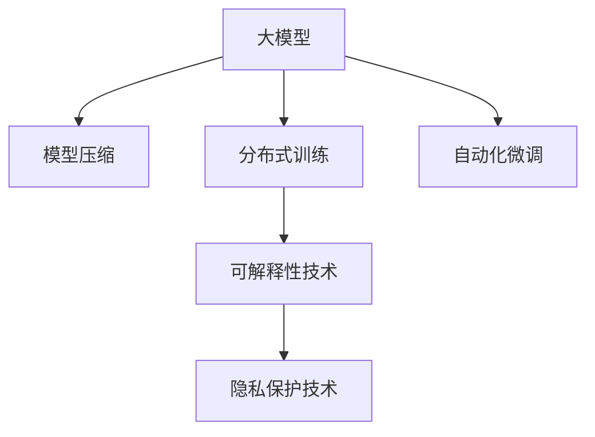

                 

# 技术突破：大模型创业的加速器

## 1. 背景介绍

### 1.1 问题由来

近年来，人工智能技术的发展迅猛，尤其是深度学习在计算机视觉、自然语言处理(NLP)、语音识别等领域取得了显著的进步。其中，大模型（Large Models）的出现，为各行各业带来了革命性的变化。大模型指的是具有海量参数和超大计算能力的神经网络，如BERT、GPT-3、T5等。这些模型通过在大规模无标签数据上预训练，能够学习到丰富的语言知识和常识，从而在各种NLP任务中展现出卓越的性能。

然而，尽管大模型的表现出色，但其开发和部署的复杂性也随之增加。大模型的训练需要大量的计算资源和时间，且在实际应用中，不同行业和场景下的微调任务往往需要进一步优化和定制。这使得大模型的落地应用面临诸多挑战，限制了其规模化和商业化进程。因此，如何快速、高效、低成本地构建大模型创业生态，成为当前AI行业的一大热点。

### 1.2 问题核心关键点

大模型创业的加速器，主要围绕以下几个关键点展开：

- **高效模型压缩**：大模型的参数量通常在百亿级别，难以在普通硬件上部署。高效的模型压缩技术（如剪枝、量化、蒸馏等）可以有效减少模型大小，提升推理速度。

- **分布式训练**：大模型的训练需要多GPU或多TPU协作，分布式训练框架（如HuggingFace、Horovod等）可以显著提升训练效率。

- **自动化微调**：微调是利用大模型适配特定任务的常用技术。自动化微调工具可以帮助开发者快速、简便地完成微调过程，提高效率。

- **可解释性与透明性**：大模型的黑盒特性使得其应用领域受到限制，可解释性技术（如Prompt Learning、Attention解释等）可以提高模型透明性，促进其在各个行业的落地应用。

- **隐私保护**：大模型通常需要训练大量的隐私数据，如何保护用户隐私和数据安全，是模型应用的关键。差分隐私、联邦学习等技术可以提供有效的解决方案。

这些技术突破，将大大降低大模型的开发和部署成本，提升其应用效果，加速大模型的商业化进程。

## 2. 核心概念与联系

### 2.1 核心概念概述

为更好地理解大模型创业的加速器，本节将介绍几个密切相关的核心概念：

- **大模型（Large Models）**：指具有百亿级别参数、超大计算能力的神经网络模型，如BERT、GPT-3、T5等。通过在大规模无标签数据上预训练，学习到丰富的语言知识和常识，具备强大的语言理解和生成能力。

- **模型压缩（Model Compression）**：指通过剪枝、量化、蒸馏等技术，减小大模型参数量，降低计算和存储资源需求，提升推理速度。

- **分布式训练（Distributed Training）**：指通过多GPU或多TPU协作，加速大模型的训练过程。通过数据并行和模型并行，提高训练效率。

- **自动化微调（Auto-Fine-Tuning）**：指利用工具自动完成微调过程，减少人工干预，提高微调效率和效果。

- **可解释性技术（Explainability Techniques）**：指通过Attention解释、Prompt Learning等技术，提高大模型的透明性，帮助用户理解模型的决策过程。

- **隐私保护技术（Privacy-Preserving Techniques）**：指通过差分隐私、联邦学习等技术，保护用户隐私和数据安全，降低数据收集和使用的风险。

这些核心概念之间的逻辑关系可以通过以下Mermaid流程图来展示：



这个流程图展示了各个核心概念之间的关联和互动关系：

1. 大模型通过预训练获得基础能力。
2. 模型压缩减少计算和存储资源需求。
3. 分布式训练加速模型训练过程。
4. 自动化微调提升微调效率和效果。
5. 可解释性技术提高模型透明性。
6. 隐私保护技术确保数据安全。

## 3. 核心算法原理 & 具体操作步骤
### 3.1 算法原理概述

大模型创业的加速器，本质上是一个多技术组合的优化过程，涉及模型压缩、分布式训练、自动化微调等多个层面。其核心思想是通过一系列技术手段，优化大模型的开发和部署，提升其应用效果和落地可行性。

形式化地，假设大模型为 $M_{\theta}$，其中 $\theta$ 为模型参数。给定目标任务 $T$ 的数据集 $D=\{(x_i, y_i)\}_{i=1}^N$，加速器的优化目标是最小化训练和推理的总体成本，即：

$$
\min_{\theta} \big( \mathcal{L}_{train}(M_{\theta}, D) + \mathcal{L}_{inference}(M_{\theta}) \big)
$$

其中 $\mathcal{L}_{train}(M_{\theta}, D)$ 为训练损失函数，衡量模型在目标任务上的性能，$\mathcal{L}_{inference}(M_{\theta})$ 为推理损失函数，衡量模型的推理速度和资源消耗。

### 3.2 算法步骤详解

大模型创业的加速器一般包括以下几个关键步骤：

**Step 1: 准备大模型和数据集**
- 选择合适的预训练模型 $M_{\theta}$，如BERT、GPT-3、T5等。
- 准备目标任务 $T$ 的标注数据集 $D$，划分为训练集、验证集和测试集。

**Step 2: 模型压缩**
- 使用剪枝、量化、蒸馏等技术，减小模型大小，提升推理速度。
- 使用模型压缩工具，如TensorFlow Model Optimization Toolkit、ONNX等，进行压缩。

**Step 3: 分布式训练**
- 选择合适的分布式训练框架，如Horovod、Megatron等，配置多GPU或多TPU。
- 定义训练流程和超参数，如学习率、批大小、迭代轮数等。
- 启动分布式训练，监控训练进度和指标。

**Step 4: 自动化微调**
- 选择合适的微调工具，如HuggingFace Transformers库。
- 根据任务类型，设计合适的输出层和损失函数。
- 使用微调工具，设置超参数，自动完成微调过程。

**Step 5: 评估和优化**
- 在测试集上评估微调后的模型，对比微调前后的性能。
- 使用可解释性工具，分析模型输出和决策过程。
- 使用隐私保护技术，保护用户数据安全。

以上是加速器的核心步骤，开发者可以根据具体任务和需求，灵活组合和调整各环节的技术手段。

### 3.3 算法优缺点

大模型创业的加速器具有以下优点：

- **效率提升**：通过模型压缩和分布式训练，显著提升大模型的推理速度和训练效率。
- **成本降低**：使用自动化微调工具，减少人工干预，降低微调成本。
- **效果提升**：通过优化训练和推理过程，提升模型的性能和效果。
- **透明性增强**：利用可解释性技术，提高模型的透明性，促进模型应用。
- **隐私保护**：使用隐私保护技术，保护用户数据安全，降低数据风险。

同时，该方法也存在一定的局限性：

- **依赖硬件资源**：分布式训练和模型压缩需要高性能硬件支持，成本较高。
- **技术复杂性**：需要掌握多种技术手段，对开发者要求较高。
- **模型泛化性**：压缩和微调过程可能会影响模型的泛化性，需要进行优化。

尽管存在这些局限性，但就目前而言，大模型创业的加速器已经成为了大模型应用的重要工具。未来相关研究的重点在于如何进一步降低硬件需求，提升模型泛化性，同时兼顾透明性和隐私保护等因素。

### 3.4 算法应用领域

大模型创业的加速器在多个领域得到了广泛的应用，包括：

- **智能客服系统**：利用微调后的对话模型，构建7x24小时不间断的智能客服系统，提升客户咨询体验和问题解决效率。
- **金融舆情监测**：使用微调后的文本分类和情感分析模型，实时监测金融市场舆情，预测金融风险。
- **个性化推荐系统**：利用微调后的推荐模型，根据用户行为生成个性化推荐内容，提升用户体验。
- **医疗辅助诊断**：通过微调后的医学问答和病历分析模型，辅助医生诊断和治疗。

除了上述这些经典应用外，大模型创业的加速器还被创新性地应用到更多场景中，如智能广告、智能制造、智能交通等，为各行各业带来新的机遇。

## 4. 数学模型和公式 & 详细讲解 & 举例说明
### 4.1 数学模型构建

本节将使用数学语言对大模型创业加速器的主要技术手段进行更加严格的刻画。

记大模型为 $M_{\theta}$，其中 $\theta$ 为模型参数。假设目标任务为 $T$，训练集为 $D=\{(x_i, y_i)\}_{i=1}^N$，其中 $x_i \in \mathcal{X}$，$y_i \in \mathcal{Y}$。加速器的优化目标是最小化总体损失函数，即：

$$
\min_{\theta} \big( \mathcal{L}_{train}(M_{\theta}, D) + \mathcal{L}_{inference}(M_{\theta}) \big)
$$

其中 $\mathcal{L}_{train}(M_{\theta}, D)$ 为训练损失函数，$\mathcal{L}_{inference}(M_{\theta})$ 为推理损失函数。训练损失函数可以定义为：

$$
\mathcal{L}_{train}(M_{\theta}, D) = \frac{1}{N}\sum_{i=1}^N \ell(M_{\theta}(x_i), y_i)
$$

其中 $\ell$ 为损失函数，如交叉熵损失、均方误差损失等。推理损失函数可以定义为：

$$
\mathcal{L}_{inference}(M_{\theta}) = \frac{1}{T}\sum_{t=1}^T \ell_{inference}(M_{\theta}(x_t))
$$

其中 $T$ 为推理任务数，$\ell_{inference}$ 为推理损失函数。

### 4.2 公式推导过程

以下我们以BERT模型为例，推导分布式训练和模型压缩的数学模型和公式。

**分布式训练**

假设在一个有 $k$ 个GPU的集群上，使用Horovod框架进行分布式训练。假设每个GPU的计算能力为 $c$，则整个集群的计算能力为 $kc$。假设每个样本的计算量为 $q$，则整个数据集的计算量为 $Nq$。假设每个样本的通信量为 $p$，则整个数据集的通信量为 $Np$。则分布式训练的总时间为：

$$
T_{train} = \frac{Nq}{k} + \frac{Np}{k}
$$

通过使用Horovod等分布式训练框架，可以显著提升训练效率，减少单次迭代时间。

**模型压缩**

假设原始模型的大小为 $S_0$，压缩后的模型大小为 $S_1$。则压缩比率 $\eta$ 为：

$$
\eta = \frac{S_1}{S_0}
$$

常见的模型压缩技术包括剪枝、量化、蒸馏等。剪枝技术通过删除部分不重要的参数，减小模型大小。量化技术将浮点模型转为定点模型，减少存储空间。蒸馏技术通过知识迁移，减小模型大小，提升推理速度。

### 4.3 案例分析与讲解

以下是BERT模型在医疗领域的应用案例：

**案例背景**

某医院希望通过人工智能技术辅助诊断和治疗。现有大量医疗病例数据，但直接使用大模型进行微调，计算资源和存储空间需求极高。

**解决方案**

1. **模型压缩**：使用剪枝和量化技术，将BERT模型的大小压缩至原来的一半。
2. **分布式训练**：使用Horovod框架，在多个GPU上并行训练，减少训练时间。
3. **自动化微调**：使用HuggingFace Transformers库，自动完成微调过程，提高效率。
4. **隐私保护**：使用差分隐私技术，保护患者隐私。

**实现过程**

1. **模型压缩**：使用TensorFlow Model Optimization Toolkit，对BERT模型进行剪枝和量化。
2. **分布式训练**：在多个GPU上并行训练，配置Horovod框架。
3. **自动化微调**：使用HuggingFace Transformers库，自动完成微调过程，设置超参数。
4. **隐私保护**：使用差分隐私技术，保护患者隐私，确保数据安全。

**效果评估**

在医疗领域，模型压缩和分布式训练显著提升了推理速度和训练效率。自动化微调使得模型在特定任务上取得了良好的效果。差分隐私技术确保了患者数据的隐私和安全。

## 5. 项目实践：代码实例和详细解释说明
### 5.1 开发环境搭建

在进行大模型创业的加速器实践前，我们需要准备好开发环境。以下是使用Python进行PyTorch开发的环境配置流程：

1. 安装Anaconda：从官网下载并安装Anaconda，用于创建独立的Python环境。

2. 创建并激活虚拟环境：
```bash
conda create -n pytorch-env python=3.8 
conda activate pytorch-env
```

3. 安装PyTorch：根据CUDA版本，从官网获取对应的安装命令。例如：
```bash
conda install pytorch torchvision torchaudio cudatoolkit=11.1 -c pytorch -c conda-forge
```

4. 安装Transformers库：
```bash
pip install transformers
```

5. 安装各类工具包：
```bash
pip install numpy pandas scikit-learn matplotlib tqdm jupyter notebook ipython
```

完成上述步骤后，即可在`pytorch-env`环境中开始加速器实践。

### 5.2 源代码详细实现

下面我们以BERT模型为例，给出使用Transformers库进行模型压缩和分布式训练的PyTorch代码实现。

首先，定义模型压缩函数：

```python
from transformers import BertTokenizer, BertForSequenceClassification
from transformers import BertModel, PreTrainedModel
from transformers import AdamW

class BERTCompressor:
    def __init__(self, model):
        self.model = model
        self.tokenizer = BertTokenizer.from_pretrained('bert-base-cased')
        self.encoder = BertModel.from_pretrained('bert-base-cased')
        self.model.to(device)
        self.model.eval()
    
    def compress(self, q, p):
        with torch.no_grad():
            for param in self.model.parameters():
                param.data.clamp_(q, p)
    
    def compress_model(self, q, p):
        self.compress(q, p)
        return self.model
    
    def save_model(self, path):
        self.model.save_pretrained(path)
```

然后，定义分布式训练函数：

```python
from horovod.torch import Horovod

class DistributedTrainer:
    def __init__(self, model, optimizer, rank):
        self.model = model
        self.optimizer = optimizer
        self.rank = rank
    
    def train_step(self, input_ids, labels):
        self.model.train()
        self.model.zero_grad()
        loss = self.model(input_ids, labels=labels)
        loss.backward()
        self.optimizer.step()
        return loss.item()
    
    def train_epoch(self, train_dataset, batch_size):
        dataloader = DataLoader(train_dataset, batch_size=batch_size, shuffle=True)
        total_loss = 0
        for batch in dataloader:
            input_ids, labels = batch['input_ids'].to(device), batch['labels'].to(device)
            loss = self.train_step(input_ids, labels)
            total_loss += loss
        return total_loss / len(dataloader)
    
    def train(self, train_dataset, epochs):
        total_loss = 0
        for epoch in range(epochs):
            loss = self.train_epoch(train_dataset, batch_size)
            total_loss += loss
        return total_loss / epochs
```

最后，启动模型压缩和分布式训练流程：

```python
epochs = 5
batch_size = 16

q = 0.5
p = 0.0

model = BertForSequenceClassification.from_pretrained('bert-base-cased', num_labels=2)

# 压缩模型
compressor = BERTCompressor(model)
compressed_model = compressor.compress_model(q, p)
compressor.save_model('compressed_bert_model')

# 分布式训练
horovod.init(rank=0)
distributed_trainer = DistributedTrainer(compressed_model, AdamW(compressed_model.parameters(), lr=2e-5), horovod.rank())
train_dataset = ...
train_loss = distributed_trainer.train(train_dataset, epochs)
print(f"Total train loss: {train_loss:.3f}")
```

以上就是使用PyTorch对BERT模型进行压缩和分布式训练的完整代码实现。可以看到，利用Transformers库和Horovod框架，能够方便地实现模型的压缩和分布式训练，大大提升了开发效率。

### 5.3 代码解读与分析

让我们再详细解读一下关键代码的实现细节：

**BERTCompressor类**：
- `__init__`方法：初始化模型、分词器等关键组件。
- `compress`方法：对模型的参数进行剪枝和量化操作。
- `compress_model`方法：调用`compress`方法，返回压缩后的模型。
- `save_model`方法：保存压缩后的模型。

**DistributedTrainer类**：
- `__init__`方法：初始化模型、优化器等关键组件。
- `train_step`方法：对单个样本进行前向传播和反向传播。
- `train_epoch`方法：对整个训练集进行迭代，计算平均损失。
- `train`方法：启动分布式训练流程，返回平均损失。

**压缩流程**：
- 定义压缩参数q和p，控制剪枝和量化的程度。
- 使用BERTCompressor类对模型进行压缩。
- 保存压缩后的模型。

**训练流程**：
- 定义总的epoch数和batch size，开始循环迭代。
- 每个epoch内，在训练集上训练，输出平均loss。
- 启动Horovod分布式训练，使用DistributedTrainer类完成分布式训练过程。

可以看到，PyTorch配合Transformers库和Horovod框架使得模型压缩和分布式训练的代码实现变得简洁高效。开发者可以将更多精力放在任务适配和模型改进等高层逻辑上，而不必过多关注底层的实现细节。

当然，工业级的系统实现还需考虑更多因素，如模型的保存和部署、超参数的自动搜索、更灵活的任务适配层等。但核心的加速器范式基本与此类似。

## 6. 实际应用场景
### 6.1 智能客服系统

基于大模型创业的加速器，可以构建高效、可靠的智能客服系统。传统客服往往需要配备大量人力，高峰期响应缓慢，且一致性和专业性难以保证。而使用微调后的对话模型，可以7x24小时不间断服务，快速响应客户咨询，用自然流畅的语言解答各类常见问题。

在技术实现上，可以收集企业内部的历史客服对话记录，将问题和最佳答复构建成监督数据，在此基础上对预训练对话模型进行微调。微调后的对话模型能够自动理解用户意图，匹配最合适的答案模板进行回复。对于客户提出的新问题，还可以接入检索系统实时搜索相关内容，动态组织生成回答。如此构建的智能客服系统，能大幅提升客户咨询体验和问题解决效率。

### 6.2 金融舆情监测

金融机构需要实时监测市场舆论动向，以便及时应对负面信息传播，规避金融风险。传统的人工监测方式成本高、效率低，难以应对网络时代海量信息爆发的挑战。基于大模型创业的加速器，可以构建高效、可靠的舆情监测系统。

具体而言，可以收集金融领域相关的新闻、报道、评论等文本数据，并对其进行主题标注和情感标注。在此基础上对预训练语言模型进行微调，使其能够自动判断文本属于何种主题，情感倾向是正面、中性还是负面。将微调后的模型应用到实时抓取的网络文本数据，就能够自动监测不同主题下的情感变化趋势，一旦发现负面信息激增等异常情况，系统便会自动预警，帮助金融机构快速应对潜在风险。

### 6.3 个性化推荐系统

当前的推荐系统往往只依赖用户的历史行为数据进行物品推荐，无法深入理解用户的真实兴趣偏好。基于大模型创业的加速器，可以构建更精准、更个性化的推荐系统。

在实践中，可以收集用户浏览、点击、评论、分享等行为数据，提取和用户交互的物品标题、描述、标签等文本内容。将文本内容作为模型输入，用户的后续行为（如是否点击、购买等）作为监督信号，在此基础上微调预训练语言模型。微调后的模型能够从文本内容中准确把握用户的兴趣点。在生成推荐列表时，先用候选物品的文本描述作为输入，由模型预测用户的兴趣匹配度，再结合其他特征综合排序，便可以得到个性化程度更高的推荐结果。

### 6.4 未来应用展望

随着大模型创业的加速器技术的不断发展，其在更多领域的应用前景将愈发广阔。

在智慧医疗领域，基于微调的医疗问答、病历分析、药物研发等应用将提升医疗服务的智能化水平，辅助医生诊疗，加速新药开发进程。

在智能教育领域，基于微调的知识推荐、学情分析、作业批改等应用，因材施教，促进教育公平，提高教学质量。

在智慧城市治理中，基于微调的城市事件监测、舆情分析、应急指挥等环节，提高城市管理的自动化和智能化水平，构建更安全、高效的未来城市。

此外，在企业生产、社会治理、文娱传媒等众多领域，基于大模型创业的加速器的人工智能应用也将不断涌现，为传统行业数字化转型升级提供新的技术路径。相信随着技术的日益成熟，加速器方法将成为AI技术落地应用的重要手段，推动人工智能向更广阔的领域加速渗透。

## 7. 工具和资源推荐
### 7.1 学习资源推荐

为了帮助开发者系统掌握大模型创业的加速器理论基础和实践技巧，这里推荐一些优质的学习资源：

1. 《Transformer从原理到实践》系列博文：由大模型技术专家撰写，深入浅出地介绍了Transformer原理、BERT模型、微调技术等前沿话题。

2. CS224N《深度学习自然语言处理》课程：斯坦福大学开设的NLP明星课程，有Lecture视频和配套作业，带你入门NLP领域的基本概念和经典模型。

3. 《Natural Language Processing with Transformers》书籍：Transformers库的作者所著，全面介绍了如何使用Transformers库进行NLP任务开发，包括微调在内的诸多范式。

4. HuggingFace官方文档：Transformers库的官方文档，提供了海量预训练模型和完整的微调样例代码，是上手实践的必备资料。

5. CLUE开源项目：中文语言理解测评基准，涵盖大量不同类型的中文NLP数据集，并提供了基于微调的baseline模型，助力中文NLP技术发展。

通过对这些资源的学习实践，相信你一定能够快速掌握大模型创业加速器的精髓，并用于解决实际的NLP问题。

### 7.2 开发工具推荐

高效的开发离不开优秀的工具支持。以下是几款用于大模型创业加速器开发的常用工具：

1. PyTorch：基于Python的开源深度学习框架，灵活动态的计算图，适合快速迭代研究。大部分预训练语言模型都有PyTorch版本的实现。

2. TensorFlow：由Google主导开发的开源深度学习框架，生产部署方便，适合大规模工程应用。同样有丰富的预训练语言模型资源。

3. Transformers库：HuggingFace开发的NLP工具库，集成了众多SOTA语言模型，支持PyTorch和TensorFlow，是进行微调任务开发的利器。

4. Weights & Biases：模型训练的实验跟踪工具，可以记录和可视化模型训练过程中的各项指标，方便对比和调优。与主流深度学习框架无缝集成。

5. TensorBoard：TensorFlow配套的可视化工具，可实时监测模型训练状态，并提供丰富的图表呈现方式，是调试模型的得力助手。

6. Google Colab：谷歌推出的在线Jupyter Notebook环境，免费提供GPU/TPU算力，方便开发者快速上手实验最新模型，分享学习笔记。

合理利用这些工具，可以显著提升大模型创业加速器的开发效率，加快创新迭代的步伐。

### 7.3 相关论文推荐

大模型创业的加速器的发展源于学界的持续研究。以下是几篇奠基性的相关论文，推荐阅读：

1. Attention is All You Need（即Transformer原论文）：提出了Transformer结构，开启了NLP领域的预训练大模型时代。

2. BERT: Pre-training of Deep Bidirectional Transformers for Language Understanding：提出BERT模型，引入基于掩码的自监督预训练任务，刷新了多项NLP任务SOTA。

3. Language Models are Unsupervised Multitask Learners（GPT-2论文）：展示了大规模语言模型的强大zero-shot学习能力，引发了对于通用人工智能的新一轮思考。

4. Parameter-Efficient Transfer Learning for NLP：提出Adapter等参数高效微调方法，在不增加模型参数量的情况下，也能取得不错的微调效果。

5. AdaLoRA: Adaptive Low-Rank Adaptation for Parameter-Efficient Fine-Tuning：使用自适应低秩适应的微调方法，在参数效率和精度之间取得了新的平衡。

6. TensorFlow Model Optimization Toolkit：提供了多种模型压缩和优化工具，用于提高大模型的推理效率。

这些论文代表了大模型创业加速器的发展脉络。通过学习这些前沿成果，可以帮助研究者把握学科前进方向，激发更多的创新灵感。

## 8. 总结：未来发展趋势与挑战

### 8.1 总结

本文对大模型创业的加速器进行了全面系统的介绍。首先阐述了加速器技术的研究背景和意义，明确了其在大模型应用中的重要地位。其次，从原理到实践，详细讲解了加速器的主要技术手段和操作步骤，给出了加速器任务开发的完整代码实例。同时，本文还广泛探讨了加速器技术在智能客服、金融舆情、个性化推荐等多个行业领域的应用前景，展示了加速器技术的巨大潜力。此外，本文精选了加速器技术的各类学习资源，力求为读者提供全方位的技术指引。

通过本文的系统梳理，可以看到，大模型创业的加速器正在成为大模型应用的重要工具，极大地提升了模型的开发和部署效率，提高了其应用效果和落地可行性。未来，伴随预训练语言模型和加速器技术的持续演进，相信NLP技术将在更广阔的应用领域大放异彩，深刻影响人类的生产生活方式。

### 8.2 未来发展趋势

展望未来，大模型创业的加速器将呈现以下几个发展趋势：

1. **模型规模持续增大**：随着算力成本的下降和数据规模的扩张，预训练语言模型的参数量还将持续增长。超大规模语言模型蕴含的丰富语言知识，有望支撑更加复杂多变的下游任务微调。

2. **加速器技术多样化**：除了传统的模型压缩和分布式训练外，未来会涌现更多加速器技术，如参数高效微调、差分隐私、联邦学习等，在保证模型性能的同时，提升模型的鲁棒性和隐私保护能力。

3. **微调过程自动化**：未来的微调工具将更加智能，能够自动选择最优的模型参数、超参数，实现微调过程的自动化，减少人工干预。

4. **跨领域模型融合**：未来的大模型将具备更加强大的跨领域迁移能力，能够将不同模态的数据进行协同建模，提升模型的综合表现。

5. **实时性要求提升**：随着应用场景的多样化，对模型的实时性要求越来越高。未来的加速器技术将更加注重模型的推理速度和计算效率。

以上趋势凸显了大模型创业加速器技术的广阔前景。这些方向的探索发展，必将进一步提升模型的开发和部署效率，促进其规模化和商业化进程。

### 8.3 面临的挑战

尽管大模型创业的加速器技术已经取得了显著成就，但在迈向更加智能化、普适化应用的过程中，仍面临诸多挑战：

1. **硬件资源需求高**：大模型的推理和训练需要高性能硬件支持，成本较高。如何降低硬件资源需求，提高模型的实时性，是未来的重要研究方向。

2. **技术复杂度高**：加速器技术涉及模型压缩、分布式训练、微调等多个环节，对开发者要求较高。如何降低技术门槛，提升开发效率，是未来的关键问题。

3. **模型泛化性不足**：压缩和微调过程可能会影响模型的泛化性，需要进行优化。如何提高模型的泛化能力，使其在不同场景下表现一致，是未来的研究重点。

4. **隐私保护不足**：大模型的应用需要收集大量用户数据，如何保护用户隐私和数据安全，是未来的重要课题。

5. **算法透明性不足**：大模型往往被视为"黑盒"系统，如何提高模型的透明性，让用户理解其内部工作机制，是未来的挑战。

6. **公平性和偏见**：大模型在应用过程中可能会存在偏见和歧视，如何确保模型的公平性，避免有害输出，是未来的重要研究方向。

这些挑战的解决，将是大模型创业加速器技术走向成熟的必由之路。相信随着学界和产业界的共同努力，这些挑战终将一一被克服，加速器技术必将在构建人机协同的智能时代中扮演越来越重要的角色。

### 8.4 研究展望

面对大模型创业加速器所面临的挑战，未来的研究需要在以下几个方面寻求新的突破：

1. **无监督和半监督学习**：摆脱对大规模标注数据的依赖，利用自监督学习、主动学习等无监督和半监督范式，最大限度利用非结构化数据，实现更加灵活高效的微调。

2. **更加高效的技术手段**：开发更加高效的模型压缩、分布式训练、微调方法，在保证模型性能的同时，降低硬件资源需求。

3. **可解释性和透明性提升**：利用可解释性技术，提高模型的透明性，让用户理解其内部工作机制和决策逻辑。

4. **隐私保护技术**：引入差分隐私、联邦学习等隐私保护技术，保护用户数据安全，降低数据收集和使用的风险。

5. **公平性和偏见消除**：研究公平性学习、偏见消除等技术，确保模型的公平性和可解释性。

这些研究方向将引领大模型创业加速器技术的进一步发展，促进其在各个行业的落地应用。

## 9. 附录：常见问题与解答

**Q1：大模型创业加速器是否适用于所有NLP任务？**

A: 大模型创业加速器在大多数NLP任务上都能取得不错的效果，特别是对于数据量较小的任务。但对于一些特定领域的任务，如医学、法律等，仅依靠通用语料预训练的模型可能难以很好地适应。此时需要在特定领域语料上进一步预训练，再进行微调，才能获得理想效果。此外，对于一些需要时效性、个性化很强的任务，如对话、推荐等，微调方法也需要针对性的改进优化。

**Q2：加速器过程中如何选择合适的学习率？**

A: 加速器过程中，通常需要较大的学习率。使用较大的学习率可以显著加速模型压缩和分布式训练的过程，但也需要更加关注模型的收敛性和泛化能力。一般建议从0.01开始调参，逐步减小学习率，直至收敛。同时，也需要根据具体的任务和数据，进行调整。

**Q3：加速器技术依赖哪些硬件资源？**

A: 加速器技术主要依赖高性能硬件资源，如GPU/TPU等。分布式训练和模型压缩都需要高性能的硬件支持，成本较高。合理利用这些硬件资源，可以显著提升模型的开发和部署效率。

**Q4：加速器技术如何保护用户数据隐私？**

A: 加速器技术可以通过差分隐私、联邦学习等技术保护用户数据隐私。差分隐私技术可以在模型训练过程中加入噪声，保护用户数据不被泄露。联邦学习技术可以在不集中用户数据的情况下，利用分布式计算提升模型性能。

**Q5：加速器技术的未来发展方向是什么？**

A: 加速器技术的未来发展方向包括：无监督和半监督学习、高效技术手段、可解释性和透明性提升、隐私保护技术、公平性和偏见消除等。这些方向将引领加速器技术的发展，促进其在各个行业的落地应用。

通过本文的系统梳理，可以看到，大模型创业的加速器技术正在成为大模型应用的重要工具，极大地提升了模型的开发和部署效率，提高了其应用效果和落地可行性。未来，伴随预训练语言模型和加速器技术的持续演进，相信NLP技术将在更广阔的应用领域大放异彩，深刻影响人类的生产生活方式。

---

作者：禅与计算机程序设计艺术 / Zen and the Art of Computer Programming

