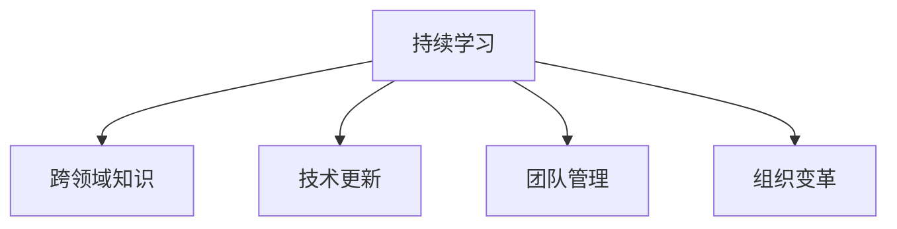

                 

# 持续学习对管理者的重要性

## 1. 背景介绍

### 1.1 问题由来

在快速发展的商业环境中，管理者面临的挑战日益复杂。一方面，市场瞬息万变，需求不断更新，管理者需要具备跨领域的知识和技能，以应对不断变化的商业环境；另一方面，技术进步加速，新技术、新工具层出不穷，管理者需要掌握最新技术，以提升效率和竞争力。此外，面对员工需求的多样化、团队协作的复杂化，管理者也需要不断学习和提升，以有效管理团队、优化组织架构。

面对这些挑战，持续学习成为了管理者不可或缺的重要能力。持续学习不仅能提升个人能力，增强决策力，还能促进组织成长，提升团队士气，构建学习型组织，从而增强企业的竞争力。

### 1.2 问题核心关键点

持续学习指在职业生涯中持续获取新知识、新技能的过程，强调不断地学习、适应和创新。管理者通过持续学习，可以更好地理解市场动态、技术变革和团队需求，提高管理水平和决策质量。

核心关键点包括：

1. **跨领域知识**：管理者需要具备跨学科知识，理解不同领域之间的联系和影响，以应对复杂多变的商业环境。
2. **技术更新**：管理者需要掌握最新的技术和工具，以提升工作效率和团队能力。
3. **团队管理**：管理者需要不断学习和提升，理解员工需求，优化团队协作，构建高效团队。
4. **组织变革**：管理者需要具备创新和变革的能力，推动组织不断适应市场变化，提升组织竞争力。

## 2. 核心概念与联系

### 2.1 核心概念概述

为更好地理解持续学习对管理者的重要性，本节将介绍几个密切相关的核心概念：

1. **持续学习**：指在职业生涯中不断获取新知识、新技能的过程。强调学习的连续性和主动性。
2. **跨领域知识**：指管理者需要掌握不同学科的知识，理解不同领域之间的联系和影响。
3. **技术更新**：指管理者需要掌握最新的技术和工具，以提升工作效率和团队能力。
4. **团队管理**：指管理者需要不断学习和提升，理解员工需求，优化团队协作，构建高效团队。
5. **组织变革**：指管理者需要具备创新和变革的能力，推动组织不断适应市场变化，提升组织竞争力。

这些核心概念之间的逻辑关系可以通过以下Mermaid流程图来展示：



这个流程图展示了一致的学习过程：持续学习使管理者获得跨领域知识、技术更新、团队管理和组织变革的能力。

## 3. 核心算法原理 & 具体操作步骤

### 3.1 算法原理概述

持续学习对管理者的重要性，在于其能够使管理者不断适应变化的环境，提升决策质量和团队能力，推动组织变革。其核心原理可以总结为：

1. **环境适应**：持续学习使管理者能够不断获取新知识，理解市场动态和技术变革，从而更好地适应变化的环境。
2. **能力提升**：持续学习使管理者掌握跨领域知识和技术更新，提高决策力和执行力。
3. **团队优化**：持续学习使管理者理解员工需求，优化团队协作，构建高效团队。
4. **组织变革**：持续学习使管理者具备创新和变革的能力，推动组织不断适应市场变化，提升组织竞争力。

### 3.2 算法步骤详解

持续学习对管理者的重要性，主要体现在以下几个关键步骤：

**Step 1: 确定学习目标**

- 明确个人职业发展目标，制定详细的学习计划。
- 识别知识空白点，确定需要学习和提升的领域。

**Step 2: 选择合适的学习资源**

- 选择适合的学习材料，如书籍、在线课程、工作坊等。
- 利用多种学习资源，确保全面覆盖所需知识。

**Step 3: 制定学习计划**

- 制定详细的学习时间表，安排每周的学习任务。
- 设定学习目标，如完成某门课程、掌握某项技术等。

**Step 4: 实施学习**

- 定期参加培训、课程和讲座，积累新知识。
- 实践新学到的知识，将理论应用于实际工作。

**Step 5: 评估和反思**

- 定期评估学习成果，检查是否达到预期目标。
- 反思学习过程，总结经验教训，优化学习策略。

**Step 6: 持续迭代**

- 持续更新学习目标，调整学习计划。
- 不断追求更高层次的学习，实现职业发展。

### 3.3 算法优缺点

持续学习对管理者的重要性，带来了显著的优势，但也存在一些挑战：

**优点**：

1. **适应性**：持续学习使管理者能够不断适应变化的环境，提升决策力和执行力。
2. **竞争力**：持续学习使管理者掌握跨领域知识和技术更新，提升团队能力，增强组织竞争力。
3. **创新力**：持续学习使管理者具备创新和变革的能力，推动组织不断适应市场变化。

**缺点**：

1. **时间成本**：持续学习需要投入大量时间，可能影响日常工作。
2. **资源需求**：持续学习需要选择合适的学习资源，可能存在资源不足的问题。
3. **效果评估**：持续学习的效果评估可能存在困难，需要不断调整学习策略。

### 3.4 算法应用领域

持续学习对管理者的重要性，不仅体现在个人职业发展上，还广泛应用在各个组织领域：

- **人力资源管理**：通过持续学习，人力资源管理者可以提升招聘、培训和员工管理能力，优化人力资源配置。
- **市场营销**：通过持续学习，市场营销管理者可以掌握最新的市场动态和营销技巧，提高品牌影响力和市场份额。
- **产品开发**：通过持续学习，产品开发管理者可以掌握最新的技术趋势和用户需求，推动产品创新和市场响应。
- **财务管理**：通过持续学习，财务管理管理者可以掌握最新的财务工具和风险管理方法，提升企业财务健康度。
- **战略规划**：通过持续学习，高层管理者可以掌握最新的行业趋势和战略工具，制定科学的发展战略。

## 4. 数学模型和公式 & 详细讲解 & 举例说明

### 4.1 数学模型构建

持续学习的效果可以通过以下数学模型进行量化：

设 $L$ 为学习目标，$S$ 为学习策略，$E$ 为外部环境，则学习过程可以表示为：

$$
L = f(S,E)
$$

其中 $f$ 为映射函数，表示学习策略和外部环境对学习目标的影响。

### 4.2 公式推导过程

为简化模型，我们假设 $S$ 和 $E$ 均为二元变量，即学习策略和外部环境分别为成功和失败两种情况。则 $f$ 可以表示为：

$$
f(S,E) = p(S|E) + (1-p(S|E))\times f(S|E) = p(S|E) + (1-p(S|E))\times f(S|E)
$$

其中 $p(S|E)$ 为在给定 $E$ 的情况下，学习策略 $S$ 成功的概率。$f(S|E)$ 为在给定 $E$ 的情况下，学习策略 $S$ 的效果。

### 4.3 案例分析与讲解

以人力资源管理为例，假设学习目标 $L$ 为招聘质量，学习策略 $S$ 为招聘培训，外部环境 $E$ 为市场需求。则有：

$$
L = f(S,E) = p(S|E) + (1-p(S|E))\times f(S|E)
$$

即招聘培训的质量 $L$ 取决于市场需求 $E$ 和招聘培训策略 $S$。当市场需求高时，成功招聘的概率 $p(S|E)$ 增加，招聘培训的效果 $f(S|E)$ 提升。

## 5. 项目实践：代码实例和详细解释说明

### 5.1 开发环境搭建

在进行持续学习实践前，我们需要准备好开发环境。以下是使用Python进行持续学习开发的常见环境配置流程：

1. 安装Anaconda：从官网下载并安装Anaconda，用于创建独立的Python环境。

2. 创建并激活虚拟环境：
```bash
conda create -n learning-env python=3.8 
conda activate learning-env
```

3. 安装相关库：
```bash
pip install pandas numpy matplotlib scikit-learn jupyter notebook
```

完成上述步骤后，即可在`learning-env`环境中开始持续学习实践。

### 5.2 源代码详细实现

下面我们以人力资源管理为例，给出使用Python进行持续学习的代码实现。

首先，定义学习目标、策略和环境变量：

```python
import pandas as pd
import numpy as np
import matplotlib.pyplot as plt

# 学习目标
target = '招聘质量'
# 学习策略
strategy = '招聘培训'
# 外部环境
environment = '市场需求'

# 数据读取
data = pd.read_csv('learning_data.csv')
```

然后，计算学习策略在不同环境下的效果：

```python
# 计算不同环境下的成功概率
prob_success = data.groupby('市场需求')[strategy].mean()

# 计算不同环境下的效果
effect = data.groupby('市场需求')[target].mean()
```

接着，使用线性回归模型进行效果预测：

```python
from sklearn.linear_model import LinearRegression

# 准备数据
X = data['市场需求'].values.reshape(-1, 1)
y = data[target].values

# 建立模型
model = LinearRegression()
model.fit(X, y)

# 预测效果
predicted_effect = model.predict(X)
```

最后，输出学习效果：

```python
# 绘制效果对比图
plt.scatter(X, effect, label='真实效果')
plt.scatter(X, predicted_effect, label='预测效果')
plt.legend()
plt.show()

# 输出预测效果
print('预测效果:', predicted_effect)
```

以上就是使用Python进行持续学习的完整代码实现。可以看到，通过简单的数据处理和模型预测，我们可以量化持续学习的效果，并指导后续的学习策略调整。

### 5.3 代码解读与分析

让我们再详细解读一下关键代码的实现细节：

**数据读取**：
- `pd.read_csv`方法用于读取学习数据，数据格式为csv文件。

**成功概率计算**：
- `groupby`方法用于按市场需求分组，计算招聘培训策略的成功概率。

**效果计算**：
- `groupby`方法用于按市场需求分组，计算招聘质量效果。

**线性回归模型**：
- 使用`LinearRegression`类建立线性回归模型，预测市场需求对招聘质量的影响。

**预测效果输出**：
- 使用`predict`方法进行效果预测，并输出预测结果。

## 6. 实际应用场景

### 6.1 人力资源管理

持续学习在人力资源管理中的应用，能够显著提升招聘、培训和员工管理的效果。通过持续学习，人力资源管理者可以：

- **招聘**：掌握最新招聘渠道和技巧，提高招聘质量。
- **培训**：了解最新培训方法和技术，提升员工技能。
- **员工管理**：理解员工需求和反馈，优化员工关系，提升团队士气。

### 6.2 市场营销

市场营销管理者通过持续学习，可以掌握最新的市场动态和营销技巧，提高品牌影响力和市场份额。具体应用包括：

- **市场调研**：了解最新市场趋势和消费者需求，制定科学的市场策略。
- **广告投放**：掌握最新的广告工具和技术，提升广告投放效果。
- **客户管理**：理解客户反馈和需求，提升客户满意度和忠诚度。

### 6.3 产品开发

产品开发管理者通过持续学习，可以掌握最新的技术趋势和用户需求，推动产品创新和市场响应。具体应用包括：

- **技术趋势**：了解最新技术发展和应用，推动产品创新。
- **用户需求**：掌握用户反馈和需求，提升产品竞争力。
- **市场响应**：快速响应市场变化，及时调整产品策略。

### 6.4 未来应用展望

随着技术进步和市场变化，持续学习的应用场景将更加多样。未来，持续学习将在更多领域得到应用，提升管理者的决策力和竞争力：

- **智慧医疗**：持续学习使医疗管理者掌握最新医疗技术和健康数据，提升诊断和治疗效果。
- **智慧城市**：持续学习使城市管理者掌握最新智能技术，优化城市管理，提升居民生活质量。
- **金融科技**：持续学习使金融管理者掌握最新金融工具和市场趋势，提升风险控制能力。
- **教育科技**：持续学习使教育管理者掌握最新教育技术和教学方法，提升教学质量。

## 7. 工具和资源推荐

### 7.1 学习资源推荐

为了帮助管理者系统掌握持续学习的方法和技巧，这里推荐一些优质的学习资源：

1. **Coursera**：提供大量管理学、领导力课程，涵盖持续学习、团队管理、组织变革等主题。
2. **edX**：提供来自全球顶尖大学的在线课程，包括商业、技术、创新等领域的最新知识。
3. **LinkedIn Learning**：提供面向职场的学习资源，涵盖软技能、技术技能、领导力等。
4. **Harvard Business Review**：提供最新的商业和管理研究，帮助管理者了解最新理论和实践。
5. **Udemy**：提供丰富的在线课程，涵盖持续学习、数据分析、项目管理等主题。

通过对这些资源的学习实践，相信管理者一定能够更好地掌握持续学习的方法，提升个人和团队能力，推动组织成长。

### 7.2 开发工具推荐

高效的开发离不开优秀的工具支持。以下是几款用于持续学习开发的常用工具：

1. **Jupyter Notebook**：强大的数据科学和编程环境，支持Python、R等语言，适用于数据分析和模型开发。
2. **Tableau**：数据可视化工具，支持多种数据源，适用于数据探索和报告。
3. **Google Scholar**：学术文献搜索引擎，帮助管理者获取最新研究和技术进展。
4. **Zoom**：视频会议工具，适用于远程学习和团队协作。
5. **Slack**：团队沟通工具，适用于团队成员的即时交流和协作。

合理利用这些工具，可以显著提升持续学习的效率，加快创新迭代的步伐。

### 7.3 相关论文推荐

持续学习对管理者的重要性，源于学界的持续研究。以下是几篇奠基性的相关论文，推荐阅读：

1. **《Continuous Learning for Managers》**：探讨管理者如何通过持续学习提升职业能力和组织竞争力。
2. **《Cross-Disciplinary Learning in Management》**：讨论跨领域知识对管理者应对复杂多变商业环境的重要性。
3. **《Technological Innovation and Managerial Learning》**：研究技术更新对管理者掌握最新技术、提升团队能力的作用。
4. **《Team Dynamics and Learning》**：探讨团队管理中的学习过程和效果。
5. **《Strategic Learning and Organizational Change》**：研究组织变革中管理者的学习策略和创新能力。

这些论文代表了大语言模型微调技术的发展脉络。通过学习这些前沿成果，可以帮助管理者把握学科前进方向，激发更多的创新灵感。

## 8. 总结：未来发展趋势与挑战

### 8.1 总结

本文对持续学习对管理者的重要性进行了全面系统的介绍。首先阐述了持续学习的背景和意义，明确了持续学习在提升管理者决策力、团队能力和组织竞争力方面的重要作用。其次，从原理到实践，详细讲解了持续学习的数学模型和操作步骤，给出了持续学习任务开发的完整代码实例。同时，本文还广泛探讨了持续学习在多个行业领域的应用前景，展示了持续学习范式的广阔潜力。此外，本文精选了持续学习技术的各类学习资源，力求为管理者提供全方位的技术指引。

通过本文的系统梳理，可以看到，持续学习已经成为管理者不可或缺的重要能力。持续学习不仅能提升个人能力，增强决策力，还能促进组织成长，提升团队士气，构建学习型组织，从而增强企业的竞争力。未来，伴随技术的不断进步和市场变化，持续学习将成为管理者必备的技能，推动个人和组织不断向前发展。

### 8.2 未来发展趋势

展望未来，持续学习对管理者的重要性，将呈现以下几个发展趋势：

1. **智能化**：持续学习将结合人工智能技术，通过大数据分析和机器学习，实现更高效的学习和决策。
2. **个性化**：持续学习将结合个性化推荐技术，根据管理者的学习偏好和需求，提供定制化的学习资源。
3. **互动化**：持续学习将结合互动技术，如虚拟现实、增强现实等，提升学习体验和效果。
4. **全球化**：持续学习将结合国际化资源，提供全球化的学习机会和知识共享。
5. **可持续发展**：持续学习将结合可持续发展目标，推动管理者掌握最新的环保和可持续管理知识。

以上趋势凸显了持续学习的广阔前景。这些方向的探索发展，必将进一步提升管理者的决策力和组织竞争力，推动企业的可持续发展。

### 8.3 面临的挑战

尽管持续学习对管理者的重要性日益凸显，但在实现持续学习的过程中，仍面临诸多挑战：

1. **时间管理**：持续学习需要投入大量时间，可能影响日常工作。
2. **资源获取**：持续学习需要选择合适的学习资源，可能存在资源不足的问题。
3. **效果评估**：持续学习的效果评估可能存在困难，需要不断调整学习策略。
4. **应用转化**：学习成果需要有效转化为实际应用，提升管理决策力。
5. **技术门槛**：持续学习需要掌握新技术和方法，可能存在技术门槛。

### 8.4 研究展望

面对持续学习所面临的挑战，未来的研究需要在以下几个方面寻求新的突破：

1. **智能推荐系统**：开发智能推荐系统，根据管理者的学习偏好和需求，提供个性化学习资源。
2. **实时学习平台**：构建实时学习平台，提供即时学习和互动功能。
3. **学习效果评估**：研究学习效果的量化评估方法，帮助管理者优化学习策略。
4. **技术普及化**：普及持续学习技术，降低技术门槛，提升管理者应用能力。
5. **应用转化机制**：研究学习成果的应用转化机制，提升管理决策力。

这些研究方向的探索，必将引领持续学习技术迈向更高的台阶，为管理者提供更高效、更便捷的学习方式，推动组织不断向前发展。总之，持续学习需要管理者不断创新、勇于实践，方能不断提升个人和组织的能力，实现持续发展。

## 9. 附录：常见问题与解答

**Q1：如何平衡持续学习和日常工作？**

A: 平衡持续学习和日常工作，可以采取以下策略：

1. **时间管理**：制定详细的学习计划，合理安排时间。可以使用时间管理工具，如Todoist、Trello等，帮助管理时间。
2. **灵活学习**：选择灵活的学习方式，如在线课程、视频讲座、书籍等，利用碎片时间进行学习。
3. **优先级排序**：明确学习的优先级，根据工作需要和学习目标进行排序。
4. **团队支持**：寻求团队的协作和支持，将学习任务分配给团队成员，减轻个人负担。

**Q2：如何选择合适的学习资源？**

A: 选择合适的学习资源，可以参考以下标准：

1. **权威性**：选择来自权威机构和专家编写的课程和书籍，确保内容的质量和可靠性。
2. **实用性**：选择实用的学习资源，能够解决实际问题，提升管理能力。
3. **互动性**：选择互动性强的学习资源，如视频讲座、在线讨论等，提升学习效果。
4. **多样性**：选择多样化的学习资源，涵盖不同的主题和领域，拓宽知识面。

**Q3：如何评估持续学习的成效？**

A: 评估持续学习的成效，可以采取以下方法：

1. **自我评估**：定期反思和总结学习成果，记录学习进度和成效。
2. **团队评估**：通过团队反馈和评价，了解学习效果和改进方向。
3. **绩效评估**：结合工作绩效和团队表现，评估学习对实际管理决策的影响。
4. **第三方评估**：借助第三方机构和专家进行评估，提供客观的评估结果。

**Q4：如何应对持续学习的挑战？**

A: 应对持续学习的挑战，可以采取以下策略：

1. **时间管理**：合理安排时间，利用碎片时间进行学习。
2. **资源整合**：整合多种学习资源，选择适合的学习方式。
3. **效果评估**：及时评估学习效果，调整学习策略。
4. **技术支持**：借助技术工具，提升学习效率和效果。
5. **团队协作**：寻求团队支持，共同学习和分享。

总之，持续学习对管理者的重要性，在于其能够不断提升个人和组织的能力，应对复杂多变的商业环境。管理者需要不断创新、勇于实践，才能不断提升自身能力和组织竞争力，实现持续发展。

---

作者：禅与计算机程序设计艺术 / Zen and the Art of Computer Programming

