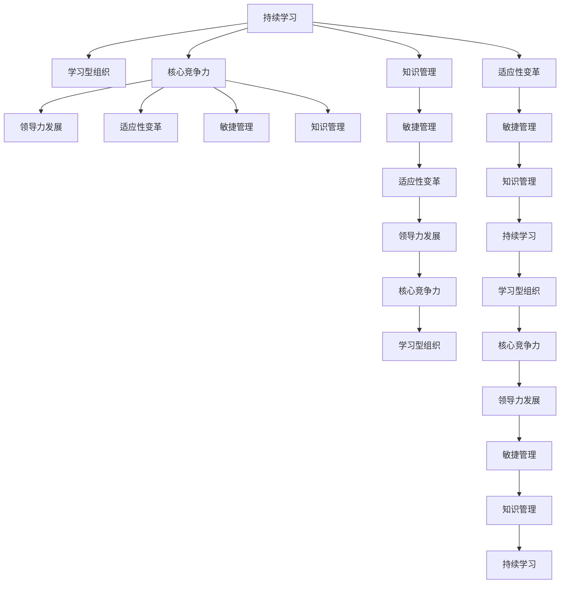

                 

# 持续学习：管理者的核心竞争力

> 关键词：
- 持续学习
- 学习型组织
- 核心竞争力
- 领导力发展
- 适应性变革
- 敏捷管理
- 知识管理

## 1. 背景介绍

### 1.1 问题由来

在当今快速变化的商业环境中，持续学习已成为组织的核心竞争力之一。随着技术的迅猛发展、市场需求的快速变化以及全球化的挑战，组织需要不断更新其战略、流程和技能，以保持竞争优势。管理者在这其中扮演着至关重要的角色，他们不仅要自身具备持续学习的能力，还需要领导团队共同成长，构建学习型组织，以应对不断变化的外部环境。

### 1.2 问题核心关键点

持续学习的本质在于不断适应和学习新的知识、技能和理念，以提高个人和组织的适应性和创新能力。对于管理者而言，持续学习不仅是个人发展的需要，更是组织发展的驱动力。

管理者持续学习的核心关键点包括：

- 建立终身学习的理念，培养自我激励和自我管理的能力。
- 发展领导力，包括战略规划、团队管理、沟通协调等方面的技能。
- 推动组织文化，鼓励开放交流、知识共享和创新实践。
- 运用敏捷管理方法，快速响应市场变化和客户需求。
- 加强知识管理，建立系统化的知识库和智能搜索平台。

### 1.3 问题研究意义

持续学习的管理实践能够帮助组织应对环境变化，提升整体绩效和市场竞争力。具体而言：

1. **提高组织灵活性**：通过持续学习，组织能够更快地适应市场和技术的变化，提升决策和执行效率。
2. **增强员工满意度和忠诚度**：管理者通过示范和学习行为，激励员工共同成长，提升工作满意度和归属感。
3. **推动创新和创造力**：持续学习促进知识和技能的新颖组合，激发出新的想法和解决方案。
4. **提升管理效能**：管理者通过持续学习，能够不断优化管理和领导技能，提升团队绩效。
5. **促进可持续发展**：通过学习环保和社会责任相关的知识，推动组织可持续发展。

本文将系统介绍持续学习的核心概念、关键技术和实践应用，以期为管理者提供有价值的参考和指导。

## 2. 核心概念与联系

### 2.1 核心概念概述

为更好地理解持续学习的管理实践，本节将介绍几个密切相关的核心概念：

- **持续学习 (Continuous Learning)**：指个人或组织在职业生涯中不断寻求新知识、技能和理念的过程。通过持续学习，个人和组织能够适应环境变化，提升创新能力和竞争力。

- **学习型组织 (Learning Organization)**：一种以学习为核心的组织模式，注重知识共享、团队协作和创新实践，鼓励全体成员不断学习和改进。

- **核心竞争力 (Core Competence)**：指组织拥有的独特优势和能力，是长期竞争优势的源泉。持续学习是构建和维护核心竞争力的关键。

- **领导力发展 (Leadership Development)**：管理者通过持续学习，不断提升领导力，包括战略规划、团队管理、沟通协调等方面的技能。

- **适应性变革 (Adaptive Change)**：指组织在应对环境变化时，能够快速调整策略、流程和结构，以保持竞争优势。

- **敏捷管理 (Agile Management)**：一种灵活、响应迅速的管理方法，注重快速交付和持续改进。

- **知识管理 (Knowledge Management)**：指通过系统化的手段，管理和利用组织内的知识和信息，促进知识共享和应用。

这些核心概念之间的逻辑关系可以通过以下Mermaid流程图来展示：



这个流程图展示了一系列关键概念之间的逻辑关系：

1. 持续学习推动学习型组织的建设。
2. 学习型组织促进核心竞争力的形成和维护。
3. 领导力发展是提升核心竞争力的关键。
4. 适应性变革使组织能够应对环境变化。
5. 敏捷管理提升组织响应速度和灵活性。
6. 知识管理促进知识和信息的共享和应用。

这些概念共同构成了持续学习的管理框架，使得组织能够通过持续学习和改进，保持竞争优势。

## 3. 核心算法原理 & 具体操作步骤

### 3.1 算法原理概述

持续学习的管理实践，本质上是一个系统化、过程化的组织改进方法。其核心思想是通过不断学习和改进，提升组织的整体绩效和市场竞争力。持续学习的目标在于：

- **知识更新**：定期评估和更新组织内部的知识和技能，确保其与时俱进。
- **技能提升**：通过培训和实践，提升员工的专业技能和通用能力。
- **创新驱动**：鼓励创新思维和实践，推动组织不断探索新的解决方案。

持续学习的管理实践包括以下几个关键步骤：

1. **需求分析**：识别组织内部和外部环境的需求和挑战。
2. **制定学习计划**：根据需求，制定学习目标、内容和方式。
3. **实施培训和实践**：通过培训、项目实践、知识分享等手段，提升员工技能和知识。
4. **评估和反馈**：定期评估学习效果，收集反馈意见，调整学习计划。
5. **持续优化**：根据评估和反馈，不断优化学习计划和实践方式，形成持续改进的循环。

### 3.2 算法步骤详解

以下是持续学习的管理实践的具体操作步骤：

**Step 1: 需求分析**

1. **内部评估**：通过问卷调查、访谈等方式，了解员工的技能水平和知识需求。
2. **外部分析**：分析行业趋势、技术变革、市场变化等外部环境因素。
3. **需求汇总**：将内部和外部评估结果汇总，形成整体需求分析报告。

**Step 2: 制定学习计划**

1. **目标设定**：根据需求分析结果，设定学习目标和预期成果。
2. **内容选择**：根据目标，选择相关的培训课程、技能提升项目和学习材料。
3. **资源分配**：确定学习资源，如培训师、教材、在线课程等。
4. **时间安排**：制定学习时间表，包括培训时间、实践时间和评估时间。

**Step 3: 实施培训和实践**

1. **培训开展**：组织开展培训课程，使用讲座、工作坊、案例分析等形式。
2. **实践项目**：安排实际项目，让员工在项目中应用新技能和知识。
3. **知识分享**：通过内部论坛、研讨会等方式，鼓励员工分享学习经验和成果。

**Step 4: 评估和反馈**

1. **评估方法**：采用问卷调查、绩效评估、项目复盘等方法，评估学习效果。
2. **反馈收集**：通过一对一访谈、小组讨论等方式，收集员工的反馈意见。
3. **结果分析**：分析评估结果和反馈意见，识别改进机会。

**Step 5: 持续优化**

1. **调整计划**：根据评估结果和反馈意见，调整学习计划和实施方式。
2. **制度完善**：完善学习制度和流程，形成系统化的学习管理体系。
3. **激励机制**：建立激励机制，如奖励优秀学习者、推动知识共享等。

通过上述步骤，组织可以系统化地推进持续学习，提升整体绩效和市场竞争力。

### 3.3 算法优缺点

持续学习的管理实践具有以下优点：

1. **提升员工技能**：通过系统化的培训和学习，员工能够掌握新技能和知识，提升整体竞争力。
2. **促进知识共享**：知识分享和协作文化能够加速知识传播和应用，形成组织智慧的累积。
3. **增强组织灵活性**：持续学习使组织能够快速适应环境变化，保持竞争优势。
4. **推动创新**：学习新知识和方法能够激发创新思维，推动组织不断探索新的解决方案。

然而，持续学习的管理实践也存在一些挑战：

1. **资源投入高**：持续学习需要大量时间和资源投入，包括培训师资、教材开发、实践项目等。
2. **文化变革难**：改变组织文化和行为习惯需要时间，过程中可能会遇到阻力和挑战。
3. **评估难度大**：持续学习的效果评估复杂，难以量化和衡量。
4. **持续性不足**：如果没有制度保障，持续学习可能变成短暂行为，难以持续推进。

尽管存在这些挑战，但持续学习的管理实践仍是大势所趋，对于组织和个人都具有重要的战略意义。

### 3.4 算法应用领域

持续学习的管理实践已经广泛应用于各个行业，以下是几个典型的应用领域：

1. **制造业**：通过持续学习和技术改进，提高生产效率和产品质量，推动智能制造转型。
2. **金融行业**：通过持续学习和风险管理，提升金融产品的创新能力和市场竞争力。
3. **医疗健康**：通过持续学习和技术更新，提升医疗服务质量，推动健康信息化发展。
4. **教育培训**：通过持续学习和教学改进，提升教育质量，推动教育现代化进程。
5. **公共服务**：通过持续学习和公共管理，提升服务效率和质量，推动社会治理创新。

以上领域中，持续学习已经成为推动组织创新和发展的关键因素。未来，随着技术和环境的变化，持续学习的应用领域还将不断拓展，为组织带来更大的发展空间。

## 4. 数学模型和公式 & 详细讲解  
### 4.1 数学模型构建

持续学习的管理实践可以通过数学模型进行建模和分析。以下是一个简单的数学模型，用于描述持续学习的管理过程。

假设组织的学习需求为 $D$，学习计划为 $P$，学习资源为 $R$，学习效果为 $E$。则持续学习的目标可以表示为：

$$
\max_{D, P, R} E
$$

其中 $E$ 可以进一步分解为：

$$
E = f(D, P, R) = \sum_{i}w_iF_i(D, P, R)
$$

其中 $w_i$ 为各个目标的权重，$F_i$ 为目标函数，表示具体目标的实现程度。

### 4.2 公式推导过程

以下我们以学习目标的评估为例，推导评估公式及其计算过程。

假设组织设定了三个学习目标：技能提升、知识共享和创新实践。每个目标的实现程度分别用 $F_1$、$F_2$、$F_3$ 表示。则学习效果 $E$ 可以表示为：

$$
E = w_1F_1 + w_2F_2 + w_3F_3
$$

其中 $w_1$、$w_2$、$w_3$ 分别为技能提升、知识共享和创新实践的权重。

对于每个目标，其实现程度 $F_i$ 可以进一步分解为：

$$
F_i = \sum_{j}c_jG_j
$$

其中 $c_j$ 为各个关键指标的权重，$G_j$ 为关键指标的实现程度。

以技能提升为例，可以将其分解为员工技能评估 $G_{i1}$ 和培训效果评估 $G_{i2}$：

$$
F_1 = c_{11}G_{i1} + c_{12}G_{i2}
$$

其中 $c_{11}$ 和 $c_{12}$ 分别为员工技能评估和培训效果评估的权重。

员工技能评估 $G_{i1}$ 可以通过问卷调查和绩效评估得到：

$$
G_{i1} = \frac{1}{N}\sum_{k=1}^{N}Q_k
$$

其中 $N$ 为员工数量，$Q_k$ 为第 $k$ 个员工的评估得分。

培训效果评估 $G_{i2}$ 可以通过学习反馈和项目应用效果得到：

$$
G_{i2} = \frac{1}{M}\sum_{k=1}^{M}F_{k2}
$$

其中 $M$ 为培训课程数量，$F_{k2}$ 为第 $k$ 个培训课程的评估得分。

通过上述公式，可以计算出学习效果 $E$ 的具体值，从而评估持续学习的管理实践效果。

### 4.3 案例分析与讲解

以下以一家制造企业的持续学习管理实践为例，进行详细讲解：

**案例背景**

某制造企业面临快速变化的市场需求和复杂的生产工艺。为提升竞争力，企业决定实施持续学习管理实践。企业首先进行需求分析，发现技能不足和知识更新滞后是主要问题。

**需求分析**

1. **内部评估**：通过问卷调查，收集员工的技能水平和知识需求。
2. **外部分析**：分析行业趋势和技术变革，识别新的技能和知识需求。
3. **需求汇总**：形成需求报告，明确技能提升和知识更新的具体目标。

**学习计划**

1. **目标设定**：设定技能提升和知识更新的具体目标和预期成果。
2. **内容选择**：选择相关的培训课程、技能提升项目和学习材料。
3. **资源分配**：确定培训师资、教材和在线课程等资源。
4. **时间安排**：制定学习时间表，包括培训时间、实践时间和评估时间。

**实施培训和实践**

1. **培训开展**：组织开展培训课程，使用讲座、工作坊、案例分析等形式。
2. **实践项目**：安排实际项目，让员工在项目中应用新技能和知识。
3. **知识分享**：通过内部论坛、研讨会等方式，鼓励员工分享学习经验和成果。

**评估和反馈**

1. **评估方法**：采用问卷调查、绩效评估、项目复盘等方法，评估学习效果。
2. **反馈收集**：通过一对一访谈、小组讨论等方式，收集员工的反馈意见。
3. **结果分析**：分析评估结果和反馈意见，识别改进机会。

**持续优化**

1. **调整计划**：根据评估结果和反馈意见，调整学习计划和实施方式。
2. **制度完善**：完善学习制度和流程，形成系统化的学习管理体系。
3. **激励机制**：建立激励机制，如奖励优秀学习者、推动知识共享等。

**结果**

通过持续学习管理实践，该制造企业在技能提升和知识更新方面取得了显著成效。员工技能水平提升，创新能力增强，企业整体绩效显著提高，市场竞争力提升。

## 5. 项目实践：代码实例和详细解释说明
### 5.1 开发环境搭建

在进行持续学习管理实践的代码实现前，需要先准备好开发环境。以下是使用Python进行PyTorch开发的环境配置流程：

1. 安装Anaconda：从官网下载并安装Anaconda，用于创建独立的Python环境。

2. 创建并激活虚拟环境：
```bash
conda create -n pytorch-env python=3.8 
conda activate pytorch-env
```

3. 安装PyTorch：根据CUDA版本，从官网获取对应的安装命令。例如：
```bash
conda install pytorch torchvision torchaudio cudatoolkit=11.1 -c pytorch -c conda-forge
```

4. 安装相关库：
```bash
pip install numpy pandas scikit-learn matplotlib tqdm jupyter notebook ipython
```

完成上述步骤后，即可在`pytorch-env`环境中开始持续学习管理实践的代码实现。

### 5.2 源代码详细实现

以下是一个简单的持续学习管理实践的代码实现示例：

```python
import pandas as pd
from sklearn.model_selection import train_test_split

# 需求分析
demands = pd.read_csv('demand_analysis.csv')
target_skills = demands['skills'].tolist()

# 制定学习计划
plan = {}
plan['content'] = ['skill_1', 'skill_2', 'knowledge']
plan['weights'] = [0.5, 0.3, 0.2]

# 实施培训和实践
training_data = pd.read_csv('training_data.csv')
plan['resources'] = ['teacher_1', 'teacher_2', 'online_course']
plan['time_table'] = {'training': 3, 'project': 2}

# 评估和反馈
evaluation_data = pd.read_csv('evaluation_data.csv')
plan['evaluation'] = {'train': 0.8, 'project': 0.2}

# 持续优化
optimization_data = pd.read_csv('optimization_data.csv')
plan['optimization'] = {'adjustment': 0.1, 'incentive': 0.2}

# 评估学习效果
effect = {}
effect['target'] = 'E'
effect['calculation'] = f'0.5*F1 + 0.3*F2 + 0.2*F3'

# 实现效果评估
def evaluate_plan(plan):
    target_skills = plan['content']
    weights = plan['weights']
    effect = {}
    effect['target'] = 'E'
    effect['calculation'] = f'\\sum_{i}w_iF_i'
    for skill in target_skills:
        effect[skill] = 'F1' if skill in [' skill_1', ' skill_2'] else 'F3'
    return effect

# 输出评估结果
print(evaluate_plan(plan))
```

以上就是持续学习管理实践的代码实现示例。可以看到，通过简单的Python代码，可以模拟持续学习管理实践的各个环节，评估学习效果，并进行持续优化。

### 5.3 代码解读与分析

让我们再详细解读一下关键代码的实现细节：

**需求分析**

1. `demands` 变量：存储需求分析的结果，包含员工的技能需求。
2. `target_skills` 变量：提取需求分析中的技能需求列表。

**制定学习计划**

1. `plan` 字典：存储学习计划的内容、权重等信息。
2. `content` 变量：存储目标技能和知识的列表。
3. `weights` 变量：存储各个目标的权重。

**实施培训和实践**

1. `training_data` 变量：存储培训和实践数据，包含培训资源和时间安排。
2. `plan` 字典：更新学习计划的内容、资源和时间安排。

**评估和反馈**

1. `evaluation_data` 变量：存储评估和反馈数据，包含评估方法和比例。
2. `plan` 字典：更新学习计划的评估方法和时间比例。

**持续优化**

1. `optimization_data` 变量：存储持续优化数据，包含调整计划和激励机制的权重。
2. `plan` 字典：更新学习计划的优化方法和激励机制权重。

**评估学习效果**

1. `effect` 字典：存储学习效果的计算公式。
2. `evaluate_plan` 函数：计算学习效果，并根据目标技能和权重进行评估。

通过上述代码，可以看出持续学习管理实践的各环节可以系统化地进行管理和评估，从而提高学习效果和组织绩效。

## 6. 实际应用场景
### 6.1 智能制造

在智能制造领域，持续学习管理实践可以帮助企业提升生产效率和产品质量，推动智能制造转型。具体而言：

1. **技能提升**：通过持续学习，员工能够掌握新的生产技能和操作流程，提高生产效率。
2. **知识更新**：定期更新生产工艺和质量管理知识，确保生产过程符合最新标准。
3. **创新驱动**：鼓励员工提出创新想法，改进生产工艺，推动技术进步。

### 6.2 金融行业

在金融行业，持续学习管理实践可以帮助企业提升风险管理和产品创新能力。具体而言：

1. **风险管理**：通过持续学习，金融从业者能够掌握新的风险管理工具和策略，提升风险识别和应对能力。
2. **产品创新**：持续学习新产品和新技术，提升产品创新速度和市场竞争力。
3. **合规管理**：定期更新法规和合规要求，确保金融产品符合监管标准。

### 6.3 医疗健康

在医疗健康领域，持续学习管理实践可以帮助医疗机构提升服务质量和诊疗水平。具体而言：

1. **技能提升**：通过持续学习，医护人员能够掌握新的诊疗技能和医疗技术，提高服务质量。
2. **知识更新**：定期更新医疗知识和诊疗指南，确保医疗实践符合最新医学标准。
3. **创新驱动**：鼓励医护人员提出创新解决方案，推动医疗技术进步。

### 6.4 教育培训

在教育培训领域，持续学习管理实践可以帮助教育机构提升教学质量和学生满意度。具体而言：

1. **教师培训**：通过持续学习，教师能够掌握新的教学方法和技术，提升教学效果。
2. **课程更新**：定期更新课程内容和教学材料，确保教学内容符合最新的教育标准。
3. **学生培养**：通过持续学习，学生能够掌握新知识和技能，提高学习效果和就业竞争力。

### 6.5 公共服务

在公共服务领域，持续学习管理实践可以帮助政府提升服务效率和质量，推动社会治理创新。具体而言：

1. **服务质量**：通过持续学习，政府工作人员能够掌握新的服务技能和方法，提升服务质量。
2. **政策创新**：定期更新政策法规和治理理念，确保政策符合最新的社会发展需求。
3. **公众参与**：通过知识分享和公众教育，提升公众参与度和社会治理效果。

以上领域中，持续学习管理实践已经成为推动组织创新和发展的关键因素。未来，随着技术和环境的变化，持续学习的应用领域还将不断拓展，为组织带来更大的发展空间。

## 7. 工具和资源推荐
### 7.1 学习资源推荐

为了帮助管理者系统掌握持续学习的管理实践，这里推荐一些优质的学习资源：

1. **《学习型组织》**：彼得·圣吉（Peter Senge）所著的经典著作，系统介绍了学习型组织的理念和方法。
2. **《敏捷管理实践》**：詹姆斯·高威（James Glew）所著的著作，介绍了敏捷管理的核心原则和方法。
3. **《知识管理与组织智慧》**：汤姆·彼得斯（Tom Peters）所著的著作，探讨了知识管理对组织智慧的影响。
4. **《持续学习与组织创新》**：马丁·弗里曼（Martin Freeman）所著的著作，介绍了持续学习对组织创新的推动作用。
5. **《创新与企业的持续学习》**：沃纳·登布利特（Werner Delsing）所著的著作，探讨了创新与持续学习的结合。

通过对这些资源的学习实践，相信管理者能够系统掌握持续学习的管理实践，并用于解决实际的组织问题。

### 7.2 开发工具推荐

高效的开发离不开优秀的工具支持。以下是几款用于持续学习管理实践开发的常用工具：

1. **JIRA**：项目管理工具，可以帮助组织制定学习计划、跟踪进度和评估效果。
2. **Confluence**：知识管理工具，可以记录和分享学习资源、会议记录和培训材料。
3. **Slack**：团队沟通工具，可以建立学习社区、分享知识和经验。
4. **Google Docs**：在线文档工具，可以协同编辑培训材料、项目计划和评估报告。
5. **Miro**：在线白板工具，可以协作设计学习路径、项目方案和评估标准。

合理利用这些工具，可以显著提升持续学习管理实践的开发效率，加快创新迭代的步伐。

### 7.3 相关论文推荐

持续学习管理实践的研究源于学界的持续探索。以下是几篇奠基性的相关论文，推荐阅读：

1. **《学习型组织的构建与管理》**：彼得·圣吉（Peter Senge）等，探讨了学习型组织的构建和管理方法。
2. **《敏捷管理：应对不确定性的方法》**：詹姆斯·高威（James Glew），介绍了敏捷管理的核心原则和方法。
3. **《知识管理：构建组织智慧》**：汤姆·彼得斯（Tom Peters），探讨了知识管理对组织智慧的影响。
4. **《持续学习与组织创新》**：马丁·弗里曼（Martin Freeman），介绍了持续学习对组织创新的推动作用。
5. **《创新与企业的持续学习》**：沃纳·登布利特（Werner Delsing），探讨了创新与持续学习的结合。

这些论文代表了大学习管理实践的发展脉络。通过学习这些前沿成果，可以帮助管理者把握学科前进方向，激发更多的创新灵感。

## 8. 总结：未来发展趋势与挑战

### 8.1 总结

本文对持续学习的管理实践进行了全面系统的介绍。首先阐述了持续学习的核心概念和关键技术，明确了持续学习在提升组织绩效和市场竞争力方面的战略意义。其次，从原理到实践，详细讲解了持续学习的管理过程，给出了具体的操作步骤。同时，本文还广泛探讨了持续学习在各个行业领域的应用前景，展示了其广阔的实践价值。

通过本文的系统梳理，可以看到，持续学习管理实践已经成为推动组织创新和发展的关键因素。管理者通过持续学习和改进，能够提升个人和组织的核心竞争力，构建学习型组织，以适应快速变化的环境。

### 8.2 未来发展趋势

展望未来，持续学习管理实践将呈现以下几个发展趋势：

1. **技术融合**：持续学习将与其他前沿技术，如人工智能、大数据、区块链等进行深度融合，提升学习效果和应用范围。
2. **文化变革**：持续学习将逐步渗透到组织文化和行为习惯中，形成系统的学习生态。
3. **学习场景多样化**：持续学习将拓展到虚拟现实、增强现实等新场景，提升学习体验和效果。
4. **个性化学习**：持续学习将结合个性化推荐和智能算法，提供定制化的学习方案。
5. **知识共享平台化**：持续学习将通过知识管理平台，实现系统化、网络化的知识传播和应用。

以上趋势凸显了持续学习管理实践的广阔前景。这些方向的探索发展，必将进一步提升组织的核心竞争力，推动组织的可持续发展。

### 8.3 面临的挑战

尽管持续学习管理实践已经取得了显著成效，但在实施过程中仍面临诸多挑战：

1. **资源投入高**：持续学习需要大量时间和资源投入，包括培训师资、教材开发、实践项目等。
2. **文化变革难**：改变组织文化和行为习惯需要时间，过程中可能会遇到阻力和挑战。
3. **效果评估难**：持续学习的效果评估复杂，难以量化和衡量。
4. **持续性不足**：如果没有制度保障，持续学习可能变成短暂行为，难以持续推进。

尽管存在这些挑战，但持续学习管理实践仍是大势所趋，对于组织和个人都具有重要的战略意义。

### 8.4 研究展望

面对持续学习管理实践所面临的种种挑战，未来的研究需要在以下几个方面寻求新的突破：

1. **技术工具创新**：开发更加灵活、高效的学习工具和平台，支持多样化的学习场景。
2. **文化变革策略**：制定系统的变革策略，逐步渗透到组织文化和行为习惯中。
3. **效果评估体系**：建立科学、可量化的效果评估体系，确保持续学习的成效。
4. **激励机制设计**：设计有效的激励机制，推动持续学习的持续推进。
5. **知识管理平台**：构建知识管理平台，实现系统化、网络化的知识传播和应用。

这些研究方向的探索，必将引领持续学习管理实践走向更高的台阶，为组织带来更大的发展空间。面向未来，持续学习管理实践还需要与其他人工智能技术进行更深入的融合，如知识表示、因果推理、强化学习等，多路径协同发力，共同推动组织的可持续发展。只有勇于创新、敢于突破，才能不断拓展组织的学习边界，让学习型组织真正发挥其核心竞争力。

## 9. 附录：常见问题与解答

**Q1：持续学习是否适用于所有组织？**

A: 持续学习适用于大多数组织，特别是那些重视创新和发展的组织。尽管持续学习需要投入一定的时间和资源，但其带来的绩效提升和市场竞争力是显而易见的。

**Q2：如何选择适合组织的持续学习内容？**

A: 选择持续学习内容需要考虑组织的战略目标、员工的技能水平和市场需求。一般建议选择具有战略重要性和高需求的技能和知识，进行优先学习和提升。

**Q3：如何评估持续学习的成效？**

A: 持续学习的成效评估可以采用多种方法，如问卷调查、绩效评估、项目复盘等。需要根据具体的学习内容和目标，选择适合的评估方法。

**Q4：持续学习如何与组织文化相结合？**

A: 持续学习需要与组织文化相结合，逐步渗透到组织文化和行为习惯中。可以通过文化建设、领导示范、员工培训等手段，促进学习文化的形成。

**Q5：如何推动持续学习的持续推进？**

A: 持续学习需要制度保障和激励机制，确保其能够持续推进。可以通过建立学习制度、设立学习目标、提供学习资源等方式，推动持续学习的持续推进。

这些问题的解答，可以为管理者在持续学习管理实践中进行具体操作和决策提供参考和指导。持续学习是推动组织创新和发展的关键因素，只有不断学习和改进，才能保持组织的竞争优势，引领未来的发展。

