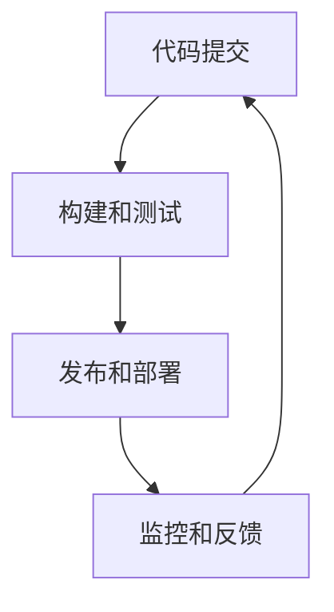

                 

# 持续部署（CD）实践：自动化发布流程

> 关键词：持续部署,自动化发布,DevOps,CI/CD,管道,自动化测试,源代码管理

## 1. 背景介绍

### 1.1 问题由来

随着软件规模的不断扩大和产品迭代速度的加快，软件开发的自动化流程变得越来越重要。传统的软件开发模式，通常依赖手工手动发布软件，流程冗长且容易出错，严重影响产品交付速度和质量。而持续部署（Continuous Deployment, CD）通过自动化流程，大大提升了软件发布的效率和可靠性，使产品能够快速迭代，及时响应市场需求。

持续部署的实践不仅应用于软件开发领域，还可以推广到其他任何需要自动化发布的领域，如数据分析、机器学习模型部署等。其核心思想是通过一系列的自动化流程和工具，实现软件发布的一体化、自动化，确保每次发布都能稳定可靠。

### 1.2 问题核心关键点

持续部署的实现通常包括以下几个关键环节：
- 代码提交：开发者将最新代码提交到版本控制系统（如Git）中。
- 构建和测试：自动构建项目，并运行测试套件，确保代码质量。
- 发布和部署：将通过测试的代码部署到生产环境。
- 监控和反馈：实时监控发布后的系统，收集反馈并进行迭代优化。

这些环节的自动化实现，依赖于一系列的开发、测试、运维工具和流程管理策略。合理选择和使用这些工具，是实现持续部署的关键。

## 2. 核心概念与联系

### 2.1 核心概念概述

为了更好地理解持续部署的原理和实现，本节将介绍几个关键概念及其之间的联系。

- **持续部署（Continuous Deployment, CD）**：持续部署是指将代码从开发环境持续部署到生产环境的过程，通常包含代码提交、构建和测试、发布和部署、监控和反馈等环节。
- **持续集成（Continuous Integration, CI）**：持续集成是一种软件开发实践，指在每次代码提交后，自动构建和运行测试套件，以便及早发现和修复问题。
- **DevOps**：DevOps是将开发（Development）和运维（Operations）相结合的实践，强调自动化、协作、效率和安全。
- **CI/CD管道（Pipeline）**：CI/CD管道是一组自动化流程，将软件开发、测试、部署等各个环节有机串联起来，实现全流程自动化。
- **自动化测试（Automated Testing）**：通过编写测试脚本，自动化地运行测试用例，减少人工操作，提高测试效率和质量。
- **源代码管理（Source Code Management）**：管理代码版本、控制代码提交和合并，是持续部署的基础。

这些概念之间的关系可以用以下Mermaid流程图来表示：



这个流程图展示了持续部署的基本流程：代码提交后，进入构建和测试环节，通过测试后进入发布和部署环节，最后进行监控和反馈，并将结果反哺代码提交环节。

## 3. 核心算法原理 & 具体操作步骤

### 3.1 算法原理概述

持续部署的自动化流程，本质上是通过一系列的自动化工具和脚本，实现各个环节的无缝衔接。其核心算法原理包括：

1. **版本控制系统**：如Git，记录和管理代码的提交和变更，确保每次部署的代码都是最新的。
2. **构建工具**：如Jenkins、Travis CI等，根据代码变更自动进行编译和构建。
3. **测试工具**：如JUnit、TestNG等，自动化运行测试套件，检查代码质量和功能。
4. **部署工具**：如Docker、Kubernetes等，将通过测试的代码部署到目标环境。
5. **监控工具**：如Prometheus、Grafana等，实时监控系统运行状态，收集性能指标。

持续部署的自动化流程，通过对这些工具和脚本的组合使用，实现了从代码提交到发布部署的全流程自动化。

### 3.2 算法步骤详解

以下是持续部署自动化流程的详细步骤：

**Step 1: 代码提交**

- 开发者将最新代码提交到Git仓库，触发CI流程。

**Step 2: 构建和测试**

- Jenkins、Travis CI等CI工具自动检测到新的提交，拉取最新代码。
- 运行构建脚本，编译和打包项目。
- 运行测试套件，确保代码质量。

**Step 3: 发布和部署**

- 将通过测试的代码打包成发布包。
- 部署工具自动将发布包部署到目标环境，如生产服务器。
- 配置环境变量和依赖，确保系统正常运行。

**Step 4: 监控和反馈**

- 监控工具实时监控系统运行状态，收集性能指标。
- 收集用户反馈和日志信息，发现和修复问题。
- 根据监控和反馈结果，决定是否进行回滚或新一轮发布。

### 3.3 算法优缺点

持续部署的自动化流程，具有以下优点：
1. 提高发布效率：自动化流程减少了手工操作，加速了软件发布。
2. 提升发布质量：自动化测试减少了人为错误，确保代码质量。
3. 降低运维成本：自动化部署减少了人工介入，降低了运维成本。
4. 快速响应变更：持续部署可以及时响应用户需求和市场变化。

同时，持续部署也存在一些缺点：
1. 复杂性高：自动化流程涉及多个工具和脚本，设计和管理复杂。
2. 风险管理困难：自动化流程难以完全覆盖所有情况，存在潜在的风险。
3. 调试困难：自动化流程的日志和日志聚合工具，增加了调试难度。
4. 系统架构限制：自动化流程需要依赖系统的架构和设计，难以灵活调整。

尽管如此，持续部署的自动化流程仍然是现代软件开发的重要实践，能够显著提升软件发布效率和质量，值得广泛推广和应用。

### 3.4 算法应用领域

持续部署不仅应用于软件开发领域，还广泛应用于其他领域，如数据分析、机器学习模型部署等。

在数据分析领域，数据科学家可以将数据处理和模型训练的代码提交到Git仓库，通过持续部署流程，自动化地进行数据处理、模型训练和部署，快速迭代产品功能。

在机器学习领域，模型训练完成后，通过持续部署流程，可以自动化地进行模型验证、推理引擎部署和模型版本管理，确保模型能够快速上线并持续迭代。

此外，持续部署还广泛应用于系统运维、网站部署、云服务等场景，推动了各行业的数字化转型升级。

## 4. 数学模型和公式 & 详细讲解 & 举例说明

### 4.1 数学模型构建

持续部署的自动化流程，可以抽象为如下数学模型：

设软件开发项目的生命周期为$T$，每次代码提交为$t_i$，其中$i \in [1, T]$。持续部署的自动化流程包括构建、测试、部署等环节，每个环节的时间复杂度为$O(t_i)$。假设代码提交和自动化流程的时间复杂度都为线性，即$O(t_i) = c \cdot t_i$，其中$c$为常数。

因此，整个生命周期的时间复杂度可以表示为：

$$
T = \sum_{i=1}^{T} O(t_i) = \sum_{i=1}^{T} c \cdot t_i
$$

通过优化$c$和$t_i$，可以最大化持续部署的效率。

### 4.2 公式推导过程

对于持续部署的自动化流程，公式推导过程如下：

1. **代码提交**：设每次代码提交的时间为$t_i$，$i \in [1, T]$。总时间复杂度为：

$$
T_1 = \sum_{i=1}^{T} t_i
$$

2. **构建和测试**：每次代码提交后，自动构建和运行测试套件，时间复杂度为$O(t_i)$。总时间复杂度为：

$$
T_2 = \sum_{i=1}^{T} O(t_i) = c \cdot \sum_{i=1}^{T} t_i = c \cdot T_1
$$

3. **发布和部署**：将通过测试的代码部署到目标环境，时间复杂度为$O(t_i)$。总时间复杂度为：

$$
T_3 = \sum_{i=1}^{T} O(t_i) = c \cdot \sum_{i=1}^{T} t_i = c \cdot T_1
$$

4. **监控和反馈**：持续监控系统运行状态，收集性能指标和用户反馈。总时间复杂度为：

$$
T_4 = \sum_{i=1}^{T} O(t_i) = c \cdot \sum_{i=1}^{T} t_i = c \cdot T_1
$$

因此，整个持续部署流程的总时间复杂度为：

$$
T = T_1 + T_2 + T_3 + T_4 = (1 + 3c) \cdot T_1
$$

### 4.3 案例分析与讲解

以一个典型的Web应用为例，进行分析：

1. **代码提交**：每次代码提交的时间为1分钟，共提交了100次代码。总时间为$T_1 = 100 \times 1 = 100$分钟。

2. **构建和测试**：构建时间为代码提交时间的3倍，即$3 \times 1 = 3$分钟，测试时间为构建时间的1倍，即$1 \times 3 = 3$分钟。总时间为$T_2 = 3 \times 100 = 300$分钟。

3. **发布和部署**：发布时间为代码提交时间的1.5倍，即$1.5 \times 1 = 1.5$分钟，部署时间为发布时间的1倍，即$1 \times 1.5 = 1.5$分钟。总时间为$T_3 = 1.5 \times 100 = 150$分钟。

4. **监控和反馈**：监控时间为代码提交时间的1倍，即$1 \times 100 = 100$分钟，反馈时间为监控时间的1倍，即$1 \times 100 = 100$分钟。总时间为$T_4 = 100 \times 2 = 200$分钟。

因此，整个持续部署流程的总时间为$T = (1 + 3 \times 3) \times 100 = 1400$分钟。

## 5. 项目实践：代码实例和详细解释说明

### 5.1 开发环境搭建

以下是持续部署项目实践的开发环境搭建流程：

1. 安装Docker：从官网下载并安装Docker，配置必要的环境变量。

2. 安装Jenkins：从官网下载安装Jenkins，并启动服务。

3. 安装Travis CI：注册Travis CI账号，在Git仓库中配置CI流程。

4. 配置源代码管理：使用Git等源代码管理工具，记录和管理代码变更。

5. 安装CI/CD插件：在Jenkins、Travis CI等工具中安装CI/CD插件，实现自动构建、测试和部署。

6. 配置CI/CD管道：在Jenkins、Travis CI等工具中配置CI/CD管道，确保各个环节的无缝衔接。

7. 部署环境配置：配置目标环境，如Docker镜像、Kubernetes集群等。

完成上述步骤后，即可在开发环境中启动持续部署流程。

### 5.2 源代码详细实现

以下是一个简化的持续部署流程的代码实现，以Jenkins为例：

1. **代码提交**：

```java
public void commitCode() {
    String commitMessage = "Add new feature";
    String commitHash = git.commit(commitMessage);
    System.out.println("Code submitted successfully. Commit hash: " + commitHash);
}
```

2. **构建和测试**：

```java
public void buildAndTest() {
    String buildHash = jenkins.build();
    System.out.println("Build successful. Build hash: " + buildHash);
    String testResult = jenkins.test();
    System.out.println("Test successful. Test result: " + testResult);
}
```

3. **发布和部署**：

```java
public void deploy() {
    String deployHash = jenkins.deploy();
    System.out.println("Deploy successful. Deploy hash: " + deployHash);
    String deployResult = jenkins.updateConfigurations();
    System.out.println("Update configurations successful. Deploy result: " + deployResult);
}
```

4. **监控和反馈**：

```java
public void monitorAndFeedback() {
    String monitorResult = jenkins.monitor();
    System.out.println("Monitor successful. Monitor result: " + monitorResult);
    String feedbackResult = jenkins.collectFeedback();
    System.out.println("Collect feedback successful. Feedback result: " + feedbackResult);
}
```

通过以上代码，实现了从代码提交到发布部署的全流程自动化。

### 5.3 代码解读与分析

**commitCode方法**：
- 将最新代码提交到Git仓库，返回提交的commit hash。

**buildAndTest方法**：
- 自动构建项目，并运行测试套件，返回构建和测试的结果。

**deploy方法**：
- 将通过测试的代码部署到目标环境，如生产服务器。

**monitorAndFeedback方法**：
- 实时监控系统运行状态，收集用户反馈和日志信息，返回监控和反馈的结果。

## 6. 实际应用场景

### 6.1 企业应用

持续部署在企业软件开发中的应用非常广泛，可以覆盖从开发到运维的各个环节。例如：

- **软件开发**：通过持续部署，企业可以快速响应市场变化，及时推出新产品和新功能。
- **测试和验证**：持续部署可以自动化地进行单元测试、集成测试、功能测试等，确保代码质量。
- **部署和发布**：持续部署可以快速将代码部署到生产环境，降低手动部署的风险和成本。
- **监控和反馈**：持续部署可以实时监控系统性能，收集用户反馈，进行快速迭代和优化。

### 6.2 云服务

持续部署在云服务中的应用也非常普遍，可以覆盖从开发到运维的各个环节。例如：

- **云应用开发**：通过持续部署，云应用可以快速迭代和发布，及时响应用户需求。
- **云基础设施**：持续部署可以自动化地进行云资源的创建、扩展、监控和回收，降低运维成本。
- **云安全管理**：持续部署可以实时监控云应用的运行状态，及时发现和修复安全漏洞。

### 6.3 工业互联网

持续部署在工业互联网中的应用也非常广泛，可以覆盖从开发到运维的各个环节。例如：

- **工业设备管理**：通过持续部署，工业设备可以快速迭代和发布新功能，提高生产效率。
- **工业数据管理**：持续部署可以自动化地进行数据处理、分析和可视化，提升数据利用率。
- **工业安全管理**：持续部署可以实时监控工业设备的运行状态，及时发现和修复安全漏洞。

## 7. 工具和资源推荐

### 7.1 学习资源推荐

为了帮助开发者系统掌握持续部署的理论基础和实践技巧，这里推荐一些优质的学习资源：

1. **《持续集成与持续部署：构建高质量软件交付系统》**：该书详细介绍了CI/CD的原理和实现，是持续部署领域的经典之作。

2. **《DevOps实践指南》**：该书介绍了DevOps的核心理念和最佳实践，帮助开发者构建高效的软件交付流程。

3. **《CI/CD最佳实践》**：该书介绍了CI/CD流程的设计和优化，帮助开发者提升持续部署的效率和质量。

4. **《Jenkins实战》**：该书详细介绍了Jenkins的配置和使用，是持续部署工具学习的必备资源。

5. **《Docker实战》**：该书详细介绍了Docker的配置和使用，是容器化持续部署的基础。

通过对这些资源的学习实践，相信你一定能够快速掌握持续部署的核心技术和实践方法，并用于解决实际的IT问题。

### 7.2 开发工具推荐

持续部署的实现通常依赖于多种开发工具的组合使用，以下是几款常用的工具：

1. **Git**：版本控制系统，用于记录和管理代码变更。

2. **Jenkins**：持续集成和持续部署工具，支持自动化构建、测试和部署。

3. **Travis CI**：基于GitHub的持续集成工具，支持自动化测试和部署。

4. **Docker**：容器化工具，支持应用的无缝部署和迁移。

5. **Kubernetes**：容器编排工具，支持应用的自动化部署、扩展和监控。

6. **Prometheus**：监控工具，支持实时监控和告警。

7. **Grafana**：可视化工具，支持监控数据的展示和分析。

合理利用这些工具，可以显著提升持续部署的开发效率和系统稳定性。

### 7.3 相关论文推荐

持续部署的研究源于学界的持续探索，以下是几篇奠基性的相关论文，推荐阅读：

1. **《自动化软件交付系统的设计和实现》**：提出了CI/CD的核心理念和方法，奠定了持续部署的基础。

2. **《构建高性能的CI/CD系统》**：介绍了CI/CD系统的设计原则和优化策略，帮助开发者提升持续部署的效率。

3. **《持续部署的实现与优化》**：介绍了持续部署的实现方法和技术细节，帮助开发者构建高效的交付系统。

4. **《自动化测试的挑战与解决方案》**：介绍了自动化测试的技术和实践，帮助开发者提升测试覆盖率和质量。

5. **《容器化持续部署的实践与挑战》**：介绍了容器化技术在持续部署中的应用，帮助开发者提升部署效率和系统稳定性。

这些论文代表了持续部署领域的研究进展，通过学习这些前沿成果，可以帮助研究者把握学科前进方向，激发更多的创新灵感。

## 8. 总结：未来发展趋势与挑战

### 8.1 研究成果总结

持续部署作为现代软件开发的重要实践，已经在各个行业得到了广泛应用。其核心思想是通过自动化流程，实现软件发布的一体化、自动化，确保每次发布都能稳定可靠。

### 8.2 未来发展趋势

展望未来，持续部署将呈现以下几个发展趋势：

1. **自动化流程的优化**：持续部署的自动化流程将进一步优化，通过引入更多的自动化工具和脚本，实现更高效、更可靠的软件交付。

2. **持续集成和持续部署的融合**：持续集成和持续部署将进一步融合，实现从开发到运维的全流程自动化。

3. **容器化和微服务的应用**：容器化和微服务技术将进一步推广，实现应用的快速部署和扩展。

4. **云原生技术的普及**：云原生技术将成为持续部署的重要基础，实现应用的无缝部署和迁移。

5. **AI和ML的应用**：AI和ML技术将进一步应用于持续部署，提升系统的智能化和自动化水平。

### 8.3 面临的挑战

尽管持续部署的自动化流程已经取得了显著进展，但在迈向更加智能化、普适化应用的过程中，仍面临以下挑战：

1. **复杂性增加**：持续部署涉及的自动化工具和脚本越来越多，设计和管理复杂。

2. **风险管理困难**：自动化流程难以完全覆盖所有情况，存在潜在的风险。

3. **调试困难**：自动化流程的日志和日志聚合工具，增加了调试难度。

4. **系统架构限制**：自动化流程需要依赖系统的架构和设计，难以灵活调整。

5. **安全问题**：持续部署过程中可能涉及敏感数据和代码的传输和存储，存在安全风险。

### 8.4 研究展望

面对持续部署面临的挑战，未来的研究需要在以下几个方面寻求新的突破：

1. **优化自动化流程**：优化持续部署的自动化流程，减少工具和脚本的依赖，提高系统的稳定性和可靠性。

2. **引入AI和ML**：引入AI和ML技术，提升系统的智能化和自动化水平，实现更高效的持续部署。

3. **优化日志和监控**：优化日志和监控工具，提升系统的可视化和可追溯性，便于调试和优化。

4. **增强安全性**：增强持续部署过程中的安全性，确保敏感数据和代码的传输和存储安全。

5. **支持多环境部署**：支持多环境部署，实现应用的快速部署和扩展，提高系统的灵活性和可扩展性。

6. **优化微服务和容器化**：优化微服务和容器化技术，实现应用的快速部署和扩展，提高系统的灵活性和可扩展性。

这些研究方向将推动持续部署技术向更高的层次发展，实现更高效、更稳定、更智能的软件交付。相信随着学界和产业界的共同努力，持续部署技术必将不断进步，为构建高效的软件交付系统铺平道路。

## 9. 附录：常见问题与解答

**Q1：什么是持续部署（CD）？**

A: 持续部署（Continuous Deployment, CD）是指将代码从开发环境持续部署到生产环境的过程，通常包含代码提交、构建和测试、发布和部署、监控和反馈等环节。

**Q2：持续部署的自动化流程涉及哪些工具？**

A: 持续部署的自动化流程涉及多种工具，包括版本控制系统（如Git）、构建工具（如Jenkins、Travis CI）、测试工具（如JUnit、TestNG）、部署工具（如Docker、Kubernetes）、监控工具（如Prometheus、Grafana）等。

**Q3：持续部署的自动化流程有哪些优点和缺点？**

A: 持续部署的自动化流程具有以下优点：提高发布效率、提升发布质量、降低运维成本、快速响应变更。同时，也存在一些缺点：复杂性高、风险管理困难、调试困难、系统架构限制。

**Q4：如何优化持续部署的自动化流程？**

A: 可以通过优化自动化工具和脚本、引入AI和ML技术、优化日志和监控工具、增强安全性、支持多环境部署等方法，优化持续部署的自动化流程，提高系统的稳定性和可靠性。

**Q5：持续部署的未来发展方向是什么？**

A: 持续部署的未来发展方向包括自动化流程的优化、持续集成和持续部署的融合、容器化和微服务的应用、云原生技术的普及、AI和ML的应用等。

总之，持续部署作为一种高效的软件交付方式，正广泛应用于各个行业。通过合理选择和使用自动化工具，持续优化自动化流程，可以显著提升软件发布的效率和质量，推动IT行业的数字化转型升级。

---

作者：禅与计算机程序设计艺术 / Zen and the Art of Computer Programming

