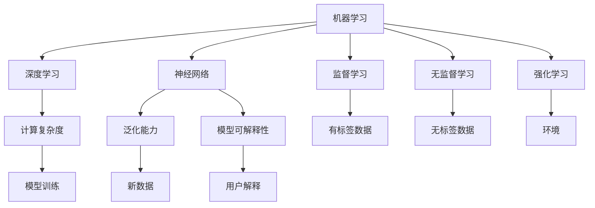

                 

# 探索人工智能基本原理的框架

> 关键词：人工智能(AI),机器学习(ML),深度学习(Deep Learning),神经网络(Neural Network),监督学习(Supervised Learning),无监督学习(Unsupervised Learning),强化学习(Reinforcement Learning),计算复杂度(Computational Complexity),泛化能力(Generalization),模型可解释性(Model Interpretability)

## 1. 背景介绍

### 1.1 问题由来
人工智能(Artificial Intelligence, AI)作为当今科技发展的热点之一，其核心在于赋予机器以智能，让机器能够模拟和延伸人类的认知能力。近年来，随着深度学习(Deep Learning, DL)和神经网络(Neural Network, NN)技术的不断进步，AI在图像识别、自然语言处理、语音识别等诸多领域取得了重大突破。然而，随着应用的广泛和复杂度的提升，如何设计高效、可解释、具有泛化能力的AI模型，成为了研究人员和实践者共同面临的挑战。

### 1.2 问题核心关键点
在AI系统的构建和优化过程中，关键点在于如何通过模型设计和训练，实现对复杂数据的学习和预测。这涉及到多个核心概念，包括：
- 监督学习(Supervised Learning)：在有标签数据上进行训练，使模型学习输入和输出之间的映射关系。
- 无监督学习(Unsupervised Learning)：在无标签数据上进行训练，发现数据的内在结构和模式。
- 强化学习(Reinforcement Learning)：在环境中通过与环境的交互，学习如何做出最优决策。
- 计算复杂度(Computational Complexity)：描述算法所需计算资源的量度，影响模型训练和推理的效率。
- 泛化能力(Generalization)：模型在未见过的数据上的表现能力，衡量模型对新数据的适应性。
- 模型可解释性(Model Interpretability)：模型决策过程的可解释性和透明性，对用户和开发者都非常重要。

这些核心概念相互作用，共同构建了AI系统的基本原理和框架。通过理解这些概念，可以更好地把握AI系统的设计和优化方向，从而构建高效、可靠、可解释的AI模型。

## 2. 核心概念与联系

### 2.1 核心概念概述

为更好地理解AI系统的基本原理，本节将介绍几个密切相关的核心概念及其相互联系：

- 机器学习(Machine Learning, ML)：一种使机器通过数据学习如何做出决策的技术，包括监督学习、无监督学习和强化学习等子领域。
- 深度学习(Deep Learning, DL)：一种基于多层神经网络的机器学习方法，尤其适用于处理非结构化数据，如图像、语音、文本等。
- 神经网络(Neural Network, NN)：由大量人工神经元连接组成的网络结构，通过反向传播算法进行训练，实现数据的复杂映射。
- 监督学习(Supervised Learning)：通过有标签数据训练模型，学习输入和输出之间的映射关系。
- 无监督学习(Unsupervised Learning)：通过无标签数据训练模型，发现数据的内在结构和模式。
- 强化学习(Reinforcement Learning)：通过与环境的交互，学习如何在不同状态下做出最优决策。
- 计算复杂度(Computational Complexity)：描述算法所需计算资源的量度，影响模型训练和推理的效率。
- 泛化能力(Generalization)：模型在未见过的数据上的表现能力，衡量模型对新数据的适应性。
- 模型可解释性(Model Interpretability)：模型决策过程的可解释性和透明性，对用户和开发者都非常重要。

这些核心概念之间的逻辑关系可以通过以下Mermaid流程图来展示：



这个流程图展示了几大核心概念及其相互联系：

1. 机器学习是人工智能的基石，包括了深度学习、神经网络等子领域。
2. 深度学习是机器学习的高级形式，通过多层神经网络实现复杂的非线性映射。
3. 神经网络是深度学习的核心组件，由大量人工神经元连接组成。
4. 监督学习、无监督学习和强化学习是机器学习的三个主要子领域，各自适用于不同的应用场景。
5. 计算复杂度描述算法所需计算资源，影响模型训练和推理效率。
6. 泛化能力衡量模型对新数据的适应性，是模型性能的关键指标。
7. 模型可解释性是用户和开发者关心的重要指标，有助于提高系统的可信度和透明性。

这些概念共同构成了AI系统的基本框架，为其设计和优化提供了理论依据。

## 3. 核心算法原理 & 具体操作步骤
### 3.1 算法原理概述

AI系统中的核心算法包括监督学习、无监督学习和强化学习等，这些算法通过训练模型，使其能够对复杂数据进行学习和预测。以监督学习为例，其基本原理如下：

假设给定训练集 $D=\{(x_i,y_i)\}_{i=1}^N$，其中 $x_i$ 为输入数据，$y_i$ 为标签，目标是找到一个函数 $f(x)$ 使得 $f(x)$ 在训练集上的预测结果与真实标签尽可能接近。通过损失函数 $L(f(x),y)$ 来衡量预测结果与真实标签之间的差异，最小化损失函数即得到了最优函数 $f(x)$。常用的损失函数包括均方误差、交叉熵等。

### 3.2 算法步骤详解

以监督学习中的神经网络为例，其训练步骤包括：

1. 数据准备：收集训练集 $D$ 和验证集 $D_{val}$，进行数据预处理，包括归一化、数据增强等。
2. 模型设计：选择合适的神经网络架构，包括网络层数、节点数、激活函数等。
3. 初始化参数：将模型参数 $w$ 随机初始化。
4. 前向传播：将输入数据 $x$ 通过网络，计算预测结果 $y^{\hat} = f(x)$。
5. 计算损失：将预测结果与真实标签 $y$ 对比，计算损失 $L(y^{\hat}, y)$。
6. 反向传播：根据损失函数对模型参数求导，更新参数 $w$。
7. 验证集验证：在验证集 $D_{val}$ 上评估模型性能，防止过拟合。
8. 迭代训练：重复上述步骤，直至模型在验证集上收敛或达到预设的训练轮数。

### 3.3 算法优缺点

监督学习算法具有以下优点：
1. 直接有效：有标签数据可以直接用于训练，模型能够直接学习输入和输出之间的关系。
2. 泛化能力强：有标签数据可以为模型提供充分的指导，提高泛化能力。
3. 应用广泛：监督学习适用于多种应用场景，如图像识别、自然语言处理、推荐系统等。

同时，监督学习算法也存在以下缺点：
1. 数据依赖性高：需要大量有标签数据，标注成本高，且数据分布可能不均衡。
2. 模型复杂度高：深度神经网络模型复杂，训练和推理速度慢。
3. 可解释性差：黑盒模型难以解释其内部工作机制和决策逻辑。

### 3.4 算法应用领域

监督学习算法广泛应用于各个领域，以下是几个典型的应用场景：

- 图像识别：如分类、检测、分割等。通过有标签的图像数据训练深度神经网络，实现对图像的高精度识别。
- 自然语言处理：如机器翻译、问答系统、文本分类等。通过有标签的文本数据训练模型，实现对文本的语义理解和生成。
- 推荐系统：如协同过滤、内容推荐、广告推荐等。通过用户行为数据和物品特征数据训练模型，实现个性化推荐。
- 语音识别：如语音转文字、语音命令识别等。通过有标签的语音数据训练模型，实现对语音信号的识别和处理。

## 4. 数学模型和公式 & 详细讲解 & 举例说明
### 4.1 数学模型构建

以监督学习中的神经网络为例，其数学模型构建如下：

假设给定训练集 $D=\{(x_i,y_i)\}_{i=1}^N$，其中 $x_i$ 为输入数据，$y_i$ 为标签。定义神经网络模型 $f(x)$ 包含 $L$ 层，第 $l$ 层的节点数为 $n_l$。模型参数 $w$ 包括权重矩阵 $W_l$ 和偏置向量 $b_l$。则神经网络的数学模型为：

$$
f(x) = f_L(\cdots f_2(f_1(x)))
$$

其中 $f_l(x)$ 表示第 $l$ 层的非线性变换，通常为激活函数。

### 4.2 公式推导过程

以二分类任务为例，常用的损失函数为二分类交叉熵损失，其公式为：

$$
L(f(x),y) = -\frac{1}{N}\sum_{i=1}^N(y_i\log f^{\hat}(x_i)+(1-y_i)\log(1-f^{\hat}(x_i)))
$$

其中 $f^{\hat}(x_i) = \sigma(W_Lx+b_L)$ 为输出层的激活函数，$\sigma$ 为 sigmoid 函数。

### 4.3 案例分析与讲解

以图像分类任务为例，使用卷积神经网络(Convolutional Neural Network, CNN)进行监督学习。其基本步骤如下：

1. 数据准备：收集训练集和验证集，进行数据预处理，包括归一化、数据增强等。
2. 模型设计：选择卷积层、池化层、全连接层等组成的网络结构，并设置合适的节点数和激活函数。
3. 初始化参数：将模型参数随机初始化。
4. 前向传播：将输入图像通过卷积层、池化层等，计算最终输出结果。
5. 计算损失：将输出结果与真实标签对比，计算交叉熵损失。
6. 反向传播：根据损失函数对模型参数求导，更新参数。
7. 验证集验证：在验证集上评估模型性能，防止过拟合。
8. 迭代训练：重复上述步骤，直至模型在验证集上收敛或达到预设的训练轮数。

## 5. 项目实践：代码实例和详细解释说明
### 5.1 开发环境搭建

在进行项目实践前，我们需要准备好开发环境。以下是使用Python进行TensorFlow开发的环境配置流程：

1. 安装Anaconda：从官网下载并安装Anaconda，用于创建独立的Python环境。

2. 创建并激活虚拟环境：
```bash
conda create -n tf-env python=3.8 
conda activate tf-env
```

3. 安装TensorFlow：根据CUDA版本，从官网获取对应的安装命令。例如：
```bash
pip install tensorflow==2.8
```

4. 安装各类工具包：
```bash
pip install numpy pandas scikit-learn matplotlib tqdm jupyter notebook ipython
```

完成上述步骤后，即可在`tf-env`环境中开始项目实践。

### 5.2 源代码详细实现

下面我以图像分类任务为例，给出使用TensorFlow进行卷积神经网络(CNN)训练的Python代码实现。

```python
import tensorflow as tf
from tensorflow.keras import layers

# 定义模型
model = tf.keras.Sequential([
    layers.Conv2D(32, (3,3), activation='relu', input_shape=(32, 32, 3)),
    layers.MaxPooling2D((2,2)),
    layers.Conv2D(64, (3,3), activation='relu'),
    layers.MaxPooling2D((2,2)),
    layers.Conv2D(64, (3,3), activation='relu'),
    layers.Flatten(),
    layers.Dense(64, activation='relu'),
    layers.Dense(10, activation='softmax')
])

# 编译模型
model.compile(optimizer='adam', loss='categorical_crossentropy', metrics=['accuracy'])

# 训练模型
history = model.fit(train_images, train_labels, epochs=10, validation_data=(val_images, val_labels))
```

这里使用了一个包含卷积层、池化层和全连接层的简单CNN模型，用于对MNIST手写数字数据集进行分类。模型通过Adam优化器进行训练，损失函数为交叉熵，评估指标为准确率。

### 5.3 代码解读与分析

让我们再详细解读一下关键代码的实现细节：

**Sequential模型**：
- `Sequential` 模型是TensorFlow中的一种顺序模型，可以方便地添加多个层。
- 添加卷积层 `Conv2D`，设置节点数、卷积核大小和激活函数。
- 添加池化层 `MaxPooling2D`，用于减小特征图尺寸。
- 添加全连接层 `Dense`，设置节点数和激活函数。

**compile函数**：
- `compile` 函数用于配置模型的训练参数，包括优化器、损失函数、评估指标等。

**fit函数**：
- `fit` 函数用于训练模型，设置训练数据、验证数据、训练轮数等参数。

**训练流程**：
- 定义模型结构，并使用 `compile` 函数配置训练参数。
- 使用 `fit` 函数对模型进行训练，并保存训练历史 `history`。

可以看到，TensorFlow使得构建和训练CNN模型变得简单高效。开发者可以将更多精力放在模型设计和数据处理上，而不必过多关注底层的实现细节。

当然，工业级的系统实现还需考虑更多因素，如模型的保存和部署、超参数的自动搜索、更灵活的任务适配层等。但核心的监督学习范式基本与此类似。

## 6. 实际应用场景
### 6.1 智能推荐系统

智能推荐系统已经在电商、视频、新闻等多个领域得到了广泛应用。传统的推荐算法依赖于用户历史行为数据，难以理解用户真实兴趣。基于监督学习的大模型推荐算法可以更好地挖掘用户行为背后的语义信息，从而提供更个性化、多样化的推荐内容。

具体而言，可以收集用户浏览、点击、评论、分享等行为数据，提取和用户交互的物品标题、描述、标签等文本内容。将文本内容作为模型输入，用户的后续行为（如是否点击、购买等）作为监督信号，在此基础上训练监督学习模型。训练后的模型能够从文本内容中准确把握用户的兴趣点，生成推荐列表时，先用候选物品的文本描述作为输入，由模型预测用户的兴趣匹配度，再结合其他特征综合排序，便可以得到个性化程度更高的推荐结果。

### 6.2 医疗诊断系统

医疗诊断系统需要高准确度和可靠性。传统的医疗诊断依赖于医生经验，易受个体差异影响。基于监督学习的模型可以通过大量有标注的病例数据进行训练，学习疾病诊断规律，提供精准的诊断建议。

具体而言，可以收集医生标注的病例数据，将疾病的症状、实验室检查结果、诊断结论等作为监督信号，训练监督学习模型。模型可以学习疾病的诊断规律，对新病例进行预测，提高诊断的准确性和效率。同时，还可以通过与知识图谱、规则库等外部知识结合，进一步提升模型的诊断能力。

### 6.3 自动驾驶系统

自动驾驶系统需要高安全性和实时性。传统的自动驾驶算法依赖于规则和传感器数据，难以处理复杂和多变的道路环境。基于监督学习的模型可以通过大量有标注的驾驶数据进行训练，学习驾驶行为规律，实现自动驾驶决策。

具体而言，可以收集自动驾驶车辆的历史驾驶数据，将车辆状态、道路环境、交通规则等作为监督信号，训练监督学习模型。模型可以学习最优的驾驶决策策略，在复杂道路环境中做出安全、高效的决策。同时，还可以通过与高精度地图、环境感知系统等外部知识结合，进一步提升模型的驾驶能力。

## 7. 工具和资源推荐
### 7.1 学习资源推荐

为了帮助开发者系统掌握监督学习的理论基础和实践技巧，这里推荐一些优质的学习资源：

1. 《深度学习入门：基于Python的理论与实现》系列博文：由深度学习领域知名专家撰写，深入浅出地介绍了深度学习的基本原理和TensorFlow等框架的使用。

2. CS231n《卷积神经网络》课程：斯坦福大学开设的图像识别经典课程，提供丰富的讲义和作业，涵盖卷积神经网络的基础知识和高级技巧。

3. 《机器学习实战》书籍：机器学习领域的经典入门书籍，涵盖监督学习、无监督学习和强化学习等基本概念和算法实现。

4. TensorFlow官方文档：TensorFlow的官方文档，提供了海量的API参考和样例代码，是学习和使用TensorFlow的重要资源。

5. Coursera《机器学习》课程：由斯坦福大学Andrew Ng教授主讲，提供系统的机器学习课程，涵盖监督学习、无监督学习和强化学习等重要概念。

通过对这些资源的学习实践，相信你一定能够快速掌握监督学习的精髓，并用于解决实际的AI问题。

### 7.2 开发工具推荐

高效的开发离不开优秀的工具支持。以下是几款用于监督学习开发的常用工具：

1. TensorFlow：由Google主导开发的深度学习框架，生产部署方便，适合大规模工程应用。

2. PyTorch：基于Python的开源深度学习框架，灵活动态的计算图，适合快速迭代研究。

3. Keras：基于TensorFlow和Theano的高级神经网络API，使用简单，快速上手。

4. Scikit-learn：Python的机器学习库，提供多种监督学习算法和数据处理工具，适合快速原型开发。

5. Jupyter Notebook：交互式编程工具，方便代码编写和数据可视化。

合理利用这些工具，可以显著提升监督学习任务的开发效率，加快创新迭代的步伐。

### 7.3 相关论文推荐

监督学习的发展源于学界的持续研究。以下是几篇奠基性的相关论文，推荐阅读：

1. 《深度学习》（Goodfellow et al., 2016）：深度学习领域的经典教材，全面介绍了深度学习的基本原理和算法实现。

2. 《图像识别：从感受器到深度神经网络》（LeCun et al., 1989）：图像识别领域的奠基之作，介绍了卷积神经网络的基本原理和算法实现。

3. 《Hadoop: The Definitive Guide》（Chiu et al., 2011）：Hadoop分布式计算框架的经典入门书籍，涵盖了数据处理、分布式计算等基本概念和实现方法。

4. 《机器学习：概念、算法与应用》（Zhang et al., 2021）：机器学习领域的经典教材，涵盖了监督学习、无监督学习和强化学习等基本概念和算法实现。

这些论文代表了大模型监督学习的发展脉络。通过学习这些前沿成果，可以帮助研究者把握学科前进方向，激发更多的创新灵感。

## 8. 总结：未来发展趋势与挑战
### 8.1 总结

本文对监督学习的基本原理和框架进行了全面系统的介绍。首先阐述了监督学习在AI系统中的核心地位，明确了其在模型训练和预测中的重要作用。其次，从原理到实践，详细讲解了监督学习模型的设计、训练和评估方法，给出了完整的代码实例。同时，本文还广泛探讨了监督学习在推荐系统、医疗诊断、自动驾驶等领域的实际应用，展示了监督学习范式的广泛价值。此外，本文精选了监督学习技术的各类学习资源，力求为读者提供全方位的技术指引。

通过本文的系统梳理，可以看到，监督学习在AI系统的构建和优化过程中发挥了关键作用。其设计和优化方法，对于构建高效、可靠、可解释的AI模型具有重要指导意义。

### 8.2 未来发展趋势

展望未来，监督学习技术将呈现以下几个发展趋势：

1. 多模态学习：监督学习将进一步拓展到多模态数据的融合，如图像、语音、文本等信息的协同建模，提升系统的综合能力。

2. 自监督学习：无标签数据将发挥更大的作用，监督学习将与自监督学习相结合，从更多样化的数据中挖掘信息。

3. 弱监督学习：对于标注成本高、标注数据稀缺的场景，弱监督学习将提供更好的解决方案，通过标签噪声和弱标签训练模型。

4. 对抗学习：监督学习将引入对抗样本，提高模型的鲁棒性和泛化能力，防范恶意攻击。

5. 联邦学习：监督学习将与联邦学习相结合，实现分布式数据上的模型训练和推理，保护用户隐私。

6. 因果学习：监督学习将引入因果推断，增强模型的解释性和可信度，提高决策的透明性和可解释性。

以上趋势凸显了监督学习技术的广阔前景。这些方向的探索发展，必将进一步提升监督学习模型的性能和应用范围，为AI系统带来新的突破。

### 8.3 面临的挑战

尽管监督学习技术已经取得了瞩目成就，但在迈向更加智能化、普适化应用的过程中，它仍面临着诸多挑战：

1. 数据质量瓶颈：监督学习依赖高质量的标注数据，但标注成本高、数据质量参差不齐，可能影响模型的性能。如何高效获取标注数据，降低标注成本，是一大挑战。

2. 模型泛化能力不足：监督学习模型可能对数据分布的变化敏感，泛化能力有限。如何在不同数据分布上保持一致的性能，是监督学习面临的重要问题。

3. 模型复杂度问题：深度神经网络模型复杂，训练和推理速度慢，难以在大规模数据集上应用。如何简化模型结构，提升推理效率，是监督学习的重要研究方向。

4. 可解释性问题：监督学习模型通常是黑盒系统，难以解释其内部工作机制和决策逻辑。如何赋予模型更高的可解释性，提高系统的透明性和可信度，是监督学习的重要课题。

5. 安全性问题：监督学习模型可能学习到有害数据和偏见，产生误导性输出。如何构建安全、可靠的系统，确保模型输出符合伦理道德，是监督学习的重要研究方向。

6. 分布式训练问题：监督学习模型通常需要大规模计算资源，如何在分布式环境下高效训练和推理，是监督学习的技术挑战。

正视监督学习面临的这些挑战，积极应对并寻求突破，将使监督学习技术不断向前发展，为构建高效、可靠、可解释的AI系统铺平道路。

### 8.4 研究展望

面对监督学习面临的种种挑战，未来的研究需要在以下几个方面寻求新的突破：

1. 数据增强技术：通过数据增强技术提升标注数据的多样性和数量，降低数据质量瓶颈。

2. 模型压缩技术：通过模型压缩技术降低模型的计算复杂度和存储需求，提升推理速度。

3. 解释性增强技术：通过解释性增强技术，提高模型的可解释性和透明性，增强系统的可信度。

4. 安全保障技术：通过安全保障技术，确保模型的输出符合伦理道德，防范恶意攻击和有害数据。

5. 分布式计算技术：通过分布式计算技术，提升监督学习模型的训练和推理效率，适应大规模数据集。

这些研究方向将使监督学习技术不断向前发展，为构建高效、可靠、可解释的AI系统提供重要支撑。只有勇于创新、敢于突破，才能不断拓展监督学习模型的边界，让AI技术更好地服务于人类社会。

## 9. 附录：常见问题与解答

**Q1：什么是监督学习？**

A: 监督学习是一种基于有标注数据进行模型训练的技术。通过学习输入和输出之间的映射关系，使模型能够对新数据进行预测。

**Q2：深度学习与监督学习的关系是什么？**

A: 深度学习是监督学习的一种高级形式，通过多层神经网络实现非线性映射。深度学习模型通常具有更高的表达能力和泛化能力，适用于处理非结构化数据。

**Q3：监督学习中的损失函数是什么？**

A: 损失函数是衡量模型预测结果与真实标签之间差异的量度，用于优化模型参数。常用的损失函数包括均方误差、交叉熵等。

**Q4：什么是模型泛化能力？**

A: 模型泛化能力是指模型在新数据上的表现能力，衡量模型对新数据的适应性。泛化能力强的模型能够更好地适应未知数据。

**Q5：什么是模型可解释性？**

A: 模型可解释性是指模型决策过程的可解释性和透明性，有助于用户和开发者理解和信任模型。

**Q6：监督学习中的模型压缩技术有哪些？**

A: 模型压缩技术包括参数剪枝、权重量化、低秩分解等，通过减小模型规模，降低计算复杂度和存储需求，提升推理速度。

**Q7：监督学习中的数据增强技术有哪些？**

A: 数据增强技术包括图像旋转、平移、缩放、翻转等，通过增加数据多样性，提高模型的泛化能力。

通过以上问题与解答，希望能对监督学习的基本原理和框架有更深入的了解。相信在未来的研究与应用中，监督学习技术将发挥越来越重要的作用，推动AI系统的不断进步。

---

作者：禅与计算机程序设计艺术 / Zen and the Art of Computer Programming

