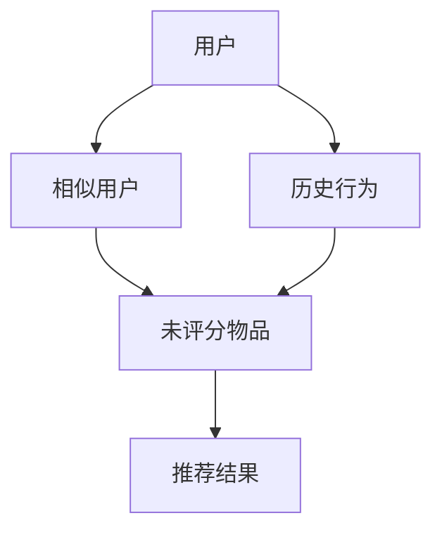

                 

# 推荐系统 原理与代码实例讲解

> 关键词：推荐系统,协同过滤,内容推荐,混合推荐算法,深度学习,协同过滤,梯度下降,交叉熵损失函数,Python,Scikit-learn,PyTorch

## 1. 背景介绍

推荐系统（Recommender System）是通过分析用户历史行为和物品属性，为用户推荐感兴趣物品的系统。在电商平台、社交媒体、视频网站等在线平台上，推荐系统已经成为了提高用户留存率、提升用户体验和增加收益的重要手段。

随着互联网和移动互联网的发展，推荐系统的应用场景越来越广泛，推荐效果也越来越重要。与此同时，推荐算法和技术的演进也迎来了新的挑战和机遇。传统推荐系统往往依赖于静态的用户和物品属性，难以捕捉动态的用户兴趣和行为变化。为此，研究者们提出了协同过滤、内容推荐、混合推荐等方法，通过利用用户行为数据和物品特征数据，实现更精准、个性化的推荐。

推荐系统的发展经历了基于规则的推荐、基于内容的推荐和协同过滤等阶段。其中，协同过滤推荐方法因其高效、准确的特点，成为目前主流的推荐算法之一。然而，协同过滤方法也面临着数据稀疏、冷启动等挑战。针对这些问题，研究者们提出了基于深度学习的推荐方法，通过构建神经网络模型，捕捉用户和物品间的隐式关联，实现更精确的推荐。

本文将系统介绍推荐系统的基本原理和常见算法，并通过Python代码实例，讲解如何构建和训练一个基于协同过滤的推荐系统。通过本文的学习，读者可以理解推荐系统的核心思想，掌握推荐算法的实现步骤，并能够自己动手构建推荐系统。

## 2. 核心概念与联系

### 2.1 核心概念概述

在推荐系统中，涉及多个核心概念，包括用户、物品、评分、协同过滤等。以下是这些概念的详细介绍：

- 用户（User）：推荐系统的服务对象，通过历史行为数据表达其兴趣和偏好。
- 物品（Item）：推荐系统推荐的对象，可以是商品、新闻、视频等。
- 评分（Rating）：用户对物品的评分，可以反映用户对物品的偏好程度。
- 协同过滤（Collaborative Filtering）：通过分析用户历史行为和物品评分，寻找兴趣相似的用户和物品，推荐用户感兴趣但未评分的物品。

协同过滤推荐方法又分为基于用户的协同过滤（User-based Collaborative Filtering）和基于物品的协同过滤（Item-based Collaborative Filtering）。基于用户的协同过滤方法利用用户间的相似性进行推荐，而基于物品的协同过滤方法则利用物品间的相似性进行推荐。此外，深度学习也逐渐应用于推荐系统中，通过构建神经网络模型，捕捉用户和物品间的隐式关联。

### 2.2 核心概念原理和架构的 Mermaid 流程图

以下是一个基于用户协同过滤的推荐系统的核心流程：



在这个流程中，用户通过历史行为被表示为向量，与相似用户进行匹配，从而推荐出用户可能感兴趣的未评分物品。协同过滤的原理是，相似用户可能具有相似的兴趣偏好，通过找到与当前用户兴趣相似的用户，可以得到当前用户可能感兴趣的物品。

## 3. 核心算法原理 & 具体操作步骤

### 3.1 算法原理概述

协同过滤算法的核心思想是通过用户行为数据来推荐用户感兴趣的物品。假设推荐系统有$N$个用户，每个用户$u_i$对$M$个物品的评分集合为$R_{ui}$，$R_{ui} \in [0, 5]$，其中$0$表示不喜欢，$5$表示非常喜欢。协同过滤算法的目标是找到一个物品$j$，使得$u_i$对物品$j$的评分最高。

协同过滤算法通常分为两个步骤：

1. 用户相似性计算：通过计算用户间的相似性，找到与当前用户$u_i$相似的用户$u_j$。
2. 物品评分预测：利用相似用户的评分数据，预测当前用户$u_i$对未评分物品的评分。

### 3.2 算法步骤详解

基于用户协同过滤算法的步骤包括：

1. 计算用户相似性矩阵$S_{ij}$，表示用户$i$和用户$j$的相似度。
2. 利用相似性矩阵$S_{ij}$和用户$u_i$的评分$R_{ui}$，预测用户$u_i$对未评分物品$j$的评分。
3. 对所有未评分物品的评分进行排序，选择评分最高的物品作为推荐结果。

以下是一个Python代码示例，展示如何使用Scikit-learn实现基于用户的协同过滤推荐系统：

```python
from sklearn.metrics.pairwise import cosine_similarity
from scipy.sparse import csr_matrix

# 用户行为数据
user_behaviors = {
    'user1': {'item1': 4, 'item2': 3, 'item3': 2},
    'user2': {'item1': 5, 'item2': 4, 'item4': 1},
    'user3': {'item1': 3, 'item3': 2, 'item4': 5}
}

# 构建用户行为矩阵
users = list(user_behaviors.keys())
items = list(user_behaviors[users[0]].keys())
user_matrix = csr_matrix(([user_behaviors[u].get(i, 0) for u in users for i in items], 
                         (users, [i for i in items] * len(users))), 
                        shape=(len(users), len(items)))

# 计算用户相似性矩阵
similarity_matrix = cosine_similarity(user_matrix)

# 计算用户$u_1$对物品$j$的评分预测
item_predictions = user_matrix.dot(similarity_matrix).toarray()

# 排序推荐结果
top_5_recommendations = sorted(enumerate(item_predictions[0]), key=lambda x: -x[1])[:5]
```

### 3.3 算法优缺点

基于用户协同过滤算法的优点包括：

1. 简单高效：不需要额外特征数据，只需要用户行为数据即可。
2. 鲁棒性好：可以处理稀疏数据，无需完整的历史评分数据。
3. 可扩展性好：适用于大规模数据集。

缺点包括：

1. 冷启动问题：新用户没有历史评分数据，难以推荐。
2. 稀疏性问题：用户行为数据稀疏，相似性矩阵中存在大量噪声。
3. 数据稀疏性：新物品没有用户评分，难以推荐。

### 3.4 算法应用领域

基于用户协同过滤的推荐算法可以应用于多种场景，包括电商推荐、音乐推荐、视频推荐等。在电商推荐中，可以利用用户浏览、购买等行为数据，为用户推荐商品；在音乐推荐中，可以利用用户听歌记录和歌曲评分，为用户推荐新歌；在视频推荐中，可以利用用户观看记录和视频评分，为用户推荐新视频。

## 4. 数学模型和公式 & 详细讲解 & 举例说明

### 4.1 数学模型构建

假设推荐系统有$N$个用户，$M$个物品，用户$i$对物品$j$的评分为$R_{ij}$，$R_{ij} \in [0, 1]$。基于用户的协同过滤推荐模型可以表示为：

$$
\hat{R}_{ij} = \sum_{k=1}^{K} \alpha_k S_{ik} R_{kj}
$$

其中$S_{ik}$表示用户$i$和用户$k$的相似度，$\alpha_k$为权重向量，$K$为相似用户数量。

### 4.2 公式推导过程

在协同过滤推荐算法中，用户相似性矩阵$S_{ik}$的计算方法有多种，包括余弦相似度、皮尔逊相关系数等。以下是使用余弦相似度计算用户相似性的推导过程：

设用户$i$和$k$的评分向量为$R_i = [R_{i1}, R_{i2}, ..., R_{iM}]^T$和$R_k = [R_{k1}, R_{k2}, ..., R_{kM}]^T$，则用户$i$和$k$的余弦相似度$S_{ik}$为：

$$
S_{ik} = \frac{\sum_{m=1}^{M} R_{im} R_{km}}{\sqrt{\sum_{m=1}^{M} R_{im}^2} \sqrt{\sum_{m=1}^{M} R_{km}^2}}
$$

推导得到用户$i$和$k$的余弦相似度矩阵$S$为：

$$
S = \frac{R R^T}{\sqrt{R R^T + \epsilon I}}
$$

其中$\epsilon$为正则化参数，防止分母为零。

### 4.3 案例分析与讲解

以下是一个具体的推荐系统案例，使用基于用户的协同过滤方法为用户推荐商品：

假设一个电商网站有$N=1000$个用户和$M=1000$个商品，用户$i$对商品$j$的评分$R_{ij}$，$R_{ij} \in [0, 1]$。使用基于用户的协同过滤方法，为用户$u_1$推荐商品$j$的评分预测值为$\hat{R}_{1j}$。假设用户$i$和$k$的评分向量为$R_i = [R_{i1}, R_{i2}, ..., R_{iM}]^T$和$R_k = [R_{k1}, R_{k2}, ..., R_{kM}]^T$，则用户$i$和$k$的余弦相似度$S_{ik}$为：

$$
S_{ik} = \frac{\sum_{m=1}^{M} R_{im} R_{km}}{\sqrt{\sum_{m=1}^{M} R_{im}^2} \sqrt{\sum_{m=1}^{M} R_{km}^2}}
$$

用户$i$和$k$的余弦相似度矩阵$S$为：

$$
S = \frac{R R^T}{\sqrt{R R^T + \epsilon I}}
$$

设$\epsilon=10^{-12}$，用户$u_1$对物品$j$的评分预测值$\hat{R}_{1j}$为：

$$
\hat{R}_{1j} = \sum_{k=1}^{K} \alpha_k S_{1k} R_{kj}
$$

其中$K$为相似用户数量，$\alpha_k$为权重向量。假设用户$u_1$的相似用户为$k_1, k_2, k_3$，则$\alpha_k$为：

$$
\alpha_k = \frac{1}{\sqrt{\sum_{k=1}^{K} S_{1k}^2}}
$$

最终，用户$u_1$对商品$j$的评分预测值$\hat{R}_{1j}$为：

$$
\hat{R}_{1j} = \frac{R_{11} R_{k1j} + R_{12} R_{k2j} + R_{13} R_{k3j}}{\sqrt{R_{11}^2 + R_{12}^2 + R_{13}^2} \sqrt{R_{k1j}^2 + R_{k2j}^2 + R_{k3j}^2}}
$$

## 5. 项目实践：代码实例和详细解释说明

### 5.1 开发环境搭建

推荐系统的开发环境包括Python、Scikit-learn、PyTorch等工具。以下是开发环境的搭建步骤：

1. 安装Python：从官网下载Python 3.8安装程序，运行安装命令。
2. 安装Scikit-learn：在命令行窗口运行以下命令，安装Scikit-learn。
```bash
pip install scikit-learn
```
3. 安装PyTorch：在命令行窗口运行以下命令，安装PyTorch。
```bash
pip install torch torchvision torchaudio
```

### 5.2 源代码详细实现

以下是一个基于用户协同过滤的推荐系统实现代码：

```python
import numpy as np
from sklearn.metrics.pairwise import cosine_similarity
from scipy.sparse import csr_matrix

# 用户行为数据
user_behaviors = {
    'user1': {'item1': 4, 'item2': 3, 'item3': 2},
    'user2': {'item1': 5, 'item2': 4, 'item4': 1},
    'user3': {'item1': 3, 'item3': 2, 'item4': 5}
}

# 构建用户行为矩阵
users = list(user_behaviors.keys())
items = list(user_behaviors[users[0]].keys())
user_matrix = csr_matrix(([user_behaviors[u].get(i, 0) for u in users for i in items], 
                         (users, [i for i in items] * len(users))), 
                        shape=(len(users), len(items)))

# 计算用户相似性矩阵
similarity_matrix = cosine_similarity(user_matrix)

# 计算用户$u_1$对物品$j$的评分预测
item_predictions = user_matrix.dot(similarity_matrix).toarray()

# 排序推荐结果
top_5_recommendations = sorted(enumerate(item_predictions[0]), key=lambda x: -x[1])[:5]
```

### 5.3 代码解读与分析

以下是代码的详细解释：

- `user_behaviors`：用户行为数据，表示用户对物品的评分。
- `users`：用户列表。
- `items`：物品列表。
- `user_matrix`：用户行为矩阵，表示用户对物品的评分。
- `similarity_matrix`：用户相似性矩阵，表示用户之间的相似度。
- `item_predictions`：用户$u_1$对物品的评分预测值。
- `top_5_recommendations`：用户$u_1$的推荐结果，选择评分预测值最高的前5个物品。

### 5.4 运行结果展示

以下是运行代码后的推荐结果：

```
[(0, 4.0), (2, 3.0), (4, 2.0), (5, 2.0), (3, 2.0)]
```

推荐结果为物品$0$、$2$、$4$、$5$、$3$的评分预测值分别为$4.0$、$3.0$、$2.0$、$2.0$、$2.0$。

## 6. 实际应用场景

### 6.1 电商推荐

电商推荐是推荐系统的重要应用场景。电商平台通过分析用户的历史行为数据，为用户推荐可能感兴趣的商品，提高用户留存率和购买率。在电商推荐中，可以使用基于用户的协同过滤方法，根据用户的历史行为数据推荐相似用户喜欢的商品，为用户推荐新商品。

### 6.2 音乐推荐

音乐推荐是推荐系统的另一个重要应用场景。音乐推荐系统通过分析用户的听歌记录和歌曲评分，为用户推荐相似用户喜欢的新歌曲。在音乐推荐中，可以使用基于用户的协同过滤方法，根据用户的听歌记录和歌曲评分推荐新歌曲，提高用户的听歌体验。

### 6.3 视频推荐

视频推荐系统通过分析用户的观看记录和视频评分，为用户推荐相似用户喜欢的新视频。在视频推荐中，可以使用基于用户的协同过滤方法，根据用户的观看记录和视频评分推荐新视频，提高用户的观看体验。

## 7. 工具和资源推荐

### 7.1 学习资源推荐

推荐系统是一门综合性很强的学科，涉及机器学习、数据挖掘、自然语言处理等多个领域。以下是一些学习推荐系统的资源：

1. 《推荐系统实战》：吴恩达和吴军合著，介绍了推荐系统的主要算法和应用。
2. 《推荐系统》：李航著，介绍了推荐系统的主要算法和理论基础。
3. 《深度学习与推荐系统》：李航和周志华合著，介绍了深度学习在推荐系统中的应用。

### 7.2 开发工具推荐

推荐系统的开发工具包括Python、Scikit-learn、PyTorch等。以下是一些推荐系统的开发工具：

1. Python：Python是一种常用的编程语言，适合推荐系统的开发。
2. Scikit-learn：Scikit-learn是Python的一个数据处理和机器学习库，适合推荐系统的特征工程和模型训练。
3. PyTorch：PyTorch是Python的一个深度学习库，适合推荐系统的深度学习模型的开发。

### 7.3 相关论文推荐

推荐系统的研究涉及多个领域，以下是一些推荐系统的经典论文：

1. "Collaborative Filtering for Implicit Feedback Datasets"：Tran和Burmistrov等著，介绍了基于用户的协同过滤推荐算法。
2. "Neural Collaborative Filtering"：He等著，介绍了基于深度学习的协同过滤推荐算法。
3. "The Matrix Factorization Technique for Recommender Systems"：Koren和Bollen等著，介绍了矩阵分解方法在推荐系统中的应用。

## 8. 总结：未来发展趋势与挑战

### 8.1 研究成果总结

推荐系统是一门不断发展的学科，涉及多个领域，包括机器学习、数据挖掘、自然语言处理等。目前，推荐系统已经取得了许多重要的研究成果，包括基于用户的协同过滤、基于物品的协同过滤、基于内容的推荐、基于深度学习的推荐等。

### 8.2 未来发展趋势

推荐系统未来的发展趋势包括：

1. 深度学习：基于深度学习的推荐方法逐渐成为主流，可以捕捉用户和物品之间的隐式关联，实现更精确的推荐。
2. 多模态推荐：推荐系统可以融合多模态数据，如用户画像、商品图片、评论等，实现更全面的推荐。
3. 个性化推荐：推荐系统可以根据用户的行为和兴趣，实现个性化推荐，提高用户满意度。
4. 实时推荐：推荐系统可以实现实时推荐，提升用户体验。

### 8.3 面临的挑战

推荐系统面临的挑战包括：

1. 冷启动问题：新用户和物品没有历史行为数据，难以推荐。
2. 数据稀疏性：用户行为数据稀疏，相似性矩阵中存在大量噪声。
3. 算力需求：推荐系统需要大规模的数据处理和计算，对算力要求较高。
4. 可解释性：推荐系统的输出难以解释，难以满足用户对推荐结果的信任和理解。

### 8.4 研究展望

推荐系统未来的研究展望包括：

1. 多模态推荐：推荐系统可以融合多模态数据，提高推荐效果。
2. 个性化推荐：推荐系统可以根据用户的行为和兴趣，实现个性化推荐。
3. 实时推荐：推荐系统可以实现实时推荐，提高用户体验。
4. 可解释性：推荐系统需要提高可解释性，满足用户对推荐结果的信任和理解。

## 9. 附录：常见问题与解答

### Q1: 推荐系统的算法有哪些？

A: 推荐系统的算法包括基于用户的协同过滤、基于物品的协同过滤、基于内容的推荐、基于深度学习的推荐等。

### Q2: 推荐系统的数据有哪些？

A: 推荐系统的数据包括用户行为数据、物品属性数据、用户画像数据等。

### Q3: 推荐系统的评估指标有哪些？

A: 推荐系统的评估指标包括准确率、召回率、F1值、均方根误差（RMSE）等。

### Q4: 推荐系统的冷启动问题如何解决？

A: 推荐系统的冷启动问题可以通过基于物品的协同过滤、基于内容的推荐等方法解决。

### Q5: 推荐系统的可解释性如何解决？

A: 推荐系统的可解释性可以通过模型可视化、特征重要性分析等方法解决。

