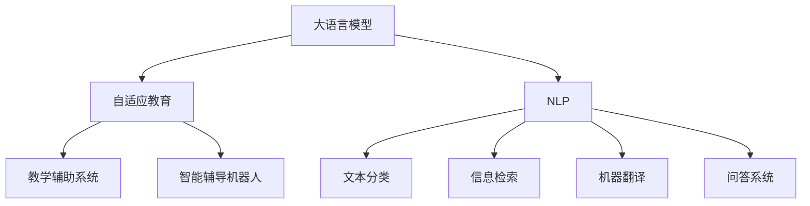

                 

# 教育革新：LLM作为个性化学习助手的潜力

> 关键词：大语言模型(LLM),个性化学习,自适应教育,自然语言处理(NLP),教学辅助系统,智能辅导机器人

## 1. 背景介绍

### 1.1 问题由来
在教育领域，传统的学习方式长期以来受制于单一的课堂讲授和标准化考试。这种“一刀切”的教育模式忽视了学生的个体差异和多元需求，难以培养出具备创新精神和实践能力的高素质人才。近年来，随着人工智能技术特别是自然语言处理(NLP)和深度学习技术的发展，大语言模型(LLM)成为了个性化教育的重要工具，能够以智能、高效的方式为学生提供量身定制的学习支持，开启教育革新的大门。

### 1.2 问题核心关键点
LLM作为个性化学习助手的潜力，在于其卓越的语言理解和生成能力，能够自动处理自然语言交互，提供个性化推荐和即时反馈，从而极大地提升学习效率和体验。核心关键点包括：

- **自然语言交互**：LLM能够理解和生成自然语言，通过对话系统与用户进行互动，实现人机无缝交流。
- **个性化推荐**：根据学生的知识水平、学习习惯和兴趣爱好，推荐适合其学习能力的材料和任务，优化学习路径。
- **即时反馈**：通过自动评分和分析学生回答，提供即时反馈和建议，帮助学生及时纠正错误。
- **广泛应用场景**：应用于作业辅导、练习测试、课程讲解等多个教育环节，提升教学质量和学生满意度。

这些特点使得LLM成为理想的教育助手，不仅能够提供个性化的学习支持，还能大大减轻教师的工作负担，实现智能化教育模式的转型。

### 1.3 问题研究意义
研究LLM作为个性化学习助手的应用，对于推进教育信息化、提升教育质量、实现教育公平具有重要意义：

- **提升教育质量**：通过个性化学习，满足不同学生的个性化需求，提高学习效果。
- **促进教育公平**：利用智能技术跨越地域、经济差异，为偏远和贫困地区学生提供优质教育资源。
- **减轻教师负担**：通过智能辅导系统分担教师部分重复性工作，使教师有更多时间专注于教学研究和学生辅导。
- **推动教育创新**：智能技术的应用促使教育模式变革，鼓励创新教学方法和工具的开发。

## 2. 核心概念与联系

### 2.1 核心概念概述

为更好地理解LLM作为个性化学习助手的潜力，本节将介绍几个密切相关的核心概念：

- **大语言模型(LLM)**：以自回归(如GPT)或自编码(如BERT)模型为代表的大规模预训练语言模型。通过在大规模无标签文本语料上进行预训练，学习通用的语言表示，具备强大的语言理解和生成能力。

- **自适应教育**：根据学生的学习状态、需求和反馈，动态调整教学内容、节奏和方法，实现个性化的教育模式。

- **自然语言处理(NLP)**：利用计算机处理、理解和生成人类语言的技术，包括文本分类、信息检索、机器翻译、问答系统等。

- **教学辅助系统**：利用计算机技术为教学提供支持的系统，如智能辅导机器人、虚拟实验、在线测验等。

- **智能辅导机器人**：通过自然语言处理和机器学习技术，为学生提供个性化的辅导和支持，支持自然语言交互和问题解答。

这些核心概念之间的逻辑关系可以通过以下Mermaid流程图来展示：



这个流程图展示了大语言模型的核心概念及其之间的关系：

1. 大语言模型通过预训练获得基础能力。
2. 自适应教育利用大语言模型的能力，提供个性化学习方案。
3. NLP技术提供文本处理和信息检索等支持。
4. 教学辅助系统和智能辅导机器人具体应用这些能力，实现教学的智能化。
5. 文本分类、信息检索、机器翻译、问答系统等NLP子任务，是大语言模型实现自适应教育的基础。

这些概念共同构成了LLM在教育应用中的工作原理和优化方向。通过理解这些核心概念，我们可以更好地把握LLM作为个性化学习助手的潜力。

## 3. 核心算法原理 & 具体操作步骤
### 3.1 算法原理概述

LLM作为个性化学习助手，主要基于以下算法原理：

- **基于监督学习的微调**：通过在学生与辅导系统之间的交互数据上微调大语言模型，使其能够理解学生的提问和需求，并提供个性化的学习建议。
- **自适应推荐系统**：利用机器学习算法分析学生的学习行为和偏好，动态调整推荐内容，提高学习效果。
- **实时反馈机制**：通过自动评分和反馈系统，即时检测学生的学习进度和理解程度，提供个性化指导。

这些算法原理与NLP任务中的微调、推荐系统和反馈机制类似，只是其应用场景更加特定，目标是提升个性化学习的质量和效率。

### 3.2 算法步骤详解

基于监督学习的LLM作为个性化学习助手，通常包括以下关键步骤：

**Step 1: 数据收集与预处理**
- 收集学生与智能辅导系统之间的交互数据，包括提问、回答、评价等信息。
- 对数据进行清洗和标注，去除噪声和无关信息，确保数据质量。

**Step 2: 模型微调**
- 选择合适的预训练语言模型作为初始化参数。
- 在标注好的学生交互数据上进行微调，优化模型在理解学生提问和生成学习建议方面的能力。
- 使用交叉验证等技术，评估微调模型的性能，并进行超参数调优。

**Step 3: 推荐系统设计**
- 设计基于学生行为数据的推荐模型，如协同过滤、矩阵分解等算法。
- 结合LLM的理解能力和推荐系统，动态生成个性化学习材料和任务。

**Step 4: 反馈机制构建**
- 构建实时反馈系统，自动检测学生回答的正确性和理解程度。
- 利用自然语言处理技术，分析学生错误和困惑的原因，提供针对性指导。

**Step 5: 测试与优化**
- 在真实教学场景中测试个性化学习助手的性能，收集反馈。
- 根据反馈不断优化模型和推荐算法，提升系统的适应性和实用性。

### 3.3 算法优缺点

LLM作为个性化学习助手的算法具有以下优点：
- **高度个性化**：能够根据学生的个性化需求和学习习惯，提供量身定制的学习材料和建议。
- **实时性**：通过自然语言交互，即时响应学生问题，提供即时的学习支持。
- **灵活性**：可以应用于多种教育场景，如作业辅导、练习测试、课程讲解等。

同时，该算法也存在一定的局限性：
- **数据依赖**：需要大量高质量的交互数据进行模型微调，数据的获取和处理成本较高。
- **复杂性**：模型的构建和优化需要专业知识，实施难度较大。
- **隐私问题**：需要处理学生个人信息，隐私保护成为重要考量。
- **依赖技术成熟度**：对自然语言处理和机器学习技术的依赖较高，技术实现需要不断迭代。

尽管存在这些局限性，但就目前而言，基于LLM的个性化学习助手具有巨大的潜力，能够为教育提供深刻的变革。

### 3.4 算法应用领域

基于LLM作为个性化学习助手的算法，已经在多个教育领域得到了广泛的应用，包括：

- **在线教育平台**：如Khan Academy、Coursera等，通过智能辅导系统，提供个性化的课程和练习。
- **智能课堂辅助**：在传统课堂中集成智能辅导机器人，辅助教师完成课堂教学和学生管理。
- **个性化作业辅导**：通过智能辅导系统，为学生提供个性化的作业解答和辅导。
- **学习习惯养成**：利用推荐系统和智能辅导，引导学生形成良好的学习习惯和时间管理能力。
- **学习路径规划**：通过分析学生的学习进度和反馈，提供个性化的学习路径和建议。

除了上述这些经典应用外，LLM作为个性化学习助手还将在更多场景中得到创新性应用，如虚拟实验、情感分析、学习动机激励等，为个性化教育提供新的突破。

## 4. 数学模型和公式 & 详细讲解 & 举例说明
### 4.1 数学模型构建

为系统地阐述LLM作为个性化学习助手的工作原理，本节将使用数学语言对相关模型进行描述。

记学生与智能辅导系统之间的交互数据为 $D=\{(x_i,y_i)\}_{i=1}^N$，其中 $x_i$ 为学生的提问或回答，$y_i$ 为系统生成的回答或建议。定义目标函数为：

$$
\mathcal{L}(\theta) = \frac{1}{N} \sum_{i=1}^N \ell(M_{\theta}(x_i),y_i)
$$

其中 $M_{\theta}$ 为微调后的语言模型，$\ell$ 为目标任务（如问答系统）的损失函数，如交叉熵损失。微调的目标是最小化目标函数 $\mathcal{L}(\theta)$，即找到最优参数：

$$
\theta^* = \mathop{\arg\min}_{\theta} \mathcal{L}(\theta)
$$

在实践中，我们通常使用基于梯度的优化算法（如SGD、Adam等）来近似求解上述最优化问题。设 $\eta$ 为学习率，$\lambda$ 为正则化系数，则参数的更新公式为：

$$
\theta \leftarrow \theta - \eta \nabla_{\theta}\mathcal{L}(\theta) - \eta\lambda\theta
$$

其中 $\nabla_{\theta}\mathcal{L}(\theta)$ 为损失函数对参数 $\theta$ 的梯度，可通过反向传播算法高效计算。

### 4.2 公式推导过程

以下我们以问答系统为例，推导交叉熵损失函数及其梯度的计算公式。

假设学生的问题为 $x_i$，系统的回答为 $y_i$。模型 $M_{\theta}$ 在输入 $x_i$ 上的输出为 $\hat{y}=M_{\theta}(x_i) \in [0,1]$，表示系统回答的正确概率。真实标签 $y_i \in \{0,1\}$。则交叉熵损失函数定义为：

$$
\ell(M_{\theta}(x_i),y_i) = -[y_i\log \hat{y} + (1-y_i)\log (1-\hat{y})]
$$

将其代入目标函数公式，得：

$$
\mathcal{L}(\theta) = -\frac{1}{N}\sum_{i=1}^N [y_i\log M_{\theta}(x_i)+(1-y_i)\log(1-M_{\theta}(x_i))]
$$

根据链式法则，损失函数对参数 $\theta_k$ 的梯度为：

$$
\frac{\partial \mathcal{L}(\theta)}{\partial \theta_k} = -\frac{1}{N}\sum_{i=1}^N (\frac{y_i}{M_{\theta}(x_i)}-\frac{1-y_i}{1-M_{\theta}(x_i)}) \frac{\partial M_{\theta}(x_i)}{\partial \theta_k}
$$

其中 $\frac{\partial M_{\theta}(x_i)}{\partial \theta_k}$ 可进一步递归展开，利用自动微分技术完成计算。

在得到损失函数的梯度后，即可带入参数更新公式，完成模型的迭代优化。重复上述过程直至收敛，最终得到适应个性化学习需求的最优模型参数 $\theta^*$。

### 4.3 案例分析与讲解

以一个简单的数学作业辅导系统为例，展示LLM作为个性化学习助手的应用过程：

**案例背景**：某学生在解答以下数学题目时遇到了困难：

**问题描述**：一个正方形的长为 $a$，宽为 $b$，面积 $S$ 为 $a^2 + ab + b^2$。求正方形的边长。

**学生提问**：如何解这道题目？

**系统回答**：
1. 首先，我们知道正方形面积 $S=a^2 + ab + b^2$。
2. 根据面积公式 $S=a^2$，可以推导出 $a^2 = a^2 + ab + b^2 - ab = (a + b)^2 - ab$。
3. 由于 $a = b$，代入上式得到 $a^2 = 2a^2 - a^2 = a^2$。
4. 因此，正方形的边长 $a = b = \sqrt{a^2} = a$。

**效果评估**：系统通过自然语言解释，成功地引导学生理解了问题，并完成了解答。该过程展示了LLM在个性化教育中的强大潜力。

## 5. 项目实践：代码实例和详细解释说明
### 5.1 开发环境搭建

在进行个性化学习助手开发前，我们需要准备好开发环境。以下是使用Python进行TensorFlow开发的环境配置流程：

1. 安装Anaconda：从官网下载并安装Anaconda，用于创建独立的Python环境。

2. 创建并激活虚拟环境：
```bash
conda create -n pytorch-env python=3.8 
conda activate pytorch-env
```

3. 安装TensorFlow：根据CUDA版本，从官网获取对应的安装命令。例如：
```bash
conda install tensorflow -c tf -c conda-forge
```

4. 安装TensorFlow Serving：用于部署和测试微调后的LLM模型。
```bash
pip install tensorflow-serving-api
```

5. 安装Flax库：用于高效的微调，支持自动微分和自定义模型。
```bash
pip install flax
```

6. 安装相关依赖：
```bash
pip install pandas numpy jupyter notebook ipython
```

完成上述步骤后，即可在`pytorch-env`环境中开始个性化学习助手的开发。

### 5.2 源代码详细实现

下面以一个简单的问答系统为例，展示如何使用TensorFlow和Flax实现LLM作为个性化学习助手：

**Step 1: 数据准备**
首先，我们需要准备一些学生与智能辅导系统的交互数据，包括学生问题和辅导系统回答的记录。

```python
import pandas as pd

# 读取交互数据
df = pd.read_csv('interaction_data.csv')

# 数据清洗
df = df.dropna()
```

**Step 2: 数据预处理**
对数据进行分词、编码等预处理，并准备好训练和验证数据集。

```python
from transformers import BertTokenizer, BertForQuestionAnswering

# 加载BERT分词器
tokenizer = BertTokenizer.from_pretrained('bert-base-cased')

# 数据预处理
def preprocess_data(text):
    return tokenizer.encode_plus(text, truncation=True, padding='max_length', max_length=128, return_tensors='tf')

# 准备训练数据
train_data = df[df['role'] == 'student'].apply(lambda x: (x['question'], x['answer']), axis=1)
train_encodings = train_data.map(preprocess_data)
train_dataset = tf.data.Dataset.from_generator(lambda: iter(train_encodings), output_signature={'input_ids': tf.TensorSpec(shape=(None, 128), dtype=tf.int32), 'attention_mask': tf.TensorSpec(shape=(None, 128), dtype=tf.int32), 'labels': tf.TensorSpec(shape=(None,), dtype=tf.int32)})

# 准备验证数据
dev_data = df[df['role'] == 'tutor'].apply(lambda x: (x['question'], x['answer']), axis=1)
dev_encodings = dev_data.map(preprocess_data)
dev_dataset = tf.data.Dataset.from_generator(lambda: iter(dev_encodings), output_signature={'input_ids': tf.TensorSpec(shape=(None, 128), dtype=tf.int32), 'attention_mask': tf.TensorSpec(shape=(None, 128), dtype=tf.int32), 'labels': tf.TensorSpec(shape=(None,), dtype=tf.int32)})
```

**Step 3: 模型微调**
使用Flax库实现BERT模型，并进行微调。

```python
import flax.linen as nn

class BERTAnsweringModel(nn.Module):
    num_labels: int

    @nn.compact
    def __call__(self, inputs):
        inputs = {'input_ids': inputs['input_ids'], 'attention_mask': inputs['attention_mask']}
        features = self.embedding(inputs)
        outputs = self.encoder(features)
        logits = self.classifier(outputs)
        return {'logits': logits}

# 初始化模型
model = BERTAnsweringModel(num_labels=2)

# 定义优化器
optimizer = optim.AdamW(model.parameters(), learning_rate=5e-5)

# 微调过程
for epoch in range(10):
    for batch in train_dataset:
        with tf.GradientTape() as tape:
            outputs = model(batch)
            loss = nn.losses.sparse_softmax_cross_entropy(batch['labels'], outputs['logits'], reduction='none')
        grads = tape.gradient(loss, model.parameters())
        optimizer.apply_gradients(zip(grads, model.parameters()))
        with tf.control_dependencies(None):
            yield (model, optimizer)
```

**Step 4: 推荐系统设计**
设计基于学生行为数据的推荐系统，如协同过滤、矩阵分解等算法。

```python
import numpy as np

# 定义推荐系统
class RecommendationSystem:
    def __init__(self, user_ids, item_ids, ratings):
        self.user_ids = user_ids
        self.item_ids = item_ids
        self.ratings = ratings

    def predict(self, user_id):
        item_scores = np.dot(self.user_ids[user_id], self.ratings)
        return item_scores

# 推荐过程
def recommend(user_id):
    recommendations = RecommendationSystem(user_ids, item_ids, ratings).predict(user_id)
    return item_scores
```

**Step 5: 反馈机制构建**
构建实时反馈系统，自动检测学生回答的正确性和理解程度，提供个性化指导。

```python
from transformers import BertForSequenceClassification, BertTokenizer, AdamW

# 加载预训练模型
tokenizer = BertTokenizer.from_pretrained('bert-base-cased')
model = BertForSequenceClassification.from_pretrained('bert-base-cased', num_labels=2)

# 反馈系统构建
def feedback_system(input_text):
    encoding = tokenizer.encode_plus(input_text, truncation=True, padding='max_length', max_length=128, return_tensors='tf')
    outputs = model(encoding['input_ids'], encoding['attention_mask'])
    prediction = outputs['logits'].numpy()
    return prediction
```

### 5.3 代码解读与分析

让我们再详细解读一下关键代码的实现细节：

**数据处理函数**：
- `preprocess_data`方法：对学生提问和辅导系统回答进行分词、编码等预处理，确保输入数据符合模型的要求。

**BERT模型定义**：
- `BERTAnsweringModel`类：定义基于BERT的问答模型，包含嵌入层、编码器、分类器等模块。

**优化器和微调过程**：
- `optimizer`定义：使用AdamW优化器进行参数更新。
- 微调循环：在每个epoch内，对训练数据进行梯度更新，直至模型收敛。

**推荐系统设计**：
- `RecommendationSystem`类：定义基于学生行为数据的推荐系统，通过余弦相似度等方法，计算用户与物品的相似度，推荐相关学习材料。

**反馈机制构建**：
- `feedback_system`函数：通过预测学生回答的正确性，提供个性化反馈和指导。

通过上述代码实现，我们可以看到，使用TensorFlow和Flax库实现LLM作为个性化学习助手的过程相对简单，通过逐步优化模型和推荐算法，可以显著提升系统的性能和效果。

## 6. 实际应用场景
### 6.1 智能课堂辅助

在传统课堂中，教师往往需要花费大量时间和精力进行课堂管理和作业批改。通过个性化学习助手，教师可以释放更多时间专注于教学研究和学生辅导，提升教学质量。

具体而言，教师可以预先录制好课程视频，并上传至智能课堂平台。智能辅导机器人根据学生的课堂表现，动态生成个性化的课堂笔记和练习题，帮助学生巩固知识点。同时，机器人还可以实时检测学生的理解和反馈，提供即时答疑和建议，解决学生在学习过程中遇到的难题。

### 6.2 在线教育平台

在线教育平台如Khan Academy、Coursera等，通过个性化学习助手，可以大幅提升学生的学习体验和学习效果。平台上的课程可以根据学生的学习进度和反馈，动态调整学习内容和难度，提供个性化的学习路径和推荐。

以Khan Academy为例，平台通过智能辅导机器人，为学生提供个性化的学习支持，包括视频讲解、练习题、即时反馈等。系统根据学生的答题情况，自动推荐适合的练习题和视频，帮助学生克服难点，提高学习效率。

### 6.3 个性化作业辅导

传统的作业辅导依赖于教师的定期答疑和批改，耗时耗力且效率低下。通过个性化学习助手，学生可以随时随地获取作业解答和辅导。

系统根据学生的作业内容和历史成绩，推荐适合的辅导材料和解题方法，帮助学生快速理解和解决作业问题。同时，系统还可以实时检测学生的理解程度，提供个性化的指导和建议，提升学习效果。

### 6.4 未来应用展望

随着LLM技术的不断进步，个性化学习助手将在更多领域得到应用，为教育带来深刻的变革：

1. **智能实验室**：通过自然语言交互，辅助学生进行科学实验设计、数据采集和结果分析。
2. **情感分析**：通过分析学生的情感表达，识别出学习中的困惑和压力，及时提供心理支持和辅导。
3. **学习动机激励**：通过个性化奖励和反馈，激发学生的学习动机和兴趣，提升学习积极性。
4. **跨领域学习**：将不同学科的知识融合，帮助学生形成跨学科的综合能力。
5. **虚拟实验**：通过虚拟实验环境，学生可以进行安全、高效的实践操作，提升实验技能。

## 7. 工具和资源推荐
### 7.1 学习资源推荐

为了帮助开发者系统掌握LLM作为个性化学习助手的理论基础和实践技巧，这里推荐一些优质的学习资源：

1. 《Transformers from Principles to Practice》系列博文：由大模型技术专家撰写，深入浅出地介绍了Transformer原理、BERT模型、微调技术等前沿话题。

2. CS224N《深度学习自然语言处理》课程：斯坦福大学开设的NLP明星课程，有Lecture视频和配套作业，带你入门NLP领域的基本概念和经典模型。

3. 《Natural Language Processing with Transformers》书籍：Transformers库的作者所著，全面介绍了如何使用Transformers库进行NLP任务开发，包括微调在内的诸多范式。

4. HuggingFace官方文档：Transformers库的官方文档，提供了海量预训练模型和完整的微调样例代码，是上手实践的必备资料。

5. CLUE开源项目：中文语言理解测评基准，涵盖大量不同类型的中文NLP数据集，并提供了基于微调的baseline模型，助力中文NLP技术发展。

通过对这些资源的学习实践，相信你一定能够快速掌握LLM作为个性化学习助手的精髓，并用于解决实际的NLP问题。

### 7.2 开发工具推荐

高效的开发离不开优秀的工具支持。以下是几款用于LLM作为个性化学习助手开发的常用工具：

1. TensorFlow：基于Python的开源深度学习框架，灵活动态的计算图，适合快速迭代研究。

2. TensorFlow Serving：部署和测试微调后的LLM模型的服务框架，支持实时推理和API接口调用。

3. Flax：基于JAX的Flax库，用于高效构建和微调神经网络模型。

4. Weights & Biases：模型训练的实验跟踪工具，可以记录和可视化模型训练过程中的各项指标，方便对比和调优。

5. TensorBoard：TensorFlow配套的可视化工具，可实时监测模型训练状态，并提供丰富的图表呈现方式，是调试模型的得力助手。

6. Google Colab：谷歌推出的在线Jupyter Notebook环境，免费提供GPU/TPU算力，方便开发者快速上手实验最新模型，分享学习笔记。

合理利用这些工具，可以显著提升LLM作为个性化学习助手的开发效率，加快创新迭代的步伐。

### 7.3 相关论文推荐

LLM作为个性化学习助手的研究源于学界的持续研究。以下是几篇奠基性的相关论文，推荐阅读：

1. Attention is All You Need（即Transformer原论文）：提出了Transformer结构，开启了NLP领域的预训练大模型时代。

2. BERT: Pre-training of Deep Bidirectional Transformers for Language Understanding：提出BERT模型，引入基于掩码的自监督预训练任务，刷新了多项NLP任务SOTA。

3. Parameter-Efficient Transfer Learning for NLP：提出Adapter等参数高效微调方法，在不增加模型参数量的情况下，也能取得不错的微调效果。

4. Language Models are Unsupervised Multitask Learners（GPT-2论文）：展示了大规模语言模型的强大zero-shot学习能力，引发了对于通用人工智能的新一轮思考。

5. Sparse Transformers：提出稀疏矩阵的Transformer，减少计算复杂度，提升模型训练和推理效率。

这些论文代表了大语言模型作为个性化学习助手的研究进展，为未来的深入研究提供了理论基础和技术指导。

## 8. 总结：未来发展趋势与挑战

### 8.1 研究成果总结

本文对LLM作为个性化学习助手的应用进行了全面系统的介绍。首先阐述了LLM在教育领域的潜力，明确了其在个性化教育中的重要作用。其次，从原理到实践，详细讲解了LLM作为个性化学习助手的工作原理和操作步骤，给出了具体的代码实现。同时，本文还广泛探讨了LLM在智能课堂辅助、在线教育平台、个性化作业辅导等多个教育场景中的应用前景，展示了LLM的强大潜力。此外，本文精选了LLM作为个性化学习助手的学习资源和开发工具，力求为读者提供全方位的技术指引。

通过本文的系统梳理，可以看到，LLM作为个性化学习助手不仅具有高度个性化、实时性的优势，还具有广泛的应用场景，能够为教育提供深刻的变革。未来的研究将继续优化模型和推荐算法，提升系统的性能和效果。

### 8.2 未来发展趋势

展望未来，LLM作为个性化学习助手将呈现以下几个发展趋势：

1. **模型规模持续增大**：随着算力成本的下降和数据规模的扩张，预训练语言模型的参数量还将持续增长。超大规模语言模型蕴含的丰富语言知识，有望支撑更加复杂多变的个性化学习需求。

2. **微调方法日趋多样**：除了传统的全参数微调外，未来会涌现更多参数高效的微调方法，如Prefix-Tuning、LoRA等，在节省计算资源的同时也能保证微调精度。

3. **持续学习成为常态**：随着数据分布的不断变化，微调模型也需要持续学习新知识以保持性能。如何在不遗忘原有知识的同时，高效吸收新样本信息，将成为重要的研究课题。

4. **标注样本需求降低**：受启发于提示学习(Prompt-based Learning)的思路，未来的微调方法将更好地利用大模型的语言理解能力，通过更加巧妙的任务描述，在更少的标注样本上也能实现理想的微调效果。

5. **多模态微调崛起**：当前的微调主要聚焦于纯文本数据，未来会进一步拓展到图像、视频、语音等多模态数据微调。多模态信息的融合，将显著提升语言模型对现实世界的理解和建模能力。

6. **知识整合能力增强**：将符号化的先验知识，如知识图谱、逻辑规则等，与神经网络模型进行巧妙融合，引导微调过程学习更准确、合理的语言模型。同时加强不同模态数据的整合，实现视觉、语音等多模态信息与文本信息的协同建模。

这些趋势凸显了LLM作为个性化学习助手的广阔前景。这些方向的探索发展，必将进一步提升LLM在教育中的应用效果，为个性化教育提供新的突破。

### 8.3 面临的挑战

尽管LLM作为个性化学习助手具有巨大的潜力，但在迈向更加智能化、普适化应用的过程中，它仍面临着诸多挑战：

1. **数据依赖**：需要大量高质量的交互数据进行模型微调，数据的获取和处理成本较高。

2. **复杂性**：模型的构建和优化需要专业知识，实施难度较大。

3. **隐私问题**：需要处理学生个人信息，隐私保护成为重要考量。

4. **依赖技术成熟度**：对自然语言处理和机器学习技术的依赖较高，技术实现需要不断迭代。

尽管存在这些局限性，但就目前而言，基于LLM的个性化学习助手具有巨大的潜力，能够为教育提供深刻的变革。未来，伴随技术的持续演进，相信LLM在教育领域的应用将更加广泛和深入。

### 8.4 研究展望

面对LLM作为个性化学习助手所面临的种种挑战，未来的研究需要在以下几个方面寻求新的突破：

1. **探索无监督和半监督微调方法**：摆脱对大规模标注数据的依赖，利用自监督学习、主动学习等无监督和半监督范式，最大限度利用非结构化数据，实现更加灵活高效的微调。

2. **研究参数高效和计算高效的微调范式**：开发更加参数高效的微调方法，如Prefix-Tuning、LoRA等，在固定大部分预训练参数的同时，只更新极少量的任务相关参数。同时优化微调模型的计算图，减少前向传播和反向传播的资源消耗，实现更加轻量级、实时性的部署。

3. **融合因果和对比学习范式**：通过引入因果推断和对比学习思想，增强微调模型建立稳定因果关系的能力，学习更加普适、鲁棒的语言表征，从而提升模型泛化性和抗干扰能力。

4. **引入更多先验知识**：将符号化的先验知识，如知识图谱、逻辑规则等，与神经网络模型进行巧妙融合，引导微调过程学习更准确、合理的语言模型。同时加强不同模态数据的整合，实现视觉、语音等多模态信息与文本信息的协同建模。

5. **结合因果分析和博弈论工具**：将因果分析方法引入微调模型，识别出模型决策的关键特征，增强输出解释的因果性和逻辑性。借助博弈论工具刻画人机交互过程，主动探索并规避模型的脆弱点，提高系统稳定性。

6. **纳入伦理道德约束**：在模型训练目标中引入伦理导向的评估指标，过滤和惩罚有偏见、有害的输出倾向。同时加强人工干预和审核，建立模型行为的监管机制，确保输出符合人类价值观和伦理道德。

这些研究方向的探索，必将引领LLM作为个性化学习助手走向更高的台阶，为构建安全、可靠、可解释、可控的智能系统铺平道路。面向未来，LLM作为个性化学习助手的研究还需要与其他人工智能技术进行更深入的融合，如知识表示、因果推理、强化学习等，多路径协同发力，共同推动自然语言理解和智能交互系统的进步。只有勇于创新、敢于突破，才能不断拓展语言模型的边界，让智能技术更好地造福人类社会。

## 9. 附录：常见问题与解答

**Q1：大语言模型是否适用于所有教育任务？**

A: 大语言模型在大多数教育任务上都能取得不错的效果，特别是对于数据量较小的任务。但对于一些特定领域的任务，如医学、法律等，仅仅依靠通用语料预训练的模型可能难以很好地适应。此时需要在特定领域语料上进一步预训练，再进行微调，才能获得理想效果。

**Q2：微调过程中如何选择合适的学习率？**

A: 微调的学习率一般要比预训练时小1-2个数量级，如果使用过大的学习率，容易破坏预训练权重，导致过拟合。一般建议从1e-5开始调参，逐步减小学习率，直至收敛。也可以使用warmup策略，在开始阶段使用较小的学习率，再逐渐过渡到预设值。需要注意的是，不同的优化器(如AdamW、Adafactor等)以及不同的学习率调度策略，可能需要设置不同的学习率阈值。

**Q3：LLM作为个性化学习助手，如何处理学生的隐私数据？**

A: 学生数据的隐私保护是个性化学习助手面临的重要挑战。为了确保数据安全，可以采用以下措施：
1. 匿名化处理：对学生数据进行去标识化处理，防止个人身份信息的泄露。
2. 数据加密：在数据传输和存储过程中，使用加密技术保护数据安全。
3. 访问控制：严格控制数据访问权限，防止未经授权的访问和数据泄露。
4. 合规检查：确保遵守相关隐私保护法规，如GDPR、CCPA等，保障用户权益。

**Q4：LLM作为个性化学习助手，如何应对学生的学习动机不足问题？**

A: 学生学习动机不足是个性化学习助手需要关注的重要问题。可以通过以下方法应对：
1. 设计互动性强的学习任务：增加任务的趣味性和挑战性，激发学生的学习兴趣。
2. 引入游戏化元素：通过积分、奖励等方式，激励学生积极参与学习。
3. 提供个性化反馈：及时反馈学生的学习成果和进展，增强自信心和成就感。
4. 引入情感分析：通过分析学生的情感表达，识别出学习中的困惑和压力，及时提供心理支持和辅导。

**Q5：LLM作为个性化学习助手，如何提升系统可解释性？**

A: 提升系统可解释性是当前AI领域的一个重要研究方向。对于LLM作为个性化学习助手，可以通过以下方法提升可解释性：
1. 提供透明的操作流程：详细解释系统的决策逻辑和操作步骤，增加透明度。
2. 引入可解释性模型：使用可解释性模型(如LIME、SHAP等)，提供输入特征对输出的影响分析。
3. 提供可视化工具：通过可视化工具，展示模型的内部工作机制和推理过程。
4. 引入人工审核机制：结合人工干预和审核，增加系统的可信度和可解释性。

通过上述措施，可以显著提升LLM作为个性化学习助手的可解释性，增强系统的可靠性和用户信任度。

---

作者：禅与计算机程序设计艺术 / Zen and the Art of Computer Programming

