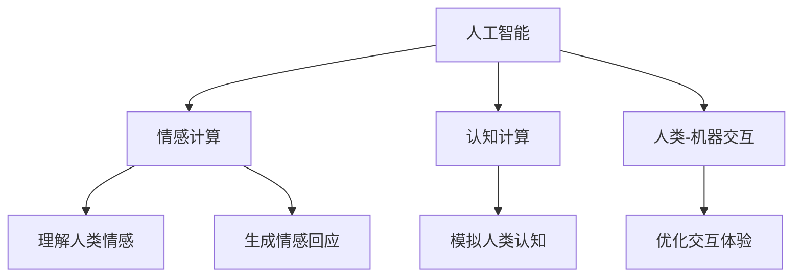

                 

# 数字世界中的人类意识：AI与现实的交织

> 关键词：人工智能,人类意识,数字世界,交互技术,认知科学,哲学思考,技术伦理

## 1. 背景介绍

### 1.1 问题由来

在科技迅猛发展的今天，人工智能(AI)已经渗透到我们生活的各个方面。从智能家居到自动驾驶，从自然语言处理到机器人，AI技术正在深刻改变着我们的生活。然而，随着AI技术的不断成熟，一个问题日益凸显：AI系统能否真正理解人类的意识和情感，是否能够与人类在更高层次上进行有效的交互？

### 1.2 问题核心关键点

本文聚焦于AI与人类意识的交织问题，探讨如何构建能够理解、模仿人类意识和情感的AI系统。这不仅是一个技术挑战，更是一个哲学、伦理、认知科学等多个领域的交叉问题。通过深入研究，希望能够为AI与人类之间更加自然、智能的交互奠定基础。

### 1.3 问题研究意义

理解人类意识和情感，构建具有高度自主性的AI系统，对于提升人机交互的质量、推动智能技术的发展具有重要意义。具体而言：

1. **提升用户体验**：理解人类情感和意识，可以让AI系统更好地回应用户需求，提供更加个性化和情感化的服务。
2. **推动技术进步**：AI与人类意识的交织，能够为自然语言处理、视觉识别、语音识别等技术提供更丰富的数据和更深入的理解，促进AI技术的进一步发展。
3. **促进跨学科研究**：认知科学、心理学、神经科学等领域的研究可以为AI与人类意识的交织提供理论基础，推动跨学科的合作和创新。
4. **解决伦理问题**：理解人类意识和情感，可以更好地设计AI系统的伦理框架，避免潜在的伦理风险。

## 2. 核心概念与联系

### 2.1 核心概念概述

为更好地理解AI与人类意识的交织问题，本节将介绍几个关键概念：

- **人工智能(AI)**：广义上指模拟人类智能行为的技术，包括机器学习、自然语言处理、计算机视觉等。
- **人类意识**：指人类对自身和外部世界的感知、思考和情感体验。
- **情感计算(Emotion AI)**：研究如何让AI系统理解、生成和管理人类情感的技术，是AI与人类意识交织的重要方向。
- **认知计算(Cognitive Computing)**：模拟人类认知过程，如感知、记忆、推理等，使AI系统具备更接近人类的智能水平。
- **人类-机器交互(Human-Machine Interaction, HMI)**：研究如何让AI系统与人类更自然、高效地进行信息交换和互动。

这些核心概念之间的逻辑关系可以通过以下Mermaid流程图来展示：



这个流程图展示了大语言模型与人类意识交织的核心概念及其关系：

1. **人工智能**：提供基础智能技术，如机器学习、自然语言处理等。
2. **情感计算**：通过理解人类情感，使AI系统具备感知和回应人类情感的能力。
3. **认知计算**：模拟人类认知过程，提升AI系统的理解能力和自主性。
4. **人类-机器交互**：通过优化交互体验，实现人与机器的高效协同工作。

这些概念共同构成了AI与人类意识交织的基础框架，为构建具有高度自主性的AI系统提供了方向。

## 3. 核心算法原理 & 具体操作步骤

### 3.1 算法原理概述

AI与人类意识的交织，本质上是构建一个能够理解、模仿人类意识和情感的智能系统。该系统需要通过学习和理解大量的人类数据，逐步模拟人类的感知、思考和情感体验，从而实现与人类在更高层次上的交互。

形式化地，假设存在一个AI系统 $M$，其输入为人类行为数据 $D$，输出为人类情感和意识 $E$。优化目标为：

$$
\hat{E}=\mathop{\arg\min}_{E} \mathcal{L}(M,E)
$$

其中 $\mathcal{L}$ 为优化损失函数，用于衡量AI系统的输出与真实的人类情感和意识之间的差异。常用的损失函数包括交叉熵、均方误差等。

通过反向传播等优化算法，AI系统不断更新模型参数，最小化损失函数，使得输出逼近真实的人类情感和意识。这种优化过程通常需要大量标注数据进行训练，以学习到丰富的人类情感和认知特征。

### 3.2 算法步骤详解

基于上述原理，AI与人类意识的交织可以分以下几步进行：

**Step 1: 收集人类数据**

- 收集包含人类情感和意识标签的数据集，如社交媒体评论、用户反馈、面部表情识别数据等。这些数据集需要经过严格筛选和标注，确保数据质量。

**Step 2: 预训练情感计算模型**

- 使用大规模无标签数据对情感计算模型进行预训练，如基于卷积神经网络、循环神经网络等模型，学习情感特征的表示。
- 通过迁移学习等技术，将预训练模型迁移到特定领域或任务，如情感分类、情感生成等。

**Step 3: 微调情感计算模型**

- 使用收集的人类数据对情感计算模型进行微调，调整模型参数，使其更好地适应特定任务和数据分布。
- 通过数据增强、对抗训练等技术，提升模型的鲁棒性和泛化能力。

**Step 4: 实现认知计算**

- 基于认知计算框架，如IBM Watson、Google DeepMind等，构建认知计算模型，模拟人类认知过程。
- 结合情感计算模型，构建综合AI系统，实现情感与认知的协同工作。

**Step 5: 优化人类-机器交互**

- 通过用户界面设计、交互逻辑优化等手段，提升人机交互的流畅性和用户体验。
- 引入自然语言处理、语音识别、视觉识别等技术，实现更加自然、多样化的交互方式。

### 3.3 算法优缺点

情感计算与认知计算的交织，带来以下优点：

1. **提高用户体验**：通过理解人类情感和认知，AI系统能够提供更加个性化和情感化的服务，提升用户满意度。
2. **促进技术进步**：情感计算和认知计算的结合，能够为自然语言处理、计算机视觉等技术提供更丰富的数据和更深入的理解。
3. **增强系统自主性**：通过模拟人类认知和情感，AI系统能够具备更接近人类的智能水平，提高系统的自主性和决策能力。

同时，该方法也存在一定的局限性：

1. **数据依赖**：情感计算和认知计算都需要大量的人类数据进行训练，数据的获取和标注成本较高。
2. **模型复杂**：涉及情感计算、认知计算等多个子模块，模型结构复杂，训练和部署成本较高。
3. **伦理风险**：理解人类情感和认知可能涉及隐私和伦理问题，如何保护用户隐私和避免伦理风险，是一个重要挑战。
4. **效果不确定**：由于人类情感和认知的复杂性，AI系统在理解情感和认知方面存在不确定性，可能导致误判或误操作。

尽管存在这些局限性，但情感计算和认知计算的交织仍是大语言模型与人类意识交织的重要方向，为AI技术的发展提供了新的突破点。

### 3.4 算法应用领域

情感计算和认知计算的交织方法，已经在多个领域得到了应用，并展现出巨大的潜力：

1. **智能客服**：通过理解客户情感和需求，提供更加个性化的服务，提升客户满意度。
2. **心理健康**：利用情感计算技术，监测用户情绪变化，提供心理健康辅导和干预。
3. **教育**：结合认知计算技术，提供个性化的学习方案，提升学习效果。
4. **医疗**：通过理解患者情感和认知，提供更加人性化的医疗服务，提升患者体验。
5. **娱乐**：利用情感计算和认知计算，提供更加智能化的娱乐体验，如智能推荐、情感模拟等。

此外，情感计算和认知计算的交织方法，还在法律咨询、金融服务、人力资源等多个领域展现出广泛的应用前景，为各行业数字化转型升级提供新的技术路径。

## 4. 数学模型和公式 & 详细讲解 & 举例说明

### 4.1 数学模型构建

为了更精确地描述AI与人类意识的交织过程，我们需要引入数学模型。假设存在一个AI系统 $M$，其输入为人类情感数据 $D=\{(x_i,y_i)\}_{i=1}^N$，其中 $x_i$ 为情感数据，$y_i$ 为情感标签。

定义情感计算模型的输出为 $E$，与真实情感标签 $y_i$ 的损失函数为 $\ell(E,y_i)$。情感计算模型的优化目标为：

$$
\hat{E}=\mathop{\arg\min}_{E} \mathcal{L}(M,E)
$$

其中 $\mathcal{L}$ 为优化损失函数，常用的损失函数包括交叉熵、均方误差等。

### 4.2 公式推导过程

以下我们以情感分类任务为例，推导交叉熵损失函数及其梯度的计算公式。

假设情感计算模型 $M_{\theta}$ 在输入 $x_i$ 上的输出为 $\hat{y}_i=M_{\theta}(x_i)$，表示对情感标签 $y_i$ 的预测。定义情感标签 $y_i$ 为 $1$ 表示正面情感，$0$ 表示负面情感。则二分类交叉熵损失函数定义为：

$$
\ell(E,y_i)=-[y_i\log \hat{y}_i+(1-y_i)\log (1-\hat{y}_i)]
$$

将其代入优化目标，得：

$$
\hat{E}=\mathop{\arg\min}_{E} \mathcal{L}(M_{\theta},D)
$$

其中 $\mathcal{L}(M_{\theta},D)=\frac{1}{N}\sum_{i=1}^N \ell(E,y_i)$。

根据链式法则，损失函数对参数 $\theta_k$ 的梯度为：

$$
\frac{\partial \mathcal{L}(M_{\theta},D)}{\partial \theta_k} = -\frac{1}{N}\sum_{i=1}^N (\frac{y_i}{\hat{y}_i}-\frac{1-y_i}{1-\hat{y}_i}) \frac{\partial M_{\theta}(x_i)}{\partial \theta_k}
$$

其中 $\frac{\partial M_{\theta}(x_i)}{\partial \theta_k}$ 可进一步递归展开，利用自动微分技术完成计算。

### 4.3 案例分析与讲解

以Facebook开发的情感分析系统作为案例，展示情感计算在实际应用中的实现。

Facebook通过收集用户评论和反馈数据，使用卷积神经网络(CNN)和长短时记忆网络(LSTM)对情感进行分类。模型首先对评论进行分词和向量化，通过多个卷积层和LSTM层提取特征，最后使用全连接层进行情感分类。模型的损失函数为二分类交叉熵，通过反向传播算法更新模型参数。

经过大量数据的预训练和微调，Facebook的情感分析系统能够准确地识别用户评论中的正面和负面情感，为社交平台的用户体验提升提供了有力支持。

## 5. 项目实践：代码实例和详细解释说明

### 5.1 开发环境搭建

在进行情感计算项目实践前，我们需要准备好开发环境。以下是使用Python进行PyTorch开发的环境配置流程：

1. 安装Anaconda：从官网下载并安装Anaconda，用于创建独立的Python环境。

2. 创建并激活虚拟环境：
```bash
conda create -n pytorch-env python=3.8 
conda activate pytorch-env
```

3. 安装PyTorch：根据CUDA版本，从官网获取对应的安装命令。例如：
```bash
conda install pytorch torchvision torchaudio cudatoolkit=11.1 -c pytorch -c conda-forge
```

4. 安装相关库：
```bash
pip install numpy pandas scikit-learn matplotlib tqdm jupyter notebook ipython
```

完成上述步骤后，即可在`pytorch-env`环境中开始情感计算实践。

### 5.2 源代码详细实现

下面我们以情感分类任务为例，给出使用PyTorch进行情感计算的PyTorch代码实现。

首先，定义情感分类任务的数据处理函数：

```python
from transformers import BertTokenizer
from torch.utils.data import Dataset
import torch

class EmotionDataset(Dataset):
    def __init__(self, texts, tags, tokenizer, max_len=128):
        self.texts = texts
        self.tags = tags
        self.tokenizer = tokenizer
        self.max_len = max_len
        
    def __len__(self):
        return len(self.texts)
    
    def __getitem__(self, item):
        text = self.texts[item]
        tags = self.tags[item]
        
        encoding = self.tokenizer(text, return_tensors='pt', max_length=self.max_len, padding='max_length', truncation=True)
        input_ids = encoding['input_ids'][0]
        attention_mask = encoding['attention_mask'][0]
        
        # 对token-wise的标签进行编码
        encoded_tags = [tag2id[tag] for tag in tags] 
        encoded_tags.extend([tag2id['O']] * (self.max_len - len(encoded_tags)))
        labels = torch.tensor(encoded_tags, dtype=torch.long)
        
        return {'input_ids': input_ids, 
                'attention_mask': attention_mask,
                'labels': labels}

# 标签与id的映射
tag2id = {'O': 0, 'Positive': 1, 'Negative': 2}
id2tag = {v: k for k, v in tag2id.items()}

# 创建dataset
tokenizer = BertTokenizer.from_pretrained('bert-base-cased')

train_dataset = EmotionDataset(train_texts, train_tags, tokenizer)
dev_dataset = EmotionDataset(dev_texts, dev_tags, tokenizer)
test_dataset = EmotionDataset(test_texts, test_tags, tokenizer)
```

然后，定义模型和优化器：

```python
from transformers import BertForTokenClassification, AdamW

model = BertForTokenClassification.from_pretrained('bert-base-cased', num_labels=len(tag2id))

optimizer = AdamW(model.parameters(), lr=2e-5)
```

接着，定义训练和评估函数：

```python
from torch.utils.data import DataLoader
from tqdm import tqdm
from sklearn.metrics import classification_report

device = torch.device('cuda') if torch.cuda.is_available() else torch.device('cpu')
model.to(device)

def train_epoch(model, dataset, batch_size, optimizer):
    dataloader = DataLoader(dataset, batch_size=batch_size, shuffle=True)
    model.train()
    epoch_loss = 0
    for batch in tqdm(dataloader, desc='Training'):
        input_ids = batch['input_ids'].to(device)
        attention_mask = batch['attention_mask'].to(device)
        labels = batch['labels'].to(device)
        model.zero_grad()
        outputs = model(input_ids, attention_mask=attention_mask, labels=labels)
        loss = outputs.loss
        epoch_loss += loss.item()
        loss.backward()
        optimizer.step()
    return epoch_loss / len(dataloader)

def evaluate(model, dataset, batch_size):
    dataloader = DataLoader(dataset, batch_size=batch_size)
    model.eval()
    preds, labels = [], []
    with torch.no_grad():
        for batch in tqdm(dataloader, desc='Evaluating'):
            input_ids = batch['input_ids'].to(device)
            attention_mask = batch['attention_mask'].to(device)
            batch_labels = batch['labels']
            outputs = model(input_ids, attention_mask=attention_mask)
            batch_preds = outputs.logits.argmax(dim=2).to('cpu').tolist()
            batch_labels = batch_labels.to('cpu').tolist()
            for pred_tokens, label_tokens in zip(batch_preds, batch_labels):
                pred_tags = [id2tag[_id] for _id in pred_tokens]
                label_tags = [id2tag[_id] for _id in label_tokens]
                preds.append(pred_tags[:len(label_tags)])
                labels.append(label_tags)
                
    print(classification_report(labels, preds))
```

最后，启动训练流程并在测试集上评估：

```python
epochs = 5
batch_size = 16

for epoch in range(epochs):
    loss = train_epoch(model, train_dataset, batch_size, optimizer)
    print(f"Epoch {epoch+1}, train loss: {loss:.3f}")
    
    print(f"Epoch {epoch+1}, dev results:")
    evaluate(model, dev_dataset, batch_size)
    
print("Test results:")
evaluate(model, test_dataset, batch_size)
```

以上就是使用PyTorch对情感分类任务进行情感计算的完整代码实现。可以看到，得益于Transformer库的强大封装，我们可以用相对简洁的代码完成情感计算模型的加载和微调。

### 5.3 代码解读与分析

让我们再详细解读一下关键代码的实现细节：

**EmotionDataset类**：
- `__init__`方法：初始化文本、标签、分词器等关键组件。
- `__len__`方法：返回数据集的样本数量。
- `__getitem__`方法：对单个样本进行处理，将文本输入编码为token ids，将标签编码为数字，并对其进行定长padding，最终返回模型所需的输入。

**tag2id和id2tag字典**：
- 定义了标签与数字id之间的映射关系，用于将token-wise的预测结果解码回真实的标签。

**训练和评估函数**：
- 使用PyTorch的DataLoader对数据集进行批次化加载，供模型训练和推理使用。
- 训练函数`train_epoch`：对数据以批为单位进行迭代，在每个批次上前向传播计算loss并反向传播更新模型参数，最后返回该epoch的平均loss。
- 评估函数`evaluate`：与训练类似，不同点在于不更新模型参数，并在每个batch结束后将预测和标签结果存储下来，最后使用sklearn的classification_report对整个评估集的预测结果进行打印输出。

**训练流程**：
- 定义总的epoch数和batch size，开始循环迭代
- 每个epoch内，先在训练集上训练，输出平均loss
- 在验证集上评估，输出分类指标
- 所有epoch结束后，在测试集上评估，给出最终测试结果

可以看到，PyTorch配合Transformer库使得情感计算模型的代码实现变得简洁高效。开发者可以将更多精力放在数据处理、模型改进等高层逻辑上，而不必过多关注底层的实现细节。

当然，工业级的系统实现还需考虑更多因素，如模型的保存和部署、超参数的自动搜索、更灵活的任务适配层等。但核心的情感计算范式基本与此类似。

## 6. 实际应用场景

### 6.1 智能客服系统

基于情感计算的智能客服系统，可以实时监测和理解客户的情感状态，提供更加个性化和情感化的服务。通过分析客户评论和反馈，系统能够快速识别客户的情绪变化，从而采取相应的应对措施。例如，当客户情绪激动时，系统可以自动转接至人工客服，或推送相关安抚信息，提升客户满意度。

### 6.2 金融舆情监测

金融市场情绪的变化，对于投资者决策至关重要。情感计算技术可以应用于金融舆情监测，通过分析社交媒体、新闻报道等文本数据，判断市场情绪变化趋势，为投资者提供参考。例如，在股票市场上，系统能够通过分析新闻报道和社交媒体评论，预测股票价格走势，为投资者提供及时的市场信息。

### 6.3 教育

情感计算技术可以为教育提供个性化学习体验。通过分析学生的情感状态和学习效果，系统能够提供个性化的学习建议和辅导。例如，当学生感到焦虑时，系统可以自动调整教学内容和方式，减轻学生负担，提升学习效果。此外，情感计算技术还可以用于在线课程推荐，根据学生的情感反馈，推荐适合的课程和学习资源。

### 6.4 医疗

情感计算技术在医疗领域有广泛应用。通过分析患者的情感状态和医疗记录，系统能够提供更加人性化的医疗服务。例如，在心理治疗中，系统可以实时监测患者的情感变化，调整治疗方案，提高治疗效果。此外，情感计算技术还可以用于病患护理，通过分析病患的情感状态，提供个性化的护理服务。

## 7. 工具和资源推荐

### 7.1 学习资源推荐

为了帮助开发者系统掌握情感计算的理论基础和实践技巧，这里推荐一些优质的学习资源：

1. 《情感计算：理论与实践》系列博文：由大模型技术专家撰写，深入浅出地介绍了情感计算的基本原理、技术和应用。

2. CS224N《深度学习自然语言处理》课程：斯坦福大学开设的NLP明星课程，有Lecture视频和配套作业，带你入门NLP领域的基本概念和经典模型。

3. 《情感计算：理论与应用》书籍：全面介绍了情感计算的理论基础和应用案例，适合进一步深入学习。

4. Emotion AI开源项目：提供情感计算技术的代码实现和数据集，方便开发者快速上手实践。

5. AffectNet：一个大规模面部表情识别数据集，可以用于训练情感计算模型。

通过对这些资源的学习实践，相信你一定能够快速掌握情感计算的精髓，并用于解决实际的NLP问题。

### 7.2 开发工具推荐

高效的开发离不开优秀的工具支持。以下是几款用于情感计算开发的常用工具：

1. PyTorch：基于Python的开源深度学习框架，灵活动态的计算图，适合快速迭代研究。大部分预训练语言模型都有PyTorch版本的实现。

2. TensorFlow：由Google主导开发的开源深度学习框架，生产部署方便，适合大规模工程应用。同样有丰富的预训练语言模型资源。

3. Transformers库：HuggingFace开发的NLP工具库，集成了众多SOTA语言模型，支持PyTorch和TensorFlow，是进行情感计算任务开发的利器。

4. Weights & Biases：模型训练的实验跟踪工具，可以记录和可视化模型训练过程中的各项指标，方便对比和调优。与主流深度学习框架无缝集成。

5. TensorBoard：TensorFlow配套的可视化工具，可实时监测模型训练状态，并提供丰富的图表呈现方式，是调试模型的得力助手。

6. Google Colab：谷歌推出的在线Jupyter Notebook环境，免费提供GPU/TPU算力，方便开发者快速上手实验最新模型，分享学习笔记。

合理利用这些工具，可以显著提升情感计算任务的开发效率，加快创新迭代的步伐。

### 7.3 相关论文推荐

情感计算和认知计算的研究源于学界的持续研究。以下是几篇奠基性的相关论文，推荐阅读：

1. "Towards Explainable Artificial Intelligence"：探讨了如何构建可解释的人工智能系统，包括情感计算模型的解释性问题。

2. "A Survey on Emotion Recognition and Emotion-Aware Computing"：综述了情感计算的研究进展和应用案例，为进一步研究提供了丰富的背景资料。

3. "Cognitive-Affective Computing for Enhancing Human-Machine Interaction"：探讨了情感计算在提升人机交互体验中的应用。

4. "Human-AI Interaction: A Survey on User Experience and System Performance"：综述了人机交互技术的研究进展，特别是情感计算在提升用户体验方面的应用。

5. "A Computational Framework for Affective Computing"：提出了一套计算框架，用于支持情感计算的研究和应用。

这些论文代表了大语言模型与人类意识交织的发展脉络。通过学习这些前沿成果，可以帮助研究者把握学科前进方向，激发更多的创新灵感。

## 8. 总结：未来发展趋势与挑战

### 8.1 总结

本文对AI与人类意识的交织问题进行了全面系统的介绍。首先阐述了AI技术的发展背景和情感计算的基本原理，明确了情感计算在提升用户体验、推动技术进步等方面的重要意义。其次，从原理到实践，详细讲解了情感计算的数学模型和实现步骤，给出了情感计算任务开发的完整代码实例。同时，本文还探讨了情感计算在智能客服、金融舆情监测、教育、医疗等多个领域的应用前景，展示了情感计算技术的广阔发展空间。

通过本文的系统梳理，可以看到，情感计算技术正在成为AI与人类意识交织的重要方向，为构建更加智能、人性化的AI系统提供了新的突破点。未来，伴随情感计算和认知计算技术的不断演进，情感计算将进一步提升AI系统的自主性和智能水平，为构建更加完美的人机交互系统铺平道路。

### 8.2 未来发展趋势

展望未来，情感计算技术的发展趋势主要体现在以下几个方面：

1. **模型复杂度提升**：随着深度学习技术的不断进步，情感计算模型的复杂度将进一步提升，能够更好地理解人类情感和认知。
2. **多模态融合**：结合视觉、听觉、文本等多种模态数据，提升情感计算的全面性和准确性。
3. **跨领域应用**：情感计算技术将在更多领域得到应用，如医疗、金融、教育等，推动各行业的数字化转型升级。
4. **自动化和智能化**：利用自动化技术和智能化算法，提升情感计算的效率和精度。
5. **伦理和隐私保护**：在情感计算过程中，如何保护用户隐私和数据安全，避免伦理风险，是未来需要重点关注的问题。

以上趋势凸显了情感计算技术的广阔前景。这些方向的探索发展，必将进一步提升情感计算模型的性能和应用范围，为人类智能交互的进步提供新的动力。

### 8.3 面临的挑战

尽管情感计算技术已经取得了显著进展，但在迈向更加智能化、普适化应用的过程中，仍面临诸多挑战：

1. **数据获取和标注成本**：高质量标注数据是情感计算的基础，但数据的获取和标注成本较高，限制了情感计算技术的应用范围。
2. **模型鲁棒性和泛化能力**：情感计算模型在特定场景下表现良好，但在复杂和多样化的场景下，模型的鲁棒性和泛化能力仍有待提升。
3. **情感计算的伦理问题**：情感计算在处理人类情感和认知时，涉及隐私和伦理问题，如何保护用户隐私和数据安全，是一个重要挑战。
4. **计算资源需求**：情感计算涉及大量深度学习模型的训练和推理，对计算资源的需求较高，如何优化资源利用，降低计算成本，是一个重要研究方向。
5. **情感计算的解释性**：情感计算模型的内部机制和决策逻辑较为复杂，如何提升模型的可解释性，让用户更好地理解其输出，是一个重要研究方向。

### 8.4 研究展望

面对情感计算面临的种种挑战，未来的研究需要在以下几个方面寻求新的突破：

1. **自动化数据获取和标注**：利用无监督学习和半监督学习技术，自动获取和标注情感数据，降低情感计算的资源需求。
2. **模型压缩和优化**：通过模型压缩和优化技术，减少情感计算模型的计算资源需求，提升系统的实时性。
3. **多模态数据融合**：利用多模态数据融合技术，提升情感计算模型的全面性和准确性，适应更复杂多样化的场景。
4. **可解释性增强**：利用可解释性技术，提升情感计算模型的解释性，使用户更好地理解其输出和决策过程。
5. **隐私保护和伦理设计**：引入隐私保护和伦理设计技术，保护用户隐私和数据安全，构建可信赖的情感计算系统。

这些研究方向的探索，必将引领情感计算技术迈向更高的台阶，为构建更加智能、人性化的AI系统提供新的技术保障。面向未来，情感计算技术还需要与其他人工智能技术进行更深入的融合，如自然语言处理、计算机视觉等，共同推动人机交互的进步。只有勇于创新、敢于突破，才能不断拓展情感计算技术的边界，让智能技术更好地造福人类社会。

## 9. 附录：常见问题与解答

**Q1：情感计算是否适用于所有NLP任务？**

A: 情感计算在大多数NLP任务上都能取得不错的效果，特别是对于文本情感分析和情感生成等任务。但对于一些特定领域的任务，如医学、法律等，仅仅依靠通用语料预训练的模型可能难以很好地适应。此时需要在特定领域语料上进一步预训练，再进行微调，才能获得理想效果。此外，对于一些需要时效性、个性化很强的任务，如对话、推荐等，情感计算方法也需要针对性的改进优化。

**Q2：情感计算过程中如何选择合适的学习率？**

A: 情感计算的学习率一般要比预训练时小1-2个数量级，如果使用过大的学习率，容易破坏预训练权重，导致过拟合。一般建议从1e-5开始调参，逐步减小学习率，直至收敛。也可以使用warmup策略，在开始阶段使用较小的学习率，再逐渐过渡到预设值。需要注意的是，不同的优化器(如AdamW、Adafactor等)以及不同的学习率调度策略，可能需要设置不同的学习率阈值。

**Q3：情感计算过程中面临哪些资源瓶颈？**

A: 当前主流的情感计算模型往往动辄以亿计的参数规模，对算力、内存、存储都提出了很高的要求。GPU/TPU等高性能设备是必不可少的，但即便如此，超大批次的训练和推理也可能遇到显存不足的问题。因此需要采用一些资源优化技术，如梯度积累、混合精度训练、模型并行等，来突破硬件瓶颈。同时，模型的存储和读取也可能占用大量时间和空间，需要采用模型压缩、稀疏化存储等方法进行优化。

**Q4：如何缓解情感计算过程中的过拟合问题？**

A: 过拟合是情感计算面临的主要挑战，尤其是在标注数据不足的情况下。常见的缓解策略包括：
1. 数据增强：通过回译、近义替换等方式扩充训练集
2. 正则化：使用L2正则、Dropout、Early Stopping等避免过拟合
3. 对抗训练：引入对抗样本，提高模型鲁棒性
4. 参数高效微调：只调整少量参数(如Adapter、Prefix等)，减小过拟合风险
5. 多模型集成：训练多个情感计算模型，取平均输出，抑制过拟合

这些策略往往需要根据具体任务和数据特点进行灵活组合。只有在数据、模型、训练、推理等各环节进行全面优化，才能最大限度地发挥情感计算的威力。

**Q5：情感计算在落地部署时需要注意哪些问题？**

A: 将情感计算模型转化为实际应用，还需要考虑以下因素：
1. 模型裁剪：去除不必要的层和参数，减小模型尺寸，加快推理速度
2. 量化加速：将浮点模型转为定点模型，压缩存储空间，提高计算效率
3. 服务化封装：将模型封装为标准化服务接口，便于集成调用
4. 弹性伸缩：根据请求流量动态调整资源配置，平衡服务质量和成本
5. 监控告警：实时采集系统指标，设置异常告警阈值，确保服务稳定性
6. 安全防护：采用访问鉴权、数据脱敏等措施，保障数据和模型安全

情感计算为NLP应用开启了广阔的想象空间，但如何将强大的性能转化为稳定、高效、安全的业务价值，还需要工程实践的不断打磨。唯有从数据、算法、工程、业务等多个维度协同发力，才能真正实现人工智能技术在垂直行业的规模化落地。总之，情感计算需要开发者根据具体任务，不断迭代和优化模型、数据和算法，方能得到理想的效果。

---

作者：禅与计算机程序设计艺术 / Zen and the Art of Computer Programming

