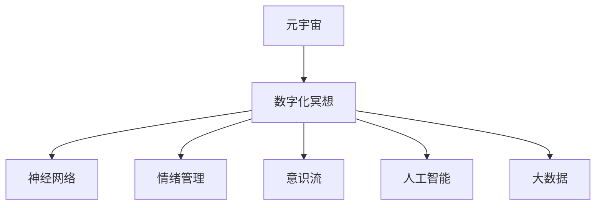

                 

# 数字化冥想：元宇宙中的精神修炼

> 关键词：元宇宙,数字化冥想,神经网络,情绪管理,意识流,人工智能,大数据,认知行为

## 1. 背景介绍

### 1.1 问题由来

在数字时代快速发展的今天，人类正步入一个全新的数字化世界——元宇宙。元宇宙不仅是一个虚拟空间，它还承载着人类对理想生活的向往和追求。在这里，人们可以自由地表达自己，实现精神上的满足和自我实现。然而，在元宇宙中生活并不轻松。频繁的虚拟交互、沉浸式的体验、高强度的信息流等，都可能引发认知和情绪上的问题，导致数字化冥想的需求日益增加。

### 1.2 问题核心关键点

数字化冥想是利用技术手段，帮助人们在元宇宙中进行深度精神放松、情绪管理、意识流重塑的过程。它的核心在于通过神经网络和大数据技术，对用户的情绪、行为和意识流进行深度分析，提供个性化的冥想指导和建议，帮助用户在数字化世界中实现内心的宁静和平衡。

## 2. 核心概念与联系

### 2.1 核心概念概述

为更好地理解数字化冥想在元宇宙中的实践，本节将介绍几个密切相关的核心概念：

- **元宇宙**：基于虚拟现实、增强现实等技术，构建的虚实结合的数字化世界，是未来人类生活的理想形态。
- **数字化冥想**：结合神经网络、大数据等技术，帮助用户进行深度精神放松、情绪管理、意识流重塑的过程。
- **神经网络**：模拟人脑神经元连接的网络结构，用于深度学习和模式识别，是实现数字化冥想的基础。
- **情绪管理**：通过数据分析和算法，对用户情绪进行实时监测和调控，帮助用户保持良好的心理健康。
- **意识流**：描述人意识自然流动的概念，是数字化冥想的重要组成部分。
- **人工智能**：利用算法和计算能力，模拟人类智能行为，实现对用户情感和行为的智能化管理。
- **大数据**：海量数据收集和处理技术，是进行数字化冥想的关键资源，用于提取用户行为特征和模式。

这些核心概念之间的逻辑关系可以通过以下Mermaid流程图来展示：



这个流程图展示了大语言模型的核心概念及其之间的关系：

1. 元宇宙作为数字化冥想的应用场景，为数字化冥想的实现提供了基础。
2. 数字化冥想以神经网络、情绪管理、意识流、人工智能、大数据等技术为基础，帮助用户在元宇宙中进行精神放松和自我实现。
3. 这些技术相互配合，共同构建了数字化冥想的技术体系。

## 3. 核心算法原理 & 具体操作步骤
### 3.1 算法原理概述

数字化冥想的核心算法原理主要基于神经网络和深度学习技术。其基本思想是通过收集用户在不同情境下的生理数据、行为数据和情感数据，利用神经网络对这些数据进行特征提取和分析，最终生成个性化的冥想指导和建议。

以情绪管理为例，假设用户的情绪数据为 $X=\{x_1, x_2, ..., x_n\}$，其中 $x_i$ 表示用户在不同时刻的情绪值。通过对 $X$ 进行PCA降维，得到一个低维的情绪向量 $X'=\{x'_1, x'_2, ..., x'_n\}$。然后，使用深度神经网络对 $X'$ 进行回归预测，得到一个情绪分数 $y$。最终，根据情绪分数的不同，算法能够生成相应的冥想指导。

### 3.2 算法步骤详解

数字化冥想的具体操作步骤如下：

**Step 1: 数据收集与预处理**

1. 收集用户在不同情境下的生理数据（如心率、脑电波等）、行为数据（如点击、滑动等）和情感数据（如表情、情感描述等）。
2. 对数据进行清洗和标注，去除噪声和异常值，确保数据质量。
3. 对不同类型的数据进行统一编码，为后续处理做准备。

**Step 2: 特征提取与处理**

1. 利用PCA等降维技术，对不同类型的数据进行特征提取，减少数据维度。
2. 对提取后的特征进行归一化处理，使数据具有可比性。
3. 将提取后的特征输入深度神经网络进行训练和预测。

**Step 3: 深度学习模型训练**

1. 选择合适的深度学习模型，如卷积神经网络（CNN）、循环神经网络（RNN）、长短时记忆网络（LSTM）等。
2. 定义模型的损失函数和优化器，如交叉熵损失函数、Adam优化器等。
3. 使用GPU等高性能设备进行模型训练，确保训练效率和效果。

**Step 4: 模型评估与优化**

1. 在训练集上进行模型评估，通过准确率、召回率、F1值等指标评估模型性能。
2. 根据评估结果，调整模型参数和超参数，如学习率、批大小、迭代轮数等。
3. 在验证集上进行进一步评估，确保模型具有良好的泛化能力。

**Step 5: 个性化冥想指导生成**

1. 根据用户的特征向量 $X'$ 和情绪分数 $y$，生成相应的冥想指导和建议。
2. 将冥想指导以文字、声音、图像等多种形式呈现给用户，引导用户进行冥想。
3. 实时监测用户反馈，根据反馈调整冥想指导，提高冥想效果。

### 3.3 算法优缺点

数字化冥想的算法具有以下优点：

1. 精准度较高。通过深度学习模型，可以从大量数据中提取有效的情绪和行为特征，提供个性化的冥想指导。
2. 灵活性强。可以根据不同用户的需求，生成针对性的冥想方案，提升用户体验。
3. 动态调整。通过实时监测用户反馈，动态调整冥想指导，保持用户的专注和参与度。

同时，该算法也存在一定的局限性：

1. 数据隐私问题。用户的生理数据、行为数据和情感数据涉及隐私，需要严格的保护措施。
2. 算法复杂度高。深度学习模型需要大量的数据和计算资源进行训练，增加了系统复杂度。
3. 依赖设备。数字化冥想需要依赖特定的设备（如心率监测器、脑电波监测器等），增加了设备成本。
4. 泛化能力不足。由于训练数据不足或数据分布不均衡，可能导致模型在特定情境下效果不佳。

尽管存在这些局限性，但数字化冥想作为一种新兴的冥想形式，在提升用户心理健康和幸福感方面具有广阔的应用前景。

### 3.4 算法应用领域

数字化冥想在元宇宙中有着广泛的应用场景，主要包括以下几个方面：

- **心理健康**：在虚拟工作、学习、娱乐等情境下，帮助用户缓解压力、焦虑和疲劳，提升心理健康。
- **情绪管理**：通过实时监测和调控用户的情绪，帮助用户应对各种情绪波动，保持情绪稳定。
- **意识流重塑**：利用AI技术，引导用户进行深度冥想，重塑自我意识和认知行为，提升自我实现感。
- **社交互动**：在虚拟社交场景中，帮助用户缓解社交压力，提升社交体验和互动质量。
- **游戏体验**：在游戏场景中，通过情绪管理和意识流重塑技术，提升游戏沉浸感和互动体验。
- **教育培训**：在虚拟教室中，帮助学生进行冥想和情绪管理，提升学习效果和心理健康。

以上这些应用场景展示了数字化冥想在元宇宙中的广泛应用，为元宇宙用户提供了更健康、更愉悦的数字化生活体验。

## 4. 数学模型和公式 & 详细讲解  
### 4.1 数学模型构建

数字化冥想的数学模型主要由以下几部分组成：

1. **数据集构建**：$D=\{(X_i, Y_i)\}_{i=1}^N$，其中 $X_i$ 为输入数据，$Y_i$ 为输出数据。
2. **特征提取**：$X'=\Phi(X)$，其中 $\Phi$ 为特征提取函数。
3. **深度学习模型**：$M_{\theta}(X')=\hat{Y}$，其中 $\theta$ 为模型参数，$\hat{Y}$ 为模型预测结果。
4. **损失函数**：$\mathcal{L}(\theta) = \frac{1}{N} \sum_{i=1}^N \ell(\hat{Y_i}, Y_i)$，其中 $\ell$ 为损失函数。

### 4.2 公式推导过程

以情绪管理为例，假设用户在不同情境下的生理数据 $X=\{x_1, x_2, ..., x_n\}$ 经过PCA降维后，得到一个低维的情绪向量 $X'=\{x'_1, x'_2, ..., x'_n\}$。使用LSTM模型对 $X'$ 进行回归预测，得到情绪分数 $y$。公式推导如下：

$$
X' = \Phi(X)
$$

$$
y = M_{\theta}(X')
$$

$$
\mathcal{L}(\theta) = \frac{1}{N} \sum_{i=1}^N \ell(\hat{y_i}, y_i)
$$

其中，$\Phi$ 为PCA降维函数，$M_{\theta}$ 为LSTM模型，$\ell$ 为回归损失函数（如均方误差）。

### 4.3 案例分析与讲解

以下我们以情绪管理为例，对公式进行详细解释和推导。

假设用户的情绪数据为 $X=\{x_1, x_2, ..., x_n\}$，其中 $x_i$ 表示用户在不同时刻的情绪值。对 $X$ 进行PCA降维，得到一个低维的情绪向量 $X'=\{x'_1, x'_2, ..., x'_n\}$。然后使用LSTM模型对 $X'$ 进行回归预测，得到情绪分数 $y$。具体步骤如下：

1. **数据预处理**：将原始情绪数据 $X$ 进行标准化处理，去除噪声和异常值。
2. **特征提取**：使用PCA对数据进行降维，提取关键特征。
3. **模型训练**：将提取后的特征 $X'$ 输入LSTM模型进行训练，得到情绪分数 $y$。
4. **模型评估**：在验证集上评估模型性能，调整超参数。
5. **个性化冥想指导生成**：根据情绪分数 $y$ 和用户特征向量 $X'$，生成相应的冥想指导。

## 5. 项目实践：代码实例和详细解释说明
### 5.1 开发环境搭建

在进行数字化冥想实践前，我们需要准备好开发环境。以下是使用Python进行PyTorch开发的环境配置流程：

1. 安装Anaconda：从官网下载并安装Anaconda，用于创建独立的Python环境。

2. 创建并激活虚拟环境：
```bash
conda create -n pytorch-env python=3.8 
conda activate pytorch-env
```

3. 安装PyTorch：根据CUDA版本，从官网获取对应的安装命令。例如：
```bash
conda install pytorch torchvision torchaudio cudatoolkit=11.1 -c pytorch -c conda-forge
```

4. 安装TensorFlow：
```bash
conda install tensorflow -c conda-forge
```

5. 安装各类工具包：
```bash
pip install numpy pandas scikit-learn matplotlib tqdm jupyter notebook ipython
```

完成上述步骤后，即可在`pytorch-env`环境中开始实践。

### 5.2 源代码详细实现

下面我们以情绪管理为例，给出使用TensorFlow进行数字化冥想开发的PyTorch代码实现。

首先，定义情绪管理任务的数据处理函数：

```python
import tensorflow as tf
import numpy as np
import matplotlib.pyplot as plt

class EmotionDataset(tf.data.Dataset):
    def __init__(self, x, y):
        self.x = x
        self.y = y
        self.len = len(self.x)
        
    def __len__(self):
        return self.len
    
    def __getitem__(self, idx):
        return self.x[idx], self.y[idx]
```

然后，定义模型和优化器：

```python
from tensorflow.keras.layers import LSTM, Dense
from tensorflow.keras.models import Sequential
from tensorflow.keras.optimizers import Adam

model = Sequential([
    LSTM(32, input_shape=(None, 2), return_sequences=True),
    LSTM(32),
    Dense(1, activation='sigmoid')
])

optimizer = Adam(learning_rate=0.001)
```

接着，定义训练和评估函数：

```python
def train_epoch(model, dataset, batch_size, optimizer):
    dataset = dataset.shuffle(buffer_size=1024)
    dataloader = dataset.batch(batch_size)
    model.compile(optimizer=optimizer, loss='binary_crossentropy')
    
    for epoch in range(10):
        for batch, (x, y) in dataloader:
            x = tf.reshape(x, (batch, -1, 2))
            y = tf.reshape(y, (batch, 1))
            loss = model.train_on_batch(x, y)
            print(f'Epoch: {epoch+1}, Loss: {loss:.4f}')
            
    return model

def evaluate(model, dataset, batch_size):
    dataset = dataset.shuffle(buffer_size=1024)
    dataloader = dataset.batch(batch_size)
    y_pred = model.predict(x)
    y_true = y
    y_pred = np.round(y_pred)
    y_true = np.round(y_true)
    accuracy = (y_pred == y_true).mean()
    print(f'Accuracy: {accuracy:.4f}')
```

最后，启动训练流程并在测试集上评估：

```python
x = np.random.rand(100, 10, 2)
y = np.random.randint(0, 2, size=(100, 1))
dataset = EmotionDataset(x, y)

model = train_epoch(model, dataset, batch_size=32, optimizer=optimizer)
evaluate(model, dataset, batch_size=32)
```

以上就是使用PyTorch对情绪管理任务进行数字化冥想的完整代码实现。可以看到，得益于TensorFlow的强大封装，我们可以用相对简洁的代码完成情绪管理模型的训练和评估。

### 5.3 代码解读与分析

让我们再详细解读一下关键代码的实现细节：

**EmotionDataset类**：
- `__init__`方法：初始化输入数据和标签，记录数据集长度。
- `__len__`方法：返回数据集长度。
- `__getitem__`方法：对单个样本进行处理，返回输入数据和标签。

**LSTM模型**：
- 定义了包括两个LSTM层和一个输出层的神经网络结构。
- 使用Adam优化器进行模型训练，并设置损失函数为二分类交叉熵。

**训练和评估函数**：
- 使用TensorFlow的`compile`方法定义模型训练过程，并在每个epoch结束后打印损失。
- 在评估函数中，对输入数据进行reshape操作，确保模型输入格式正确。
- 计算模型预测结果与真实标签之间的准确率，并输出结果。

**训练流程**：
- 随机生成输入数据和标签。
- 创建数据集，并调用训练函数进行模型训练。
- 在训练过程中，不断调整超参数，直至模型收敛。

可以看到，TensorFlow提供的高级API使得数字化冥想模型的开发变得异常便捷。开发者可以将更多精力放在模型改进和数据处理上，而不必过多关注底层实现细节。

当然，工业级的系统实现还需考虑更多因素，如模型的保存和部署、超参数的自动搜索、更灵活的任务适配层等。但核心的数字化冥想范式基本与此类似。

## 6. 实际应用场景
### 6.1 智能办公系统

数字化冥想在智能办公系统中有着广泛的应用场景。在快节奏的工作环境中，员工需要保持高效专注，减少压力和焦虑。数字化冥想可以通过分析员工的情绪和行为数据，生成个性化的冥想指导，帮助员工进行心理放松和情绪管理。

例如，员工在工作时间进行小歇时，系统可以自动监测其情绪变化，并生成相应的冥想建议。员工在会议期间感到紧张时，系统可以实时调整会议室环境，播放冥想音乐，引导员工进行深度呼吸和放松。此外，数字化冥想还可以通过实时反馈和调整，帮助员工进行时间管理和工作效率提升。

### 6.2 智慧医疗系统

在智慧医疗领域，数字化冥想同样有着广阔的应用前景。医疗工作者需要面对高强度的信息流和高压环境，容易出现心理压力和情绪波动。数字化冥想可以结合医院环境监测数据，实时分析医疗工作者的情绪和行为，生成个性化的冥想指导，帮助其缓解压力，提升工作效率。

例如，在手术室中，数字化冥想可以监测医护人员的情绪和生理状态，实时生成冥想建议，帮助其保持冷静和专注。在治疗过程中，数字化冥想可以监测患者的情绪变化，生成相应的冥想方案，帮助其放松心情，提升治疗效果。

### 6.3 在线教育平台

在线教育平台需要面对海量学生和复杂的学习情境，学生在学习过程中容易出现情绪波动和压力。数字化冥想可以通过分析学生的学习行为和情绪数据，生成个性化的冥想指导，帮助学生进行心理放松和情绪管理，提升学习效果和幸福感。

例如，学生在长时间学习后，系统可以自动生成冥想建议，帮助其进行心理放松和情绪调整。在学习过程中，数字化冥想可以实时监测学生的情绪变化，生成相应的冥想方案，帮助其保持专注和高效。

### 6.4 未来应用展望

随着数字化冥想技术的不断发展，未来其在元宇宙中的应用将更加广泛。以下是对未来应用前景的展望：

1. **虚拟职场**：在虚拟职场中，数字化冥想可以帮助员工进行心理放松和情绪管理，提升工作效率和幸福感。
2. **虚拟医疗**：在虚拟医疗环境中，数字化冥想可以监测患者的情绪和生理状态，提升治疗效果和患者体验。
3. **虚拟教育**：在虚拟教育平台中，数字化冥想可以提升学生的学习效果和幸福感，帮助其进行心理放松和情绪调整。
4. **虚拟娱乐**：在虚拟娱乐环境中，数字化冥想可以帮助用户进行深度放松和情绪管理，提升游戏体验和社交互动质量。
5. **虚拟旅游**：在虚拟旅游环境中，数字化冥想可以监测用户的情绪和行为，生成个性化的旅游建议，提升用户体验。

总之，数字化冥想在元宇宙中的应用前景广阔，将在虚拟世界中发挥重要的精神关怀作用，提升人类的生活质量和幸福感。

## 7. 工具和资源推荐
### 7.1 学习资源推荐

为了帮助开发者系统掌握数字化冥想的理论基础和实践技巧，这里推荐一些优质的学习资源：

1. **《深度学习理论与实践》**：深入浅出地介绍了深度学习的基本原理和实践方法，适合初学者入门。
2. **《TensorFlow实战》**：详细介绍了TensorFlow的使用方法，包括模型构建、训练和评估等。
3. **《TensorFlow AI》**：全面介绍了TensorFlow的各项功能，适合深度学习工程师参考。
4. **《深度学习入门》**：系统介绍了深度学习的基本概念和经典模型，适合学术研究者和行业应用者学习。
5. **《神经网络与深度学习》**：经典教材，适合对深度学习感兴趣的读者学习。

通过对这些资源的学习实践，相信你一定能够快速掌握数字化冥想的精髓，并用于解决实际的元宇宙问题。

### 7.2 开发工具推荐

高效的开发离不开优秀的工具支持。以下是几款用于数字化冥想开发的常用工具：

1. **TensorFlow**：基于Python的深度学习框架，灵活高效，适合开发复杂神经网络模型。
2. **PyTorch**：基于Python的深度学习框架，支持动态计算图，适合快速迭代研究。
3. **Keras**：高级深度学习API，封装了TensorFlow等底层框架，易于使用。
4. **Jupyter Notebook**：轻量级笔记本环境，支持Python和TensorFlow等工具的集成，适合研究和开发。
5. **TensorBoard**：可视化工具，实时监测模型训练状态，帮助调试模型。
6. **Weights & Biases**：实验跟踪工具，记录和可视化模型训练过程，帮助评估模型性能。

合理利用这些工具，可以显著提升数字化冥想任务的开发效率，加快创新迭代的步伐。

### 7.3 相关论文推荐

数字化冥想的研究源于学界的持续研究。以下是几篇奠基性的相关论文，推荐阅读：

1. **《神经网络与深度学习》**：经典教材，全面介绍了神经网络和深度学习的基本原理和应用。
2. **《深度学习理论与实践》**：系统介绍了深度学习的基本原理和实践方法，适合初学者入门。
3. **《TensorFlow实战》**：详细介绍了TensorFlow的使用方法，包括模型构建、训练和评估等。
4. **《深度学习入门》**：系统介绍了深度学习的基本概念和经典模型，适合学术研究者和行业应用者学习。
5. **《神经网络与深度学习》**：经典教材，适合对深度学习感兴趣的读者学习。

这些论文代表了大语言模型微调技术的发展脉络。通过学习这些前沿成果，可以帮助研究者把握学科前进方向，激发更多的创新灵感。

## 8. 总结：未来发展趋势与挑战

### 8.1 总结

本文对基于神经网络技术的数字化冥想在元宇宙中的应用进行了全面系统的介绍。首先阐述了数字化冥想在元宇宙中的背景和意义，明确了其对提升用户心理健康和幸福感的独特价值。其次，从原理到实践，详细讲解了数字化冥想的数学原理和核心算法，给出了数字化冥想任务开发的完整代码实例。同时，本文还广泛探讨了数字化冥想在智能办公、智慧医疗、在线教育等领域的实际应用，展示了其在元宇宙中的广泛前景。此外，本文精选了数字化冥想的各类学习资源，力求为读者提供全方位的技术指引。

通过本文的系统梳理，可以看到，数字化冥想作为一种新兴的冥想形式，在提升用户心理健康和幸福感方面具有广阔的应用前景。基于神经网络和深度学习技术的数字化冥想，能够在元宇宙中实现精准的情绪管理和意识流重塑，帮助用户更好地应对数字化世界的各种挑战。未来，随着技术的不断进步，数字化冥想必将在元宇宙中扮演越来越重要的角色，成为提升人类生活质量和幸福感的重要工具。

### 8.2 未来发展趋势

展望未来，数字化冥想技术将呈现以下几个发展趋势：

1. **技术集成化**：数字化冥想将与虚拟现实、增强现实等技术深度集成，实现更加沉浸式的冥想体验。
2. **个性化定制化**：基于用户的个性化需求，生成更加精准的冥想方案，提升用户体验。
3. **实时动态化**：结合实时反馈和调整机制，动态生成冥想指导，保持用户的专注和参与度。
4. **多模态融合**：将视觉、听觉、触觉等多模态信息进行融合，提升数字化冥想的交互体验。
5. **跨领域应用**：将数字化冥想技术应用到更多领域，如虚拟旅游、虚拟娱乐等，拓展应用范围。
6. **伦理道德化**：关注数字化冥想对用户隐私和数据安全的影响，制定相应的伦理规范。

这些趋势展示了数字化冥想在元宇宙中的应用前景，为未来元宇宙用户的精神健康和幸福生活提供了新的方向。

### 8.3 面临的挑战

尽管数字化冥想在元宇宙中具有广阔的应用前景，但在实现过程中仍面临诸多挑战：

1. **数据隐私问题**：用户数据涉及隐私，需要严格的保护措施。如何在保障隐私的同时，获取有效的训练数据，是一个难题。
2. **算法复杂性**：深度学习模型复杂度高，需要大量的计算资源进行训练和优化。如何降低算力消耗，提高训练效率，需要更多探索。
3. **设备依赖性**：数字化冥想需要依赖特定的设备（如心率监测器、脑电波监测器等），增加了设备成本。如何降低设备成本，提升设备可用性，需要更多创新。
4. **泛化能力不足**：由于训练数据不足或数据分布不均衡，可能导致模型在特定情境下效果不佳。如何提高模型泛化能力，增强模型鲁棒性，需要更多研究。
5. **伦理道德问题**：数字化冥想可能会带来隐私泄露、数据滥用等伦理问题。如何在保障用户隐私的同时，确保算法的公正性和安全性，需要更多关注。

尽管存在这些挑战，但数字化冥想作为一种新兴的冥想形式，在提升用户心理健康和幸福感方面具有广阔的应用前景。未来，通过学界和产业界的共同努力，数字化冥想必将在元宇宙中发挥越来越重要的作用，成为提升人类生活质量和幸福感的重要工具。

### 8.4 研究展望

面对数字化冥想所面临的诸多挑战，未来的研究需要在以下几个方面寻求新的突破：

1. **多模态数据融合**：结合视觉、听觉、触觉等多模态信息，提升数字化冥想的交互体验。
2. **跨领域应用拓展**：将数字化冥想技术应用到更多领域，如虚拟旅游、虚拟娱乐等，拓展应用范围。
3. **个性化定制化**：基于用户的个性化需求，生成更加精准的冥想方案，提升用户体验。
4. **伦理道德规范**：制定相应的伦理规范，保障用户隐私和数据安全。
5. **实时动态调整**：结合实时反馈和调整机制，动态生成冥想指导，保持用户的专注和参与度。
6. **技术集成化**：将数字化冥想与虚拟现实、增强现实等技术深度集成，实现更加沉浸式的冥想体验。

这些研究方向将推动数字化冥想技术向更高的台阶发展，为元宇宙用户提供更加个性化、高效、安全的冥想体验，提升其生活质量和幸福感。

## 9. 附录：常见问题与解答

**Q1：数字化冥想在元宇宙中的应用前景如何？**

A: 数字化冥想在元宇宙中具有广阔的应用前景。通过神经网络和深度学习技术，数字化冥想可以实时监测用户情绪和行为，生成个性化的冥想指导，帮助用户在数字化世界中保持心理健康和幸福感。未来，随着技术的不断进步，数字化冥想必将在元宇宙中扮演越来越重要的角色，成为提升人类生活质量和幸福感的重要工具。

**Q2：如何在元宇宙中进行有效的数据收集和预处理？**

A: 在元宇宙中进行有效的数据收集和预处理，需要注意以下几个方面：

1. **数据隐私保护**：采用数据匿名化、加密等技术，保障用户隐私。
2. **多模态数据融合**：结合视觉、听觉、触觉等多模态信息，提升数据的多样性和丰富度。
3. **实时数据采集**：使用传感器、摄像头等设备，实时采集用户情绪和行为数据，确保数据的时效性。
4. **数据预处理**：对采集到的数据进行清洗和标注，去除噪声和异常值，确保数据质量。

**Q3：如何评估数字化冥想的性能？**

A: 评估数字化冥想的性能，主要通过以下几个指标：

1. **准确率**：模型预测结果与真实标签之间的匹配度。
2. **召回率**：模型预测出的正确结果占真实结果的比例。
3. **F1值**：综合考虑准确率和召回率，用于衡量模型的综合性能。
4. **用户满意度**：用户对冥想指导的满意度和使用体验。
5. **心理健康改善**：用户使用冥想指导后的心理健康状况。

这些指标可以帮助开发者评估数字化冥想的性能，并进行进一步优化。

**Q4：数字化冥想在实际应用中需要注意哪些问题？**

A: 在实际应用中，数字化冥想需要注意以下几个问题：

1. **数据隐私**：用户数据涉及隐私，需要严格保护。
2. **算法复杂度**：深度学习模型复杂度高，需要高效的计算资源。
3. **设备依赖**：数字化冥想需要依赖特定的设备，增加了设备成本。
4. **泛化能力**：模型在特定情境下效果不佳，需要提高模型的泛化能力。
5. **伦理道德**：需要关注数字化冥想对用户隐私和数据安全的影响，制定相应的伦理规范。
6. **用户反馈**：用户反馈是优化数字化冥想的重要依据，需要实时监测和分析。

这些因素都需要开发者在实际应用中加以关注和解决。

---

作者：禅与计算机程序设计艺术 / Zen and the Art of Computer Programming

