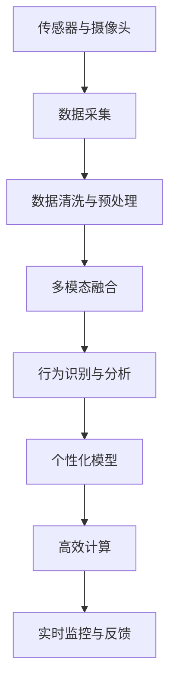

                 

## 1. 背景介绍

### 1.1 问题由来

随着人们生活水平的提高，宠物已经成为了许多家庭的重要成员。宠物不仅仅提供情感支持，还对人类的生理和心理健康有诸多积极影响。因此，越来越多的宠物主关注宠物的生活质量。传统的宠物行为分析依赖于人工观察，效率低，且容易受到人为因素的干扰。数字化宠物行为分析（Digital Pet Behavior Analysis，DPBA）利用传感器、摄像头等技术，结合机器学习和人工智能算法，自动监测和分析宠物的行为，成为宠物健康管理、智能喂食、行为训练等方面的重要工具。

### 1.2 问题核心关键点

数字化宠物行为分析的关键在于准确感知和理解宠物的行为。主要难点包括：
- 多模态数据的融合：宠物行为数据往往来自不同传感器和摄像头，如何高效整合多源数据，是数字化分析的核心挑战。
- 智能行为识别：如何将传感器和摄像头捕捉的原始信号转换为可理解的行为标签，是提高分析准确性的关键。
- 个性化模型训练：宠物的行为受多种因素影响，个性化训练模型以适应不同宠物的差异，是提升分析效果的关键。
- 高效计算和部署：传感器数据的实时性和算法的响应速度直接影响用户体验，因此需要高效计算和快速部署。

### 1.3 问题研究意义

数字化宠物行为分析有助于宠物主更好地理解宠物的需求，优化宠物的日常护理。在技术层面，DPBA是物联网、机器学习与AI结合的典型应用，对提升AI在实际场景中的应用水平具有重要意义。通过DPBA技术，宠物主可以实时监控宠物的行为，及时发现异常情况，提升宠物的生活质量和主人的幸福感。

## 2. 核心概念与联系

### 2.1 核心概念概述

为更好地理解数字化宠物行为分析，本节将介绍几个核心概念及其联系：

- **传感器与摄像头：** 传感器和摄像头是DPBA的基础设备，用于获取宠物的行为数据。常见的传感器包括加速度计、陀螺仪、红外传感器等，摄像头则用于捕捉宠物的行为视频。
- **行为识别与分析：** 从传感器和摄像头获取的数据中，提取行为特征，通过机器学习算法自动识别宠物的行为标签。
- **多模态融合：** 将来自不同传感器和摄像头的数据融合，形成多模态的行为数据集，提高行为识别的准确性。
- **个性化模型：** 针对不同宠物的特点，设计个性化的行为分析模型，提高模型对宠物行为的解释力和预测能力。
- **高效计算：** 利用GPU、TPU等高性能计算资源，对传感器数据进行实时处理和分析，支持实时反馈和监控。

这些概念共同构成数字化宠物行为分析的框架，使得AI技术能够深入到宠物的日常生活中，提升其生活质量。

### 2.2 核心概念原理和架构的 Mermaid 流程图



这个流程图展示了DPBA的基本流程：

1. **数据采集：** 通过传感器和摄像头收集宠物的行为数据。
2. **数据清洗与预处理：** 清洗传感器和摄像头数据，进行归一化、降噪等预处理操作。
3. **多模态融合：** 将来自不同来源的数据融合，构建多模态的行为数据集。
4. **行为识别与分析：** 通过机器学习算法自动识别和分析宠物的行为。
5. **个性化模型：** 根据不同宠物的特点，训练个性化的行为分析模型。
6. **高效计算：** 使用高性能计算资源进行实时处理和分析。
7. **实时监控与反馈：** 将分析结果实时反馈给宠物主，支持实时监控和及时干预。

## 3. 核心算法原理 & 具体操作步骤

### 3.1 算法原理概述

数字化宠物行为分析的核心算法包括多模态数据融合、行为识别与分类、个性化模型训练等。其核心思想是：

- **多模态融合**：利用融合算法将来自不同传感器和摄像头的数据合并，形成统一的特征表示。
- **行为识别与分类**：使用机器学习算法对融合后的数据进行分类，识别出宠物的各种行为。
- **个性化模型**：通过训练个性化模型，提高行为识别准确性，适应不同宠物的差异。

### 3.2 算法步骤详解

#### 3.2.1 数据采集与预处理

**Step 1: 数据采集**
- 配置传感器和摄像头，确保设备能够正常工作。
- 连接设备，确保能够实时获取数据。

**Step 2: 数据清洗与预处理**
- 清洗传感器和摄像头数据，去除噪声和异常值。
- 对数据进行归一化、平滑等预处理操作，以便后续分析。

#### 3.2.2 多模态融合

**Step 3: 多模态融合**
- 对不同来源的数据进行融合，形成统一的行为数据集。
- 常用的融合算法包括时域融合、频域融合、特征融合等。
- 融合过程中需要注意消除不同数据之间的冗余和冲突，提高数据的一致性和完整性。

#### 3.2.3 行为识别与分类

**Step 4: 行为识别与分类**
- 选择适合的行为识别算法，如卷积神经网络（CNN）、循环神经网络（RNN）等。
- 对融合后的数据进行训练，学习行为特征。
- 使用训练好的模型对新数据进行分类，自动识别宠物的行为。

#### 3.2.4 个性化模型训练

**Step 5: 个性化模型训练**
- 根据不同宠物的特点，设计个性化的行为分析模型。
- 利用历史数据和行为标签，训练模型，以适应特定宠物的行为模式。
- 个性化模型可以包括特定于宠物的特征提取和分类器。

#### 3.2.5 实时监控与反馈

**Step 6: 实时监控与反馈**
- 将行为识别和分析结果实时反馈给宠物主，支持宠物主实时监控宠物的行为。
- 支持宠物主及时发现异常情况，进行干预和调整。

### 3.3 算法优缺点

数字化宠物行为分析的优点包括：
- **实时性**：传感器和摄像头实时获取数据，行为分析模型实时反馈结果，提供实时的监控体验。
- **准确性**：多模态融合和个性化模型提高了行为识别的准确性和适应性。
- **自动化**：自动化处理和分析，减轻宠物主的工作负担。
- **可扩展性**：适用于多种传感器和摄像头，可轻松扩展到更多种类的宠物行为分析。

其缺点主要在于：
- **成本高**：初期设备投资和系统部署成本较高。
- **复杂性**：算法实现较为复杂，需要专业知识。
- **数据依赖**：行为分析依赖于高质量、多样化的数据，数据收集和预处理难度较大。
- **个性化限制**：个性化的模型需要大量数据和计算资源，难以覆盖所有宠物。

### 3.4 算法应用领域

数字化宠物行为分析可以应用于以下领域：

- **健康监测：** 实时监控宠物的饮食、运动、睡眠等行为，及时发现异常情况。
- **行为训练：** 识别宠物的行为，辅助宠物主进行行为训练和纠正。
- **智能喂食：** 根据宠物的行为分析，智能调整喂食时间和量，确保宠物健康。
- **宠物交互：** 通过行为分析结果，进行智能互动，提升宠物主与宠物的互动体验。
- **心理分析：** 分析宠物的行为模式，了解宠物的情绪和心理状态。
- **预警系统：** 检测宠物的异常行为，及时预警，保障宠物安全。

## 4. 数学模型和公式 & 详细讲解

### 4.1 数学模型构建

数字化宠物行为分析的核心数学模型包括：

- **多模态融合模型**：通过时域融合、频域融合等方法，将不同传感器和摄像头的数据融合，形成统一的行为数据集。
- **行为识别模型**：使用卷积神经网络（CNN）、循环神经网络（RNN）等算法，对融合后的数据进行分类，识别宠物的行为。
- **个性化模型**：针对不同宠物的特点，设计个性化的行为分析模型，提高模型对宠物行为的解释力和预测能力。

### 4.2 公式推导过程

#### 4.2.1 时域融合公式

设传感器数据为 $x_t$，摄像头数据为 $y_t$，则时域融合公式为：

$$
z_t = \alpha x_t + (1-\alpha) y_t
$$

其中，$\alpha$ 为融合权重，需要根据传感器和摄像头的特性进行调整。

#### 4.2.2 行为识别模型公式

以卷积神经网络为例，行为识别模型公式为：

$$
\hat{y} = f(x; \theta)
$$

其中，$x$ 为输入数据，$\theta$ 为模型参数，$f$ 为神经网络的前向传播函数。

#### 4.2.3 个性化模型公式

个性化模型的公式为：

$$
y = \sum_{i=1}^{n} w_i f_i(x; \theta_i)
$$

其中，$w_i$ 为权重，$f_i$ 为第 $i$ 个模型的前向传播函数，$\theta_i$ 为第 $i$ 个模型的参数。

### 4.3 案例分析与讲解

#### 4.3.1 时域融合案例

假设传感器数据为加速度计的 $x$ 轴和 $y$ 轴的加速度 $x_t, y_t$，摄像头数据为视频帧的灰度值 $z_t$，时域融合公式为：

$$
z_t = \alpha x_t + (1-\alpha) y_t
$$

取 $\alpha = 0.5$，则融合后的数据为：

$$
z_t = 0.5 x_t + 0.5 y_t
$$

#### 4.3.2 行为识别案例

假设使用卷积神经网络进行行为识别，输入数据 $x$ 为时域融合后的数据，输出 $y$ 为行为标签，模型参数为 $\theta$，则行为识别公式为：

$$
\hat{y} = f(x; \theta)
$$

通过训练数据，可以学习到不同的行为特征，从而实现自动化的行为识别。

#### 4.3.3 个性化模型案例

假设针对不同宠物的特点，设计了两个模型 $f_1$ 和 $f_2$，其中 $f_1$ 用于识别爱动的宠物，$f_2$ 用于识别爱安静的宠物。则个性化模型公式为：

$$
y = w_1 f_1(x; \theta_1) + w_2 f_2(x; \theta_2)
$$

其中 $w_1$ 和 $w_2$ 为权重，$\theta_1$ 和 $\theta_2$ 为两个模型的参数。

## 5. 项目实践：代码实例和详细解释说明

### 5.1 开发环境搭建

在进行数字化宠物行为分析的开发实践前，需要先准备好开发环境。以下是使用Python进行PyTorch开发的环境配置流程：

1. 安装Anaconda：从官网下载并安装Anaconda，用于创建独立的Python环境。

2. 创建并激活虚拟环境：
```bash
conda create -n pet_behavior_env python=3.8 
conda activate pet_behavior_env
```

3. 安装PyTorch：根据CUDA版本，从官网获取对应的安装命令。例如：
```bash
conda install pytorch torchvision torchaudio cudatoolkit=11.1 -c pytorch -c conda-forge
```

4. 安装TensorFlow：从官网下载并安装TensorFlow，支持GPU加速。

5. 安装TensorBoard：TensorFlow配套的可视化工具，可实时监测模型训练状态。

6. 安装Jupyter Notebook：Python编程的常用交互式环境，支持代码和数据可视化。

完成上述步骤后，即可在`pet_behavior_env`环境中开始开发实践。

### 5.2 源代码详细实现

我们以行为识别模型为例，给出使用PyTorch进行卷积神经网络（CNN）训练的代码实现。

首先，定义行为识别模型：

```python
import torch
import torch.nn as nn
import torch.optim as optim

class BehaviorClassifier(nn.Module):
    def __init__(self, input_dim, output_dim, hidden_dim=64):
        super(BehaviorClassifier, self).__init__()
        self.fc1 = nn.Linear(input_dim, hidden_dim)
        self.relu = nn.ReLU()
        self.fc2 = nn.Linear(hidden_dim, hidden_dim)
        self.fc3 = nn.Linear(hidden_dim, output_dim)
        self.softmax = nn.Softmax(dim=1)

    def forward(self, x):
        x = self.fc1(x)
        x = self.relu(x)
        x = self.fc2(x)
        x = self.relu(x)
        x = self.fc3(x)
        x = self.softmax(x)
        return x
```

然后，定义损失函数和优化器：

```python
criterion = nn.CrossEntropyLoss()
optimizer = optim.Adam(model.parameters(), lr=0.001)
```

接着，定义训练和评估函数：

```python
def train(model, train_loader, criterion, optimizer, num_epochs=10):
    for epoch in range(num_epochs):
        for i, (inputs, labels) in enumerate(train_loader):
            optimizer.zero_grad()
            outputs = model(inputs)
            loss = criterion(outputs, labels)
            loss.backward()
            optimizer.step()
            if (i+1) % 100 == 0:
                print(f'Epoch {epoch+1}, Step {i+1}, Loss: {loss.item()}')

def evaluate(model, test_loader):
    correct = 0
    total = 0
    with torch.no_grad():
        for inputs, labels in test_loader:
            outputs = model(inputs)
            _, predicted = torch.max(outputs.data, 1)
            total += labels.size(0)
            correct += (predicted == labels).sum().item()
    print(f'Accuracy of the network on the 10000 test images: {100 * correct / total}%')
```

最后，启动训练流程并在测试集上评估：

```python
num_epochs = 10
batch_size = 32
train_loader = ...

model = BehaviorClassifier(input_dim, output_dim)
train(model, train_loader, criterion, optimizer, num_epochs=num_epochs)
evaluate(model, test_loader)
```

以上就是使用PyTorch对行为识别模型进行训练的完整代码实现。可以看到，利用PyTorch，行为识别模型的训练和评估变得简单高效。

### 5.3 代码解读与分析

让我们再详细解读一下关键代码的实现细节：

**BehaviorClassifier类**：
- `__init__`方法：初始化模型的各个组件。
- `forward`方法：前向传播计算模型输出。
- `__getitem__`方法：定义模型的输入和输出。

**train函数**：
- 对训练集数据进行迭代，前向传播计算损失函数并反向传播更新模型参数。
- 每100个样本输出一次损失值，以供调试和监控。

**evaluate函数**：
- 对测试集数据进行迭代，前向传播计算模型输出并计算准确率。
- 输出模型在测试集上的准确率。

**训练流程**：
- 定义训练轮数和批次大小，开始循环训练。
- 在每个epoch内，对训练集数据进行迭代，更新模型参数。
- 在测试集上评估模型性能。

可以看到，PyTorch提供的高效计算图和自动微分功能，使得模型的训练和评估变得简单直观。开发者可以将更多精力放在模型设计和优化上，而不必过多关注底层的实现细节。

## 6. 实际应用场景

### 6.1 智能喂食

通过行为分析，可以识别宠物的饮食行为，判断是否需要喂食。智能喂食系统可以结合行为数据和时间的规律，自动调整喂食的时间和量，确保宠物的饮食健康。

### 6.2 健康监测

宠物的健康状况直接影响其生活品质。数字化宠物行为分析可以实时监测宠物的行为模式，及时发现异常行为，如异常活动量、异常饮食等，提醒宠物主及时干预。

### 6.3 行为训练

通过行为分析，可以了解宠物的行为习惯，及时进行行为训练和纠正。例如，宠物主可以根据行为分析结果，调整训练方式和频率，提升宠物的训练效果。

### 6.4 宠物交互

通过行为分析，可以设计更具个性化的互动体验，提升宠物主与宠物的互动体验。例如，系统可以根据宠物的情绪状态，自动选择互动方式，如播放音乐、灯光控制等，提升互动效果。

### 6.5 心理分析

行为分析可以反映宠物的情绪和心理状态，帮助宠物主更好地理解宠物。例如，系统可以分析宠物的行为模式，判断宠物是否感到孤独、焦虑等情绪，提醒宠物主及时关心和陪伴。

### 6.6 预警系统

通过行为分析，可以检测宠物的异常行为，及时预警，保障宠物安全。例如，系统可以检测宠物的异常活动量、异常饮食等行为，提醒宠物主及时干预，防止宠物走失或出现健康问题。

## 7. 工具和资源推荐

### 7.1 学习资源推荐

为了帮助开发者系统掌握数字化宠物行为分析的理论基础和实践技巧，这里推荐一些优质的学习资源：

1. 《Python深度学习》系列博文：由大模型技术专家撰写，涵盖从基础到高级的深度学习知识，适合初学者和进阶者。

2. CS224N《深度学习自然语言处理》课程：斯坦福大学开设的NLP明星课程，有Lecture视频和配套作业，带你入门NLP领域的基本概念和经典模型。

3. 《Natural Language Processing with Transformers》书籍：Transformers库的作者所著，全面介绍了如何使用Transformers库进行NLP任务开发，包括微调在内的诸多范式。

4. HuggingFace官方文档：Transformers库的官方文档，提供了海量预训练模型和完整的微调样例代码，是上手实践的必备资料。

5. Weights & Biases：模型训练的实验跟踪工具，可以记录和可视化模型训练过程中的各项指标，方便对比和调优。

6. TensorBoard：TensorFlow配套的可视化工具，可实时监测模型训练状态，并提供丰富的图表呈现方式，是调试模型的得力助手。

通过对这些资源的学习实践，相信你一定能够快速掌握数字化宠物行为分析的精髓，并用于解决实际的NLP问题。

### 7.2 开发工具推荐

高效的开发离不开优秀的工具支持。以下是几款用于数字化宠物行为分析开发的常用工具：

1. PyTorch：基于Python的开源深度学习框架，灵活动态的计算图，适合快速迭代研究。大部分预训练语言模型都有PyTorch版本的实现。

2. TensorFlow：由Google主导开发的开源深度学习框架，生产部署方便，适合大规模工程应用。同样有丰富的预训练语言模型资源。

3. Transformers库：HuggingFace开发的NLP工具库，集成了众多SOTA语言模型，支持PyTorch和TensorFlow，是进行行为分析开发的利器。

4. Weights & Biases：模型训练的实验跟踪工具，可以记录和可视化模型训练过程中的各项指标，方便对比和调优。

5. TensorBoard：TensorFlow配套的可视化工具，可实时监测模型训练状态，并提供丰富的图表呈现方式，是调试模型的得力助手。

6. Jupyter Notebook：Python编程的常用交互式环境，支持代码和数据可视化。

合理利用这些工具，可以显著提升数字化宠物行为分析的开发效率，加快创新迭代的步伐。

### 7.3 相关论文推荐

数字化宠物行为分析的研究涉及多个领域，以下是几篇奠基性的相关论文，推荐阅读：

1. Deep Learning for Behavioral Data Analysis（行为数据分析的深度学习）：提出使用深度学习进行行为分析的方法，展示了深度学习在行为识别中的有效性。

2. Multi-modal Data Fusion for Pet Behavior Analysis（宠物行为分析的多模态数据融合）：研究了如何高效融合不同传感器和摄像头数据，构建统一的行为数据集。

3. Behavioral Analytics for Pet Health Monitoring（宠物健康监测的行为分析）：提出了基于行为分析的宠物健康监测方法，展示了其在实际应用中的效果。

4. A Survey on Behavior Analysis of Domestic Animals（家畜行为分析综述）：综述了多种行为分析方法，为研究者提供了全面的参考资料。

5. Real-time Tracking and Analysis of Animal Behavior Using Wearable Devices（可穿戴设备下动物行为实时跟踪与分析）：介绍了可穿戴设备在动物行为分析中的应用，展示了其潜力和挑战。

这些论文代表了大语言模型微调技术的发展脉络。通过学习这些前沿成果，可以帮助研究者把握学科前进方向，激发更多的创新灵感。

## 8. 总结：未来发展趋势与挑战

### 8.1 总结

本文对数字化宠物行为分析方法进行了全面系统的介绍。首先阐述了数字化宠物行为分析的研究背景和意义，明确了其在提升宠物生活质量和智能应用方面的重要价值。其次，从原理到实践，详细讲解了数字化宠物行为分析的核心算法，包括多模态数据融合、行为识别与分类、个性化模型训练等。同时，本文还广泛探讨了数字化宠物行为分析在智能喂食、健康监测、行为训练等方面的实际应用，展示了其巨大的潜力。此外，本文精选了数字化宠物行为分析的各类学习资源，力求为读者提供全方位的技术指引。

通过本文的系统梳理，可以看到，数字化宠物行为分析技术正逐步应用于宠物智能管理和健康监测中，为宠物主提供了全新的管理方式和体验。未来，伴随技术的不断进步，数字化宠物行为分析将更好地理解宠物的需求，提升其生活质量，助力人类与宠物的和谐共生。

### 8.2 未来发展趋势

展望未来，数字化宠物行为分析技术将呈现以下几个发展趋势：

1. **多模态融合技术的进步**：随着传感器和摄像头技术的提升，未来能够获取更多维度的行为数据，多模态融合技术将进一步发展，提高行为识别的准确性。

2. **智能分析算法的优化**：行为识别算法将更加复杂和高效，结合深度学习、强化学习等前沿技术，提升模型的准确性和泛化能力。

3. **个性化模型的普及**：针对不同宠物的特点，个性化模型将得到更广泛的应用，进一步提升行为分析的效果。

4. **实时监控的智能化**：结合大数据分析、机器学习等技术，实时监控将更加智能化，提供更加精准的行为分析和预警。

5. **跨领域融合的趋势**：行为分析将与其他领域（如心理健康、智能家居等）进行更多交叉融合，推动智能化产品的创新发展。

6. **物联网与AI的结合**：数字化宠物行为分析将成为物联网的重要组成部分，与AI技术深度结合，实现更全面的智能化应用。

以上趋势凸显了数字化宠物行为分析技术的广阔前景。这些方向的探索发展，必将进一步提升宠物行为分析的准确性和智能化水平，为宠物主提供更加全面、智能的监控体验。

### 8.3 面临的挑战

尽管数字化宠物行为分析技术已经取得了显著进展，但在迈向更加智能化、普适化应用的过程中，它仍面临诸多挑战：

1. **数据获取难度大**：传感器和摄像头的安装和维护需要较高的专业技能，获取高质量行为数据成本较高。

2. **设备智能化不足**：部分设备智能化程度较低，无法实时传输和处理数据，影响实时监控的效果。

3. **算法复杂度较高**：行为分析算法需要复杂的深度学习模型和训练过程，需要较高的计算资源和专业知识。

4. **隐私和安全问题**：宠物行为数据涉及宠物主和宠物的隐私，如何保障数据安全和隐私保护，是一个重要问题。

5. **个性化模型泛化能力不足**：个性化模型通常需要大量特定于宠物的数据进行训练，泛化能力有限，难以覆盖所有宠物。

6. **用户体验有待提升**：智能设备和系统的易用性直接影响用户的使用体验，需要进一步提升。

正视这些挑战，积极应对并寻求突破，将是大语言模型微调走向成熟的必由之路。相信随着学界和产业界的共同努力，这些挑战终将一一被克服，数字化宠物行为分析技术必将迈向更加智能化、普适化的未来。

### 8.4 研究展望

面对数字化宠物行为分析所面临的种种挑战，未来的研究需要在以下几个方面寻求新的突破：

1. **多模态数据融合的智能化**：开发更加智能化的多模态融合算法，提高不同数据之间的融合效率和效果。

2. **行为分析算法的优化**：结合深度学习、强化学习等前沿技术，优化行为识别和分类算法，提升模型的准确性和泛化能力。

3. **个性化模型的普及化**：开发更加高效的个性化模型训练方法，减少训练数据的需求，提高模型的泛化能力。

4. **实时监控的智能化**：结合大数据分析、机器学习等技术，实现更加智能化和精准的行为分析和预警。

5. **隐私保护和数据安全**：加强数据隐私保护和安全管理，确保宠物主和宠物的隐私安全。

6. **用户体验的提升**：设计和优化智能设备和系统的用户界面和交互方式，提升用户体验。

这些研究方向的探索，必将引领数字化宠物行为分析技术迈向更高的台阶，为宠物主提供更加全面、智能的监控体验。面向未来，数字化宠物行为分析技术还需要与其他人工智能技术进行更深入的融合，如知识表示、因果推理、强化学习等，多路径协同发力，共同推动智能化产品的进步。只有勇于创新、敢于突破，才能不断拓展行为分析的边界，让智能化技术更好地服务于宠物和宠物主。

## 9. 附录：常见问题与解答

**Q1：传感器和摄像头数据如何融合？**

A: 传感器和摄像头数据的融合通常采用时域融合、频域融合等方法。时域融合是指将传感器数据和摄像头数据在时间域上对齐，进行加权平均；频域融合则是在频域上进行特征融合，消除不同数据之间的冲突和冗余。

**Q2：行为识别模型的训练数据如何选择？**

A: 行为识别模型的训练数据需要包含多种行为标签和背景噪声，以提高模型的泛化能力和鲁棒性。一般可以通过人工标注、众包标注等方式获取训练数据，确保数据的多样性和代表性。

**Q3：如何训练个性化模型？**

A: 训练个性化模型通常需要收集特定宠物的行为数据，并进行细致的特征提取和标签标注。训练过程中，可以设计特定于宠物的模型结构和学习参数，以提高模型的针对性。

**Q4：实时监控中的数据处理如何优化？**

A: 实时监控中的数据处理需要考虑数据存储、传输和计算效率。可以使用分布式计算、数据压缩、流式处理等技术，优化实时监控系统的性能。

**Q5：如何提升系统安全性？**

A: 系统安全性可以通过数据加密、访问控制、异常检测等措施来保障。对于敏感数据，需要进行加密和匿名化处理，避免泄露。同时，可以引入安全审计机制，定期检查系统的安全漏洞。

总之，数字化宠物行为分析技术正在逐步成熟，并展现出巨大的应用潜力。伴随技术的不断进步，未来必将在更多领域得到广泛应用，为宠物主和宠物带来更加智能化、便捷化的管理体验。

---

作者：禅与计算机程序设计艺术 / Zen and the Art of Computer Programming

