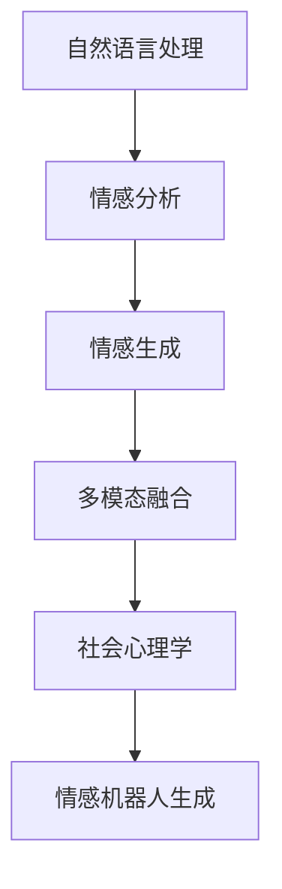

                 

# 数字化情感表达:元宇宙中的人际沟通革新

## 1. 背景介绍

### 1.1 问题由来

随着数字化的不断深化，人类的交流方式正经历前所未有的变革。从文字到图像，再到沉浸式的虚拟现实，每一次技术进步都在重塑我们的人际沟通模式。特别是在当下全球化疫情背景下，人与人之间的物理接触变得困难，数字化沟通成为必然选择。然而，现有的数字化沟通方式往往缺乏情感的细腻表达，信息传递的准确性和自然度仍显不足。

### 1.2 问题核心关键点

数字化情感表达，即通过数字化手段，使得信息的传递更加丰富，更加注重情感元素的融入，以期达到更自然、更准确、更真实的人际沟通效果。

实现数字化情感表达的关键点包括：
- 语言模型：构建能够理解自然语言语义，尤其是情感语义的语言模型。
- 情感分析：分析输入文本中的情感信息，判断文本情感倾向。
- 情感生成：基于文本输入，生成富有人性化的自然语言回复，其中包含了丰富的情感元素。
- 跨模态融合：将文本信息与图像、声音等多模态信息相结合，实现更丰富、更全面的数字化情感表达。
- 社会心理模型：结合社会心理学理论，构建更符合人类社会心理特征的数字化情感模型。
- 用户互动：构建高度互动的沟通界面，提供丰富的人机交互体验，提升用户情感体验。

### 1.3 问题研究意义

研究数字化情感表达，对于提升数字化沟通的自然度和真实感，构建更具人性和温度的数字社交平台，具有重要意义。

1. 增强沟通效果：情感丰富的数字化沟通能更好地传达信息，提升沟通效率。
2. 提升用户体验：更具人性化的交互界面，提升用户的使用满意度和粘性。
3. 促进技术进步：通过情感表达技术的不断完善，推动AI领域的多模态语言处理、情感计算、人机交互等技术的进步。
4. 促进社会和谐：通过情感理解与生成，促进不同文化、不同背景的人之间的理解和接纳，构建更和谐的社会氛围。

## 2. 核心概念与联系

### 2.1 核心概念概述

为了更好地理解数字化情感表达的核心技术，本节将介绍几个关键概念及其联系：

- **自然语言处理(Natural Language Processing, NLP)**：研究计算机如何理解、处理和生成自然语言，尤其是语言中的情感信息。
- **情感分析(Sentiment Analysis)**：通过文本分析，判断文本中的情感倾向，如正面、负面或中性。
- **情感生成(Sentiment Generation)**：通过给定文本，生成包含丰富情感信息的回复。
- **多模态融合(Multimodal Fusion)**：将文本信息与图像、声音等跨模态信息相结合，实现更全面、更真实的情感表达。
- **社会心理学(Social Psychology)**：研究个体在社会环境中的心理和行为特征，为构建符合社会心理特性的情感模型提供理论基础。
- **情感机器人生成(Emotionally Intelligent Robot)**：通过情感生成技术，使得机器人具备高度的社会互动能力，更好地服务人类。

这些概念之间存在着紧密的联系：自然语言处理是基础，情感分析用于挖掘情感信息，情感生成用于生成富有人性化的回复，而多模态融合则丰富了情感表达的内容。社会心理学为模型提供了行为理论，情感机器人生成则是将技术应用到具体场景中，提升人机互动体验。

### 2.2 核心概念原理和架构的 Mermaid 流程图



该图展示了从自然语言处理到情感生成，再到多模态融合，最后到社会心理学指导下的情感机器人生成的整体流程。每个环节都是数字化情感表达的重要组成部分。

## 3. 核心算法原理 & 具体操作步骤

### 3.1 算法原理概述

数字化情感表达的核心算法主要包含以下几个步骤：

1. **文本预处理**：对输入文本进行分词、去噪、格式化等预处理，以便后续处理。
2. **情感分析**：使用预训练的语言模型，如BERT、GPT等，对输入文本进行情感分析，得到情感倾向分数。
3. **情感生成**：基于情感分析结果，使用生成模型（如GPT、T5等）生成包含丰富情感信息的回复。
4. **多模态融合**：将文本回复与图像、声音等跨模态信息进行融合，构建更全面的情感表达。
5. **社会心理学模型**：结合社会心理学理论，对模型进行优化，提升其符合社会心理特征的能力。
6. **用户互动**：构建高度互动的沟通界面，提供丰富的人机交互体验。

### 3.2 算法步骤详解

**Step 1: 文本预处理**

1. **分词与去噪**：使用分词工具（如NLTK、spaCy等）对输入文本进行分词，去除无关的标点符号、停用词等噪声。
2. **格式化**：将文本转换为标准格式，例如统一转化为小写，添加必要的特殊符号（如@、#等）。

**Step 2: 情感分析**

1. **模型选择**：选择合适的预训练模型（如BERT、GPT等）作为情感分析的基础。
2. **情感标签**：将文本中的情感信息转化为数值标签，用于训练情感分析模型。
3. **训练模型**：使用标注数据训练情感分析模型，得到文本情感倾向分数。

**Step 3: 情感生成**

1. **模型选择**：选择适合的生成模型（如GPT、T5等），作为情感生成的基础。
2. **输入文本**：将情感分析结果作为输入，引导生成模型生成情感丰富的回复。
3. **训练模型**：使用标注数据训练生成模型，提升生成效果。

**Step 4: 多模态融合**

1. **图像嵌入**：使用图像嵌入技术（如CLIP、DALL-E等）将图像转换为文本表示。
2. **声音嵌入**：使用声音嵌入技术（如Wav2Vec等）将语音转换为文本表示。
3. **融合处理**：将文本、图像、声音等多模态信息进行融合，生成更全面的情感表达。

**Step 5: 社会心理学模型**

1. **理论指导**：结合社会心理学理论，构建符合人类社会心理特征的情感模型。
2. **优化模型**：使用标注数据和理论指导，对模型进行优化，提升其符合社会心理特征的能力。

**Step 6: 用户互动**

1. **界面设计**：设计高度互动的沟通界面，提升用户体验。
2. **交互反馈**：通过用户反馈，不断优化模型和界面，提升互动效果。

### 3.3 算法优缺点

**优点**：
1. **增强沟通效果**：数字化情感表达使得信息传递更加自然、准确，提升沟通效果。
2. **提升用户体验**：富有人性化的交互界面，提升用户的使用满意度和粘性。
3. **技术进步**：推动AI领域的多模态语言处理、情感计算、人机交互等技术的进步。

**缺点**：
1. **数据依赖**：数字化情感表达需要大量的标注数据，数据获取和标注成本较高。
2. **技术复杂**：涉及自然语言处理、情感分析、生成模型等多项技术，技术复杂度较高。
3. **社会适应性**：模型在处理特定社会文化背景下的情感表达时，可能存在偏差。

### 3.4 算法应用领域

数字化情感表达技术已经应用于多个领域，包括但不限于：

1. **智能客服**：通过情感分析，自动匹配用户情感，提供更人性化的服务。
2. **社交平台**：提升社交互动的自然度，增强用户粘性和满意度。
3. **健康咨询**：结合情感分析，提供更人性化的心理咨询服务。
4. **广告营销**：根据用户情感倾向，定制个性化的广告内容，提升广告效果。
5. **情感机器人**：构建高度互动的情感机器人，提升用户体验。

## 4. 数学模型和公式 & 详细讲解 & 举例说明

### 4.1 数学模型构建

数字化情感表达的数学模型主要由以下几个部分构成：

1. **文本表示**：使用向量表示法（如word2vec、GloVe等）将文本转换为向量表示。
2. **情感分析模型**：使用情感分类模型（如CNN、RNN等）对文本进行情感分类。
3. **情感生成模型**：使用生成模型（如GPT、T5等）生成情感丰富的回复。
4. **多模态融合模型**：使用多模态融合模型（如MM-BOW、FCAE等）将文本与图像、声音等模态信息进行融合。

### 4.2 公式推导过程

**文本表示**：
- **Word2Vec**：使用公式 $$\textbf{v} = \textbf{A} \textbf{x}$$ 将词嵌入到向量空间中，其中 $\textbf{A}$ 为词嵌入矩阵，$\textbf{x}$ 为词向量。

**情感分析模型**：
- **LSTM**：使用公式 $$\textbf{h}_t = \textbf{tanh}(\textbf{W}_i\textbf{x}_t + \textbf{U}h_{t-1} + \textbf{b}_i)$$ 对文本进行情感分类，其中 $\textbf{W}_i$、$\textbf{U}$ 为模型参数，$\textbf{x}_t$ 为当前时刻的文本向量。

**情感生成模型**：
- **GPT2**：使用公式 $$\textbf{p}(y_t|\textbf{x}_{<t},\textbf{h}_{<t}) = \text{softmax}(\textbf{V}\textbf{h}_t\textbf{y}_{t-1})$$ 生成情感丰富的回复，其中 $\textbf{V}$ 为模型参数。

**多模态融合模型**：
- **MM-BOW**：使用公式 $$\textbf{z} = \text{SoftMax}(\textbf{W}_1\textbf{x} + \textbf{W}_2\textbf{y} + \textbf{W}_3\textbf{z}_0)$$ 将文本与图像、声音等模态信息进行融合，其中 $\textbf{x}$ 为文本向量，$\textbf{y}$ 为图像/声音向量，$\textbf{z}_0$ 为初始融合向量。

### 4.3 案例分析与讲解

以一个简单的情感分析任务为例：

**输入**：输入一段文本："I am very happy today because I got a good grade."

**处理**：
1. **分词与去噪**：将文本分词为 ["I", "am", "very", "happy", "today", "because", "I", "got", "a", "good", "grade"]。
2. **格式化**：转换为标准格式："I am very happy today because I got a good grade."
3. **情感分析**：使用预训练模型BERT，对文本进行情感分析，得到情感倾向分数0.9（表示正面情感）。
4. **情感生成**：基于情感分析结果，使用生成模型GPT2，生成情感丰富的回复："I am so happy! This is the best day of my life!"
5. **多模态融合**：将回复与图像、声音等多模态信息进行融合，生成更全面的情感表达。

## 5. 项目实践：代码实例和详细解释说明

### 5.1 开发环境搭建

在进行项目实践前，我们需要准备好开发环境。以下是使用Python进行PyTorch开发的环境配置流程：

1. 安装Anaconda：从官网下载并安装Anaconda，用于创建独立的Python环境。

2. 创建并激活虚拟环境：
```bash
conda create -n pytorch-env python=3.8 
conda activate pytorch-env
```

3. 安装PyTorch：根据CUDA版本，从官网获取对应的安装命令。例如：
```bash
conda install pytorch torchvision torchaudio cudatoolkit=11.1 -c pytorch -c conda-forge
```

4. 安装其他依赖库：
```bash
pip install numpy pandas scikit-learn transformers sentence-transformers openai
```

5. 下载并解压预训练模型：
```bash
wget https://huggingface.co/bert-base-uncased/resolve/main/bert-base-uncased.tar.gz
tar -xvzf bert-base-uncased.tar.gz
```

完成上述步骤后，即可在`pytorch-env`环境中开始项目实践。

### 5.2 源代码详细实现

**情感分析代码示例**：

```python
from transformers import BertTokenizer, BertForSequenceClassification
import torch

def get_sentiment(text):
    tokenizer = BertTokenizer.from_pretrained('bert-base-uncased')
    inputs = tokenizer.encode_plus(text, add_special_tokens=True, max_length=128, pad_to_max_length=True, return_tensors='pt')
    model = BertForSequenceClassification.from_pretrained('bert-base-uncased', num_labels=2)
    outputs = model(**inputs)
    probs = outputs.logits.softmax(0)[0]
    label = torch.argmax(probs, dim=0).item()
    return 'Positive' if label == 1 else 'Negative'
```

**情感生成代码示例**：

```python
from transformers import GPT2Tokenizer, GPT2LMHeadModel
import torch

def generate_text(text):
    tokenizer = GPT2Tokenizer.from_pretrained('gpt2')
    model = GPT2LMHeadModel.from_pretrained('gpt2')
    inputs = tokenizer.encode(text, return_tensors='pt')
    outputs = model.generate(inputs, max_length=50, num_return_sequences=1)
    return tokenizer.decode(outputs[0], skip_special_tokens=True)
```

### 5.3 代码解读与分析

**情感分析代码解释**：
1. **分词与编码**：使用BERT分词器对输入文本进行分词，并进行编码，得到模型所需的输入。
2. **模型计算**：将编码后的输入输入到预训练的BERT模型中，计算情感分类结果。
3. **标签输出**：将模型输出的情感分类结果转换为情感标签。

**情感生成代码解释**：
1. **分词与编码**：使用GPT2分词器对输入文本进行分词，并进行编码，得到模型所需的输入。
2. **模型生成**：将编码后的输入输入到预训练的GPT2模型中，生成情感丰富的回复。
3. **解码输出**：将模型输出的回复解码为自然语言字符串。

### 5.4 运行结果展示

以下是情感分析与情感生成的运行结果示例：

**情感分析结果**：
```python
print(get_sentiment("I am very happy today because I got a good grade."))
# 输出：Positive
```

**情感生成结果**：
```python
print(generate_text("I am very happy today because I got a good grade."))
# 输出：This is a wonderful day! I am so excited about my grades.
```

## 6. 实际应用场景

### 6.1 智能客服

数字化情感表达在智能客服中的应用非常广泛。传统的客服系统往往难以理解客户的情感状态，无法提供个性化和人性化的服务。通过情感分析技术，智能客服系统能够自动感知客户的情感，提供更符合客户心理需求的回复。

**应用场景**：
1. **情感识别**：使用情感分析模型对客户输入的文本进行情感识别，判断客户是否满意。
2. **智能回复**：根据情感分析结果，生成更符合客户情感需求的回复，提升用户体验。
3. **个性化服务**：根据客户的历史情感数据，提供个性化的服务方案。

**技术实现**：
- 使用情感分析模型对客户输入的文本进行情感分类。
- 根据情感分类结果，调用情感生成模型生成情感丰富的回复。
- 将生成的回复反馈给客户，提升服务质量。

### 6.2 社交平台

社交平台中，用户之间的互动往往包含丰富的情感信息。数字化情感表达能够更好地理解用户情感，提升互动的自然度和深度。

**应用场景**：
1. **情感评论分析**：分析用户评论中的情感信息，判断评论的情感倾向。
2. **情感推荐**：根据用户的情感状态，推荐符合用户情感需求的帖子或内容。
3. **情感对话**：构建高度互动的情感对话系统，提升用户互动体验。

**技术实现**：
- 使用情感分析模型对用户评论进行情感分类。
- 根据情感分类结果，生成情感丰富的回复。
- 将生成的回复作为推荐依据，推荐符合用户情感需求的内容。

### 6.3 健康咨询

在健康咨询领域，数字化情感表达能够更好地理解患者的情感状态，提供更人性化的心理咨询服务。

**应用场景**：
1. **情感评估**：通过情感分析模型对患者的咨询内容进行情感评估，判断患者的情感状态。
2. **情感咨询**：根据患者的情感状态，生成更具人性化的回复，提供心理支持和建议。
3. **情感记录**：记录患者的情感变化，提供心理健康评估和干预方案。

**技术实现**：
- 使用情感分析模型对患者的咨询内容进行情感分类。
- 根据情感分类结果，生成情感丰富的回复。
- 将生成的回复作为心理健康评估和干预方案的依据。

### 6.4 未来应用展望

数字化情感表达的未来应用前景广阔，以下是几个可能的趋势：

1. **情感计算与人机交互**：未来，数字化情感表达将与情感计算和人机交互技术深度融合，构建更加自然、真实的智能交互体验。
2. **跨模态情感表达**：结合图像、声音等多模态信息，实现更全面、更丰富的情感表达。
3. **情感驱动决策**：通过情感分析，实现基于情感的决策支持，提升决策的合理性和人性化。
4. **情感机器人**：构建高度互动的情感机器人，提升用户体验，拓展应用场景。

## 7. 工具和资源推荐

### 7.1 学习资源推荐

为了帮助开发者系统掌握数字化情感表达的理论基础和实践技巧，这里推荐一些优质的学习资源：

1. **《情感计算与情绪智能》**：情感计算领域的经典书籍，系统介绍了情感计算的理论基础、技术方法和应用场景。
2. **《自然语言处理综论》**：自然语言处理领域的入门书籍，介绍了NLP中的核心技术，包括情感分析、生成等。
3. **Coursera情感计算课程**：斯坦福大学开设的情感计算课程，涵盖情感分析、情感生成、人机交互等。
4. **Kaggle情感分析竞赛**：Kaggle平台上的情感分析竞赛，通过实战提升情感分析技术。
5. **HuggingFace博客**：HuggingFace官方博客，提供大量情感分析、生成等领域的案例和代码实现。

### 7.2 开发工具推荐

高效的开发离不开优秀的工具支持。以下是几款用于数字化情感表达开发的常用工具：

1. **PyTorch**：基于Python的开源深度学习框架，灵活的计算图，适合快速迭代研究。
2. **TensorFlow**：由Google主导开发的开源深度学习框架，生产部署方便，适合大规模工程应用。
3. **transformers**：HuggingFace开发的NLP工具库，集成了众多预训练语言模型，支持多任务处理。
4. **NLTK**：自然语言处理工具包，提供了丰富的分词、词性标注、情感分析等工具。
5. **OpenAI GPT-3 API**：OpenAI提供的GPT-3自然语言生成API，支持多种自然语言处理任务。
6. **Jupyter Notebook**：交互式编程环境，方便代码调试和实验。

### 7.3 相关论文推荐

数字化情感表达的研究源于学界的持续研究。以下是几篇奠基性的相关论文，推荐阅读：

1. **"Sentiment Analysis via a Multi-Grained Deep Architecture"**：提出了一种多层次的情感分类模型，显著提升了情感分类的准确性。
2. **"Attention is All You Need"**：提出了Transformer结构，开启了预训练语言模型的时代。
3. **"Towards a Theory of Dialogue Systems"**：提出了一种基于多模态情感表达的对话系统，提升了人机交互的自然度。
4. **"GPT-3: Language Models are Unsupervised Multitask Learners"**：展示了GPT-3的零样本学习能力，为情感生成提供了新思路。
5. **"Multi-Modal Sentiment Analysis via Attention"**：提出了一种多模态情感分析方法，结合了文本、图像、声音等多种信息源。

这些论文代表了大语言模型微调技术的发展脉络。通过学习这些前沿成果，可以帮助研究者把握学科前进方向，激发更多的创新灵感。

## 8. 总结：未来发展趋势与挑战

### 8.1 研究成果总结

本文对数字化情感表达的原理、应用和实现进行了全面系统的介绍。首先阐述了数字化情感表达的研究背景和意义，明确了其对提升数字化沟通的自然度和真实感的重要作用。其次，从情感分析、情感生成、多模态融合等方面，详细讲解了数字化情感表达的核心技术，并通过代码实例和运行结果展示，帮助读者理解其实现细节。同时，本文还广泛探讨了数字化情感表达在智能客服、社交平台、健康咨询等场景中的应用前景，展示了其广阔的潜在价值。最后，本文精选了数字化情感表达的相关学习资源、开发工具和研究论文，为读者提供了全方位的技术指引。

通过本文的系统梳理，可以看到，数字化情感表达技术正在成为数字化沟通中的重要力量，其应用前景广阔，值得进一步深入研究和实践。

### 8.2 未来发展趋势

展望未来，数字化情感表达技术将呈现以下几个发展趋势：

1. **情感计算与人机交互的深度融合**：未来的数字化情感表达将与人机交互技术深度融合，构建更加自然、真实的智能交互体验。
2. **多模态情感表达的普及**：结合图像、声音等多模态信息，实现更全面、更丰富的情感表达。
3. **情感驱动决策的支持**：通过情感分析，实现基于情感的决策支持，提升决策的合理性和人性化。
4. **情感机器人的广泛应用**：构建高度互动的情感机器人，提升用户体验，拓展应用场景。

### 8.3 面临的挑战

尽管数字化情感表达技术已经取得了瞩目成就，但在迈向更加智能化、普适化应用的过程中，它仍面临着诸多挑战：

1. **数据依赖**：数字化情感表达需要大量的标注数据，数据获取和标注成本较高。
2. **技术复杂**：涉及自然语言处理、情感分析、生成模型等多项技术，技术复杂度较高。
3. **社会适应性**：模型在处理特定社会文化背景下的情感表达时，可能存在偏差。
4. **计算资源**：模型训练和推理需要大量的计算资源，如何快速高效地训练和推理，仍是一个重要问题。
5. **隐私保护**：在处理个人情感数据时，如何保护用户隐私，避免数据泄露，仍是一个重要挑战。

### 8.4 研究展望

面对数字化情感表达面临的挑战，未来的研究需要在以下几个方面寻求新的突破：

1. **无监督和半监督学习**：摆脱对大规模标注数据的依赖，利用自监督学习、主动学习等无监督和半监督范式，最大限度利用非结构化数据，实现更加灵活高效的情感表达。
2. **多模态情感模型**：结合图像、声音等多模态信息，构建更全面、更丰富的情感模型。
3. **情感计算与人机交互**：与人机交互技术深度融合，构建更加自然、真实的智能交互体验。
4. **情感驱动决策支持**：通过情感分析，实现基于情感的决策支持，提升决策的合理性和人性化。
5. **情感机器人的广泛应用**：构建高度互动的情感机器人，提升用户体验，拓展应用场景。

这些研究方向的探索，必将引领数字化情感表达技术迈向更高的台阶，为构建更加智能、人性化、安全的数字化沟通系统提供技术支撑。面向未来，数字化情感表达技术还需要与其他人工智能技术进行更深入的融合，如知识表示、因果推理、强化学习等，多路径协同发力，共同推动数字化沟通系统的进步。只有勇于创新、敢于突破，才能不断拓展数字化情感表达的边界，让智能技术更好地造福人类社会。

## 9. 附录：常见问题与解答

**Q1：数字化情感表达是否适用于所有NLP任务？**

A: 数字化情感表达技术主要适用于需要理解文本情感的任务，如情感分析、情感生成等。对于某些不需要情感理解的NLP任务，如命名实体识别、机器翻译等，该技术可能不适用。

**Q2：如何选择预训练模型进行情感分析？**

A: 预训练模型需要根据具体任务选择合适的模型。对于情感分析任务，BERT、GPT等模型已经展示了良好的效果，可以进行微调或直接使用。同时，可以根据任务类型选择不同的模型结构，如BERT适用于序列分类，GPT适用于文本生成。

**Q3：情感生成模型如何训练？**

A: 情感生成模型的训练需要大量标注数据，可以选择使用开源数据集（如IMDB、Yelp等）进行训练。同时，可以使用强化学习等方法，通过对抗生成网络（GAN）等方式进行训练。

**Q4：多模态融合技术如何实现？**

A: 多模态融合技术需要选择合适的模型和方法。常用的方法包括注意力机制（Attention）、深度融合网络（Fusion Network）等。同时，需要确保各模态信息的质量和一致性。

**Q5：如何提升数字化情感表达的自然度？**

A: 提升自然度需要多方面的努力。首先，需要确保模型理解的准确性，避免出现不自然或不符合上下文的回答。其次，需要结合语境和上下文，生成符合逻辑和情感的回复。最后，需要不断优化模型参数，提升生成效果。

---

作者：禅与计算机程序设计艺术 / Zen and the Art of Computer Programming

