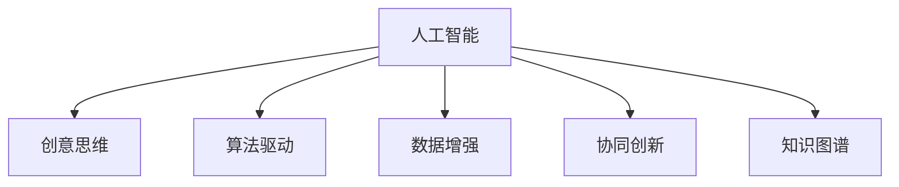

                 

## 1. 背景介绍

### 1.1 问题由来

进入21世纪以来，人工智能(AI)技术迅猛发展，逐渐渗透到社会生产与生活的各个角落。在图像识别、自然语言处理、机器翻译等领域，AI技术的广泛应用带来了效率的飞跃。然而，数字化时代的浪潮也带来了新的问题：人类传统的一些认知能力，如创造性思维，逐渐面临AI的挑战。

现代企业在追求数字化转型的过程中，往往需要大量具有创新能力的人才。在许多情况下，AI 不仅是一个工具，更是一种助力。借助AI的能力，人们可以更好地激发自身的创造力，让智能系统成为人类认知能力的延伸和放大。因此，如何通过AI驱动提升人类的创意思维，成为了数字化时代的一个重要课题。

### 1.2 问题核心关键点

- **AI与创意思维的结合**：如何让AI成为人类创造性思维的助手，而非替代者？
- **算法与创意的交互**：如何将AI算法与创意过程进行无缝衔接，使之相互促进？
- **大数据的灵感来源**：如何从海量数据中提炼出创新的灵感，用于指导创意过程？
- **AI在教育中的应用**：如何在教育领域中运用AI，激发学生的创意思维，培养下一代创新人才？
- **跨学科创意融合**：如何在不同学科领域中，通过AI进行创意的交叉融合，提升整体的创新能力？

## 2. 核心概念与联系

### 2.1 核心概念概述

为更好地理解AI驱动的创意思维培养方法，本节将介绍几个密切相关的核心概念：

- **人工智能(AI)**：通过机器学习、深度学习等算法，使计算机能够执行智能任务的技术。
- **创意思维(Creative Thinking)**：人类发现新关系、提出新问题的能力，是创造性解决复杂问题的关键。
- **算法驱动(Algorithm-Driven)**：利用算法，使计算机系统能够自动化地完成任务和决策的过程。
- **数据增强(Data Augmentation)**：通过改变原始数据的形式，增加数据的多样性，提升算法的鲁棒性和泛化能力。
- **协同创新(Co-Creation)**：通过AI与人的合作，共同完成复杂任务的创造性过程。
- **知识图谱(Knowledge Graph)**：用于表示和存储复杂知识网络的图结构，便于知识检索和推理。

这些核心概念之间的逻辑关系可以通过以下Mermaid流程图来展示：



这个流程图展示了大语言模型与创意思维培养的核心概念及其之间的关系：

1. AI通过算法驱动，使计算机能够执行任务。
2. 数据增强使AI系统能够从更广泛的数据源中提取信息。
3. 协同创新让AI与人类合作，共同创造。
4. 知识图谱作为AI的辅助工具，提升知识的组织和推理能力。

这些概念共同构成了AI驱动的创意思维培养框架，使其能够在各种场景下发挥作用。通过理解这些核心概念，我们可以更好地把握AI与人类思维的交互方式，探索创新的新路径。

## 3. 核心算法原理 & 具体操作步骤
### 3.1 算法原理概述

AI驱动的创意思维培养方法，通常采用以下核心算法：

- **深度学习(Deep Learning)**：通过多层神经网络结构，实现对复杂模式的高效学习。
- **生成对抗网络(GANs)**：通过两个神经网络的对抗性训练，生成逼真且多样的图像、文本等数据。
- **协同过滤(Recommender Systems)**：通过分析用户行为数据，为创意提供个性化推荐。
- **知识图谱(KG Embeddings)**：通过将知识图谱转换为向量表示，提高知识推理和检索的效率。
- **自然语言处理(NLP)**：通过文本分析，提取和理解创意点。

这些算法互相配合，形成了一个闭环，用于挖掘数据中的创意潜力，并驱动创意思维的培养。

### 3.2 算法步骤详解

AI驱动的创意思维培养通常包括以下几个关键步骤：

**Step 1: 收集创意数据**

1. 定义创意任务和目标，明确需要解决的问题。
2. 收集与问题相关的数据，如用户行为数据、社交媒体文本、科学论文等。
3. 清洗和预处理数据，去除噪声和冗余信息。

**Step 2: 数据增强和算法训练**

1. 使用数据增强技术，如文本回译、图像裁剪、旋转等，丰富数据的多样性。
2. 选择合适的深度学习算法，如CNN、RNN、Transformer等，进行模型训练。
3. 使用协同过滤算法，推荐相关的创意灵感。

**Step 3: 生成创意点**

1. 利用GANs等生成模型，生成新的创意点。
2. 通过算法驱动的创意生成过程，激发创意思维。

**Step 4: 创意验证和反馈**

1. 利用知识图谱进行创意的推理验证，判断创意的合理性。
2. 通过人工和机器的协同创新，不断调整和优化创意点。
3. 在实际应用中，收集反馈数据，优化创意生成模型。

**Step 5: 创意输出和应用**

1. 将生成的创意点转化为具体的应用场景，形成可行的解决方案。
2. 利用NLP技术，将创意点描述成易于理解的文本。
3. 在实际项目中应用创意点，验证创意的有效性。

### 3.3 算法优缺点

AI驱动的创意思维培养方法具有以下优点：

1. **高效性**：通过自动化算法，快速生成和筛选创意点。
2. **泛化性**：从大规模数据中提取通用的创意模式，提升创意的普遍适用性。
3. **可解释性**：通过算法和知识图谱的结合，提高创意过程的可解释性。
4. **个性化**：利用协同过滤和用户行为数据，提供个性化的创意推荐。

同时，该方法也存在一定的局限性：

1. **依赖数据质量**：算法的效果很大程度上取决于输入数据的质量和多样性。
2. **创新瓶颈**：过度依赖算法可能导致创新思维的固化，影响人类独特创意的生成。
3. **伦理风险**：生成的创意可能包含不当内容或偏见，需进行严格的伦理审查。

尽管存在这些局限性，但就目前而言，AI驱动的创意思维培养方法已展现出巨大的潜力和价值，正在被广泛应用。

### 3.4 算法应用领域

AI驱动的创意思维培养方法已经在多个领域得到广泛应用，例如：

- **设计行业**：如服装设计、工业设计等。通过AI生成创意草图和设计方案，提升设计效率和创新能力。
- **市场营销**：利用AI分析用户行为数据，生成个性化的广告创意和市场策略。
- **艺术创作**：如音乐、绘画等。AI生成音乐旋律、绘画风格等，辅助艺术家创作。
- **科学研究**：利用AI挖掘科学论文中的新观点和实验方向，加速科研成果的产出。
- **教育培训**：通过AI辅助教学，激发学生的创意思维，培养未来人才。
- **创意写作**：利用AI生成小说、诗歌等文学作品，提升写作效率和创造力。

除了这些传统应用外，AI驱动的创意思维培养还在更多领域，如金融创新、医疗研发、文化传媒等，展现出广阔的前景。

## 4. 数学模型和公式 & 详细讲解  
### 4.1 数学模型构建

为了更好地理解AI驱动的创意思维培养方法，本节将介绍几个关键的数学模型：

- **深度学习模型**：常用的深度学习模型包括卷积神经网络(CNN)、循环神经网络(RNN)、自编码器(AE)等。
- **生成对抗网络(GANs)**：由生成器和判别器两部分组成，生成器用于生成数据，判别器用于区分生成数据和真实数据。
- **协同过滤模型**：包括基于用户的协同过滤模型和基于项目的协同过滤模型。
- **知识图谱嵌入(KG Embeddings)**：将知识图谱中的实体和关系表示为向量形式，便于计算和推理。
- **自然语言处理模型**：常用的模型包括BERT、GPT、ELMo等。

这些模型之间的数学关系可以通过以下公式进行描述：

**深度学习模型**：

$$
F(x;\theta) = \sigma(W*x + b)
$$

其中 $F(x;\theta)$ 为神经网络输出，$x$ 为输入，$\theta$ 为模型参数，$W$ 和 $b$ 为权重和偏置。

**GANs模型**：

**生成器**：

$$
G(z) = \mu(\sigma(W_1*z + b_1))
$$

**判别器**：

$$
D(x) = \sigma(W_2*G(z) + b_2)
$$

**协同过滤模型**：

$$
p_{ij} = \frac{u_i * v_j^T}{\sum_{k=1}^{N}u_i * v_k^T}
$$

其中 $p_{ij}$ 为预测用户 $i$ 对物品 $j$ 的评分，$u_i$ 为用户 $i$ 的评分向量，$v_j$ 为物品 $j$ 的评分向量。

**知识图谱嵌入**：

$$
h_i = \sum_{r \in R} w_r * e_i^r
$$

其中 $h_i$ 为实体 $i$ 的向量表示，$R$ 为关系集合，$w_r$ 为关系 $r$ 的权重，$e_i^r$ 为实体 $i$ 在关系 $r$ 下的向量表示。

**自然语言处理模型**：

$$
\text{Transformer}(x) = M(x) * G(x)
$$

其中 $M(x)$ 为自注意力机制，$G(x)$ 为前馈神经网络。

### 4.2 公式推导过程

以下是几个关键模型的推导过程：

**深度学习模型**：

假设输入 $x$ 为 $m$ 维向量，输出 $y$ 为 $n$ 维向量。

根据链式法则，模型 $F(x;\theta)$ 的梯度为：

$$
\frac{\partial F(x;\theta)}{\partial x} = W^T * \frac{\partial F(x;\theta)}{\partial \theta} + \frac{\partial F(x;\theta)}{\partial b}
$$

**GANs模型**：

生成器 $G(z)$ 和判别器 $D(x)$ 的梯度分别为：

$$
\frac{\partial G(z)}{\partial z} = \mu * \frac{\partial \sigma(W_1*z + b_1)}{\partial z}
$$

$$
\frac{\partial D(x)}{\partial x} = \sigma(W_2*G(z) + b_2) * (1 - \sigma(W_2*G(z) + b_2)) * \frac{\partial G(z)}{\partial x}
$$

**协同过滤模型**：

用户 $i$ 对物品 $j$ 的评分预测值为：

$$
p_{ij} = \frac{u_i * v_j^T}{\sum_{k=1}^{N}u_i * v_k^T}
$$

**知识图谱嵌入**：

实体 $i$ 在关系 $r$ 下的向量表示为：

$$
e_i^r = \frac{\sigma(W_r * e_i + b_r)}{\sigma(W_r * e_i + b_r) + \sum_{k=1}^{N}\sigma(W_r * e_k + b_r)}
$$

**自然语言处理模型**：

Transformer模型的自注意力机制为：

$$
M(x) = \sum_{i=1}^{N} \alpha_i * x_i
$$

其中 $\alpha_i = \frac{\exp(\frac{1}{\sqrt{d_k}} * q_i^T * k_j)}{\sum_{k=1}^{N}\exp(\frac{1}{\sqrt{d_k}} * q_i^T * k_j)}
$$

Transformer模型的前馈神经网络为：

$$
G(x) = \sigma(W_2*x + b_2)
$$

在实际应用中，这些数学模型的推导和计算可以通过各种深度学习框架，如TensorFlow、PyTorch等，轻松实现。

### 4.3 案例分析与讲解

下面我们以生成对抗网络在创意设计中的应用为例，进行详细讲解。

假设我们需要生成新的设计草图，可以使用GANs模型。首先将设计领域的语义特征作为输入 $z$，生成器 $G$ 将其转换为图像 $y$：

$$
y = G(z)
$$

然后，判别器 $D$ 评估生成图像是否逼真：

$$
D(y) = \sigma(W_2*G(z) + b_2)
$$

通过不断迭代训练，调整生成器 $G$ 和判别器 $D$ 的参数，使得生成图像 $y$ 的逼真度越来越高。在训练过程中，可以利用样本标注数据进行监督，提高生成图像的创意性。

在实际应用中，设计师可以根据生成的草图，进行进一步的修改和设计，最终得到新颖的设计方案。

## 5. 项目实践：代码实例和详细解释说明
### 5.1 开发环境搭建

在进行AI驱动的创意思维培养项目开发前，我们需要准备好开发环境。以下是使用Python进行TensorFlow开发的环境配置流程：

1. 安装Anaconda：从官网下载并安装Anaconda，用于创建独立的Python环境。

2. 创建并激活虚拟环境：
```bash
conda create -n tensorflow-env python=3.8 
conda activate tensorflow-env
```

3. 安装TensorFlow：根据CUDA版本，从官网获取对应的安装命令。例如：
```bash
conda install tensorflow tensorflow-gpu=2.8.0 -c pytorch -c conda-forge
```

4. 安装TensorBoard：用于可视化训练过程和模型结构。

5. 安装Matplotlib：用于绘制数据和模型的可视化图形。

6. 安装NLTK和Spacy：用于自然语言处理任务。

完成上述步骤后，即可在`tensorflow-env`环境中开始项目开发。

### 5.2 源代码详细实现

下面以生成对抗网络(GANs)在创意设计中的应用为例，给出TensorFlow代码实现。

```python
import tensorflow as tf
import numpy as np
import matplotlib.pyplot as plt

# 定义生成器和判别器
def make_generator():
    model = tf.keras.Sequential()
    model.add(tf.keras.layers.Dense(256, input_dim=100))
    model.add(tf.keras.layers.BatchNormalization())
    model.add(tf.keras.layers.LeakyReLU())
    model.add(tf.keras.layers.Dense(512))
    model.add(tf.keras.layers.BatchNormalization())
    model.add(tf.keras.layers.LeakyReLU())
    model.add(tf.keras.layers.Dense(784, activation='tanh'))
    return model

def make_discriminator():
    model = tf.keras.Sequential()
    model.add(tf.keras.layers.Dense(512, input_dim=784))
    model.add(tf.keras.layers.LeakyReLU())
    model.add(tf.keras.layers.Dropout(0.3))
    model.add(tf.keras.layers.Dense(256))
    model.add(tf.keras.layers.LeakyReLU())
    model.add(tf.keras.layers.Dropout(0.3))
    model.add(tf.keras.layers.Dense(1, activation='sigmoid'))
    return model

# 生成随机噪声
def generate_z(batch_size):
    return tf.random.normal(shape=(batch_size, 100))

# 定义生成器和判别器的损失函数
def generator_loss(fake_output, real_output):
    return tf.reduce_mean(tf.keras.losses.BinaryCrossentropy()(tf.ones_like(fake_output), fake_output))

def discriminator_loss(real_output, fake_output):
    real_loss = tf.keras.losses.BinaryCrossentropy()(tf.ones_like(real_output), real_output)
    fake_loss = tf.keras.losses.BinaryCrossentropy()(tf.zeros_like(fake_output), fake_output)
    return real_loss + fake_loss

# 定义生成器和判别器的训练函数
def train(model, real_images, batch_size=32, epochs=100):
    discriminator_optimizer = tf.keras.optimizers.Adam(learning_rate=0.0002)
    generator_optimizer = tf.keras.optimizers.Adam(learning_rate=0.0002)
    for epoch in range(epochs):
        real_data = real_images
        noise = generate_z(batch_size)
        with tf.GradientTape() as disc_tape, tf.GradientTape() as gen_tape:
            disc_real_output = discriminator_loss(real_data, discriminator(real_data))
            disc_fake_output = discriminator_loss(generated_data, discriminator(generated_data))
            gen_loss = generator_loss(discriminator(generated_data), discriminator(real_data))
        disc_gradients = disc_tape.gradient(disc_real_output + disc_fake_output, discriminator.trainable_variables)
        gen_gradients = gen_tape.gradient(gen_loss, generator.trainable_variables)
        discriminator_optimizer.apply_gradients(zip(disc_gradients, discriminator.trainable_variables))
        generator_optimizer.apply_gradients(zip(gen_gradients, generator.trainable_variables))

# 加载数据集
real_images = ...

# 训练模型
train(model, real_images)
```

以上代码实现了GANs模型在创意设计中的应用。可以看到，通过TensorFlow的高级API，我们可以快速搭建生成器和判别器的神经网络结构，定义损失函数和训练过程。

### 5.3 代码解读与分析

让我们再详细解读一下关键代码的实现细节：

**定义生成器和判别器**：
- `make_generator`方法：定义生成器网络，包括多层全连接和激活函数。
- `make_discriminator`方法：定义判别器网络，包括多层全连接和激活函数。

**生成随机噪声**：
- `generate_z`方法：生成指定大小的随机噪声向量。

**定义损失函数**：
- `generator_loss`方法：定义生成器损失函数，计算生成样本与真实样本的判别器输出差异。
- `discriminator_loss`方法：定义判别器损失函数，计算真实样本与生成样本的判别器输出差异。

**定义训练函数**：
- `train`方法：定义训练过程，包括数据输入、计算梯度、更新参数等步骤。

**加载数据集**：
- `real_images`：定义真实样本数据集。

**训练模型**：
- 调用`train`方法进行模型训练。

可以看到，TensorFlow提供的高阶API使GANs模型的实现变得简洁高效，开发者可以更专注于模型设计和算法创新。

当然，工业级的系统实现还需考虑更多因素，如模型的保存和部署、超参数的自动搜索、更灵活的损失函数等。但核心的生成对抗网络训练流程基本与此类似。

## 6. 实际应用场景
### 6.1 智能设计

智能设计领域是AI驱动创意思维培养的重要应用场景。传统设计过程耗时长、成本高，而利用GANs模型，设计师可以生成大量创意草图和设计方案，提升设计效率。

在实际应用中，可以通过以下步骤：

1. 收集设计领域的语义特征，如颜色、形状、纹理等，作为输入 $z$。
2. 训练GANs模型，生成多种设计草图 $y$。
3. 设计师根据生成的草图，进行进一步修改和优化，生成最终的设计方案。
4. 将设计方案用于产品原型制作，验证创意效果。

通过这种自动化设计流程，设计师可以在较短时间内产生大量设计方案，为产品的创新提供更多可能。

### 6.2 创意写作

AI在创意写作中的应用，可以显著提升作家的创作效率和创意水平。

在实际应用中，可以利用自然语言处理模型，对作家的已有作品进行分析和建模。例如，利用BERT模型，分析作家的风格和主题偏好，生成新的文学作品。

具体实现步骤如下：

1. 收集作家的已有作品，作为训练数据。
2. 使用BERT模型，提取作品中的语言特征和主题信息。
3. 定义创意写作任务，生成新的文学作品。
4. 利用评价指标，如BLEU、ROUGE等，评估生成作品的质量。

通过这种自动化的创意写作流程，作家可以在短时间内创作出更多风格多样的作品，提高创作效率。

### 6.3 艺术创作

艺术创作领域，AI同样可以发挥重要作用。

在实际应用中，可以利用GANs模型生成各种风格的艺术作品，如绘画、音乐等。

具体实现步骤如下：

1. 收集各种艺术风格的作品，作为训练数据。
2. 训练GANs模型，生成新的艺术作品。
3. 艺术家根据生成的作品，进行进一步修改和创作。
4. 将创作成果展示给观众，获取反馈。

通过这种AI驱动的艺术创作流程，艺术家可以在短时间内创作出更多风格的艺术作品，激发更多的创意灵感。

### 6.4 未来应用展望

随着AI技术的不断进步，AI驱动的创意思维培养将在更多领域得到应用，为人类创新带来新的可能性。

- **教育培训**：利用AI进行个性化学习推荐，激发学生的创意思维，培养未来人才。
- **科研创新**：利用AI挖掘科学论文中的新观点和实验方向，加速科研成果的产出。
- **文化传媒**：利用AI生成影视作品、音乐等，提升内容的创新性和吸引力。
- **医疗健康**：利用AI分析医疗数据，提出新的治疗方法，提升医疗服务的创新能力。

AI驱动的创意思维培养，正在成为数字化时代创新发展的关键驱动力，为各行各业带来新的变革和突破。

## 7. 工具和资源推荐
### 7.1 学习资源推荐

为了帮助开发者系统掌握AI驱动的创意思维培养理论基础和实践技巧，这里推荐一些优质的学习资源：

1. **《深度学习入门》**：由斯坦福大学李沐老师编写的深度学习入门书籍，深入浅出地介绍了深度学习的基本概念和实践技巧。

2. **《自然语言处理综论》**：由斯坦福大学Chris Manning教授编写的自然语言处理经典教材，涵盖了NLP领域的各类模型和算法。

3. **Coursera《深度学习》**：由斯坦福大学Andrew Ng教授主讲的深度学习课程，内容全面，适合深度学习初学者。

4. **Kaggle竞赛平台**：全球最大的数据科学竞赛平台，提供丰富的数据集和问题，帮助开发者提升算法应用能力。

5. **DeepLearning.AI官方课程**：由Andrew Ng教授领导的深度学习教育机构，提供高质量的深度学习课程，涵盖多种算法和应用场景。

通过对这些资源的学习实践，相信你一定能够快速掌握AI驱动的创意思维培养的精髓，并用于解决实际的NLP问题。

### 7.2 开发工具推荐

高效的开发离不开优秀的工具支持。以下是几款用于AI驱动的创意思维培养开发的常用工具：

1. **TensorFlow**：由Google主导开发的深度学习框架，提供丰富的API和工具，适合大规模工程应用。

2. **PyTorch**：Facebook开发的深度学习框架，灵活度高，适合学术研究。

3. **Jupyter Notebook**：用于数据科学和机器学习开发的多语言编辑器，支持多种编程语言和数据格式。

4. **TensorBoard**：TensorFlow的可视化工具，提供丰富的图表和仪表盘，用于监控训练过程和模型性能。

5. **Scikit-learn**：Python科学计算库，提供高效的机器学习算法和工具，适合数据预处理和模型训练。

6. **NLTK**：Python自然语言处理库，提供丰富的文本处理功能，适合语言模型训练和分析。

合理利用这些工具，可以显著提升AI驱动的创意思维培养项目的开发效率，加快创新迭代的步伐。

### 7.3 相关论文推荐

AI驱动的创意思维培养技术源于学界的持续研究。以下是几篇奠基性的相关论文，推荐阅读：

1. **GANs for Image Synthesis**：提出GANs模型，用于生成逼真的图像数据，为创意设计提供了新的灵感来源。

2. **Creative Applications of Deep Learning**：总结了深度学习在创意写作、艺术创作等领域的应用，展示了AI技术的巨大潜力。

3. **Designing the Future: Creativity in the AI Age**：探讨了AI在创意设计中的应用，提出了AI驱动创意设计的未来趋势。

4. **Natural Language Generation for Creative Writing**：提出了基于自然语言处理模型的创意写作方法，提高了创作的效率和创意性。

5. **Knowledge Graphs in Creative Industries**：探讨了知识图谱在创意产业中的应用，提升了创意设计的创新性和科学性。

这些论文代表了大语言模型微调技术的发展脉络。通过学习这些前沿成果，可以帮助研究者把握学科前进方向，激发更多的创新灵感。

## 8. 总结：未来发展趋势与挑战
### 8.1 研究成果总结

AI驱动的创意思维培养技术在近年来取得了显著进展，广泛应用于设计、写作、艺术等创意领域。通过深度学习、生成对抗网络、协同过滤等算法，结合知识图谱、自然语言处理等技术，实现了从数据挖掘到创意生成的全流程自动化。

### 8.2 未来发展趋势

展望未来，AI驱动的创意思维培养技术将呈现以下几个发展趋势：

1. **多模态融合**：将视觉、语音、文本等多模态数据融合，提升创意生成过程的丰富性和多样性。
2. **跨领域协同**：与心理学、艺术学等学科进行交叉研究，提升创意生成的科学性和人文性。
3. **个性化推荐**：利用用户行为数据，提供个性化的创意推荐，满足不同用户的需求。
4. **实时创作**：利用边缘计算等技术，实现实时创意生成和反馈，提升用户体验。
5. **智能交互**：通过自然语言处理和语音识别技术，实现人与AI系统的智能交互，提升创意生成过程的交互性和互动性。

这些趋势将进一步拓展AI驱动的创意思维培养技术的应用边界，提升创意生成的质量和效率。

### 8.3 面临的挑战

尽管AI驱动的创意思维培养技术已展现出巨大的潜力和价值，但在迈向更加智能化、普适化应用的过程中，它仍面临着诸多挑战：

1. **数据质量瓶颈**：创意数据的获取和标注成本高，需要大量的创意作品和专家评审。
2. **创意瓶颈**：过度依赖算法可能导致创意思维的固化，影响人类独特创意的生成。
3. **伦理风险**：生成的创意可能包含不当内容或偏见，需进行严格的伦理审查。
4. **模型可解释性**：创意生成模型的决策过程缺乏可解释性，难以对其推理逻辑进行分析和调试。

尽管存在这些挑战，但通过不断创新和优化，AI驱动的创意思维培养技术必将迈向更高的台阶，为人类创新发展带来更多可能。

### 8.4 研究展望

面对AI驱动的创意思维培养技术所面临的挑战，未来的研究需要在以下几个方面寻求新的突破：

1. **数据自动化标注**：利用自然语言处理和机器学习技术，自动标注创意数据，降低人工成本。
2. **跨领域知识整合**：将不同学科的知识进行整合，提升创意生成模型的通用性和创造性。
3. **个性化创意生成**：利用深度学习模型，针对不同用户的个性化需求，生成多样化的创意作品。
4. **模型可解释性提升**：通过引入可解释性模型和解释性技术，提升创意生成模型的可解释性。
5. **实时创意反馈**：利用边缘计算和实时数据处理技术，实现创意生成过程的实时反馈和优化。

这些研究方向将推动AI驱动的创意思维培养技术不断演进，为人类创新发展提供更广阔的空间。

## 9. 附录：常见问题与解答
**Q1：AI驱动的创意思维培养是否适合所有创意任务？**

A: AI驱动的创意思维培养在大多数创意任务上都能取得不错的效果，特别是对于数据量较小的任务。但对于一些特定领域的任务，如医学、法律等，仅仅依靠通用语料预训练的模型可能难以很好地适应。此时需要在特定领域语料上进一步预训练，再进行微调，才能获得理想效果。此外，对于一些需要时效性、个性化很强的任务，如对话、推荐等，微调方法也需要针对性的改进优化。

**Q2：如何选择适合创意生成任务的深度学习模型？**

A: 深度学习模型有很多选择，包括卷积神经网络(CNN)、循环神经网络(RNN)、Transformer等。选择模型时需要考虑任务类型、数据特点等因素。例如，对于图像生成任务，可以使用CNN模型；对于文本生成任务，可以使用RNN或Transformer模型。同时，可以结合多个模型进行融合，提升创意生成效果。

**Q3：AI驱动的创意思维培养是否会降低人类的创意能力？**

A: 不会。AI驱动的创意思维培养旨在辅助人类，激发创意，而非替代人类。通过AI的帮助，人类可以更高效地完成创意工作，提升创新能力。同时，AI的创意生成能力也有局限，需要人类的判断和修正，才能生成更符合人类价值观和伦理道德的创意作品。

**Q4：如何提高AI驱动的创意思维培养的可解释性？**

A: 提高可解释性的方法包括引入可解释性模型和解释性技术，如LIME、SHAP等。同时，可以通过可视化技术，展示模型决策过程和推理路径，提升模型的可解释性。此外，通过加入领域专家的审核机制，确保创意生成模型的决策符合人类的价值观和伦理道德。

**Q5：AI驱动的创意思维培养技术是否会存在伦理风险？**

A: 是的。AI驱动的创意思维培养技术可能存在伦理风险，如生成不当内容或偏见。为避免这些问题，需要在创意生成模型中加入伦理导向的评估指标，过滤和惩罚有害的内容和偏见。同时，需要进行严格的人工审核和监督，确保创意生成模型的输出符合人类的价值观和伦理道德。

---

作者：禅与计算机程序设计艺术 / Zen and the Art of Computer Programming

