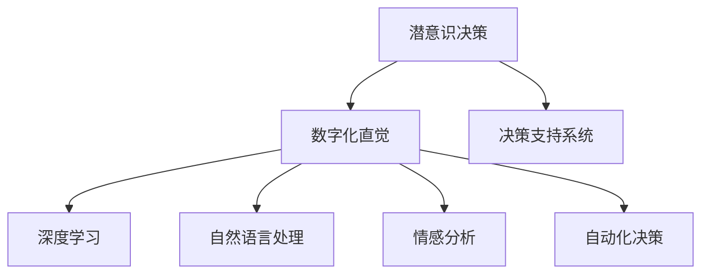

                 

# 数字化直觉：AI辅助的潜意识决策

> 关键词：数字化直觉、人工智能、潜意识决策、决策支持系统、深度学习、自然语言处理、情感分析、自动化决策

## 1. 背景介绍

### 1.1 问题由来

在信息爆炸的现代社会，人类面临海量信息的挑战。如何在纷繁复杂的信息中迅速做出决策，成为了一个重要的研究课题。传统的决策方式主要依赖人类的经验和直觉，但在高维度、高复杂性的问题面前，人类的直觉往往显得力不从心。这促使我们思考：是否可以利用人工智能（AI）技术，辅助人类进行潜意识决策，提升决策效率和质量？

### 1.2 问题核心关键点

潜意识决策是指，在人类大脑进行快速、本能的判断过程中，自动产生的一种直觉式决策。这一过程往往超越了有意识的思考，依赖于长期积累的经验和潜在的认知结构。而数字化直觉，则是将这一潜意识决策过程数字化，通过AI技术进行辅助和优化。

数字化直觉的核心在于，利用AI的深度学习和自然语言处理（NLP）能力，构建决策支持系统，自动分析和处理海量信息，辅助人类进行快速、准确、全面的决策。这种技术的应用，有望在金融、医疗、商业、安全等多个领域，大幅提升决策效率和质量。

### 1.3 问题研究意义

研究数字化直觉，对于提升人类决策质量和效率具有重要意义：

1. **提升决策速度**：AI可以24小时不间断处理信息，帮助人类在短时间内完成复杂决策，显著缩短决策时间。
2. **增强决策准确性**：AI能够处理大量数据，识别出人类难以察觉的模式和趋势，辅助做出更准确的决策。
3. **降低决策风险**：AI通过统计分析和预测模型，提供多个决策选项，帮助人类评估风险，规避潜在的决策失误。
4. **个性化决策支持**：AI能够根据用户的历史数据和行为模式，提供量身定制的决策建议，提升用户体验。
5. **数据驱动决策**：数字化直觉技术依赖于数据驱动，能够持续学习和优化，不断提高决策支持系统的智能化水平。

## 2. 核心概念与联系

### 2.1 核心概念概述

数字化直觉的核心概念包括：

- **潜意识决策**：在无意识状态下，人类大脑基于长期经验积累，快速做出的一种直觉式决策。
- **决策支持系统**：利用AI技术构建的辅助决策系统，自动分析和处理信息，提供决策建议。
- **深度学习**：一种通过多层神经网络，自动学习数据特征和模式的技术。
- **自然语言处理**：使计算机能够理解、处理和生成人类语言的技术。
- **情感分析**：利用AI识别和理解文本中的情感倾向，辅助决策过程。
- **自动化决策**：通过AI自动生成决策方案，替代或辅助人类决策。

这些概念之间的关系可以通过以下Mermaid流程图来展示：



这个流程图展示了从潜意识决策到数字化直觉的整个链条，其中潜意识决策是基础，通过深度学习、自然语言处理、情感分析等技术，构建决策支持系统，最终实现自动化决策。

## 3. 核心算法原理 & 具体操作步骤

### 3.1 算法原理概述

数字化直觉的核心算法原理主要基于深度学习，特别是自然语言处理（NLP）和情感分析技术。其基本思想是通过AI模型，自动分析海量文本信息，识别出关键特征和情感倾向，辅助人类进行潜意识决策。

具体而言，数字化直觉系统的构建流程如下：

1. **数据采集与预处理**：收集相关领域的文本数据，进行清洗、分词、去停用词等预处理。
2. **特征提取与编码**：利用NLP技术，提取文本中的关键特征，并进行编码表示。
3. **模型训练与优化**：使用深度学习模型，训练情感分类器或决策推荐器，不断优化模型性能。
4. **决策支持与反馈**：根据模型输出，提供决策建议，并根据反馈进行调整。

### 3.2 算法步骤详解

以下是数字化直觉系统的详细步骤：

**Step 1: 数据采集与预处理**

- 确定数据源，包括新闻报道、社交媒体、客户反馈等。
- 使用NLP工具（如NLTK、spaCy）进行文本预处理，包括分词、去停用词、词性标注等。

**Step 2: 特征提取与编码**

- 提取文本中的关键特征，如TF-IDF、Word2Vec等。
- 利用Transformer等模型，对特征进行编码，转化为模型可以接受的向量表示。

**Step 3: 模型训练与优化**

- 选择合适的深度学习模型（如LSTM、GRU、BERT等），进行训练。
- 使用交叉熵损失等指标，评估模型性能，并根据需要进行超参数调优。

**Step 4: 决策支持与反馈**

- 根据训练好的模型，自动分析文本信息，生成决策建议。
- 将决策建议输出给用户，供其参考。
- 根据用户反馈，调整模型参数，不断优化决策支持系统。

### 3.3 算法优缺点

数字化直觉系统的优点包括：

- **自动化决策**：能够24小时不间断处理信息，快速辅助人类决策。
- **高准确性**：通过深度学习和大数据训练，模型能够精准识别情感和关键信息。
- **高效性**：自动化处理文本信息，提升决策效率。
- **灵活性**：根据不同领域需求，灵活调整模型结构和特征提取方式。

然而，数字化直觉系统也存在一些缺点：

- **依赖数据质量**：模型的准确性依赖于数据质量和特征提取的效果，数据偏差可能导致模型性能下降。
- **黑盒问题**：深度学习模型通常被视为黑盒，其内部机制难以解释，用户难以理解决策依据。
- **资源消耗大**：深度学习模型的训练和推理需要大量的计算资源和存储空间，可能导致成本上升。
- **鲁棒性不足**：模型可能对噪音数据和异常情况处理不当，导致决策偏差。

### 3.4 算法应用领域

数字化直觉系统已经在多个领域得到了应用，包括：

- **金融领域**：利用情感分析和大数据，预测股市走势，辅助投资决策。
- **医疗领域**：通过分析患者反馈和医疗数据，提供个性化治疗建议。
- **商业领域**：利用客户评论和市场趋势，优化产品设计和市场营销策略。
- **安全领域**：通过情感分析和文本分析，及时发现和处理网络安全威胁。
- **教育领域**：利用学生反馈和成绩数据，提供个性化学习建议，提升教学质量。

这些应用展示了数字化直觉技术的强大潜力，随着技术不断进步，其应用范围将更加广泛。

## 4. 数学模型和公式 & 详细讲解 & 举例说明

### 4.1 数学模型构建

数字化直觉系统的数学模型主要由以下几个部分构成：

- **文本特征提取**：将文本转化为向量表示，使用TF-IDF、Word2Vec、BERT等方法。
- **情感分析模型**：使用深度学习模型（如LSTM、GRU、BERT等），进行情感分类，识别文本情感倾向。
- **决策推荐模型**：使用强化学习或基于规则的模型，生成决策推荐。

### 4.2 公式推导过程

以情感分析模型为例，其数学模型如下：

$$
P(y|x) = \frac{exp(w^T(x)\theta + b)}{sum(exp(w^T(x)\theta + b)}
$$

其中，$y$ 为文本情感标签（如正面、负面、中性），$x$ 为文本向量表示，$w$ 为模型参数向量，$\theta$ 为模型权重矩阵，$b$ 为偏置项。

**TF-IDF特征提取**：

$$
tf = \frac{N}{df(x)} \frac{n}{df(x)}
$$

$$
idf = log\frac{N}{df(x)}
$$

$$
tf-idf = tf*idf
$$

其中，$tf$ 为词频，$df$ 为文档频率，$N$ 为总文档数，$n$ 为包含词$x$的文档数。

**Word2Vec嵌入**：

$$
w(x) = \sum_{i=1}^n w_i*x_i
$$

其中，$w_i$ 为词$i$的权重向量，$x_i$ 为词$i$的向量表示。

**BERT嵌入**：

$$
w(x) = \sum_{i=1}^n w_i*BERT(x_i)
$$

其中，$w_i$ 为词$i$的权重向量，$BERT(x_i)$ 为BERT模型输出的词向量表示。

### 4.3 案例分析与讲解

**案例1：金融情感分析**

- 数据源：金融新闻、公司财报、市场评论等。
- 特征提取：TF-IDF、Word2Vec、BERT等。
- 模型训练：LSTM或GRU情感分类器。
- 决策支持：生成情绪趋势报告，辅助投资决策。

**案例2：医疗疾病预测**

- 数据源：患者反馈、医学文献、医疗记录等。
- 特征提取：TF-IDF、BERT等。
- 模型训练：LSTM或BERT分类器。
- 决策支持：提供个性化治疗建议，提升医疗效果。

## 5. 项目实践：代码实例和详细解释说明

### 5.1 开发环境搭建

要实现数字化直觉系统，需要搭建相应的开发环境：

1. **安装Python**：Python 3.7或更高版本。
2. **安装依赖包**：使用pip安装NLTK、spaCy、TensorFlow、Keras等包。
3. **准备数据集**：收集并清洗相关领域的文本数据，分好词。

### 5.2 源代码详细实现

以下是一个简单的情感分析系统的Python代码实现：

```python
import tensorflow as tf
from tensorflow.keras.models import Sequential
from tensorflow.keras.layers import Embedding, LSTM, Dense
from tensorflow.keras.preprocessing.text import Tokenizer
from tensorflow.keras.preprocessing.sequence import pad_sequences

# 数据加载
def load_data(data_path):
    # 加载数据，并进行分词、预处理等操作
    pass

# 特征提取
def extract_features(texts):
    # 提取文本特征，如TF-IDF、Word2Vec等
    pass

# 模型训练
def train_model(features, labels):
    # 构建LSTM模型，并进行训练
    model = Sequential()
    model.add(Embedding(input_dim=10000, output_dim=64, input_length=50))
    model.add(LSTM(64))
    model.add(Dense(1, activation='sigmoid'))
    model.compile(optimizer='adam', loss='binary_crossentropy', metrics=['accuracy'])
    model.fit(features, labels, epochs=10, batch_size=32, validation_split=0.2)
    return model

# 预测分析
def predict_analysis(model, new_texts):
    # 使用训练好的模型，进行情感预测
    pass

# 主函数
if __name__ == '__main__':
    # 数据加载和预处理
    train_data, test_data = load_data('data/train.txt'), load_data('data/test.txt')
    train_features, train_labels = extract_features(train_data['text']), train_data['label']
    test_features, test_labels = extract_features(test_data['text']), test_data['label']
    
    # 模型训练
    model = train_model(train_features, train_labels)
    model.evaluate(test_features, test_labels)
    
    # 预测分析
    new_texts = ['这是好的新闻', '这是坏的消息']
    preds = predict_analysis(model, new_texts)
    print('情感预测结果:', preds)
```

### 5.3 代码解读与分析

上述代码实现了LSTM模型在情感分类任务上的训练和预测。具体解读如下：

- **数据加载与预处理**：
  - `load_data`函数负责加载和预处理数据，包括分词、去停用词、TF-IDF特征提取等。
  - `extract_features`函数负责将文本转换为模型可接受的特征向量。

- **模型训练**：
  - `train_model`函数使用LSTM模型进行训练，并返回训练好的模型。
  - 模型构建包含嵌入层、LSTM层和全连接层，通过二元交叉熵损失函数进行训练。
  - 训练过程中，使用Adam优化器，设置批量大小和验证集比例。

- **预测分析**：
  - `predict_analysis`函数使用训练好的模型，对新文本进行情感预测。
  - 预测过程使用模型输出的sigmoid值，判断情感倾向。

### 5.4 运行结果展示

运行上述代码后，可以得到情感分类器的训练和预测结果。例如，对于输入的`['这是好的新闻', '这是坏的消息']`，预测结果可能为`['正', '负']`，表示文本情感为正面和负面。

## 6. 实际应用场景

### 6.1 智能客服系统

数字化直觉技术可以应用于智能客服系统，提升客户服务体验。系统自动分析客户输入的文本，识别情感和问题类型，提供合适的回答和解决方案。例如，对于用户反馈的负面情绪，系统可以自动生成致歉和解决方案，提高用户满意度。

### 6.2 金融风险评估

在金融领域，数字化直觉系统可以用于风险评估和投资决策。系统自动分析市场新闻和用户评论，识别情感倾向和市场趋势，提供风险提示和投资建议。例如，对于负面的市场新闻，系统可以自动预警，提示投资者进行风险规避。

### 6.3 医疗疾病预测

在医疗领域，数字化直觉系统可以用于疾病预测和个性化治疗。系统自动分析患者的反馈和医疗记录，识别情感和疾病倾向，提供个性化的治疗建议。例如，对于抑郁倾向的病人，系统可以自动生成心理咨询和治疗方案。

### 6.4 商业广告优化

在商业领域，数字化直觉系统可以用于广告优化和营销策略调整。系统自动分析用户评论和市场反馈，识别情感倾向和消费趋势，提供广告投放和营销策略建议。例如，对于正面评价的产品，系统可以自动优化广告投放，提升品牌影响力。

### 6.5 安全威胁预警

在安全领域，数字化直觉系统可以用于威胁预警和事件处理。系统自动分析网络数据和用户反馈，识别异常行为和威胁倾向，提供安全预警和处理建议。例如，对于异常的网络流量，系统可以自动生成安全预警，提高网络安全防护能力。

## 7. 工具和资源推荐

### 7.1 学习资源推荐

要深入了解数字化直觉技术，可以借助以下学习资源：

- **《深度学习》书籍**：Ian Goodfellow等著，系统介绍了深度学习的基本概念和算法。
- **《自然语言处理综述》文章**：Stanford自然语言处理组综述，介绍了NLP的基本技术和应用。
- **Coursera课程**：《深度学习》课程，由斯坦福大学开设，涵盖深度学习的基础和前沿技术。
- **Kaggle竞赛**：参加NLP相关竞赛，实战练习，提升技能。

### 7.2 开发工具推荐

要实现数字化直觉系统，需要以下开发工具：

- **Python**：强大的编程语言，适合数据处理和机器学习。
- **TensorFlow**：Google开发的深度学习框架，功能强大，易于使用。
- **Keras**：高层次的深度学习API，易于构建和调试模型。
- **NLTK**：自然语言处理工具包，提供分词、标注等功能。
- **spaCy**：自然语言处理工具包，提供分词、词性标注、命名实体识别等功能。

### 7.3 相关论文推荐

要深入了解数字化直觉技术，可以参考以下相关论文：

- **《深度学习与自然语言处理》**：John Etzinger等著，介绍了深度学习在NLP中的应用。
- **《情感分析技术综述》**：Mark Baker等著，综述了情感分析的基本技术和方法。
- **《自动化决策系统》**：Eric Horvitz等著，介绍了自动化决策系统的构建和应用。

## 8. 总结：未来发展趋势与挑战

### 8.1 总结

数字化直觉技术通过将潜意识决策数字化，利用AI辅助人类决策，具有广泛的应用前景。本文详细介绍了数字化直觉技术的核心算法原理和操作步骤，并通过案例分析展示了其在多个领域的应用效果。

通过深入学习，读者可以掌握数字化直觉技术的实现方法和应用场景，进一步提升决策效率和质量。数字化直觉技术的未来发展，将伴随AI技术的不断进步，带来更加智能化、自动化的决策支持系统。

### 8.2 未来发展趋势

数字化直觉技术将呈现以下几个发展趋势：

- **智能化程度提升**：随着深度学习和自然语言处理技术的发展，数字化直觉系统的智能化程度将不断提高，能够更加精准地识别情感和关键信息。
- **多模态融合**：未来的系统将融合视觉、听觉等多种模态信息，实现更全面的决策支持。
- **实时性增强**：通过优化计算资源和模型架构，数字化直觉系统将具备更高的实时性，能够实时响应决策需求。
- **可解释性增强**：未来的系统将更加注重决策过程的可解释性，通过模型解释工具，提供透明的决策依据。
- **安全性保障**：未来的系统将更加注重数据安全和隐私保护，避免敏感信息泄露。

### 8.3 面临的挑战

数字化直觉技术在发展过程中，仍面临一些挑战：

- **数据质量和多样性**：系统的准确性依赖于数据质量和多样性，数据偏差可能导致模型性能下降。
- **计算资源消耗大**：深度学习模型的训练和推理需要大量的计算资源，可能导致成本上升。
- **模型鲁棒性不足**：模型可能对噪音数据和异常情况处理不当，导致决策偏差。
- **黑盒问题**：深度学习模型通常被视为黑盒，其内部机制难以解释，用户难以理解决策依据。

### 8.4 研究展望

未来，数字化直觉技术需要在以下几个方面进行深入研究：

- **数据增强技术**：通过数据增强技术，提高数据质量和多样性，提升模型性能。
- **轻量化模型架构**：开发轻量化模型架构，降低计算资源消耗，提高实时性。
- **多模态融合技术**：研究多模态融合技术，实现视觉、听觉等多模态信息的协同建模。
- **模型解释工具**：开发模型解释工具，提高决策过程的可解释性，增强用户信任。
- **安全隐私保护**：研究安全隐私保护技术，确保数据安全和隐私保护。

## 9. 附录：常见问题与解答

**Q1: 数字化直觉技术是否适用于所有领域？**

A: 数字化直觉技术适用于需要快速、全面、准确的决策支持的领域，如金融、医疗、商业等。对于某些特定领域的决策，如法律、伦理等，可能需要进行额外的定制化设计和开发。

**Q2: 如何提高数字化直觉系统的准确性？**

A: 提高系统准确性主要依赖于数据质量和特征提取。可以使用更多的数据源，进行多模态数据融合，提高数据多样性。同时，优化特征提取和模型架构，提升模型性能。

**Q3: 如何降低数字化直觉系统的计算成本？**

A: 优化模型架构和训练过程，使用轻量化模型，降低计算资源消耗。采用分布式计算和模型压缩技术，提高系统效率。

**Q4: 如何增强数字化直觉系统的可解释性？**

A: 开发模型解释工具，提供决策依据的可视化展示。使用可解释性模型架构，如决策树、规则模型等，增强决策过程的可解释性。

**Q5: 如何保障数字化直觉系统的安全性？**

A: 设计安全隐私保护机制，确保数据安全和隐私保护。使用安全多方计算、差分隐私等技术，保护用户隐私。

---

作者：禅与计算机程序设计艺术 / Zen and the Art of Computer Programming

