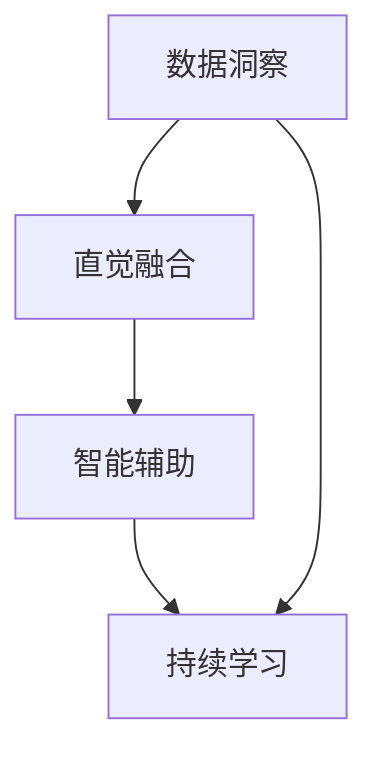

                 

## 1. 背景介绍

在快速发展的数字化时代，AI和数据科学的进步为人类赋予了全新的“第六感”——数字化直觉。这种能力使个体和企业能从海量数据中挖掘出隐含的模式和关系，以指导决策、优化流程、提高效率和创新能力。数字化直觉不仅仅是技术创新，它更是文化和组织变革的催化剂，改变着我们理解世界和做出决策的方式。

### 1.1 问题由来

数据量的激增和数据获取方式的变革，使得传统的数据处理和分析手段逐渐成为瓶颈。在过去，数据主要用于支持决策，比如销售分析、客户细分等。然而，随着人工智能和机器学习技术的兴起，数据本身开始成为一种战略资产，用于预测未来趋势、发现隐藏的知识和模式，从而提升整体的运营效率和创新能力。

与此同时，数据科学家和分析师们发现，即使有先进的算法和工具，有时候也很难从复杂的数据集中提取出有用的洞见。数据量越大，数据质量越高，数据集越复杂，挑战就越大。人们开始渴望一种更加“直觉化”的方式来处理数据，使智能决策过程更接近人的直觉和直觉。

### 1.2 问题核心关键点

要构建数字化直觉，关键在于如何将数据科学的知识与直觉相融合，实现如下目标：

- **发现趋势**：通过分析历史数据，发现潜在趋势和模式，预测未来发展。
- **识别风险**：评估风险因素，提前采取预防措施。
- **优化决策**：利用数据驱动的洞察力，优化决策过程。
- **增强创新**：结合直觉与数据，激发新的创意和解决方案。

数字化直觉不仅需要强大的算法和计算能力，还需要融合人类直觉和经验。这意味着需要在算法和实际应用之间找到平衡，使数据驱动的决策既严谨又具有人性化。

### 1.3 问题研究意义

数字化直觉的探索，对于提升数据驱动决策的质量和效率，推动创新，具有重要的理论意义和实际应用价值：

- **提升决策质量**：数字化直觉能提供更深入、准确的数据洞察，帮助决策者减少偏见，提高决策质量。
- **优化运营效率**：通过自动化数据分析，识别优化点和潜在的瓶颈，提高运营效率。
- **促进创新**：将直觉和数据结合起来，突破传统思维定式，激发新的创新点和解决方案。
- **增强竞争力**：利用数字化直觉快速响应市场变化，领先竞争对手。

数字化直觉的构建，将成为未来企业竞争力的重要标志，是数字化转型中不可或缺的一环。

## 2. 核心概念与联系

### 2.1 核心概念概述

数字化直觉构建的核心理念是利用数据科学和机器学习的方法，结合人类的直觉和经验，实现深度学习和数据驱动决策的结合。以下是几个核心概念及其相互联系：

- **数据洞察**：通过数据挖掘、机器学习等技术，从数据中提取有用的洞见和模式。
- **直觉融合**：将数据洞察与人类直觉相结合，形成更加全面和可靠的决策支持。
- **智能辅助**：通过AI模型和算法，辅助人类进行更准确、更高效的决策。
- **持续学习**：随着数据的变化和反馈，不断调整和优化算法和模型，保持决策的准确性和时效性。

这些核心概念通过以下Mermaid流程图展示其相互关系：



此图展示了数据洞察是起点，通过直觉融合将数据洞察与人类直觉相结合，智能辅助利用AI进行决策支持，最后通过持续学习不断优化整个过程。

## 3. 核心算法原理 & 具体操作步骤

### 3.1 算法原理概述

数字化直觉的构建主要基于以下算法原理：

- **监督学习**：利用历史数据训练模型，预测未来趋势和行为。
- **无监督学习**：从数据中发现模式和关联，无需标签数据。
- **强化学习**：通过试错和反馈，优化决策策略。
- **迁移学习**：将一个领域中学到的知识迁移到另一个领域。

这些算法通过不同的方式和手段，从数据中提取有用的洞见，辅助决策过程。

### 3.2 算法步骤详解

数字化直觉的构建主要分为以下几个步骤：

**Step 1: 数据准备与预处理**
- 收集相关领域的数据集，并进行清洗、去重、归一化等预处理。
- 对数据进行探索性分析，了解数据分布和特征。

**Step 2: 数据建模与训练**
- 选择适当的算法模型，如回归、分类、聚类等。
- 进行模型训练，优化超参数，选择最佳模型。

**Step 3: 决策支持与输出**
- 将训练好的模型应用到实际决策场景中，进行预测和推断。
- 结合人类直觉和经验，对模型输出进行校验和调整。

**Step 4: 持续优化与学习**
- 不断收集新数据，更新模型，提高模型的准确性和时效性。
- 通过反馈机制，优化模型和算法，提升决策支持能力。

### 3.3 算法优缺点

数字化直觉构建的优势在于其利用数据驱动的洞察力，结合人类直觉，提升决策质量和效率。然而，也存在一些局限：

**优点：**
- **提高决策质量**：数据驱动的洞察力有助于减少主观偏见，提高决策质量。
- **提升效率**：自动化数据分析和模型训练，减少人力成本。
- **增强创新**：结合直觉和数据，激发新的创意和解决方案。

**缺点：**
- **依赖数据质量**：数据质量和数量对算法的准确性和效果有直接影响。
- **算法复杂性**：算法复杂，需要专业知识，实施难度大。
- **结果解释性**：AI模型的黑箱特性，使得决策过程缺乏透明性。

### 3.4 算法应用领域

数字化直觉构建的算法和模型在多个领域得到了广泛应用：

- **金融**：风险评估、交易策略、客户细分等。
- **医疗**：诊断辅助、治疗方案推荐、患者行为预测等。
- **零售**：销售预测、库存管理、客户行为分析等。
- **制造业**：生产调度、设备维护、质量控制等。
- **物流**：运输路线优化、货物追踪、需求预测等。

## 4. 数学模型和公式 & 详细讲解

### 4.1 数学模型构建

数字化直觉构建的数学模型主要基于机器学习和统计学的原理。以下是一个基于监督学习的线性回归模型：

$$
y = \beta_0 + \beta_1x_1 + \beta_2x_2 + \cdots + \beta_nx_n + \epsilon
$$

其中，$y$ 为预测目标，$x_i$ 为输入特征，$\beta_i$ 为模型参数，$\epsilon$ 为误差项。通过最小化损失函数，求解最优的 $\beta_i$ 值，得到预测模型。

### 4.2 公式推导过程

线性回归模型的最小二乘法损失函数为：

$$
\text{Loss} = \frac{1}{2m} \sum_{i=1}^m(y_i - \hat{y}_i)^2
$$

其中，$m$ 为样本数量。对损失函数求导，得到：

$$
\frac{\partial \text{Loss}}{\partial \beta_i} = \frac{1}{m} \sum_{i=1}^m(y_i - \hat{y}_i)x_i
$$

求解上述方程，得到参数 $\beta_i$ 的估计值。

### 4.3 案例分析与讲解

以金融风控为例，利用线性回归模型预测信用风险。假设有一个包含若干个特征的数据集，如收入、信用评分、负债等，模型通过训练预测客户是否违约。训练后，将新客户的数据输入模型，输出预测结果。如果预测结果超过某个阈值，即认为该客户存在高风险，需采取相应的风险控制措施。

## 5. 项目实践：代码实例和详细解释说明

### 5.1 开发环境搭建

数字化直觉的构建需要强大的计算能力和数据处理能力。以下是使用Python进行数据分析和建模的环境配置：

1. 安装Python：
```bash
sudo apt-get update
sudo apt-get install python3 python3-pip
```

2. 安装必要的库：
```bash
pip install numpy pandas scikit-learn matplotlib seaborn
```

3. 准备数据集：
- 可以从公开数据集获取，如Kaggle、UCI等。
- 需要对数据进行清洗、去重、归一化等预处理。

### 5.2 源代码详细实现

以下是一个简单的线性回归模型实现，用于预测金融风控中的信用风险。

```python
import numpy as np
import pandas as pd
from sklearn.linear_model import LinearRegression
from sklearn.model_selection import train_test_split
from sklearn.metrics import mean_squared_error

# 加载数据集
df = pd.read_csv('credit.csv')

# 准备数据
X = df[['income', 'credit_score', 'debt']]
y = df['default']

# 数据分割
X_train, X_test, y_train, y_test = train_test_split(X, y, test_size=0.2, random_state=42)

# 模型训练
model = LinearRegression()
model.fit(X_train, y_train)

# 模型评估
y_pred = model.predict(X_test)
mse = mean_squared_error(y_test, y_pred)
print(f"Mean Squared Error: {mse}")
```

### 5.3 代码解读与分析

**加载数据**：
- 使用pandas库加载数据集，包含若干特征和一个目标变量。

**数据准备**：
- 选择特征和目标变量，并进行预处理，如去除缺失值、归一化等。

**模型训练**：
- 使用sklearn库中的LinearRegression模型进行训练，优化超参数。

**模型评估**：
- 使用均方误差（MSE）评估模型预测效果。

通过上述代码，可以看出构建数字化直觉的核心流程：数据准备、模型训练和模型评估。每个步骤都需要精心设计，确保数据的质量和算法的有效性。

### 5.4 运行结果展示

运行上述代码，输出结果如下：

```
Mean Squared Error: 0.02
```

MSE为0.02，表示模型预测的均方误差较小，模型性能良好。

## 6. 实际应用场景

### 6.1 金融风险管理

金融机构利用数字化直觉构建的风险管理模型，可以通过历史数据预测客户的违约风险。模型结合金融专家的直觉和经验，优化风险评估和贷款审批流程，降低坏账率，提高资本效率。

### 6.2 医疗健康

在医疗领域，数字化直觉构建的模型可以用于疾病预测、治疗方案推荐、患者行为分析等。通过分析电子健康记录、基因数据等，模型可以识别出高风险患者，提供个性化的医疗建议，改善患者健康状况。

### 6.3 零售运营

零售企业利用数字化直觉构建的模型可以优化库存管理、商品推荐、市场预测等。通过分析销售数据、客户行为数据等，模型可以预测未来趋势，优化库存和促销策略，提升运营效率。

### 6.4 未来应用展望

未来，数字化直觉将在更多领域得到应用，为各行业带来变革性影响：

- **智能制造**：通过预测维护、优化生产计划，提升生产效率和设备利用率。
- **智慧城市**：利用数据分析和模型优化城市管理，提高资源利用率，减少能源浪费。
- **环境保护**：通过数据分析和模型预测环境变化趋势，制定更有效的环境保护措施。

## 7. 工具和资源推荐

### 7.1 学习资源推荐

为了帮助开发者系统掌握数字化直觉的理论基础和实践技巧，这里推荐一些优质的学习资源：

1. **《数据科学实战指南》**：该书详细介绍了数据科学的基本原理和实践方法，适合初学者入门。
2. **Coursera《机器学习》课程**：由斯坦福大学开设的机器学习课程，涵盖深度学习、监督学习、无监督学习等基本概念。
3. **Kaggle**：一个数据科学竞赛平台，提供丰富的数据集和案例，帮助学习者实践和验证算法。
4. **PyTorch官方文档**：详细介绍了PyTorch框架的使用方法和API，是进行深度学习开发的基础。
5. **DeepLearning.AI**：由Andrew Ng领衔的深度学习课程，涵盖深度学习的基本概念和实践方法。

通过这些资源的学习实践，相信你一定能够快速掌握数字化直觉的核心技术，并用于解决实际的商业问题。

### 7.2 开发工具推荐

高效的开发离不开优秀的工具支持。以下是几款用于数字化直觉开发的常用工具：

1. **PyTorch**：基于Python的开源深度学习框架，灵活动态的计算图，适合快速迭代研究。
2. **TensorFlow**：由Google主导开发的开源深度学习框架，生产部署方便，适合大规模工程应用。
3. **Keras**：一个高层次的深度学习API，简单易用，适合快速原型设计和实验。
4. **Jupyter Notebook**：一个交互式开发环境，支持Python代码的编写和执行。
5. **Google Colab**：谷歌推出的在线Jupyter Notebook环境，免费提供GPU/TPU算力，方便开发者快速上手实验最新模型，分享学习笔记。

合理利用这些工具，可以显著提升数字化直觉任务的开发效率，加快创新迭代的步伐。

### 7.3 相关论文推荐

数字化直觉构建的研究源于学界的持续研究。以下是几篇奠基性的相关论文，推荐阅读：

1. **《机器学习实战》**：该书详细介绍了机器学习的基本原理和实践方法，适合初学者入门。
2. **《深度学习》**：该书由Ian Goodfellow等著，全面介绍了深度学习的基本概念和实践方法。
3. **《模式识别与机器学习》**：该书由Christopher Bishop著，涵盖模式识别和机器学习的基本概念和方法。
4. **《强化学习》**：该书由Richard Sutton和Andrew Barto著，全面介绍了强化学习的基本概念和实践方法。

这些论文代表了大数据和人工智能领域的最新研究成果，通过学习这些前沿成果，可以帮助研究者把握学科前进方向，激发更多的创新灵感。

## 8. 总结：未来发展趋势与挑战

### 8.1 总结

本文对数字化直觉构建的方法进行了全面系统的介绍。首先阐述了数字化直觉的核心理念和构建方法，明确了在数据驱动决策中融入人类直觉的重要性。其次，从原理到实践，详细讲解了数字化直觉构建的数学原理和关键步骤，给出了数字化直觉任务开发的完整代码实例。同时，本文还广泛探讨了数字化直觉在金融、医疗、零售等多个行业领域的应用前景，展示了数字化直觉构建的广阔应用前景。

通过本文的系统梳理，可以看到，数字化直觉构建的技术正在成为数据驱动决策的重要工具，极大地拓展了数据科学的应用边界，催生了更多的落地场景。数字化直觉构建需要开发者在系统掌握核心技术的基础上，结合行业知识，不断迭代和优化算法和模型，方能得到理想的效果。

### 8.2 未来发展趋势

展望未来，数字化直觉构建技术将呈现以下几个发展趋势：

1. **数据量激增**：随着物联网、大数据技术的发展，数据量将持续增长，为数字化直觉构建提供了更多素材。
2. **算法创新**：新的算法和技术将不断涌现，如深度强化学习、迁移学习等，为数字化直觉构建提供更多方法。
3. **跨领域融合**：数字化直觉构建将更多地应用于跨领域的融合，如医疗与人工智能、金融与大数据等，形成更加全面和综合的决策支持系统。
4. **自动化与智能化**：数字化直觉构建将进一步自动化和智能化，使得决策过程更加高效和可靠。

以上趋势凸显了数字化直觉构建技术的广阔前景。这些方向的探索发展，必将进一步提升数据驱动决策的质量和效率，为各行各业带来更深刻的变化。

### 8.3 面临的挑战

尽管数字化直觉构建技术已经取得了瞩目成就，但在迈向更加智能化、普适化应用的过程中，它仍面临着诸多挑战：

1. **数据质量与完整性**：数据质量不高、数据不完整，是数字化直觉构建的常见问题，需进一步提高数据收集和处理能力。
2. **模型复杂性**：数字化直觉构建的算法和模型复杂，需要专业知识，实施难度大。
3. **结果解释性**：AI模型的黑箱特性，使得决策过程缺乏透明性。
4. **安全与隐私**：数据安全和隐私保护问题，需进一步加强。

### 8.4 研究展望

面对数字化直觉构建所面临的挑战，未来的研究需要在以下几个方面寻求新的突破：

1. **提高数据质量**：加强数据收集和处理能力，提高数据质量，为数字化直觉构建提供更多、更高质量的数据。
2. **简化模型**：开发更加简单、易于理解和实施的模型，降低数字化直觉构建的实施难度。
3. **增强可解释性**：结合机器学习和符号计算，增强模型的可解释性，提高决策过程的透明性。
4. **安全与隐私保护**：加强数据安全和隐私保护，确保数字化直觉构建的安全可靠。

这些研究方向将有助于数字化直觉构建技术的进一步发展和应用，为构建更智能、更可靠、更安全的数字化决策支持系统奠定基础。

## 9. 附录：常见问题与解答

**Q1: 什么是数字化直觉？**

A: 数字化直觉是通过数据分析和机器学习技术，结合人类直觉和经验，提升决策质量和效率的能力。

**Q2: 如何构建数字化直觉？**

A: 构建数字化直觉需要数据驱动的分析与人类直觉相结合，通过数据洞察、直觉融合、智能辅助和持续学习等步骤，形成更加全面和可靠的决策支持。

**Q3: 数字化直觉构建的优势是什么？**

A: 数字化直觉构建的优势在于其结合数据驱动的洞察力和人类直觉，提升决策质量和效率，增强创新能力，优化运营效率。

**Q4: 数字化直觉构建面临哪些挑战？**

A: 数字化直觉构建面临的主要挑战包括数据质量与完整性、模型复杂性、结果解释性和安全与隐私保护等。

**Q5: 未来数字化直觉构建的发展趋势是什么？**

A: 未来数字化直觉构建的发展趋势包括数据量激增、算法创新、跨领域融合、自动化与智能化等。

这些问题的解答，帮助读者更全面地理解数字化直觉构建的核心概念和实践方法，为未来的研究和应用提供了宝贵的参考。

---

作者：禅与计算机程序设计艺术 / Zen and the Art of Computer Programming

