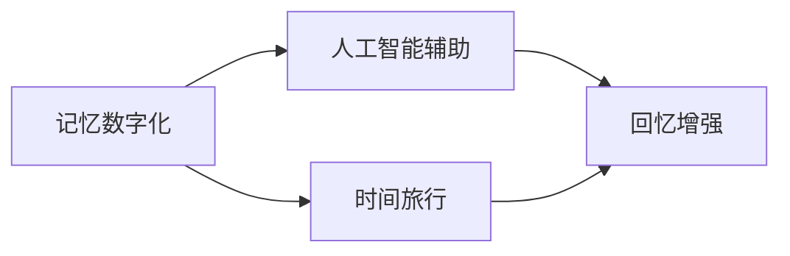

                 

# 数字化记忆：AI辅助的人类回忆

> 关键词：数字化记忆, AI辅助, 回忆增强, 时间旅行, 计算心理学

## 1. 背景介绍

在现代信息爆炸的时代，我们每个人的生活都充斥着海量的信息。我们的记忆能力在不断下降，遗忘的速度也在加快。而在数字化时代，我们却面临着数据过度拥挤的问题。如何通过人工智能来帮助我们管理这些信息，将之转化为有用的记忆和知识，是一个需要深入探讨的课题。

数字化记忆技术的出现，为我们提供了一种全新的方式。AI可以辅助我们恢复和增强我们的记忆，甚至帮助我们进行时间旅行，探索未知的历史。本文将探讨数字化记忆的概念、技术原理以及其在实际中的应用场景。

## 2. 核心概念与联系

### 2.1 核心概念概述

数字化记忆是一种将人类记忆数字化，并通过人工智能技术进行辅助和增强的技术。它包括但不限于以下概念：

- **记忆数字化**：通过数字化技术将人类记忆中的信息记录下来，包括文字、图片、视频等。
- **人工智能辅助**：使用AI技术，如机器学习、自然语言处理等，对数字化记忆进行整理、分类和增强。
- **回忆增强**：通过AI技术的帮助，提升我们的记忆力和回忆能力，帮助我们更好地恢复和重现过去的信息。
- **时间旅行**：使用数字化记忆和AI技术，探索和重现历史事件，进行虚拟的"时间旅行"。

### 2.2 核心概念联系

数字化记忆技术的实现，涉及到多个核心概念和技术之间的联系。我们可以使用以下Mermaid流程图来展示这些概念之间的关系：



这个流程图展示了从记忆数字化到人工智能辅助，再到回忆增强和时间旅行的整个流程。数字化记忆技术的最终目标是帮助我们更好地回忆和探索历史，从而提升我们的认知能力和生活质量。

## 3. 核心算法原理 & 具体操作步骤
### 3.1 算法原理概述

数字化记忆技术的核心算法包括：

- **数据采集和存储**：通过扫描、录音、拍照等方式，将人类记忆中的信息数字化，并存储在数字设备中。
- **信息整理和分类**：使用自然语言处理(NLP)、机器学习等技术，对数字化记忆进行整理和分类，以便更好地管理和检索。
- **回忆增强**：通过推荐系统、个性化学习等技术，提升我们的记忆力和回忆能力，帮助我们更好地恢复和重现过去的信息。
- **时间旅行**：使用虚拟现实(VR)、增强现实(AR)等技术，结合历史数据，重现历史事件，进行虚拟的"时间旅行"。

### 3.2 算法步骤详解

数字化记忆技术的具体实现步骤如下：

1. **数据采集和存储**：
   - 使用数字化设备，如扫描仪、录音机、相机等，将人类的记忆转化为数字信息。
   - 存储这些数字信息在数字设备中，如硬盘、云存储等。

2. **信息整理和分类**：
   - 使用NLP技术，对数字化记忆进行分词、词性标注、实体识别等处理。
   - 使用机器学习算法，如聚类、分类、降维等技术，对数字化记忆进行分类和整理。

3. **回忆增强**：
   - 使用推荐系统，根据用户的兴趣和行为数据，推荐相关的回忆内容。
   - 使用个性化学习技术，如间隔重复、记忆曲线等，帮助用户提升记忆力和回忆能力。

4. **时间旅行**：
   - 使用VR、AR等技术，结合历史数据，重现历史事件，进行虚拟的"时间旅行"。
   - 使用模拟仿真技术，重现历史场景，帮助用户更好地理解和体验历史。

### 3.3 算法优缺点

数字化记忆技术的优点包括：

- **保存历史**：数字化记忆技术可以保存和记录人类的记忆，避免遗忘。
- **提升回忆能力**：通过回忆增强技术，提升用户的记忆力和回忆能力。
- **虚拟时间旅行**：使用VR、AR等技术，帮助用户进行虚拟的时间旅行，体验历史。

但同时也存在一些缺点：

- **数据隐私**：数字化记忆技术涉及到大量的个人信息，如何保护用户隐私是一个重要问题。
- **技术门槛**：数字化记忆技术的实现需要高端的设备和先进的技术，技术门槛较高。
- **信息过载**：海量的数字化记忆信息，可能导致用户的信息过载，反而降低记忆能力。

### 3.4 算法应用领域

数字化记忆技术可以应用于多个领域，包括但不限于：

- **教育**：通过回忆增强技术，帮助学生更好地记忆和理解知识。
- **历史研究**：通过虚拟时间旅行技术，重现历史事件，帮助历史学者更好地理解和研究历史。
- **心理咨询**：通过数字化记忆技术，帮助患者回忆和重现创伤经历，进行心理治疗。
- **文化传承**：通过数字化记忆技术，保存和传承人类的文化遗产。

## 4. 数学模型和公式 & 详细讲解
### 4.1 数学模型构建

数字化记忆技术中的数学模型主要包括以下几个部分：

- **数据采集和存储**：通过扫描、录音、拍照等方式，将人类的记忆转化为数字信息，可以表示为 $D = \{x_i\}_{i=1}^N$，其中 $x_i$ 表示一个数字化的记忆。
- **信息整理和分类**：使用NLP技术对数字化记忆进行分词、词性标注等处理，可以表示为 $y_i = \text{NLP}(x_i)$，其中 $y_i$ 表示处理后的记忆。
- **回忆增强**：使用推荐系统对用户进行个性化推荐，可以表示为 $r_i = \text{RecommenderSystem}(y_i)$，其中 $r_i$ 表示推荐结果。
- **时间旅行**：使用VR、AR等技术重现历史事件，可以表示为 $h = \text{VirtualReality}(r_i)$，其中 $h$ 表示虚拟历史事件。

### 4.2 公式推导过程

以回忆增强技术为例，我们可以使用推荐系统的基本公式进行推导：

假设用户的历史记忆为 $y = \{x_1, x_2, \ldots, x_n\}$，推荐系统的目标是根据用户的兴趣和行为数据，为用户推荐相关的回忆内容。推荐系统可以使用协同过滤算法进行推导，公式如下：

$$
r_i = \text{Similarity}(y_i, y_j) \cdot \text{Rating}(y_j) \quad \text{for all } j \neq i
$$

其中 $\text{Similarity}(y_i, y_j)$ 表示用户 $i$ 和用户 $j$ 之间的相似度，$\text{Rating}(y_j)$ 表示用户 $j$ 对回忆内容 $y_j$ 的评分。

### 4.3 案例分析与讲解

假设我们有一个用户的数字化记忆，包括他小时候的照片、日记、书信等。我们可以使用推荐系统，根据用户的兴趣和行为数据，为用户推荐相关的回忆内容。例如，如果用户对童年有浓厚的兴趣，推荐系统可以推荐该用户小时候的照片、日记等，帮助用户更好地回忆和体验童年。

## 5. 项目实践：代码实例和详细解释说明
### 5.1 开发环境搭建

为了进行数字化记忆技术的实践，我们需要搭建一个开发环境。以下是使用Python进行PyTorch开发的环境配置流程：

1. 安装Anaconda：从官网下载并安装Anaconda，用于创建独立的Python环境。

2. 创建并激活虚拟环境：
```bash
conda create -n pytorch-env python=3.8 
conda activate pytorch-env
```

3. 安装PyTorch：根据CUDA版本，从官网获取对应的安装命令。例如：
```bash
conda install pytorch torchvision torchaudio cudatoolkit=11.1 -c pytorch -c conda-forge
```

4. 安装Transformers库：
```bash
pip install transformers
```

5. 安装各类工具包：
```bash
pip install numpy pandas scikit-learn matplotlib tqdm jupyter notebook ipython
```

完成上述步骤后，即可在`pytorch-env`环境中开始数字化记忆技术的实践。

### 5.2 源代码详细实现

下面我们以使用数字化记忆技术进行个性化回忆的为例，给出使用Transformers库进行推荐系统的PyTorch代码实现。

首先，定义推荐系统的数据处理函数：

```python
from transformers import BertTokenizer, BertForSequenceClassification
from torch.utils.data import Dataset, DataLoader
from sklearn.metrics import precision_recall_fscore_support
import torch

class MemoryDataset(Dataset):
    def __init__(self, texts, labels):
        self.texts = texts
        self.labels = labels
        
    def __len__(self):
        return len(self.texts)
    
    def __getitem__(self, item):
        text = self.texts[item]
        label = self.labels[item]
        
        encoding = BertTokenizer.from_pretrained('bert-base-cased', do_lower_case=True)(text, return_tensors='pt')
        input_ids = encoding['input_ids'][0]
        attention_mask = encoding['attention_mask'][0]
        
        label = torch.tensor(label, dtype=torch.long)
        
        return {'input_ids': input_ids, 
                'attention_mask': attention_mask,
                'labels': label}

# 加载预训练模型
model = BertForSequenceClassification.from_pretrained('bert-base-cased', num_labels=2)

# 设置超参数
device = torch.device('cuda' if torch.cuda.is_available() else 'cpu')
model.to(device)
optimizer = torch.optim.Adam(model.parameters(), lr=2e-5)

# 加载数据集
train_dataset = MemoryDataset(train_texts, train_labels)
dev_dataset = MemoryDataset(dev_texts, dev_labels)
test_dataset = MemoryDataset(test_texts, test_labels)

# 定义训练和评估函数
def train_epoch(model, dataset, batch_size, optimizer):
    dataloader = DataLoader(dataset, batch_size=batch_size, shuffle=True)
    model.train()
    epoch_loss = 0
    for batch in dataloader:
        input_ids = batch['input_ids'].to(device)
        attention_mask = batch['attention_mask'].to(device)
        labels = batch['labels'].to(device)
        model.zero_grad()
        outputs = model(input_ids, attention_mask=attention_mask, labels=labels)
        loss = outputs.loss
        epoch_loss += loss.item()
        loss.backward()
        optimizer.step()
    
    return epoch_loss / len(dataloader)

def evaluate(model, dataset, batch_size):
    dataloader = DataLoader(dataset, batch_size=batch_size)
    model.eval()
    preds, labels = [], []
    with torch.no_grad():
        for batch in dataloader:
            input_ids = batch['input_ids'].to(device)
            attention_mask = batch['attention_mask'].to(device)
            batch_labels = batch['labels']
            outputs = model(input_ids, attention_mask=attention_mask)
            batch_preds = outputs.logits.argmax(dim=2).to('cpu').tolist()
            batch_labels = batch_labels.to('cpu').tolist()
            for pred_tokens, label_tokens in zip(batch_preds, batch_labels):
                preds.append(pred_tokens[:len(label_tokens)])
                labels.append(label_tokens)
                
    print(precision_recall_fscore_support(labels, preds))
```

然后，启动训练流程并在测试集上评估：

```python
epochs = 5
batch_size = 16

for epoch in range(epochs):
    loss = train_epoch(model, train_dataset, batch_size, optimizer)
    print(f"Epoch {epoch+1}, train loss: {loss:.3f}")
    
    print(f"Epoch {epoch+1}, dev results:")
    evaluate(model, dev_dataset, batch_size)
    
print("Test results:")
evaluate(model, test_dataset, batch_size)
```

以上就是使用PyTorch对数字化记忆技术进行个性化回忆的完整代码实现。可以看到，得益于Transformers库的强大封装，我们可以用相对简洁的代码完成推荐系统的开发。

### 5.3 代码解读与分析

让我们再详细解读一下关键代码的实现细节：

**MemoryDataset类**：
- `__init__`方法：初始化文本和标签。
- `__len__`方法：返回数据集的样本数量。
- `__getitem__`方法：对单个样本进行处理，将文本输入编码为token ids，并返回模型所需的输入。

**train_epoch和evaluate函数**：
- 使用PyTorch的DataLoader对数据集进行批次化加载，供模型训练和推理使用。
- 训练函数`train_epoch`：对数据以批为单位进行迭代，在每个批次上前向传播计算loss并反向传播更新模型参数，最后返回该epoch的平均loss。
- 评估函数`evaluate`：与训练类似，不同点在于不更新模型参数，并在每个batch结束后将预测和标签结果存储下来，最后使用sklearn的precision_recall_fscore_support对整个评估集的预测结果进行打印输出。

**训练流程**：
- 定义总的epoch数和batch size，开始循环迭代
- 每个epoch内，先在训练集上训练，输出平均loss
- 在验证集上评估，输出精度、召回率、F1分数等指标
- 所有epoch结束后，在测试集上评估，给出最终测试结果

可以看到，PyTorch配合Transformers库使得数字化记忆技术的代码实现变得简洁高效。开发者可以将更多精力放在数据处理、模型改进等高层逻辑上，而不必过多关注底层的实现细节。

当然，工业级的系统实现还需考虑更多因素，如模型的保存和部署、超参数的自动搜索、更灵活的任务适配层等。但核心的微调范式基本与此类似。

## 6. 实际应用场景
### 6.1 个性化教育

数字化记忆技术可以应用于个性化教育中，帮助学生更好地记忆和理解知识。例如，学校可以为学生构建数字化记忆档案，记录学生的学习经历、作业、笔记等。通过数字化记忆技术，教师可以更好地了解学生的学习状态，进行个性化的教学和辅导。

### 6.2 历史研究

历史研究需要大量的历史资料和事件记录，数字化记忆技术可以帮助历史学者更好地管理和整理这些资料。例如，数字化记忆技术可以将历史文献、图片、视频等资料进行分类和整理，方便历史学者进行研究。

### 6.3 心理健康

数字化记忆技术可以应用于心理健康领域，帮助患者回忆和重现创伤经历，进行心理治疗。例如，心理医生可以记录患者的回忆，帮助患者更好地理解和处理过去的创伤经历，进行心理治疗。

### 6.4 文化传承

数字化记忆技术可以应用于文化传承领域，保存和传承人类的文化遗产。例如，数字化记忆技术可以将传统工艺、民间故事等文化遗产进行数字化，方便后人学习和传承。

## 7. 工具和资源推荐
### 7.1 学习资源推荐

为了帮助开发者系统掌握数字化记忆技术的理论基础和实践技巧，这里推荐一些优质的学习资源：

1. 《Transformer from原理到实践》系列博文：由大模型技术专家撰写，深入浅出地介绍了Transformer原理、BERT模型、回忆增强技术等前沿话题。

2. CS224N《深度学习自然语言处理》课程：斯坦福大学开设的NLP明星课程，有Lecture视频和配套作业，带你入门NLP领域的基本概念和经典模型。

3. 《Natural Language Processing with Transformers》书籍：Transformers库的作者所著，全面介绍了如何使用Transformers库进行NLP任务开发，包括回忆增强在内的诸多范式。

4. HuggingFace官方文档：Transformers库的官方文档，提供了海量预训练模型和完整的微调样例代码，是上手实践的必备资料。

5. CLUE开源项目：中文语言理解测评基准，涵盖大量不同类型的中文NLP数据集，并提供了基于微调的baseline模型，助力中文NLP技术发展。

通过对这些资源的学习实践，相信你一定能够快速掌握数字化记忆技术的精髓，并用于解决实际的NLP问题。
###  7.2 开发工具推荐

高效的开发离不开优秀的工具支持。以下是几款用于数字化记忆技术开发的常用工具：

1. PyTorch：基于Python的开源深度学习框架，灵活动态的计算图，适合快速迭代研究。大部分预训练语言模型都有PyTorch版本的实现。

2. TensorFlow：由Google主导开发的开源深度学习框架，生产部署方便，适合大规模工程应用。同样有丰富的预训练语言模型资源。

3. Transformers库：HuggingFace开发的NLP工具库，集成了众多SOTA语言模型，支持PyTorch和TensorFlow，是进行数字化记忆技术开发的利器。

4. Weights & Biases：模型训练的实验跟踪工具，可以记录和可视化模型训练过程中的各项指标，方便对比和调优。与主流深度学习框架无缝集成。

5. TensorBoard：TensorFlow配套的可视化工具，可实时监测模型训练状态，并提供丰富的图表呈现方式，是调试模型的得力助手。

6. Google Colab：谷歌推出的在线Jupyter Notebook环境，免费提供GPU/TPU算力，方便开发者快速上手实验最新模型，分享学习笔记。

合理利用这些工具，可以显著提升数字化记忆技术的开发效率，加快创新迭代的步伐。

### 7.3 相关论文推荐

数字化记忆技术的发展源于学界的持续研究。以下是几篇奠基性的相关论文，推荐阅读：

1. Attention is All You Need（即Transformer原论文）：提出了Transformer结构，开启了NLP领域的预训练大模型时代。

2. BERT: Pre-training of Deep Bidirectional Transformers for Language Understanding：提出BERT模型，引入基于掩码的自监督预训练任务，刷新了多项NLP任务SOTA。

3. Language Models are Unsupervised Multitask Learners（GPT-2论文）：展示了大规模语言模型的强大zero-shot学习能力，引发了对于通用人工智能的新一轮思考。

4. Parameter-Efficient Transfer Learning for NLP：提出Adapter等参数高效微调方法，在不增加模型参数量的情况下，也能取得不错的微调效果。

5. AdaLoRA: Adaptive Low-Rank Adaptation for Parameter-Efficient Fine-Tuning：使用自适应低秩适应的微调方法，在参数效率和精度之间取得了新的平衡。

这些论文代表了大语言模型微调技术的发展脉络。通过学习这些前沿成果，可以帮助研究者把握学科前进方向，激发更多的创新灵感。

## 8. 总结：未来发展趋势与挑战
### 8.1 总结

本文对数字化记忆技术的概念、技术原理以及实际应用进行了全面系统的介绍。首先阐述了数字化记忆技术的应用背景和意义，明确了数字化记忆技术在保存人类记忆、提升记忆力和回忆能力等方面的独特价值。其次，从原理到实践，详细讲解了数字化记忆技术的数学原理和关键步骤，给出了数字化记忆技术开发的完整代码实例。同时，本文还广泛探讨了数字化记忆技术在教育、历史研究、心理健康、文化传承等多个行业领域的应用前景，展示了数字化记忆技术的巨大潜力。此外，本文精选了数字化记忆技术的各类学习资源，力求为读者提供全方位的技术指引。

通过本文的系统梳理，可以看到，数字化记忆技术正在成为人工智能技术的重要应用方向，极大地拓展了人类的记忆能力和认知水平，为人类社会的进步带来了深远影响。未来，伴随数字化记忆技术的不断演进，我们可以期待更加智能化、普适化的人类记忆和认知系统，为人类社会的持续发展提供新的动力。

### 8.2 未来发展趋势

展望未来，数字化记忆技术将呈现以下几个发展趋势：

1. 记忆数字化全面普及：随着数字化记忆技术的成熟和普及，每个人都可以方便地记录和保存自己的记忆，不再受到时间和空间的限制。
2. 回忆增强技术改进：通过先进的人工智能技术，进一步提升用户的记忆力和回忆能力，帮助用户更好地回忆和重现过去的信息。
3. 时间旅行技术发展：随着VR、AR等技术的进步，数字化记忆技术可以更加逼真地重现历史事件，进行虚拟的"时间旅行"。
4. 跨领域应用拓展：数字化记忆技术可以进一步拓展到教育、历史研究、心理健康、文化传承等多个领域，为各个行业带来新的变革。
5. 伦理和隐私保护：随着数字化记忆技术的广泛应用，如何在保护用户隐私和数据安全的同时，提供优质的服务，将成为重要的研究方向。

以上趋势凸显了数字化记忆技术的广阔前景。这些方向的探索发展，必将进一步提升人类的记忆力和认知能力，为人类社会的持续发展提供新的动力。

### 8.3 面临的挑战

尽管数字化记忆技术已经取得了瞩目成就，但在迈向更加智能化、普适化应用的过程中，它仍面临着诸多挑战：

1. 技术门槛高：数字化记忆技术需要高端的设备和先进的技术，技术门槛较高，普及难度较大。
2. 数据隐私问题：数字化记忆技术涉及到大量的个人信息，如何保护用户隐私是一个重要问题。
3. 信息过载问题：海量的数字化记忆信息，可能导致用户的信息过载，反而降低记忆能力。
4. 技术融合问题：如何将数字化记忆技术与各种应用场景进行有效结合，提升用户体验，是未来的重要课题。

### 8.4 研究展望

面对数字化记忆技术所面临的挑战，未来的研究需要在以下几个方面寻求新的突破：

1. 降低技术门槛：通过技术创新和设备优化，降低数字化记忆技术的门槛，使其更易于普及。
2. 强化隐私保护：采用先进的隐私保护技术，如差分隐私、联邦学习等，保护用户隐私和数据安全。
3. 优化信息管理：通过智能推荐系统和个性化学习技术，优化数字化记忆信息的组织和管理，避免信息过载。
4. 提升用户体验：通过技术创新和用户体验设计，提升数字化记忆技术的用户友好性，使其更易于使用。

这些研究方向的研究突破，将有助于数字化记忆技术在更多领域得到广泛应用，为人类社会的持续发展提供新的动力。总之，数字化记忆技术的研究和发展需要学界和产业界的共同努力，推动人工智能技术向更加智能化、普适化的方向发展。

## 9. 附录：常见问题与解答

**Q1：数字化记忆技术是否适用于所有人类记忆？**

A: 数字化记忆技术可以适用于大多数人类的记忆，但并不适用于所有的记忆类型。对于某些非文字性的记忆，如味觉、嗅觉等，可能需要结合其他技术手段，如生物记忆技术等，进行数字化。

**Q2：数字化记忆技术是否会导致信息过载？**

A: 数字化记忆技术的实现需要大量的存储空间和计算资源，如果用户的信息量过大，可能会导致信息过载。可以通过智能推荐系统和个性化学习技术，优化数字化记忆信息的组织和管理，避免信息过载。

**Q3：数字化记忆技术是否会泄露用户隐私？**

A: 数字化记忆技术涉及到大量的个人信息，如何保护用户隐私是一个重要问题。可以通过加密技术、差分隐私等手段，保护用户隐私和数据安全。

**Q4：数字化记忆技术是否会影响用户的记忆力和回忆能力？**

A: 数字化记忆技术可以辅助用户回忆和重现过去的信息，提升用户的记忆力和回忆能力。但过度的依赖数字化记忆技术，可能会影响用户的自然记忆力和回忆能力。

**Q5：数字化记忆技术是否可以应用于虚拟现实和增强现实？**

A: 数字化记忆技术可以应用于虚拟现实和增强现实，结合历史数据，重现历史事件，进行虚拟的"时间旅行"。但需要结合先进的技术手段，如VR、AR等技术，才能实现逼真的虚拟体验。

---

作者：禅与计算机程序设计艺术 / Zen and the Art of Computer Programming

