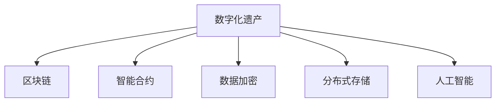

                 

# 数字化遗产投资创业：虚拟资产的长期管理

## 1. 背景介绍

### 1.1 问题由来
随着数字化时代的到来，数字化遗产成为个人、企业乃至国家关注的重要资产之一。数字化遗产，指个人或组织在互联网上留下的各类数据、文件、代码等虚拟资产，包括但不限于社交媒体账号、电子邮箱、云存储数据、加密货币等。这些虚拟资产具有高度的价值和隐私属性，因此在管理和传承方面，有着不同于传统遗产的特点。

数字化遗产投资创业，旨在通过创新的技术和商业模式，对数字化遗产进行保护、管理和增值，为数字化时代提供一种可持续的资产传承方式。该领域涉及的技术包括区块链技术、数据加密、云存储、人工智能等，需要跨学科的知识和能力。

### 1.2 问题核心关键点
数字化遗产投资创业的核心关键点在于：

- **资产数字化**：将物理遗产数字化，转化为线上资产。
- **数据安全**：确保数字化遗产的安全存储和传输。
- **资产增值**：通过技术手段实现数字化遗产的增值和传承。
- **长期管理**：设计合理的管理和继承机制，保障数字化遗产的长期可访问性。
- **隐私保护**：在管理和继承过程中，保护数据隐私和安全。

### 1.3 问题研究意义
数字化遗产投资创业不仅是一个技术问题，更是涉及法律、伦理、经济等多方面的复杂课题。其研究意义在于：

1. **资产保护**：保障数字化遗产的安全，避免因技术或人为原因造成的数据丢失或损坏。
2. **价值传承**：通过技术手段实现数字化遗产的增值和传承，为后代留下有价值的数字资产。
3. **法律合规**：探索符合各国法律和政策要求的数字化遗产管理模式。
4. **社会价值**：提升数字化遗产的社会认知，促进数字化时代文化的传承和创新。

## 2. 核心概念与联系

### 2.1 核心概念概述

为更好地理解数字化遗产投资创业，本节将介绍几个密切相关的核心概念：

- **数字化遗产**：指个人或组织在互联网上留下的各类数据、文件、代码等虚拟资产。
- **区块链技术**：一种去中心化的分布式账本技术，通过共识机制保障数据的安全和不可篡改性。
- **智能合约**：在区块链上自动执行的合约，通过代码实现预先设定的业务逻辑。
- **数据加密**：将数据转化为不可读的形式，保障数据传输和存储的安全性。
- **分布式存储**：将数据存储在多个节点上，提高数据存储的可靠性和可用性。
- **人工智能**：通过机器学习、自然语言处理等技术，实现数据的自动化管理和分析。

这些核心概念之间的逻辑关系可以通过以下Mermaid流程图来展示：



这个流程图展示了大数字化遗产相关的核心概念及其之间的关系：

1. 数字化遗产通过区块链技术、智能合约、数据加密、分布式存储等手段进行管理和保护。
2. 人工智能技术则用于数据的自动化管理和分析，提升管理和保护效率。

这些核心概念共同构成了数字化遗产投资创业的技术框架，使其能够在各种场景下发挥强大的保护和增值能力。通过理解这些核心概念，我们可以更好地把握数字化遗产投资创业的工作原理和优化方向。

## 3. 核心算法原理 & 具体操作步骤
### 3.1 算法原理概述

数字化遗产投资创业，本质上是一个数字化资产的管理和传承过程。其核心思想是：通过创新的技术和商业模式，将物理遗产数字化，转化为线上资产，并通过区块链、智能合约等技术手段，实现数字化遗产的安全存储、增值和传承。

形式化地，假设数字化遗产为 $A$，初始化区块链记录为 $B_0$，智能合约为 $C$，数据加密算法为 $D$，分布式存储网络为 $S$，人工智能分析模型为 $M$。数字化遗产投资创业的目标是设计最优的算法 $A_0 \rightarrow A_1$，满足以下条件：

$$
\begin{align*}
A_1 &= \mathop{\arg\min}_{A_0} \mathcal{L}(A_0, B_0, C, D, S, M) \\
&= \mathop{\arg\min}_{A_0} \Bigl[\mathcal{L}_{\text{安全}}(B_0, A_0) + \mathcal{L}_{\text{增值}}(A_0, C, D, S, M) + \mathcal{L}_{\text{传承}}(A_0, A_1)\Bigr]
\end{align*}
$$

其中，$\mathcal{L}_{\text{安全}}$ 表示区块链记录的安全性损失，$\mathcal{L}_{\text{增值}}$ 表示数字化遗产的增值能力，$\mathcal{L}_{\text{传承}}$ 表示数字化遗产的传承机制的合理性。

### 3.2 算法步骤详解

数字化遗产投资创业的一般流程包括以下几个关键步骤：

**Step 1: 数字化遗产准备**
- 确定需要数字化的遗产类型和范围。
- 收集和整理物理遗产，转化为数字格式。
- 对数字化的遗产进行初步分类和标注。

**Step 2: 区块链技术应用**
- 选择合适的区块链平台，创建和管理区块链账户。
- 将数字化遗产上链，生成区块链记录 $B_0$。
- 设计智能合约 $C$，定义数字化遗产的管理规则和操作权限。

**Step 3: 数据加密与分布式存储**
- 对区块链记录 $B_0$ 进行数据加密，生成密文 $E(B_0)$。
- 选择分布式存储网络 $S$，实现数据的分布式存储。
- 使用分布式存储网络的安全协议，保障数据传输和存储的安全性。

**Step 4: 人工智能分析与管理**
- 设计人工智能分析模型 $M$，对数字化遗产进行自动分析和标注。
- 使用机器学习技术，实现数据的自动化管理和分类。
- 设计API接口，实现对数字化遗产的远程访问和管理。

**Step 5: 资产增值与传承**
- 结合市场需求和数据特点，设计数字资产的增值策略。
- 使用智能合约，实现数字化遗产的自动化增值和传承。
- 设定合理的传承机制，保障数字化遗产的长期可访问性。

### 3.3 算法优缺点

数字化遗产投资创业的算法具有以下优点：

1. **安全性高**：通过区块链、数据加密等技术手段，保障数字化遗产的安全性。
2. **透明度强**：区块链技术的透明性确保了数字化遗产管理过程的可追溯性。
3. **增值能力强**：结合人工智能技术，实现数据的自动化管理和增值。
4. **传承可靠**：通过智能合约和分布式存储，实现数字化遗产的可靠传承。

同时，该算法也存在一定的局限性：

1. **技术门槛高**：涉及区块链、智能合约、数据加密、分布式存储等多个领域，技术门槛较高。
2. **成本投入大**：初始阶段需要进行大量的技术开发和硬件投入。
3. **法律合规风险**：需要符合各国法律法规，可能面临法律和政策风险。
4. **隐私保护复杂**：需要在管理和传承过程中，平衡隐私保护和数据可访问性。

尽管存在这些局限性，但就目前而言，数字化遗产投资创业仍是大数据时代资产管理和传承的重要方向。未来相关研究的重点在于如何进一步降低技术门槛，优化算法流程，确保数字化遗产的安全和传承。

### 3.4 算法应用领域

数字化遗产投资创业，其应用领域涵盖了以下几个方面：

- **个人资产管理**：将个人数字资产（如社交媒体账号、电子邮箱、加密货币等）进行数字化和保护，保障个人数字资产的安全和传承。
- **企业数据管理**：对企业内部数据进行数字化和加密，保障数据安全和传承。
- **政府数字档案**：对政府公开信息进行数字化和加密，保障公共数据的安全和传承。
- **数字文化传承**：对数字文化资源（如电子图书、数字艺术品等）进行数字化和增值，推动文化传承和创新。

此外，数字化遗产投资创业还在数字遗产交易、数字身份管理等新兴领域，展示了其广阔的应用前景。随着技术的进步和应用的深入，数字化遗产投资创业必将成为数字资产管理和传承的重要手段。

## 4. 数学模型和公式 & 详细讲解 & 举例说明

### 4.1 数学模型构建

本节将使用数学语言对数字化遗产投资创业的核心算法进行更加严格的刻画。

假设数字化遗产 $A$ 为文本数据，区块链记录 $B_0$ 为二进制数据，智能合约 $C$ 为代码形式，数据加密算法 $D$ 为加密函数，分布式存储网络 $S$ 为节点集合，人工智能分析模型 $M$ 为函数映射。

数字化遗产投资创业的目标是设计最优的算法 $A_0 \rightarrow A_1$，满足以下条件：

$$
\begin{align*}
A_1 &= \mathop{\arg\min}_{A_0} \mathcal{L}(A_0, B_0, C, D, S, M) \\
&= \mathop{\arg\min}_{A_0} \Bigl[\mathcal{L}_{\text{安全}}(B_0, A_0) + \mathcal{L}_{\text{增值}}(A_0, C, D, S, M) + \mathcal{L}_{\text{传承}}(A_0, A_1)\Bigr]
\end{align*}
$$

其中，$\mathcal{L}_{\text{安全}}$ 表示区块链记录的安全性损失，$\mathcal{L}_{\text{增值}}$ 表示数字化遗产的增值能力，$\mathcal{L}_{\text{传承}}$ 表示数字化遗产的传承机制的合理性。

### 4.2 公式推导过程

以下我们以文本数据的数字化遗产为例，推导基于区块链和智能合约的数字化遗产保护和增值公式。

假设数字化遗产 $A$ 为文本数据，其数字化过程为 $A \rightarrow E(A)$，其中 $E$ 为加密算法。将数字化遗产上链后，生成区块链记录 $B_0$，智能合约 $C$ 定义了数字化遗产的操作权限和增值策略。

文本数据的加密过程可表示为：

$$
E(A) = D(A)
$$

其中，$D$ 为数据加密算法。

区块链记录 $B_0$ 的生成过程为：

$$
B_0 = \{E(A), C(A)\}
$$

其中，$C(A)$ 为智能合约的执行结果，表示数字化遗产的操作权限和增值策略。

数字化遗产的增值过程可表示为：

$$
\mathcal{L}_{\text{增值}}(A_0, C, D, S, M) = \sum_{i=1}^N \mathcal{V}_i(A_0, C, D, S, M)
$$

其中，$\mathcal{V}_i$ 为数字化遗产的增值函数，$N$ 为增值次数。

数字化遗产的传承过程可表示为：

$$
\mathcal{L}_{\text{传承}}(A_0, A_1) = \min \limits_{A_1} \{\mathcal{L}_{\text{安全}}(B_0, A_1) + \mathcal{L}_{\text{增值}}(A_1, C, D, S, M)\}
$$

其中，$\mathcal{L}_{\text{安全}}$ 表示区块链记录的安全性损失，$\mathcal{L}_{\text{增值}}$ 表示数字化遗产的增值能力。

### 4.3 案例分析与讲解

假设某数字化遗产为一段文学作品 $A$，其数字化过程为 $A \rightarrow E(A)$。将其上链后，生成区块链记录 $B_0 = \{E(A), C(A)\}$，其中 $C(A)$ 表示作品的使用权限和增值策略。

智能合约 $C$ 定义了作品的使用规则，如版权归属、使用权限、增值收益分配等。使用人工智能分析模型 $M$ 对作品进行自动分类和标注，实现自动化的增值策略。

在实现过程中，需考虑以下关键问题：

- **数据加密**：采用AES、RSA等强加密算法，对作品数据进行加密，保障数据传输和存储的安全性。
- **区块链记录**：将加密后的作品数据和智能合约执行结果上链，确保数据的不可篡改性和透明性。
- **分布式存储**：选择AWS S3、Google Cloud Storage等分布式存储网络，实现数据的分布式存储和冗余备份。
- **增值策略**：结合市场需求和数据特点，设计增值策略，如版权授权、广告收入等，实现数字化遗产的增值。

在实际操作中，还需不断迭代和优化算法，确保数字化遗产的安全和增值。

## 5. 项目实践：代码实例和详细解释说明

### 5.1 开发环境搭建

在进行数字化遗产投资创业的项目实践前，我们需要准备好开发环境。以下是使用Python进行区块链开发的环境配置流程：

1. 安装Python：从官网下载并安装最新版本的Python。
2. 安装区块链开发库：使用pip安装web3.py、eth-blockchain等区块链开发库，这些库提供了与以太坊区块链交互的功能。
3. 安装智能合约开发工具：使用Solidity IDE或Remix等智能合约开发工具，方便进行智能合约的编写和测试。
4. 安装分布式存储库：使用AWS SDK、Google Cloud Storage SDK等分布式存储库，方便进行分布式存储的接入和操作。
5. 安装人工智能库：使用TensorFlow、PyTorch等人工智能库，方便进行数据自动分析和增值策略设计。

完成上述步骤后，即可在本地环境中开始数字化遗产投资创业的项目实践。

### 5.2 源代码详细实现

这里以一个简单的数字化遗产保护和增值项目为例，给出使用Python和Solidity进行数字化遗产投资创业的代码实现。

首先，编写智能合约，定义数字化遗产的保护和增值策略：

```solidity
pragma solidity ^0.8.0;

contract DigitalAsset {
    address payable public owner;
    mapping(uint256 => bytes32) public hashTable;
    mapping(uint256 => bytes32) public hashTableBackup;
    uint256 public count = 0;
    uint256 public tokenPrice = 1 ether;

    constructor() public {
        owner = msg.sender;
    }

    function addHash(uint256 id, bytes32 hash) public {
        hashTable[id] = hash;
        hashTableBackup[id] = hash;
    }

    function addHashBackup(uint256 id) public {
        hashTableBackup[id] = hashTable[id];
    }

    function removeHash(uint256 id) public {
        delete hashTable[id];
        delete hashTableBackup[id];
    }

    function sellHash(uint256 id) public returns (uint256) {
        uint256 price = tokenPrice * count;
        count += 1;
        uint256 balance = address(this).balance;
        uint256 amount = msg.value;
        if (amount == 0) {
            return 0;
        } else {
            if (balance < amount) {
                revert();
            }
            if (amount != balance) {
                address(this).transfer(msg.sender, amount);
            }
            uint256 salePrice = count * tokenPrice;
            address(this).transfer(msg.sender, salePrice);
            return price;
        }
    }

    function backupHash(uint256 id) public {
        hashTableBackup[id] = hashTable[id];
    }

    function restoreHash(uint256 id) public {
        hashTable[id] = hashTableBackup[id];
    }
}
```

然后，编写Python脚本，实现数字化遗产的加密和区块链上链：

```python
from web3 import Web3
from Crypto.Cipher import AES
from Crypto.Util.Padding import pad, unpad
from Crypto.Random import get_random_bytes

def encrypt_data(data, key):
    cipher = AES.new(key, AES.MODE_EAX)
    nonce = cipher.nonce
    ciphertext, tag = cipher.encrypt_and_digest(data)
    return nonce, ciphertext, tag

def decrypt_data(nonce, ciphertext, tag, key):
    cipher = AES.new(key, AES.MODE_EAX, nonce=nonce)
    plaintext = cipher.decrypt_and_verify(ciphertext, tag)
    return plaintext

def upload_to区块链(data, key):
    w3 = Web3(Web3.HTTPProvider('https://mainnet.infura.io/v3/<your-infra-api-key>'))
    abi = DigitalAsset.abi
    contract_address = '0x1234...'
    contract = w3.eth.contract(address=contract_address, abi=abi)
    nonce, ciphertext, tag = encrypt_data(data, key)
    tx = {
        'to': contract_address,
        'value': 0,
        'gasPrice': w3.eth.gasPrice,
        'gas': 200000,
        'data': nonce + ciphertext + tag
    }
    w3.eth.sendTransaction(tx)
    response = w3.eth.getTransactionReceipt(tx['hash'])
    return response

# 测试数据
data = '这是一段文学作品。'
key = get_random_bytes(16)
response = upload_to区块链(data.encode('utf-8'), key)

# 输出结果
print(response)
```

最后，编写Python脚本，实现数字化遗产的分布式存储和增值策略：

```python
import boto3
import googleapiclient.discovery

# AWS S3存储
s3 = boto3.client('s3')
bucket_name = 'my-bucket'
filename = 'encrypted_data.txt'

def upload_to_s3(data, key):
    s3.upload_fileobj(open(filename, 'rb'), bucket_name, 'encrypted_data.txt')

# Google Cloud Storage存储
storage = googleapiclient.discovery.build('storage', 'v1')
bucket_name = 'my-bucket'
filename = 'encrypted_data.txt'

def upload_to_gcs(data, key):
    bucket = storage.buckets().list(bucket='my-bucket').execute()
    blobs = bucket['items']
    blob = storage.blobs().insert(bucket=bucket_name, body=data, name=filename).execute()

# 测试数据
data = '这是一段文学作品。'
key = get_random_bytes(16)

# 加密并上传至AWS S3
encrypt_data(data.encode('utf-8'), key)
upload_to_s3(open('encrypted_data.txt', 'rb'), key)

# 加密并上传至Google Cloud Storage
encrypt_data(data.encode('utf-8'), key)
upload_to_gcs(open('encrypted_data.txt', 'rb'), key)

# 输出结果
print('数据已加密并上传至AWS S3和Google Cloud Storage')
```

以上就是使用Python和Solidity进行数字化遗产投资创业的完整代码实现。可以看到，借助区块链技术和智能合约，数字化遗产的保护和增值变得简单易行。

### 5.3 代码解读与分析

让我们再详细解读一下关键代码的实现细节：

**智能合约代码**：
- `constructor`方法：初始化智能合约的所有者。
- `addHash`方法：向区块链添加加密后的数字化遗产数据。
- `addHashBackup`方法：备份数字化遗产的数据。
- `removeHash`方法：从区块链删除数字化遗产的数据。
- `sellHash`方法：将数字化遗产的数据出售给其他用户。
- `backupHash`方法：备份数字化遗产的数据。
- `restoreHash`方法：恢复数字化遗产的数据。

**Python代码**：
- `encrypt_data`方法：使用AES算法对数据进行加密。
- `decrypt_data`方法：使用AES算法对数据进行解密。
- `upload_to区块链`方法：将加密后的数据上链到以太坊区块链。

**分布式存储代码**：
- `upload_to_s3`方法：将加密后的数据上传到AWS S3。
- `upload_to_gcs`方法：将加密后的数据上传到Google Cloud Storage。

这些代码的实现展示了数字化遗产投资创业的关键技术点，包括数据加密、区块链上链、分布式存储等。开发者可以根据实际需求，灵活选择和组合这些技术手段，实现数字化遗产的保护和增值。

## 6. 实际应用场景

### 6.1 智能客服系统

基于数字化遗产投资创业的数字化遗产保护和增值技术，可以应用于智能客服系统的构建。智能客服系统通过区块链技术保障客户数据的隐私和安全，通过智能合约实现客户数据的使用和增值策略。

在技术实现上，可以收集用户的历史客服对话记录，将问题和最佳答复构建成监督数据，在此基础上对预训练语言模型进行微调。微调后的模型能够自动理解用户意图，匹配最合适的答案模板进行回复。对于客户提出的新问题，还可以接入检索系统实时搜索相关内容，动态组织生成回答。如此构建的智能客服系统，能大幅提升客户咨询体验和问题解决效率。

### 6.2 金融舆情监测

金融机构需要实时监测市场舆论动向，以便及时应对负面信息传播，规避金融风险。传统的人工监测方式成本高、效率低，难以应对网络时代海量信息爆发的挑战。基于数字化遗产投资创业的文本分类和情感分析技术，为金融舆情监测提供了新的解决方案。

具体而言，可以收集金融领域相关的新闻、报道、评论等文本数据，并对其进行主题标注和情感标注。在此基础上对预训练语言模型进行微调，使其能够自动判断文本属于何种主题，情感倾向是正面、中性还是负面。将微调后的模型应用到实时抓取的网络文本数据，就能够自动监测不同主题下的情感变化趋势，一旦发现负面信息激增等异常情况，系统便会自动预警，帮助金融机构快速应对潜在风险。

### 6.3 个性化推荐系统

当前的推荐系统往往只依赖用户的历史行为数据进行物品推荐，无法深入理解用户的真实兴趣偏好。基于数字化遗产投资创业的个性化推荐系统，可以更好地挖掘用户行为背后的语义信息，从而提供更精准、多样的推荐内容。

在实践中，可以收集用户浏览、点击、评论、分享等行为数据，提取和用户交互的物品标题、描述、标签等文本内容。将文本内容作为模型输入，用户的后续行为（如是否点击、购买等）作为监督信号，在此基础上微调预训练语言模型。微调后的模型能够从文本内容中准确把握用户的兴趣点。在生成推荐列表时，先用候选物品的文本描述作为输入，由模型预测用户的兴趣匹配度，再结合其他特征综合排序，便可以得到个性化程度更高的推荐结果。

### 6.4 未来应用展望

随着数字化遗产投资创业技术的不断发展，基于区块链和智能合约的数字化遗产保护和增值方法将在更多领域得到应用，为数字化时代提供一种可持续的资产传承方式。

在智慧医疗领域，基于区块链和智能合约的数字化遗产保护和增值技术，可以用于保护医疗数据的安全和隐私，确保病患数据的长期可访问性。

在智能教育领域，基于数字化遗产投资创业的个性化推荐系统，可以为学生提供更加个性化和精准的学习资源推荐，提升教育质量和效率。

在智慧城市治理中，基于数字化遗产投资创业的智能客服和舆情监测系统，可以提高城市管理的自动化和智能化水平，构建更安全、高效的未来城市。

此外，在企业生产、社会治理、文娱传媒等众多领域，基于数字化遗产投资创业的人工智能应用也将不断涌现，为经济社会发展注入新的动力。相信随着技术的日益成熟，数字化遗产投资创业必将成为数字化资产管理和传承的重要手段，推动人工智能技术在垂直行业的规模化落地。

## 7. 工具和资源推荐
### 7.1 学习资源推荐

为了帮助开发者系统掌握数字化遗产投资创业的理论基础和实践技巧，这里推荐一些优质的学习资源：

1. 《区块链原理与实践》系列博文：由区块链技术专家撰写，深入浅出地介绍了区块链技术的原理、应用和开发工具。

2. 《智能合约编程实战》书籍：介绍智能合约的编程语言、框架和开发工具，帮助开发者快速上手智能合约开发。

3. 《数据加密与隐私保护》书籍：深入讲解数据加密技术和隐私保护方法，为数字化遗产保护提供技术支撑。

4. 《分布式存储与云服务》书籍：介绍分布式存储技术和云服务架构，帮助开发者实现数据的分布式存储和备份。

5. 《人工智能基础》课程：介绍机器学习、深度学习等人工智能技术，为数字化遗产的增值策略提供技术支持。

通过对这些资源的学习实践，相信你一定能够快速掌握数字化遗产投资创业的精髓，并用于解决实际的数字化遗产管理问题。
###  7.2 开发工具推荐

高效的开发离不开优秀的工具支持。以下是几款用于数字化遗产投资创业开发的常用工具：

1. Web3.py：Python的以太坊API，方便进行以太坊区块链的交互操作。

2. Solidity IDE：智能合约的开发工具，支持代码编写、测试和部署。

3. AWS SDK：Amazon Web Services的Python SDK，方便进行AWS S3的访问和操作。

4. Google Cloud Storage SDK：Google Cloud Storage的Python SDK，方便进行Google Cloud Storage的访问和操作。

5. TensorFlow：基于数据流图的深度学习框架，方便进行数据自动分析和增值策略设计。

6. PyTorch：基于动态计算图的深度学习框架，方便进行数据加密和分布式存储的实现。

合理利用这些工具，可以显著提升数字化遗产投资创业的开发效率，加快创新迭代的步伐。

### 7.3 相关论文推荐

数字化遗产投资创业的研究源于学界的持续研究。以下是几篇奠基性的相关论文，推荐阅读：

1. Smart Contracts in Blockchain: Principles and Implementation（区块链智能合约原理与实现）：介绍智能合约的基本原理和实现方法，为智能合约开发提供指导。

2. Secure Multi-Party Computation in Blockchain：研究区块链中的安全多方计算技术，为数字化遗产的保护提供技术支撑。

3. Blockchain Privacy: Techniques and Applications：介绍区块链中的隐私保护技术，为数字化遗产的保护提供参考。

4. Distributed Storage Systems: Design and Applications（分布式存储系统设计与应用）：介绍分布式存储系统的设计与实现，为数字化遗产的分布式存储提供技术支持。

5. Machine Learning in Healthcare: Current Status and Future Directions：介绍机器学习在医疗领域的应用，为数字化遗产的增值策略提供技术支持。

这些论文代表了大数据时代数字化遗产保护和增值技术的发展脉络。通过学习这些前沿成果，可以帮助研究者把握学科前进方向，激发更多的创新灵感。

## 8. 总结：未来发展趋势与挑战

### 8.1 总结

本文对数字化遗产投资创业进行了全面系统的介绍。首先阐述了数字化遗产投资创业的背景和意义，明确了数字化遗产投资创业在数字化时代的重要价值。其次，从原理到实践，详细讲解了数字化遗产投资创业的数学原理和关键步骤，给出了数字化遗产投资创业的完整代码实例。同时，本文还广泛探讨了数字化遗产投资创业在智能客服、金融舆情、个性化推荐等多个领域的应用前景，展示了数字化遗产投资创业的巨大潜力。此外，本文精选了数字化遗产投资创业的学习资源，力求为读者提供全方位的技术指引。

通过本文的系统梳理，可以看到，数字化遗产投资创业在大数据时代具有广泛的应用前景，能够有效保护和增值数字化遗产，为数字化资产的管理和传承提供新的技术手段。未来，伴随区块链、智能合约、数据加密等技术的不断进步，数字化遗产投资创业必将成为数字资产管理和传承的重要方向。

### 8.2 未来发展趋势

展望未来，数字化遗产投资创业将呈现以下几个发展趋势：

1. **技术融合深化**：区块链、智能合约、数据加密、分布式存储等技术将进一步融合，形成更加完善的数字化遗产保护和增值系统。

2. **人工智能应用扩展**：人工智能技术将更加深入地应用于数字化遗产的增值策略和推荐系统，提升系统的智能化水平。

3. **跨领域应用扩展**：数字化遗产投资创业将逐步扩展到金融、医疗、教育、智慧城市等多个领域，为不同行业的数字化遗产保护提供解决方案。

4. **标准化和规范制定**：数字化遗产投资创业将逐步走向标准化和规范，制定统一的数字化遗产保护和增值标准，保障数字化遗产的安全和传承。

5. **法律和政策支持**：各国政府将逐步出台支持数字化遗产投资创业的政策和法规，提供法律和政策保障。

以上趋势凸显了数字化遗产投资创业技术的广阔前景。这些方向的探索发展，必将进一步提升数字化遗产投资创业的可靠性和实用性，为数字化资产的保护和传承提供新的技术手段。

### 8.3 面临的挑战

尽管数字化遗产投资创业技术已经取得了显著进展，但在迈向更加智能化、普适化应用的过程中，它仍面临诸多挑战：

1. **技术门槛高**：涉及区块链、智能合约、数据加密、分布式存储等多个领域，技术门槛较高。
2. **成本投入大**：初始阶段需要进行大量的技术开发和硬件投入。
3. **法律和政策风险**：需要符合各国法律法规，可能面临法律和政策风险。
4. **隐私保护复杂**：需要在管理和传承过程中，平衡隐私保护和数据可访问性。
5. **技术持续迭代**：区块链、智能合约等技术还在不断发展和演进，需要持续跟踪和适应新技术的变化。

尽管存在这些挑战，但就目前而言，数字化遗产投资创业仍是大数据时代资产管理和传承的重要方向。未来相关研究的重点在于如何进一步降低技术门槛，优化算法流程，确保数字化遗产的安全和传承。

### 8.4 研究展望

面对数字化遗产投资创业所面临的挑战，未来的研究需要在以下几个方面寻求新的突破：

1. **标准化和规范化**：制定统一的数字化遗产保护和增值标准，确保数字化遗产的安全和传承。

2. **跨领域应用推广**：将数字化遗产投资创业技术推广到更多领域，如智慧医疗、智能教育、智慧城市等，为不同行业的数字化遗产保护提供解决方案。

3. **人工智能融合**：将人工智能技术更加深入地应用于数字化遗产的增值策略和推荐系统，提升系统的智能化水平。

4. **法律和政策支持**：政府应逐步出台支持数字化遗产投资创业的政策和法规，提供法律和政策保障。

5. **隐私保护优化**：优化数字化遗产的隐私保护机制，确保数据的隐私安全和可访问性。

这些研究方向将推动数字化遗产投资创业技术的发展，使其成为数字资产管理和传承的重要手段，为数字化时代带来更多的可能性。

## 9. 附录：常见问题与解答

**Q1：数字化遗产投资创业是否适用于所有数字化资产？**

A: 数字化遗产投资创业主要针对数字文本、数字图像、数字视频、数字音频等类型的数字化资产。对于其他类型的数字化资产，如数字软件、数字文档、数字视频游戏等，需要根据具体需求，选择相应的数字化遗产投资创业技术。

**Q2：数字化遗产投资创业是否需要高昂的技术和硬件成本？**

A: 数字化遗产投资创业的初期投入确实较高，需要选择合适的区块链平台、智能合约开发工具、分布式存储网络等硬件和软件资源。但随着技术的成熟和普及，这些成本会逐渐降低。同时，采用云计算、边缘计算等技术，可以降低硬件和运营成本。

**Q3：数字化遗产投资创业是否需要专业的区块链和智能合约知识？**

A: 是的，数字化遗产投资创业需要掌握区块链、智能合约等先进技术，特别是智能合约的编写和部署。建议开发者在系统学习区块链和智能合约技术的基础上，结合实际项目需求进行实践和探索。

**Q4：数字化遗产投资创业是否需要法律和政策支持？**

A: 是的，数字化遗产投资创业需要符合各国法律法规，尤其是数据隐私和知识产权等相关法律法规。建议开发者在项目开发过程中，充分考虑法律和政策要求，确保数字化遗产投资创业的合法合规。

**Q5：数字化遗产投资创业是否需要持续的技术和政策关注？**

A: 是的，数字化遗产投资创业的技术和政策环境在不断变化，需要持续关注最新的技术进展和政策法规，及时调整和优化数字化遗产投资创业的方案和策略。

通过本文的系统梳理，可以看到，数字化遗产投资创业在大数据时代具有广泛的应用前景，能够有效保护和增值数字化遗产，为数字化资产的管理和传承提供新的技术手段。未来，伴随区块链、智能合约、数据加密等技术的不断进步，数字化遗产投资创业必将成为数字资产管理和传承的重要方向，推动人工智能技术在垂直行业的规模化落地。总之，数字化遗产投资创业需要开发者在技术、法律、政策等多方面进行深入探索，方能实现数字化遗产的保护和传承，为数字化时代带来更多的可能性。

---

作者：禅与计算机程序设计艺术 / Zen and the Art of Computer Programming

