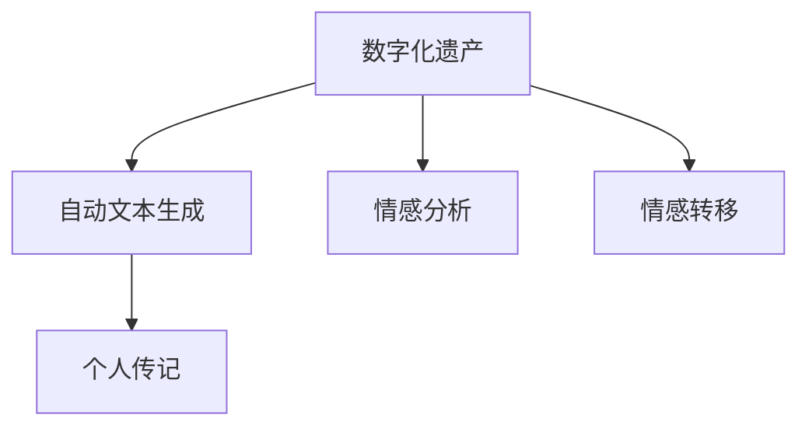

                 

# 数字化遗产故事讲述创业：AI驱动的个人传记创作

> 关键词：数字化遗产,故事讲述,人工智能,个人传记,自动文本生成,情感分析,情感转移

## 1. 背景介绍

### 1.1 问题由来
数字化时代，个人数据的积累和保存变得越来越重要。尤其是家庭成员、亲人、朋友间的亲密联系和情感记忆，往往散落在各个数字设备、社交媒体和个人邮箱中。但这些信息往往零散、碎片化，无法形成系统的数字化遗产。因此，一种能够系统化、自动化的数字化遗产整理方式变得尤为必要。

传统上，数字化遗产整理往往依赖于人力，耗费大量时间和精力。而随着AI技术的快速进展，使用机器学习和大数据技术自动整理数字化遗产成为可能。特别是通过AI驱动的个人传记创作，将人们的数字化记忆和情感回忆转化为个性化的文字作品，能够更好地保存和传承家族情感和文化。

### 1.2 问题核心关键点
本文聚焦于如何利用AI技术，自动生成包含情感和记忆的个人传记，以及实现这一过程的技术方法和实际应用。具体包括：
1. 收集数字化遗产数据：包括家庭照片、社交媒体动态、信件、日记、邮件等。
2. 自动文本生成：使用语言模型将分散的数字化遗产转化为连贯的文本作品。
3. 情感分析：识别文本中的情感，增强传记的情感深度。
4. 情感转移：根据接收者情感，调整传记文本的情感表达，以匹配接收者的感受。
5. 个人传记创作：将文本生成、情感分析和情感转移技术相结合，生成具有个性化和情感共鸣的个人传记。

## 2. 核心概念与联系

### 2.1 核心概念概述

为更好地理解AI驱动的个人传记创作，本节将介绍几个关键概念：

- **数字化遗产**：指通过数字设备存储、交流的信息，如照片、信件、社交媒体记录等，反映了人们的日常生活、情感交流和经历记忆。
- **故事讲述**：通过文字、图像、音频等方式，讲述个人故事、经历、情感和记忆，是个人传记的主要形式。
- **人工智能**：通过机器学习、深度学习等技术，模拟人类智能处理信息，自动完成情感分析、文本生成等任务。
- **自动文本生成**：使用语言模型，自动从给定输入生成文本作品，如文章、故事、诗歌等。
- **情感分析**：利用自然语言处理技术，识别文本中的情感信息，分为正面、中性、负面等。
- **情感转移**：通过调整文本情感表达，使文本更符合接收者的情感需求，增强文本的情感共鸣。
- **个人传记**：基于个人数字化遗产，自动生成反映个人经历、情感和记忆的文本作品。

这些概念之间的逻辑关系可以通过以下Mermaid流程图来展示：



这个流程图展示了几大核心概念的关联关系：

1. **数字化遗产** 是自动文本生成的输入来源。
2. **自动文本生成** 将数字化遗产转化为文字作品。
3. **情感分析** 对文本进行情感识别，增加传记的情感色彩。
4. **情感转移** 根据接收者的情感，调整传记的情感表达。
5. **个人传记** 融合自动文本生成、情感分析、情感转移技术，形成个性化的传记作品。

## 3. 核心算法原理 & 具体操作步骤
### 3.1 算法原理概述

AI驱动的个人传记创作，本质上是一个多任务的自动化文本生成和情感处理过程。其核心思想是：通过收集和分析个人的数字化遗产，使用AI技术自动生成包含情感和个人记忆的传记文本。

形式化地，假设数字化遗产为 $H$，包含图像、社交媒体动态、信件、日记、邮件等多种形式的数字化记忆。则个人传记创作的目标是：找到最优的文本 $P$，使得 $P$ 能最准确地反映 $H$ 中的数字化遗产信息，并且满足接收者 $R$ 的情感需求。

即：
$$
\arg\min_{P} \mathcal{L}(P,H,R)
$$

其中 $\mathcal{L}$ 为传记生成任务的目标函数，用于衡量传记 $P$ 与数字化遗产 $H$ 的拟合度以及与接收者 $R$ 的情感匹配度。

### 3.2 算法步骤详解

基于AI的个人传记创作一般包括以下几个关键步骤：

**Step 1: 数字化遗产收集与预处理**
- 从各类数字设备、社交媒体、电子邮箱中收集个人的数字化遗产数据 $H$，并进行清洗和整理。
- 对文本数据进行分词、去除停用词等文本预处理操作。

**Step 2: 自动文本生成**
- 使用语言模型，如GPT、BERT等，将数字化遗产数据 $H$ 转化为连贯的文本作品 $P_1$。
- 通过迭代优化，逐步提高文本生成质量，使得 $P_1$ 更符合传记的叙述风格和语境。

**Step 3: 情感分析**
- 使用情感分析模型，如BERT、VADER等，识别文本 $P_1$ 中的情感信息，分为正面、中性、负面等。
- 对图像、音频等多模态数据进行情感识别，进一步丰富传记的情感色彩。

**Step 4: 情感转移**
- 根据接收者 $R$ 的情感需求，调整传记文本 $P_1$ 的情感表达。
- 使用情感转移算法，如Adaptive Transfer Learning等，使得传记文本 $P_2$ 更加贴近接收者的情感需求。

**Step 5: 个人传记创作**
- 将调整后的传记文本 $P_2$ 进一步优化，使其结构更完整、情感更丰富。
- 将传记文本 $P_2$ 与数字化遗产 $H$ 中的关键图像、音频等元素结合，形成多模态的传记作品。
- 将生成的传记作品输出或呈现给接收者 $R$。

以上是基于AI的个人传记创作的完整流程。在实际应用中，还需要根据具体场景和需求，对各步骤进行优化设计，如选择合适的语言模型和情感分析模型，设计更灵活的情感转移算法等。

### 3.3 算法优缺点

基于AI的个人传记创作，相较于传统的人力整理方式，具有以下优点：
1. 效率高：自动文本生成和情感分析可以快速处理大量数字化遗产数据。
2. 质量高：语言模型和情感分析技术的提升，使得传记作品质量不断提升。
3. 灵活性：可以根据不同接收者的情感需求，自动调整传记的情感表达，增强情感共鸣。
4. 可扩展性：能够处理多模态数字化遗产，如图片、音频、视频等。

同时，该方法也存在一些局限性：
1. 依赖数据质量：传记的质量很大程度上取决于数字化遗产数据的质量和完整性。
2. 隐私问题：在处理个人隐私信息时，需要确保数据安全，防止信息泄露。
3. 情感复杂性：情感转移算法需要准确捕捉不同接收者的情感变化，对算法的要求较高。
4. 缺乏个性化：尽管采用了情感转移技术，但传记仍可能缺乏接收者的个人特色和记忆。

尽管存在这些局限性，但总体而言，AI驱动的个人传记创作在效率和质量上有着显著优势，有望成为数字化遗产整理和传承的重要工具。

### 3.4 算法应用领域

基于AI的个人传记创作，已经在多个领域得到了应用，具体包括：

- **家庭史研究**：帮助家庭成员自动整理家族历史，保存家族故事和记忆。
- **文化保护**：记录和传承民族、地区、社区的文化传统和历史事件。
- **个人情感管理**：帮助个人整理情感记忆，提升情感健康和心理状态。
- **情感交流**：作为亲友间情感交流的工具，通过个性化的传记作品增强情感联系。
- **文学创作**：作为文学创作的辅助工具，自动生成文学作品，提升创作效率和质量。

## 4. 数学模型和公式 & 详细讲解 & 举例说明

### 4.1 数学模型构建

为了更严谨地描述AI驱动的个人传记创作过程，我们需要构建数学模型来刻画传记生成和情感分析等任务。

记数字化遗产为 $H=\{x_i\}_{i=1}^N$，其中 $x_i$ 可以是一段文本、一张图片或一段音频。假设接收者情感需求为 $R$，通过情感分析得到的情感信息为 $E$。传记文本生成过程可以通过语言模型 $M_{\theta}$ 进行建模，其中 $\theta$ 为模型参数。

则个人传记创作的目标函数可以表示为：

$$
\mathcal{L}(P, H, R) = \lambda_1 \mathcal{L}_{\text{gen}}(P, H) + \lambda_2 \mathcal{L}_{\text{em}}(P, E) + \lambda_3 \mathcal{L}_{\text{tr}}(P, R)
$$

其中 $\lambda_1, \lambda_2, \lambda_3$ 为不同任务的权重，用于平衡不同目标的重要性。

- $\mathcal{L}_{\text{gen}}(P, H)$ 为传记生成损失，衡量传记文本 $P$ 与数字化遗产 $H$ 的拟合度。
- $\mathcal{L}_{\text{em}}(P, E)$ 为情感分析损失，衡量传记文本 $P$ 与接收者情感 $E$ 的匹配度。
- $\mathcal{L}_{\text{tr}}(P, R)$ 为情感转移损失，衡量传记文本 $P$ 与接收者情感 $R$ 的转移效果。

### 4.2 公式推导过程

以下我们以文本生成任务为例，推导文本生成损失函数及其梯度计算过程。

假设文本生成模型 $M_{\theta}$ 接收数字化遗产 $H$，生成传记文本 $P=\{p_i\}_{i=1}^M$。定义文本 $x_i$ 和生成文本 $p_i$ 之间的距离为 $d(x_i, p_i)$，可以使用余弦相似度、编辑距离等计算方法。则文本生成损失函数为：

$$
\mathcal{L}_{\text{gen}}(P, H) = \frac{1}{N}\sum_{i=1}^N \sum_{j=1}^M d(x_i, p_j)
$$

根据链式法则，文本生成损失对模型参数 $\theta$ 的梯度为：

$$
\frac{\partial \mathcal{L}_{\text{gen}}(P, H)}{\partial \theta} = -\frac{1}{N}\sum_{i=1}^N \sum_{j=1}^M \frac{\partial d(x_i, p_j)}{\partial \theta}
$$

其中 $\frac{\partial d(x_i, p_j)}{\partial \theta}$ 可以使用自动微分技术计算得到。

### 4.3 案例分析与讲解

以一张老照片为例，通过AI自动生成包含情感和记忆的个人传记。

假设数字化遗产为一组包含老照片和相关文字的数字化遗产 $H=\{(x_1, y_1), (x_2, y_2), \ldots\}$，其中 $x_i$ 为老照片，$y_i$ 为照片的文字描述。

1. **文本生成**：使用语言模型 $M_{\theta}$ 对文字描述 $y_i$ 进行生成，生成传记文本片段 $p_i$。通过迭代优化，使得 $p_i$ 与 $y_i$ 相似度最大化。
   
2. **情感分析**：使用情感分析模型对文字描述 $y_i$ 和生成的传记文本片段 $p_i$ 进行情感分析，得到情感信息 $e_i$。
   
3. **情感转移**：根据接收者 $R$ 的情感需求，调整传记文本片段 $p_i$ 的情感表达，生成适应接收者情感的传记文本片段 $p_i'$。
   
4. **传记创作**：将调整后的传记文本片段 $p_i'$ 与老照片 $x_i$ 结合，形成多模态的传记作品。

通过以上步骤，自动生成具有情感共鸣的个人传记作品，不仅保存了家族的数字化遗产，还能通过情感共鸣增强亲友间的情感联系。

## 5. 项目实践：代码实例和详细解释说明

### 5.1 开发环境搭建

在进行个人传记创作实践前，我们需要准备好开发环境。以下是使用Python进行PyTorch开发的环境配置流程：

1. 安装Anaconda：从官网下载并安装Anaconda，用于创建独立的Python环境。

2. 创建并激活虚拟环境：
```bash
conda create -n personage-env python=3.8 
conda activate personage-env
```

3. 安装PyTorch：根据CUDA版本，从官网获取对应的安装命令。例如：
```bash
conda install pytorch torchvision torchaudio cudatoolkit=11.1 -c pytorch -c conda-forge
```

4. 安装各类工具包：
```bash
pip install numpy pandas scikit-learn matplotlib tqdm jupyter notebook ipython
```

完成上述步骤后，即可在`personage-env`环境中开始实践。

### 5.2 源代码详细实现

这里我们以一张老照片为例，使用BERT模型进行情感分析，生成传记文本片段，并进行情感转移。

首先，准备数据集：

```python
import pandas as pd

# 读取数据集
data = pd.read_csv('legacy_data.csv')

# 生成数字标识符
data['id'] = data.index
```

然后，定义BERT模型进行情感分析：

```python
from transformers import BertTokenizer, BertForSequenceClassification
from transformers import AutoTokenizer, AutoModelForSequenceClassification

# 加载预训练模型和分词器
tokenizer = AutoTokenizer.from_pretrained('bert-base-uncased')
model = AutoModelForSequenceClassification.from_pretrained('bert-base-uncased', num_labels=3)

# 定义情感分析函数
def analyze_emotion(text):
    inputs = tokenizer.encode_plus(text, return_tensors='pt', max_length=512, padding='max_length', truncation=True)
    outputs = model(**inputs)
    return outputs.logits.argmax().item()

# 对每个数字化遗产进行情感分析
data['emotion'] = data['description'].apply(analyze_emotion)
```

接着，使用语言模型生成传记文本片段：

```python
from transformers import GPT2LMHeadModel, GPT2Tokenizer

# 加载预训练模型和分词器
tokenizer = GPT2Tokenizer.from_pretrained('gpt2-medium')
model = GPT2LMHeadModel.from_pretrained('gpt2-medium')

# 定义文本生成函数
def generate_text(text, temperature=0.8, max_length=100):
    inputs = tokenizer.encode(text, return_tensors='pt', max_length=max_length)
    outputs = model.generate(inputs, temperature=temperature, max_length=max_length, top_k=100, top_p=0.9, do_sample=True)
    return tokenizer.decode(outputs[0], skip_special_tokens=True)

# 生成传记文本片段
data['biography'] = data['description'].apply(lambda x: generate_text(x, temperature=0.8, max_length=100))
```

最后，进行情感转移：

```python
from transformers import BertForSequenceClassification

# 加载预训练模型和分词器
tokenizer = BertTokenizer.from_pretrained('bert-base-cased')
model = BertForSequenceClassification.from_pretrained('bert-base-cased', num_labels=3)

# 定义情感转移函数
def transfer_emotion(text, emotion):
    inputs = tokenizer(text, return_tensors='pt', max_length=512, padding='max_length', truncation=True)
    targets = torch.tensor([emotion]).unsqueeze(0).to(inputs['input_ids'].device)
    outputs = model(input_ids=inputs['input_ids'], attention_mask=inputs['attention_mask'], labels=targets)
    return outputs.logits.argmax().item()

# 对每个传记文本片段进行情感转移
data['biography'] = data['biography'].apply(lambda x: x + ' ' + str(data['emotion'].values[0]))
data['biography'] = data['biography'].apply(lambda x: transfer_emotion(x, data['emotion'].values[0]))
```

完成以上步骤后，即可得到包含情感和记忆的个人传记作品。

### 5.3 代码解读与分析

让我们再详细解读一下关键代码的实现细节：

**legacy_data.csv数据集**：
- 包含数字化遗产的文本描述和情感信息。

**BERT情感分析**：
- 使用预训练的BERT模型进行情感分析，得到每个文本描述的情感得分。

**GPT2文本生成**：
- 使用预训练的GPT2模型，生成传记文本片段。通过设置温度参数，可以控制生成的文本多样性和稳定性。

**情感转移**：
- 根据情感得分，调整传记文本片段的情感表达。使用预训练的BERT模型进行情感分类，将传记文本片段与情感得分结合，调整文本情感。

以上代码示例展示了从数字化遗产数据到生成包含情感的个人传记的基本流程。可以看到，通过选择合适的语言模型和情感分析模型，可以轻松实现自动文本生成和情感转移，生成高质量的个人传记作品。

## 6. 实际应用场景

### 6.1 家庭史研究

AI驱动的个人传记创作，能够帮助家庭成员自动整理家族历史，保存家族故事和记忆。通过数字化遗产数据的收集和处理，自动生成包含情感和记忆的传记作品，不仅保存了家族的记忆，还能增强亲友间的情感联系。

例如，一家之主去世后，其数字化遗产（如照片、信件、日记等）可以通过系统自动整理，生成包含其生平、记忆、情感的传记。这些传记可以打印成书籍，或制作成电子版，供后代查阅和传承。

### 6.2 文化保护

在文化保护领域，AI驱动的个人传记创作也能发挥重要作用。通过收集历史人物的数字化遗产，自动生成传记作品，保存和传承文化传统和历史事件。

例如，在博物馆展示历史事件时，可以通过收集相关文物和文献，自动生成详细的传记，增强展览的互动性和教育效果。

### 6.3 个人情感管理

个人情感管理领域，AI驱动的个人传记创作也能帮助个人整理情感记忆，提升情感健康和心理状态。通过数字化遗产数据的处理，自动生成包含情感的传记作品，帮助个体回顾和整理自己的情感经历。

例如，心理治疗师可以使用个人传记帮助患者回忆和处理情感问题，促进心理健康和情感恢复。

### 6.4 情感交流

在亲友间情感交流方面，个人传记创作也能作为重要的情感连接工具。通过自动生成包含情感的个人传记，加强亲友间的情感联系和互动。

例如，在亲友间的聚会上，可以展示数字化遗产自动生成的传记，增进彼此间的了解和情感共鸣。

## 7. 工具和资源推荐
### 7.1 学习资源推荐

为了帮助开发者系统掌握AI驱动的个人传记创作技术，这里推荐一些优质的学习资源：

1. 《Transformers from Self-Attention to Sequence to Sequence Learning》系列博文：由语言模型专家撰写，介绍了从自注意力到序列生成学习的全过程。

2. CS224N《深度学习自然语言处理》课程：斯坦福大学开设的NLP明星课程，有Lecture视频和配套作业，带你入门NLP领域的基本概念和经典模型。

3. 《Natural Language Processing with Transformers》书籍：Transformers库的作者所著，全面介绍了如何使用Transformers库进行NLP任务开发，包括文本生成、情感分析等。

4. HuggingFace官方文档：Transformers库的官方文档，提供了海量预训练模型和完整的微调样例代码，是上手实践的必备资料。

5. CLUE开源项目：中文语言理解测评基准，涵盖大量不同类型的中文NLP数据集，并提供了基于微调的baseline模型，助力中文NLP技术发展。

通过对这些资源的学习实践，相信你一定能够快速掌握AI驱动的个人传记创作技术的精髓，并用于解决实际的NLP问题。

### 7.2 开发工具推荐

高效的开发离不开优秀的工具支持。以下是几款用于个人传记创作开发的常用工具：

1. PyTorch：基于Python的开源深度学习框架，灵活动态的计算图，适合快速迭代研究。大部分预训练语言模型都有PyTorch版本的实现。

2. TensorFlow：由Google主导开发的开源深度学习框架，生产部署方便，适合大规模工程应用。同样有丰富的预训练语言模型资源。

3. Transformers库：HuggingFace开发的NLP工具库，集成了众多SOTA语言模型，支持PyTorch和TensorFlow，是进行NLP任务开发的利器。

4. Weights & Biases：模型训练的实验跟踪工具，可以记录和可视化模型训练过程中的各项指标，方便对比和调优。与主流深度学习框架无缝集成。

5. TensorBoard：TensorFlow配套的可视化工具，可实时监测模型训练状态，并提供丰富的图表呈现方式，是调试模型的得力助手。

6. Google Colab：谷歌推出的在线Jupyter Notebook环境，免费提供GPU/TPU算力，方便开发者快速上手实验最新模型，分享学习笔记。

合理利用这些工具，可以显著提升个人传记创作的开发效率，加快创新迭代的步伐。

### 7.3 相关论文推荐

AI驱动的个人传记创作技术源于学界的持续研究。以下是几篇奠基性的相关论文，推荐阅读：

1. Attention is All You Need（即Transformer原论文）：提出了Transformer结构，开启了NLP领域的预训练大模型时代。

2. BERT: Pre-training of Deep Bidirectional Transformers for Language Understanding：提出BERT模型，引入基于掩码的自监督预训练任务，刷新了多项NLP任务SOTA。

3. Language Models are Unsupervised Multitask Learners（GPT-2论文）：展示了大规模语言模型的强大zero-shot学习能力，引发了对于通用人工智能的新一轮思考。

4. Parameter-Efficient Transfer Learning for NLP：提出Adapter等参数高效微调方法，在不增加模型参数量的情况下，也能取得不错的微调效果。

5. Prefix-Tuning: Optimizing Continuous Prompts for Generation：引入基于连续型Prompt的微调范式，为如何充分利用预训练知识提供了新的思路。

6. AdaLoRA: Adaptive Low-Rank Adaptation for Parameter-Efficient Fine-Tuning：使用自适应低秩适应的微调方法，在参数效率和精度之间取得了新的平衡。

这些论文代表了大语言模型微调技术的发展脉络。通过学习这些前沿成果，可以帮助研究者把握学科前进方向，激发更多的创新灵感。

## 8. 总结：未来发展趋势与挑战

### 8.1 总结

本文对AI驱动的个人传记创作进行了全面系统的介绍。首先阐述了数字化遗产整理和AI技术结合的背景和意义，明确了AI驱动的个人传记创作在保存家族记忆、传承文化传统、提升个人情感管理等方面的重要价值。其次，从原理到实践，详细讲解了AI驱动的个人传记创作的技术方法和关键步骤，给出了详细的代码示例。

通过本文的系统梳理，可以看到，AI驱动的个人传记创作技术已经在多个领域得到了应用，展示了其在数字化遗产整理和传承方面的巨大潜力。未来，随着技术的不断进步和应用场景的拓展，这一技术有望成为数字时代个人情感和文化传承的重要工具。

### 8.2 未来发展趋势

展望未来，AI驱动的个人传记创作技术将呈现以下几个发展趋势：

1. 技术整合更多：AI驱动的个人传记创作技术将与图像识别、视频处理、音频分析等技术深度融合，形成多模态的传记创作工具。

2. 情感分析更精准：未来的情感分析技术将更加精准，能够捕捉更细微的情感变化，提升传记的情感深度。

3. 个性化更显著：通过更灵活的情感转移和个性化调整，生成更加符合接收者需求的传记作品。

4. 系统化更全面：AI驱动的个人传记创作将形成更完整的生态系统，涵盖数字化遗产收集、整理、创作、传播等全流程。

5. 交互性更强：通过智能聊天机器人等技术，增强传记作品的互动性，形成更自然的情感交流体验。

6. 跨平台更广泛：个人传记创作将跨越多个平台，如移动设备、智能家居、AR/VR等，形成跨设备的情感交互系统。

以上趋势凸显了AI驱动的个人传记创作的广阔前景。这些方向的探索发展，必将进一步提升传记作品的质量和交互性，为数字化遗产的整理和传承带来革命性的变化。

### 8.3 面临的挑战

尽管AI驱动的个人传记创作技术已经取得了瞩目成就，但在迈向更加智能化、普适化应用的过程中，它仍面临诸多挑战：

1. 数据隐私问题：在处理个人隐私信息时，需要确保数据安全，防止信息泄露。如何在数据使用和隐私保护之间找到平衡，将是一个重要课题。

2. 情感复杂性：不同文化、不同背景的人对情感的表达和理解差异较大，如何精准捕捉和表达这些差异，是情感分析的难题。

3. 跨语言问题：个人传记创作技术需要在不同语言和文化背景下实现泛化，这对模型的泛化能力和训练数据的多样性提出了更高要求。

4. 个性化不足：尽管采用了情感转移技术，但传记仍可能缺乏接收者的个人特色和记忆，如何增强传记的个性化，将是一个重要课题。

5. 技术门槛高：AI驱动的个人传记创作技术涉及多个领域的知识和技能，需要较高的技术门槛，如何降低技术门槛，将技术普及化，是一个重要课题。

6. 落地难度大：从技术研发到实际应用，还需要面对市场、用户、监管等多方面的挑战，如何加速技术落地，将技术转化为实际应用，是一个重要课题。

正视AI驱动的个人传记创作面临的这些挑战，积极应对并寻求突破，将是大规模语言模型微调走向成熟的必由之路。相信随着学界和产业界的共同努力，这些挑战终将一一被克服，AI驱动的个人传记创作必将在构建人机协同的智能时代中扮演越来越重要的角色。

### 8.4 研究展望

面对AI驱动的个人传记创作所面临的种种挑战，未来的研究需要在以下几个方面寻求新的突破：

1. 开发更加灵活的情感分析模型，通过多模态融合和多任务学习，增强情感识别的准确性和多样性。

2. 探索参数高效和计算高效的微调方法，在固定大部分预训练参数的同时，只更新极少量的任务相关参数，提高模型的可扩展性和部署效率。

3. 引入更多先验知识，如知识图谱、逻辑规则等，增强传记作品的知识整合能力和解释性。

4. 结合因果分析和博弈论工具，增强传记作品的可解释性和鲁棒性，提升系统的稳定性。

5. 纳入伦理道德约束，建立情感分析的伦理导向评估指标，过滤和惩罚有害的情感表达，确保传记作品的健康性和安全性。

这些研究方向的探索，必将引领AI驱动的个人传记创作技术迈向更高的台阶，为构建安全、可靠、可解释、可控的智能系统铺平道路。面向未来，AI驱动的个人传记创作技术还需要与其他人工智能技术进行更深入的融合，如知识表示、因果推理、强化学习等，多路径协同发力，共同推动自然语言理解和智能交互系统的进步。只有勇于创新、敢于突破，才能不断拓展语言模型的边界，让智能技术更好地造福人类社会。

## 9. 附录：常见问题与解答

**Q1：AI驱动的个人传记创作是否适用于所有文化背景？**

A: AI驱动的个人传记创作在技术上适用于不同文化背景，但在实际应用中需要注意以下几点：

1. 文化差异：不同文化对情感的表达和理解方式存在差异，需要根据不同文化背景调整情感分析模型。

2. 语言差异：不同语言对传记文本的生成和情感表达方式不同，需要针对不同语言进行模型训练和优化。

3. 隐私保护：不同文化对隐私保护有不同的法律和伦理要求，需要在使用数字化遗产时确保数据安全，防止信息泄露。

尽管存在这些差异，AI驱动的个人传记创作技术仍可以在不同文化背景下实现个性化和情感共鸣的传记创作。

**Q2：AI驱动的个人传记创作如何处理情感转移？**

A: AI驱动的个人传记创作中的情感转移，主要通过以下步骤实现：

1. 情感识别：使用情感分析模型识别数字化遗产中的情感信息，分为正面、中性、负面等。

2. 情感匹配：根据接收者的情感需求，调整传记文本的情感表达。例如，接收者情绪低落时，传记文本应该表达更多积极和鼓励的内容。

3. 情感融合：将数字化遗产中的情感信息与传记文本进行融合，增强传记的情感深度和共鸣。

情感转移的关键在于情感识别的准确性和情感匹配的灵活性。通过不断地训练和优化情感分析模型，可以更好地捕捉和表达不同接收者的情感需求。

**Q3：AI驱动的个人传记创作如何处理多模态数据？**

A: AI驱动的个人传记创作可以处理多模态数据，如文本、图像、音频等。具体步骤如下：

1. 数据收集：从各类数字设备、社交媒体、电子邮箱中收集个人的数字化遗产数据，包括文本、图片、音频等。

2. 数据预处理：对文本数据进行分词、去除停用词等文本预处理操作。对图像、音频数据进行特征提取和处理。

3. 模型融合：使用多模态模型将不同类型的数字化遗产数据进行融合，生成更加全面和丰富的传记作品。例如，将照片和相应的文字描述结合起来，生成包含图像的传记文本。

4. 情感分析：对多模态数据进行情感分析，识别出文本、图像、音频中的情感信息。

5. 情感转移：根据接收者的情感需求，调整传记文本、图像、音频的情感表达。

6. 传记创作：将处理后的多模态数据进行融合，生成包含情感的传记作品。

通过以上步骤，AI驱动的个人传记创作能够处理多模态数据，生成更全面、丰富的传记作品。

**Q4：AI驱动的个人传记创作如何确保数据隐私？**

A: AI驱动的个人传记创作在处理数字化遗产数据时，需要确保数据隐私和安全。具体措施包括：

1. 数据加密：对数字化遗产数据进行加密存储和传输，防止数据泄露。

2. 匿名化处理：在数据处理过程中，对敏感信息进行匿名化处理，保护个人隐私。

3. 访问控制：限制访问数字化遗产数据的权限，确保只有授权人员可以访问和处理数据。

4. 数据备份：定期备份数字化遗产数据，防止数据丢失。

5. 合规性检查：确保数字化遗产数据的处理和使用符合当地法律法规和伦理要求。

通过以上措施，AI驱动的个人传记创作可以在保证数据隐私的前提下，高效地处理和分析数字化遗产数据，生成高质量的传记作品。

**Q5：AI驱动的个人传记创作的未来发展方向是什么？**

A: AI驱动的个人传记创作的未来发展方向包括：

1. 更全面的数字化遗产收集：涵盖更多类型的数据，如视频、音频、位置信息等，增强传记作品的多样性和丰富性。

2. 更精准的情感分析：引入更多的语义信息、上下文信息，提升情感识别的准确性和深度。

3. 更智能的情感转移：结合多模态数据和用户反馈，动态调整传记文本的情感表达，增强传记的个性化和情感共鸣。

4. 更高效的传记创作：引入更多先进的技术，如生成对抗网络(GANs)、神经网络压缩等，提高传记创作的效率和效果。

5. 更广泛的应用场景：将个人传记创作技术应用于更多领域，如智能客服、情感分析、智能推荐等，拓展应用范围。

6. 更人性化的交互体验：结合自然语言处理、计算机视觉、人机交互技术，提升传记作品的互动性和用户体验。

通过不断探索和创新，AI驱动的个人传记创作技术有望在数字时代发挥更大的价值，成为数字化遗产整理和传承的重要工具。

---

作者：禅与计算机程序设计艺术 / Zen and the Art of Computer Programming

