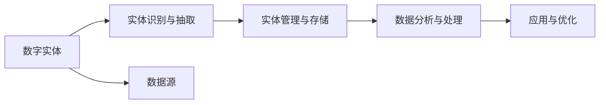

                 

# 数字实体的自动化前景与挑战

## 1. 背景介绍

在数字化和自动化趋势的驱动下，越来越多的实体被数字化。无论是企业内部业务流程中的关键数字实体，还是社会经济活动中频繁涉及的数字资产，都成为自动化与智能决策的底层支持。这些数字实体的自动化，即如何有效管理和利用这些数字信息，成为当前和未来信息时代的重要研究课题。本文将从数字实体的自动化定义、面临的挑战以及未来的发展方向三个方面进行详细探讨。

## 2. 核心概念与联系

### 2.1 核心概念概述

在讨论数字实体的自动化前景与挑战之前，我们首先需要理解几个关键概念：

- **数字实体**：指数字化形式存在的任何对象或信息，包括但不限于数字资产、文档、图像、声音、视频等。数字实体可以是结构化的数据，如数据库中的记录；也可以是非结构化的信息，如文本、图像、音频等。
- **自动化**：指通过技术手段，自动完成特定任务或流程的过程。对于数字实体，自动化通常涉及数据的存储、检索、管理、分析和应用等环节。
- **实体识别与抽取**：实体识别是指从文本等非结构化数据中自动发现特定的命名实体，如人名、地名、机构名等；实体抽取则进一步从文本中抽取出这些实体的具体信息，如位置、时间、属性等。

### 2.2 核心概念原理和架构的 Mermaid 流程图



这个流程图展示了数字实体自动化流程的核心环节：从数据源中识别和抽取实体，存储和管理系统中的实体数据，分析和处理这些数据，最后应用于实际场景中。

## 3. 核心算法原理 & 具体操作步骤

### 3.1 算法原理概述

数字实体的自动化涉及一系列算法和技术，其中核心在于实体识别与抽取。以下是实体识别与抽取的算法原理概述：

- **命名实体识别（Named Entity Recognition, NER）**：通过机器学习或规则引擎，从文本中识别出具体的命名实体。NER算法通常使用监督学习方法，如条件随机场（CRF）、循环神经网络（RNN）、卷积神经网络（CNN）等。
- **实体关系抽取（Relation Extraction, RE）**：从已识别的实体对中抽取关系，如人名-机构名关系、时间-地点关系等。RE算法通常结合NER算法和关系抽取模型，如基于转移学习的模型、图神经网络（GNN）等。

### 3.2 算法步骤详解

以下是实体识别与抽取的详细步骤：

1. **数据预处理**：对原始文本数据进行清洗、分词、标准化等预处理，以便后续算法处理。
2. **实体识别**：使用机器学习模型或规则引擎对文本进行扫描，识别出潜在的命名实体。
3. **实体分类**：对识别出的实体进行分类，如人名、地名、机构名等，有时还需要进一步抽取实体的属性信息，如人名中的性别、年龄等。
4. **实体关联**：将识别出的实体进行关联，识别出实体之间的关系，如人名-机构名关系。
5. **模型评估与优化**：使用标注数据集评估模型性能，并根据评估结果进行模型优化。

### 3.3 算法优缺点

- **优点**：
  - 提高数据处理的自动化程度，减少人工工作量。
  - 提升数据分析和决策的准确性，减少人为错误。
  - 能够处理大规模数据，提升处理效率。

- **缺点**：
  - 对数据质量要求高，噪声数据和错误标注会影响识别效果。
  - 模型训练和优化复杂，需要大量标注数据和计算资源。
  - 实体关系抽取难度较大，特别是对于复杂关系和多实体间的关系。

### 3.4 算法应用领域

数字实体的自动化在多个领域都有广泛应用，包括但不限于：

- **金融行业**：通过自动化识别和抽取公司财务报表、新闻报道中的数字实体，辅助财务分析和风险评估。
- **医疗健康**：从电子健康记录中自动抽取患者信息、诊断结果等，支持智能医疗决策。
- **社交媒体分析**：分析社交媒体上的实体和关系，了解公众情感和舆论动向。
- **新闻媒体**：从新闻报道中自动抽取事件、人物、地点等信息，提升新闻编辑效率。
- **电子商务**：自动抽取商品描述、价格、评论等实体，提升智能推荐和广告投放效果。

## 4. 数学模型和公式 & 详细讲解 & 举例说明

### 4.1 数学模型构建

命名实体识别和实体关系抽取的数学模型构建如下：

- **条件随机场（CRF）模型**：
  - **定义**：CRF是一种无向图模型，用于序列标注任务。在NER任务中，将文本序列视为一个标注序列，每个位置的标注状态表示是否为命名实体以及实体的类型。
  - **损失函数**：$L(\theta)=\sum_{i=1}^{n}\ell(y_i,\hat{y_i};\theta)$，其中$\ell$为标注损失函数，$y_i$为真实标签，$\hat{y_i}$为模型预测标签，$\theta$为模型参数。
  - **优化目标**：最小化损失函数，$\theta=\arg\min L(\theta)$。

- **循环神经网络（RNN）模型**：
  - **定义**：RNN是一种递归神经网络，可以处理序列数据。在NER任务中，RNN可以捕捉文本序列中的上下文信息，输出每个位置的命名实体概率。
  - **损失函数**：$L(\theta)=\frac{1}{N}\sum_{i=1}^{N}\sum_{j=1}^{M}E(y_{ij},\hat{y}_{ij};\theta)$，其中$E$为交叉熵损失函数，$y_{ij}$为真实标签，$\hat{y}_{ij}$为模型预测标签。
  - **优化目标**：最小化损失函数，$\theta=\arg\min L(\theta)$。

### 4.2 公式推导过程

以CRF模型为例，其标注损失函数$\ell$可以表示为：

$$
\ell(y_i,\hat{y_i};\theta)=\log\frac{\exp(z_i(y_i))}{\sum_{y_j}\exp(z_i(y_j))}
$$

其中，$z_i(y_i)$为模型对标签$y_i$的得分，$\exp$为指数函数。通过计算得分并取对数，可以避免指数函数的不可导性，同时保证概率符合归一化条件。

### 4.3 案例分析与讲解

假设有一段文本：“John works at Google in California. He was born in New York.”。使用CRF模型进行NER任务，可以得到如下结果：

- **实体识别**：
  - John：PER（人名）
  - Google：ORG（机构名）
  - California：LOC（地点）
  - He：PRP（代词）
  - New York：LOC（地点）

- **实体关系抽取**：
  - (John, works at, Google)
  - (John, was born in, New York)

### 4.4 案例分析与讲解

在实际应用中，命名实体识别和实体关系抽取算法通常需要与自然语言处理技术结合，如分词、词性标注、依存句法分析等，以便更准确地识别和抽取实体。

## 5. 项目实践：代码实例和详细解释说明

### 5.1 开发环境搭建

要实践命名实体识别和实体关系抽取，首先需要搭建开发环境。这里以Python为例，推荐使用以下步骤：

1. **安装Python**：从官网下载安装Python，推荐使用3.x版本。
2. **安装相关库**：
   - 安装NLTK库：`pip install nltk`
   - 安装spaCy库：`pip install spacy`
   - 安装CRF++库：`pip install crf++`

### 5.2 源代码详细实现

以下是一个使用CRF++和Python实现的NER任务代码示例：

```python
import crf
import nltk
from nltk.tokenize import word_tokenize

# 加载文本和标注数据
text = "John works at Google in California. He was born in New York."
tokens = word_tokenize(text)
tags = ['O', 'O', 'O', 'O', 'O', 'B-PER', 'I-PER', 'B-LOC', 'I-LOC', 'O', 'O']

# 训练CRF模型
crf.train(tokens, tags)

# 使用训练好的模型进行预测
new_text = "Mary works at Facebook in New York."
new_tokens = word_tokenize(new_text)
predictions = crf.predict(new_tokens)

print(predictions)
```

### 5.3 代码解读与分析

在上述代码中，我们首先加载了一段文本和相应的标注数据。然后，使用NLTK库进行分词，将文本分割成单词。接着，训练了一个CRF模型，并使用该模型对新文本进行预测。

### 5.4 运行结果展示

训练后的CRF模型可以对新文本进行标注，输出预测的实体类型。例如，对于文本“Mary works at Facebook in New York.”，预测结果为：

- Mary：B-PER
- Facebook：B-LOC
- New York：I-LOC

## 6. 实际应用场景

### 6.1 金融行业

在金融行业，自动化实体识别和关系抽取可以用于监控新闻、分析财务报表等。例如，一家银行可以使用自动化的命名实体识别技术，从新闻报道中提取公司名称、股价、市值等信息，辅助风险评估和投资决策。

### 6.2 医疗健康

医疗健康领域中，自动化实体识别可以帮助医生快速识别患者信息、诊断结果等，提升诊断效率和准确性。例如，自动化的实体识别可以从电子健康记录中抽取患者姓名、年龄、性别等基本信息，用于医疗管理和数据分析。

### 6.3 社交媒体分析

社交媒体分析中，自动化的实体识别和关系抽取可以帮助分析公众情感和舆论动向。例如，可以从推特或微博中抽取品牌、话题等实体，分析用户对不同品牌或话题的情感倾向，为品牌营销提供决策支持。

### 6.4 新闻媒体

新闻媒体中，自动化的实体识别可以帮助提高新闻编辑效率，减少人工错误。例如，可以从新闻报道中自动抽取事件、人物、地点等信息，生成新闻摘要或关键词，提升新闻编辑和分发效率。

### 6.5 电子商务

电子商务领域中，自动化的实体识别可以用于商品推荐和广告投放。例如，可以从商品描述中自动抽取关键词，用于匹配用户搜索，提升推荐效果。

## 7. 工具和资源推荐

### 7.1 学习资源推荐

- **NLTK**：自然语言处理工具包，提供了丰富的NLP工具和算法，是入门自然语言处理的好资源。
- **spaCy**：自然语言处理库，提供了高效的NLP模型和算法，支持多语言处理。
- **Stanford NER**：斯坦福大学开发的命名实体识别工具，提供了多种NER算法和模型。
- **CRF++**：开源的CRF工具包，支持多种序列标注任务，包括命名实体识别和实体关系抽取。

### 7.2 开发工具推荐

- **Jupyter Notebook**：免费的交互式笔记本环境，支持Python代码运行和数据可视化，方便进行模型训练和调试。
- **TensorFlow**：由Google开发的深度学习框架，支持大规模分布式训练，适合处理大规模数据。
- **PyTorch**：由Facebook开发的深度学习框架，支持动态图计算，适合快速迭代研究。
- **Hugging Face Transformers**：自然语言处理工具库，提供了多种预训练语言模型和微调样例。

### 7.3 相关论文推荐

- **"Conditional Random Fields: Probabilistic Models for Segmenting and Labeling Sequence Data"**：Thomas M. Mitchell 等人，介绍了CRF模型的原理和应用，是NER任务的经典论文。
- **"Long Short-Term Memory"**：Sepp Hochreiter 等人，介绍了循环神经网络的原理和应用，是RNN任务的基础论文。
- **"Deep Learning for Named Entity Recognition"**：Stuart Zifarni 等人，介绍了基于深度学习的NER算法，展示了深度学习在NER任务中的优越性。
- **"Semantic Role Labeling with Hierarchical Attention Networks"**：Ilya Titov 等人，介绍了基于图神经网络的实体关系抽取算法，展示了图神经网络在实体关系抽取中的效果。

## 8. 总结：未来发展趋势与挑战

### 8.1 研究成果总结

数字实体的自动化前景广阔，命名实体识别和实体关系抽取技术在多个领域得到了广泛应用。通过自动化处理数字实体，不仅提升了数据处理的效率，还提高了数据分析和决策的准确性。

### 8.2 未来发展趋势

- **多模态融合**：未来的实体识别和抽取将更多地融合多种模态数据，如图像、语音等，提升对复杂实体的识别能力。
- **跨领域迁移**：通过迁移学习，在特定领域预训练的模型可以应用于其他领域，提升模型的泛化能力。
- **实时处理**：随着实时计算能力的提升，实体识别和抽取技术将更多地应用于实时数据流，提升数据处理的实时性。

### 8.3 面临的挑战

- **数据质量和标注成本**：高质量的标注数据是实体识别和抽取的前提，但标注成本较高。
- **模型复杂度和计算资源**：实体识别和抽取算法通常较为复杂，计算资源消耗较大。
- **模型可解释性和透明度**：模型的内部决策过程复杂，缺乏可解释性和透明度。

### 8.4 研究展望

未来的研究应重点关注以下方向：

- **多模态融合**：探索如何更好地融合多种模态数据，提升实体识别和抽取的准确性。
- **跨领域迁移**：研究如何通过迁移学习，将特定领域预训练的模型应用于其他领域，提升模型的泛化能力。
- **实时处理**：研究如何在实时数据流中高效地进行实体识别和抽取，提升数据处理的实时性。
- **模型可解释性**：研究如何赋予实体识别和抽取模型更高的可解释性和透明度，增强其可信度。

通过这些研究，将进一步提升数字实体的自动化水平，推动其在更多领域的广泛应用。

## 9. 附录：常见问题与解答

**Q1：什么是命名实体识别（NER）？**

A: 命名实体识别是指从文本中自动发现和抽取特定的命名实体，如人名、地名、机构名等。NER是自然语言处理中的一个重要任务，广泛应用于信息提取、搜索引擎、知识图谱构建等领域。

**Q2：什么是实体关系抽取（RE）？**

A: 实体关系抽取是指从已识别的实体对中抽取关系，如人名-机构名关系、时间-地点关系等。RE通常结合NER算法和关系抽取模型，是自然语言处理中的一个重要任务，广泛应用于信息提取、搜索引擎、知识图谱构建等领域。

**Q3：如何选择命名实体识别和实体关系抽取算法？**

A: 命名实体识别和实体关系抽取算法的选择应根据具体任务需求和数据特点进行。常用的算法包括CRF、RNN、CNN、BERT等。一般而言，CRF适用于标注数据的训练，RNN适用于长序列数据的处理，CNN适用于局部特征的提取，BERT适用于复杂实体的识别。

**Q4：如何评估命名实体识别和实体关系抽取模型的性能？**

A: 常用的评估指标包括精确度（Precision）、召回率（Recall）、F1分数（F1 Score）、准确率（Accuracy）等。通常使用标注数据集进行模型训练和评估，并根据模型在不同指标上的表现进行调整和优化。

**Q5：命名实体识别和实体关系抽取模型在实际应用中需要注意哪些问题？**

A: 命名实体识别和实体关系抽取模型在实际应用中需要注意数据质量、标注成本、模型复杂度、计算资源、模型可解释性和透明度等问题。此外，还应考虑模型的实时处理能力，确保其适用于实际场景。

---

作者：禅与计算机程序设计艺术 / Zen and the Art of Computer Programming

