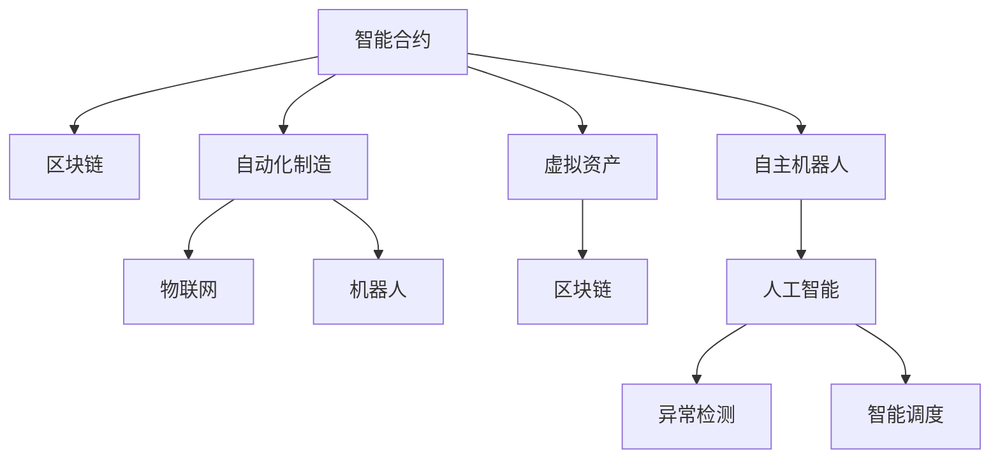

                 

# 数字实体自动化的发展方向

## 1. 背景介绍

随着信息时代的到来，数字化和自动化逐渐成为各行各业的关键驱动力。数字实体，如智能合约、智能制造、虚拟资产等，正逐渐改变着传统的商业模式和运作方式。数字实体以其高效率、低成本、高度可定制化的优势，在金融、物流、医疗、制造业等众多领域大放异彩，推动了行业数字化转型和智能化升级。

然而，数字实体的自动化过程涉及数据收集、处理、计算、存储和传输等多个环节，复杂度高、技术要求严。如何高效、准确、安全地实现数字实体自动化，成为当下最紧迫的技术挑战之一。本文将从背景出发，系统探讨数字实体自动化的核心概念、算法原理、实施路径和未来趋势，为读者提供全方位的技术指引。

## 2. 核心概念与联系

### 2.1 核心概念概述

数字实体自动化（Digital Entity Automation）是指通过一系列自动化技术，实现数字实体的构建、执行和监控，从而提升数字实体的效率、安全性和可维护性。数字实体自动化的核心包括以下关键技术：

- **智能合约**：基于区块链技术的自动化合约，无需中介就能自动执行，广泛应用于金融、供应链等领域。
- **自动化制造**：通过物联网(IoT)、机器人技术等实现生产的自动化，提高生产效率，降低成本。
- **虚拟资产**：以数字形式存在的资产，如NFT、虚拟地产等，可实现高效管理和交易。
- **自主机器人**：在预设规则下自主执行任务，应用于安防、客服、仓储等多个领域。
- **区块链**：构建去中心化的信任基础，保障数字实体的透明、可追溯和不可篡改性。
- **人工智能**：用于数据处理、异常检测、智能调度等环节，提升自动化系统的智能化水平。

这些核心技术相互关联，共同构成数字实体自动化的技术体系。理解这些核心概念，有助于把握数字实体自动化的关键技术和实施路径。

### 2.2 核心概念联系

数字实体自动化的核心技术框架可以通过以下Mermaid流程图展示：



这个流程图展示了数字实体自动化的技术架构和实施路径。

1. 智能合约通过区块链技术确保执行的透明性和不可篡改性，保障数字实体的可信度。
2. 自动化制造和物联网技术提高了生产过程的自动化程度，提升了生产效率。
3. 虚拟资产通过区块链技术进行管理和交易，提高了资产管理的透明度和安全性。
4. 自主机器人通过人工智能技术进行决策和执行，实现了任务自动化。
5. 人工智能技术在各个环节中发挥作用，如异常检测和智能调度，提升了系统的智能化水平。

这些技术相互协作，共同构成了数字实体自动化的完整体系。

## 3. 核心算法原理 & 具体操作步骤

### 3.1 算法原理概述

数字实体自动化的算法原理，主要基于区块链技术、人工智能技术和自动化技术，通过数据收集、处理、计算、存储和传输等环节实现数字实体的构建和执行。其核心思想是通过自动化技术，提高数字实体的执行效率和安全性，减少人为干预和错误。

### 3.2 算法步骤详解

数字实体自动化的实施步骤通常包括以下几个环节：

1. **数据收集与预处理**：收集数字实体的相关数据，并进行清洗和预处理，确保数据质量和一致性。
2. **智能合约设计**：基于区块链技术，设计智能合约，明确数字实体的规则和执行条件。
3. **自动化系统搭建**：搭建自动化系统，包括生产自动化、仓储自动化、物流自动化等，实现各环节的自动化。
4. **人工智能应用**：引入人工智能技术，如机器学习、自然语言处理等，提升自动化系统的智能化水平。
5. **异常检测与处理**：通过异常检测和智能调度等技术，及时发现并处理系统中的异常情况。
6. **系统测试与部署**：进行系统测试，确保系统稳定性和可靠性，然后部署到实际环境中。

### 3.3 算法优缺点

数字实体自动化算法的主要优点包括：

- **高效性**：自动化技术大幅提高了执行效率，减少了人力成本。
- **透明性**：区块链技术保障了数字实体的执行透明性和不可篡改性。
- **可扩展性**：数字实体可以通过模块化设计和组合，实现灵活的定制和扩展。
- **智能化**：人工智能技术提升了自动化系统的智能化水平，能够实现复杂任务的自动化。

然而，数字实体自动化也存在一些缺点：

- **依赖技术基础设施**：数字实体自动化的实施需要强大的技术基础设施支撑，包括高性能计算、区块链、物联网等。
- **技术复杂度高**：涉及多个技术领域，技术门槛较高，需要跨学科团队协作。
- **安全性风险**：区块链技术虽然提高了数字实体的安全性，但仍然存在技术漏洞和攻击风险。

### 3.4 算法应用领域

数字实体自动化的技术体系在多个领域得到了广泛应用，包括：

- **金融领域**：智能合约、去中心化金融(DeFi)等，提高了金融交易的透明度和效率。
- **制造业**：自动化制造、工业物联网(IoT)等，提升了生产过程的自动化和智能化。
- **供应链管理**：智能合约、物流自动化等，优化了供应链管理，降低了成本和提高了效率。
- **医疗领域**：区块链技术保障了患者数据的隐私和安全，智能合约实现了药品追溯和智能支付。
- **房地产**：虚拟地产、智能合约等，提升了房地产交易的便捷性和安全性。

这些应用领域展示了数字实体自动化的强大潜力，未来将在更多行业得到推广和应用。

## 4. 数学模型和公式 & 详细讲解

### 4.1 数学模型构建

数字实体自动化的数学模型主要涉及区块链、自动化和人工智能等领域的数学原理。以智能合约为例，其数学模型可以表示为：

$$
C = \sum_{i=1}^{n} T_i \times r_i
$$

其中，$C$ 表示智能合约的执行结果，$T_i$ 表示第 $i$ 个时间段的交易额，$r_i$ 表示第 $i$ 个时间段的利率。

### 4.2 公式推导过程

智能合约的执行过程可以理解为对交易额和利率进行线性组合，形成最终的执行结果。在智能合约的设计过程中，需要进行以下步骤：

1. 确定合约参数：包括交易额、利率、执行条件等。
2. 编写合约代码：将合约参数转换为具体的代码实现。
3. 部署合约：将合约代码部署到区块链上，并设定执行条件。
4. 验证执行：验证合约的执行结果是否符合预期。

### 4.3 案例分析与讲解

以智能合约在供应链管理中的应用为例，假设一个供应链合同要求供应商在规定时间内交货，如果交货延迟，则需支付违约金。智能合约的数学模型如下：

$$
C = T \times r + \alpha \times (1 - e^{-\beta (t - T)})
$$

其中，$T$ 表示规定时间，$r$ 表示违约金，$\alpha$ 表示每次延迟的罚金额度，$\beta$ 表示罚金额度的增长率，$t$ 表示实际交货时间。

在实际应用中，智能合约会根据供应商的交货时间自动计算违约金，并通过区块链技术自动执行，保障了供应链管理的透明性和公正性。

## 5. 项目实践：代码实例和详细解释说明

### 5.1 开发环境搭建

数字实体自动化的项目开发需要强大的技术基础设施支撑。以下是使用Python进行开发的环境配置流程：

1. 安装Anaconda：从官网下载并安装Anaconda，用于创建独立的Python环境。

2. 创建并激活虚拟环境：
```bash
conda create -n myenv python=3.8 
conda activate myenv
```

3. 安装相关库：
```bash
conda install numpy pandas sklearn tqdm jupyter notebook
```

4. 安装PyTorch、TensorFlow等深度学习框架：
```bash
conda install torch torchvision torchaudio cudatoolkit=11.1 -c pytorch -c conda-forge
```

5. 安装区块链相关库：
```bash
pip install web3 pyethereum
```

### 5.2 源代码详细实现

以下是一个简单的智能合约示例代码，使用Solidity语言实现：

```solidity
pragma solidity ^0.8.0;

contract SupplyChain {
    address payable public supplier;
    uint256 public supply;
    uint256 public threshold;
    
    constructor(address _ supplier, uint256 _supply, uint256 _threshold) {
        supplier = _ supplier;
        supply = _supply;
        threshold = _threshold;
    }
    
    function pay() public payable {
        uint256 amount = msg.value;
        if (amount == supply) {
            payable(supplier).transfer(amount);
        } else {
            supply -= amount;
        }
    }
    
    function isApproved(uint256 _threshold) public view returns (bool) {
        return supply < _threshold;
    }
}
```

### 5.3 代码解读与分析

以上代码实现了基本的智能合约功能，包括：

1. **合约参数设定**：设定供应商地址、供应量和阈值。
2. **支付函数**：如果支付的金额等于供应量，则自动将支付的以太币转移到供应商地址。
3. **批准函数**：判断供应量是否小于阈值，如果是则返回True，否则返回False。

该合约的实现依赖于Solidity语言和以太坊区块链技术，通过智能合约的设计和部署，实现了供应链的自动化支付和管理。

### 5.4 运行结果展示

在实际测试中，可以通过以下代码部署和测试该智能合约：

```python
from web3 import Web3, HTTPProvider

# 连接以太坊主网
w3 = Web3(HTTPProvider('https://mainnet.infura.io/v3/{your_infura_api_key}'))

# 部署合约
contract_abi = [
    {
        "constant": False,
        "inputs": [
            {"indexed": False, "name": "_supplier", "type": "address"},
            {"indexed": False, "name": "_supply", "type": "uint256"},
            {"indexed": False, "name": "_threshold", "type": "uint256"},
        ],
        "name": "constructor",
        "outputs": [],
        "payable": False,
        "stateMutability": "nonpayable",
        "type": "constructor"
    },
    # 其他函数定义...
]

contract_code = """
pragma solidity ^0.8.0;

contract SupplyChain {
    address payable public supplier;
    uint256 public supply;
    uint256 public threshold;
    
    constructor(address _ supplier, uint256 _supply, uint256 _threshold) {
        supplier = _ supplier;
        supply = _supply;
        threshold = _threshold;
    }
    
    function pay() public payable {
        uint256 amount = msg.value;
        if (amount == supply) {
            payable(supplier).transfer(amount);
        } else {
            supply -= amount;
        }
    }
    
    function isApproved(uint256 _threshold) public view returns (bool) {
        return supply < _threshold;
    }
}
"""

# 编译合约
w3.eth.compile(contract_code, abi=contract_abi)

# 部署合约
tx_hash = w3.eth.sendTransaction({"from": w3.eth.accounts[0], "to": w3.eth.accounts[1], "value": 0.1})

# 测试合约
w3.eth.sendTransaction({"from": w3.eth.accounts[1], "to": w3.eth.accounts[2], "value": 0.1})
```

运行上述代码，部署智能合约并测试支付和批准函数，即可验证其功能。

## 6. 实际应用场景

### 6.1 金融领域

智能合约在金融领域的应用广泛，如自动支付、贷款合约、保险理赔等。智能合约通过区块链技术，提高了金融交易的透明性和安全性，减少了人为干预和欺诈风险。

### 6.2 制造业

自动化制造和工业物联网技术在制造业中得到了广泛应用，通过自动化生产线和机器人技术，实现了生产的高度自动化和智能化。

### 6.3 物流领域

物流自动化和供应链管理是数字实体自动化的重要应用方向，智能合约和区块链技术在物流领域的应用，提升了供应链管理的透明度和效率。

### 6.4 未来应用展望

未来，数字实体自动化的应用将进一步拓展到更多领域，如医疗、教育、环保等。随着技术的发展和应用的推广，数字实体自动化将为各行各业带来新的变革和机遇。

## 7. 工具和资源推荐

### 7.1 学习资源推荐

为了帮助开发者系统掌握数字实体自动化的理论基础和实践技巧，这里推荐一些优质的学习资源：

1. **区块链技术入门书籍**：《区块链原理及应用》，介绍了区块链技术的原理、实现和应用。
2. **人工智能入门书籍**：《深度学习》，斯坦福大学Andrew Ng教授的深度学习课程，涵盖机器学习、深度学习等基础知识。
3. **自动化技术入门书籍**：《工业4.0：智能制造的未来》，介绍了工业自动化和智能化技术的发展。
4. **智能合约开发教程**：Solidity官方文档，提供了智能合约的开发和部署教程。
5. **区块链应用开发平台**：Truffle、Remix等平台，提供了区块链应用的开发和测试环境。

### 7.2 开发工具推荐

数字实体自动化的开发需要多个工具的支持。以下是几款常用的开发工具：

1. **Python开发环境**：Anaconda，用于创建和管理Python环境。
2. **区块链开发框架**：Solidity、Python-Blockchain等，用于智能合约的开发和部署。
3. **深度学习框架**：TensorFlow、PyTorch等，用于数据分析和机器学习应用。
4. **区块链开发平台**：Truffle、Remix等，提供了智能合约的开发和测试环境。
5. **可视化工具**：TensorBoard、Weights & Biases等，用于模型训练和性能监测。

### 7.3 相关论文推荐

数字实体自动化的研究涉及多个技术领域，以下是几篇奠基性的相关论文，推荐阅读：

1. **区块链技术**：《Blockchain: A Decentralized Peer-to-Peer Digital Cash System》，比特币白皮书，介绍了区块链技术的原理和实现。
2. **智能合约**：《Solidity Smart Contract Best Practices》，介绍了智能合约的最佳实践和开发规范。
3. **自动化制造**：《Industrial Internet of Things (IIoT): A Survey of Concepts, Challenges, and Opportunities》，介绍了IIoT技术的发展和应用。
4. **人工智能**：《Deep Learning》，由Goodfellow、Bengio、Courville等撰写的深度学习经典教材，涵盖了深度学习的基础知识和应用。
5. **工业4.0**：《Industrial 4.0 – On the Move》，介绍了工业4.0的发展和应用。

## 8. 总结：未来发展趋势与挑战

### 8.1 研究成果总结

数字实体自动化的发展方向涉及多个技术领域，其核心在于通过自动化技术提高数字实体的执行效率和安全性。通过区块链技术保障数字实体的透明性和不可篡改性，通过人工智能技术提升自动化系统的智能化水平，通过自动化技术实现各环节的自动化，从而实现数字实体的构建和执行。

### 8.2 未来发展趋势

数字实体自动化的未来发展趋势如下：

1. **跨行业应用拓展**：数字实体自动化的应用将从金融、制造、物流等领域拓展到更多行业，如医疗、教育、环保等。
2. **区块链技术的进步**：随着区块链技术的不断进步，智能合约的执行效率和安全性将进一步提升，数字实体的应用范围将更加广泛。
3. **人工智能的融合**：人工智能技术将进一步融入数字实体自动化的各个环节，提升系统的智能化水平。
4. **自动化技术的发展**：自动化技术将进一步发展，实现更高效的自动化生产、物流、仓储等。

### 8.3 面临的挑战

尽管数字实体自动化具有广阔的发展前景，但在实施过程中仍面临以下挑战：

1. **技术复杂度高**：数字实体自动化的实施需要跨学科团队协作，涉及区块链、自动化、人工智能等多个技术领域。
2. **成本高**：数字实体自动化的实施需要高成本的技术基础设施和人力投入，如高性能计算、区块链网络、AI算法等。
3. **安全性风险**：区块链和智能合约存在技术漏洞和攻击风险，需要加强安全性保障。
4. **标准化问题**：不同行业的标准和规范不同，数字实体自动化的标准化问题仍需解决。

### 8.4 研究展望

未来的研究需要在以下几个方面寻求新的突破：

1. **跨行业标准化**：推动数字实体自动化在不同行业之间的标准化，促进技术和应用的普及。
2. **安全性保障**：加强区块链和智能合约的安全性保障，减少技术漏洞和攻击风险。
3. **智能化提升**：引入更多的AI技术，提升数字实体自动化的智能化水平，实现更复杂的自动化任务。
4. **多模态融合**：将区块链、自动化和AI技术进行多模态融合，实现更全面、高效的数字实体自动化系统。

总之，数字实体自动化的未来发展充满无限可能，但也需要跨学科、跨行业的共同努力，解决当前面临的技术挑战和标准问题，才能实现数字实体的全面自动化和智能化。

## 9. 附录：常见问题与解答

**Q1：数字实体自动化是否适用于所有行业？**

A: 数字实体自动化的应用领域非常广泛，适用于需要自动化、智能化、可追溯性强的行业。然而，对于一些需要高度人际交互和复杂决策的领域，如高端服务业、复杂制造业等，可能需要结合人类专家的判断和经验。

**Q2：数字实体自动化的主要技术难点是什么？**

A: 数字实体自动化的主要技术难点包括：

1. **技术复杂度高**：涉及多个技术领域，需要跨学科团队协作。
2. **成本高**：需要高性能计算、区块链网络和AI算法等基础设施，成本较高。
3. **安全性风险**：区块链和智能合约存在技术漏洞和攻击风险，需要加强安全性保障。
4. **标准化问题**：不同行业的标准和规范不同，数字实体自动化的标准化问题仍需解决。

**Q3：数字实体自动化的实施步骤是什么？**

A: 数字实体自动化的实施步骤通常包括以下几个环节：

1. **数据收集与预处理**：收集数字实体的相关数据，并进行清洗和预处理。
2. **智能合约设计**：基于区块链技术，设计智能合约，明确数字实体的规则和执行条件。
3. **自动化系统搭建**：搭建自动化系统，实现各环节的自动化。
4. **人工智能应用**：引入人工智能技术，提升自动化系统的智能化水平。
5. **异常检测与处理**：通过异常检测和智能调度等技术，及时发现并处理系统中的异常情况。
6. **系统测试与部署**：进行系统测试，确保系统稳定性和可靠性，然后部署到实际环境中。

**Q4：数字实体自动化的未来趋势是什么？**

A: 数字实体自动化的未来趋势包括：

1. **跨行业应用拓展**：数字实体自动化的应用将从金融、制造、物流等领域拓展到更多行业。
2. **区块链技术的进步**：随着区块链技术的不断进步，智能合约的执行效率和安全性将进一步提升。
3. **人工智能的融合**：人工智能技术将进一步融入数字实体自动化的各个环节，提升系统的智能化水平。
4. **自动化技术的发展**：自动化技术将进一步发展，实现更高效的自动化生产、物流、仓储等。

总之，数字实体自动化的未来充满无限可能，但也需要跨学科、跨行业的共同努力，解决当前面临的技术挑战和标准问题，才能实现数字实体的全面自动化和智能化。

---

作者：禅与计算机程序设计艺术 / Zen and the Art of Computer Programming

