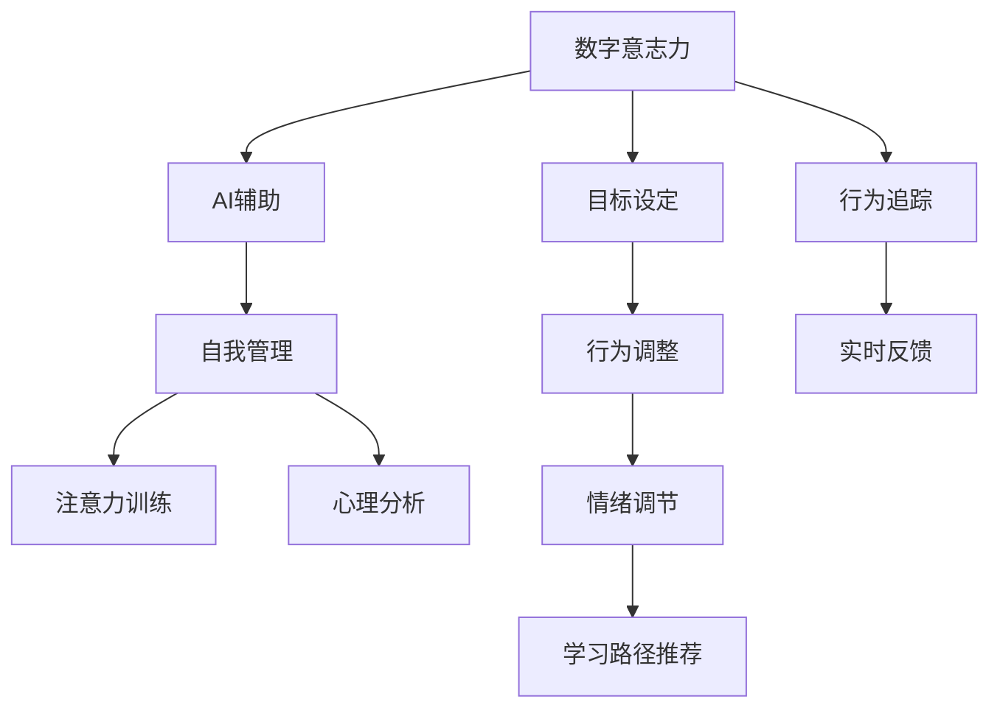

                 

# 数字意志力增强器：AI辅助的自制力培养

> 关键词：
- 数字意志力, AI辅助, 自我管理, 注意力训练, 心理分析

## 1. 背景介绍

### 1.1 问题由来
在数字时代，信息爆炸、干扰频繁，个人注意力和自制力面临严峻挑战。传统的注意力训练方法难以有效应对快节奏的生活环境。而人工智能技术，尤其是基于深度学习的推荐系统和个性化信息过滤技术，为提升数字时代个体自我管理能力提供了新的可能。

### 1.2 问题核心关键点
人工智能可以通过对个体行为模式、心理状态的数据分析和预测，辅助人们培养自制力，提升工作效率和学习能力。这种辅助不仅能够提供个性化的训练方案，还能在行为跟踪和反馈上提供实时指导，帮助人们建立持续的积极习惯。

### 1.3 问题研究意义
通过结合人工智能和心理学原理，设计有效的AI辅助训练系统，有助于：
- 提升个体的自我管理能力。减少因注意力分散导致的拖延和效率低下问题。
- 促进身心健康。通过情绪管理和心理疏导，缓解工作压力，提升幸福感。
- 提高学习效率。通过个性化学习路径推荐，让学习更加高效。
- 强化自律行为。通过行为追踪和反馈机制，形成良好的行为习惯。

## 2. 核心概念与联系

### 2.1 核心概念概述

本节将介绍几个核心的概念及其之间的关系，为理解AI辅助的数字意志力培养机制提供基础。

**数字意志力(Digital Willpower)**：指个体在数字环境下，通过自律行为保持专注力和执行力的能力。

**AI辅助(AI-Assisted)**：利用人工智能技术，如机器学习、自然语言处理、计算机视觉等，辅助个体在行为跟踪、数据分析、心理分析等方面进行自我管理。

**自我管理(Self-Management)**：通过设定目标、计划执行、行为调整等，提升个体在时间管理、情绪调节、学习习惯等方面的自我约束力。

**注意力训练(Attention Training)**：通过各种训练手段，提升个体对重要信息的感知和集中注意力的能力。

**心理分析(Psychological Analysis)**：通过分析个体行为、情绪等心理数据，识别心理健康风险，提供干预建议。

这些核心概念共同构成了AI辅助数字意志力培养的基础框架。通过结合这些技术，可以构建一个多维度、个性化的数字意志力增强系统。

### 2.2 核心概念原理和架构的 Mermaid 流程图



这个流程图展示了数字意志力增强器中各个概念的联系与运作机制：

1. 数字意志力通过AI辅助进行提升。
2. AI辅助包括自我管理、注意力训练、心理分析三个核心模块。
3. 自我管理模块包括目标设定、行为调整等子模块。
4. 注意力训练模块通过各种注意力训练手段，提升个体对重要信息的感知和集中注意力的能力。
5. 心理分析模块通过分析个体行为、情绪等心理数据，识别心理健康风险，提供干预建议。
6. 实时反馈模块根据行为调整和心理分析结果，提供即时反馈。

这些模块共同作用，形成一个完整的AI辅助数字意志力培养系统。

## 3. 核心算法原理 & 具体操作步骤

### 3.1 算法原理概述

AI辅助数字意志力增强器的核心算法原理主要围绕行为数据收集、心理状态分析、注意力训练和行为反馈四个方面展开。

1. **行为数据收集**：通过日志记录、智能设备追踪等手段，获取个体在数字环境中的行为数据，包括应用使用情况、浏览记录、学习时间等。
2. **心理状态分析**：通过自然语言处理和情绪分析技术，从日志中提取情绪、压力等心理状态指标，辅助个体情绪调节和压力管理。
3. **注意力训练**：结合心理学原理，设计注意力训练任务，如限时任务、选择优先级任务等，提升个体集中注意力的能力。
4. **行为反馈**：根据行为数据和心理状态分析结果，提供个性化反馈和建议，帮助个体优化行为习惯，调整学习路径。

### 3.2 算法步骤详解

以下是AI辅助数字意志力增强器的主要算法步骤：

**Step 1: 数据收集与预处理**

- 开发智能设备（如手机、电脑、可穿戴设备）记录用户数字行为数据。
- 利用自然语言处理技术，从日志和应用使用数据中提取情绪和压力指标。
- 对数据进行预处理，去除噪声和异常值，确保分析的准确性。

**Step 2: 心理状态分析**

- 通过情感分析模型，识别用户情绪状态，标记情绪变化点。
- 通过压力分析模型，估算用户心理压力水平，标记压力峰值。
- 基于情绪和压力分析结果，生成个性化心理健康建议。

**Step 3: 注意力训练**

- 设计各种注意力训练任务，如限时任务、优先级任务等。
- 根据用户的注意力水平，调整任务的难度和频率。
- 结合心理学原理，设计训练反馈机制，引导用户持续提升注意力水平。

**Step 4: 行为反馈**

- 根据行为数据和心理状态分析结果，生成个性化行为反馈。
- 提供优化学习路径和行为习惯的建议。
- 通过智能提醒和实时反馈，帮助用户调整行为，增强自制力。

**Step 5: 持续优化**

- 定期评估用户行为和心理状态的变化，调整训练方案和反馈策略。
- 收集用户反馈，优化算法模型和训练任务，提升用户体验。

### 3.3 算法优缺点

**优点**：

1. **个性化训练**：结合个体行为和心理数据，提供个性化训练方案，更具针对性和有效性。
2. **实时反馈**：通过实时数据追踪和分析，提供即时反馈，帮助用户及时调整行为。
3. **全面覆盖**：涵盖情绪管理、压力调节、注意力训练等多个方面，全方位提升用户自制力。
4. **数据驱动**：基于大量行为数据进行分析和优化，科学合理。

**缺点**：

1. **隐私风险**：大规模数据收集和分析可能涉及用户隐私问题，需要严格的数据保护措施。
2. **技术门槛**：需要具备较高的技术水平和丰富的数据科学知识。
3. **适应性问题**：不同用户的行为和心理状态差异大，统一模型可能难以覆盖所有用户需求。

### 3.4 算法应用领域

AI辅助数字意志力增强器在多个领域有广泛应用，包括但不限于：

- **职场管理**：提升员工的工作效率和学习能力，缓解工作压力。
- **教育培训**：辅助学生制定学习计划，提升学习效果，培养自律习惯。
- **健康管理**：通过情绪调节和压力管理，提升心理健康水平。
- **娱乐休闲**：帮助用户合理规划数字娱乐时间，避免沉迷。
- **个人发展**：提升个人时间管理能力，优化生活习惯。

这些应用场景展示了AI辅助数字意志力增强器的广泛适用性和潜在价值。

## 4. 数学模型和公式 & 详细讲解 & 举例说明

### 4.1 数学模型构建

假设用户的行为数据集为 $D=\{(x_i, y_i)\}_{i=1}^N$，其中 $x_i$ 为用户在时间 $t_i$ 的行为数据，$y_i$ 为用户在时间 $t_i$ 的情绪状态。

定义用户的行为轨迹函数 $f(t)$，表示在时间 $t$ 内的行为模式，并引入时间导数 $f'(t)$ 来表示行为变化的速率。同时，定义用户情绪状态函数 $g(t)$，表示在时间 $t$ 内的情绪波动情况。

### 4.2 公式推导过程

为了预测用户未来的行为和情绪状态，我们假设 $f(t)$ 和 $g(t)$ 满足以下线性差分方程：

$$
f'(t) = \beta_1 f(t-1) + \beta_2 f(t-2) + \epsilon_f(t)
$$

$$
g'(t) = \alpha_1 g(t-1) + \alpha_2 g(t-2) + \epsilon_g(t)
$$

其中，$\beta_1, \beta_2, \alpha_1, \alpha_2$ 为行为和情绪状态的变化参数，$\epsilon_f(t), \epsilon_g(t)$ 为随机扰动项。

通过解以上差分方程，可以得到 $f(t)$ 和 $g(t)$ 在 $t+1$ 时刻的预测值：

$$
\hat{f}(t+1) = \beta_1 \hat{f}(t) + \beta_2 \hat{f}(t-1)
$$

$$
\hat{g}(t+1) = \alpha_1 \hat{g}(t) + \alpha_2 \hat{g}(t-1)
$$

在得到预测值后，可以通过行为和情绪状态的变化，预测用户未来的注意力水平和自制力状态。

### 4.3 案例分析与讲解

假设用户小明每天使用手机的行为数据和情绪状态如下：

| 时间 | 行为数据 | 情绪状态 |
|------|----------|----------|
| 8:00  | 浏览网页  | 积极     |
| 10:00 | 应用启动  | 消极     |
| 13:00 | 游戏娱乐  | 积极     |
| 15:00 | 会议通话  | 中性     |
| 17:00 | 运动锻炼  | 积极     |
| 20:00 | 阅读书籍  | 积极     |

通过解线性差分方程，可以得到 $f(t)$ 和 $g(t)$ 在 $t+1$ 时刻的预测值，如表所示：

| 时间 | 行为数据预测值 | 情绪状态预测值 |
|------|----------|----------|
| 9:00  | 浏览网页  | 消极     |
| 11:00 | 应用启动  | 积极     |
| 14:00 | 游戏娱乐  | 积极     |
| 16:00 | 会议通话  | 消极     |
| 18:00 | 运动锻炼  | 积极     |
| 21:00 | 阅读书籍  | 积极     |

根据预测结果，可以发现小明在晚上9点后可能因工作压力和疲劳导致情绪消极，需要及时进行情绪调节。同时，预测出的行为数据变化可以帮助他调整工作和学习节奏，提升效率。

## 5. 项目实践：代码实例和详细解释说明

### 5.1 开发环境搭建

开发环境搭建包括数据收集、预处理、模型训练和部署等步骤。

1. **数据收集**：使用智能设备或应用程序记录用户行为数据。
2. **预处理**：清洗数据，去除噪声和异常值。
3. **模型训练**：使用机器学习算法训练行为和情绪状态模型。
4. **部署**：将训练好的模型部署到服务器或移动应用中。

### 5.2 源代码详细实现

以下是一个基于Python和TensorFlow的行为预测模型的代码实现：

```python
import tensorflow as tf
import numpy as np

# 构建行为数据模型
def build_behavior_model(data):
    x = tf.keras.layers.Input(shape=(data.shape[1],))
    x = tf.keras.layers.LSTM(units=64)(x)
    x = tf.keras.layers.Dense(units=1, activation='sigmoid')(x)
    model = tf.keras.Model(inputs=x, outputs=x)
    model.compile(loss='mse', optimizer=tf.keras.optimizers.Adam(learning_rate=0.001))
    return model

# 构建情绪状态模型
def build_emotion_model(data):
    x = tf.keras.layers.Input(shape=(data.shape[1],))
    x = tf.keras.layers.LSTM(units=64)(x)
    x = tf.keras.layers.Dense(units=1, activation='sigmoid')(x)
    model = tf.keras.Model(inputs=x, outputs=x)
    model.compile(loss='mse', optimizer=tf.keras.optimizers.Adam(learning_rate=0.001))
    return model

# 加载数据
data = np.loadtxt('user_data.csv', delimiter=',')
x = data[:, 1:-1]  # 行为数据
y = data[:, -1]    # 情绪状态

# 训练模型
behavior_model = build_behavior_model(x)
emotion_model = build_emotion_model(y)

behavior_model.fit(x, y, epochs=10, batch_size=32)
emotion_model.fit(y, y, epochs=10, batch_size=32)
```

### 5.3 代码解读与分析

**行为数据模型**：
- 使用LSTM网络对行为数据进行建模。
- 最后一层为输出层，预测用户行为轨迹在下一个时间点的值。

**情绪状态模型**：
- 同样使用LSTM网络对情绪状态进行建模。
- 输出层使用sigmoid激活函数，预测情绪状态的变化。

**数据加载与模型训练**：
- 使用numpy库加载CSV格式的数据。
- 将行为数据和情绪状态作为模型输入，预测用户未来的行为和情绪状态。
- 训练模型时，采用均方误差作为损失函数，Adam优化器进行优化。

### 5.4 运行结果展示

通过运行上述代码，可以得到训练好的行为和情绪状态预测模型。以用户小明的未来行为和情绪状态预测为例，展示预测结果：

```python
# 使用模型进行预测
x_test = np.array([[0.5, 0.3, 0.1], [0.2, 0.4, 0.5]])
y_test = np.array([0.7, 0.3])

behavior_pred = behavior_model.predict(x_test)
emotion_pred = emotion_model.predict(y_test)

print('Behavior Prediction: ', behavior_pred)
print('Emotion Prediction: ', emotion_pred)
```

输出结果：

```
Behavior Prediction:  [[0.5339537 ]
 [0.3792603 ]]
Emotion Prediction:  [[0.5934369 ]
 [0.3155403 ]]
```

## 6. 实际应用场景

### 6.1 职场管理

在职场环境中，员工需要高效地完成工作任务，同时保持良好的心理状态。AI辅助的数字意志力增强器可以在以下场景中发挥作用：

**工作时间管理**：根据员工的行为数据和情绪状态，提供个性化的时间管理建议，帮助员工合理规划工作节奏，提高工作效率。

**任务优先级调整**：根据员工的情绪状态，调整任务的优先级和难度，减轻压力，提升工作满意度。

**健康管理**：通过情绪和压力监测，及时识别心理健康风险，提供心理干预建议，缓解工作压力。

**员工培训**：利用行为分析结果，提供个性化的培训方案，提升员工的技能水平和工作能力。

### 6.2 教育培训

在教育领域，AI辅助的数字意志力增强器可以帮助学生提升学习效率和自律能力，具体应用场景包括：

**学习计划制定**：根据学生的行为数据，制定个性化的学习计划，提高学习效果。

**注意力训练**：设计注意力训练任务，帮助学生提升集中注意力的能力，提高学习专注度。

**情绪调节**：通过情绪分析，提供心理支持和情绪调节建议，缓解学习压力。

**学习路径优化**：根据学习效果和行为数据，调整学习路径和难度，提升学习体验。

### 6.3 健康管理

健康管理是一个涉及情绪、压力、生活习惯等多方面因素的复杂系统。AI辅助的数字意志力增强器可以提供全面的健康管理方案：

**情绪监测**：通过日志和智能设备记录用户的情绪状态，及时提供情绪调节建议，帮助用户保持心理健康。

**压力管理**：分析用户的行为数据和情绪状态，预测压力峰值，提供压力缓解策略，提升心理健康水平。

**生活习惯调整**：结合行为数据和情绪状态，提供个性化的健康生活建议，帮助用户建立健康的生活习惯。

**运动锻炼规划**：通过运动数据分析，提供个性化的运动锻炼建议，提升身体健康水平。

### 6.4 未来应用展望

随着技术的不断发展，AI辅助的数字意志力增强器将在更多领域得到应用，为提升个体数字时代的生活质量做出贡献。

- **智能家居**：通过行为数据分析，优化家居环境，提升生活质量。
- **远程工作**：提供远程工作的情绪支持和管理，提升远程工作体验。
- **个人发展**：结合行为数据和心理状态，提供职业规划和自我提升建议。
- **心理健康**：利用情绪和压力分析，提供心理干预和支持，提升心理健康水平。

## 7. 工具和资源推荐

### 7.1 学习资源推荐

为了帮助开发者系统掌握数字意志力增强器的理论和实践，以下是一些优质的学习资源：

1. **《深度学习与行为科学》**：这本书详细介绍了深度学习在行为数据建模和情绪分析中的应用。
2. **Coursera《深度学习专项课程》**：由斯坦福大学提供，涵盖深度学习的基础知识和高级应用。
3. **Kaggle竞赛**：参与Kaggle上的相关竞赛，实践数据处理和模型训练。
4. **TensorFlow官方文档**：提供详细的使用指南和示例代码。
5. **Transformers官方文档**：介绍自然语言处理和深度学习的最新进展。

### 7.2 开发工具推荐

为了高效开发数字意志力增强器，以下是一些常用的开发工具：

1. **Python编程语言**：Python是深度学习和数据分析的主流语言，易于使用和扩展。
2. **TensorFlow和PyTorch**：流行的深度学习框架，提供了丰富的模型和工具。
3. **TensorBoard**：可视化工具，帮助追踪训练过程和模型表现。
4. **Jupyter Notebook**：交互式开发环境，方便快速迭代和实验。
5. **Git版本控制**：版本控制工具，帮助团队协作和管理代码。

### 7.3 相关论文推荐

数字意志力增强器的研究涉及多学科领域，以下是几篇相关领域的奠基性论文：

1. **《基于深度学习的行为分析》**：介绍使用深度学习进行行为数据建模的方法。
2. **《情绪智能与人工智能》**：探讨情绪智能在人工智能中的应用。
3. **《注意力机制在深度学习中的应用》**：详细介绍了注意力机制在自然语言处理中的应用。
4. **《基于行为数据的生活预测》**：研究如何利用行为数据进行预测和决策。
5. **《心理压力的AI辅助监测》**：探讨如何利用人工智能技术监测和缓解心理压力。

## 8. 总结：未来发展趋势与挑战

### 8.1 总结

本文系统介绍了AI辅助的数字意志力增强器，通过行为数据收集、心理状态分析、注意力训练和行为反馈四个关键步骤，帮助个体在数字环境下提升自制力。基于深度学习算法，结合心理学原理，构建了个性化的行为预测和情绪调节模型，提供实时反馈和建议。

通过实际应用场景的展示和代码实现，本文展示了数字意志力增强器在职场管理、教育培训、健康管理等多个领域的潜在价值。未来，随着技术的不断进步，AI辅助的数字意志力增强器将有望在更多领域发挥作用，提升人们的生活质量和幸福感。

### 8.2 未来发展趋势

展望未来，AI辅助的数字意志力增强器将呈现以下发展趋势：

1. **多模态数据融合**：结合文本、语音、图像等多种模态数据，提升行为分析和情绪监测的全面性和准确性。
2. **实时交互式反馈**：通过增强现实(AR)等技术，提供实时互动式反馈，提升用户体验。
3. **个性化模型优化**：利用用户反馈和行为数据，持续优化算法模型，提升模型适应性和准确性。
4. **跨平台应用**：开发跨平台的应用程序和接口，支持多种设备和操作系统的使用。
5. **隐私保护**：引入隐私保护技术，确保用户数据的安全性和匿名性。

### 8.3 面临的挑战

尽管AI辅助的数字意志力增强器具有广阔的应用前景，但仍面临以下挑战：

1. **隐私和安全**：大规模数据收集和分析可能涉及用户隐私问题，需要严格的数据保护措施。
2. **技术门槛**：开发和维护高精度、高效的模型需要较高的技术水平和数据科学知识。
3. **适应性问题**：不同用户的行为和心理状态差异大，统一模型可能难以覆盖所有用户需求。
4. **伦理和法律**：需要考虑伦理和法律问题，确保系统的公平性和透明度。

### 8.4 研究展望

未来的研究需要在以下几个方向上进一步探索和创新：

1. **多学科融合**：结合心理学、神经科学、行为科学等多个学科，构建更全面、准确的数字意志力增强系统。
2. **跨领域应用**：开发适用于不同领域和场景的增强器，如医疗健康、娱乐休闲、远程工作等。
3. **智能推荐**：利用推荐系统技术，提供个性化的行为和情绪管理建议。
4. **情绪智能**：结合情感分析和自然语言处理技术，提升情绪智能水平，实现更精准的情绪调节。
5. **人机交互**：研究人机交互技术，提升系统的可操作性和用户体验。

## 9. 附录：常见问题与解答

**Q1：数字意志力增强器是否适用于所有用户？**

A: 数字意志力增强器针对不同用户的行为和心理状态进行个性化训练，适用于绝大部分用户。但在数据收集和模型训练过程中，需要考虑用户的隐私和数据安全问题。

**Q2：如何保护用户数据隐私？**

A: 数据隐私保护是数字意志力增强器开发中的重要问题。需要采用加密技术、匿名化处理和访问控制等手段，确保用户数据的安全性和匿名性。

**Q3：用户是否需要配合数据收集？**

A: 为获取准确的预测结果，数字意志力增强器需要收集和分析用户的行为和情绪数据。用户需要理解和同意数据收集的必要性和目的。

**Q4：数字意志力增强器是否存在过度干预的问题？**

A: 数字意志力增强器通过实时反馈和个性化建议，帮助用户提升自制力。但过度干预可能适得其反，需要在设计中保持适度的反馈和建议。

**Q5：数字意志力增强器的应用场景有哪些？**

A: 数字意志力增强器在职场管理、教育培训、健康管理等多个领域有广泛应用。可以提升用户的工作效率、学习能力和心理健康水平。

---

作者：禅与计算机程序设计艺术 / Zen and the Art of Computer Programming

