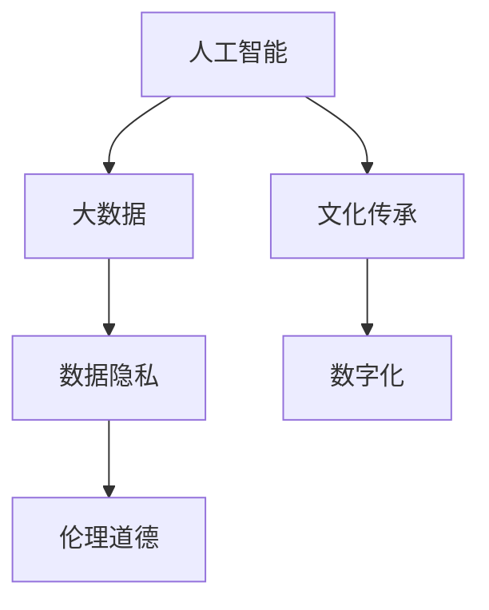

                 

# 数字时代的人文精神的传承

## 1. 背景介绍

### 1.1 问题由来

在数字时代，科技的迅猛发展带来了便捷的生活方式和高效的生产模式，但也引发了一系列深刻的社会伦理和价值观问题。如何在这个时代保持人文精神的传承，成为一个亟待解答的问题。特别是在人工智能、大数据等技术快速发展的背景下，人们开始反思技术的社会责任和伦理边界。

### 1.2 问题核心关键点

- **人工智能与人文精神的关系**：人工智能如何与人的价值观、伦理道德相协调，是否会改变人类的认知方式和行为习惯？
- **数据隐私与人文关怀**：大数据时代的隐私保护，如何平衡数据利用和个人信息的保护？
- **科技与道德的平衡**：科技发展应如何遵循人类道德准则，避免技术滥用？
- **智能与创造的融合**：人工智能能否与人类创造力结合，促进文化的传承和发展？
- **全球数字化与文化多样性**：数字技术如何影响不同国家和民族的文化传承，能否促进文化的多样性和交流？

## 2. 核心概念与联系

### 2.1 核心概念概述

为更好地理解数字时代如何传承人文精神，本节将介绍几个核心概念：

- **人工智能（AI）**：通过算法和大数据驱动，具备自主学习和决策能力的智能系统。
- **大数据（Big Data）**：涉及海量数据的收集、存储、处理和分析，旨在挖掘数据背后的信息。
- **数据隐私（Data Privacy）**：保护个人数据不被非法获取和滥用的权益。
- **伦理道德（Ethical and Moral Values）**：指导行为准则，确保科技发展与社会责任相协调。
- **文化传承（Cultural Heritage）**：保护和传播人类文化传统、艺术、知识和价值观。
- **数字化（Digitalization）**：将传统事物数字化，提高效率和信息共享。

这些概念之间的逻辑关系可以通过以下Mermaid流程图来展示：



这个流程图展示了人工智能、大数据、数据隐私、伦理道德、文化传承与数字化之间的关系：

1. 人工智能和大数据技术为文化传承和数字化提供了技术和手段。
2. 数据隐私和伦理道德是使用这些技术时必须遵循的原则。
3. 数字化推动了文化传承的传播和创新。

## 3. 核心算法原理 & 具体操作步骤

### 3.1 算法原理概述

数字时代人文精神的传承涉及多方面的技术实现，本节将从数据驱动和算法驱动两个角度进行探讨。

**数据驱动**：通过收集、处理和分析相关数据，识别社会行为、文化趋势和价值观变迁，从中提取人文精神的元素。具体步骤包括：
1. 数据收集：从不同来源收集数据，如社交媒体、公共数据库、文化艺术作品等。
2. 数据清洗：清洗、处理和预处理数据，去除噪声和不相关数据。
3. 数据分析：使用机器学习、自然语言处理等技术，分析数据背后的文化和价值观。
4. 知识提取：从分析结果中提取人文精神的关键元素，如语言、情感、行为模式等。

**算法驱动**：利用人工智能算法和技术，实现人文精神的传承和创新。具体步骤包括：
1. 模型训练：使用预训练模型对文化数据进行处理，提取人文精神的核心特征。
2. 知识整合：将提取的知识与人类专家知识、文化符号等结合，形成更加全面和准确的人文精神模型。
3. 应用实现：将模型应用于推荐系统、内容生成、情感分析等场景，推动人文精神的传承和创新。

### 3.2 算法步骤详解

**数据驱动步骤**：

**1. 数据收集**：
- 定义数据收集范围：确定需要收集哪些数据源，如社交媒体、书籍、影视作品等。
- 数据采集工具：使用爬虫、API接口等工具进行数据采集，如Python的requests库、BeautifulSoup库等。

**2. 数据清洗**：
- 数据去重：去除重复的数据记录。
- 数据归一化：统一数据格式，如时间戳、文本编码等。
- 数据处理：使用NLP工具对文本进行分词、去除停用词、词性标注等处理，如NLTK、spaCy库。

**3. 数据分析**：
- 情感分析：使用LSTM、BERT等模型对文本情感进行分类，如Sentiment140数据集、IMDB数据集。
- 主题建模：使用LDA、TF-IDF等方法进行文本主题提取，如20 News数据集。
- 行为模式分析：使用时间序列分析、聚类等方法分析用户行为模式，如Github用户行为数据集。

**4. 知识提取**：
- 构建知识图谱：使用Graph Neural Network等方法构建文化知识图谱，如Neo4j图数据库。
- 提取关键元素：从知识图谱中提取关键词、概念关系、文化符号等，用于生成内容。

**算法驱动步骤**：

**1. 模型训练**：
- 数据预处理：对文本进行分词、词性标注、去除停用词等处理，如BertTokenizer、Word2Vec模型。
- 模型选择：选择适合的人文精神模型，如BERT、GPT等。
- 模型训练：在标注数据上训练模型，提取人文精神的核心特征。

**2. 知识整合**：
- 融合人类知识：将模型提取的知识与人类专家知识、文化符号等结合，使用规则引擎、专家系统等方法。
- 生成内容：利用生成模型，如GAN、Seq2Seq等，生成符合人文精神的内容。

**3. 应用实现**：
- 推荐系统：根据用户兴趣和偏好，推荐相关文化内容，如Netflix推荐系统。
- 内容生成：生成符合人文精神的文章、视频、音频等，如AI作诗、AI创作音乐等。
- 情感分析：分析用户情感，生成符合人文精神的文章、回复等，如智能客服系统。

### 3.3 算法优缺点

数据驱动方法的优点在于能够大规模、快速地处理数据，提取人文精神的核心要素。缺点在于数据质量和多样性对分析结果有较大影响，可能导致结果偏差。

算法驱动方法的优点在于能够精确地处理复杂任务，生成符合人文精神的内容。缺点在于模型复杂，需要大量标注数据和计算资源，且容易过拟合。

### 3.4 算法应用领域

数据驱动方法在以下几个领域有广泛应用：
- 社会行为分析：分析社交媒体上的情感、行为模式，发现社会热点和趋势。
- 文化传承保护：分析文化艺术作品，提取文化元素，保护和传承文化遗产。
- 价值观念研究：分析社会新闻和公共讨论，提取价值观变化趋势，指导政策制定。

算法驱动方法在以下几个领域有广泛应用：
- 内容生成：生成符合人文精神的文章、视频、音乐等。
- 情感分析：生成符合人文精神的情感回复和评论。
- 推荐系统：推荐符合人文精神的书籍、电影、艺术作品等。

## 4. 数学模型和公式 & 详细讲解 & 举例说明

### 4.1 数学模型构建

本节将使用数学语言对数字时代人文精神传承的技术方法进行更加严格的刻画。

记数据集为 $D=\{x_1,x_2,\cdots,x_N\}$，其中 $x_i$ 表示样本数据。设 $f(x_i)$ 为样本 $x_i$ 的人文精神评分函数，定义损失函数为：

$$
\mathcal{L}(f) = \frac{1}{N}\sum_{i=1}^N (y_i - f(x_i))^2
$$

其中 $y_i$ 为样本 $x_i$ 的人文精神评分真值，$f(x_i)$ 为模型预测的评分值。目标是最小化损失函数，即：

$$
f^* = \mathop{\arg\min}_{f} \mathcal{L}(f)
$$

在实践中，我们通常使用梯度下降等优化算法来近似求解上述最优化问题。设 $\eta$ 为学习率，则参数的更新公式为：

$$
f \leftarrow f - \eta \nabla_{f}\mathcal{L}(f)
$$

其中 $\nabla_{f}\mathcal{L}(f)$ 为损失函数对函数 $f$ 的梯度，可通过反向传播算法高效计算。

### 4.2 公式推导过程

以下我们以情感分析任务为例，推导情感分类模型的损失函数及其梯度的计算公式。

假设模型 $f(x)$ 在输入 $x$ 上的输出为 $\hat{y}=f(x) \in [0,1]$，表示样本属于正类的概率。真实标签 $y \in \{0,1\}$。则二分类交叉熵损失函数定义为：

$$
\ell(f(x),y) = -[y\log \hat{y} + (1-y)\log (1-\hat{y})]
$$

将其代入损失函数公式，得：

$$
\mathcal{L}(f) = -\frac{1}{N}\sum_{i=1}^N [y_i\log f(x_i)+(1-y_i)\log(1-f(x_i))]
$$

根据链式法则，损失函数对函数 $f$ 的梯度为：

$$
\frac{\partial \mathcal{L}(f)}{\partial f} = -\frac{1}{N}\sum_{i=1}^N (\frac{y_i}{f(x_i)}-\frac{1-y_i}{1-f(x_i)}) \frac{\partial f(x_i)}{\partial f}
$$

其中 $\frac{\partial f(x_i)}{\partial f}$ 可进一步递归展开，利用自动微分技术完成计算。

### 4.3 案例分析与讲解

**案例一：情感分析**

情感分析是人文精神传承中常见的任务之一。假设我们有标注的情感数据集 $D=\{(x_i,y_i)\}_{i=1}^N$，其中 $x_i$ 表示输入文本，$y_i$ 表示情感标签（1表示积极情感，0表示消极情感）。我们可以使用BERT等预训练模型作为情感分析器，在标注数据上进行微调。具体步骤如下：

**1. 数据预处理**：
- 数据清洗：去除重复数据、清洗噪声数据。
- 数据标注：将文本标记为积极或消极情感。

**2. 模型选择**：
- 选择BERT作为情感分析模型。
- 加载预训练模型和词向量。

**3. 模型微调**：
- 定义模型结构：添加分类器，定义损失函数。
- 定义优化器：使用AdamW优化器。
- 设置学习率：选择适当的学习率，如1e-5。
- 模型训练：在标注数据上训练模型，提取情感分类器。

**4. 模型应用**：
- 测试集评估：在测试集上评估情感分类器的性能。
- 内容生成：根据用户输入文本，生成符合情感的回复。

**案例二：文化传承**

文化传承是人文精神传承中的重要任务。假设我们有文化数据集 $D=\{(x_i,y_i)\}_{i=1}^N$，其中 $x_i$ 表示文化作品，$y_i$ 表示文化类型（如文学、艺术、音乐等）。我们可以使用LDA（Latent Dirichlet Allocation）主题模型，从文本中提取主题和关键词，以实现文化传承。具体步骤如下：

**1. 数据预处理**：
- 数据清洗：去除重复数据、清洗噪声数据。
- 数据标注：将文化作品标记为文化类型。

**2. 模型选择**：
- 选择LDA作为主题模型。
- 加载预训练模型和词向量。

**3. 模型训练**：
- 定义模型结构：添加主题生成器，定义损失函数。
- 定义优化器：使用L-BFGS优化器。
- 设置超参数：选择适当的超参数，如主题数量、迭代次数等。
- 模型训练：在标注数据上训练模型，提取主题和关键词。

**4. 模型应用**：
- 测试集评估：在测试集上评估主题模型的性能。
- 文化推荐：根据用户兴趣，推荐相关文化作品。

## 5. 项目实践：代码实例和详细解释说明

### 5.1 开发环境搭建

在进行人文精神传承的实践前，我们需要准备好开发环境。以下是使用Python进行PyTorch开发的环境配置流程：

1. 安装Anaconda：从官网下载并安装Anaconda，用于创建独立的Python环境。

2. 创建并激活虚拟环境：
```bash
conda create -n pytorch-env python=3.8 
conda activate pytorch-env
```

3. 安装PyTorch：根据CUDA版本，从官网获取对应的安装命令。例如：
```bash
conda install pytorch torchvision torchaudio cudatoolkit=11.1 -c pytorch -c conda-forge
```

4. 安装Transformers库：
```bash
pip install transformers
```

5. 安装各类工具包：
```bash
pip install numpy pandas scikit-learn matplotlib tqdm jupyter notebook ipython
```

完成上述步骤后，即可在`pytorch-env`环境中开始实践。

### 5.2 源代码详细实现

下面我以情感分析任务为例，给出使用Transformers库对BERT模型进行情感分析微调的PyTorch代码实现。

首先，定义情感分析任务的数据处理函数：

```python
from transformers import BertTokenizer
from torch.utils.data import Dataset
import torch

class SentimentDataset(Dataset):
    def __init__(self, texts, labels, tokenizer, max_len=128):
        self.texts = texts
        self.labels = labels
        self.tokenizer = tokenizer
        self.max_len = max_len
        
    def __len__(self):
        return len(self.texts)
    
    def __getitem__(self, item):
        text = self.texts[item]
        label = self.labels[item]
        
        encoding = self.tokenizer(text, return_tensors='pt', max_length=self.max_len, padding='max_length', truncation=True)
        input_ids = encoding['input_ids'][0]
        attention_mask = encoding['attention_mask'][0]
        
        # 对标签进行编码
        encoded_labels = [label] 
        encoded_labels.extend([0] * (self.max_len - len(encoded_labels)))
        labels = torch.tensor(encoded_labels, dtype=torch.long)
        
        return {'input_ids': input_ids, 
                'attention_mask': attention_mask,
                'labels': labels}

# 加载数据集
tokenizer = BertTokenizer.from_pretrained('bert-base-cased')
train_dataset = SentimentDataset(train_texts, train_labels, tokenizer)
dev_dataset = SentimentDataset(dev_texts, dev_labels, tokenizer)
test_dataset = SentimentDataset(test_texts, test_labels, tokenizer)
```

然后，定义模型和优化器：

```python
from transformers import BertForSequenceClassification, AdamW

model = BertForSequenceClassification.from_pretrained('bert-base-cased', num_labels=2)

optimizer = AdamW(model.parameters(), lr=2e-5)
```

接着，定义训练和评估函数：

```python
from torch.utils.data import DataLoader
from tqdm import tqdm
from sklearn.metrics import classification_report

device = torch.device('cuda') if torch.cuda.is_available() else torch.device('cpu')
model.to(device)

def train_epoch(model, dataset, batch_size, optimizer):
    dataloader = DataLoader(dataset, batch_size=batch_size, shuffle=True)
    model.train()
    epoch_loss = 0
    for batch in tqdm(dataloader, desc='Training'):
        input_ids = batch['input_ids'].to(device)
        attention_mask = batch['attention_mask'].to(device)
        labels = batch['labels'].to(device)
        model.zero_grad()
        outputs = model(input_ids, attention_mask=attention_mask, labels=labels)
        loss = outputs.loss
        epoch_loss += loss.item()
        loss.backward()
        optimizer.step()
    return epoch_loss / len(dataloader)

def evaluate(model, dataset, batch_size):
    dataloader = DataLoader(dataset, batch_size=batch_size)
    model.eval()
    preds, labels = [], []
    with torch.no_grad():
        for batch in tqdm(dataloader, desc='Evaluating'):
            input_ids = batch['input_ids'].to(device)
            attention_mask = batch['attention_mask'].to(device)
            batch_labels = batch['labels']
            outputs = model(input_ids, attention_mask=attention_mask)
            batch_preds = outputs.logits.argmax(dim=2).to('cpu').tolist()
            batch_labels = batch_labels.to('cpu').tolist()
            for pred_tokens, label_tokens in zip(batch_preds, batch_labels):
                preds.append(pred_tokens[:len(label_tokens)])
                labels.append(label_tokens)
                
    print(classification_report(labels, preds))
```

最后，启动训练流程并在测试集上评估：

```python
epochs = 5
batch_size = 16

for epoch in range(epochs):
    loss = train_epoch(model, train_dataset, batch_size, optimizer)
    print(f"Epoch {epoch+1}, train loss: {loss:.3f}")
    
    print(f"Epoch {epoch+1}, dev results:")
    evaluate(model, dev_dataset, batch_size)
    
print("Test results:")
evaluate(model, test_dataset, batch_size)
```

以上就是使用PyTorch对BERT进行情感分析任务微调的完整代码实现。可以看到，得益于Transformers库的强大封装，我们可以用相对简洁的代码完成BERT模型的加载和微调。

### 5.3 代码解读与分析

让我们再详细解读一下关键代码的实现细节：

**SentimentDataset类**：
- `__init__`方法：初始化文本、标签、分词器等关键组件。
- `__len__`方法：返回数据集的样本数量。
- `__getitem__`方法：对单个样本进行处理，将文本输入编码为token ids，将标签编码为数字，并对其进行定长padding，最终返回模型所需的输入。

**bert-base-cased**：
- 定义了BERT模型的基础结构，适合进行序列分类任务。

**BertForSequenceClassification类**：
- 继承自BertForTokenClassification，添加分类器，适合进行序列分类任务。

**AdamW优化器**：
- 使用AdamW优化器进行模型参数更新，具有较好的收敛性和稳定性。

**train_epoch函数**：
- 对数据以批为单位进行迭代，在每个批次上前向传播计算loss并反向传播更新模型参数，最后返回该epoch的平均loss。

**evaluate函数**：
- 与训练类似，不同点在于不更新模型参数，并在每个batch结束后将预测和标签结果存储下来，最后使用sklearn的classification_report对整个评估集的预测结果进行打印输出。

**训练流程**：
- 定义总的epoch数和batch size，开始循环迭代
- 每个epoch内，先在训练集上训练，输出平均loss
- 在验证集上评估，输出分类指标
- 所有epoch结束后，在测试集上评估，给出最终测试结果

可以看到，PyTorch配合Transformers库使得BERT微调的代码实现变得简洁高效。开发者可以将更多精力放在数据处理、模型改进等高层逻辑上，而不必过多关注底层的实现细节。

当然，工业级的系统实现还需考虑更多因素，如模型的保存和部署、超参数的自动搜索、更灵活的任务适配层等。但核心的微调范式基本与此类似。

## 6. 实际应用场景

### 6.1 智能客服系统

基于大语言模型微调的对话技术，可以广泛应用于智能客服系统的构建。传统客服往往需要配备大量人力，高峰期响应缓慢，且一致性和专业性难以保证。而使用微调后的对话模型，可以7x24小时不间断服务，快速响应客户咨询，用自然流畅的语言解答各类常见问题。

在技术实现上，可以收集企业内部的历史客服对话记录，将问题和最佳答复构建成监督数据，在此基础上对预训练对话模型进行微调。微调后的对话模型能够自动理解用户意图，匹配最合适的答案模板进行回复。对于客户提出的新问题，还可以接入检索系统实时搜索相关内容，动态组织生成回答。如此构建的智能客服系统，能大幅提升客户咨询体验和问题解决效率。

### 6.2 金融舆情监测

金融机构需要实时监测市场舆论动向，以便及时应对负面信息传播，规避金融风险。传统的人工监测方式成本高、效率低，难以应对网络时代海量信息爆发的挑战。基于大语言模型微调的文本分类和情感分析技术，为金融舆情监测提供了新的解决方案。

具体而言，可以收集金融领域相关的新闻、报道、评论等文本数据，并对其进行主题标注和情感标注。在此基础上对预训练语言模型进行微调，使其能够自动判断文本属于何种主题，情感倾向是正面、中性还是负面。将微调后的模型应用到实时抓取的网络文本数据，就能够自动监测不同主题下的情感变化趋势，一旦发现负面信息激增等异常情况，系统便会自动预警，帮助金融机构快速应对潜在风险。

### 6.3 个性化推荐系统

当前的推荐系统往往只依赖用户的历史行为数据进行物品推荐，无法深入理解用户的真实兴趣偏好。基于大语言模型微调技术，个性化推荐系统可以更好地挖掘用户行为背后的语义信息，从而提供更精准、多样的推荐内容。

在实践中，可以收集用户浏览、点击、评论、分享等行为数据，提取和用户交互的物品标题、描述、标签等文本内容。将文本内容作为模型输入，用户的后续行为（如是否点击、购买等）作为监督信号，在此基础上微调预训练语言模型。微调后的模型能够从文本内容中准确把握用户的兴趣点。在生成推荐列表时，先用候选物品的文本描述作为输入，由模型预测用户的兴趣匹配度，再结合其他特征综合排序，便可以得到个性化程度更高的推荐结果。

### 6.4 未来应用展望

随着大语言模型微调技术的发展，其应用范围将进一步拓展，推动更多领域的技术创新和产业变革。

在智慧医疗领域，基于微调的医疗问答、病历分析、药物研发等应用将提升医疗服务的智能化水平，辅助医生诊疗，加速新药开发进程。

在智能教育领域，微调技术可应用于作业批改、学情分析、知识推荐等方面，因材施教，促进教育公平，提高教学质量。

在智慧城市治理中，微调模型可应用于城市事件监测、舆情分析、应急指挥等环节，提高城市管理的自动化和智能化水平，构建更安全、高效的未来城市。

此外，在企业生产、社会治理、文娱传媒等众多领域，基于大模型微调的人工智能应用也将不断涌现，为经济社会发展注入新的动力。相信随着技术的日益成熟，微调方法将成为人工智能落地应用的重要范式，推动人工智能技术在垂直行业的规模化落地。总之，微调需要开发者根据具体任务，不断迭代和优化模型、数据和算法，方能得到理想的效果。

## 7. 工具和资源推荐

### 7.1 学习资源推荐

为了帮助开发者系统掌握大语言模型微调的理论基础和实践技巧，这里推荐一些优质的学习资源：

1. 《Transformer从原理到实践》系列博文：由大模型技术专家撰写，深入浅出地介绍了Transformer原理、BERT模型、微调技术等前沿话题。

2. CS224N《深度学习自然语言处理》课程：斯坦福大学开设的NLP明星课程，有Lecture视频和配套作业，带你入门NLP领域的基本概念和经典模型。

3. 《Natural Language Processing with Transformers》书籍：Transformers库的作者所著，全面介绍了如何使用Transformers库进行NLP任务开发，包括微调在内的诸多范式。

4. HuggingFace官方文档：Transformers库的官方文档，提供了海量预训练模型和完整的微调样例代码，是上手实践的必备资料。

5. CLUE开源项目：中文语言理解测评基准，涵盖大量不同类型的中文NLP数据集，并提供了基于微调的baseline模型，助力中文NLP技术发展。

通过对这些资源的学习实践，相信你一定能够快速掌握大语言模型微调的精髓，并用于解决实际的NLP问题。

### 7.2 开发工具推荐

高效的开发离不开优秀的工具支持。以下是几款用于大语言模型微调开发的常用工具：

1. PyTorch：基于Python的开源深度学习框架，灵活动态的计算图，适合快速迭代研究。大部分预训练语言模型都有PyTorch版本的实现。

2. TensorFlow：由Google主导开发的开源深度学习框架，生产部署方便，适合大规模工程应用。同样有丰富的预训练语言模型资源。

3. Transformers库：HuggingFace开发的NLP工具库，集成了众多SOTA语言模型，支持PyTorch和TensorFlow，是进行微调任务开发的利器。

4. Weights & Biases：模型训练的实验跟踪工具，可以记录和可视化模型训练过程中的各项指标，方便对比和调优。与主流深度学习框架无缝集成。

5. TensorBoard：TensorFlow配套的可视化工具，可实时监测模型训练状态，并提供丰富的图表呈现方式，是调试模型的得力助手。

6. Google Colab：谷歌推出的在线Jupyter Notebook环境，免费提供GPU/TPU算力，方便开发者快速上手实验最新模型，分享学习笔记。

合理利用这些工具，可以显著提升大语言模型微调任务的开发效率，加快创新迭代的步伐。

### 7.3 相关论文推荐

大语言模型和微调技术的发展源于学界的持续研究。以下是几篇奠基性的相关论文，推荐阅读：

1. Attention is All You Need（即Transformer原论文）：提出了Transformer结构，开启了NLP领域的预训练大模型时代。

2. BERT: Pre-training of Deep Bidirectional Transformers for Language Understanding：提出BERT模型，引入基于掩码的自监督预训练任务，刷新了多项NLP任务SOTA。

3. Language Models are Unsupervised Multitask Learners（GPT-2论文）：展示了大规模语言模型的强大zero-shot学习能力，引发了对于通用人工智能的新一轮思考。

4. Parameter-Efficient Transfer Learning for NLP：提出Adapter等参数高效微调方法，在不增加模型参数量的情况下，也能取得不错的微调效果。

5. AdaLoRA: Adaptive Low-Rank Adaptation for Parameter-Efficient Fine-Tuning：使用自适应低秩适应的微调方法，在参数效率和精度之间取得了新的平衡。

这些论文代表了大语言模型微调技术的发展脉络。通过学习这些前沿成果，可以帮助研究者把握学科前进方向，激发更多的创新灵感。

## 8. 总结：未来发展趋势与挑战

### 8.1 总结

本文对数字时代人文精神的传承进行了全面系统的介绍。首先阐述了人工智能、大数据等技术在人文精神传承中的应用，明确了其重要性和挑战。其次，从数据驱动和算法驱动两个角度，详细讲解了微调方法的具体实现步骤和数学原理。最后，给出了微调方法的开发环境、代码实现、实际应用场景和相关资源推荐，力求为读者提供全方位的技术指引。

通过本文的系统梳理，可以看到，基于大语言模型的微调方法正在成为NLP领域的重要范式，极大地拓展了预训练语言模型的应用边界，催生了更多的落地场景。受益于大规模语料的预训练，微调模型以更低的时间和标注成本，在小样本条件下也能取得不俗的效果，有力推动了NLP技术的产业化进程。未来，伴随预训练语言模型和微调方法的持续演进，相信NLP技术将在更广阔的应用领域大放异彩，深刻影响人类的生产生活方式。

### 8.2 未来发展趋势

展望未来，大语言模型微调技术将呈现以下几个发展趋势：

1. **多模态微调**：当前微调主要聚焦于纯文本数据，未来会进一步拓展到图像、视频、语音等多模态数据微调。多模态信息的融合，将显著提升语言模型对现实世界的理解和建模能力。

2. **跨领域微调**：现有的微调模型往往局限于特定领域，未来将发展跨领域微调，使模型具备更强的泛化能力，能够在不同领域间高效迁移。

3. **元学习**：研究如何通过元学习技术，将微调过程自动化，使模型能够适应不同任务和数据分布，提升微调的效率和灵活性。

4. **自适应微调**：开发具有自适应能力的微调模型，使其能够自动调整模型结构和超参数，以应对不同任务和数据的需求。

5. **无监督学习**：探索无需标注数据即可进行微调的方法，充分利用无监督数据的先验知识，提升模型的泛化能力。

6. **解释性**：研究如何赋予微调模型更强的可解释性，使其决策过程透明化，增强用户信任和接受度。

这些趋势凸显了大语言模型微调技术的广阔前景。这些方向的探索发展，必将进一步提升NLP系统的性能和应用范围，为人类认知智能的进化带来深远影响。

### 8.3 面临的挑战

尽管大语言模型微调技术已经取得了瞩目成就，但在迈向更加智能化、普适化应用的过程中，它仍面临着诸多挑战：

1. **标注成本**：虽然微调降低了标注数据的需求，但对于长尾应用场景，获取高质量标注数据的成本依然较高。如何进一步降低微调对标注样本的依赖，将是一大难题。

2. **鲁棒性**：当前微调模型面对域外数据时，泛化性能往往大打折扣。对于测试样本的微小扰动，微调模型的预测也容易发生波动。如何提高微调模型的鲁棒性，避免灾难性遗忘，还需要更多理论和实践的积累。

3. **计算资源**：大规模语言模型虽然精度高，但在实际部署时往往面临计算资源和硬件设备的限制，推理速度慢、内存占用大等问题亟待解决。

4. **伦理和隐私**：预训练语言模型难免会学习到有偏见、有害的信息，通过微调传递到下游任务，产生误导性、歧视性的输出。如何从数据和算法层面消除模型偏见，避免恶意用途，确保输出的安全性，也将是重要的研究课题。

5. **可解释性**：当前微调模型更像是"黑盒"系统，难以解释其内部工作机制和决策逻辑。对于医疗、金融等高风险应用，算法的可解释性和可审计性尤为重要。

6. **知识整合**：现有的微调模型往往局限于任务内数据，难以灵活吸收和运用更广泛的先验知识。如何让微调过程更好地与外部知识库、规则库等专家知识结合，形成更加全面、准确的信息整合能力，还有很大的想象空间。

正视微调面临的这些挑战，积极应对并寻求突破，将是大语言模型微调走向成熟的必由之路。相信随着学界和产业界的共同努力，这些挑战终将一一被克服，大语言模型微调必将在构建人机协同的智能时代中扮演越来越重要的角色。

### 8.4 研究展望

面对大语言模型微调所面临的种种挑战，未来的研究需要在以下几个方面寻求新的突破：

1. **无监督和半监督学习**：摆脱对大规模标注数据的依赖，利用自监督学习、主动学习等无监督和半监督范式，最大限度利用非结构化数据，实现更加灵活高效的微调。

2. **参数高效和计算高效的微调方法**：开发更加参数高效的微调方法，在固定大部分预训练参数的同时，只更新极少量的任务相关参数。同时优化微调模型的计算图，减少前向传播和反向传播的资源消耗，实现更加轻量级、实时性的部署。

3. **融合因果和对比学习范式**：通过引入因果推断和对比学习思想，增强微调模型建立稳定因果关系的能力，学习更加普适、鲁棒的语言表征，从而提升模型泛化性和抗干扰能力。

4. **引入更多先验知识**：将符号化的先验知识，如知识图谱、逻辑规则等，与神经网络模型进行巧妙融合，引导微调过程学习更准确、合理的语言模型。同时加强不同模态数据的整合，实现视觉、语音等多模态信息与文本信息的协同建模。

5. **结合因果分析和博弈论工具**：将因果分析方法引入微调模型，识别出模型决策的关键特征，增强输出解释的因果性和逻辑性。借助博弈论工具刻画人机交互过程，主动探索并规避模型的脆弱点，提高系统稳定性。

6. **纳入伦理道德约束**：在模型训练目标中引入伦理导向的评估指标，过滤和惩罚有偏见、有害的输出倾向。同时加强人工干预和审核，建立模型行为的监管机制，确保输出符合人类价值观和伦理道德。

这些研究方向的探索，必将引领大语言模型微调技术迈向更高的台阶，为构建安全、可靠、可解释、可控的智能系统铺平道路。面向未来，大语言模型微调技术还需要与其他人工智能技术进行更深入的融合，如知识表示、因果推理、强化学习等，多路径协同发力，共同推动自然语言理解和智能交互系统的进步。只有勇于创新、敢于突破，才能不断拓展语言模型的边界，让智能技术更好地造福人类社会。

## 9. 附录：常见问题与解答

**Q1：大语言模型微调是否适用于所有NLP任务？**

A: 大语言模型微调在大多数NLP任务上都能取得不错的效果，特别是对于数据量较小的任务。但对于一些特定领域的任务，如医学、法律等，仅仅依靠通用语料预训练的模型可能难以很好地适应。此时需要在特定领域语料上进一步预训练，再进行微调，才能获得理想效果。此外，对于一些需要时效性、个性化很强的任务，如对话、推荐等，微调方法也需要针对性的改进优化。

**Q2：微调过程中如何选择合适的学习率？**

A: 微调的学习率一般要比预训练时小1-2个数量级，如果使用过大的学习率，容易破坏预训练权重，导致过拟合。一般建议从1e-5开始调参，逐步减小学习率，直至收敛。也可以使用warmup策略，在开始阶段使用较小的学习率，再逐渐过渡到预设值。需要注意的是，不同的优化器(如AdamW、Adafactor等)以及不同的学习率调度策略，可能需要设置不同的学习率阈值。

**Q3：采用大模型微调时会面临哪些资源瓶颈？**

A: 目前主流的预训练大模型动辄以亿计的参数规模，对算力、内存、存储都提出了很高的要求。GPU/TPU等高性能设备是必不可少的，但即便如此，超大批次的训练和推理也可能遇到显存不足的问题。因此需要采用一些资源优化技术，如梯度积累、混合精度训练、模型并行等，来突破硬件瓶颈。同时，模型的存储和读取也可能占用大量时间和空间，需要采用模型压缩、稀疏化存储等方法进行优化。

**Q4：如何缓解微调过程中的过拟合问题？**

A: 过拟合是微调面临的主要挑战，尤其是在标注数据不足的情况下。常见的缓解策略包括：
1. 数据增强：通过回译、近义替换等方式扩充训练集
2. 正则化：使用L2正则、Dropout、Early Stopping等避免过拟合
3. 对抗训练：引入对抗样本，提高模型鲁棒性
4. 参数高效微调：只调整少量参数(如Adapter、Prefix等)，减小过拟合风险
5. 多模型集成：训练多个微调模型，取平均输出，抑制过拟合

这些策略往往需要根据具体任务和数据特点进行灵活组合。只有在数据、模型、训练、推理等各环节进行全面优化，才能最大限度地发挥大模型微调的威力。

**Q5：微调模型在落地部署时需要注意哪些问题？**

A: 将微调模型转化为实际应用，还需要考虑以下因素：
1. 模型裁剪：去除不必要的层和参数，减小模型尺寸，加快推理速度
2. 量化加速：将浮点模型转为定点模型，压缩存储空间，提高计算效率
3. 服务化封装：将模型封装为标准化服务接口，便于集成调用
4. 弹性伸缩：根据请求流量动态调整资源配置，平衡服务质量和成本
5. 监控告警：实时采集系统指标，设置异常告警阈值，确保服务稳定性
6. 安全防护：采用访问鉴权、数据脱敏等措施，保障数据和模型安全

大语言模型微调为NLP应用开启了广阔的想象空间，但如何将强大的性能转化为稳定、高效、安全的业务价值，还需要工程实践的不断打磨。唯有从数据、算法、工程、业务等多个维度协同发力，才能真正实现人工智能技术在垂直行业的规模化落地。总之，微调需要开发者根据具体任务，不断迭代和优化模型、数据和算法，方能得到理想的效果。

---

作者：禅与计算机程序设计艺术 / Zen and the Art of Computer Programming

