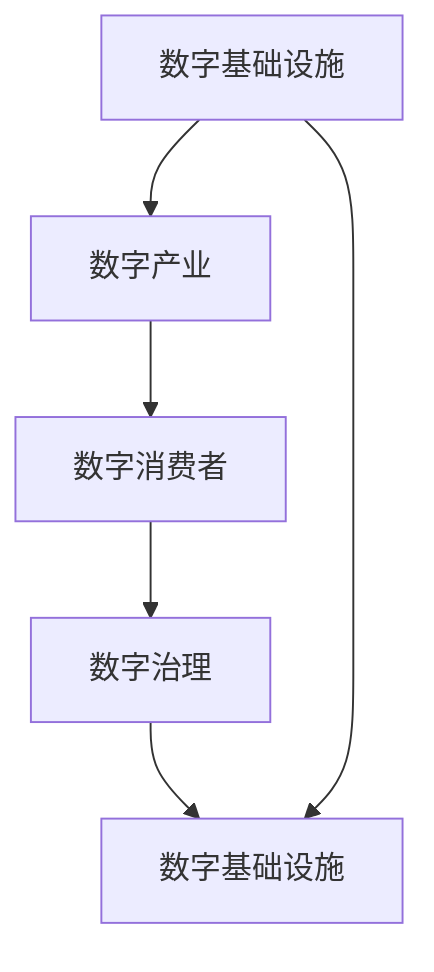

                 

# 数字经济：社会发展的助推器

## 1. 背景介绍

### 1.1 数字经济的兴起

在21世纪的信息技术浪潮中，数字经济正在成为全球经济增长的核心动力。这一经济形态以数字技术为核心，以信息流为媒介，连接了生产、流通、消费等各个环节，极大地提高了资源配置效率，催生了新产业、新业态和新模式。数字经济不仅改变了传统的商业模式，还深刻影响了人们的生产生活方式，成为推动社会进步的重要引擎。

数字经济的崛起，得益于两大关键驱动力：首先是数字技术的飞速进步，特别是互联网、大数据、云计算、人工智能等技术的广泛应用；其次是全球化和市场竞争的加剧，促使各行业向数字化转型，加速了数字经济的发展步伐。

### 1.2 数字经济的特征

与传统经济相比，数字经济具有以下几个显著特征：

- **数据驱动**：数字经济高度依赖于数据的采集、处理和分析，通过数据挖掘和机器学习等技术，实现对市场趋势和用户需求的精准把握。
- **网络协同**：数字经济强调网络的互联互通，通过云计算和物联网等技术，实现资源的共享和协作，降低交易成本，提高效率。
- **个性化服务**：数字经济基于对用户行为数据的分析，提供定制化的产品和服务，满足个性化需求，提升用户体验。
- **快速迭代**：数字经济中的产品和服务更新换代迅速，通过持续的技术创新和市场反馈，不断优化产品设计和用户体验。

## 2. 核心概念与联系

### 2.1 核心概念概述

为了更好地理解数字经济的本质和运行机制，本节将介绍几个关键概念及其相互联系：

- **数字经济**：以数字技术为核心，通过互联网、大数据、人工智能等技术手段，实现商品和服务的数字化生产、交换和消费的经济形态。
- **数字基础设施**：包括互联网、移动通信、云计算、大数据、人工智能等基础设施，是数字经济发展的基石。
- **数字产业**：利用数字技术实现产品、服务和运营的数字化改造，提升生产效率和用户体验。
- **数字消费者**：通过数字平台获取信息、购物、交流和娱乐的用户群体，是数字经济的重要参与者。
- **数字治理**：在数字经济环境下，政府和企业需通过数据和算法进行有效的监管和治理，保障网络安全和用户隐私。

这些概念之间相互关联，共同构成了数字经济的基本框架。数字基础设施为数字产业提供了技术支撑，数字产业为数字消费者提供了丰富的产品和服务，而数字治理则确保了数字经济的稳定运行和可持续发展。

### 2.2 核心概念原理和架构的 Mermaid 流程图



这个流程图展示了数字经济的整体架构：

1. **数字基础设施**：包括互联网、移动通信、云计算、大数据、人工智能等技术支撑，是数字经济运行的基础。
2. **数字产业**：利用数字基础设施，实现产品、服务的数字化改造，提升效率和体验。
3. **数字消费者**：通过数字产业提供的平台和服务，获取信息和娱乐，参与数字经济。
4. **数字治理**：通过数据和算法对数字经济进行监管和治理，确保网络安全、用户隐私等。

这一架构体现了数字经济的技术基础和用户驱动特性，以及数字治理的重要性。

## 3. 核心算法原理 & 具体操作步骤

### 3.1 算法原理概述

数字经济的运行涉及多个环节，包括数据的采集、处理、分析、传输和应用。这些环节中，算法扮演着至关重要的角色。算法通过对数据的处理和分析，实现对市场的精准把握和个性化服务。本节将重点介绍数据驱动算法和网络协同算法在数字经济中的应用。

### 3.2 算法步骤详解

#### 3.2.1 数据驱动算法

**步骤1：数据采集**
- 通过传感器、摄像头、问卷调查等方式，采集用户行为数据和市场环境数据。
- 数据来源包括线上线下渠道，如社交媒体、电子商务、智能家居等。

**步骤2：数据清洗与预处理**
- 对采集到的数据进行清洗和去噪，去除重复、异常和无效数据。
- 数据预处理包括归一化、特征选择和降维等，确保数据的质量和适用性。

**步骤3：数据建模与分析**
- 利用机器学习算法（如回归、分类、聚类等）对数据进行建模和分析。
- 通过数据分析，挖掘用户需求和市场趋势，为决策提供支持。

**步骤4：结果应用**
- 将分析结果应用于产品设计、市场营销、客户服务等领域，提升效率和用户体验。
- 通过A/B测试等方法验证算法的有效性，不断优化模型。

#### 3.2.2 网络协同算法

**步骤1：网络搭建**
- 构建互联网平台，实现资源的互联互通。
- 使用云计算和物联网技术，提供高效、可靠的数据存储和处理能力。

**步骤2：网络优化**
- 通过算法优化网络结构，提高数据传输速度和可靠性。
- 使用负载均衡和流量控制技术，确保网络资源的合理分配。

**步骤3：协同运营**
- 通过算法实现资源共享和协作，降低交易成本，提高效率。
- 利用智能合约等技术，确保协同运营的公平性和透明度。

### 3.3 算法优缺点

**数据驱动算法的优点**：
- 精准把握用户需求和市场趋势。
- 个性化服务，提升用户体验。
- 快速迭代，灵活适应市场变化。

**数据驱动算法的缺点**：
- 数据隐私和安全问题。
- 算法偏见和数据偏差。
- 模型复杂度高，计算资源消耗大。

**网络协同算法的优点**：
- 降低交易成本，提高效率。
- 资源共享和协作，增强竞争优势。
- 提高网络稳定性和可靠性。

**网络协同算法的缺点**：
- 网络安全风险高，容易遭受攻击。
- 数据隐私问题，用户数据被滥用的风险。
- 复杂的网络结构，维护成本高。

### 3.4 算法应用领域

数字经济涉及多个应用领域，以下是几个典型的应用场景：

- **电子商务**：利用算法进行商品推荐、库存管理、定价策略优化等。
- **金融科技**：通过算法实现风险控制、信用评估、智能投顾等。
- **健康医疗**：利用算法进行疾病预测、治疗方案推荐、患者监测等。
- **智能制造**：使用算法进行生产流程优化、质量控制、供应链管理等。
- **智慧城市**：通过算法实现交通管理、环境监测、公共安全等。

## 4. 数学模型和公式 & 详细讲解 & 举例说明

### 4.1 数学模型构建

数字经济中的算法应用涉及多个数学模型，以下是几个常用的数学模型：

- **回归模型**：用于预测数值型变量的值，如销售预测、股价预测等。
- **分类模型**：用于分类不同的数据点，如用户分群、产品分类等。
- **聚类模型**：将数据点分组，挖掘潜在的群体特征，如市场细分、客户分群等。
- **推荐模型**：利用用户行为数据，推荐产品或服务，如商品推荐、内容推荐等。

### 4.2 公式推导过程

以线性回归模型为例，公式推导过程如下：

假设输入数据为 $x$，输出数据为 $y$，回归模型为 $y=\beta_0+\beta_1x+\epsilon$。根据最小二乘法，求解模型参数 $\beta_0$ 和 $\beta_1$，使得预测值 $y$ 与真实值 $y$ 的误差平方和最小：

$$
\min_{\beta_0,\beta_1} \sum_{i=1}^n (y_i - \beta_0 - \beta_1x_i)^2
$$

求解该最小化问题，可得：

$$
\beta_0 = \frac{\sum_{i=1}^n x_i(y_i - \bar{y}) - \sum_{i=1}^n x_i(\bar{x} - \bar{y})}{\sum_{i=1}^n (x_i - \bar{x})^2}
$$

$$
\beta_1 = \frac{\sum_{i=1}^n x_i(y_i - \bar{y}) - \sum_{i=1}^n x_i(\bar{x} - \bar{y})}{\sum_{i=1}^n (x_i - \bar{x})^2}
$$

其中，$\bar{x}$ 和 $\bar{y}$ 分别表示 $x$ 和 $y$ 的均值。

### 4.3 案例分析与讲解

**案例：电商平台商品推荐系统**

电商平台通过用户浏览、点击、购买等行为数据，利用推荐算法为用户推荐相关商品。推荐模型可以是协同过滤、基于内容的推荐、矩阵分解等。

- **协同过滤**：基于用户行为数据，通过相似度计算推荐商品。
- **基于内容的推荐**：根据商品特征，与用户历史行为进行匹配，推荐相似商品。
- **矩阵分解**：通过分解用户-商品矩阵，挖掘用户偏好，推荐相关商品。

推荐系统在电商平台上广泛应用，极大提升了用户体验和转化率。

## 5. 项目实践：代码实例和详细解释说明

### 5.1 开发环境搭建

要进行数字经济的算法实践，需要搭建相应的开发环境。以下是在Python环境下搭建环境的步骤：

1. **安装Python**：选择合适版本的Python，如Python 3.8。
2. **安装相关库**：安装必要的Python库，如NumPy、Pandas、Scikit-learn、TensorFlow等。
3. **配置环境**：配置环境变量，如设置Python路径、安装依赖库等。

### 5.2 源代码详细实现

以下是一个简单的线性回归模型实现示例，使用Scikit-learn库：

```python
import numpy as np
from sklearn.linear_model import LinearRegression

# 生成随机数据
x = np.random.rand(100, 1)
y = 2*x + np.random.randn(100, 1)

# 初始化模型
model = LinearRegression()

# 训练模型
model.fit(x, y)

# 预测新数据
x_new = np.array([[0.5]])
y_pred = model.predict(x_new)

print(y_pred)
```

### 5.3 代码解读与分析

- **数据生成**：使用NumPy生成100个随机样本数据，其中 $y=2x+\epsilon$，$\epsilon$ 为随机噪声。
- **模型训练**：使用Scikit-learn的LinearRegression模型对数据进行拟合。
- **预测新数据**：使用模型对新数据进行预测，输出预测结果。

## 6. 实际应用场景

### 6.1 电子商务

数字经济在电子商务中的应用最为广泛。通过算法优化电商平台的运营，提高了用户体验和转化率，同时也提升了商家运营效率。

**案例：个性化推荐**

电商平台利用用户行为数据，通过协同过滤、基于内容的推荐等算法，为用户推荐相关商品。通过不断优化推荐模型，电商平台可以显著提高用户的购买转化率。

**案例：库存管理**

电商平台通过算法进行库存管理，根据历史销售数据和市场趋势，预测未来的商品需求，优化库存水平，避免缺货或积压。

### 6.2 金融科技

金融科技是数字经济的重要应用领域之一，通过算法实现风险控制、信用评估、智能投顾等。

**案例：信用评估**

金融公司利用机器学习算法，对客户的信用评分进行评估，根据客户的还款记录、收入情况等因素，预测其还款能力，降低贷款风险。

**案例：智能投顾**

智能投顾通过算法分析市场数据和用户需求，为投资者提供个性化的投资建议和资产配置方案，提高投资回报率。

### 6.3 健康医疗

健康医疗领域通过算法实现疾病预测、治疗方案推荐、患者监测等，提高了医疗服务的质量和效率。

**案例：疾病预测**

医疗机构利用算法分析患者的历史医疗数据，预测其可能患上的疾病，提前采取预防措施。

**案例：治疗方案推荐**

根据患者的病情、历史治疗记录等信息，算法推荐最适合的治疗方案，提高治疗效果。

### 6.4 智能制造

智能制造通过算法优化生产流程、质量控制、供应链管理等，提升了制造业的生产效率和竞争力。

**案例：生产流程优化**

利用算法对生产数据进行分析，优化生产流程，减少停机时间，提高生产效率。

**案例：质量控制**

通过算法实时监测生产过程中的质量参数，及时发现并解决质量问题，降低废品率。

### 6.5 智慧城市

智慧城市利用算法实现交通管理、环境监测、公共安全等，提高了城市的运行效率和居民的生活质量。

**案例：交通管理**

通过算法分析交通流量数据，优化交通信号灯控制，减少拥堵，提高交通效率。

**案例：环境监测**

利用传感器和算法，实时监测城市环境数据，如空气质量、噪音污染等，及时采取环保措施。

### 6.6 未来应用展望

未来，数字经济将进一步融合各行业的数字化转型，推动更多领域的智能化升级。

- **智慧农业**：通过算法优化农业生产，实现精准农业、智能灌溉等。
- **智能家居**：利用算法实现家居设备的自动化控制，提升家庭生活质量。
- **智能物流**：通过算法优化物流运输，实现智能调度、路径规划等。
- **数字文化**：利用算法实现文化创意产业的数字化转型，提升文化产品的市场竞争力。

## 7. 工具和资源推荐

### 7.1 学习资源推荐

为了帮助开发者系统掌握数字经济的算法应用，这里推荐一些优质的学习资源：

1. **《Python数据科学手册》**：详细介绍Python在数据科学中的应用，包括数据处理、机器学习、数据可视化等。
2. **《机器学习实战》**：通过实际案例介绍机器学习算法的实现和应用，适合实战练习。
3. **《深度学习入门》**：介绍深度学习的基本原理和实践方法，包括神经网络、卷积神经网络、循环神经网络等。
4. **Coursera课程**：提供各类机器学习、数据科学和深度学习的在线课程，涵盖理论知识、实践技能和项目案例。
5. **Kaggle平台**：提供大量数据集和竞赛，适合练习算法和模型应用。

### 7.2 开发工具推荐

高效的开发离不开优秀的工具支持。以下是几款用于数字经济算法开发常用的工具：

1. **Jupyter Notebook**：基于Python的开源数据科学平台，支持代码编写、数据可视化和交互式计算。
2. **PyTorch**：基于Python的深度学习框架，支持动态计算图，易于快速迭代开发。
3. **TensorFlow**：由Google主导的深度学习框架，生产部署方便，适合大规模工程应用。
4. **Scikit-learn**：Python的机器学习库，提供丰富的算法实现和工具支持。
5. **Keras**：基于Python的深度学习框架，易于上手，适合初学者使用。

### 7.3 相关论文推荐

数字经济涉及多个研究方向，以下是几篇经典的论文推荐：

1. **《Deep Learning》**：深度学习领域的经典教材，详细介绍了深度学习的基本原理和应用。
2. **《数据挖掘：概念与技术》**：数据挖掘领域的经典教材，涵盖数据预处理、分类、聚类、关联规则挖掘等技术。
3. **《机器学习实战》**：介绍机器学习算法和实践应用的书籍，涵盖回归、分类、聚类、推荐系统等。
4. **《Big Data: Principles and Best Practices of Scalable Real-time Data Systems》**：介绍大数据系统设计和应用的书籍，涵盖分布式存储、计算和数据管理等。

## 8. 总结：未来发展趋势与挑战

### 8.1 研究成果总结

数字经济的发展已经取得了显著的成就，主要体现在以下几个方面：

- **数据驱动决策**：数据驱动成为企业决策的重要依据，通过算法分析数据，优化运营决策。
- **个性化服务**：基于用户数据的个性化服务，提升了用户体验和满意度。
- **智能生产**：智能制造和自动化生产，提高了生产效率和质量。
- **智慧城市**：智慧城市建设和智能化管理，提升了城市运行效率和居民生活质量。

### 8.2 未来发展趋势

未来，数字经济将继续深化融合，推动更多领域向智能化转型。以下是对未来趋势的预测：

- **数字技术与传统行业的深度融合**：数字技术与各行业的深度融合将加速，推动传统行业的数字化转型。
- **数据驱动的新业态和新模式**：基于数据的新业态和新模式将不断涌现，如基于AI的个性化推荐、智能客服等。
- **智慧城市的全面覆盖**：智慧城市建设将覆盖更多城市，提升城市运行效率和居民生活质量。
- **隐私和安全保护**：随着数字经济的发展，隐私和安全问题将日益重要，需要加强数据保护和网络安全技术。
- **跨行业数据共享**：跨行业数据共享将成为趋势，推动各行业协同创新和数据融合。

### 8.3 面临的挑战

尽管数字经济的发展前景广阔，但在实现过程中仍面临诸多挑战：

- **数据隐私和安全**：数据隐私和安全问题将成为数字经济发展的瓶颈，需要建立完善的数据保护机制。
- **算法偏见和公平性**：算法偏见和公平性问题需要得到解决，确保算法的公正性和透明性。
- **技术标准和规范**：各行业需要建立统一的技术标准和规范，避免数据孤岛和技术壁垒。
- **人才短缺**：数字经济需要大量具有跨学科知识的人才，但目前人才短缺问题仍然存在。
- **技术迭代快速**：数字经济中的技术更新换代速度快，需要企业快速适应和创新。

### 8.4 研究展望

为应对数字经济的发展挑战，未来的研究需要重点关注以下几个方向：

- **隐私保护技术**：研究隐私保护技术，如数据加密、匿名化、联邦学习等，保护用户数据隐私。
- **公平性和透明性**：研究公平性算法和透明性技术，确保算法公正性和透明性。
- **跨行业数据共享机制**：建立跨行业数据共享机制，推动数据融合和行业协同。
- **人才培养**：加强跨学科人才的培养，提升企业创新能力。
- **持续技术创新**：持续推动技术创新，保持企业技术领先优势。

## 9. 附录：常见问题与解答

**Q1：数字经济的核心是什么？**

A: 数字经济的核心在于利用数字技术（如互联网、大数据、人工智能等），实现数据驱动的决策和运营，提升生产效率和用户体验。

**Q2：数字经济与传统经济的区别是什么？**

A: 数字经济与传统经济的最大区别在于数据驱动。传统经济主要依赖于物理资源和传统工艺，而数字经济则以数据为核心，通过算法优化运营，提升资源利用效率。

**Q3：数字经济的潜在风险有哪些？**

A: 数字经济的潜在风险包括数据隐私泄露、算法偏见、技术壁垒等。为应对这些风险，需要在数据保护、算法公正性、技术标准等方面加强研究。

**Q4：数字经济的应用前景如何？**

A: 数字经济的应用前景非常广阔，几乎涵盖了所有行业，如金融、医疗、制造、物流、文化等。数字经济的发展将推动各行业实现智能化升级，提升整体经济竞争力。

**Q5：如何确保数字经济的安全性？**

A: 数字经济的安全性需要从数据保护、网络安全、算法公正性等方面进行保障。建立完善的数据保护机制，加强网络安全技术，确保算法的透明性和公正性。

---

作者：禅与计算机程序设计艺术 / Zen and the Art of Computer Programming

