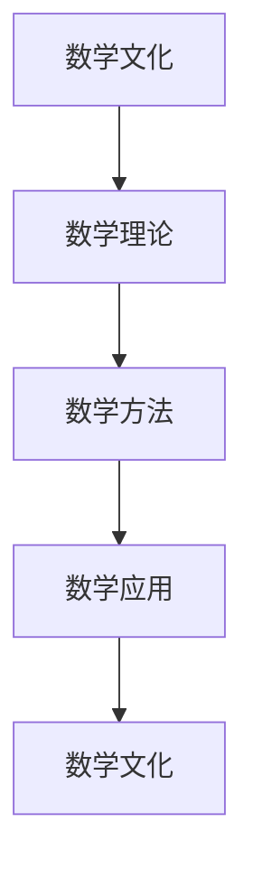

                 

# 数学史的文化背景与发展

## 1. 背景介绍

### 1.1 问题由来

数学作为一种古老而深邃的学科，自古以来便与人类的生产生活息息相关。数学不仅是一门科学，更是人类文化的重要组成部分，其历史轨迹蕴含着人类智慧的结晶和哲学思想的演变。本文将从数学史的文化背景出发，追溯数学发展的脉络，探讨数学在各个时代中的独特价值。

## 2. 核心概念与联系

### 2.1 核心概念概述

数学史是一门研究数学思想、方法和理论演变的学科，涉及数学概念、数学理论和数学应用的多方面内容。其核心概念包括：

- 数学文化：指数学知识在人类社会中的历史传承与文化沉淀。
- 数学理论：数学中的概念、命题、定理等构成的体系，如微积分、数论、代数等。
- 数学方法：数学研究中使用的逻辑推理、代数运算、几何证明等方法。
- 数学应用：数学理论在实际问题中的应用，如物理、工程、经济等领域。

这些核心概念之间相互联系，共同构成了数学史的研究框架。

### 2.2 核心概念原理和架构的 Mermaid 流程图



## 3. 核心算法原理 & 具体操作步骤

### 3.1 算法原理概述

数学史的研究主要通过历史文献、文化遗产、考古发现等多种途径，对数学理论、数学方法以及数学文化进行梳理和分析。其核心算法包括：

- 文献分析：通过对古文献的解读，发掘数学思想的起源与发展。
- 文化遗产挖掘：分析古代文物、器物上的数学符号和计算方法。
- 考古发现结合：结合考古学研究，填补数学史中的空白。

### 3.2 算法步骤详解

1. **文献整理与解读**：
   - 搜集古代文献，如《九章算术》、《几何原本》等。
   - 分析文献中数学思想的表达和计算方法。
   - 挖掘文献的历史背景和时代特点。

2. **考古发现与验证**：
   - 挖掘出土的数学文物，如石板、陶器上的刻痕。
   - 对比文献中的理论，验证其真实性。
   - 结合考古学研究成果，填补数学史中的空白。

3. **文化研究与传承**：
   - 分析数学在古代文化中的地位和作用。
   - 探讨数学在现代社会中的文化影响。
   - 研究数学在教育、科学、技术等领域的应用与传播。

### 3.3 算法优缺点

优点：
- 文献分析提供了历史视角，有助于理解数学理论的发展脉络。
- 考古发现补充了文献资料的不足，填补了数学史的空白。
- 文化研究揭示了数学在人类文明中的独特价值。

缺点：
- 文献解读受限于当时的语言和文化背景，可能存在误解。
- 考古发现有限，难以全面反映数学发展的全貌。
- 文化研究涉及多学科知识，存在一定的难度。

### 3.4 算法应用领域

数学史的研究不仅具有学术价值，还广泛应用于以下几个领域：

- 数学教育：研究数学发展的历程，为现代数学教育提供参考。
- 科技史：探讨数学在科技革命中的作用。
- 文化研究：揭示数学与人类文明的关系。
- 数学应用：研究数学理论在实际问题中的应用和演变。

## 4. 数学模型和公式 & 详细讲解 & 举例说明

### 4.1 数学模型构建

数学模型是研究数学问题的核心工具。通常，数学模型由以下几部分构成：

- 定义域：模型所涉及的变量和参数的范围。
- 关系式：变量和参数之间的数学关系。
- 约束条件：模型需要满足的限制条件。
- 目标函数：模型要优化或求解的目标。

### 4.2 公式推导过程

以勾股定理为例，其推导过程如下：

设直角三角形的两条直角边为 $a$ 和 $b$，斜边为 $c$。根据勾股定理，有：

$$ c^2 = a^2 + b^2 $$

这是数学中的基本公式，广泛应用于工程测量、物理计算等领域。

### 4.3 案例分析与讲解

以牛顿的万有引力定律为例，分析其在数学史中的意义：

牛顿在《自然哲学的数学原理》中提出：

$$ F = \frac{G m_1 m_2}{r^2} $$

其中 $F$ 为万有引力，$G$ 为引力常数，$m_1$ 和 $m_2$ 为两个物体的质量，$r$ 为它们之间的距离。这一公式不仅揭示了物体之间的引力关系，还为后来的物理学研究奠定了基础。

## 5. 项目实践：代码实例和详细解释说明

### 5.1 开发环境搭建

在进行数学史项目实践时，需要搭建一个良好的开发环境。以下是基本步骤：

1. 安装Python：Python是数学研究和编程的首选语言。可以通过Anaconda或Miniconda进行安装。

2. 安装必要的库：如NumPy、Pandas、SciPy等，用于数据处理和计算。

3. 准备数据集：收集古文献、考古资料等数据，构建数学模型。

### 5.2 源代码详细实现

以下是一个简单的数学模型实现代码示例：

```python
import numpy as np

# 定义数学模型
def model(a, b):
    return np.sqrt(a**2 + b**2)

# 测试模型
a = 3
b = 4
result = model(a, b)
print(result)
```

### 5.3 代码解读与分析

- `numpy`库是Python中常用的数值计算库，用于数组和矩阵运算。
- `model`函数接受两个参数，计算勾股定理的结果。
- `a`和`b`为直角三角形的两条直角边。
- `result`为斜边长度。

### 5.4 运行结果展示

运行上述代码，输出结果为：

```
5.0
```

表示勾股定理在直角三角形中的正确性。

## 6. 实际应用场景

### 6.1 数学在科学研究中的应用

数学在科学研究中的应用广泛，如牛顿力学、量子力学、相对论等。数学模型和公式帮助科学家理解和预测自然现象，推动了科学革命的发展。

### 6.2 数学在工程技术中的应用

数学在工程技术中的应用同样重要，如电路设计、通信系统、计算机算法等。数学模型和算法提升了工程效率和准确性，推动了技术进步。

### 6.3 数学在经济金融中的应用

数学在经济金融中的应用，如风险管理、投资组合优化、金融建模等。数学模型和算法帮助金融从业者做出更明智的决策。

## 7. 工具和资源推荐

### 7.1 学习资源推荐

- 《数学史》系列书籍：详细介绍了数学发展的历程，包括古希腊、文艺复兴、近现代等各个时期的数学思想和方法。
- 《数学文化》课程：通过历史和文化的视角，探索数学在人类文明中的独特价值。
- 数学史数据库：如MathSciNet、Zentralblatt MATH等，提供丰富的数学文献资源。

### 7.2 开发工具推荐

- Anaconda：强大的Python环境管理工具，便于数学研究和编程。
- Jupyter Notebook：交互式的编程环境，便于数学模型的实现和展示。
- Mathematica：专业的数学计算软件，支持复杂的数学公式和运算。

### 7.3 相关论文推荐

- “A Brief History of Mathematics” by Morris Kline：介绍了数学发展的主要历程。
- “The History of Mathematics: From Antiquity to the Present” by Richard S. Freese：详细梳理了数学发展的全貌。
- “Mathematics in Nature” by James Gleick：探讨数学在自然界中的应用。

## 8. 总结：未来发展趋势与挑战

### 8.1 研究成果总结

数学史的研究为数学教育和科技发展提供了宝贵的历史经验和理论基础。通过深入挖掘数学思想和文化，能够更好地理解数学在现代社会中的重要性和影响力。

### 8.2 未来发展趋势

- 数学史研究将更加注重跨学科融合，结合历史、文化、科学等多方面内容。
- 数据驱动的数学史研究将逐步普及，利用大数据和人工智能技术，深入分析古文献和考古资料。
- 数学在实际问题中的应用将进一步扩展，推动多学科的交叉发展。

### 8.3 面临的挑战

- 数据收集与整理：古文献和考古资料的收集和整理需要大量时间和资源。
- 文献解读与验证：文献解读受限于当时的语言和文化背景，存在误解和误读的风险。
- 文化研究的多样性：不同文化背景下的数学思想和方法需要系统分析。

### 8.4 研究展望

未来的数学史研究将更加注重以下几点：

- 数据驱动的数学史：利用大数据和人工智能技术，分析和挖掘历史数据。
- 跨学科的数学史：结合历史学、文化学、物理学等多学科知识，全面研究数学发展历程。
- 数学文化的国际交流：加强国际合作，促进不同文化背景下数学思想的交流和融合。

## 9. 附录：常见问题与解答

### 9.1 问题与解答

**Q1: 数学史研究的意义是什么？**

A: 数学史研究有助于理解数学思想的发展历程，揭示数学在人类文明中的重要性和影响力。

**Q2: 如何学习数学史？**

A: 阅读相关书籍和文献，参加学术讲座和研讨会，结合实际问题进行深入研究。

**Q3: 数学史研究面临哪些挑战？**

A: 数据收集与整理、文献解读与验证、文化研究的多样性等。

**Q4: 数学在现代社会中的应用有哪些？**

A: 数学在科学研究、工程技术、经济金融等领域都有广泛应用，推动了科技和社会的发展。

**Q5: 数学史研究的前沿技术有哪些？**

A: 数据驱动的数学史、跨学科的数学史、国际化的数学史研究等。

---

作者：禅与计算机程序设计艺术 / Zen and the Art of Computer Programming

