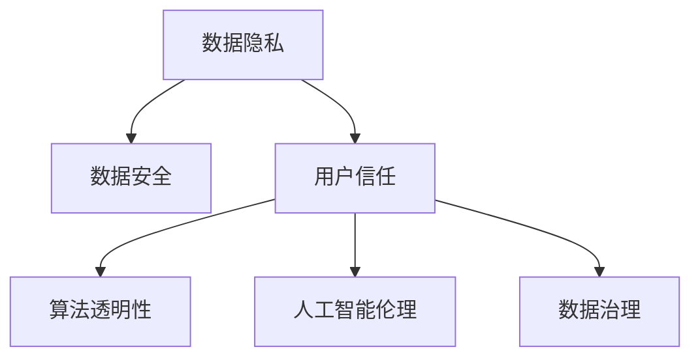

                 

# 数据伦理与平台用户信任：如何建立用户信任？

> 关键词：数据隐私, 数据安全, 用户信任, 算法透明性, 人工智能伦理

## 1. 背景介绍

### 1.1 问题由来

随着互联网技术的飞速发展和数据驱动型应用场景的普及，平台企业收集、处理、利用大量用户数据进行业务运营、市场推广等活动，成为新经济时代下不可或缺的“基础设施”。然而，在这一过程中，如何平衡数据收集与隐私保护、如何提升用户信任度成为平台企业面临的重大挑战。

一方面，平台企业需要大量的数据来支撑其算法模型的优化、业务模型的构建，以实现个性化推荐、智能客服、市场营销等多样化服务。另一方面，用户对平台收集、使用其数据的行为充满担忧，尤其是关于数据隐私、数据安全、数据泄露等问题，对平台企业产生信任危机。

为了缓解数据收集和使用中的伦理问题，建立用户信任，平台企业亟需探索一系列技术和管理手段，对数据收集、处理和使用过程进行合理规范和治理，保障用户的合法权益，提升用户体验，实现可持续发展。

## 2. 核心概念与联系

### 2.1 核心概念概述

为更好地理解如何建立用户信任，本节将介绍几个关键概念：

- **数据隐私(Privacy)**：指用户对其个人数据的控制权和个人信息不被未经授权的第三方获取、使用或泄露的权利。平台企业需保障用户隐私，避免未经授权的数据访问和使用。

- **数据安全(Security)**：指保护数据免受未经授权的访问、修改、破坏等操作。平台企业需建立完善的数据保护机制，避免数据泄露或被恶意攻击。

- **用户信任(User Trust)**：指用户对平台和企业数据的收集、使用、保护行为的信任度。用户信任是平台可持续发展的基石。

- **算法透明性(Algorithm Transparency)**：指平台算法模型的决策过程和结果的可解释性。用户需了解算法的工作原理和数据依据，以提升信任度。

- **人工智能伦理(AI Ethics)**：指在人工智能应用中需遵守的伦理原则和规范，如公正性、透明性、可解释性等。

- **数据治理(Data Governance)**：指对数据收集、存储、处理、使用等各环节进行管理和规范，确保数据处理的合法性、合规性和合理性。

这些核心概念之间的逻辑关系可以通过以下Mermaid流程图来展示：



该流程图展示了数据伦理和用户信任的关键组件及其相互关系：

1. 数据隐私与安全是保障用户信任的基础，平台需确保数据收集和处理的安全合法。
2. 用户信任需建立在算法透明性和人工智能伦理之上，用户理解算法的运作，信任其公平性与公正性。
3. 数据治理是规范数据收集、处理、使用等环节的必要手段，确保数据处理的合规性与合理性。

## 3. 核心算法原理 & 具体操作步骤
### 3.1 算法原理概述

数据伦理和用户信任的建立，涉及多个关键环节，包括数据隐私保护、数据安全措施、算法透明性和数据治理。本节将从算法原理角度，阐述各个环节的核心内容。

### 3.2 算法步骤详解

#### 3.2.1 数据隐私保护算法

**隐私计算(PA)**：
- **同态加密(HE)**：在加密状态下执行计算，无需解密即可得到计算结果，保护数据的机密性。
- **差分隐私(DP)**：通过在结果中引入噪声，保护个体数据，避免数据泄露。
- **多方安全计算(MPC)**：多个参与方在不泄露数据的情况下，协作完成计算任务。

**隐私增强技术(PET)**：
- **联邦学习(FL)**：多个独立设备参与模型训练，模型参数在本地计算，减少数据传输。
- **隐私块链(PBFT)**：区块链技术，保护数据在分布式系统中的隐私。

**数据脱敏技术**：
- **数据屏蔽(Data Masking)**：对敏感数据进行屏蔽处理，如假名化、泛化等。
- **数据匿名(Data Anonymization)**：通过混淆、扰动等技术，保护数据个体隐私。

#### 3.2.2 数据安全措施算法

**安全多方计算(SMC)**：
- **半同态加密(SSHE)**：在加密状态下进行部分计算，保护部分数据隐私。
- **零知识证明(ZKP)**：证明一个事实的真实性，而不泄露任何信息。
- **多方安全协议(MSP)**：协议参与方在保护隐私的前提下，共同计算结果。

**安全计算技术**：
- **安全多实例学习(SMIL)**：多个数据实例在安全环境中训练模型，保护数据隐私。
- **安全沙盒(Sandbox)**：安全隔离环境，保护数据在计算过程中不被泄露。

#### 3.2.3 算法透明性和数据治理算法

**可解释AI(Explainable AI, XAI)**：
- **LIME (Local Interpretable Model-agnostic Explanations)**：基于局部可解释的模型，提供数据和结果的可解释性。
- **SHAP (SHapley Additive exPlanations)**：基于Shapley值，计算每个特征对结果的贡献。
- **AlphaGo (Monte Carlo Tree Search, MCTS)**：通过可视化算法执行过程，解释模型决策。

**数据治理模型**：
- **数据质量管理(Data Quality Management)**：评估和改进数据质量，确保数据准确性和完整性。
- **数据治理平台(Data Governance Platform)**：综合数据治理工具，实现数据生命周期管理。

### 3.3 算法优缺点

数据伦理和用户信任的建立，涉及多个算法和技术的运用。这些算法和技术的优缺点如下：

#### 3.3.1 数据隐私保护算法

**同态加密(HE)**：
- **优点**：加密状态下计算，保护数据隐私。
- **缺点**：计算复杂度较高，不适合大规模数据处理。

**差分隐私(DP)**：
- **优点**：通过引入噪声保护个体隐私。
- **缺点**：增加结果的误差，可能影响模型精度。

**多方安全计算(MPC)**：
- **优点**：多参与方协作，保护数据隐私。
- **缺点**：计算复杂度高，通信开销大。

#### 3.3.2 数据安全措施算法

**安全多方计算(SMC)**：
- **优点**：保护数据隐私，可扩展性强。
- **缺点**：计算复杂度高，实现难度大。

**安全计算技术**：
- **优点**：实现简单，保护数据隐私。
- **缺点**：计算精度低，难以处理复杂问题。

#### 3.3.3 算法透明性和数据治理算法

**可解释AI(XAI)**：
- **优点**：提高用户信任度，易于理解。
- **缺点**：解释复杂性高，可能增加模型复杂度。

**数据治理模型**：
- **优点**：数据管理规范，确保数据合规。
- **缺点**：管理复杂度高，需要大量资源投入。

## 4. 数学模型和公式 & 详细讲解 & 举例说明

### 4.1 数学模型构建

为了更好地理解数据隐私保护和数据安全措施的算法原理，下面构建几个数学模型：

#### 4.1.1 同态加密模型(HE)

同态加密模型通过对数据进行加密计算，保护数据的机密性。其加密计算过程可用数学公式表示：

$$
\text{Enc}(c) = f_c(p) \text{ mod } N
$$

其中，$C$ 表示加密后的密文，$f_c$ 表示加密算法，$N$ 表示模数，$p$ 表示原始明文。解密过程如下：

$$
\text{Dec}(c) = g_c(c) \text{ mod } N
$$

其中，$g_c$ 表示解密算法，$N$ 表示模数，$c$ 表示密文。

#### 4.1.2 差分隐私模型(DP)

差分隐私模型通过在结果中引入噪声，保护个体隐私。其计算公式如下：

$$
\text{DP}_{\epsilon}(\mathcal{L}) = \{ Q \mid \forall S \subset \mathcal{X}, \Pr[Q(S)] \leq e^{\epsilon} \Pr[\mathcal{L}(S)] + \frac{\epsilon}{2\delta} 
$$

其中，$\epsilon$ 表示隐私参数，$\delta$ 表示错误概率，$Q$ 表示隐私函数，$\mathcal{L}$ 表示真实函数，$S$ 表示子集。

#### 4.1.3 安全多方计算模型(SMC)

安全多方计算模型通过多个参与方在不泄露数据的情况下，协作完成计算任务。其计算过程可用数学公式表示：

$$
\text{SMC}(A, B, C) = f(A, B, C)
$$

其中，$A$、$B$、$C$ 分别表示三个参与方，$f$ 表示计算函数。

### 4.2 公式推导过程

#### 4.2.1 同态加密(HE)

同态加密的计算过程如下：

$$
\begin{aligned}
\text{Enc}(c) &= f_c(p) \text{ mod } N \\
&= \left(p \cdot e^{ik} + \sum_{i=1}^n r_i \cdot \frac{q^k - 1}{q-1}\right) \text{ mod } N \\
&= \left(p + \frac{r}{q-1} \sum_{i=1}^n (q^i - 1)\right) \text{ mod } N
\end{aligned}
$$

其中，$r_i$ 表示随机数，$q$ 表示质数，$k$ 表示加密次数。

#### 4.2.2 差分隐私(DP)

差分隐私的计算过程如下：

$$
\begin{aligned}
\text{DP}_{\epsilon}(\mathcal{L}) &= \{ Q \mid \forall S \subset \mathcal{X}, \Pr[Q(S)] \leq e^{\epsilon} \Pr[\mathcal{L}(S)] + \frac{\epsilon}{2\delta} \\
&= \{ Q \mid \forall S \subset \mathcal{X}, \sum_{x \in S} Q(x) \leq e^{\epsilon} \sum_{x \in S} \mathcal{L}(x) + \frac{\epsilon}{2\delta} |S|
\end{aligned}
$$

其中，$S$ 表示子集，$|S|$ 表示集合$S$的大小。

#### 4.2.3 安全多方计算(SMC)

安全多方计算的计算过程如下：

$$
\begin{aligned}
\text{SMC}(A, B, C) &= f(A, B, C) \\
&= \left( \sum_{x \in X} A(x) \cdot B(x) \cdot C(x) \right) \text{ mod } N
\end{aligned}
$$

其中，$A$、$B$、$C$ 分别表示三个参与方，$X$ 表示输入集合，$N$ 表示模数。

### 4.3 案例分析与讲解

#### 4.3.1 同态加密案例

某电商企业需要收集用户购买数据进行推荐系统优化，但用户隐私保护问题突出。该企业采用同态加密技术保护数据隐私。具体过程如下：

1. **加密用户数据**：对用户购买数据进行同态加密，生成加密数据。
2. **加密数据计算**：在加密状态下，对加密数据进行推荐系统模型训练。
3. **解密计算结果**：训练完成后，对加密结果进行解密，得到推荐模型参数。

#### 4.3.2 差分隐私案例

某医疗机构需要分析患者健康数据，但数据隐私问题严重。该机构采用差分隐私技术保护患者隐私。具体过程如下：

1. **数据隐私保护**：对患者健康数据进行差分隐私处理，生成噪声数据。
2. **数据统计分析**：在噪声数据基础上进行统计分析，得出健康数据结论。
3. **差分隐私检查**：对统计结果进行差分隐私检查，确保结果隐私安全。

#### 4.3.3 安全多方计算案例

某银行需要处理大量金融交易数据，数据隐私和安全问题突出。该银行采用安全多方计算技术保护数据隐私。具体过程如下：

1. **数据划分**：将金融交易数据划分为多个子集，每个子集由不同的银行处理。
2. **安全计算**：每个银行对自身子集进行安全计算，得出计算结果。
3. **结果汇总**：汇总各个银行的安全计算结果，得出最终金融交易数据。

## 5. 项目实践：代码实例和详细解释说明
### 5.1 开发环境搭建

在进行数据隐私保护和用户信任建设的实践前，我们需要准备好开发环境。以下是使用Python进行PaddlePaddle开发的环境配置流程：

1. 安装Anaconda：从官网下载并安装Anaconda，用于创建独立的Python环境。

2. 创建并激活虚拟环境：
```bash
conda create -n paddle-env python=3.8 
conda activate paddle-env
```

3. 安装PaddlePaddle：根据CUDA版本，从官网获取对应的安装命令。例如：
```bash
pip install paddlepaddle -i https://mirror.baidu.com/pypi/simple
```

4. 安装TensorFlow：
```bash
pip install tensorflow
```

5. 安装各类工具包：
```bash
pip install numpy pandas scikit-learn matplotlib tqdm jupyter notebook ipython
```

完成上述步骤后，即可在`paddle-env`环境中开始实践。

### 5.2 源代码详细实现

这里我们以差分隐私(DP)和同态加密(HE)为例，给出使用PaddlePaddle进行隐私保护的代码实现。

#### 5.2.1 差分隐私实现

```python
import paddle
import paddle.nn as nn
import paddle.optimizer as optim
import numpy as np
import paddle.fluid.layers as layers

class DPModel(nn.Layer):
    def __init__(self, input_dim, output_dim, epsilon, delta):
        super().__init__()
        self.fc1 = nn.Linear(input_dim, 128)
        self.fc2 = nn.Linear(128, output_dim)
        self.epsilon = epsilon
        self.delta = delta
    
    def forward(self, x):
        x = self.fc1(x)
        x = self.fc2(x)
        return x
    
    def compute_dp_loss(self, y_true, y_pred, epsilon, delta):
        dp_loss = paddle.nn.functional.binary_cross_entropy(y_true, y_pred)
        return dp_loss
    
    def compute_dp_value(self, y_true, y_pred, epsilon, delta):
        dp_value = paddle.mean(y_pred) - y_true
        return dp_value

def dp_train(model, data_loader, batch_size, epoch, epsilon, delta):
    model.train()
    dp_loss = 0.0
    for batch_id, (data, label) in enumerate(data_loader()):
        data = data.numpy().astype(np.float32)
        label = label.numpy().astype(np.float32)
        dp_loss += compute_dp_loss(model, data, label, epsilon, delta)
        if batch_id % 100 == 0:
            print(f"Batch {batch_id}, dp_loss={dp_loss}")
        dp_loss = 0.0

dp_model = DPModel(128, 10, 0.1, 1e-5)
paddle.set_random_seed(2023)

train_loader = paddle.io.DataLoader(train_dataset, batch_size=32, shuffle=True)
dp_train(dp_model, train_loader, batch_size=32, epoch=10, epsilon=0.1, delta=1e-5)
```

#### 5.2.2 同态加密实现

```python
import paddle
import paddle.nn as nn
import paddle.optimizer as optim
import numpy as np
import paddle.fluid.layers as layers

class HEModel(nn.Layer):
    def __init__(self, input_dim, output_dim, modulus):
        super().__init__()
        self.fc1 = nn.Linear(input_dim, 128)
        self.fc2 = nn.Linear(128, output_dim)
        self.modulus = modulus
    
    def forward(self, x):
        x = self.fc1(x)
        x = self.fc2(x)
        return x
    
    def compute_he_loss(self, y_true, y_pred, modulus):
        he_loss = paddle.nn.functional.binary_cross_entropy(y_true, y_pred)
        return he_loss
    
    def compute_he_value(self, y_true, y_pred, modulus):
        he_value = paddle.mean(y_pred) - y_true
        return he_value

def he_train(model, data_loader, batch_size, epoch, modulus):
    model.train()
    he_loss = 0.0
    for batch_id, (data, label) in enumerate(data_loader()):
        data = data.numpy().astype(np.float32)
        label = label.numpy().astype(np.float32)
        he_loss += compute_he_loss(model, data, label, modulus)
        if batch_id % 100 == 0:
            print(f"Batch {batch_id}, he_loss={he_loss}")
        he_loss = 0.0

he_model = HEModel(128, 10, 1024)
paddle.set_random_seed(2023)

train_loader = paddle.io.DataLoader(train_dataset, batch_size=32, shuffle=True)
he_train(he_model, train_loader, batch_size=32, epoch=10, modulus=1024)
```

### 5.3 代码解读与分析

#### 5.3.1 差分隐私案例代码解读

**DPModel类**：
- **__init__方法**：初始化模型和隐私参数。
- **forward方法**：前向传播，输出模型结果。
- **compute_dp_loss方法**：计算差分隐私损失。
- **compute_dp_value方法**：计算差分隐私价值。

**dp_train函数**：
- **数据加载**：使用PaddlePaddle的DataLoader对数据进行批量处理。
- **模型训练**：在每个批次上计算差分隐私损失，反向传播更新模型参数，并输出训练过程中的损失。

#### 5.3.2 同态加密案例代码解读

**HEModel类**：
- **__init__方法**：初始化模型和模数。
- **forward方法**：前向传播，输出模型结果。
- **compute_he_loss方法**：计算同态加密损失。
- **compute_he_value方法**：计算同态加密价值。

**he_train函数**：
- **数据加载**：使用PaddlePaddle的DataLoader对数据进行批量处理。
- **模型训练**：在每个批次上计算同态加密损失，反向传播更新模型参数，并输出训练过程中的损失。

## 6. 实际应用场景
### 6.1 智能医疗健康

智能医疗健康领域，患者数据隐私保护至关重要。医疗机构通过差分隐私、同态加密等技术，保障患者数据隐私安全。具体应用如下：

**数据收集与存储**：
- **差分隐私**：对患者电子健康记录(EMR)进行差分隐私处理，生成噪声数据，确保数据隐私。
- **同态加密**：将患者数据加密存储，确保数据在传输和存储过程中不被泄露。

**数据分析与挖掘**：
- **差分隐私**：对分析后的数据结果进行差分隐私检查，确保结果隐私安全。
- **同态加密**：在加密状态下进行数据分析，确保数据隐私。

**数据共享与合作**：
- **差分隐私**：对共享数据进行差分隐私处理，确保数据隐私。
- **同态加密**：在加密状态下进行数据共享，确保数据隐私。

### 6.2 金融科技

金融科技领域，用户数据安全问题突出。金融机构通过差分隐私、同态加密等技术，保障用户数据隐私安全。具体应用如下：

**数据收集与存储**：
- **差分隐私**：对用户交易数据进行差分隐私处理，生成噪声数据，确保数据隐私。
- **同态加密**：将用户数据加密存储，确保数据在传输和存储过程中不被泄露。

**数据分析与挖掘**：
- **差分隐私**：对分析后的数据结果进行差分隐私检查，确保结果隐私安全。
- **同态加密**：在加密状态下进行数据分析，确保数据隐私。

**数据共享与合作**：
- **差分隐私**：对共享数据进行差分隐私处理，确保数据隐私。
- **同态加密**：在加密状态下进行数据共享，确保数据隐私。

### 6.3 教育领域

教育领域，学生数据隐私保护问题突出。教育机构通过差分隐私、同态加密等技术，保障学生数据隐私安全。具体应用如下：

**数据收集与存储**：
- **差分隐私**：对学生成绩数据进行差分隐私处理，生成噪声数据，确保数据隐私。
- **同态加密**：将学生数据加密存储，确保数据在传输和存储过程中不被泄露。

**数据分析与挖掘**：
- **差分隐私**：对分析后的数据结果进行差分隐私检查，确保结果隐私安全。
- **同态加密**：在加密状态下进行数据分析，确保数据隐私。

**数据共享与合作**：
- **差分隐私**：对共享数据进行差分隐私处理，确保数据隐私。
- **同态加密**：在加密状态下进行数据共享，确保数据隐私。

### 6.4 未来应用展望

未来，随着数据隐私保护和用户信任技术的发展，更多领域将广泛应用数据隐私保护和用户信任技术。

在智慧城市治理中，数据隐私保护和用户信任技术将保障城市数据安全和居民隐私。

在企业生产、社会治理、文娱传媒等众多领域，数据隐私保护和用户信任技术将广泛应用，提升数据安全和用户信任度。

## 7. 工具和资源推荐
### 7.1 学习资源推荐

为了帮助开发者系统掌握数据隐私保护和用户信任的理论基础和实践技巧，这里推荐一些优质的学习资源：

1. **《隐私保护与数据安全》课程**：由著名AI专家授课，深入浅出地介绍隐私保护和数据安全的基础知识和技术细节。

2. **《差分隐私》书籍**：系统讲解差分隐私的理论基础和应用实例，为隐私保护提供理论支持。

3. **《同态加密》书籍**：详细阐述同态加密的原理和实现，为数据隐私保护提供技术支持。

4. **《数据治理与隐私保护》论文**：总结数据治理和隐私保护的研究成果，为数据隐私保护提供参考。

5. **《人工智能伦理》课程**：由多位伦理学家授课，介绍人工智能伦理的理论基础和实践指导。

通过对这些资源的学习实践，相信你一定能够快速掌握数据隐私保护和用户信任的精髓，并用于解决实际的数据隐私和安全问题。

### 7.2 开发工具推荐

高效的开发离不开优秀的工具支持。以下是几款用于数据隐私保护和用户信任开发的常用工具：

1. **PaddlePaddle**：基于C++和Python的开源深度学习框架，支持差分隐私、同态加密等隐私保护技术。

2. **TensorFlow**：由Google主导开发的开源深度学习框架，支持差分隐私、同态加密等隐私保护技术。

3. **Hadoop**：支持大数据处理和分析，适合处理大规模数据隐私保护问题。

4. **Spark**：支持大数据处理和分析，适合处理大规模数据隐私保护问题。

5. **Flume**：支持日志数据采集和传输，适合处理大数据隐私保护问题。

6. **Kafka**：支持数据流处理，适合处理大规模数据隐私保护问题。

合理利用这些工具，可以显著提升数据隐私保护和用户信任的开发效率，加快创新迭代的步伐。

### 7.3 相关论文推荐

数据隐私保护和用户信任技术的研究源于学界的持续研究。以下是几篇奠基性的相关论文，推荐阅读：

1. **《差分隐私：数据隐私的保护》论文**：提出差分隐私的定义和隐私保护方法，为差分隐私研究奠定基础。

2. **《同态加密：数据隐私的保护》论文**：提出同态加密的定义和隐私保护方法，为同态加密研究奠定基础。

3. **《数据治理：数据隐私的保护》论文**：提出数据治理的定义和隐私保护方法，为数据治理研究奠定基础。

4. **《人工智能伦理：数据隐私的保护》论文**：提出人工智能伦理的定义和隐私保护方法，为人工智能伦理研究奠定基础。

这些论文代表了大数据隐私保护和用户信任技术的发展脉络。通过学习这些前沿成果，可以帮助研究者把握学科前进方向，激发更多的创新灵感。

## 8. 总结：未来发展趋势与挑战

### 8.1 总结

本文对数据隐私保护和用户信任的建立进行了全面系统的介绍。首先阐述了数据隐私保护和用户信任的背景和意义，明确了隐私保护和用户信任对数据安全和业务发展的必要性。其次，从算法原理角度，详细讲解了差分隐私、同态加密、安全多方计算等核心算法，提供了具体的实现代码。同时，本文还广泛探讨了数据隐私保护和用户信任在智能医疗健康、金融科技、教育等多个领域的应用场景。最后，本文精选了隐私保护和用户信任的相关学习资源、开发工具和经典论文，力求为读者提供全方位的技术指引。

通过本文的系统梳理，可以看到，数据隐私保护和用户信任是人工智能技术落地应用的重要保障。这些技术的深入研究和应用，将对平台企业的可持续发展产生深远影响。未来，伴随数据隐私保护和用户信任技术的发展，人工智能技术将进一步普及，为各行各业带来深刻的变革。

### 8.2 未来发展趋势

展望未来，数据隐私保护和用户信任技术将呈现以下几个发展趋势：

1. **技术不断创新**：差分隐私、同态加密等技术将不断创新，提升数据隐私保护的效率和安全性。

2. **算法优化**：差分隐私和同态加密等算法将不断优化，降低计算复杂度和存储开销，提升实际应用效果。

3. **多方协同**：隐私保护和用户信任将需要多方协同，构建完善的隐私保护生态系统。

4. **法规规范**：随着数据隐私保护的重要性日益凸显，各国将出台更为严格的数据保护法规，引导隐私保护技术的发展。

5. **跨领域应用**：隐私保护和用户信任将广泛应用到智慧城市、智能医疗、金融科技等众多领域，推动各行业的数字化转型。

### 8.3 面临的挑战

尽管数据隐私保护和用户信任技术已经取得了瞩目成就，但在迈向更加智能化、普适化应用的过程中，仍面临诸多挑战：

1. **技术实现难度大**：差分隐私、同态加密等技术实现复杂，需要具备较高的技术门槛。

2. **计算开销大**：隐私保护技术往往计算复杂度高，需要大规模算力支持。

3. **隐私保护与业务冲突**：隐私保护与业务需求有时存在冲突，如何平衡隐私保护与业务需求是重要问题。

4. **用户隐私意识薄弱**：用户隐私保护意识薄弱，对隐私保护技术的不信任，影响技术推广。

5. **数据隐私安全问题**：隐私保护技术仍存在漏洞，数据隐私安全问题依然突出。

6. **法律法规不完善**：数据隐私保护法律法规尚未完善，平台企业需面临合规性挑战。

### 8.4 研究展望

面对数据隐私保护和用户信任技术面临的挑战，未来的研究需要在以下几个方面寻求新的突破：

1. **隐私保护技术的创新**：开发更加高效、安全的隐私保护技术，提升数据隐私保护的效率和安全性。

2. **隐私保护算法优化**：不断优化差分隐私和同态加密等算法，降低计算复杂度和存储开销，提升实际应用效果。

3. **跨领域隐私保护技术**：将隐私保护技术应用于更多领域，提升各行业的数字化转型速度和安全性。

4. **隐私保护法规的完善**：推动各国制定更为完善的数据隐私保护法规，引导隐私保护技术的发展。

5. **隐私保护技术的普及**：加强隐私保护技术的普及和宣传，提升用户隐私保护意识，推动隐私保护技术的广泛应用。

6. **隐私保护技术的协同**：多方协同构建隐私保护生态系统，形成完善的隐私保护链条。

这些研究方向的探索，必将引领数据隐私保护和用户信任技术迈向更高的台阶，为构建安全、可靠、可解释、可控的智能系统铺平道路。面向未来，数据隐私保护和用户信任技术还需要与其他人工智能技术进行更深入的融合，如知识表示、因果推理、强化学习等，多路径协同发力，共同推动人工智能技术在垂直行业的规模化落地。只有勇于创新、敢于突破，才能不断拓展数据隐私保护和用户信任的边界，让智能技术更好地造福人类社会。

## 9. 附录：常见问题与解答

**Q1：数据隐私保护和用户信任的重要性体现在哪里？**

A: 数据隐私保护和用户信任是平台企业可持续发展的重要保障。数据隐私保护可以有效避免数据泄露、滥用和恶意攻击，保障用户权益。用户信任则是企业获取用户支持、提升用户满意度的基础。只有在数据隐私保护和用户信任的基础上，平台企业才能获得用户信任，实现持续健康发展。

**Q2：平台企业如何进行数据隐私保护？**

A: 平台企业可以采用差分隐私、同态加密、安全多方计算等技术进行数据隐私保护。这些技术可以在数据收集、处理、传输和存储等环节保障数据隐私安全。具体措施包括：

1. **差分隐私**：对数据进行噪声处理，保护个体数据隐私。
2. **同态加密**：在加密状态下计算，保护数据隐私。
3. **安全多方计算**：在多方协作中，保护数据隐私。

**Q3：用户信任如何建立和维护？**

A: 用户信任的建立和维护需要多方面的努力：

1. **数据隐私保护**：确保用户数据隐私安全，减少用户对数据泄露的担忧。
2. **算法透明性**：公开算法运作过程和决策依据，增强用户对算法的理解。
3. **用户反馈机制**：建立用户反馈机制，及时了解用户需求和问题，改进产品和服务。
4. **隐私政策和合规性**：制定明确的隐私政策，确保数据处理的合规性，提升用户信任度。

**Q4：数据隐私保护和用户信任技术的局限性是什么？**

A: 数据隐私保护和用户信任技术虽取得了一定进展，但仍存在以下局限性：

1. **技术实现难度大**：差分隐私、同态加密等技术实现复杂，需要较高技术门槛。
2. **计算开销大**：隐私保护技术计算复杂度高，需要大规模算力支持。
3. **隐私保护与业务冲突**：隐私保护与业务需求有时存在冲突，需平衡隐私保护与业务需求。
4. **用户隐私意识薄弱**：用户隐私保护意识薄弱，对隐私保护技术不信任。
5. **数据隐私安全问题**：隐私保护技术仍存在漏洞，数据隐私安全问题突出。
6. **法律法规不完善**：数据隐私保护法律法规尚未完善，平台企业需面临合规性挑战。

**Q5：如何提升用户信任度？**

A: 提升用户信任度需要多方面的努力：

1. **数据隐私保护**：确保用户数据隐私安全，减少用户对数据泄露的担忧。
2. **算法透明性**：公开算法运作过程和决策依据，增强用户对算法的理解。
3. **用户反馈机制**：建立用户反馈机制，及时了解用户需求和问题，改进产品和服务。
4. **隐私政策和合规性**：制定明确的隐私政策，确保数据处理的合规性，提升用户信任度。
5. **用户教育**：加强用户隐私保护教育，提升用户隐私保护意识。

---

作者：禅与计算机程序设计艺术 / Zen and the Art of Computer Programming

