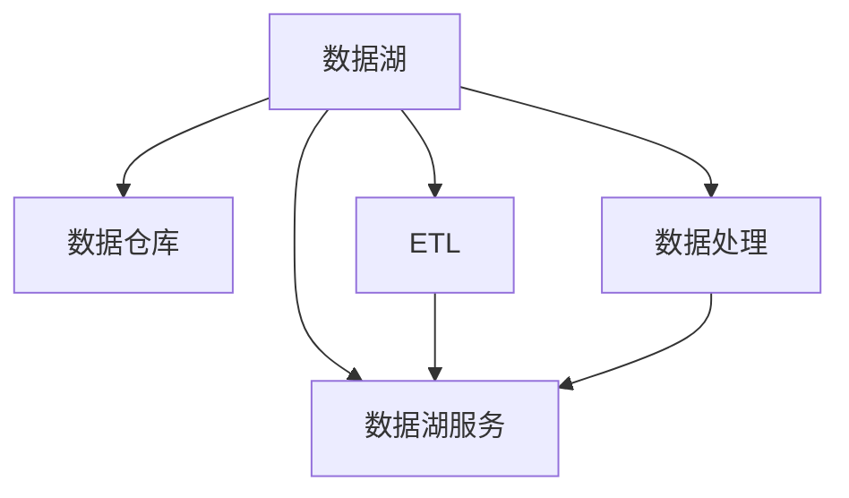

                 

# 数据湖架构：大规模数据存储和分析

在数字化时代，数据成为了驱动企业发展的关键资源。数据湖架构作为一种新兴的数据存储和处理技术，已成为各行各业信息技术体系的重要组成部分。本文旨在深入探讨数据湖架构的核心概念、关键算法及其在实际应用中的具体操作步骤，并给出相关学习资源和工具推荐，以期为读者提供全面的技术指引。

## 1. 背景介绍

### 1.1 问题由来

随着互联网的迅速发展和数字经济的高速增长，企业对数据的依赖日益加深。传统的关系型数据库（如MySQL、Oracle等）在处理结构化数据方面表现优异，但对于非结构化数据（如文本、图片、音频等）以及半结构化数据（如JSON、XML等）则显得力不从心。同时，随着业务需求的日益复杂和数据量的不断膨胀，传统数据库在扩展性和灵活性上亦难以满足需求。

因此，一种全新的数据存储和分析架构——数据湖架构应运而生。数据湖架构以大容量的存储空间和灵活的数据处理能力，支持多样化数据形态的存储和高效分析，成为现代数据管理的核心技术之一。

### 1.2 问题核心关键点

数据湖架构的核心思想是：将企业的数据以原始形式存储在可扩展的分布式存储系统中，然后通过数据集成、处理和分析等技术手段，构建数据服务层，支持数据的存储、管理和应用。

数据湖架构的关键点包括：

- **数据湖存储：** 采用分布式文件系统（如Hadoop HDFS、Amazon S3等）存储海量数据。
- **数据集成：** 通过ETL（Extract, Transform, Load）等技术，将不同来源的数据整合到数据湖中。
- **数据处理：** 利用大数据处理引擎（如Hadoop MapReduce、Spark等）进行高效的数据处理和分析。
- **数据服务：** 通过API、SQL等形式提供数据服务，支持数据查询、数据建模、数据挖掘等应用。

## 2. 核心概念与联系

### 2.1 核心概念概述

为更好地理解数据湖架构，本节将介绍几个密切相关的核心概念：

- **数据湖（Data Lake）：** 一种全新的数据管理架构，以大容量的存储和灵活的数据处理能力，支持多样化数据形态的存储和高效分析。
- **数据仓库（Data Warehouse）：** 一种以关系型数据库为基础的数据存储和分析架构，以结构化数据为主，适合于事务驱动的决策支持。
- **ETL（Extract, Transform, Load）：** 数据集成的一种常用方法，包括数据抽取、数据转换和数据加载三个步骤，用于将异构数据源的数据整合到数据湖中。
- **数据湖治理：** 对数据湖中的数据进行规范、监控和治理，确保数据质量和安全。
- **数据湖服务：** 通过API、SQL等形式提供数据服务，支持数据的查询、分析、建模和挖掘等应用。

这些核心概念之间的逻辑关系可以通过以下Mermaid流程图来展示：



这个流程图展示了大数据湖架构的各个组成部分及其之间的关系：

1. 数据湖以大容量的存储空间和灵活的数据处理能力，支持多样化数据形态的存储和高效分析。
2. 数据仓库以结构化数据为主，适合于事务驱动的决策支持。
3. ETL用于将异构数据源的数据整合到数据湖中。
4. 数据处理引擎进行高效的数据处理和分析。
5. 数据湖服务通过API、SQL等形式提供数据服务，支持数据的查询、分析、建模和挖掘等应用。

这些概念共同构成了数据湖架构的基础框架，使其能够在各种场景下发挥其强大的数据存储和处理能力。

## 3. 核心算法原理 & 具体操作步骤
### 3.1 算法原理概述

数据湖架构的核心算法原理涉及数据的存储、集成、处理和分析等多个环节。其中，数据的存储和处理算法是数据湖架构的技术核心，主要包括：

- **分布式文件系统（如Hadoop HDFS、Amazon S3等）：** 用于存储海量数据的分布式文件系统，能够通过多节点协同工作，实现大容量数据的存储和高效读写。
- **大数据处理引擎（如Hadoop MapReduce、Spark等）：** 用于高效处理和分析海量数据的分布式计算框架，支持复杂的数据处理任务和高级的数据分析算法。

数据湖架构的操作步骤通常包括以下几个关键环节：

1. **数据存储：** 将数据按照原始形式存储在分布式文件系统中，确保数据的完整性和一致性。
2. **数据集成：** 通过ETL等技术手段，将异构数据源的数据整合到数据湖中。
3. **数据处理：** 利用大数据处理引擎进行高效的数据处理和分析。
4. **数据服务：** 通过API、SQL等形式提供数据服务，支持数据的查询、分析、建模和挖掘等应用。

### 3.2 算法步骤详解

数据湖架构的实现过程一般包括以下几个关键步骤：

**Step 1: 准备数据湖存储**
- 选择合适的分布式文件系统（如Hadoop HDFS、Amazon S3等）作为数据湖的存储引擎。
- 配置数据湖的存储容量和冗余度，确保数据存储的可靠性和安全性。

**Step 2: 添加数据集成工具**
- 选择合适的ETL工具（如Apache Nifi、Talend等），用于将异构数据源的数据整合到数据湖中。
- 设计数据清洗、转换和加载（ETL）流程，确保数据的准确性和完整性。

**Step 3: 设置数据处理引擎**
- 选择合适的分布式计算框架（如Hadoop MapReduce、Spark等），进行高效的数据处理和分析。
- 设计数据处理算法，如MapReduce、Spark Streaming等，进行大规模数据处理。

**Step 4: 添加数据服务层**
- 设计API、SQL等形式的数据服务接口，支持数据的查询、分析和建模。
- 开发数据服务组件，实现数据的实时查询、数据挖掘和数据可视化等应用。

**Step 5: 部署与监控**
- 将数据湖架构部署到生产环境，确保数据的稳定性和可用性。
- 配置监控和告警机制，实时监控数据湖的运行状态，确保系统的稳定性和安全性。

### 3.3 算法优缺点

数据湖架构具有以下优点：

1. **支持多样化数据存储：** 支持存储结构化、半结构化和非结构化数据，能够满足不同数据形态的需求。
2. **弹性扩展能力：** 采用分布式存储和计算架构，能够轻松应对数据量的增长，支持大规模数据的存储和处理。
3. **灵活的数据处理能力：** 支持复杂的数据处理和高级数据分析算法，能够处理多种类型的数据分析任务。
4. **强大的数据服务能力：** 通过API、SQL等形式提供数据服务，支持数据的查询、分析、建模和挖掘等应用。

同时，该架构也存在一定的局限性：

1. **数据存储成本高：** 采用大容量的分布式存储系统，存储空间和存储成本较高。
2. **数据处理复杂：** 需要复杂的数据处理算法和高级的数据分析工具，对技术要求较高。
3. **数据治理难度大：** 数据湖中数据的规范、监控和治理需要严格的管理和监控机制，难度较大。
4. **数据服务接口复杂：** 数据服务的API、SQL等接口设计需要充分考虑应用的复杂性和多样性。

尽管存在这些局限性，但就目前而言，数据湖架构仍是数据管理领域的最佳实践之一。未来相关研究的重点在于如何进一步降低存储成本，提高数据处理的效率和灵活性，加强数据治理和服务的规范性和可用性。

### 3.4 算法应用领域

数据湖架构已经在金融、医疗、电商、政府等多个领域得到了广泛应用，为各行各业的数据管理和应用提供了强有力的支撑：

- **金融领域：** 通过数据湖架构，金融机构可以实时监控市场动态，进行风险评估和投资决策。
- **医疗领域：** 数据湖架构支持医疗数据的大规模存储和高效分析，有助于提升医疗研究和临床决策。
- **电商领域：** 通过数据湖架构，电商平台可以实时分析用户行为，优化推荐算法，提升用户体验。
- **政府领域：** 数据湖架构支持政府数据的整合和分析，有助于提升公共服务水平，优化政策制定。

除了上述这些经典应用外，数据湖架构还被创新性地应用到更多场景中，如智能制造、智慧城市、能源管理等，为各行各业带来了新的发展机遇。随着数据湖架构的不断演进，相信其在更多领域的应用将更加广泛，为数字经济的蓬勃发展提供坚实的技术支撑。

## 4. 数学模型和公式 & 详细讲解
### 4.1 数学模型构建

为了更好地理解数据湖架构的核心算法原理，本节将使用数学语言对数据湖架构进行更加严格的刻画。

假设数据湖中存储的数据量为 $D$，数据湖的存储容量为 $C$，分布式计算的并行度为 $P$，数据处理的效率为 $E$。则数据湖架构的总体性能可以表示为：

$$
\text{Performance} = \frac{D}{C} \times P \times E
$$

其中：

- $D$：数据湖中存储的数据量。
- $C$：数据湖的存储容量。
- $P$：分布式计算的并行度。
- $E$：数据处理的效率。

### 4.2 公式推导过程

以下我们以数据湖中数据的读取操作为例，推导数据读取时间 $T_{read}$ 的计算公式。

假设数据湖中存储的数据量为 $D$，数据块的大小为 $B$，数据块的读取速度为 $S$，分布式计算的并行度为 $P$，数据处理的效率为 $E$。则数据读取时间 $T_{read}$ 可以表示为：

$$
T_{read} = \frac{D}{B} \times \frac{1}{S} \times P \times E
$$

其中：

- $D$：数据湖中存储的数据量。
- $B$：数据块的大小。
- $S$：数据块的读取速度。
- $P$：分布式计算的并行度。
- $E$：数据处理的效率。

在得到数据读取时间的公式后，我们可以分析影响数据读取性能的关键因素，并进一步优化数据湖架构的设计。

### 4.3 案例分析与讲解

为了更好地理解数据湖架构的实际应用，我们可以以电商平台的实时数据分析为例进行详细讲解：

**案例背景：** 某电商平台需要对用户的浏览、购买行为进行实时分析，以优化推荐算法，提升用户体验。

**数据湖设计：**
- 使用Hadoop HDFS作为数据湖的存储引擎，存储用户浏览、购买等行为数据。
- 通过Apache Spark进行数据处理和分析，计算用户的兴趣点和行为特征。
- 设计API接口，供推荐系统实时调用数据服务，进行推荐优化。

**数据处理流程：**
1. 数据采集：通过API接口和日志采集系统，获取用户的浏览、购买行为数据。
2. ETL处理：使用Apache Nifi进行数据清洗、转换和加载（ETL），确保数据的准确性和完整性。
3. 数据存储：将处理后的数据存储到Hadoop HDFS中，确保数据的可扩展性和可用性。
4. 数据处理：使用Apache Spark进行数据处理和分析，计算用户的兴趣点和行为特征。
5. 数据服务：设计API接口，供推荐系统实时调用数据服务，进行推荐优化。

**性能分析：**
- 数据湖架构的总体性能可以表示为：$\text{Performance} = \frac{D}{C} \times P \times E$。
- 在实际应用中，可以通过优化数据块大小、提高数据处理效率等手段，进一步提升数据读取和处理的性能。
- 通过配置合适的分布式计算并行度，支持海量数据的实时处理和分析。

**优化措施：**
- 增加数据块大小：通过增加数据块的大小，减少数据读取次数，提升数据读取效率。
- 提高数据处理效率：通过优化数据处理算法和配置合适的计算资源，提高数据处理效率。
- 配置合适的分布式计算并行度：根据数据量和计算资源，合理配置分布式计算并行度，确保数据处理的稳定性。

## 5. 项目实践：代码实例和详细解释说明
### 5.1 开发环境搭建

在进行数据湖架构的实践前，我们需要准备好开发环境。以下是使用Python进行Apache Spark开发的开发环境配置流程：

1. 安装Apache Spark：从官网下载并安装Apache Spark，支持Hadoop HDFS、Amazon S3等数据源。

2. 配置Spark环境：设置Spark的核心参数，如主节点、从节点数量、资源分配等，确保Spark集群正常运行。

3. 安装依赖包：通过pip安装必要的Python依赖包，如pyspark、pyarrow等，支持数据的读取、转换和写入操作。

4. 设置集群环境：配置Hadoop HDFS、Amazon S3等数据源的访问权限和路径，确保数据湖架构能够正常读取和写入数据。

完成上述步骤后，即可在Spark集群中进行数据湖架构的开发和部署。

### 5.2 源代码详细实现

这里我们以电商平台的实时数据分析为例，给出使用Python进行Apache Spark开发的代码实现。

首先，定义数据湖的存储引擎：

```python
from pyspark.sql import SparkSession

spark = SparkSession.builder.appName("E-commerce Data Lake").getOrCreate()

# 配置Hadoop HDFS为数据湖的存储引擎
spark.conf.set("fs.defaultFS", "hdfs://namenode:9000")
spark.conf.set("fs.defaultFilesystem", "hdfs")

# 设置Hadoop HDFS访问权限和路径
spark.conf.set("fs.defaultFS", "s3n://s3-0-aws-us-west-2.amazonaws.com/ecommerce/data")
spark.conf.set("fs.defaultFilesystem", "s3")
```

然后，定义ETL处理流程：

```python
from pyspark.sql import functions as F

# 读取数据
df = spark.read.format("csv").option("header", "true").load("ecommerce_data.csv")

# ETL处理
df = df.select(F.col("timestamp"), F.col("user_id"), F.col("item_id"), F.col("click_count"))

# 数据清洗
df = df.dropna().filter(df.timestamp.isNotNull())

# 数据转换
df = df.withColumn("time", F.unix_timestamp(df.timestamp.cast("string"), "yyyy-MM-dd HH:mm:ss"))

# 数据加载
df.write.format("parquet").partitionBy("user_id").mode("overwrite").save("ecommerce_data_parquet")
```

接着，定义数据处理流程：

```python
# 读取数据
df = spark.read.format("parquet").load("ecommerce_data_parquet")

# 数据处理
from pyspark.sql.functions import col, when, udf

# 计算用户兴趣点
def calculate_user_interest(user_id, item_id):
    if col(item_id) in col(user_id):
        return 1
    else:
        return 0

udf_calculate_user_interest = udf(calculate_user_interest, "int")

# 数据转换
df = df.select(
    df.user_id,
    df.time,
    df.item_id,
    udf_calculate_user_interest(col(df.user_id), col(df.item_id)).alias("interest")
)

# 数据保存
df.write.format("parquet").partitionBy("user_id").mode("overwrite").save("ecommerce_data_interest_parquet")
```

最后，定义数据服务层：

```python
# 读取数据
df = spark.read.format("parquet").load("ecommerce_data_interest_parquet")

# 数据服务接口
def get_user_interest(user_id):
    return df.filter(df.user_id == user_id).select("interest").first()[0]

# 数据服务实现
user_interest_service = UserInterestService()

# 推荐系统调用数据服务
recommendation_system = RecommendationSystem(user_interest_service)
recommendation_system.update_recommendations(user_id)
```

以上就是使用Python进行Apache Spark开发数据湖架构的完整代码实现。可以看到，利用Apache Spark的强大计算能力和丰富的API接口，我们可以在Python中轻松构建和部署数据湖架构，实现数据的存储、处理和分析。

### 5.3 代码解读与分析

让我们再详细解读一下关键代码的实现细节：

**数据湖存储配置：**
- 使用`spark.conf.set`方法配置Hadoop HDFS和Amazon S3的访问权限和路径，确保数据湖架构能够正常读取和写入数据。

**ETL处理流程：**
- 使用`spark.read.format`方法读取数据，使用`select`方法进行数据清洗、转换和加载（ETL）。
- 使用`dropna`和`filter`方法处理缺失值和异常数据。
- 使用`withColumn`方法进行数据转换，使用`write`方法将处理后的数据保存到Hadoop HDFS和Amazon S3。

**数据处理流程：**
- 使用`spark.read.format`方法读取数据，使用`select`方法进行数据处理。
- 使用`udf`方法定义自定义函数，用于计算用户兴趣点。
- 使用`write`方法将处理后的数据保存到Hadoop HDFS和Amazon S3。

**数据服务接口：**
- 使用自定义函数`calculate_user_interest`计算用户兴趣点。
- 使用`udf`方法定义自定义函数，并将其转换为PySpark的UDF函数。
- 使用`select`方法提取用户兴趣点，使用`first`方法获取结果，并返回给推荐系统。

可以看到，Apache Spark的强大功能和丰富的API接口，使得构建数据湖架构变得简单高效。开发者可以利用Spark的分布式计算能力，实现复杂的数据处理和分析任务，同时通过自定义函数，灵活地设计数据服务接口，满足不同应用场景的需求。

当然，工业级的系统实现还需考虑更多因素，如数据质量控制、数据安全保障、系统性能优化等。但核心的数据湖架构设计基本与此类似。

## 6. 实际应用场景
### 6.1 智能制造

在智能制造领域，数据湖架构能够实时采集、存储和分析生产过程中的各项数据，为优化生产流程、提升生产效率提供支持。通过数据湖架构，制造企业可以实现：

- **生产数据采集：** 实时采集生产过程中的传感器数据、设备状态数据等，存储到数据湖中。
- **数据处理分析：** 使用大数据处理引擎进行实时数据处理和分析，识别生产过程中的瓶颈和异常。
- **生产优化决策：** 根据分析结果，实时调整生产参数，优化生产流程。

### 6.2 智慧城市

智慧城市建设离不开数据湖架构的支持。数据湖架构可以实时采集、存储和分析城市运行中的各项数据，为城市管理提供决策依据。通过数据湖架构，智慧城市可以实现：

- **城市运行数据采集：** 实时采集城市中的各项数据，如交通流量、空气质量、公共服务数据等。
- **数据处理分析：** 使用大数据处理引擎进行实时数据处理和分析，识别城市运行中的问题和挑战。
- **城市管理优化：** 根据分析结果，优化城市管理方案，提升城市运行效率和质量。

### 6.3 智慧物流

在智慧物流领域，数据湖架构能够实时采集、存储和分析物流过程中的各项数据，为物流管理和优化提供支持。通过数据湖架构，智慧物流可以实现：

- **物流数据采集：** 实时采集物流过程中的传感器数据、货物状态数据等，存储到数据湖中。
- **数据处理分析：** 使用大数据处理引擎进行实时数据处理和分析，优化物流路线和运输方式。
- **物流优化决策：** 根据分析结果，实时调整物流方案，提升物流效率和质量。

## 7. 工具和资源推荐
### 7.1 学习资源推荐

为了帮助开发者系统掌握数据湖架构的理论基础和实践技巧，这里推荐一些优质的学习资源：

1. **《Hadoop: The Definitive Guide》**：Hadoop的权威指南，详细介绍了Hadoop HDFS、MapReduce等核心技术。
2. **《Apache Spark: The Definitive Guide》**：Spark的权威指南，深入讲解了Spark的核心技术和大数据处理算法。
3. **《Data Science for Business》**：大数据商业应用的经典教材，涵盖了数据湖架构的核心概念和实际应用。
4. **Kaggle数据科学竞赛**：通过实际项目，锻炼数据湖架构的设计和实现能力。
5. **Apache Spark官方网站**：Spark的官方文档和教程，提供详细的API接口和使用示例。

通过对这些资源的学习实践，相信你一定能够全面掌握数据湖架构的理论基础和实践技巧，并用于解决实际的数据处理问题。

### 7.2 开发工具推荐

高效的开发离不开优秀的工具支持。以下是几款用于数据湖架构开发的常用工具：

1. **Apache Spark**：基于内存的分布式计算框架，支持大规模数据的处理和分析。
2. **Hadoop HDFS**：分布式文件系统，支持海量数据的存储和读写。
3. **Amazon S3**：云存储服务，支持高可扩展性和数据冗余。
4. **Apache Nifi**：数据集成工具，支持数据的采集、转换和加载（ETL）。
5. **PySpark**：Spark的Python API，支持使用Python进行数据湖架构的开发和部署。

合理利用这些工具，可以显著提升数据湖架构的开发效率，加快创新迭代的步伐。

### 7.3 相关论文推荐

数据湖架构的研究源于学界的持续研究。以下是几篇奠基性的相关论文，推荐阅读：

1. **《Hadoop: The Next Generation of Computing Through Grids》**：Hadoop的开创性论文，介绍了分布式文件系统HDFS的设计和实现。
2. **《Pig Latin: A Platform for Large-Scale Data Analysis》**：Pig Latin的开创性论文，介绍了大数据处理引擎Pig的设计和实现。
3. **《Spark: Cluster Computing with Working Sets》**：Spark的开创性论文，介绍了分布式计算框架Spark的设计和实现。
4. **《Data Lake: Data Architecture for the Masses》**：Data Lake架构的开创性论文，介绍了数据湖架构的设计和实现。
5. **《Big Data: Principles and Best Practices of Scalable Real-time Data Systems》**：大数据系统的经典教材，涵盖了数据湖架构的核心概念和实际应用。

这些论文代表了大数据湖架构的发展脉络。通过学习这些前沿成果，可以帮助研究者把握学科前进方向，激发更多的创新灵感。

## 8. 总结：未来发展趋势与挑战
### 8.1 总结

本文对数据湖架构的核心概念、关键算法及其在实际应用中的具体操作步骤进行了全面系统的介绍。首先阐述了数据湖架构的背景和意义，明确了数据湖架构在数据存储、处理和分析方面的优势。其次，从原理到实践，详细讲解了数据湖架构的数学模型和算法步骤，给出了数据湖架构的代码实现实例。同时，本文还广泛探讨了数据湖架构在智能制造、智慧城市、智慧物流等多个行业领域的应用前景，展示了数据湖架构的巨大潜力。此外，本文精选了数据湖架构的学习资源、开发工具和相关论文，力求为读者提供全面的技术指引。

通过本文的系统梳理，可以看到，数据湖架构作为一种全新的数据管理技术，正在成为各行各业信息技术体系的重要组成部分。数据湖架构以其大容量的存储空间和灵活的数据处理能力，支持多样化数据形态的存储和高效分析，成为现代数据管理的核心技术之一。未来，伴随数据湖架构的不断演进，相信其在更多领域的应用将更加广泛，为数字经济的蓬勃发展提供坚实的技术支撑。

### 8.2 未来发展趋势

展望未来，数据湖架构将呈现以下几个发展趋势：

1. **自动化数据管理：** 数据湖架构将更加自动化，通过数据湖治理工具，实现数据的自动分类、标注、监控和治理，提升数据管理的效率和质量。
2. **多数据源集成：** 数据湖架构将支持更多数据源的集成，如传感器数据、物联网数据、视频数据等，构建全链路的数据采集和处理系统。
3. **实时数据处理：** 数据湖架构将支持实时数据处理，通过流式计算框架，实现数据的实时分析和应用。
4. **数据湖联邦：** 数据湖架构将支持跨数据湖的联邦计算，通过数据湖之间的数据共享和协同计算，提升数据处理的效率和灵活性。
5. **数据湖智能：** 数据湖架构将引入人工智能技术，通过数据挖掘、机器学习等手段，提升数据的分析和应用能力。

以上趋势凸显了数据湖架构的广阔前景。这些方向的探索发展，必将进一步提升数据湖架构的性能和应用范围，为各行各业的数据管理提供强有力的技术支撑。

### 8.3 面临的挑战

尽管数据湖架构已经取得了瞩目成就，但在迈向更加智能化、普适化应用的过程中，它仍面临诸多挑战：

1. **数据存储成本高：** 采用大容量的分布式存储系统，存储空间和存储成本较高。
2. **数据处理复杂：** 需要复杂的数据处理算法和高级的数据分析工具，对技术要求较高。
3. **数据治理难度大：** 数据湖中数据的规范、监控和治理需要严格的管理和监控机制，难度较大。
4. **数据服务接口复杂：** 数据服务的API、SQL等接口设计需要充分考虑应用的复杂性和多样性。
5. **数据安全和隐私：** 数据湖架构中存储和处理大量敏感数据，需要严格的数据安全和隐私保护措施。

尽管存在这些挑战，但就目前而言，数据湖架构仍是数据管理领域的最佳实践之一。未来相关研究的重点在于如何进一步降低存储成本，提高数据处理的效率和灵活性，加强数据治理和服务的规范性和可用性。

### 8.4 研究展望

面对数据湖架构所面临的挑战，未来的研究需要在以下几个方面寻求新的突破：

1. **数据湖治理：** 引入先进的机器学习和数据科学方法，实现数据的自动分类、标注、监控和治理，提升数据管理的效率和质量。
2. **自动化数据管理：** 开发智能化的数据管理工具，实现数据的自动处理、分析和应用，降低人工干预的复杂性和成本。
3. **实时数据处理：** 开发流式计算框架，支持数据的实时处理和分析，提升数据处理的效率和灵活性。
4. **数据湖联邦：** 开发数据湖之间的联邦计算技术，实现数据的共享和协同计算，提升数据处理的规模和效率。
5. **数据湖智能：** 引入人工智能技术，通过数据挖掘、机器学习等手段，提升数据的分析和应用能力。

这些研究方向的探索，必将引领数据湖架构技术迈向更高的台阶，为构建安全、可靠、可解释、可控的智能系统铺平道路。面向未来，数据湖架构还需要与其他人工智能技术进行更深入的融合，如知识表示、因果推理、强化学习等，多路径协同发力，共同推动自然语言理解和智能交互系统的进步。只有勇于创新、敢于突破，才能不断拓展数据湖架构的边界，让智能技术更好地造福人类社会。

## 9. 附录：常见问题与解答

**Q1：数据湖架构是否适用于所有行业？**

A: 数据湖架构适用于大多数行业，尤其是对数据量和数据形态有较高需求的企业。在金融、医疗、电商、政府等领域，数据湖架构已经得到了广泛应用，并取得了良好的效果。但对于一些对数据处理速度要求不高、数据量较小的行业，可能还需要结合具体的业务需求进行优化和调整。

**Q2：数据湖架构如何与大数据处理引擎配合？**

A: 数据湖架构与大数据处理引擎（如Hadoop MapReduce、Apache Spark等）可以无缝配合，实现数据的存储、处理和分析。大数据处理引擎提供强大的数据处理能力，支持复杂的计算任务和高级的数据分析算法。数据湖架构提供大容量的存储空间和灵活的数据处理能力，支持多样化数据形态的存储和高效分析。两者结合，可以实现高效的数据处理和分析，提升数据湖架构的性能和应用范围。

**Q3：数据湖架构如何保障数据安全和隐私？**

A: 数据湖架构中存储和处理大量敏感数据，需要严格的数据安全和隐私保护措施。常见的数据安全和隐私保护技术包括：

- **数据加密：** 对存储和传输的数据进行加密，确保数据的安全性。
- **访问控制：** 设置严格的数据访问权限，限制数据访问的范围和权限。
- **数据匿名化：** 对敏感数据进行匿名化处理，保护用户隐私。
- **审计日志：** 记录数据的访问和使用日志，确保数据的可追溯性和审计性。
- **数据备份和恢复：** 定期备份数据，确保数据的完整性和可用性。

这些措施可以有效保障数据湖架构中的数据安全和隐私保护，确保数据的合法、合规和安全使用。

**Q4：数据湖架构如何实现数据质量控制？**

A: 数据湖架构中存储和处理大量的原始数据，数据质量控制至关重要。常见的数据质量控制技术包括：

- **数据清洗：** 对数据进行去重、去噪、格式转换等清洗处理，确保数据的准确性和完整性。
- **数据校验：** 对数据进行校验和验证，识别和处理数据中的错误和异常。
- **数据标注：** 对数据进行标注和分类，确保数据的规范性和一致性。
- **数据监控：** 实时监控数据的采集、存储和处理过程，及时发现和处理数据质量问题。

通过数据质量控制技术，可以有效提升数据湖架构中数据的规范性和可用性，确保数据的可靠性和一致性。

**Q5：数据湖架构如何实现数据服务接口？**

A: 数据湖架构中，数据服务的接口设计需要充分考虑应用的复杂性和多样性。常见的数据服务接口包括：

- **RESTful API：** 通过RESTful API接口，提供数据的查询、分析、建模和挖掘等应用服务。
- **SQL接口：** 通过SQL接口，提供数据查询和分析服务，支持结构化数据的处理和分析。
- **自定义函数：** 通过自定义函数，实现复杂的数据处理和分析任务，满足不同应用场景的需求。

通过灵活的数据服务接口设计，可以实现数据湖架构的广泛应用，提升数据服务的效率和灵活性。

---

作者：禅与计算机程序设计艺术 / Zen and the Art of Computer Programming

