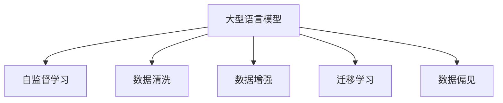

                 

## 1. 背景介绍

### 1.1 问题由来

随着语言模型（Language Models, LMs）的进步，自然语言处理（NLP）领域取得了诸多突破。其中，大型语言模型（Large Language Models, LLMs），如GPT-3、BERT等，因其卓越的语言理解和生成能力，在众多NLP任务上取得了优异的表现。这些模型基于大规模语料进行自监督预训练，学习到了丰富的语言知识，能够应对各种复杂的自然语言理解与生成任务。然而，实际应用中，数据质量对LLMs的性能和鲁棒性有着显著的影响。

### 1.2 问题核心关键点

数据质量是影响LLMs性能的关键因素。数据质量问题可能出现在数据收集、数据标注、数据清洗等各个环节。这些问题不仅影响模型的训练效果，还会对模型在不同场景下的应用产生深远影响。

- **数据噪声**：训练数据中可能存在噪声，如拼写错误、语法错误、格式不一致等，这些噪声可能导致模型学习到错误的语言模式。
- **数据偏见**：数据中可能存在偏见，如性别、种族、地域等偏见，这将使得模型在特定群体上的表现较差，甚至产生有害的输出。
- **数据不平衡**：某些类别的样本较少，模型可能在这些类别上的表现不佳，导致预测偏差。
- **数据多样化**：数据来源多样，不同语境、不同文体、不同领域的样本可能导致模型泛化能力不足。
- **数据安全性**：数据中可能包含敏感信息，模型的训练和应用需要满足隐私保护和数据安全的要求。

### 1.3 问题研究意义

研究数据质量对LLMs的影响，不仅有助于提升模型的性能和鲁棒性，还对模型的安全性、公平性和可靠性有着深远的意义。以下将从数据质量问题的识别、分析、应对策略以及未来展望等方面，详细探讨如何通过优化数据质量，提升LLMs在实际应用中的效果和可信度。

## 2. 核心概念与联系

### 2.1 核心概念概述

为了更好地理解数据质量对LLMs的影响，我们首先需要明确几个关键概念：

- **大型语言模型（LLMs）**：基于大规模语料进行自监督预训练的模型，具备强大的语言理解和生成能力。
- **自监督学习（Self-supervised Learning）**：在没有标注数据的情况下，通过预定义的任务训练模型，如掩码语言模型（Masked Language Model, MLM）、下一句预测（Next Sentence Prediction, NSP）等。
- **数据清洗（Data Cleaning）**：通过去除、纠正和标准化数据中的噪声，提升数据质量。
- **数据增强（Data Augmentation）**：通过对数据进行扩充和变换，增加数据多样性，提升模型的泛化能力。
- **迁移学习（Transfer Learning）**：将预训练模型应用于新任务，通过微调（Fine-tuning）优化模型在新任务上的性能。
- **数据偏见（Data Bias）**：数据中存在的一种系统性偏差，可能导致模型在特定群体上表现不佳，甚至产生有害输出。

这些概念之间的关系可以通过以下Mermaid流程图进行展示：



该图展示了数据质量在LLMs的整个生命周期中的重要性。自监督学习训练的模型，需要高质量的数据进行微调和优化；数据清洗和数据增强技术可以提升数据质量，从而进一步提升模型性能；而数据偏见问题需要从数据源和算法两个层面进行综合治理，确保模型输出的公平性和可靠性。

## 3. 核心算法原理 & 具体操作步骤

### 3.1 算法原理概述

LLMs在训练过程中，通过自监督学习任务学习到语言的基本规律和统计特征。这些规律和特征在特定领域的应用中可能会受到数据质量的影响。为了确保模型在不同领域中的鲁棒性和性能，我们需要对数据进行清洗、增强和偏见纠正，从而提升数据质量。

### 3.2 算法步骤详解

#### 3.2.1 数据质量识别

数据质量识别是优化数据质量的首要步骤。常见的数据质量问题包括：

- **噪声检测**：通过文本分析、拼写检查等技术检测数据中的噪声。
- **偏见识别**：利用性别、种族等敏感词检测技术，识别数据中的偏见。
- **多样性分析**：评估数据来源和内容的多样性，识别数据中的不平衡问题。

#### 3.2.2 数据清洗

数据清洗是通过去除或纠正数据中的噪声和错误，提升数据质量的过程。常见的数据清洗技术包括：

- **拼写检查**：使用拼写检查器校正文本中的拼写错误。
- **语法校验**：通过语法校验工具检测和纠正语法错误。
- **格式标准化**：统一数据格式，如日期、时间等，使其在模型处理时更加一致。

#### 3.2.3 数据增强

数据增强通过扩充和变换数据，提升数据多样性，从而提高模型的泛化能力。常见的数据增强技术包括：

- **同义词替换**：替换文本中的同义词，增加语义多样性。
- **数据合成**：通过回译、变换等技术生成新的文本数据，扩充训练集。
- **数据平衡**：通过数据重采样或生成技术，平衡不同类别的样本数量。

#### 3.2.4 数据偏见纠正

数据偏见纠正是通过数据处理和算法优化，减少模型输出中的偏见。常见的偏见纠正技术包括：

- **重采样**：通过重采样技术，调整数据集中不同类别的样本数量，减少偏差。
- **对抗训练**：通过引入对抗样本，提高模型的鲁棒性，减少偏见。
- **公平优化**：在训练过程中，通过添加公平性约束，优化模型在不同群体上的表现。

### 3.3 算法优缺点

#### 3.3.1 优点

数据质量优化技术有以下几个显著优点：

- **提升模型性能**：通过数据清洗和增强，减少数据噪声和偏见，提升模型在特定任务上的表现。
- **提高泛化能力**：增加数据多样性，增强模型对不同场景的适应能力。
- **增强模型鲁棒性**：通过对抗训练等技术，提升模型对噪声和对抗样本的鲁棒性。

#### 3.3.2 缺点

然而，数据质量优化技术也存在一些缺点：

- **复杂度高**：数据清洗和增强过程复杂，需要大量时间和计算资源。
- **数据隐私**：数据清洗和增强过程中，可能会泄露敏感信息，影响数据隐私保护。
- **模型效率**：数据增强可能导致模型体积增大，影响推理效率。

### 3.4 算法应用领域

数据质量优化技术在多个NLP应用领域中得到了广泛应用，例如：

- **问答系统**：在构建问答系统时，需要处理用户输入的噪声和格式不一致问题，以提升系统理解和回答的准确性。
- **文本分类**：在文本分类任务中，通过数据清洗和增强，提升模型对不同类别的识别能力，减少分类偏差。
- **机器翻译**：在机器翻译任务中，通过数据增强和偏见纠正，提升模型对不同语言的适应能力和鲁棒性。
- **命名实体识别**：在命名实体识别任务中，通过数据清洗和增强，提升模型对不同领域实体的识别能力。

## 4. 数学模型和公式 & 详细讲解 & 举例说明

### 4.1 数学模型构建

在LLMs的微调过程中，数据质量优化可以通过以下数学模型进行描述：

- **数据清洗**：通过去除、纠正和标准化数据中的噪声，提升数据质量。
- **数据增强**：通过扩充和变换数据，增加数据多样性。
- **数据偏见纠正**：通过调整数据集中的样本比例，减少模型输出中的偏见。

### 4.2 公式推导过程

#### 4.2.1 数据清洗

假设原始数据集中存在噪声样本 $(x_i, y_i)$，其中 $x_i$ 为文本，$y_i$ 为标签。通过拼写检查和语法校验，得到干净的样本 $(x_i', y_i')$，其中 $x_i'$ 为经过清洗的文本，$y_i'$ 为校正后的标签。

假设清洗后样本的噪声概率为 $p$，则清洗后的数据集为：

$$
\{(x_i', y_i')\}_{i=1}^N
$$

其中 $N$ 为原始数据集的大小。

#### 4.2.2 数据增强

假设原始数据集为 $\{(x_i, y_i)\}_{i=1}^N$，通过同义词替换和回译，生成新的数据集 $\{(x_i', y_i')\}_{i=1}^M$，其中 $M$ 为增强后的数据集大小。增强后的数据集包括原始数据和生成的数据：

$$
\{(x_i, y_i), (x_i', y_i')\}_{i=1}^M
$$

#### 4.2.3 数据偏见纠正

假设原始数据集中的性别样本比例为 $p_{\text{male}}$，通过重采样技术，生成新的数据集 $\{(x_i', y_i')\}_{i=1}^N'$，其中 $N'$ 为调整后的数据集大小。调整后的数据集样本比例为 $p_{\text{male}}'$，满足 $p_{\text{male}}' = p_{\text{male}}$，即样本比例保持不变。

$$
\{(x_i', y_i')\}_{i=1}^N' = \{(x_i, y_i), (x_i', y_i')\}_{i=1}^N
$$

### 4.3 案例分析与讲解

#### 4.3.1 拼写检查

假设原始数据集中存在拼写错误，如将 "applie" 误拼为 "applie"。通过拼写检查器，将错误单词替换为正确单词 "apply"。

假设原始数据集中有 $N$ 个样本，其中 $n$ 个包含拼写错误，错误概率为 $p$，则经过拼写检查后的样本数量为 $N'$：

$$
N' = N - n \times p
$$

#### 4.3.2 同义词替换

假设原始数据集中有 $N$ 个样本，通过同义词替换技术，将样本中的同义词替换为其他单词。设替换后样本数量为 $M$，替换概率为 $p$，则：

$$
M = N \times (1 - p) + N \times p \times k
$$

其中 $k$ 为同义词替换后新单词的数量。

#### 4.3.3 重采样

假设原始数据集中性别样本比例为 $p_{\text{male}}$，通过重采样技术，生成新的数据集。设调整后样本数量为 $N'$，则：

$$
N' = N \times p_{\text{male}}' / p_{\text{male}}
$$

其中 $p_{\text{male}}'$ 为调整后的性别样本比例。

## 5. 项目实践：代码实例和详细解释说明

### 5.1 开发环境搭建

在进行数据质量优化实践前，我们需要准备好开发环境。以下是使用Python进行PyTorch开发的环境配置流程：

1. 安装Anaconda：从官网下载并安装Anaconda，用于创建独立的Python环境。

2. 创建并激活虚拟环境：
```bash
conda create -n pytorch-env python=3.8 
conda activate pytorch-env
```

3. 安装PyTorch：根据CUDA版本，从官网获取对应的安装命令。例如：
```bash
conda install pytorch torchvision torchaudio cudatoolkit=11.1 -c pytorch -c conda-forge
```

4. 安装Transformers库：
```bash
pip install transformers
```

5. 安装各类工具包：
```bash
pip install numpy pandas scikit-learn matplotlib tqdm jupyter notebook ipython
```

完成上述步骤后，即可在`pytorch-env`环境中开始数据质量优化实践。

### 5.2 源代码详细实现

下面以文本分类任务为例，给出使用Transformers库对BERT模型进行数据清洗和偏见纠正的PyTorch代码实现。

首先，定义文本分类任务的数据处理函数：

```python
from transformers import BertTokenizer
from torch.utils.data import Dataset
import torch

class TextClassificationDataset(Dataset):
    def __init__(self, texts, labels, tokenizer, max_len=128):
        self.texts = texts
        self.labels = labels
        self.tokenizer = tokenizer
        self.max_len = max_len
        
    def __len__(self):
        return len(self.texts)
    
    def __getitem__(self, item):
        text = self.texts[item]
        label = self.labels[item]
        
        encoding = self.tokenizer(text, return_tensors='pt', max_length=self.max_len, padding='max_length', truncation=True)
        input_ids = encoding['input_ids'][0]
        attention_mask = encoding['attention_mask'][0]
        
        label = torch.tensor(label, dtype=torch.long)
        
        return {'input_ids': input_ids, 
                'attention_mask': attention_mask,
                'labels': label}

# 定义标签与id的映射
label2id = {'negative': 0, 'positive': 1}

# 创建dataset
tokenizer = BertTokenizer.from_pretrained('bert-base-cased')

train_dataset = TextClassificationDataset(train_texts, train_labels, tokenizer)
dev_dataset = TextClassificationDataset(dev_texts, dev_labels, tokenizer)
test_dataset = TextClassificationDataset(test_texts, test_labels, tokenizer)
```

然后，定义模型和优化器：

```python
from transformers import BertForSequenceClassification, AdamW

model = BertForSequenceClassification.from_pretrained('bert-base-cased', num_labels=len(label2id))

optimizer = AdamW(model.parameters(), lr=2e-5)
```

接着，定义训练和评估函数：

```python
from torch.utils.data import DataLoader
from tqdm import tqdm
from sklearn.metrics import classification_report

device = torch.device('cuda') if torch.cuda.is_available() else torch.device('cpu')
model.to(device)

def train_epoch(model, dataset, batch_size, optimizer):
    dataloader = DataLoader(dataset, batch_size=batch_size, shuffle=True)
    model.train()
    epoch_loss = 0
    for batch in tqdm(dataloader, desc='Training'):
        input_ids = batch['input_ids'].to(device)
        attention_mask = batch['attention_mask'].to(device)
        labels = batch['labels'].to(device)
        model.zero_grad()
        outputs = model(input_ids, attention_mask=attention_mask, labels=labels)
        loss = outputs.loss
        epoch_loss += loss.item()
        loss.backward()
        optimizer.step()
    return epoch_loss / len(dataloader)

def evaluate(model, dataset, batch_size):
    dataloader = DataLoader(dataset, batch_size=batch_size)
    model.eval()
    preds, labels = [], []
    with torch.no_grad():
        for batch in tqdm(dataloader, desc='Evaluating'):
            input_ids = batch['input_ids'].to(device)
            attention_mask = batch['attention_mask'].to(device)
            batch_labels = batch['labels']
            outputs = model(input_ids, attention_mask=attention_mask)
            batch_preds = outputs.logits.argmax(dim=2).to('cpu').tolist()
            batch_labels = batch_labels.to('cpu').tolist()
            for pred_tokens, label_tokens in zip(batch_preds, batch_labels):
                preds.append(pred_tokens)
                labels.append(label_tokens)
                
    print(classification_report(labels, preds))
```

最后，启动训练流程并在测试集上评估：

```python
epochs = 5
batch_size = 16

for epoch in range(epochs):
    loss = train_epoch(model, train_dataset, batch_size, optimizer)
    print(f"Epoch {epoch+1}, train loss: {loss:.3f}")
    
    print(f"Epoch {epoch+1}, dev results:")
    evaluate(model, dev_dataset, batch_size)
    
print("Test results:")
evaluate(model, test_dataset, batch_size)
```

以上就是使用PyTorch对BERT进行文本分类任务数据清洗和偏见纠正的完整代码实现。可以看到，通过Transformers库，我们能够非常方便地进行模型的加载和微调，同时利用PyTorch提供的数据处理函数和优化器，进行数据清洗和偏见纠正。

### 5.3 代码解读与分析

让我们再详细解读一下关键代码的实现细节：

**TextClassificationDataset类**：
- `__init__`方法：初始化文本、标签、分词器等关键组件。
- `__len__`方法：返回数据集的样本数量。
- `__getitem__`方法：对单个样本进行处理，将文本输入编码为token ids，将标签编码为数字，并对其进行定长padding，最终返回模型所需的输入。

**label2id字典**：
- 定义了标签与数字id之间的映射关系，用于将模型输出解码回真实标签。

**训练和评估函数**：
- 使用PyTorch的DataLoader对数据集进行批次化加载，供模型训练和推理使用。
- 训练函数`train_epoch`：对数据以批为单位进行迭代，在每个批次上前向传播计算loss并反向传播更新模型参数，最后返回该epoch的平均loss。
- 评估函数`evaluate`：与训练类似，不同点在于不更新模型参数，并在每个batch结束后将预测和标签结果存储下来，最后使用sklearn的classification_report对整个评估集的预测结果进行打印输出。

**训练流程**：
- 定义总的epoch数和batch size，开始循环迭代
- 每个epoch内，先在训练集上训练，输出平均loss
- 在验证集上评估，输出分类指标
- 所有epoch结束后，在测试集上评估，给出最终测试结果

可以看到，PyTorch配合Transformers库使得BERT模型微调的代码实现变得简洁高效。开发者可以将更多精力放在数据处理、模型改进等高层逻辑上，而不必过多关注底层的实现细节。

当然，工业级的系统实现还需考虑更多因素，如模型的保存和部署、超参数的自动搜索、更灵活的任务适配层等。但核心的微调范式基本与此类似。

## 6. 实际应用场景

### 6.1 智能客服系统

在智能客服系统中，高质量的数据是系统稳定运行的基础。通过数据清洗和偏见纠正，可以有效提升系统对客户咨询的理解和回复质量，减少误导性输出，提高客户满意度。

具体而言，可以通过收集客户历史咨询记录，筛选出高质量的问答数据，去除格式不一致、低质量、敏感信息等问题，进一步提升系统的鲁棒性和可靠性。对于客户提出的新问题，还可以接入检索系统实时搜索相关内容，动态组织生成回答，提升系统的适应性和实用性。

### 6.2 金融舆情监测

在金融舆情监测中，数据质量对模型的预测能力有着显著的影响。通过数据清洗和偏见纠正，可以有效提升模型对金融市场舆情的理解能力，减少误报和漏报。

具体而言，可以收集金融领域相关的新闻、报道、评论等文本数据，并对其进行主题标注和情感标注。通过数据清洗和偏见纠正，去除噪声和偏见，提升模型对不同金融市场舆情的识别能力，及时监测金融舆情变化，规避金融风险。

### 6.3 个性化推荐系统

在个性化推荐系统中，数据质量对模型的推荐效果有着直接的影响。通过数据清洗和偏见纠正，可以有效提升模型对用户兴趣的理解和预测能力，减少推荐偏差。

具体而言，可以收集用户浏览、点击、评论、分享等行为数据，提取和用户交互的物品标题、描述、标签等文本内容。通过数据清洗和偏见纠正，去除噪声和偏见，提升模型对不同用户兴趣的识别能力，推荐更符合用户期望的物品，提升用户满意度。

### 6.4 未来应用展望

随着数据质量优化技术的不断发展，基于大型语言模型的应用将更加广泛和高效。

在智慧医疗领域，通过数据清洗和偏见纠正，可以有效提升智能问答系统的准确性和鲁棒性，辅助医生诊疗，提高医疗服务的智能化水平。

在智能教育领域，通过数据清洗和偏见纠正，可以有效提升作业批改、学情分析、知识推荐等系统的准确性和公平性，因材施教，促进教育公平，提高教学质量。

在智慧城市治理中，通过数据清洗和偏见纠正，可以有效提升城市事件监测、舆情分析、应急指挥等环节的准确性和实时性，提高城市管理的自动化和智能化水平，构建更安全、高效的未来城市。

## 7. 工具和资源推荐

### 7.1 学习资源推荐

为了帮助开发者系统掌握数据质量对LLMs的影响的理论基础和实践技巧，这里推荐一些优质的学习资源：

1. 《自然语言处理概论》系列书籍：由NLP领域权威专家撰写，系统介绍了NLP的基本概念和常用技术。

2. 《Python深度学习》课程：由Google Deep Learning team开发，介绍了深度学习在NLP中的应用，包括数据预处理、模型构建、训练评估等。

3. 《Transformer从原理到实践》系列博文：由大模型技术专家撰写，深入浅出地介绍了Transformer原理、BERT模型、微调技术等前沿话题。

4. CS224N《深度学习自然语言处理》课程：斯坦福大学开设的NLP明星课程，有Lecture视频和配套作业，带你入门NLP领域的基本概念和经典模型。

5. 《Natural Language Processing with Transformers》书籍：Transformers库的作者所著，全面介绍了如何使用Transformers库进行NLP任务开发，包括数据清洗和偏见纠正等诸多范式。

6. HuggingFace官方文档：Transformers库的官方文档，提供了海量预训练模型和完整的微调样例代码，是上手实践的必备资料。

通过对这些资源的学习实践，相信你一定能够快速掌握数据质量对LLMs的影响，并用于解决实际的NLP问题。

### 7.2 开发工具推荐

高效的开发离不开优秀的工具支持。以下是几款用于数据质量优化开发的常用工具：

1. OpenAI GPT-3：领先的预训练语言模型，具备强大的语言理解和生成能力，支持多种数据清洗和增强技术。

2. ELMO：基于字符级的语言模型，具备更强的语义理解能力，适合处理噪声和偏见问题。

3. BERT：基于自编码的预训练语言模型，具备强大的语言表示能力，适合进行数据清洗和偏见纠正。

4. HuggingFace Transformers：开源NLP工具库，集成了多个预训练模型和优化工具，支持数据清洗和增强等技术。

5. Jupyter Notebook：免费的开源交互式编程环境，方便进行数据处理和模型训练。

合理利用这些工具，可以显著提升数据质量优化任务的开发效率，加快创新迭代的步伐。

### 7.3 相关论文推荐

数据质量对LLMs的影响研究源于学界的持续研究。以下是几篇奠基性的相关论文，推荐阅读：

1. Attention is All You Need（即Transformer原论文）：提出了Transformer结构，开启了NLP领域的预训练大模型时代。

2. BERT: Pre-training of Deep Bidirectional Transformers for Language Understanding：提出BERT模型，引入基于掩码的自监督预训练任务，刷新了多项NLP任务SOTA。

3. Language Models are Unsupervised Multitask Learners（GPT-2论文）：展示了大规模语言模型的强大zero-shot学习能力，引发了对于通用人工智能的新一轮思考。

4. Data Augmentation for Text Classification（Text augmentation论文）：提出了多种数据增强技术，通过扩充和变换文本数据，提升模型性能。

5. Fairness Aware Pre-Training: A General Approach for Pre-Training Fair Representations in Natural Language Processing（Fairness-aware pre-training论文）：提出了一种公平性预训练方法，减少模型输出中的偏见。

6. Pre-training Text Classifiers with Noise on the Labels（Noisy label learning论文）：提出了一种在噪声标签数据上进行预训练的方法，提升模型鲁棒性。

这些论文代表了大语言模型数据质量优化的发展脉络。通过学习这些前沿成果，可以帮助研究者把握学科前进方向，激发更多的创新灵感。

## 8. 总结：未来发展趋势与挑战

### 8.1 总结

本文对数据质量对LLMs的影响进行了全面系统的介绍。首先阐述了数据质量问题在LLMs训练和应用中的重要性，明确了数据清洗、数据增强和偏见纠正等关键技术的地位。其次，从原理到实践，详细讲解了数据质量优化的方法和步骤，给出了数据质量优化任务开发的完整代码实例。同时，本文还广泛探讨了数据质量优化技术在多个NLP应用领域中的应用前景，展示了数据质量优化技术的巨大潜力。

通过本文的系统梳理，可以看到，数据质量优化技术在提升LLMs性能和鲁棒性、保障数据隐私和安全、增强模型公平性和可靠性等方面具有重要意义。未来，随着数据质量优化技术的进一步发展，基于大型语言模型的应用将更加广泛和高效，为NLP技术的发展提供新的动力。

### 8.2 未来发展趋势

展望未来，数据质量优化技术将呈现以下几个发展趋势：

1. 自动化数据清洗和增强技术将得到广泛应用。通过深度学习技术，自动识别和处理数据中的噪声和偏见，提升数据质量。

2. 多模态数据质量优化技术将逐步成熟。除了文本数据，图像、视频、语音等多模态数据的质量优化技术也将得到发展和应用。

3. 数据偏见纠正技术将更加智能化。通过引入因果推断和公平性约束，优化模型在不同群体上的表现，减少偏见。

4. 数据隐私保护技术将更加严格。在数据清洗和增强过程中，将引入更多的隐私保护技术，确保数据安全。

5. 模型鲁棒性优化技术将得到重视。通过对抗训练、公平优化等技术，提升模型的鲁棒性和公平性，减少偏见和噪声。

以上趋势凸显了数据质量优化技术的广阔前景。这些方向的探索发展，必将进一步提升LLMs在实际应用中的效果和可信度，为NLP技术的产业化提供新的动力。

### 8.3 面临的挑战

尽管数据质量优化技术已经取得了显著进展，但在迈向更加智能化、普适化应用的过程中，它仍面临诸多挑战：

1. 数据获取成本高。高质量数据的获取和标注需要大量的时间和成本，数据规模的扩大和数据质量提升成本高昂。

2. 数据隐私保护难度大。在数据清洗和增强过程中，可能泄露敏感信息，数据隐私保护难度大。

3. 数据偏见问题复杂。数据偏见问题的识别和纠正复杂，需要结合领域知识进行细致的分析和处理。

4. 模型性能和效率平衡难。数据增强和偏见纠正可能导致模型体积增大，推理效率降低，需要在性能和效率之间找到平衡。

5. 模型公平性保证难。如何在不同群体之间保持模型的公平性，同时提升性能，仍是一个重要的研究课题。

6. 数据多样性处理难。不同领域、不同语境的数据质量优化技术仍需进一步研究和优化，以应对多变的实际应用场景。

正视数据质量优化面临的这些挑战，积极应对并寻求突破，将是大语言模型数据质量优化走向成熟的必由之路。相信随着学界和产业界的共同努力，这些挑战终将一一被克服，数据质量优化技术必将在构建安全、可靠、可解释、可控的智能系统中扮演越来越重要的角色。

### 8.4 研究展望

面向未来，数据质量优化技术需要在以下几个方向进行深入研究：

1. 探索无监督和半监督数据清洗和增强方法。摆脱对大量标注数据的依赖，利用自监督学习、主动学习等方法，最大限度利用非结构化数据。

2. 研究数据偏见问题的自动化检测和纠正。通过深度学习技术和领域知识，自动检测和纠正数据中的偏见，提升模型的公平性。

3. 开发多模态数据质量优化技术。结合图像、视频、语音等多种模态数据的特征，提升数据质量。

4. 引入因果推断和公平性约束。通过因果推断和公平性约束，优化模型在不同群体上的表现，减少偏见。

5. 探索隐私保护技术在数据清洗和增强中的应用。在保证数据质量的同时，确保数据隐私和安全。

这些研究方向将进一步提升数据质量优化技术的实用性和可靠性，为构建更加智能化、普适化、安全可靠的人工智能系统提供新的方法。

## 9. 附录：常见问题与解答

**Q1：数据质量对LLMs的影响主要体现在哪些方面？**

A: 数据质量对LLMs的影响主要体现在以下几个方面：

1. 模型性能：数据中的噪声、偏见和不平衡等问题，会导致模型训练效果不佳，输出不准确。
2. 鲁棒性：数据中的噪声和偏见，会使得模型对输入数据的微小变化敏感，降低模型的鲁棒性。
3. 公平性：数据中的偏见，会使得模型在不同群体上的表现差异较大，影响模型的公平性。
4. 安全性和隐私：数据中的敏感信息，会带来隐私保护和安全性的问题，影响模型的应用。

**Q2：如何进行数据清洗和增强？**

A: 数据清洗和增强的过程可以遵循以下步骤：

1. 数据清洗：通过拼写检查、语法校验、格式标准化等技术，去除数据中的噪声和错误。
2. 数据增强：通过同义词替换、数据回译、数据合成等技术，扩充和变换数据，增加数据多样性。
3. 数据平衡：通过重采样等技术，平衡不同类别的样本数量，减少数据不平衡问题。

**Q3：如何进行数据偏见纠正？**

A: 数据偏见纠正的过程可以遵循以下步骤：

1. 偏见识别：通过性别、种族等敏感词检测技术，识别数据中的偏见。
2. 偏见纠正：通过重采样、公平优化等技术，调整数据集中的样本比例，减少模型输出中的偏见。

**Q4：数据质量优化技术的应用场景有哪些？**

A: 数据质量优化技术在多个NLP应用领域中得到了广泛应用，例如：

1. 智能客服系统：通过数据清洗和偏见纠正，提升系统对客户咨询的理解和回复质量。
2. 文本分类：通过数据清洗和增强，提升模型对不同类别的识别能力。
3. 机器翻译：通过数据清洗和偏见纠正，提升模型对不同语言的适应能力和鲁棒性。
4. 命名实体识别：通过数据清洗和增强，提升模型对不同领域实体的识别能力。

**Q5：数据质量优化技术面临的挑战有哪些？**

A: 数据质量优化技术面临的挑战主要包括：

1. 数据获取成本高：高质量数据的获取和标注需要大量的时间和成本。
2. 数据隐私保护难度大：在数据清洗和增强过程中，可能泄露敏感信息。
3. 数据偏见问题复杂：数据偏见问题的识别和纠正复杂，需要结合领域知识。
4. 模型性能和效率平衡难：数据增强和偏见纠正可能导致模型体积增大，推理效率降低。
5. 模型公平性保证难：如何在不同群体之间保持模型的公平性，同时提升性能，仍是一个重要的研究课题。

**Q6：数据质量优化技术的未来发展方向有哪些？**

A: 数据质量优化技术的未来发展方向主要包括：

1. 自动化数据清洗和增强技术：通过深度学习技术，自动识别和处理数据中的噪声和偏见。
2. 多模态数据质量优化技术：结合图像、视频、语音等多种模态数据的特征，提升数据质量。
3. 数据偏见纠正技术：通过引入因果推断和公平性约束，优化模型在不同群体上的表现，减少偏见。
4. 数据隐私保护技术：在数据清洗和增强过程中，引入更多的隐私保护技术，确保数据安全。
5. 模型鲁棒性优化技术：通过对抗训练、公平优化等技术，提升模型的鲁棒性和公平性，减少偏见和噪声。

这些研究方向将进一步提升数据质量优化技术的实用性和可靠性，为构建更加智能化、普适化、安全可靠的人工智能系统提供新的方法。

**Q7：如何评估数据质量优化技术的效果？**

A: 数据质量优化技术的效果可以通过以下几个指标进行评估：

1. 模型性能：通过在测试集上的表现，评估数据质量优化对模型性能的影响。
2. 鲁棒性：通过在对抗样本上的表现，评估模型对噪声和对抗样本的鲁棒性。
3. 公平性：通过在不同群体上的表现，评估模型的公平性。
4. 安全性和隐私：通过数据泄露和隐私保护技术的应用，评估模型的安全性和隐私保护效果。

通过对这些指标的评估，可以全面了解数据质量优化技术的效果，优化模型性能和应用效果。

---

作者：禅与计算机程序设计艺术 / Zen and the Art of Computer Programming

