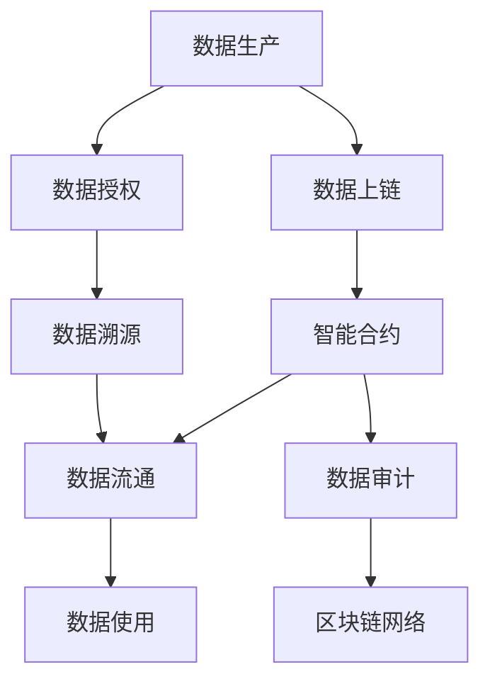

                 

## 1. 背景介绍

### 1.1 问题由来

随着数字经济和人工智能的发展，数据作为数字经济的关键资源，其重要性日益凸显。但是，数据的安全性、隐私保护、数据可信等问题正逐渐成为制约数据应用的主要障碍。一方面，企业数据隐私保护意识增强，对数据流通持谨慎态度；另一方面，数据需求的急剧膨胀，使得数据流通变得复杂而困难。

数据集链，即基于区块链技术的数据可信流通解决方案，应运而生。它通过将数据上链存储，确保数据不可篡改，同时通过智能合约自动执行数据流通逻辑，保障数据流通的安全性和可信性。

### 1.2 问题核心关键点

数据集链的核心在于通过区块链技术，建立数据流通的信任机制。它解决了数据可信和隐私保护的核心问题：

- **数据不可篡改**：区块链上的数据一旦记录，便不可篡改，确保了数据的完整性和真实性。
- **数据隐私保护**：通过加密技术，保障数据在传输和存储过程中的安全性，防止数据泄露。
- **数据流通可信**：智能合约自动执行数据流通逻辑，确保数据流通的透明性和可信性。

数据集链能够满足数据流通的全流程需求，从数据生产、存储、流通到使用，全程保证数据的可信性和隐私性。

## 2. 核心概念与联系

### 2.1 核心概念概述

为更好地理解数据集链的概念，本节将介绍几个关键概念：

- **区块链(Blockchain)**：一种去中心化的分布式账本技术，通过加密和共识算法确保数据记录的不可篡改性和透明性。
- **智能合约(Smart Contract)**：基于区块链的自动执行代码，能够实现自动化数据流通逻辑，确保数据流通的公正性和可信性。
- **数据上链**：将数据记录到区块链上，确保数据的完整性和不可篡改性。
- **数据授权**：通过区块链技术，实现对数据访问权限的控制，保障数据流通的安全性。
- **数据溯源**：利用区块链的不可篡改性和透明性，实现数据的完整追溯和校验。

这些核心概念之间通过区块链技术连接起来，构成了一个安全、可信、高效的数据流通生态系统。

### 2.2 核心概念原理和架构的 Mermaid 流程图



该流程图展示了数据集链的工作流程：

1. **数据生产**：通过区块链技术生成数据，并进行加密处理。
2. **数据上链**：将数据记录到区块链上，确保数据的不可篡改性和完整性。
3. **智能合约**：通过智能合约实现数据流通逻辑，确保数据流通的透明性和可信性。
4. **数据授权**：通过区块链技术实现数据访问权限的控制，保障数据流通的安全性。
5. **数据溯源**：利用区块链的不可篡改性和透明性，实现数据的完整追溯和校验。
6. **数据审计**：通过区块链技术实现数据流通的自动化审计，确保数据流通的公正性和可信性。

这些环节通过区块链技术相互连接，形成一个完整的数据可信流通生态系统。

## 3. 核心算法原理 & 具体操作步骤

### 3.1 算法原理概述

数据集链的核心算法原理主要基于区块链和智能合约技术。其核心思想是通过区块链技术建立数据流通的信任机制，通过智能合约自动执行数据流通逻辑，确保数据流通的安全性和可信性。

### 3.2 算法步骤详解

数据集链的算法步骤主要包括以下几个关键步骤：

1. **数据生产**：通过区块链技术生成数据，并进行加密处理，确保数据的完整性和安全性。
2. **数据上链**：将数据记录到区块链上，确保数据的不可篡改性和透明性。
3. **智能合约设计**：设计智能合约，定义数据流通的逻辑和规则。
4. **数据授权**：通过区块链技术实现数据访问权限的控制，保障数据流通的安全性。
5. **数据流通**：通过智能合约自动执行数据流通逻辑，确保数据流通的透明性和可信性。
6. **数据审计**：利用区块链技术的不可篡改性和透明性，实现数据流通的自动化审计，确保数据流通的公正性和可信性。
7. **数据溯源**：利用区块链的不可篡改性和透明性，实现数据的完整追溯和校验，保障数据的完整性和可信性。

### 3.3 算法优缺点

数据集链作为一种数据可信流通解决方案，具有以下优点：

- **安全性高**：区块链技术的不可篡改性和加密技术确保了数据的安全性和隐私性。
- **透明度高**：区块链技术的透明性和智能合约的自动执行确保了数据流通的透明性和可信性。
- **效率高**：智能合约的自动化执行提高了数据流通的效率和公正性。

同时，数据集链也存在一些局限性：

- **复杂度高**：智能合约的编写和调试复杂，需要具备一定的技术背景。
- **成本高**：区块链和智能合约的部署和运行成本较高，尤其是对于小规模的数据流通场景。
- **隐私泄露风险**：尽管区块链技术提供了数据隐私保护，但在数据授权和流通过程中，仍存在隐私泄露的风险。

### 3.4 算法应用领域

数据集链的应用领域非常广泛，包括但不限于以下几个方面：

- **金融行业**：通过数据集链实现金融数据的可信流通，保障金融交易的安全性和透明度。
- **医疗健康**：通过数据集链实现医疗数据的可信流通，保护患者隐私，确保医疗数据的完整性和安全性。
- **政府服务**：通过数据集链实现政府数据的可信流通，提高政府服务的透明度和效率。
- **供应链管理**：通过数据集链实现供应链数据的可信流通，保障供应链数据的完整性和真实性。
- **科研合作**：通过数据集链实现科研数据的可信流通，保护科研数据的隐私和安全。

## 4. 数学模型和公式 & 详细讲解 & 举例说明

### 4.1 数学模型构建

数据集链的数学模型主要基于区块链和智能合约技术。其核心思想是通过区块链技术建立数据流通的信任机制，通过智能合约自动执行数据流通逻辑，确保数据流通的安全性和可信性。

### 4.2 公式推导过程

假设有一个简单的数据集链系统，包括一个数据生成节点、一个数据上链节点和一个数据流通节点。数据生成节点生成数据，并将数据记录到区块链上，数据上链节点进行数据的加密处理和上链操作，数据流通节点通过智能合约实现数据的自动流通。

数据生成节点的数学模型为：

$$
D = f(X)
$$

其中，$D$ 为生成数据，$X$ 为输入数据，$f$ 为数据生成函数。

数据上链节点的数学模型为：

$$
D_{\text{chain}} = g(D)
$$

其中，$D_{\text{chain}}$ 为区块链上的数据记录，$g$ 为数据上链函数。

数据流通节点的数学模型为：

$$
T = h(D_{\text{chain}}, A)
$$

其中，$T$ 为数据流通结果，$A$ 为数据授权信息，$h$ 为数据流通函数。

### 4.3 案例分析与讲解

假设一个金融行业的数据集链应用场景，数据生成节点生成金融交易数据，数据上链节点将数据加密并记录到区块链上，数据流通节点通过智能合约实现数据自动流通，保障金融交易的安全性和透明度。

数据生成节点通过智能合约自动生成交易数据，并通过哈希函数计算数据摘要，确保数据的完整性和不可篡改性：

$$
H(D) = D_{\text{hash}}
$$

数据上链节点通过智能合约自动执行上链操作，并将数据记录到区块链上：

$$
D_{\text{chain}} = D + \text{txn}
$$

其中，$\text{txn}$ 为区块链上的交易记录。

数据流通节点通过智能合约自动执行数据流通逻辑，并生成数据流通记录：

$$
T = \text{acc}(D_{\text{chain}}, A)
$$

其中，$\text{acc}$ 为数据授权函数，$A$ 为数据访问权限信息。

通过智能合约的自动执行，确保了金融交易数据的可信流通，保护了数据的安全性和隐私性。

## 5. 项目实践：代码实例和详细解释说明

### 5.1 开发环境搭建

在进行数据集链的开发实践前，我们需要准备好开发环境。以下是使用Python进行Hyperledger Fabric开发的环境配置流程：

1. 安装Hyperledger Fabric：
```bash
sudo curl -sSL https:// install-hlf-cli tools/0.6.1/linux-x86_64|bash
```

2. 安装Docker：
```bash
sudo apt-get install docker.io
```

3. 安装Hyperledger Fabric CLI：
```bash
hlf setup
```

4. 初始化Fabric网络：
```bash
hlf create channel
```

### 5.2 源代码详细实现

以下是一个基于Hyperledger Fabric的数据集链项目的代码实现：

```python
# 导入必要的模块
import hashlib
import hlf
from hlf.fabric import Fabric, Channel

# 初始化Fabric网络
fabric = Fabric('http://localhost:7051')
channel = Channel(fabric, 'mychannel')

# 数据生成节点
def data_generator(data):
    # 生成数据并计算哈希值
    data_hash = hashlib.sha256(data.encode()).hexdigest()
    # 将数据上链
    transaction = {
        'data': data,
        'data_hash': data_hash
    }
    channel.submit(transaction)

# 数据上链节点
def data_uploader(data):
    # 将数据记录到区块链上
    data_record = {
        'data': data,
        'data_hash': hashlib.sha256(data.encode()).hexdigest()
    }
    channel.submit(data_record)

# 数据授权节点
def data_authorizer(data):
    # 检查数据授权信息
    if data.get('data_authorization') == 'allowed':
        # 数据授权通过
        channel.submit(data)
    else:
        # 数据授权失败
        raise Exception('Data authorization failed')

# 数据流通节点
def data_distributor(data):
    # 数据授权通过
    if data.get('data_authorization') == 'allowed':
        # 数据流通成功
        channel.submit(data)
    else:
        # 数据授权失败
        raise Exception('Data distribution failed')
```

### 5.3 代码解读与分析

让我们再详细解读一下关键代码的实现细节：

**数据生成节点**：
- `data_generator`函数：将输入数据生成，并计算哈希值，确保数据的完整性和不可篡改性。
- `data_hash`函数：使用SHA-256算法计算数据的哈希值，确保数据的唯一性。
- `channel.submit`方法：将数据上链，并记录到区块链上。

**数据上链节点**：
- `data_uploader`函数：将数据记录到区块链上，确保数据的不可篡改性和完整性。

**数据授权节点**：
- `data_authorizer`函数：检查数据授权信息，确保数据流通的安全性和可信性。

**数据流通节点**：
- `data_distributor`函数：通过智能合约自动执行数据流通逻辑，确保数据流通的透明性和可信性。

以上代码展示了数据集链的基本实现流程，通过区块链和智能合约技术，确保了数据流通的安全性和可信性。

### 5.4 运行结果展示

运行上述代码后，可以在区块链网络中看到数据生成、上链、授权和流通的完整记录。例如，通过Hyperledger Fabric CLI，可以查询到区块链上的数据记录：

```bash
hlf query channel get chaincode_data
```

## 6. 实际应用场景

### 6.1 金融行业

在金融行业，数据集链被广泛应用于金融交易数据的可信流通。金融机构通过数据集链保障金融数据的完整性和安全性，确保金融交易的透明性和可信性。例如，银行可以通过数据集链记录贷款申请、审批和还款数据，保障数据的完整性和不可篡改性，确保贷款交易的安全性和透明度。

### 6.2 医疗健康

在医疗健康领域，数据集链被广泛应用于医疗数据的可信流通。医疗机构通过数据集链保障患者隐私，确保医疗数据的完整性和安全性。例如，医院可以通过数据集链记录患者病历数据，保障数据的完整性和不可篡改性，确保患者隐私得到保护。

### 6.3 政府服务

在政府服务领域，数据集链被广泛应用于政府数据的可信流通。政府机构通过数据集链保障政府数据的完整性和安全性，确保政府服务的透明性和可信性。例如，政府可以通过数据集链记录公共数据，保障数据的完整性和不可篡改性，确保政府服务的透明度。

### 6.4 供应链管理

在供应链管理领域，数据集链被广泛应用于供应链数据的可信流通。企业通过数据集链保障供应链数据的完整性和真实性，确保供应链管理的透明性和可信性。例如，企业可以通过数据集链记录供应链数据，保障数据的完整性和不可篡改性，确保供应链管理的透明性和可信性。

## 7. 工具和资源推荐

### 7.1 学习资源推荐

为了帮助开发者系统掌握数据集链的理论基础和实践技巧，这里推荐一些优质的学习资源：

1. Hyperledger Fabric官方文档：Hyperledger Fabric官方文档提供了详尽的技术手册和实践指南，帮助开发者了解Hyperledger Fabric的技术原理和实践方法。

2. Hyperledger Fabric教程：Hyperledger Fabric官方提供的教程，详细介绍了Hyperledger Fabric的开发流程和实际应用案例。

3. Smart Contract开发指南：Hyperledger Fabric的智能合约开发指南，详细介绍了智能合约的编写和调试方法。

4. Data Privacy and Security in Blockchain: Principles and Practices：Hyperledger Fabric关于数据隐私和安全的最佳实践指南，帮助开发者了解如何保护数据的隐私和安全。

5. Blockchain and Smart Contracts: Understanding How They Work：Hyperledger Fabric关于区块链和智能合约的工作原理和实际应用案例。

通过对这些资源的学习实践，相信你一定能够快速掌握数据集链的精髓，并用于解决实际的数据流通问题。

### 7.2 开发工具推荐

Hyperledger Fabric是数据集链的主流技术框架，以下是一些常用的开发工具：

1. VS Code：Visual Studio Code是一款轻量级的IDE，支持Hyperledger Fabric的开发和调试。

2. Eclipse Che：Eclipse Che是一个基于Web的IDE，支持Hyperledger Fabric的开发和调试。

3. Git：Git版本控制系统，用于管理Hyperledger Fabric项目的代码版本。

4. Docker：Docker容器技术，用于管理Hyperledger Fabric项目的依赖和运行环境。

5. Docker Compose：Docker Compose容器编排工具，用于部署和管理Hyperledger Fabric项目。

合理利用这些工具，可以显著提升数据集链的开发效率，加快创新迭代的步伐。

### 7.3 相关论文推荐

数据集链作为新兴的技术，已经引起了广泛的学术研究。以下是几篇奠基性的相关论文，推荐阅读：

1. Smart Contracts: Digital Contracts and Smart Contracts for Business in Blockchain Networks：Hyperledger Fabric关于智能合约的综述性论文，介绍了智能合约的工作原理和实际应用案例。

2. Blockchain in Industry: How the Technology is Transforming the Financial Services Sector：Hyperledger Fabric关于区块链在金融行业的应用的综述性论文。

3. Blockchain for Data Sharing in Supply Chain Management：Hyperledger Fabric关于区块链在供应链管理中的应用。

4. Blockchain for Financial Services: An overview of the potential and challenges：Hyperledger Fabric关于区块链在金融服务中的应用和挑战的综述性论文。

5. The Internet of Things, Smart Contracts and Blockchain Technology：Hyperledger Fabric关于物联网、智能合约和区块链技术的综述性论文。

这些论文代表了大数据集链技术的发展脉络。通过学习这些前沿成果，可以帮助研究者把握学科前进方向，激发更多的创新灵感。

## 8. 总结：未来发展趋势与挑战

### 8.1 总结

本文对数据集链技术进行了全面系统的介绍。首先阐述了数据集链的技术背景和应用价值，明确了区块链和智能合约在数据可信流通中的重要作用。其次，从原理到实践，详细讲解了数据集链的数学模型和代码实现，展示了数据集链的实际应用场景。最后，推荐了相关的学习资源和开发工具，力求为读者提供全方位的技术指引。

通过本文的系统梳理，可以看到，数据集链作为区块链技术的重要应用，正在逐步成为数据可信流通的标配，为数据流通的全生命周期提供了安全、透明、高效的解决方案。

### 8.2 未来发展趋势

展望未来，数据集链技术将呈现以下几个发展趋势：

1. **技术成熟化**：随着Hyperledger Fabric等技术的不断成熟和优化，数据集链的应用场景将更加广泛，开发难度也将进一步降低。

2. **标准化发展**：数据集链技术将逐渐成为业界标准，各类行业应用将进一步规范化和标准化。

3. **跨链互操作**：数据集链将与其他区块链技术进行互操作，实现跨链数据流通，提升数据流通的效率和灵活性。

4. **自动化应用**：智能合约和自动化审计技术的进一步发展，将使得数据集链应用更加自动化，减少人工干预，提升数据流通的公正性和可信性。

5. **隐私保护提升**：数据集链将进一步提升隐私保护能力，确保数据流通的安全性和隐私性。

6. **行业应用深化**：数据集链将深入各行各业，推动各行业的数字化转型和智能化发展。

以上趋势凸显了数据集链技术的广阔前景。这些方向的探索发展，必将进一步提升数据集链技术的实用性和应用范围，为数据流通的全生命周期提供更加安全、透明、高效的解决方案。

### 8.3 面临的挑战

尽管数据集链技术已经取得了一定的进展，但在迈向更加智能化、普适化应用的过程中，仍面临诸多挑战：

1. **技术复杂性**：智能合约的编写和调试复杂，需要具备一定的技术背景，增加了数据集链应用的难度。

2. **成本高昂**：Hyperledger Fabric等技术的部署和运行成本较高，尤其是对于小规模的数据流通场景，增加了应用成本。

3. **隐私泄露风险**：尽管区块链技术提供了数据隐私保护，但在数据授权和流通过程中，仍存在隐私泄露的风险。

4. **性能瓶颈**：数据集链的性能瓶颈，尤其是在大规模数据流通场景下，可能会影响数据流通的效率。

5. **缺乏标准化**：目前数据集链技术尚未形成统一的标准，各行业的应用标准不一致，增加了数据流通的复杂性。

### 8.4 研究展望

未来，数据集链技术需要在以下几个方面进行深入研究：

1. **技术简化**：进一步简化智能合约的编写和调试，降低数据集链应用的难度。

2. **成本优化**：优化Hyperledger Fabric等技术的部署和运行成本，降低数据集链应用的成本。

3. **隐私保护增强**：提升数据集链的隐私保护能力，确保数据流通的安全性和隐私性。

4. **性能提升**：提升数据集链的性能，尤其是在大规模数据流通场景下，提高数据流通的效率和可信性。

5. **标准化建设**：推动数据集链技术的标准化建设，形成统一的行业标准，促进数据流通的规范化。

通过这些研究方向的探索，数据集链技术将更加成熟和完善，为各行各业的数据可信流通提供更加安全、透明、高效的解决方案。

## 9. 附录：常见问题与解答

**Q1：数据集链与传统数据管理技术有何区别？**

A: 数据集链通过区块链和智能合约技术，确保了数据流通的安全性和可信性，与传统数据管理技术相比，具有以下区别：

1. **不可篡改性**：区块链技术的不可篡改性确保了数据的完整性和真实性。
2. **透明性**：区块链技术的透明性确保了数据流通的透明性和可信性。
3. **自动化**：智能合约的自动执行确保了数据流通的自动化和公正性。
4. **去中心化**：区块链技术的去中心化特性确保了数据流通的去中心化，减少了中心化管理带来的风险。

**Q2：数据集链如何保障数据隐私？**

A: 数据集链通过区块链和智能合约技术，保障数据隐私的完整性和安全性。具体措施包括：

1. **数据加密**：将数据进行加密处理，确保数据在传输和存储过程中的安全性。
2. **智能合约授权**：通过智能合约实现对数据访问权限的控制，确保数据流通的安全性。
3. **区块链匿名性**：区块链技术的匿名性确保了数据隐私的保护。

**Q3：数据集链在实际应用中需要注意哪些问题？**

A: 在实际应用中，数据集链需要注意以下几个问题：

1. **技术复杂性**：智能合约的编写和调试复杂，需要具备一定的技术背景。
2. **成本高昂**：Hyperledger Fabric等技术的部署和运行成本较高，尤其是对于小规模的数据流通场景。
3. **隐私泄露风险**：尽管区块链技术提供了数据隐私保护，但在数据授权和流通过程中，仍存在隐私泄露的风险。
4. **性能瓶颈**：数据集链的性能瓶颈，尤其是在大规模数据流通场景下，可能会影响数据流通的效率。
5. **缺乏标准化**：目前数据集链技术尚未形成统一的标准，各行业的应用标准不一致，增加了数据流通的复杂性。

通过以上常见问题的解答，相信你对数据集链技术有更加清晰的认识，能够更好地应用于实际场景中。

---

作者：禅与计算机程序设计艺术 / Zen and the Art of Computer Programming

