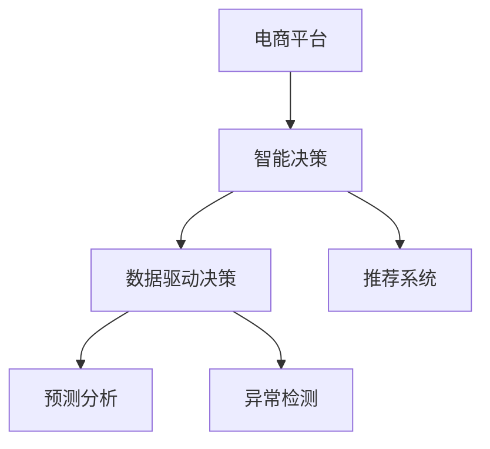

                 

## 1. 背景介绍

### 1.1 问题由来
随着电商市场的蓬勃发展，电商平台正面临着前所未有的挑战。从全球经济环境的不确定性，到消费者行为的变化，再到同行的激烈竞争，都要求电商平台必须具备高度的决策响应能力和灵活的策略调整能力。传统的人力决策模式已无法满足这些需求，数据驱动的智能决策成为了电商平台提升竞争力、实现持续发展的关键。

### 1.2 问题核心关键点
数据驱动的决策支持系统是电商平台智能化的核心。通过收集和分析用户行为数据、市场数据、产品数据等，电商平台能够实时掌握市场动态，快速做出精准决策。AI技术在此过程中扮演着关键角色，利用其强大的数据处理和分析能力，为电商平台的决策提供坚实的数据支撑。

### 1.3 问题研究意义
研究AI在电商平台决策支持中的应用，对于提升电商平台的运营效率、优化用户体验、提高市场竞争力具有重要意义：

1. **提升运营效率**：通过自动化、智能化的决策，电商平台能够快速响应市场变化，优化库存管理、物流调度等运营环节，减少人为决策的偏差和延误。
2. **优化用户体验**：AI算法能够精准预测用户需求，推荐个性化商品，提高购物体验，增强用户黏性。
3. **增强竞争力**：通过大数据分析，电商平台能够洞察市场趋势，发现潜在的市场机会，快速调整策略，保持竞争优势。

## 2. 核心概念与联系

### 2.1 核心概念概述

为更好地理解AI在电商平台决策支持中的应用，本节将介绍几个密切相关的核心概念：

- **电商平台**：即在线零售平台，通过互联网提供商品销售和服务。常见的电商平台有淘宝、京东、亚马逊等。
- **智能决策**：利用AI技术对海量数据进行分析和处理，自动生成决策方案。
- **数据驱动决策**：基于数据收集、分析和处理的决策过程，利用数据科学的原理和方法，提高决策的准确性和效率。
- **推荐系统**：利用机器学习算法，对用户行为数据进行分析，实现商品推荐。
- **预测分析**：通过历史数据分析，预测未来的趋势和事件，为决策提供依据。
- **异常检测**：通过统计分析，识别数据中的异常点，及时调整策略。

这些核心概念之间的逻辑关系可以通过以下Mermaid流程图来展示：



这个流程图展示了大语言模型的核心概念及其之间的关系：

1. 电商平台通过智能决策对用户行为数据进行分析。
2. 数据驱动决策基于数据分析生成决策方案。
3. 推荐系统利用数据分析推荐商品。
4. 预测分析通过历史数据分析预测未来趋势。
5. 异常检测通过统计分析识别异常数据。

这些概念共同构成了电商平台数据驱动决策的核心框架，使其能够高效、准确地做出决策。

## 3. 核心算法原理 & 具体操作步骤
### 3.1 算法原理概述

AI在电商平台决策支持中的应用，主要通过数据挖掘、机器学习、深度学习等技术实现。其核心思想是：

1. **数据收集与预处理**：收集平台内的用户行为数据、交易数据、商品数据等，并进行清洗和预处理，确保数据质量。
2. **特征工程**：将原始数据转化为适合模型训练的特征，提高模型性能。
3. **模型训练与优化**：选择合适的机器学习模型，利用标注数据进行训练和优化。
4. **决策生成**：基于训练好的模型，对新数据进行预测和分析，生成决策方案。

### 3.2 算法步骤详解

AI在电商平台决策支持中的应用步骤主要包括：

**Step 1: 数据收集与预处理**
- 收集平台内的用户行为数据，如点击量、浏览时长、购买记录等。
- 收集商品数据，如商品类别、价格、库存量等。
- 收集市场数据，如季节性趋势、节假日影响等。
- 数据清洗，处理缺失值、异常值等。
- 数据标准化，统一数据格式和单位。

**Step 2: 特征工程**
- 特征提取，从原始数据中提取有用的特征，如用户购买历史、浏览偏好等。
- 特征选择，选择与决策目标相关的特征。
- 特征编码，将特征转换为数值形式，如one-hot编码、独热编码等。
- 特征降维，通过PCA、LDA等方法减少特征维度，提高计算效率。

**Step 3: 模型训练与优化**
- 选择适当的机器学习模型，如线性回归、随机森林、支持向量机等。
- 划分训练集和验证集，设置交叉验证策略。
- 选择合适的超参数，如学习率、正则化参数等。
- 利用训练集训练模型，在验证集上评估性能。
- 使用梯度下降等优化算法，调整模型参数。

**Step 4: 决策生成**
- 利用训练好的模型，对新数据进行预测。
- 根据预测结果生成决策方案，如库存管理、价格调整、推荐商品等。
- 实时监控决策效果，及时调整模型参数。

### 3.3 算法优缺点

数据驱动的决策支持系统具有以下优点：

1. **高效性**：自动化的决策过程能够快速响应市场变化，减少人为决策的时间延误。
2. **准确性**：利用数据科学的原理和方法，能够提高决策的准确性和可靠性。
3. **可解释性**：模型的决策过程可以量化和解释，便于监控和调试。
4. **灵活性**：可以适应电商平台的快速变化和需求调整，灵活性较高。

同时，该系统也存在一定的局限性：

1. **数据质量要求高**：系统的性能高度依赖于数据质量，数据的准确性和完整性直接影响决策效果。
2. **模型复杂度高**：高级算法如深度学习等，需要较大的计算资源和时间。
3. **模型解释难度大**：部分算法如神经网络等，模型的决策过程较为复杂，难以解释。
4. **易受攻击**：数据驱动的系统可能成为攻击目标，如通过数据注入等手段影响决策。

尽管存在这些局限性，但就目前而言，数据驱动的决策支持系统仍是大平台决策的主要方式。未来相关研究的重点在于如何进一步降低模型复杂度，提高模型可解释性，同时兼顾数据安全性和系统鲁棒性等因素。

### 3.4 算法应用领域

数据驱动的决策支持系统已经在电商平台的多个领域得到了广泛的应用，具体包括：

- **库存管理**：通过预测分析，预测商品需求，优化库存水平，避免库存积压或缺货。
- **价格优化**：利用历史数据和市场趋势，自动调整商品价格，提高销售收益。
- **营销策略**：基于用户行为数据，制定个性化的推荐策略，提升转化率。
- **风险控制**：通过异常检测，识别潜在的欺诈行为，保障交易安全。
- **运营优化**：优化物流配送路线，提高配送效率，降低运营成本。

除了上述这些经典应用外，数据驱动的决策支持系统还在产品推荐、用户行为分析、市场细分等诸多场景中发挥重要作用，为电商平台提供了强大的决策支持。

## 4. 数学模型和公式 & 详细讲解  
### 4.1 数学模型构建

本节将使用数学语言对电商平台数据驱动决策的数学模型进行更加严格的刻画。

假设电商平台的决策目标为 $y$，模型输入特征为 $\boldsymbol{x}$，模型的预测输出为 $\hat{y}$，则模型的目标是最小化预测误差：

$$
\min_{\boldsymbol{\theta}} \frac{1}{N} \sum_{i=1}^N (y_i - \hat{y}_i)^2
$$

其中 $N$ 为样本数量，$\boldsymbol{\theta}$ 为模型参数。

在实际应用中，我们通常使用线性回归、逻辑回归、决策树等经典算法作为模型。以线性回归为例，模型参数 $\boldsymbol{\theta} = (w, b)$，其中 $w$ 为权重，$b$ 为偏置。预测输出 $\hat{y}$ 的计算公式为：

$$
\hat{y} = \boldsymbol{\theta} \cdot \boldsymbol{x} + b
$$

利用最小二乘法或梯度下降法，我们可以最小化预测误差，求解最优的模型参数。

### 4.2 公式推导过程

以线性回归为例，模型参数的求解公式为：

$$
\boldsymbol{\theta} = (\boldsymbol{X}^T\boldsymbol{X})^{-1} \boldsymbol{X}^T \boldsymbol{y}
$$

其中 $\boldsymbol{X}$ 为特征矩阵，$\boldsymbol{y}$ 为标签向量。具体推导过程如下：

1. 计算残差平方和 $SSE = \sum_{i=1}^N (y_i - \hat{y}_i)^2$。
2. 对残差平方和求导，得到梯度 $\nabla SSE$。
3. 利用梯度下降法，迭代求解模型参数 $\boldsymbol{\theta}$。

通过上述过程，我们能够得到最优的线性回归模型，用于电商平台的数据驱动决策支持。

### 4.3 案例分析与讲解

以电商平台的库存管理为例，展示数据驱动决策系统的具体应用：

**数据准备**
- 收集商品的历史销售数据，包括销售量、时间、季节性因素等。
- 收集库存数据，包括各仓库的库存量、库存周期等。
- 收集市场数据，包括节假日、促销活动等。

**特征工程**
- 提取商品的销售量、库存量、季节性因素等特征。
- 将销售量和库存量标准化，进行归一化处理。
- 加入节假日和促销活动等虚拟特征，捕捉特殊事件的影响。

**模型训练**
- 选择线性回归模型，划分训练集和验证集。
- 设置学习率为 $0.001$，迭代次数为 $1000$。
- 利用训练集训练模型，在验证集上评估性能。

**决策生成**
- 利用训练好的模型，对新数据进行预测。
- 根据预测结果调整库存量，避免库存积压或缺货。
- 实时监控库存情况，及时调整模型参数。

通过以上步骤，电商平台能够实现基于数据驱动的库存管理决策，提高库存水平和运营效率。

## 5. 项目实践：代码实例和详细解释说明
### 5.1 开发环境搭建

在进行数据驱动决策支持系统的开发前，我们需要准备好开发环境。以下是使用Python进行Scikit-learn开发的环境配置流程：

1. 安装Anaconda：从官网下载并安装Anaconda，用于创建独立的Python环境。

2. 创建并激活虚拟环境：
```bash
conda create -n data-driven-decision python=3.8 
conda activate data-driven-decision
```

3. 安装Scikit-learn：使用pip命令进行安装。
```bash
pip install scikit-learn
```

4. 安装各类工具包：
```bash
pip install numpy pandas matplotlib seaborn sklearn
```

完成上述步骤后，即可在`data-driven-decision`环境中开始数据驱动决策支持系统的开发。

### 5.2 源代码详细实现

下面我们以电商平台库存管理为例，给出使用Scikit-learn进行线性回归的PyTorch代码实现。

首先，定义数据处理函数：

```python
from sklearn.preprocessing import StandardScaler
from sklearn.model_selection import train_test_split
from sklearn.linear_model import LinearRegression
import pandas as pd

def preprocess_data(data):
    # 提取特征和标签
    X = data[['销售量', '库存量', '季节性因素']]
    y = data['库存水平']
    
    # 标准化特征
    scaler = StandardScaler()
    X = scaler.fit_transform(X)
    
    # 划分训练集和验证集
    X_train, X_val, y_train, y_val = train_test_split(X, y, test_size=0.2, random_state=42)
    
    return X_train, X_val, y_train, y_val

# 加载数据
data = pd.read_csv('inventory.csv')

# 数据预处理
X_train, X_val, y_train, y_val = preprocess_data(data)
```

然后，定义模型训练和评估函数：

```python
from sklearn.linear_model import LinearRegression
from sklearn.metrics import mean_squared_error

def train_model(X_train, y_train, X_val, y_val):
    # 训练模型
    model = LinearRegression()
    model.fit(X_train, y_train)
    
    # 评估模型
    y_val_pred = model.predict(X_val)
    mse = mean_squared_error(y_val, y_val_pred)
    rmse = np.sqrt(mse)
    print(f"RMSE: {rmse:.2f}")
    
    return model

# 模型训练与评估
model = train_model(X_train, y_train, X_val, y_val)
```

最后，启动训练流程并在测试集上评估：

```python
from sklearn.metrics import mean_squared_error

# 训练模型
model = LinearRegression()
model.fit(X_train, y_train)

# 评估模型
y_val_pred = model.predict(X_val)
mse = mean_squared_error(y_val, y_val_pred)
rmse = np.sqrt(mse)
print(f"RMSE: {rmse:.2f}")

# 生成决策
new_data = pd.read_csv('new_inventory.csv')
new_data['库存水平'] = model.predict(new_data[['销售量', '库存量', '季节性因素']])
```

以上就是使用Scikit-learn进行线性回归的代码实现。可以看到，通过Scikit-learn，我们能够方便地实现数据预处理、模型训练和评估等功能，大大简化了开发流程。

### 5.3 代码解读与分析

让我们再详细解读一下关键代码的实现细节：

**preprocess_data函数**：
- 提取特征和标签，并进行标准化处理。
- 利用train_test_split函数划分训练集和验证集。

**train_model函数**：
- 使用LinearRegression模型进行训练，并在验证集上评估模型性能。
- 返回训练好的模型对象。

**主程序**：
- 加载数据，并调用preprocess_data函数进行数据预处理。
- 调用train_model函数训练模型，并评估模型性能。
- 生成新的库存预测，并将结果保存到新数据中。

通过以上步骤，我们完成了基于线性回归的电商平台库存管理决策支持系统的实现。

## 6. 实际应用场景
### 6.1 智能客服系统

智能客服系统是电商平台数据驱动决策的重要应用之一。通过分析用户咨询记录，智能客服系统能够自动回答常见问题，提高客户满意度，降低人工客服成本。

在技术实现上，可以收集客服聊天记录和常见问题，利用机器学习算法训练生成模型，实现自动回答。同时，系统还可以实时监测用户反馈，不断调整模型参数，提升服务质量。

### 6.2 个性化推荐系统

个性化推荐系统是电商平台推荐策略的核心。通过分析用户历史行为和偏好，系统能够精准推荐商品，提高转化率。

在实际应用中，可以收集用户浏览、点击、购买等行为数据，利用协同过滤、内容推荐等算法训练推荐模型。利用模型对新用户进行商品推荐，同时实时监控推荐效果，优化模型参数。

### 6.3 用户行为分析

用户行为分析是电商平台用户运营的重要环节。通过分析用户行为数据，系统能够洞察用户需求，制定精准的营销策略。

在技术实现上，可以收集用户浏览、购买、评价等行为数据，利用聚类、分类等算法分析用户行为模式，生成用户画像。根据用户画像制定个性化推荐策略，提升用户满意度和忠诚度。

### 6.4 未来应用展望

随着AI技术的不断进步，电商平台的数据驱动决策支持系统将呈现以下几个发展趋势：

1. **自动化决策**：未来的系统将更加智能，能够自动生成决策方案，减少人工干预。
2. **实时监控**：系统将实现实时数据监控和反馈，及时调整决策策略，适应市场变化。
3. **多模态融合**：系统将融合多种数据源，如图像、语音、文本等，提升决策的全面性和准确性。
4. **集成AI模型**：系统将集成更多AI模型，如图像识别、自然语言处理等，拓展决策支持的功能。
5. **跨领域应用**：系统将应用到更多领域，如金融、医疗、教育等，推动各行业的智能化转型。

以上趋势凸显了数据驱动决策支持系统在电商平台的应用前景。这些方向的探索发展，必将进一步提升系统的性能和应用范围，为电商平台带来更大的价值。

## 7. 工具和资源推荐
### 7.1 学习资源推荐

为了帮助开发者系统掌握数据驱动决策支持技术，这里推荐一些优质的学习资源：

1. 《机器学习实战》系列书籍：由机器学习专家撰写，全面介绍了机器学习的基本概念和实用技巧。
2. 《数据科学导论》课程：由斯坦福大学开设的入门级数据科学课程，涵盖数据预处理、建模等基础知识。
3. 《Python数据科学手册》书籍：系统讲解了Python在数据科学中的应用，包括数据处理、模型训练等。
4. 《TensorFlow实战》系列书籍：由TensorFlow官方文档和示例代码编写而成，适合初学者快速上手。
5. Kaggle平台：数据科学竞赛平台，提供海量数据集和比赛，是提高数据处理和建模能力的好地方。

通过对这些资源的学习实践，相信你一定能够快速掌握数据驱动决策支持的核心技术，并用于解决实际的电商平台决策问题。

### 7.2 开发工具推荐

高效的开发离不开优秀的工具支持。以下是几款用于数据驱动决策支持开发的常用工具：

1. Python：强大的编程语言，支持数据处理、机器学习、深度学习等应用。
2. Scikit-learn：Python的机器学习库，提供了丰富的算法实现和工具函数，适合快速开发和实验。
3. TensorFlow：Google开发的深度学习框架，支持分布式计算和大规模模型训练。
4. PyTorch：Facebook开发的深度学习框架，灵活易用，适合研究和原型开发。
5. Weights & Biases：模型训练的实验跟踪工具，可以记录和可视化模型训练过程中的各项指标，方便对比和调优。

合理利用这些工具，可以显著提升数据驱动决策支持系统的开发效率，加快创新迭代的步伐。

### 7.3 相关论文推荐

数据驱动的决策支持系统的发展源于学界的持续研究。以下是几篇奠基性的相关论文，推荐阅读：

1. "A Survey of Machine Learning Techniques for Business Intelligence Applications"（业务智能应用中的机器学习技术综述）：由Oakland University的Karan Desai教授撰写，详细介绍了机器学习在商业智能中的应用。
2. "Predictive Analytics and Business Intelligence: Unleashing the Power of Data"（预测分析和商业智能：释放数据的力量）：由Dharwad M. Kalyanaraman博士撰写，系统讲解了预测分析和商业智能的基本概念和技术。
3. "Data Mining for Business Intelligence"（商业智能的数据挖掘）：由Sundararajan Venkatesh博士撰写，介绍了数据挖掘在商业智能中的应用。
4. "Big Data for Business Intelligence: A Practical Guide"（商业智能的大数据实践指南）：由Dharwad M. Kalyanaraman博士撰写，详细讲解了大数据在商业智能中的应用。
5. "Data Mining and Statistical Learning"（数据挖掘与统计学习）：由Coursera的Andrew Ng教授教授，系统讲解了数据挖掘和统计学习的理论基础和应用方法。

这些论文代表了大数据和商业智能领域的发展脉络。通过学习这些前沿成果，可以帮助研究者把握学科前进方向，激发更多的创新灵感。

## 8. 总结：未来发展趋势与挑战
### 8.1 总结

本文对数据驱动的决策支持系统在电商平台中的应用进行了全面系统的介绍。首先阐述了数据驱动决策的重要性，明确了AI技术在电商平台决策支持中的应用场景和价值。其次，从原理到实践，详细讲解了数据驱动决策的技术流程和具体实现，提供了完整的代码实例。同时，本文还广泛探讨了数据驱动决策在智能客服、个性化推荐、用户行为分析等多个领域的应用前景，展示了数据驱动决策系统的广阔前景。最后，精选了数据驱动决策系统的各类学习资源，力求为读者提供全方位的技术指引。

通过本文的系统梳理，可以看到，数据驱动的决策支持系统在电商平台中的应用具有重要的战略意义。通过自动化、智能化的决策过程，电商平台能够快速响应市场变化，优化运营效率，提升用户体验，增强市场竞争力。

### 8.2 未来发展趋势

展望未来，数据驱动的决策支持系统将呈现以下几个发展趋势：

1. **自动化决策**：未来的系统将更加智能，能够自动生成决策方案，减少人工干预。
2. **实时监控**：系统将实现实时数据监控和反馈，及时调整决策策略，适应市场变化。
3. **多模态融合**：系统将融合多种数据源，如图像、语音、文本等，提升决策的全面性和准确性。
4. **集成AI模型**：系统将集成更多AI模型，如图像识别、自然语言处理等，拓展决策支持的功能。
5. **跨领域应用**：系统将应用到更多领域，如金融、医疗、教育等，推动各行业的智能化转型。

以上趋势凸显了数据驱动决策支持系统在电商平台的应用前景。这些方向的探索发展，必将进一步提升系统的性能和应用范围，为电商平台带来更大的价值。

### 8.3 面临的挑战

尽管数据驱动的决策支持系统已经取得了瞩目成就，但在迈向更加智能化、普适化应用的过程中，它仍面临着诸多挑战：

1. **数据质量瓶颈**：系统的性能高度依赖于数据质量，数据的准确性和完整性直接影响决策效果。
2. **模型复杂度高**：高级算法如深度学习等，需要较大的计算资源和时间。
3. **模型解释难度大**：部分算法如神经网络等，模型的决策过程较为复杂，难以解释。
4. **易受攻击**：数据驱动的系统可能成为攻击目标，如通过数据注入等手段影响决策。

尽管存在这些局限性，但就目前而言，数据驱动的决策支持系统仍是大平台决策的主要方式。未来相关研究的重点在于如何进一步降低模型复杂度，提高模型可解释性，同时兼顾数据安全性和系统鲁棒性等因素。

### 8.4 研究展望

面对数据驱动决策面临的挑战，未来的研究需要在以下几个方面寻求新的突破：

1. **自动化决策**：开发更加自动化、智能化的决策模型，减少人工干预，提高决策效率。
2. **实时决策**：实现实时数据采集和分析，快速生成决策方案，适应市场变化。
3. **多模态融合**：融合多种数据源，提升决策的全面性和准确性。
4. **模型解释**：开发更加可解释的模型，便于监控和调试，增强系统可信度。
5. **数据安全**：加强数据保护和隐私保护，确保数据安全。

这些研究方向将引领数据驱动决策支持系统的未来发展，为电商平台带来更加智能化、高效化和安全化的决策支持。面向未来，数据驱动决策系统需要不断进行技术创新和优化，以应对不断变化的商业环境和用户需求。

## 9. 附录：常见问题与解答

**Q1：数据驱动决策支持系统在电商平台中具体应用有哪些？**

A: 数据驱动决策支持系统在电商平台中的应用非常广泛，具体包括：

1. **库存管理**：通过预测分析，优化库存水平，避免库存积压或缺货。
2. **价格优化**：利用历史数据和市场趋势，自动调整商品价格，提高销售收益。
3. **营销策略**：基于用户行为数据，制定个性化的推荐策略，提升转化率。
4. **风险控制**：通过异常检测，识别潜在的欺诈行为，保障交易安全。
5. **运营优化**：优化物流配送路线，提高配送效率，降低运营成本。
6. **用户行为分析**：分析用户行为数据，洞察用户需求，制定精准的营销策略。

**Q2：数据驱动决策支持系统的开发流程是什么？**

A: 数据驱动决策支持系统的开发流程主要包括以下几个步骤：

1. **数据收集与预处理**：收集平台内的用户行为数据、交易数据、商品数据等，并进行清洗和预处理，确保数据质量。
2. **特征工程**：将原始数据转化为适合模型训练的特征，提高模型性能。
3. **模型训练与优化**：选择合适的机器学习模型，利用标注数据进行训练和优化。
4. **决策生成**：基于训练好的模型，对新数据进行预测，生成决策方案。
5. **系统部署与监控**：将模型部署到实际系统中，并进行实时监控和反馈，及时调整模型参数。

**Q3：数据驱动决策支持系统的优势和劣势有哪些？**

A: 数据驱动决策支持系统的优势和劣势如下：

**优势**：

1. **高效性**：自动化的决策过程能够快速响应市场变化，减少人为决策的时间延误。
2. **准确性**：利用数据科学的原理和方法，能够提高决策的准确性和可靠性。
3. **可解释性**：模型的决策过程可以量化和解释，便于监控和调试。
4. **灵活性**：可以适应电商平台的快速变化和需求调整，灵活性较高。

**劣势**：

1. **数据质量要求高**：系统的性能高度依赖于数据质量，数据的准确性和完整性直接影响决策效果。
2. **模型复杂度高**：高级算法如深度学习等，需要较大的计算资源和时间。
3. **模型解释难度大**：部分算法如神经网络等，模型的决策过程较为复杂，难以解释。
4. **易受攻击**：数据驱动的系统可能成为攻击目标，如通过数据注入等手段影响决策。

**Q4：数据驱动决策支持系统在电商平台中需要注意哪些问题？**

A: 数据驱动决策支持系统在电商平台中需要注意以下几个问题：

1. **数据质量**：数据的准确性和完整性直接影响决策效果，需要确保数据采集和处理的质量。
2. **模型复杂度**：高级算法如深度学习等，需要较大的计算资源和时间，需要考虑系统的资源限制。
3. **模型解释性**：部分算法如神经网络等，模型的决策过程较为复杂，难以解释，需要加强系统的可解释性。
4. **数据安全**：数据驱动的系统可能成为攻击目标，需要加强数据保护和隐私保护，确保数据安全。

通过本文的系统梳理，可以看到，数据驱动的决策支持系统在电商平台中的应用具有重要的战略意义。通过自动化、智能化的决策过程，电商平台能够快速响应市场变化，优化运营效率，提升用户体验，增强市场竞争力。未来，随着技术的不断进步，数据驱动的决策支持系统将在更多领域得到应用，为各行业带来更大的价值。

---

作者：禅与计算机程序设计艺术 / Zen and the Art of Computer Programming

