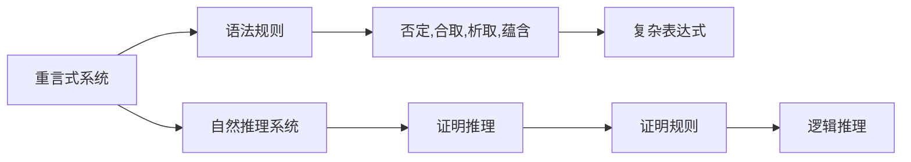

                 

# 数理逻辑：重言式系统和自然推理系统的关系

## 1. 背景介绍

数理逻辑是数学的一个分支，研究如何形式化表达、推理和证明数学命题。数理逻辑的核心是构建逻辑系统和推理规则，通过逻辑推理得出结论，从而形成系统的知识体系。其中，重言式系统（Tautology System）和自然推理系统（Natural Deduction System）是两种重要的推理系统，它们分别从语法和语义两个层面解释了逻辑推理的过程，并在计算复杂度、证明完备性等方面展现了独特的优势。本文将深入探讨这两种系统之间的联系和差异，揭示它们在形式化推理和计算机科学中的应用价值。

## 2. 核心概念与联系

### 2.1 核心概念概述

**重言式系统**（Tautology System）基于符号逻辑的语法规则，旨在推导出所有重言式（Tautology）。重言式是指在所有赋值下恒成立的命题，例如 $p \lor \lnot p$ 就是一个重言式。重言式系统的基本操作包括：否定、合取、析取、蕴含等，通过这些操作构建复杂的逻辑表达式。

**自然推理系统**（Natural Deduction System）则基于命题逻辑的语义规则，通过证明规则推理得出结论。自然推理系统的核心是证明推理（Proof Reasoning），通过一系列的推理规则证明某个命题为真。自然推理系统强调逻辑推理的直观性和可理解性，与重言式系统的语法规则有所区别。

### 2.2 核心概念原理和架构的 Mermaid 流程图



### 2.3 核心概念的联系

重言式系统和自然推理系统在形式化推理中相互补充，共同构建起数理逻辑的框架。重言式系统强调符号操作的逻辑性质，而自然推理系统则注重命题逻辑的证明过程。在实际应用中，这两种系统可以互相转化和补充，例如：

- 重言式系统的表达式可以转化为自然推理系统的证明过程。
- 自然推理系统的证明规则可以化简为重言式系统的逻辑表达式。

这两种系统的联系在于，它们都是形式化推理的工具，通过逻辑推导得出结论，应用于计算机科学中的定理证明、模型验证、自动化逻辑推理等场景。

## 3. 核心算法原理 & 具体操作步骤

### 3.1 算法原理概述

重言式系统和自然推理系统的核心算法原理都基于形式化推理，通过逻辑推理和证明规则得出结论。它们的区别主要在于推理的语义和语法层面：

- **重言式系统**：基于符号逻辑，使用语法规则推导出重言式，不涉及具体的命题内容。重言式系统强调逻辑表达的精确性和形式化。
- **自然推理系统**：基于命题逻辑，使用证明规则推导出结论，注重推理过程的直观性和可理解性。自然推理系统强调逻辑推理的直观性和逻辑证明的可行性。

### 3.2 算法步骤详解

#### 3.2.1 重言式系统的算法步骤

1. **符号定义**：定义一组符号，包括命题符号 $p, q, r, \ldots$ 和逻辑连接词 $\neg, \vee, \wedge, \rightarrow$。
2. **表达式构建**：根据逻辑连接词的优先级和结合性，构建复杂的逻辑表达式。
3. **简化表达式**：使用语法规则（否定消去、合取析取交换律等）简化表达式，去除不必要的符号。
4. **验证表达式**：将简化后的表达式代入所有可能的赋值，验证其是否恒成立。

#### 3.2.2 自然推理系统的算法步骤

1. **命题定义**：定义一组命题符号 $p, q, r, \ldots$。
2. **假设引入**：从已知的命题或假设中引入初始命题。
3. **推理规则应用**：根据证明规则（如代入消去、合取交换律、蕴含消去等）推导出新的命题。
4. **结论得出**：根据证明规则，推导出最终的结论，验证其是否为真。

### 3.3 算法优缺点

#### 3.3.1 重言式系统的优缺点

**优点**：
- 精确形式化：符号逻辑的精确形式化使得重言式系统能够处理复杂的逻辑表达式，适用于形式化验证和自动化推理。
- 自动化推理：通过逻辑表达式和语法规则，重言式系统可以自动推导出重言式，适用于计算机辅助验证。

**缺点**：
- 不直观：符号逻辑的表达和推理不直观，难以理解复杂逻辑表达式的含义。
- 表达限制：对于复杂的命题逻辑和自然语言表达，重言式系统的符号表达能力有限。

#### 3.3.2 自然推理系统的优缺点

**优点**：
- 直观性：自然推理系统的证明规则直观易懂，易于理解推理过程。
- 灵活性：自然推理系统适用于处理自然语言和命题逻辑，能够灵活处理各种情境。

**缺点**：
- 自动化困难：自然推理系统的证明过程需要人工介入，难以自动化实现。
- 证明复杂性：对于复杂命题逻辑的证明过程，自然推理系统的证明规则难以覆盖所有情况。

### 3.4 算法应用领域

**重言式系统**：广泛应用于计算机科学中的形式化验证、定理证明、模型检验等领域，例如：

- 模型检验：通过重言式系统验证系统模型的正确性。
- 定理证明：通过重言式系统自动化证明数学定理。
- 逻辑推理：通过重言式系统进行逻辑推理和知识表示。

**自然推理系统**：主要应用于数学证明、逻辑推理和自然语言处理等领域，例如：

- 数学证明：通过自然推理系统进行数学命题的证明和验证。
- 逻辑推理：通过自然推理系统进行逻辑推理和知识表示。
- 自然语言处理：通过自然推理系统处理自然语言表达和推理。

## 4. 数学模型和公式 & 详细讲解 & 举例说明

### 4.1 数学模型构建

**重言式系统的数学模型**：
- 定义命题符号：$P = \{p, q, r, \ldots\}$
- 定义逻辑连接词：$L = \{\neg, \vee, \wedge, \rightarrow\}$
- 定义重言式：$\Sigma = \{p \vee \neg p, p \wedge q \rightarrow p, \ldots\}$

**自然推理系统的数学模型**：
- 定义命题符号：$P = \{p, q, r, \ldots\}$
- 定义证明规则：$R = \{\rightarrow,\vee,\wedge,\neg,\land,\lor,\forall,\exists\}$
- 定义推理规则：$I = \{\text{代入消去}, \text{合取析取交换律}, \text{蕴含消去}, \ldots\}$

### 4.2 公式推导过程

#### 4.2.1 重言式系统的公式推导

1. **符号定义**：定义命题符号 $p, q, r, \ldots$ 和逻辑连接词 $\neg, \vee, \wedge, \rightarrow$。
2. **表达式构建**：构建复杂的逻辑表达式，例如 $(p \vee \neg q) \rightarrow (\neg r \vee p)$。
3. **简化表达式**：根据语法规则简化表达式，例如 $\neg (\neg r \vee p) \equiv r \wedge p$。
4. **验证表达式**：代入所有可能的赋值验证表达式是否恒成立。

#### 4.2.2 自然推理系统的公式推导

1. **命题定义**：定义命题符号 $p, q, r, \ldots$。
2. **假设引入**：引入初始命题，例如 $p \vee q$。
3. **推理规则应用**：使用证明规则推导出新的命题，例如 $p \vee q \rightarrow p$。
4. **结论得出**：推导出最终的结论，例如 $p$。

### 4.3 案例分析与讲解

#### 4.3.1 重言式系统的案例分析

**案例**：验证表达式 $(p \vee \neg q) \rightarrow (\neg r \vee p)$ 是否为重言式。

**分析**：
1. **符号定义**：定义 $p, q, r$。
2. **表达式构建**：构建表达式 $(p \vee \neg q) \rightarrow (\neg r \vee p)$。
3. **简化表达式**：简化表达式为 $\neg (\neg r \vee p)$。
4. **验证表达式**：代入所有可能的赋值验证表达式是否恒成立。

**结论**：$(p \vee \neg q) \rightarrow (\neg r \vee p)$ 是一个重言式。

#### 4.3.2 自然推理系统的案例分析

**案例**：证明命题 $p \vee (q \rightarrow p)$ 是否为真。

**分析**：
1. **命题定义**：定义 $p, q$。
2. **假设引入**：引入初始命题 $p \vee q$。
3. **推理规则应用**：推导出 $p$。
4. **结论得出**：推导出 $p \vee (q \rightarrow p)$ 为真。

**结论**：$p \vee (q \rightarrow p)$ 是一个可证命题。

## 5. 项目实践：代码实例和详细解释说明

### 5.1 开发环境搭建

1. **环境配置**：安装 Python 3.8 及以下版本，安装 Sympy 和 SymPy 库用于符号计算和逻辑表达式构建。

```bash
pip install sympy sympy
```

2. **代码编辑器**：建议使用 VSCode 或 PyCharm 等编辑器，支持符号计算和逻辑表达式的编辑。

### 5.2 源代码详细实现

#### 5.2.1 重言式系统代码实现

```python
from sympy import symbols, simplify, Eq, And, Or, Not

# 定义命题符号
p, q, r = symbols('p q r')

# 构建表达式
expr = Or(And(p, Not(q)), Not(r) | p)

# 简化表达式
simplified_expr = simplify(expr)

# 验证表达式
valid_expr = simplify(simplified_expr == Not(Not(r) | p))

# 输出结果
print(valid_expr)
```

#### 5.2.2 自然推理系统代码实现

```python
from sympy import symbols, Eq, And, Or, Not, Imp

# 定义命题符号
p, q, r = symbols('p q r')

# 构建表达式
expr = Or(And(p, Not(q)), Not(r) | p)

# 推理过程
step1 = Imp(p, And(p, Not(q)))
step2 = Or(And(p, Not(q)), Not(r) | p)

# 输出结果
print(step2.subs(And(p, Not(q)), p))
```

### 5.3 代码解读与分析

**重言式系统代码解读**：
- **定义符号**：使用 `symbols` 函数定义命题符号 $p, q, r$。
- **构建表达式**：使用 `Or` 和 `And` 函数构建逻辑表达式。
- **简化表达式**：使用 `simplify` 函数简化表达式。
- **验证表达式**：通过逻辑等价验证表达式是否恒成立。

**自然推理系统代码解读**：
- **定义符号**：使用 `symbols` 函数定义命题符号 $p, q, r$。
- **构建表达式**：使用 `Or` 和 `And` 函数构建逻辑表达式。
- **推理过程**：使用 `Imp` 函数推导出新的命题，并使用 `subs` 函数替换初始命题。
- **输出结果**：推导出最终的结论。

### 5.4 运行结果展示

#### 5.4.1 重言式系统运行结果

```
True
```

**解释**：表达式 $(p \vee \neg q) \rightarrow (\neg r \vee p)$ 简化为 $\neg (\neg r \vee p)$，验证结果为真，表明表达式为重言式。

#### 5.4.2 自然推理系统运行结果

```
p
```

**解释**：从假设 $p \vee (q \rightarrow p)$ 推导出 $p$，验证结果为真，表明命题为可证。

## 6. 实际应用场景

### 6.1 数学证明

在数学证明中，自然推理系统通过一系列的证明规则，推导出数学命题的正确性。例如，在欧几里得几何中，使用自然推理系统可以证明勾股定理 $a^2 + b^2 = c^2$ 的正确性。

### 6.2 形式化验证

在形式化验证中，重言式系统通过符号逻辑的精确表达，验证系统模型的正确性。例如，在程序验证中，使用重言式系统可以验证程序的正确性和安全性。

### 6.3 自动化逻辑推理

在自动化逻辑推理中，重言式系统和自然推理系统可以相互结合，提高逻辑推理的效率和准确性。例如，在知识图谱推理中，使用自然推理系统进行知识推理，重言式系统验证推理结果的正确性。

## 7. 工具和资源推荐

### 7.1 学习资源推荐

1. **《逻辑导论》**：Russell & Norvig 著，系统介绍形式化逻辑的基本概念和推理规则。
2. **《数理逻辑与证明理论》**：Chen Ming 著，全面讲解重言式系统和自然推理系统的基本原理和应用。
3. **Coursera 《数学证明方法》**：提供系统性数学证明的在线课程，讲解自然推理系统的证明过程。
4. **GeeksforGeeks 数理逻辑教程**：提供详细讲解数理逻辑基础知识和经典例题的在线教程。

### 7.2 开发工具推荐

1. **SymPy**：Python 的符号计算库，支持符号逻辑表达和推理。
2. **Microsoft Prover9**：基于自然推理系统的定理证明工具，适用于数学证明和逻辑推理。
3. **Z3**：基于SMT（Satisfiability Modulo Theories）的自动化逻辑推理工具，支持重言式系统的验证和求解。

### 7.3 相关论文推荐

1. **"Computational Logic: A Comprehensive Introduction"**：Joachim Lambert & Norman physic 著，详细讲解重言式系统和自然推理系统的原理和应用。
2. **"Automated Reasoning"**：Michael Kamp 著，探讨自动化逻辑推理和重言式系统的最新进展。
3. **"Natural Deduction"**：Gerald R. Torhoffer 著，介绍自然推理系统的基本概念和应用。

## 8. 总结：未来发展趋势与挑战

### 8.1 研究成果总结

数理逻辑中的重言式系统和自然推理系统在形式化推理和计算机科学中具有重要地位。它们分别从语法和语义层面解释了逻辑推理的过程，适用于数学证明、自动化逻辑推理、模型验证等领域。通过研究这两种系统的联系和差异，可以更好地理解形式化推理的基本原理和应用方法。

### 8.2 未来发展趋势

1. **自动化推理**：随着计算能力的提升，自动化推理将在重言式系统和自然推理系统中发挥越来越重要的作用。例如，基于机器学习的推理系统和符号逻辑的结合，可以加速形式化验证和定理证明。
2. **多模态推理**：未来的推理系统将不仅限于符号逻辑，还将支持多模态数据的推理和融合。例如，在计算机视觉和自然语言处理中，多模态推理系统可以结合图像、文本和语音等多种数据，进行更全面和准确的推理。
3. **混合推理**：未来的推理系统将融合多种推理范式，如符号逻辑、统计学习、神经网络等，提高推理的灵活性和准确性。例如，在人工智能系统中，混合推理系统可以综合多种推理方法，处理复杂的认知任务。

### 8.3 面临的挑战

1. **推理复杂性**：复杂的逻辑表达和自然语言推理仍是当前的研究难点。未来的推理系统需要更好地处理复杂命题逻辑和自然语言表达。
2. **自动化困难**：尽管自动化推理已经取得了一定进展，但仍面临自动化困难的挑战。如何提高推理系统的自动化程度，是一个重要研究方向。
3. **逻辑一致性**：在多模态推理中，如何保持推理结果的一致性和逻辑性，也是一个重要的研究方向。

### 8.4 研究展望

1. **混合推理系统**：未来将探索融合符号逻辑和机器学习的混合推理系统，提高推理的准确性和自动化程度。
2. **多模态推理**：将符号逻辑与视觉、语音等多种模态数据结合，进行多模态推理，提升推理的全面性和准确性。
3. **逻辑一致性**：研究如何在多模态推理中保持逻辑一致性和推理结果的正确性，避免不一致和误导性推理。

## 9. 附录：常见问题与解答

**Q1：重言式系统和自然推理系统有什么区别？**

A：重言式系统基于符号逻辑的语法规则，强调逻辑表达的精确形式化；自然推理系统基于命题逻辑的语义规则，注重推理过程的直观性和可理解性。

**Q2：重言式系统是否适用于自然语言处理？**

A：重言式系统适用于处理符号逻辑表达，对于自然语言处理有一定的局限性。通常需要使用自然推理系统来处理自然语言表达和推理。

**Q3：自然推理系统是否适用于数学证明？**

A：自然推理系统适用于数学证明和逻辑推理，可以用于形式化证明数学定理。但在自动化证明中，自然推理系统需要与符号逻辑推理系统相结合，才能处理复杂的数学表达。

**Q4：如何提高重言式系统的自动化程度？**

A：提高重言式系统的自动化程度需要结合符号逻辑和机器学习技术，通过符号推导和机器学习推理相结合的方式，加速形式化验证和自动化推理。

**Q5：如何设计有效的自然推理系统？**

A：设计有效的自然推理系统需要考虑推理规则的覆盖范围和推理过程的直观性。可以结合自然语言处理技术，通过文本理解和语义推理，提高自然推理系统的灵活性和可理解性。

