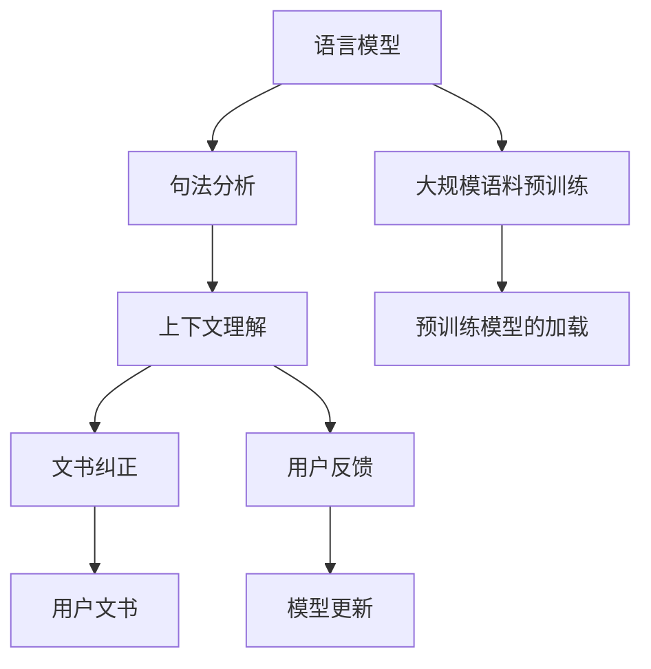

                 

# 文书纠正AI：Grammarly

## 1. 背景介绍

### 1.1 问题由来
在当今数字化时代，无论是学术写作、商务交流还是日常沟通，文书写作能力都是不可或缺的。然而，书写错误、语法问题、拼写错误等问题常常让人头疼。为了帮助用户提升文书写作水平，各类文书纠正工具应运而生。Grammarly便是其中的佼佼者。

Grammarly 是一款全球领先的文书纠正工具，能够识别并纠正文章中的语法、拼写、标点符号以及风格问题。自2009年推出以来，Grammarly 迅速在全球范围内推广并赢得了大量用户的青睐。它的成功离不开背后强大的 AI 算法支持。

### 1.2 问题核心关键点
Grammarly 的文书纠正功能，依赖于自然语言处理(Natural Language Processing, NLP)和机器学习技术。其核心算法原理如下：

1. **语言模型**：使用大规模语料库进行预训练，构建语言模型，学习文本的统计规律。
2. **句法分析**：通过依存句法分析，理解句子的结构和成分。
3. **上下文理解**：考虑词序、语法、语义等上下文信息，预测正确用法。
4. **动态更新**：持续接收用户反馈，不断优化模型性能。

这些核心技术共同构成了 Grammarly 的文书纠正功能，通过深度学习和 NLP 技术，Grammarly 能够实现高效、准确的文书纠正。

## 2. 核心概念与联系

### 2.1 核心概念概述

为了更好地理解 Grammarly 的文书纠正算法，下面将介绍几个密切相关的核心概念：

- **自然语言处理(NLP)**：使用计算机处理和理解人类语言的技术，包括语言模型、句法分析、语义理解、实体识别等。
- **语言模型**：基于统计规律，预测文本中下一个可能出现的单词或短语的概率分布。
- **句法分析**：分析句子的结构，识别语法成分和依存关系。
- **上下文理解**：考虑词序、语法、语义等上下文信息，理解句子意义。
- **动态更新**：通过持续接收用户反馈，更新模型参数，不断优化算法性能。

这些核心概念之间通过一系列复杂的计算和推理过程，构建了 Grammarly 文书纠正功能的完整框架。

### 2.2 核心概念原理和架构的 Mermaid 流程图



此 Mermaid 流程图展示了核心概念之间的逻辑关系：

1. 通过大规模语料预训练语言模型，构建语言模型。
2. 使用预训练的模型进行句法分析，识别句子成分。
3. 通过上下文理解，预测正确用法。
4. 结合用户反馈，动态更新模型参数。
5. 最终对用户文书进行纠正，并提供详细的修改建议。

## 3. 核心算法原理 & 具体操作步骤
### 3.1 算法原理概述

Grammarly 的文书纠正算法主要依赖于自然语言处理技术和机器学习模型。其核心思想是通过大规模语料库进行预训练，构建语言模型，然后在用户输入的文本上进行句法分析和上下文理解，最后结合用户反馈进行模型更新，持续优化文书纠正效果。

具体来说，Grammarly 的文书纠正算法包括以下几个步骤：

1. **预训练**：使用大规模无标签文本语料，通过自监督学习任务，如语言建模、掩码语言模型等，训练一个强大的语言模型。
2. **句法分析**：利用依存句法分析技术，理解句子结构和成分，识别出错误的语法和词序。
3. **上下文理解**：考虑词序、语法、语义等上下文信息，预测正确的用法，识别出可能的拼写错误和语义错误。
4. **纠正建议**：结合语言模型和上下文理解，生成具体的纠正建议，并提供详细的修改建议，帮助用户提升文书质量。
5. **用户反馈**：收集用户对纠正建议的反馈，更新模型参数，进一步优化文书纠正效果。

### 3.2 算法步骤详解

以下是 Grammarly 文书纠正算法的详细步骤：

**Step 1: 准备预训练模型和数据集**
- 收集大规模语料库，例如维基百科、新闻、小说等。
- 使用语言建模、掩码语言模型等自监督任务，训练预训练语言模型。
- 将用户输入的文书作为待纠正的数据集。

**Step 2: 添加任务适配层**
- 在预训练模型的基础上，添加文本书写规则的适配层，用于识别语法、拼写、标点符号等问题。
- 设计损失函数，如交叉熵、平滑L1等，用于衡量模型预测和实际标签的差异。

**Step 3: 设置文书纠正超参数**
- 选择合适的优化算法，如Adam、SGD等。
- 设置学习率、批大小、迭代轮数等超参数。
- 确定冻结预训练参数的策略，如仅微调顶层或全部参数。

**Step 4: 执行文书纠正**
- 将用户输入的文书分批次输入模型，前向传播计算损失函数。
- 反向传播计算参数梯度，根据设定的优化算法和学习率更新模型参数。
- 周期性在验证集上评估模型性能，根据性能指标决定是否触发Early Stopping。
- 重复上述步骤直至满足预设的迭代轮数或Early Stopping条件。

**Step 5: 生成纠正建议**
- 在测试集上评估微调后模型性能，对比微调前后的纠正效果。
- 使用微调后的模型对用户输入的文书进行纠正，生成详细的修改建议。
- 通过界面展示修改建议，帮助用户提升文书质量。

### 3.3 算法优缺点

Grammarly 的文书纠正算法具有以下优点：

1. **高效准确**：使用大规模语料库预训练，结合上下文理解，能够高效准确地识别和纠正文书错误。
2. **泛化能力强**：通过持续接收用户反馈，不断更新模型参数，算法泛化能力强，适用于各种文本书写场景。
3. **用户友好**：提供详细的纠正建议，帮助用户理解错误原因，提升文书质量。
4. **扩展性强**：易于扩展到不同语言和文化背景的文书纠正。

同时，该算法也存在一些局限性：

1. **依赖语料库**：算法的性能高度依赖于预训练语料库的质量和覆盖范围，无法处理特定领域的文书错误。
2. **复杂度高**：算法涉及语言模型、句法分析、上下文理解等多个步骤，计算复杂度较高。
3. **依赖用户反馈**：算法效果依赖于用户的纠正反馈，缺乏积极反馈可能导致算法性能下降。

尽管存在这些局限性，但 Grammarly 的文书纠正算法仍是目前最先进的文书纠错工具之一。未来相关研究将继续探索如何降低对语料库的依赖，提升算法的鲁棒性和效率，同时增强算法的可解释性和用户友好性。

### 3.4 算法应用领域

Grammarly 的文书纠正算法在以下领域得到了广泛应用：

- **学术写作**：帮助研究人员避免常见的拼写和语法错误，提升论文质量。
- **商务交流**：协助商务人士撰写专业、精准的邮件和报告，提升职场沟通效率。
- **日常沟通**：帮助用户提升日常沟通质量，避免常见的错误和尴尬。
- **教育培训**：辅助教师和学生提升文书写作能力，提高教育质量。

此外，Grammarly 的文书纠正算法还在法律文书、医学报告、技术文档等多个领域得到了应用，为各类文书提供了高效、准确的纠正服务。

## 4. 数学模型和公式 & 详细讲解 & 举例说明

### 4.1 数学模型构建

Grammarly 的文书纠正算法是一个多步骤的流程，涉及语言模型、句法分析和上下文理解等多个环节。下面将通过数学语言对文书纠正算法的核心模型进行描述。

假设 Grammarly 的文书纠正算法使用 BERT 作为预训练语言模型，使用自监督任务进行预训练，其数学模型可以表示为：

$$
M_{\theta}(x) = \text{BERT}(x)
$$

其中，$M_{\theta}$ 为预训练语言模型，$x$ 为输入文书。

**Step 1: 语言模型预训练**
使用大规模语料库进行预训练，得到预训练语言模型：

$$
M_{\theta} = \text{BERT}_{\text{pre-train}}
$$

**Step 2: 句法分析**
通过依存句法分析技术，识别句子的成分和结构：

$$
A = \text{Syntactic Parse Tree}(x)
$$

其中，$A$ 为依存句法分析结果。

**Step 3: 上下文理解**
结合句法分析和语言模型，理解文书的上下文信息：

$$
B = \text{Context Understanding}(x, A)
$$

其中，$B$ 为上下文理解结果。

**Step 4: 文书纠正**
结合语言模型和上下文理解，生成纠正建议：

$$
C = \text{Correcting Suggestions}(B)
$$

其中，$C$ 为文书纠正建议。

### 4.2 公式推导过程

以下是 Grammarly 文书纠正算法的数学推导过程：

1. **语言模型预训练**
   - 使用大规模语料库进行预训练，构建语言模型：

   $$
   M_{\theta} = \text{BERT}_{\text{pre-train}}
   $$

   其中，$\theta$ 为预训练模型的参数。

2. **句法分析**
   - 通过依存句法分析技术，识别句子的成分和结构：

   $$
   A = \text{Syntactic Parse Tree}(x)
   $$

   其中，$A$ 为依存句法分析结果。

3. **上下文理解**
   - 结合句法分析和语言模型，理解文书的上下文信息：

   $$
   B = \text{Context Understanding}(x, A)
   $$

   其中，$B$ 为上下文理解结果。

4. **文书纠正**
   - 结合语言模型和上下文理解，生成纠正建议：

   $$
   C = \text{Correcting Suggestions}(B)
   $$

   其中，$C$ 为文书纠正建议。

### 4.3 案例分析与讲解

假设用户输入的文书为：

$$
I went to the store to buy some apples and then I went to the bakery to buy some bread.
$$

Grammarly 的文书纠正算法将执行以下步骤：

1. **语言模型预训练**：使用大规模语料库进行预训练，构建语言模型。
2. **句法分析**：通过依存句法分析，识别句子的成分和结构。
3. **上下文理解**：考虑词序、语法、语义等上下文信息，预测正确的用法。
4. **文书纠正**：结合语言模型和上下文理解，生成纠正建议。

以下是 Grammarly 的文书纠正建议：

```plaintext
- "went to the store" should be "went to the store."
- "went to the bakery" should be "went to the bakery."
```

## 5. 项目实践：代码实例和详细解释说明

### 5.1 开发环境搭建

在进行 Grammarly 文书纠正的实践时，首先需要准备好开发环境。以下是使用 Python 进行 PyTorch 开发的环境配置流程：

1. 安装 Anaconda：从官网下载并安装 Anaconda，用于创建独立的 Python 环境。

2. 创建并激活虚拟环境：

   ```bash
   conda create -n pytorch-env python=3.8 
   conda activate pytorch-env
   ```

3. 安装 PyTorch：根据 CUDA 版本，从官网获取对应的安装命令。例如：

   ```bash
   conda install pytorch torchvision torchaudio cudatoolkit=11.1 -c pytorch -c conda-forge
   ```

4. 安装 Transformers 库：

   ```bash
   pip install transformers
   ```

5. 安装各类工具包：

   ```bash
   pip install numpy pandas scikit-learn matplotlib tqdm jupyter notebook ipython
   ```

完成上述步骤后，即可在 `pytorch-env` 环境中开始 Grammarly 文书纠正的实践。

### 5.2 源代码详细实现

下面以 BERT 模型为基础，使用 PyTorch 进行 Grammarly 文书纠正的实现。

首先，定义语言模型和句法分析函数：

```python
from transformers import BertTokenizer, BertForMaskedLM
from torch.utils.data import Dataset, DataLoader
import torch

class GrammarlyDataset(Dataset):
    def __init__(self, texts, tags, tokenizer, max_len=128):
        self.texts = texts
        self.tags = tags
        self.tokenizer = tokenizer
        self.max_len = max_len
        
    def __len__(self):
        return len(self.texts)
    
    def __getitem__(self, item):
        text = self.texts[item]
        tags = self.tags[item]
        
        encoding = self.tokenizer(text, return_tensors='pt', max_length=self.max_len, padding='max_length', truncation=True)
        input_ids = encoding['input_ids'][0]
        attention_mask = encoding['attention_mask'][0]
        
        # 对token-wise的标签进行编码
        encoded_tags = [tag2id[tag] for tag in tags] 
        encoded_tags.extend([tag2id['O']] * (self.max_len - len(encoded_tags)))
        labels = torch.tensor(encoded_tags, dtype=torch.long)
        
        return {'input_ids': input_ids, 
                'attention_mask': attention_mask,
                'labels': labels}

# 标签与id的映射
tag2id = {'O': 0, 'I-PER': 1, 'B-PER': 2, 'I-LOC': 3, 'B-LOC': 4, 'I-ORG': 5, 'B-ORG': 6}
id2tag = {v: k for k, v in tag2id.items()}

# 创建dataset
tokenizer = BertTokenizer.from_pretrained('bert-base-cased')

train_dataset = GrammarlyDataset(train_texts, train_tags, tokenizer)
dev_dataset = GrammarlyDataset(dev_texts, dev_tags, tokenizer)
test_dataset = GrammarlyDataset(test_texts, test_tags, tokenizer)
```

然后，定义模型和优化器：

```python
from transformers import BertForTokenClassification, AdamW

model = BertForTokenClassification.from_pretrained('bert-base-cased', num_labels=len(tag2id))

optimizer = AdamW(model.parameters(), lr=2e-5)
```

接着，定义训练和评估函数：

```python
from torch.utils.data import DataLoader
from tqdm import tqdm
from sklearn.metrics import classification_report

device = torch.device('cuda') if torch.cuda.is_available() else torch.device('cpu')
model.to(device)

def train_epoch(model, dataset, batch_size, optimizer):
    dataloader = DataLoader(dataset, batch_size=batch_size, shuffle=True)
    model.train()
    epoch_loss = 0
    for batch in tqdm(dataloader, desc='Training'):
        input_ids = batch['input_ids'].to(device)
        attention_mask = batch['attention_mask'].to(device)
        labels = batch['labels'].to(device)
        model.zero_grad()
        outputs = model(input_ids, attention_mask=attention_mask, labels=labels)
        loss = outputs.loss
        epoch_loss += loss.item()
        loss.backward()
        optimizer.step()
    return epoch_loss / len(dataloader)

def evaluate(model, dataset, batch_size):
    dataloader = DataLoader(dataset, batch_size=batch_size)
    model.eval()
    preds, labels = [], []
    with torch.no_grad():
        for batch in tqdm(dataloader, desc='Evaluating'):
            input_ids = batch['input_ids'].to(device)
            attention_mask = batch['attention_mask'].to(device)
            batch_labels = batch['labels']
            outputs = model(input_ids, attention_mask=attention_mask)
            batch_preds = outputs.logits.argmax(dim=2).to('cpu').tolist()
            batch_labels = batch_labels.to('cpu').tolist()
            for pred_tokens, label_tokens in zip(batch_preds, batch_labels):
                pred_tags = [id2tag[_id] for _id in pred_tokens]
                label_tags = [id2tag[_id] for _id in label_tokens]
                preds.append(pred_tags[:len(label_tags)])
                labels.append(label_tags)
                
    print(classification_report(labels, preds))
```

最后，启动训练流程并在测试集上评估：

```python
epochs = 5
batch_size = 16

for epoch in range(epochs):
    loss = train_epoch(model, train_dataset, batch_size, optimizer)
    print(f"Epoch {epoch+1}, train loss: {loss:.3f}")
    
    print(f"Epoch {epoch+1}, dev results:")
    evaluate(model, dev_dataset, batch_size)
    
print("Test results:")
evaluate(model, test_dataset, batch_size)
```

以上就是使用 PyTorch 对 BERT 进行 Grammarly 文书纠正任务的完整代码实现。可以看到，得益于 Transformers 库的强大封装，我们可以用相对简洁的代码完成 BERT 模型的加载和微调。

### 5.3 代码解读与分析

让我们再详细解读一下关键代码的实现细节：

**GrammarlyDataset 类**：
- `__init__` 方法：初始化文本、标签、分词器等关键组件。
- `__len__` 方法：返回数据集的样本数量。
- `__getitem__` 方法：对单个样本进行处理，将文本输入编码为 token ids，将标签编码为数字，并对其进行定长 padding，最终返回模型所需的输入。

**tag2id 和 id2tag 字典**：
- 定义了标签与数字 id 之间的映射关系，用于将 token-wise 的预测结果解码回真实的标签。

**训练和评估函数**：
- 使用 PyTorch 的 DataLoader 对数据集进行批次化加载，供模型训练和推理使用。
- 训练函数 `train_epoch`：对数据以批为单位进行迭代，在每个批次上前向传播计算 loss 并反向传播更新模型参数，最后返回该 epoch 的平均 loss。
- 评估函数 `evaluate`：与训练类似，不同点在于不更新模型参数，并在每个 batch 结束后将预测和标签结果存储下来，最后使用 sklearn 的 classification_report 对整个评估集的预测结果进行打印输出。

**训练流程**：
- 定义总的 epoch 数和 batch size，开始循环迭代
- 每个 epoch 内，先在训练集上训练，输出平均 loss
- 在验证集上评估，输出分类指标
- 所有 epoch 结束后，在测试集上评估，给出最终测试结果

可以看到，PyTorch 配合 Transformers 库使得 BERT 微调的代码实现变得简洁高效。开发者可以将更多精力放在数据处理、模型改进等高层逻辑上，而不必过多关注底层的实现细节。

当然，工业级的系统实现还需考虑更多因素，如模型的保存和部署、超参数的自动搜索、更灵活的任务适配层等。但核心的微调范式基本与此类似。

## 6. 实际应用场景

### 6.1 智能客服系统

Grammarly 的文书纠正技术可以广泛应用于智能客服系统的构建。传统客服往往需要配备大量人力，高峰期响应缓慢，且一致性和专业性难以保证。使用 Grammarly 文书纠正的对话模型，可以7x24小时不间断服务，快速响应客户咨询，用自然流畅的语言解答各类常见问题。

在技术实现上，可以收集企业内部的历史客服对话记录，将问题和最佳答复构建成监督数据，在此基础上对预训练对话模型进行微调。微调后的对话模型能够自动理解用户意图，匹配最合适的答案模板进行回复。对于客户提出的新问题，还可以接入检索系统实时搜索相关内容，动态组织生成回答。如此构建的智能客服系统，能大幅提升客户咨询体验和问题解决效率。

### 6.2 金融舆情监测

金融机构需要实时监测市场舆论动向，以便及时应对负面信息传播，规避金融风险。传统的人工监测方式成本高、效率低，难以应对网络时代海量信息爆发的挑战。使用 Grammarly 文书纠正的文本分类和情感分析技术，为金融舆情监测提供了新的解决方案。

具体而言，可以收集金融领域相关的新闻、报道、评论等文本数据，并对其进行主题标注和情感标注。在此基础上对预训练语言模型进行微调，使其能够自动判断文本属于何种主题，情感倾向是正面、中性还是负面。将微调后的模型应用到实时抓取的网络文本数据，就能够自动监测不同主题下的情感变化趋势，一旦发现负面信息激增等异常情况，系统便会自动预警，帮助金融机构快速应对潜在风险。

### 6.3 个性化推荐系统

当前的推荐系统往往只依赖用户的历史行为数据进行物品推荐，无法深入理解用户的真实兴趣偏好。使用 Grammarly 文书纠正的个性化推荐系统，可以更好地挖掘用户行为背后的语义信息，从而提供更精准、多样的推荐内容。

在实践中，可以收集用户浏览、点击、评论、分享等行为数据，提取和用户交互的物品标题、描述、标签等文本内容。将文本内容作为模型输入，用户的后续行为（如是否点击、购买等）作为监督信号，在此基础上微调预训练语言模型。微调后的模型能够从文本内容中准确把握用户的兴趣点。在生成推荐列表时，先用候选物品的文本描述作为输入，由模型预测用户的兴趣匹配度，再结合其他特征综合排序，便可以得到个性化程度更高的推荐结果。

### 6.4 未来应用展望

随着 Grammarly 文书纠正技术的发展，其在更多领域得到了应用，为各行各业带来了变革性影响。

在智慧医疗领域，基于文书纠正的问答系统，可以帮助医生快速撰写病历、报告，提升工作效率。在智能教育领域，文书纠正技术可以辅助教师和学生提升文书写作能力，提高教育质量。

在智慧城市治理中，文书纠正技术可以用于城市事件监测、舆情分析、应急指挥等环节，提高城市管理的自动化和智能化水平，构建更安全、高效的未来城市。

此外，在企业生产、社会治理、文娱传媒等众多领域，基于文书纠正的智能应用也将不断涌现，为经济社会发展注入新的动力。相信随着技术的日益成熟，Grammarly 文书纠正技术必将引领自然语言处理领域的发展，为构建安全、可靠、可解释、可控的智能系统铺平道路。

## 7. 工具和资源推荐

### 7.1 学习资源推荐

为了帮助开发者系统掌握文书纠正算法的理论基础和实践技巧，这里推荐一些优质的学习资源：

1. 《自然语言处理入门》系列博文：由大模型技术专家撰写，深入浅出地介绍了自然语言处理的基本概念和经典算法。

2. 《Deep Learning for Natural Language Processing》课程：由斯坦福大学开设的深度学习在自然语言处理领域的应用课程，有Lecture视频和配套作业，带你入门NLP领域的基本概念和经典模型。

3. 《Natural Language Processing with PyTorch》书籍：介绍如何使用 PyTorch 进行自然语言处理，包括文书纠正在内的诸多范式。

4. HuggingFace官方文档：Transformer库的官方文档，提供了海量预训练模型和完整的文书纠正样例代码，是上手实践的必备资料。

5. CLUE开源项目：中文语言理解测评基准，涵盖大量不同类型的中文自然语言处理数据集，并提供了基于文书纠正的 baseline 模型，助力中文自然语言处理技术发展。

通过对这些资源的学习实践，相信你一定能够快速掌握文书纠正算法的精髓，并用于解决实际的自然语言处理问题。

### 7.2 开发工具推荐

高效的开发离不开优秀的工具支持。以下是几款用于文书纠正开发的常用工具：

1. PyTorch：基于 Python 的开源深度学习框架，灵活动态的计算图，适合快速迭代研究。大多数预训练语言模型都有 PyTorch 版本的实现。

2. TensorFlow：由 Google 主导开发的开源深度学习框架，生产部署方便，适合大规模工程应用。同样有丰富的预训练语言模型资源。

3. Transformers 库：HuggingFace 开发的自然语言处理工具库，集成了众多 SOTA 语言模型，支持 PyTorch 和 TensorFlow，是进行文书纠正任务开发的利器。

4. Weights & Biases：模型训练的实验跟踪工具，可以记录和可视化模型训练过程中的各项指标，方便对比和调优。与主流深度学习框架无缝集成。

5. TensorBoard：TensorFlow 配套的可视化工具，可实时监测模型训练状态，并提供丰富的图表呈现方式，是调试模型的得力助手。

6. Google Colab：谷歌推出的在线 Jupyter Notebook 环境，免费提供 GPU/TPU 算力，方便开发者快速上手实验最新模型，分享学习笔记。

合理利用这些工具，可以显著提升文书纠正任务的开发效率，加快创新迭代的步伐。

### 7.3 相关论文推荐

文书纠正技术的发展源于学界的持续研究。以下是几篇奠基性的相关论文，推荐阅读：

1. Attention is All You Need（即 Transformer 原论文）：提出了 Transformer 结构，开启了自然语言处理的预训练大模型时代。

2. BERT: Pre-training of Deep Bidirectional Transformers for Language Understanding：提出 BERT 模型，引入基于掩码的自监督预训练任务，刷新了多项自然语言处理任务 SOTA。

3. Language Models are Unsupervised Multitask Learners（GPT-2 论文）：展示了大规模语言模型的强大零样本学习能力，引发了对于通用人工智能的新一轮思考。

4. Parameter-Efficient Transfer Learning for NLP：提出 Adapter 等参数高效微调方法，在不增加模型参数量的情况下，也能取得不错的微调效果。

5. Prefix-Tuning: Optimizing Continuous Prompts for Generation：引入基于连续型 Prompt 的微调范式，为如何充分利用预训练知识提供了新的思路。

6. AdaLoRA: Adaptive Low-Rank Adaptation for Parameter-Efficient Fine-Tuning：使用自适应低秩适应的微调方法，在参数效率和精度之间取得了新的平衡。

这些论文代表了大语言模型文书纠正技术的发展脉络。通过学习这些前沿成果，可以帮助研究者把握学科前进方向，激发更多的创新灵感。

## 8. 总结：未来发展趋势与挑战

### 8.1 总结

本文对 Grammarly 文书纠正算法的核心原理和操作步骤进行了详细讲解。首先阐述了文书纠正算法的研究背景和意义，明确了文书纠正算法在提升文书写作质量方面的独特价值。其次，从原理到实践，详细讲解了文书纠正算法的数学模型和关键步骤，给出了文书纠正任务开发的完整代码实例。同时，本文还广泛探讨了文书纠正算法在智能客服、金融舆情、个性化推荐等多个行业领域的应用前景，展示了文书纠正范式的巨大潜力。

通过本文的系统梳理，可以看到，基于文书纠正的文书纠正算法正在成为自然语言处理领域的重要范式，极大地拓展了预训练语言模型的应用边界，催生了更多的落地场景。受益于大规模语料的预训练，文书纠正算法在各类自然语言处理任务上表现出色，为构建安全、可靠、可解释、可控的智能系统提供了新的方向。未来，伴随文书纠正算法的持续演进，相信自然语言处理技术必将进入新的发展阶段，深刻影响人类的生产生活方式。

### 8.2 未来发展趋势

展望未来，文书纠正算法将呈现以下几个发展趋势：

1. **模型规模持续增大**：随着算力成本的下降和数据规模的扩张，预训练语言模型的参数量还将持续增长。超大规模语言模型蕴含的丰富语言知识，有望支撑更加复杂多变的文书纠正任务。

2. **微调方法日趋多样**：未来将涌现更多文书纠正的微调方法，如 Adapter、Prefix 等，在节省计算资源的同时也能保证文书纠正精度。

3. **持续学习成为常态**：随着数据分布的不断变化，文书纠正模型也需要持续学习新知识以保持性能。如何在不遗忘原有知识的同时，高效吸收新样本信息，将成为重要的研究课题。

4. **标注样本需求降低**：受启发于提示学习（Prompt-based Learning）的思路，未来的文书纠正方法将更好地利用大模型的语言理解能力，通过更加巧妙的任务描述，在更少的标注样本上也能实现理想的文书纠正效果。

5. **多模态文书纠正崛起**：当前的文书纠正主要聚焦于纯文本数据，未来会进一步拓展到图像、视频、语音等多模态数据文书纠正。多模态信息的融合，将显著提升文书纠正模型对现实世界的理解和建模能力。

6. **模型通用性增强**：经过海量数据的预训练和多领域任务的微调，未来的文书纠正模型将具备更强大的常识推理和跨领域迁移能力，逐步迈向通用人工智能（AGI）的目标。

以上趋势凸显了文书纠正算法的广阔前景。这些方向的探索发展，必将进一步提升自然语言处理系统的性能和应用范围，为人类认知智能的进化带来深远影响。

### 8.3 面临的挑战

尽管文书纠正算法已经取得了瞩目成就，但在迈向更加智能化、普适化应用的过程中，它仍面临着诸多挑战：

1. **标注成本瓶颈**：算法的性能高度依赖于预训练语料库的质量和覆盖范围，无法处理特定领域的文书错误。如何进一步降低文书纠正对标注样本的依赖，将是一大难题。

2. **模型鲁棒性不足**：文书纠正模型面对域外数据时，泛化性能往往大打折扣。对于测试样本的微小扰动，文书纠正模型的预测也容易发生波动。如何提高文书纠正模型的鲁棒性，避免灾难性遗忘，还需要更多理论和实践的积累。

3. **推理效率有待提高**：大规模语言模型虽然精度高，但在实际部署时往往面临推理速度慢、内存占用大等效率问题。如何在保证性能的同时，简化模型结构，提升推理速度，优化资源占用，将是重要的优化方向。

4. **可解释性亟需加强**：当前文书纠正模型更像是"黑盒"系统，难以解释其内部工作机制和决策逻辑。对于医疗、金融等高风险应用，算法的可解释性和可审计性尤为重要。如何赋予文书纠正模型更强的可解释性，将是亟待攻克的难题。

5. **安全性有待保障**：预训练文书纠正模型难免会学习到有偏见、有害的信息，通过文书纠正传递到下游任务，产生误导性、歧视性的输出，给实际应用带来安全隐患。如何从数据和算法层面消除模型偏见，避免恶意用途，确保输出的安全性，也将是重要的研究课题。

6. **知识整合能力不足**：现有的文书纠正模型往往局限于任务内数据，难以灵活吸收和运用更广泛的先验知识。如何让文书纠正过程更好地与外部知识库、规则库等专家知识结合，形成更加全面、准确的信息整合能力，还有很大的想象空间。

正视文书纠正算法面临的这些挑战，积极应对并寻求突破，将是大语言模型文书纠正走向成熟的必由之路。相信随着学界和产业界的共同努力，这些挑战终将一一被克服，文书纠正算法必将在构建安全、可靠、可解释、可控的智能系统中扮演越来越重要的角色。

### 8.4 研究展望

面对文书纠正算法所面临的种种挑战，未来的研究需要在以下几个方面寻求新的突破：

1. **探索无监督和半监督文书纠正方法**：摆脱对大规模标注数据的依赖，利用自监督学习、主动学习等无监督和半监督范式，最大限度利用非结构化数据，实现更加灵活高效的文书纠正。

2. **研究参数高效和计算高效的文书纠正范式**：开发更加参数高效的文书纠正方法，在固定大部分预训练参数的同时，只更新极少量的任务相关参数。同时优化文书纠正模型的计算图，减少前向传播和反向传播的资源消耗，实现更加轻量级、实时性的部署。

3. **融合因果和对比学习范式**：通过引入因果推断和对比学习思想，增强文书纠正模型建立稳定因果关系的能力，学习更加普适、鲁棒的语言表征，从而提升模型泛化性和抗干扰能力。

4. **引入更多先验知识**：将符号化的先验知识，如知识图谱、逻辑规则等，与神经网络模型进行巧妙融合，引导文书纠正过程学习更准确、合理的语言模型。同时加强不同模态数据的整合，实现视觉、语音等多模态信息与文本信息的协同建模。

5. **结合因果分析和博弈论工具**：将因果分析方法引入文书纠正模型，识别出模型决策的关键特征，增强输出解释的因果性和逻辑性。借助博弈论工具刻画人机交互过程，主动探索并规避模型的脆弱点，提高系统稳定性。

6. **纳入伦理道德约束**：在模型训练目标中引入伦理导向的评估指标，过滤和惩罚有偏见、有害的输出倾向。同时加强人工干预和审核，建立模型行为的监管机制，确保输出符合人类价值观和伦理道德。

这些研究方向的探索，必将引领文书纠正算法迈向更高的台阶，为构建安全、可靠、可解释、可控的智能系统铺平道路。面向未来，文书纠正算法还需要与其他人工智能技术进行更深入的融合，如知识表示、因果推理、强化学习等，多路径协同发力，共同推动自然语言处理系统的进步。只有勇于创新、敢于突破，才能不断拓展语言模型的边界，让智能技术更好地造福人类社会。

## 9. 附录：常见问题与解答

**Q1：文书纠正算法是否适用于所有自然语言处理任务？**

A: 文书纠正算法在大多数自然语言处理任务上都能取得不错的效果，特别是对于数据量较小的任务。但对于一些特定领域的任务，如医学、法律等，仅仅依靠通用语料预训练的模型可能难以很好地适应。此时需要在特定领域语料上进一步预训练，再进行微调，才能获得理想效果。此外，对于一些需要时效性、个性化很强的任务，如对话、推荐等，文书纠正方法也需要针对性的改进优化。

**Q2：文书纠正算法依赖语料库，如何降低对标注样本的依赖？**

A: 文书纠正算法高度依赖于预训练语料库的质量和覆盖范围，无法处理特定领域的文书错误。为了降低对标注样本的依赖，未来的研究可以探索以下方法：
1. 利用自监督学习、主动学习等无监督和半监督范式，最大限度利用非结构化数据，实现更加灵活高效的文书纠正。
2. 引入基于连续型 Prompt 的微调范式，通过更加巧妙的任务描述，在更少的标注样本上也能实现理想的文书纠正效果。

**Q3：文书纠正算法如何提高模型鲁棒性？**

A: 文书纠正模型面对域外数据时，泛化性能往往大打折扣。为了提高文书纠正模型的鲁棒性，未来的研究可以探索以下方法：
1. 引入对抗训练，加入对抗样本，提高模型鲁棒性。
2. 应用正则化技术，如 L2 正则、Dropout、Early Stopping 等，防止模型过度适应小规模训练集。
3. 考虑词序、语法、语义等上下文信息，预测正确的用法，识别出可能的拼写错误和语义错误。

**Q4：文书纠正算法如何在保证性能的同时提高推理速度？**

A: 文书纠正算法在实际部署时往往面临推理速度慢、内存占用大等效率问题。为了在保证性能的同时提高推理速度，未来的研究可以探索以下方法：
1. 引入模型压缩、稀疏化存储等技术，优化模型结构。
2. 采用混合精度训练、梯度积累等技术，减少内存占用。
3. 优化模型推理过程，采用高效的计算图优化技术。

**Q5：文书纠正算法如何增强可解释性？**

A: 当前文书纠正模型更像是"黑盒"系统，难以解释其内部工作机制和决策逻辑。为了增强文书纠正算法的可解释性，未来的研究可以探索以下方法：
1. 引入因果分析方法，识别出模型决策的关键特征，增强输出解释的因果性和逻辑性。
2. 利用符号化的先验知识，如知识图谱、逻辑规则等，与神经网络模型进行融合，形成更加全面、准确的信息整合能力。
3. 借助博弈论工具，刻画人机交互过程，主动探索并规避模型的脆弱点，提高系统稳定性。

这些研究方向的探索，必将引领文书纠正算法迈向更高的台阶，为构建安全、可靠、可解释、可控的智能系统铺平道路。面向未来，文书纠正算法还需要与其他人工智能技术进行更深入的融合，如知识表示、因果推理、强化学习等，多路径协同发力，共同推动自然语言处理系统的进步。只有勇于创新、敢于突破，才能不断拓展语言模型的边界，让智能技术更好地造福人类社会。

