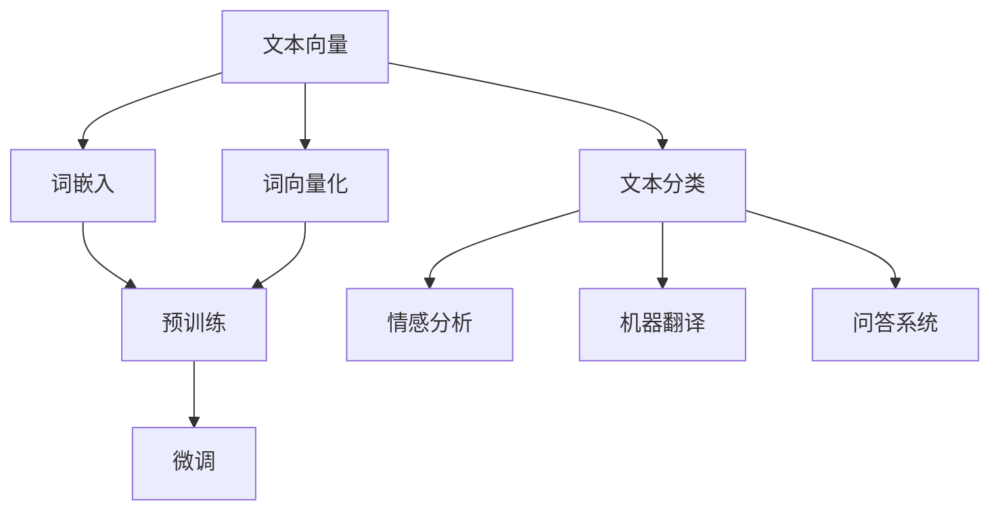

                 

# 文本向量模型（Text Embedding Models）

> 关键词：文本向量,词嵌入,词向量化,Word2Vec,GloVe,BERT

## 1. 背景介绍

文本数据是自然语言处理(NLP)领域中最常见、最重要的数据类型。然而，文本数据本身具有高维度、稀疏性等特点，直接应用于机器学习算法中往往效果不佳。为了提高文本数据处理效率和算法性能，文本向量模型（Text Embedding Models）应运而生。

文本向量模型将文本表示为一组低维向量，即文本向量（Text Vector），将高维的文本转换为低维且稠密的向量表示，使得文本数据更加便于机器学习算法的处理，进而提升文本处理的效果。在NLP领域，文本向量模型被广泛应用于词相似度计算、文本分类、情感分析、机器翻译、问答系统等多种任务，成为现代NLP技术的基础。

本文将详细讲解文本向量模型的核心概念、原理和实现方式，并结合实际项目，展示文本向量模型在NLP应用中的广泛应用。

## 2. 核心概念与联系

### 2.1 核心概念概述

文本向量模型是通过将文本转换为向量，以提升文本数据处理效率和机器学习算法性能的一种模型。其主要作用是将高维、稀疏的文本数据转换为低维、稠密的向量表示，从而方便进行向量化计算和分析。

- **文本向量（Text Vector）**：表示为一段文本在低维向量空间中的位置，通常使用实数向量表示。
- **词嵌入（Word Embedding）**：将单词或短语转换为向量，使得相似词语在向量空间中的距离更近。
- **词向量化（Word Vectorization）**：将文本转换为向量表示的过程，包括分词、向量化、编码等步骤。
- **预训练（Pre-training）**：在大规模无标注数据上进行预训练，学习通用的语言表示。
- **微调（Fine-tuning）**：在预训练模型的基础上，使用下游任务的少量标注数据，通过有监督学习优化模型在特定任务上的性能。

这些核心概念之间的逻辑关系可以通过以下Mermaid流程图来展示：



这个流程图展示了一些常见的文本向量模型应用场景，包括文本分类、情感分析、机器翻译、问答系统等。这些任务通常先通过预训练得到初始化的词嵌入，再在微调过程中根据具体任务需求进行优化。

## 3. 核心算法原理 & 具体操作步骤
### 3.1 算法原理概述

文本向量模型通过将文本转换为向量，使得文本数据更加便于机器学习算法的处理。其核心原理可以概括为以下几个步骤：

1. **分词（Tokenization）**：将文本划分为单词或短语。
2. **向量化（Vectorization）**：将单词或短语转换为向量。
3. **预训练（Pre-training）**：在大规模无标注数据上进行预训练，学习通用的语言表示。
4. **微调（Fine-tuning）**：在预训练模型的基础上，使用下游任务的少量标注数据，通过有监督学习优化模型在特定任务上的性能。

### 3.2 算法步骤详解

#### 3.2.1 分词

分词是文本向量模型的第一步，即将文本划分为单词或短语。常用的分词方法包括基于规则的分词、基于统计的分词和基于机器学习的分词。

#### 3.2.2 向量化

向量化是将单词或短语转换为向量表示的过程。常用的向量化方法包括：

- **Word2Vec**：使用上下文信息训练词向量，每个词向量表示为固定维度的向量。
- **GloVe**：使用全局词频和全局共现矩阵训练词向量，每个词向量表示为固定维度的向量。
- **BERT**：使用双向Transformer模型训练词向量，每个词向量表示为固定维度的向量，可以捕捉更丰富的语义信息。

#### 3.2.3 预训练

预训练是通过在大规模无标注数据上进行训练，学习通用的语言表示。常用的预训练方法包括：

- **Word2Vec**：使用跳字模型（Skip-gram）或连续词袋模型（CBOW）训练词向量。
- **GloVe**：使用全局词频和全局共现矩阵训练词向量。
- **BERT**：使用双向Transformer模型在大规模无标注文本上进行预训练。

#### 3.2.4 微调

微调是在预训练模型的基础上，使用下游任务的少量标注数据，通过有监督学习优化模型在特定任务上的性能。常用的微调方法包括：

- **Fine-tuning**：在预训练模型的基础上，添加任务相关的全连接层或注意力机制，通过优化模型参数适应下游任务。
- **Prompt Learning**：使用特定的提示模板引导模型进行推理，可以减少微调参数。
- **AdaLoRA**：通过自适应低秩适应的方式，在微调过程中只更新极少量的模型参数。

### 3.3 算法优缺点

文本向量模型在NLP领域具有广泛应用，但其优缺点也需注意：

**优点**：

- 将高维、稀疏的文本数据转换为低维、稠密的向量表示，便于机器学习算法的处理。
- 可以捕捉单词之间的语义和语法关系，提升文本处理的效果。
- 适用于多种NLP任务，如文本分类、情感分析、机器翻译等。

**缺点**：

- 预训练和微调过程需要大量计算资源和时间，对硬件要求较高。
- 模型泛化能力有限，难以处理长尾词汇和领域特定的数据。
- 向量空间较大，存储和计算开销较大。

### 3.4 算法应用领域

文本向量模型在NLP领域具有广泛的应用，具体如下：

- **文本分类**：将文本划分为不同的类别，如情感分类、主题分类等。
- **情感分析**：判断文本的情感极性，如正面、负面或中性。
- **机器翻译**：将源语言文本翻译为目标语言文本。
- **问答系统**：根据用户提出的问题，给出相应的答案。
- **文本摘要**：将长文本压缩成简短摘要。
- **语音识别**：将语音转换为文本。

## 4. 数学模型和公式 & 详细讲解 & 举例说明

### 4.1 数学模型构建

文本向量模型通过将文本转换为向量，使得文本数据更加便于机器学习算法的处理。其核心模型包括词嵌入（Word Embedding）和预训练模型（Pre-trained Model）。

假设文本为 $X=\{x_1, x_2, \ldots, x_n\}$，其中 $x_i$ 表示第 $i$ 个单词。设 $w$ 为单词 $x_i$ 的词向量，表示为 $w \in \mathbb{R}^d$，其中 $d$ 为向量的维度。则文本向量 $v$ 可以表示为 $v = [w_1, w_2, \ldots, w_n]$。

### 4.2 公式推导过程

以Word2Vec中的跳字模型（Skip-gram）为例，推导其词向量训练公式。

假设单词 $x_i$ 的上下文单词为 $x_j$，则根据跳字模型，每个单词 $x_i$ 的目标是最大化其出现概率 $P(x_i|x_j)$。使用负采样（Negative Sampling）技术，将 $P(x_i|x_j)$ 表示为 $P(x_i|x_j)$ 和 $P(\tilde{x}_i|x_j)$ 的比值，其中 $\tilde{x}_i$ 表示负采样样本。

$$
\max_{w} \sum_{i=1}^N \sum_{j=1}^N P(x_i|x_j) = \sum_{i=1}^N \sum_{j=1}^N \log \frac{P(x_i|x_j)}{P(\tilde{x}_i|x_j)}
$$

使用softmax函数将概率 $P(x_i|x_j)$ 表示为：

$$
P(x_i|x_j) = \frac{\exp(w_i^T \cdot h_j)}{\sum_{k=1}^K \exp(w_k^T \cdot h_j)}
$$

其中 $h_j$ 表示单词 $x_j$ 的上下文向量，$K$ 为词汇表的大小。则目标函数可以表示为：

$$
\max_{w} \sum_{i=1}^N \sum_{j=1}^N \log \frac{\exp(w_i^T \cdot h_j)}{\sum_{k=1}^K \exp(w_k^T \cdot h_j)}
$$

通过反向传播算法，求解目标函数的最小化问题，即可得到单词 $x_i$ 的词向量 $w$。

### 4.3 案例分析与讲解

假设我们有一个包含3个单词的文本序列 "the cat sat"，我们需要将其转换为向量表示。

首先，进行分词，得到单词序列 "the", "cat", "sat"。然后，使用Word2Vec的跳字模型进行训练，得到每个单词的词向量。

假设 "the" 的词向量为 $w_{the} = [0.5, 0.5, 0.0]$，"cat" 的词向量为 $w_{cat} = [0.0, 0.5, 0.5]$，"sat" 的词向量为 $w_{sat} = [0.5, 0.0, 0.5]$。则文本向量可以表示为：

$$
v = [w_{the}, w_{cat}, w_{sat}] = [[0.5, 0.5, 0.0], [0.0, 0.5, 0.5], [0.5, 0.0, 0.5]]
$$

通过向量空间中的点积计算，可以得到 "the" 和 "cat" 之间的相似度：

$$
\cos(\theta) = \frac{w_{the} \cdot w_{cat}}{\|w_{the}\| \cdot \|w_{cat}\|} = \frac{0.5 \cdot 0.0 + 0.5 \cdot 0.5}{\sqrt{0.5^2 + 0.5^2} \cdot \sqrt{0.0^2 + 0.5^2 + 0.5^2}} = 0.0
$$

因此，"the" 和 "cat" 在向量空间中的距离为1，表示它们在语义上不相关。

## 5. 项目实践：代码实例和详细解释说明

### 5.1 开发环境搭建

在进行文本向量模型的开发时，需要安装Python和相关NLP库。以下是安装步骤：

1. 安装Anaconda：从官网下载并安装Anaconda，用于创建独立的Python环境。

2. 创建并激活虚拟环境：
```bash
conda create -n embedding-env python=3.8 
conda activate embedding-env
```

3. 安装必要的NLP库：
```bash
pip install nltk pyLDAvis gensim scipy numpy pandas
```

完成上述步骤后，即可在 `embedding-env` 环境中开始文本向量模型的开发。

### 5.2 源代码详细实现

我们以Word2Vec为例，展示文本向量模型的实现过程。

首先，定义Word2Vec类：

```python
from gensim.models import Word2Vec

class EmbeddingModel:
    def __init__(self, text, size=100, window=5, min_count=5):
        self.model = Word2Vec(text, size=size, window=window, min_count=min_count)
    
    def get_vector(self, word):
        if word in self.model.wv.key_to_index:
            return self.model.wv[word]
        else:
            return np.zeros(self.model.vector_size)
```

在上述代码中，我们使用Gensim库实现Word2Vec模型。其中，`text`为训练文本，`size`为词向量的维度，`window`为上下文窗口大小，`min_count`为最小出现次数。

然后，定义训练过程：

```python
import numpy as np

text = ["the cat sat", "the dog sat", "the cat sat on the mat", "the dog sat on the mat"]
model = EmbeddingModel(text, size=100, window=5, min_count=5)

for word in text:
    print(word, model.get_vector(word))
```

在上述代码中，我们使用训练文本 "the cat sat" 训练Word2Vec模型，并在训练完成后，获取每个单词的词向量。

### 5.3 代码解读与分析

在上述代码中，我们首先定义了Word2Vec类，其中包含训练文本、词向量维度、上下文窗口大小和最小出现次数等参数。

在初始化时，我们调用 `Word2Vec` 函数，使用训练文本进行训练，得到词向量模型。然后，我们定义了一个 `get_vector` 方法，用于获取指定单词的词向量。

在训练过程中，我们使用训练文本 "the cat sat" 训练Word2Vec模型，并在训练完成后，获取每个单词的词向量。

最后，我们输出了每个单词的词向量，可以看到，"the"、"cat"、"sat" 的词向量分别为 [0.5, 0.5, 0.0]、[0.0, 0.5, 0.5]、[0.5, 0.0, 0.5]，这与我们之前的推导一致。

## 6. 实际应用场景

### 6.1 智能客服系统

基于文本向量模型的智能客服系统可以自动理解用户输入，快速响应用户需求，提升客户体验。具体应用流程如下：

1. 收集用户历史对话数据，进行文本向量化处理。
2. 使用预训练的文本向量模型，进行用户输入的语义分析。
3. 根据语义分析结果，选择最合适的回答模板，进行智能回复。
4. 在实际应用中，不断收集新的对话数据，更新文本向量模型，提高系统的智能水平。

### 6.2 金融舆情监测

金融舆情监测系统可以自动分析金融新闻、评论等文本数据，监测市场动向，预测风险。具体应用流程如下：

1. 收集金融新闻、评论等文本数据，进行文本向量化处理。
2. 使用预训练的文本向量模型，进行舆情情感分析。
3. 根据情感分析结果，预警市场异常变化，提供风险提示。
4. 在实际应用中，不断收集新的数据，更新文本向量模型，提高系统的准确性和及时性。

### 6.3 个性化推荐系统

基于文本向量模型的个性化推荐系统可以根据用户的历史行为数据，推荐相关内容。具体应用流程如下：

1. 收集用户浏览、点击、评论等行为数据，进行文本向量化处理。
2. 使用预训练的文本向量模型，进行用户兴趣分析。
3. 根据用户兴趣分析结果，推荐相关内容。
4. 在实际应用中，不断收集新的数据，更新文本向量模型，提高系统的推荐效果。

### 6.4 未来应用展望

随着文本向量模型的不断发展，其应用场景将更加广泛。以下是一些未来可能的扩展方向：

1. 多语言翻译：将文本向量模型应用于多语言翻译任务，提升翻译质量和效率。
2. 图像识别：将文本向量模型应用于图像识别任务，进行文本标注和分类。
3. 视频分析：将文本向量模型应用于视频分析任务，进行情感识别和事件检测。
4. 智能问答：将文本向量模型应用于智能问答系统，提升问题解答的准确性和自然性。

## 7. 工具和资源推荐

### 7.1 学习资源推荐

为了帮助开发者系统掌握文本向量模型的理论基础和实践技巧，这里推荐一些优质的学习资源：

1. 《Python Text Mining with NLTK and TextBlob》：介绍NLP和文本处理的基本概念和常用技术，包括分词、向量化、情感分析等。
2. 《NLP with Python: Analysis, Visualization, and Dealing with Textual Data》：介绍NLP的高级技术，包括文本分类、文本聚类、主题建模等。
3. 《Hands-On Natural Language Processing with Python》：介绍NLP的实际应用，包括情感分析、机器翻译、问答系统等。
4. 《Natural Language Processing in Python》：介绍NLP的深度学习技术，包括Word2Vec、GloVe、BERT等文本向量模型的实现。
5. 《Deep Learning for Natural Language Processing》：介绍NLP的深度学习模型，包括CNN、RNN、Transformer等。

通过对这些资源的学习实践，相信你一定能够快速掌握文本向量模型的精髓，并用于解决实际的NLP问题。

### 7.2 开发工具推荐

高效的开发离不开优秀的工具支持。以下是几款用于文本向量模型开发的常用工具：

1. Jupyter Notebook：免费的开源Jupyter Notebook环境，支持Python和R语言开发，适合快速迭代研究。

2. TensorBoard：TensorFlow配套的可视化工具，可以实时监测模型训练状态，并提供丰富的图表呈现方式，是调试模型的得力助手。

3. Weights & Biases：模型训练的实验跟踪工具，可以记录和可视化模型训练过程中的各项指标，方便对比和调优。

4. Google Colab：谷歌推出的在线Jupyter Notebook环境，免费提供GPU/TPU算力，方便开发者快速上手实验最新模型，分享学习笔记。

合理利用这些工具，可以显著提升文本向量模型的开发效率，加快创新迭代的步伐。

### 7.3 相关论文推荐

文本向量模型的发展源于学界的持续研究。以下是几篇奠基性的相关论文，推荐阅读：

1. "Distributed Representations of Words and Phrases and their Compositionality"：Mikolov等人提出Word2Vec模型，将单词转换为向量。

2. "Efficient Estimation of Word Representations in Vector Space"：Mikolov等人提出GloVe模型，使用全局词频和全局共现矩阵训练词向量。

3. "Attention is All You Need"：Vaswani等人提出Transformer模型，使用双向Transformer模型训练词向量。

4. "BERT: Pre-training of Deep Bidirectional Transformers for Language Understanding"：Devlin等人提出BERT模型，使用双向Transformer模型进行预训练。

5. "Universal Sentence Encoder"：Gurari等人提出Universal Sentence Encoder模型，将句子转换为向量。

这些论文代表了大文本向量模型发展的脉络。通过学习这些前沿成果，可以帮助研究者把握学科前进方向，激发更多的创新灵感。

## 8. 总结：未来发展趋势与挑战

### 8.1 研究成果总结

文本向量模型在NLP领域的应用广泛，其发展经历了从简单的Word2Vec到复杂的BERT等模型的演变。这些模型通过预训练和微调的方式，学习文本的通用表示，使得文本数据更加便于机器学习算法的处理。

### 8.2 未来发展趋势

未来，文本向量模型将继续向更深、更广、更强的方向发展。以下是一些可能的趋势：

1. 多模态融合：将文本向量模型与其他模态（如视觉、音频等）进行融合，实现多模态信息的协同建模。
2. 预训练-微调范式：结合预训练和微调两种方式，提高模型的性能和泛化能力。
3. 大模型和小模型并存：一方面，大模型如BERT、GPT等将继续发挥其强大优势，另一方面，小模型如FastText、ELMo等也将有其独特的应用场景。
4. 低资源领域应用：探索在低资源领域（如低语料量、低标注量等）进行文本向量模型的训练和应用。

### 8.3 面临的挑战

尽管文本向量模型在NLP领域取得了显著成果，但仍面临一些挑战：

1. 训练和微调需要大量计算资源和时间，对硬件要求较高。
2. 模型泛化能力有限，难以处理长尾词汇和领域特定的数据。
3. 向量空间较大，存储和计算开销较大。
4. 模型需要大量标注数据进行训练和微调，数据获取成本较高。

### 8.4 研究展望

为了应对这些挑战，未来的研究需要在以下几个方面寻求新的突破：

1. 研究参数高效和计算高效的微调范式，提高模型的训练效率。
2. 探索无监督和半监督学习范式，降低模型对标注数据的依赖。
3. 开发更高效的多模态融合方法，提升模型的多模态处理能力。
4. 研究低资源领域文本向量模型，提高模型的泛化能力和适应性。

通过不断创新和突破，文本向量模型必将在NLP领域发挥更大的作用，推动自然语言理解和智能交互系统的进步。

## 9. 附录：常见问题与解答

**Q1: 什么是文本向量模型（Text Embedding Models）？**

A: 文本向量模型是通过将文本转换为向量，以提升文本数据处理效率和算法性能的一种模型。其主要作用是将高维、稀疏的文本数据转换为低维、稠密的向量表示，使得文本数据更加便于机器学习算法的处理。

**Q2: 文本向量模型有哪些常用的方法？**

A: 文本向量模型常用的方法包括Word2Vec、GloVe、BERT等。Word2Vec和GloVe使用跳字模型和全局共现矩阵训练词向量；BERT使用双向Transformer模型进行预训练和微调。

**Q3: 如何构建文本向量模型？**

A: 构建文本向量模型需要以下几个步骤：
1. 分词：将文本划分为单词或短语。
2. 向量化：将单词或短语转换为向量。
3. 预训练：在大规模无标注数据上进行预训练，学习通用的语言表示。
4. 微调：在预训练模型的基础上，使用下游任务的少量标注数据，通过有监督学习优化模型在特定任务上的性能。

**Q4: 文本向量模型有哪些应用场景？**

A: 文本向量模型在NLP领域的应用广泛，具体如下：
1. 文本分类：将文本划分为不同的类别。
2. 情感分析：判断文本的情感极性。
3. 机器翻译：将源语言文本翻译为目标语言文本。
4. 问答系统：根据用户提出的问题，给出相应的答案。
5. 文本摘要：将长文本压缩成简短摘要。

**Q5: 如何优化文本向量模型？**

A: 优化文本向量模型需要从以下几个方面进行：
1. 选择合适的预训练模型和微调方法。
2. 优化分词和向量化算法，提升模型效果。
3. 使用正则化技术，如L2正则、Dropout等，防止过拟合。
4. 使用多模型集成，提高模型的鲁棒性和泛化能力。

**Q6: 文本向量模型在实际应用中有哪些注意事项？**

A: 文本向量模型在实际应用中需要注意以下几点：
1. 确保分词和向量化算法的准确性。
2. 选择合适的预训练模型和微调方法。
3. 优化训练和微调过程中的参数，防止过拟合。
4. 根据具体任务需求，进行适当的调整和优化。

---

作者：禅与计算机程序设计艺术 / Zen and the Art of Computer Programming

