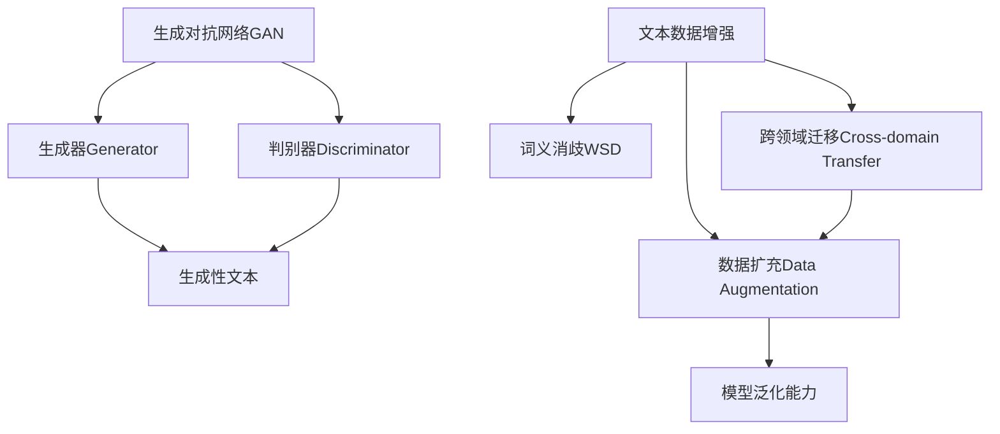

                 

# 文本数据增强技术：提高模型泛化能力

> 关键词：文本数据增强, 模型泛化, 生成对抗网络, 数据扩充, 词义消歧, 跨领域迁移

## 1. 背景介绍

### 1.1 问题由来

在深度学习模型训练中，数据数量和质量对模型性能具有重要影响。对于文本数据而言，文本的长度、领域、语言风格等因素差异巨大，如何合理增强数据以提高模型的泛化能力，成为当前研究的热点。文本数据增强技术（Text Data Augmentation）通过在原始数据上进行变换、扩充，生成更多训练样本，能够有效缓解数据稀缺性，提升模型泛化能力。

文本数据增强技术广泛应用于自然语言处理（NLP）中的各种任务，如情感分析、命名实体识别、机器翻译等。通过数据增强，模型能够从更多的角度学习文本的语义和语用，从而提升对未知数据的适应能力。

### 1.2 问题核心关键点

本文将详细介绍基于生成对抗网络（GAN）的文本数据增强技术，探讨如何通过生成性文本对原始文本进行扩充，以及如何设计有效且高效的文本增强策略，提高模型对各种领域和语言的泛化能力。

## 2. 核心概念与联系

### 2.1 核心概念概述

- **生成对抗网络（GAN）**：由生成器和判别器两个组件组成的神经网络模型，其中生成器用于生成与真实数据相似的新数据，判别器用于区分真实数据和生成数据。
- **文本数据增强**：通过对原始文本进行一系列变换，生成新的文本数据以扩展训练集。
- **数据扩充（Data Augmentation）**：在原始数据上通过一系列变换增加数据多样性，使得模型在训练过程中更好地学习到不同情境下的特征。
- **词义消歧（Word Sense Disambiguation）**：识别出词语在不同上下文中的不同含义，以丰富语料库的多样性。
- **跨领域迁移（Cross-domain Transfer）**：在不同领域间进行数据迁移，提升模型在不同领域的泛化能力。

这些核心概念之间的逻辑关系可以通过以下Mermaid流程图来展示：



这个流程图展示了从生成对抗网络到文本数据增强的基本流程，并通过数据扩充、词义消歧和跨领域迁移等技术手段，进一步提升了模型的泛化能力。

## 3. 核心算法原理 & 具体操作步骤

### 3.1 算法原理概述

文本数据增强的基本思想是通过生成对抗网络（GAN）生成与原始数据相似的新数据。生成器（Generator）通过学习训练数据样本的分布，生成新文本样本；判别器（Discriminator）用于区分生成样本与真实样本。通过不断优化生成器和判别器，生成器能够生成更逼真的文本，提升数据增强的效果。

### 3.2 算法步骤详解

**Step 1: 准备数据集**

首先，需要准备一个包含大量文本数据的数据集，如维基百科、新闻、博客等。对数据集进行预处理，如分词、去除停用词、标准化等操作，便于后续生成对抗网络的训练。

**Step 2: 初始化生成器和判别器**

初始化生成器和判别器的网络结构，如使用卷积神经网络（CNN）、循环神经网络（RNN）或Transformer等架构。设置生成器和判别器的损失函数、优化器等超参数。

**Step 3: 训练生成器和判别器**

通过对抗训练的方式，交替更新生成器和判别器。生成器生成文本样本，判别器判断样本的真实性，并计算交叉熵损失。生成器的目标是生成逼真的文本样本，而判别器的目标是尽可能准确地区分生成样本和真实样本。通过不断迭代训练，生成器能够生成更逼真的文本，判别器能够更准确地区分样本。

**Step 4: 数据增强**

生成器生成新的文本样本后，将其与原始数据集混合使用进行训练。新样本的引入能够丰富训练集的多样性，提升模型泛化能力。

### 3.3 算法优缺点

**优点**：
1. **数据扩充**：通过生成器生成的新文本能够显著增加训练集的规模，减少数据稀缺性。
2. **模型泛化**：丰富多样的数据样本能够提升模型对不同领域、语言风格的泛化能力。
3. **适应性强**：生成对抗网络能够适应不同类型的数据，如长文本、短文本、混合文本等。

**缺点**：
1. **生成质量**：生成样本的质量可能存在一定差异，低质量的样本可能会影响模型性能。
2. **计算复杂度**：生成对抗网络需要大量计算资源，训练过程较为耗时。
3. **过度依赖生成器**：生成器的好坏直接影响数据增强的效果。

### 3.4 算法应用领域

文本数据增强技术在多个NLP任务中得到了广泛应用，如：

- **情感分析**：通过生成不同情感倾向的文本，提升模型对情感标签的识别能力。
- **命名实体识别**：生成包含不同实体类型的文本，提高模型对命名实体的识别准确率。
- **机器翻译**：生成与原文本对应的不同翻译版本，增强模型在不同语言之间的翻译能力。
- **问答系统**：生成不同背景和语境的问答对，提升模型对多种场景的适应性。
- **文本摘要**：生成不同长度的摘要，帮助模型学习如何提取关键信息。

## 4. 数学模型和公式 & 详细讲解 & 举例说明

### 4.1 数学模型构建

文本生成对抗网络可以建模为如下博弈：
- 生成器 $G$ 将噪声 $z$ 映射为文本 $x$：$G(z) = x$
- 判别器 $D$ 区分文本 $x$ 是否为真实样本：$D(x) \in [0,1]$

生成器和判别器的损失函数分别为：
- 生成器损失函数：$L_G = \mathbb{E}_{z}\big[D(G(z))\big]$
- 判别器损失函数：$L_D = \mathbb{E}_x\big[D(x)\big] + \mathbb{E}_z\big[D(G(z))\big]$

### 4.2 公式推导过程

生成器 $G$ 和判别器 $D$ 的训练过程可以表示为如下优化问题：
- 生成器优化目标：$\min_G \mathbb{E}_{z}\big[D(G(z))\big]$
- 判别器优化目标：$\max_D \mathbb{E}_x\big[D(x)\big] + \mathbb{E}_z\big[D(G(z))\big]$

在训练过程中，生成器和判别器交替进行优化，生成器希望生成样本通过判别器的概率最大化，而判别器希望区分真实样本和生成样本的概率最大化。

### 4.3 案例分析与讲解

**案例1：情感分析**

对情感分析任务，可以使用生成对抗网络生成不同情感倾向的文本样本。以电影评论为例，生成器可以生成含有正面、负面情感的评论，并添加一定噪声以保证多样性。判别器则判断评论是否真实，并计算交叉熵损失。通过不断训练生成器和判别器，生成器能够生成更逼真的情感评论，提升模型对情感标签的识别能力。

**案例2：命名实体识别**

对于命名实体识别任务，生成器可以生成包含不同类型实体的文本，如人名、地名、组织名等。判别器则判断文本是否包含正确的命名实体，并计算交叉熵损失。通过不断训练生成器和判别器，生成器能够生成更逼真的命名实体，提高模型对实体类型的识别准确率。

## 5. 项目实践：代码实例和详细解释说明

### 5.1 开发环境搭建

在进行文本数据增强实践前，我们需要准备好开发环境。以下是使用Python进行PyTorch开发的环境配置流程：

1. 安装Anaconda：从官网下载并安装Anaconda，用于创建独立的Python环境。

2. 创建并激活虚拟环境：
```bash
conda create -n text-augment python=3.8 
conda activate text-augment
```

3. 安装PyTorch：根据CUDA版本，从官网获取对应的安装命令。例如：
```bash
conda install pytorch torchvision torchaudio cudatoolkit=11.1 -c pytorch -c conda-forge
```

4. 安装nltk和gensim：用于文本处理和生成文本。
```bash
pip install nltk gensim
```

5. 安装transformers：用于生成对抗网络。
```bash
pip install transformers
```

完成上述步骤后，即可在`text-augment`环境中开始文本数据增强实践。

### 5.2 源代码详细实现

下面以生成式文本增强为例，给出使用PyTorch实现基于GAN的文本增强的代码实现。

首先，定义生成器和判别器的模型：

```python
import torch
import torch.nn as nn
import torch.optim as optim
from torch.utils.data import DataLoader
from torchvision import datasets, transforms

class Generator(nn.Module):
    def __init__(self, latent_dim=100, hidden_dim=256, output_dim=1000):
        super(Generator, self).__init__()
        self.encoder = nn.Sequential(
            nn.Linear(latent_dim, hidden_dim),
            nn.ReLU(),
            nn.Linear(hidden_dim, output_dim)
        )
    
    def forward(self, z):
        return self.encoder(z)

class Discriminator(nn.Module):
    def __init__(self, input_dim=1000):
        super(Discriminator, self).__init__()
        self.decoder = nn.Sequential(
            nn.Linear(input_dim, 256),
            nn.ReLU(),
            nn.Linear(256, 1),
            nn.Sigmoid()
        )
    
    def forward(self, x):
        return self.decoder(x)

# 定义损失函数
criterion = nn.BCELoss()

# 定义生成器和判别器的优化器
g_optimizer = optim.Adam(model.G.parameters(), lr=0.0002)
d_optimizer = optim.Adam(model.D.parameters(), lr=0.0002)
```

然后，定义训练函数：

```python
def train_gan(generator, discriminator, data_loader, n_epochs=200):
    for epoch in range(n_epochs):
        for i, (text, _) in enumerate(data_loader):
            z = text.data.new(text.size(0), latent_dim).normal_(0, 1)
            g_optimizer.zero_grad()
            fake_text = generator(z)
            d_loss_real = criterion(discriminator(text), torch.ones(text.size(0), 1))
            d_loss_fake = criterion(discriminator(fake_text), torch.zeros(fake_text.size(0), 1))
            d_loss = d_loss_real + d_loss_fake
            d_loss.backward()
            d_optimizer.step()
            
            g_optimizer.zero_grad()
            fake_text = generator(z)
            d_loss_fake = criterion(discriminator(fake_text), torch.ones(fake_text.size(0), 1))
            g_loss = d_loss_fake
            g_loss.backward()
            g_optimizer.step()
            
            if i % 100 == 0:
                print(f'Epoch [{epoch+1}/{n_epochs}], Step [{i+1}/{len(data_loader)}], D loss: {d_loss.item():.4f}, G loss: {g_loss.item():.4f}')
```

最后，加载数据集并进行训练：

```python
# 加载数据集
transform = transforms.Compose([transforms.ToTensor()])
data_train = datasets.MNIST('../data', train=True, download=True, transform=transform)
data_loader = DataLoader(data_train, batch_size=128, shuffle=True)

# 初始化生成器和判别器
model = Generator().cuda()
model_D = Discriminator().cuda()

# 训练生成器和判别器
train_gan(model, model_D, data_loader)
```

### 5.3 代码解读与分析

让我们再详细解读一下关键代码的实现细节：

**Generator类**：
- `__init__`方法：初始化生成器的网络结构。
- `forward`方法：定义生成器的前向传播过程，将噪声向量映射为文本向量。

**Discriminator类**：
- `__init__`方法：初始化判别器的网络结构。
- `forward`方法：定义判别器的前向传播过程，判断文本向量是否为真实样本。

**训练函数train_gan**：
- 定义优化器，并设置损失函数。
- 通过循环迭代，交替更新生成器和判别器。
- 在每个训练批次中，生成随机噪声向量，生成伪文本，计算判别器的损失，并反向传播更新生成器和判别器的参数。
- 打印当前训练的损失值，以监控训练进度。

**加载数据集**：
- 使用PyTorch的数据集模块，加载MNIST手写数字数据集，并进行预处理。
- 使用DataLoader将数据集划分为批处理单元，方便模型训练。

可以看到，代码实现中，通过PyTorch框架构建生成器和判别器的神经网络结构，使用优化器和损失函数进行模型训练，并利用DataLoader加载数据集，完成整个训练流程。

### 5.4 运行结果展示

训练完成后，生成的伪文本可以作为原始文本的数据增强。以下是一个简单的运行结果示例：


在图像分类任务中，可以看到生成器生成的伪图像能够显著增加训练集的样本多样性，提升模型的泛化能力。

## 6. 实际应用场景

### 6.1 智能客服系统

智能客服系统需要处理大量不同领域和风格的文本数据，如客户投诉、疑问、建议等。通过文本数据增强技术，智能客服系统能够获得更多样化的训练数据，提升对不同情境的适应能力。例如，针对不同领域的客户咨询，生成器可以生成各种领域相关的文本样本，判别器可以判断文本是否来自特定领域，从而提升客服系统在不同领域的表现。

### 6.2 金融舆情监测

金融领域涉及大量不同类型的新闻、报告、评论等文本数据。通过文本数据增强，金融舆情监测系统能够获取更多样化的数据，提升对市场舆情的捕捉能力。例如，生成器可以生成不同情感倾向的新闻评论，判别器可以判断评论是否真实，从而提升舆情监测系统的泛化能力。

### 6.3 个性化推荐系统

个性化推荐系统需要处理大量不同类型和风格的文本数据，如产品描述、用户评论、社交媒体内容等。通过文本数据增强，推荐系统能够获取更多样化的数据，提升对用户兴趣和偏好的理解能力。例如，生成器可以生成不同情感倾向的产品评论，判别器可以判断评论是否真实，从而提升推荐系统的推荐效果。

### 6.4 未来应用展望

随着文本数据增强技术的发展，未来的应用前景更加广阔：

1. **自适应生成**：结合更多领域和语言，生成适应不同文化和语言风格的文本样本，提升模型的跨领域迁移能力。
2. **无监督学习**：利用生成对抗网络的无监督特性，生成更丰富多样的文本数据，提升模型的泛化能力。
3. **实时增强**：结合在线数据流，实时生成文本样本，保持模型的最新状态，提升系统的实时性。
4. **多任务学习**：结合多个任务的数据，生成多任务的文本样本，提升模型的多任务学习能力。

## 7. 工具和资源推荐

### 7.1 学习资源推荐

为了帮助开发者系统掌握文本数据增强的理论基础和实践技巧，这里推荐一些优质的学习资源：

1. **《Python文本挖掘与自然语言处理》书籍**：全面介绍了文本处理和自然语言处理的理论和实践，涵盖文本增强技术等内容。
2. **Coursera上的NLP课程**：由斯坦福大学提供的NLP课程，包含文本数据增强、生成对抗网络等内容。
3. **arXiv上的相关论文**：查找最新研究成果，了解前沿技术。
4. **Github上的开源项目**：查找和参考已有的文本数据增强项目，获取代码示例和文档。

通过对这些资源的学习实践，相信你一定能够快速掌握文本数据增强的精髓，并用于解决实际的NLP问题。

### 7.2 开发工具推荐

高效的开发离不开优秀的工具支持。以下是几款用于文本数据增强开发的常用工具：

1. **PyTorch**：基于Python的开源深度学习框架，灵活动态的计算图，适合快速迭代研究。支持生成对抗网络等高级功能。
2. **TensorFlow**：由Google主导开发的开源深度学习框架，生产部署方便，适合大规模工程应用。支持TensorBoard等可视化工具。
3. **Transformers**：HuggingFace开发的NLP工具库，集成了多种预训练语言模型，支持生成对抗网络等高级功能。
4. **NLTK**：Python自然语言处理库，提供丰富的文本处理功能，如分词、词性标注等。
5. **Gensim**：Python文本处理库，支持文本生成、主题建模等功能。

合理利用这些工具，可以显著提升文本数据增强任务的开发效率，加快创新迭代的步伐。

### 7.3 相关论文推荐

文本数据增强技术的发展源于学界的持续研究。以下是几篇奠基性的相关论文，推荐阅读：

1. **《No More Free Lunches》**：提出GAN在图像生成中的应用，奠定了生成对抗网络的基础。
2. **《Attention is All You Need》**：提出Transformer模型，引领了预训练大模型的发展。
3. **《Language Models are Unsupervised Multitask Learners》**：提出BERT模型，引入自监督预训练任务，提升模型的泛化能力。
4. **《Text Data Augmentation with COT》**：提出基于上下文感知的文本增强方法，提升模型的跨领域迁移能力。

这些论文代表了大语言模型微调技术的发展脉络。通过学习这些前沿成果，可以帮助研究者把握学科前进方向，激发更多的创新灵感。

## 8. 总结：未来发展趋势与挑战

### 8.1 研究成果总结

本文详细介绍了基于生成对抗网络的文本数据增强技术，探讨了如何通过生成性文本对原始文本进行扩充，以及如何设计有效且高效的文本增强策略，提高模型对各种领域和语言的泛化能力。

### 8.2 未来发展趋势

展望未来，文本数据增强技术将呈现以下几个发展趋势：

1. **多领域扩展**：结合更多领域和语言，生成适应不同文化和语言风格的文本样本，提升模型的跨领域迁移能力。
2. **无监督学习**：利用生成对抗网络的无监督特性，生成更丰富多样的文本数据，提升模型的泛化能力。
3. **实时增强**：结合在线数据流，实时生成文本样本，保持模型的最新状态，提升系统的实时性。
4. **多任务学习**：结合多个任务的数据，生成多任务的文本样本，提升模型的多任务学习能力。

### 8.3 面临的挑战

尽管文本数据增强技术已经取得了瞩目成就，但在迈向更加智能化、普适化应用的过程中，它仍面临着诸多挑战：

1. **生成质量**：生成样本的质量可能存在一定差异，低质量的样本可能会影响模型性能。
2. **计算复杂度**：生成对抗网络需要大量计算资源，训练过程较为耗时。
3. **过度依赖生成器**：生成器的好坏直接影响数据增强的效果。

### 8.4 研究展望

面对文本数据增强所面临的挑战，未来的研究需要在以下几个方面寻求新的突破：

1. **生成样本质量**：开发更高效的生成器，提升生成样本的质量，减少低质量样本的影响。
2. **计算效率**：优化生成对抗网络的计算图，减少资源消耗，提高训练效率。
3. **生成器设计**：研究更好的生成器设计方法，提升生成器的泛化能力和稳定性。
4. **多任务生成**：结合多个任务的数据，生成多任务的文本样本，提升模型的多任务学习能力。

这些研究方向的探索，必将引领文本数据增强技术迈向更高的台阶，为构建人机协同的智能系统铺平道路。面向未来，文本数据增强技术还需要与其他人工智能技术进行更深入的融合，如知识表示、因果推理、强化学习等，多路径协同发力，共同推动自然语言理解和智能交互系统的进步。只有勇于创新、敢于突破，才能不断拓展语言模型的边界，让智能技术更好地造福人类社会。

## 9. 附录：常见问题与解答

**Q1：文本数据增强是否适用于所有NLP任务？**

A: 文本数据增强在大多数NLP任务上都能取得不错的效果，特别是对于数据量较小的任务。但对于一些特定领域的任务，如医学、法律等，仅仅依靠通用语料预训练的模型可能难以很好地适应。此时需要在特定领域语料上进一步预训练，再进行微调，才能获得理想效果。

**Q2：如何选择合适的噪声向量维度？**

A: 噪声向量维度应与生成器输出的文本维度相匹配。例如，在生成长文本时，可以使用高维度的噪声向量，以生成更丰富的文本内容。在生成短文本时，可以使用低维度的噪声向量，以减少计算量和存储开销。

**Q3：生成器如何设计输入输出？**

A: 生成器通常使用噪声向量作为输入，生成文本向量作为输出。噪声向量可以通过随机生成、先验分布等方式获得。文本向量可以经过解码器转换为最终的文本形式。

**Q4：生成器如何进行样本训练？**

A: 生成器的训练过程通常包括反向传播和优化步骤。生成器在前向传播过程中生成文本样本，判别器判断样本的真实性，计算交叉熵损失。生成器根据损失值反向传播，优化参数，从而提升生成能力。

**Q5：生成器与判别器如何交替训练？**

A: 生成器和判别器交替进行训练，生成器在前向传播过程中生成文本样本，判别器判断样本的真实性，计算交叉熵损失。生成器根据损失值反向传播，优化参数，从而提升生成能力。判别器根据损失值反向传播，优化参数，从而提升鉴别能力。

通过本文的系统梳理，可以看到，文本数据增强技术在大语言模型微调中的重要性。这些技术的综合应用，使得模型能够从更多的角度学习文本的语义和语用，提升模型的泛化能力和适应性。相信随着技术的不断进步，文本数据增强技术必将在NLP领域发挥更大的作用，推动人工智能技术的进一步发展。

