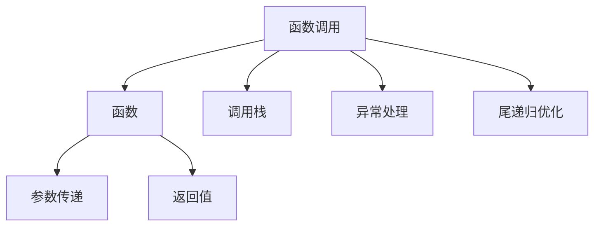

                 

# 新特性：Function Calling 介绍与实战

## 1. 背景介绍

函数调用（Function Calling）是编程中最基本的概念之一，也是编程范式转换、代码重构、性能优化等诸多高级主题的基础。

在过去的几十年里，函数调用已经从最初的结构化编程中简单的调用机制，演变成现代编程语言中的核心特性。今天的函数调用已经不仅限于编译式语言，也成为解释式语言的重要组成部分。函数调用的性能优化、代码风格、执行控制等议题，在软件工程中仍然具有重要意义。

本文将系统介绍函数调用的原理、演变过程，以及实际应用中的若干实战案例，帮助读者深入理解函数调用的奥妙。

## 2. 核心概念与联系

### 2.1 核心概念概述

函数调用（Function Calling）是程序中一个函数在另一个函数内部被调用的过程。这种机制在大多数编程语言中都被广泛支持，使程序能够灵活地组织代码，实现复用、抽象等编程原则。

- 函数：定义在程序中的可执行块，可以接收输入参数，执行一系列操作，并返回结果。
- 参数：函数调用时传递给函数的输入值。
- 返回值：函数执行完成后传递给调用者的结果。
- 调用栈（Call Stack）：函数调用时系统维护的一个数据结构，用于跟踪函数嵌套关系和局部变量。
- 闭包（Closure）：函数和其引用的外部变量的组合体，允许函数在外部变量作用域外访问这些变量。
- 异常处理（Exception Handling）：在函数调用过程中捕获和处理可能出现的错误，确保程序稳定性。
- 尾递归优化（Tail Recursion Optimization）：一种优化技术，用于减少递归调用带来的额外开销。

### 2.2 核心概念原理和架构的 Mermaid 流程图



这个流程图展示了函数调用的主要流程：

1. 函数调用：A表示函数调用的过程，调用者将函数作为参数传递给调用栈。
2. 参数传递：C表示将调用者的输入参数传递给被调用的函数。
3. 返回值：D表示函数执行完成后，将结果返回给调用者。
4. 调用栈：E表示函数调用时，系统维护的调用栈数据结构，用于跟踪函数嵌套关系和局部变量。
5. 异常处理：F表示在函数调用过程中，可能出现的异常处理机制。
6. 尾递归优化：G表示对尾递归函数进行的优化，减少递归带来的额外开销。

## 3. 核心算法原理 & 具体操作步骤

### 3.1 算法原理概述

函数调用本质上是一种过程控制机制，通过传递参数和返回值，将一个函数的操作逻辑封装起来，供其他函数使用。其核心原理包括以下几个方面：

1. **参数传递机制**：函数调用时，调用者将参数传递给被调用者，形式包括位置参数、关键字参数、默认参数、可变参数等。
2. **返回值机制**：函数执行完毕后，将计算结果返回给调用者，形式包括直接返回值、抛出异常等。
3. **调用栈管理**：系统维护一个调用栈，用于记录函数嵌套关系和局部变量，确保程序的执行顺序正确。
4. **异常处理机制**：在函数调用过程中，可能出现异常，需要捕获和处理异常，保证程序的稳定性和可靠性。
5. **尾递归优化**：对于递归函数，通过尾递归优化，可以将其转换为迭代函数，避免递归带来的额外开销。

### 3.2 算法步骤详解

函数调用的具体操作步骤包括：

1. **参数绑定**：在调用函数时，将输入参数绑定到函数定义中的形参上。
2. **创建调用栈帧**：系统为每个函数调用创建栈帧，用于记录函数的局部变量、参数和返回地址等信息。
3. **执行函数体**：执行函数体中的代码，可能包括子函数调用、异常处理等。
4. **返回结果**：函数执行完成后，将结果返回给调用者。
5. **销毁调用栈帧**：函数返回后，系统销毁相应的栈帧，恢复调用栈状态。

### 3.3 算法优缺点

函数调用的优点包括：

1. **代码复用性**：函数提供了一种抽象的方式，使得代码可以被复用，减少重复劳动。
2. **可读性**：函数将操作逻辑封装起来，使得代码更加模块化和可读。
3. **扩展性**：函数可以作为一个黑盒，方便测试和修改。
4. **控制流优化**：函数调用机制提供了控制流的抽象，可以用于实现复杂的流程控制，如循环、条件语句等。

函数调用的缺点包括：

1. **性能开销**：函数调用的参数传递和返回值处理有一定开销，尤其是在递归调用时。
2. **栈溢出风险**：函数调用依赖调用栈，当调用层数过多时，可能导致栈溢出。
3. **代码复杂性**：函数调用机制增加了代码复杂性，特别是对递归和异常处理等高级特性。

### 3.4 算法应用领域

函数调用广泛应用于各个软件开发领域，包括但不限于：

- **编程语言**：几乎所有编程语言都支持函数调用，是编程语言的核心特性之一。
- **软件架构**：函数调用机制使得软件模块化和抽象化成为可能，支持面向对象编程、模块化编程等设计模式。
- **性能优化**：尾递归优化等技术可以减少函数调用带来的性能开销，提高程序的效率。
- **异常处理**：函数调用时可能出现异常，异常处理机制保障程序的稳定性。

## 4. 数学模型和公式 & 详细讲解 & 举例说明

### 4.1 数学模型构建

函数调用的数学模型可以表示为：

$$
f(x_1, x_2, ..., x_n) = g(x_1, ..., x_{n-1}, f(x_n))
$$

其中 $f$ 表示被调用的函数，$x_1, ..., x_n$ 表示函数的输入参数，$g$ 表示函数体内部的操作，$x_{n-1}$ 表示其他参数和局部变量。

### 4.2 公式推导过程

函数调用的执行过程可以分解为以下步骤：

1. **参数传递**：将输入参数 $x_1, ..., x_n$ 传递给函数 $f$。
2. **创建栈帧**：系统为函数 $f$ 创建栈帧，记录函数的局部变量和返回地址。
3. **执行函数体**：执行函数体 $g$，可能包括子函数调用和异常处理。
4. **返回结果**：函数执行完毕后，返回结果 $r$。
5. **销毁栈帧**：系统销毁栈帧，恢复调用栈状态。

### 4.3 案例分析与讲解

以递归函数为例，分析其执行过程：

```python
def factorial(n):
    if n == 0:
        return 1
    else:
        return n * factorial(n-1)
```

在这个递归函数中，每次调用 $factorial(n-1)$ 都会创建一个新的栈帧，记录当前的参数和返回地址。递归调用的深度取决于 $n$ 的值。

当 $n$ 为正整数时，递归深度为 $n$，可能导致栈溢出。因此，可以通过尾递归优化来减少栈空间的占用：

```python
def factorial_tail(n, acc=1):
    if n == 0:
        return acc
    else:
        return factorial_tail(n-1, n*acc)
```

在这个尾递归函数中，每次调用的参数包括当前的计算结果和更新后的计算结果，避免了创建新的栈帧，从而减少了栈空间的占用。

## 5. 项目实践：代码实例和详细解释说明

### 5.1 开发环境搭建

为了实践函数调用的原理，需要搭建一个Python开发环境，具体步骤如下：

1. 安装Python解释器，如Anaconda或Miniconda。
2. 安装必要的Python库，如NumPy、Pandas、Matplotlib等。
3. 编写代码，使用Python解释器运行函数调用示例。

### 5.2 源代码详细实现

以下是一个函数调用的示例代码，用于计算斐波那契数列的第 $n$ 项：

```python
def fibonacci(n):
    if n <= 1:
        return n
    else:
        return fibonacci(n-1) + fibonacci(n-2)
```

在这个函数中，如果 $n$ 小于等于1，则直接返回 $n$，否则递归调用 $fibonacci(n-1)$ 和 $fibonacci(n-2)$，并返回两者的和。

### 5.3 代码解读与分析

函数调用的核心代码包括：

1. **参数绑定**：函数调用时，将 $n$ 绑定到函数定义中的形参上。
2. **创建栈帧**：系统为每个函数调用创建栈帧，记录函数的局部变量和返回地址。
3. **执行函数体**：执行函数体中的代码，可能包括子函数调用和异常处理。
4. **返回结果**：函数执行完毕后，将结果返回给调用者。
5. **销毁栈帧**：函数返回后，系统销毁相应的栈帧，恢复调用栈状态。

### 5.4 运行结果展示

运行代码，可以计算斐波那契数列的第 $n$ 项，输出结果如下：

```python
>>> fibonacci(10)
55
```

这个结果表明，函数调用机制可以方便地实现复杂的计算逻辑，支持递归和迭代等不同实现方式。

## 6. 实际应用场景

### 6.1 编译器优化

编译器利用函数调用优化代码性能。通过分析函数的调用关系，编译器可以进行代码重排、内联函数等优化操作，提高程序的执行效率。

### 6.2 调试和测试

函数调用机制在调试和测试中非常有用。通过设置断点和打印语句，可以方便地定位代码错误和调试程序。

### 6.3 模块化开发

函数调用使得代码模块化和抽象化成为可能，支持面向对象编程、模块化编程等设计模式。模块化的代码结构使得代码复用和维护更加容易。

### 6.4 未来应用展望

随着函数调用机制的不断发展，其在编程语言和软件开发中的作用将越来越重要。未来的趋势包括：

1. **Lambda 表达式**：支持更加简洁的函数定义方式，提高代码的可读性和可维护性。
2. **异步函数**：支持非阻塞式的函数调用，提高程序的并发性能。
3. **协程**：支持异步函数和协程的结合，提高程序的响应速度和吞吐量。
4. **泛型编程**：支持函数和数据结构的泛型化，提高代码的重用性和可扩展性。

## 7. 工具和资源推荐

### 7.1 学习资源推荐

为了深入理解函数调用的原理和应用，推荐以下学习资源：

1. 《深入理解计算机系统》（Randal E. Bryant, David R. O'Hallaron）：这本书详细讲解了计算机系统的底层原理，包括函数调用机制。
2. 《计算机程序设计艺术》（Donald E. Knuth）：这本书是计算机科学领域的经典之作，涵盖了编程语言的方方面面，包括函数调用机制。
3. 《Effective Python》（Brett Slatkin）：这本书介绍了Python编程的最佳实践，包括函数调用的优化技巧。
4. 《函数式编程入门》（Rishat Khan）：这本书介绍了函数式编程的基本概念和实践，帮助理解函数调用的多种形式。

### 7.2 开发工具推荐

为了实践函数调用的原理，推荐以下开发工具：

1. PyCharm：支持Python的IDE，提供丰富的代码补全、调试和测试功能。
2. Visual Studio Code：支持多种编程语言的轻量级IDE，提供丰富的插件和扩展功能。
3. Emacs：支持Python的文本编辑器，提供强大的编辑和调试功能。
4. Sublime Text：支持Python的轻量级编辑器，提供丰富的插件和扩展功能。

### 7.3 相关论文推荐

为了深入理解函数调用的研究进展，推荐以下论文：

1. "Function Call Optimization in Compilers" by John E. Maier and James H. Smith：该论文详细介绍了函数调用优化在编译器中的应用。
2. "Analyzing Recursive Function Calls" by Kenneth E. Iverson：该论文分析了递归函数调用的性能和优化方法。
3. "Tail Call Optimization in C#" by Edwin C. Bell：该论文介绍了尾递归优化在C#中的应用。
4. "A Survey of Lambda Calculus" by Roger Needham：该论文介绍了Lambda表达式的历史和发展，包括函数调用的应用。

## 8. 总结：未来发展趋势与挑战

### 8.1 研究成果总结

函数调用作为编程语言的核心特性，已经广泛应用于软件开发和系统设计的各个方面。函数调用的性能优化、异常处理、递归调用等技术，在实际应用中发挥了重要作用。

### 8.2 未来发展趋势

函数调用的未来发展趋势包括：

1. **Lambda表达式**：支持更加简洁的函数定义方式，提高代码的可读性和可维护性。
2. **异步函数**：支持非阻塞式的函数调用，提高程序的并发性能。
3. **协程**：支持异步函数和协程的结合，提高程序的响应速度和吞吐量。
4. **泛型编程**：支持函数和数据结构的泛型化，提高代码的重用性和可扩展性。

### 8.3 面临的挑战

函数调用在发展过程中也面临一些挑战：

1. **栈溢出风险**：函数调用依赖调用栈，当调用层数过多时，可能导致栈溢出。
2. **性能开销**：函数调用的参数传递和返回值处理有一定开销，尤其是在递归调用时。
3. **代码复杂性**：函数调用机制增加了代码复杂性，特别是对递归和异常处理等高级特性。

### 8.4 研究展望

未来的研究需要关注以下问题：

1. **尾递归优化**：进一步研究和优化尾递归函数，减少栈空间的占用。
2. **异常处理机制**：设计和实现更高效和灵活的异常处理机制，保障程序的稳定性。
3. **异步函数和协程**：研究和实现异步函数和协程的优化技术，提高程序的并发性能。
4. **Lambda表达式**：研究和实现更加简洁和灵活的Lambda表达式，提高代码的可读性和可维护性。

## 9. 附录：常见问题与解答

**Q1：函数调用与过程调用的区别是什么？**

A: 函数调用是编程语言中的过程调用机制，通过传递参数和返回值，将一个函数的操作逻辑封装起来，供其他函数使用。过程调用是过程化编程中的术语，强调了程序执行的控制流和过程结构。

**Q2：函数调用机制和操作系统调度机制的区别是什么？**

A: 函数调用机制是编程语言中的概念，强调了程序的执行流程和过程结构。操作系统调度机制是操作系统的核心技术，关注进程的创建、切换和调度。两者虽然都涉及程序执行的控制流，但实现方式和应用场景不同。

**Q3：尾递归优化的原理是什么？**

A: 尾递归优化是一种优化技术，用于减少递归调用带来的额外开销。尾递归函数是指在函数执行过程中，最后一步是递归调用自身。尾递归优化将尾递归函数转换为迭代函数，避免了递归调用带来的额外开销。

**Q4：函数调用的优缺点是什么？**

A: 函数调用的优点包括代码复用性、可读性、扩展性和控制流优化。缺点包括性能开销、栈溢出风险和代码复杂性。

**Q5：什么是闭包？**

A: 闭包是指函数和其引用的外部变量的组合体，允许函数在外部变量作用域外访问这些变量。闭包常用于实现函数的柯里化、函数工厂等高级特性。

---

作者：禅与计算机程序设计艺术 / Zen and the Art of Computer Programming

