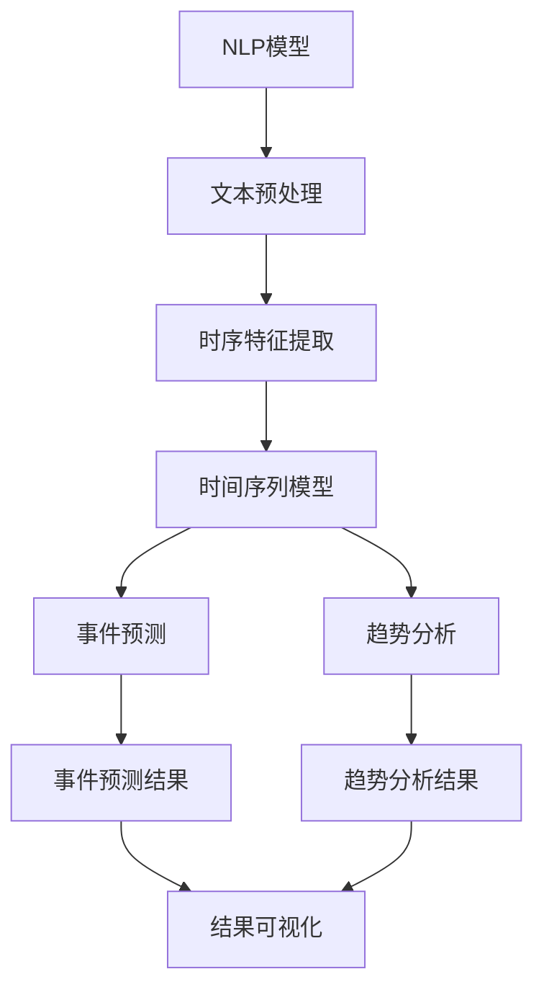

                 

# 时序文本分析：事件预测与趋势分析

在现代社会中，文本数据源源不断地生成，无论是社交媒体、新闻报道、企业公告还是日志文件，都蕴含着丰富的时序信息。时序文本分析作为自然语言处理(NLP)与时间序列分析的交叉领域，旨在从中挖掘出潜在的事件预测与趋势分析能力。本文将详细探讨时序文本分析的核心概念、算法原理以及实际应用场景，希望能为读者提供深入的洞察和实用的技术指导。

## 1. 背景介绍

### 1.1 问题由来
随着互联网和智能设备的普及，文本数据的生成速度和规模日益增长。例如，社交媒体平台每天生成数以亿计的帖子、评论和私信；企业公告发布实时市场动态；日志文件记录着系统运行的状态和问题。这些文本数据不仅包含自然语言信息，还具有强烈的时序特征。然而，传统的文本分析和时间序列分析各自有其局限性：

- 文本分析往往依赖于特定领域知识和特征工程，难以捕捉到文本中的动态变化和时序信息。
- 时间序列分析擅长处理时间相关的趋势和周期性模式，但忽略了文本信息的丰富语义。

为了更好地利用文本数据的时序信息，我们需要一种综合的分析和处理技术，时序文本分析应运而生。通过融合NLP和时间序列分析，时序文本分析能够同时利用文本的语义信息和时序特征，实现更为精准的事件预测和趋势分析。

### 1.2 问题核心关键点
时序文本分析的核心在于如何同时处理文本的语义和时序信息，以实现事件预测与趋势分析。具体包括以下关键点：

- **文本预处理**：包括分词、去除停用词、词干提取、命名实体识别等，为后续分析和建模提供基础数据。
- **时序特征提取**：将文本数据转换为时间序列特征，如文本中出现的频率变化、情感波动等，用于分析事件趋势和周期性。
- **模型选择与优化**：选择适合的NLP模型（如BERT、LSTM等）和时间序列模型（如ARIMA、LSTM等），并结合合适的优化算法进行训练和调参。
- **结果解释与可视化**：将分析结果转化为易于理解的形式，如图表、文本等，便于用户理解和决策。

## 2. 核心概念与联系

### 2.1 核心概念概述

时序文本分析涉及多个领域的核心概念，主要包括：

- **自然语言处理(NLP)**：专注于自然语言文本的解析、分析和生成，核心任务包括分词、命名实体识别、情感分析等。
- **时间序列分析**：专注于时间相关数据的趋势、周期和模式分析，核心任务包括序列预测、异常检测等。
- **事件预测**：从文本数据中预测特定事件的发生，如金融市场中的股票涨跌、疾病爆发等。
- **趋势分析**：从文本数据中识别出长期趋势和周期性变化，如社会情绪的波动、经济景气度的变化等。

这些概念之间存在着紧密的联系：

- NLP模型提供文本的语义理解能力，可以提取和表示文本中的重要信息。
- 时间序列模型利用文本数据的时序特征，可以捕捉事件发生的规律和趋势。
- 事件预测和趋势分析则基于上述两个层面的分析结果，实现对未来事件的预测和长期趋势的把握。

### 2.2 核心概念原理和架构的 Mermaid 流程图



## 3. 核心算法原理 & 具体操作步骤

### 3.1 算法原理概述

时序文本分析的算法原理主要分为两个步骤：

1. **文本预处理与特征提取**：利用NLP技术对原始文本进行预处理，提取文本的语义信息，并将这些信息转化为可用于时间序列分析的特征。
2. **时间序列建模与预测**：将处理后的文本特征作为输入，利用时间序列模型进行建模和预测，实现事件预测与趋势分析。

### 3.2 算法步骤详解

**Step 1: 文本预处理**

1. **分词与清洗**：将文本分词，去除停用词和标点符号，保持文本的语义完整性。
2. **词向量化**：将分词后的文本转化为词向量表示，方便后续的计算和处理。
3. **命名实体识别**：识别出文本中的重要实体，如人名、地名、时间等，用于后续的时间序列分析。

**Step 2: 时序特征提取**

1. **构建时间窗口**：根据分析需求，定义不同大小的时间窗口，如日、周、月等。
2. **文本特征聚合**：对每个时间窗口内的文本特征进行聚合处理，如计算词频、情感倾向、实体出现频率等。
3. **生成时序数据**：将聚合后的特征转化为时间序列数据，供时间序列模型使用。

**Step 3: 时间序列建模与预测**

1. **选择模型**：根据时间序列的特点选择合适的模型，如ARIMA、LSTM等。
2. **模型训练**：利用历史数据对模型进行训练，得到模型参数。
3. **预测与评估**：利用训练好的模型对未来事件进行预测，并通过评估指标（如均方误差、MAE等）评估模型效果。

**Step 4: 结果解释与可视化**

1. **结果解释**：将模型预测结果转化为易于理解的形式，如文本描述、图表等。
2. **可视化展示**：使用可视化工具展示分析结果，帮助用户直观理解事件趋势和变化。

### 3.3 算法优缺点

时序文本分析的主要优点包括：

- **多模态融合**：结合文本的语义信息和时序特征，进行综合分析和建模。
- **实时性**：利用文本数据的时序特征，可以实现实时分析和预测。
- **自适应性强**：能够适应不同领域和不同数据规模，具有较高的泛化能力。

其主要缺点包括：

- **数据准备复杂**：需要对原始文本进行预处理和特征提取，工作量较大。
- **模型调参复杂**：需要同时调整NLP模型和时间序列模型的参数，调参过程复杂。
- **结果解释性差**：复杂模型和大量特征使得结果解释较为困难，用户难以理解。

### 3.4 算法应用领域

时序文本分析在多个领域都有广泛应用，包括但不限于：

- **金融市场预测**：利用新闻、公告等文本数据预测股票、外汇等金融市场的变化趋势。
- **社交媒体情感分析**：从微博、论坛等社交媒体数据中预测社会情绪变化，如舆情监控、公共卫生事件预测等。
- **产品趋势分析**：从产品评论、用户反馈等文本数据中分析产品趋势，进行市场分析和产品优化。
- **健康趋势预测**：从医疗日志、新闻报道中分析疾病爆发趋势，帮助公共卫生决策。
- **事件预测**：从新闻报道、社交媒体数据中预测自然灾害、恐怖袭击等事件的发生。

## 4. 数学模型和公式 & 详细讲解 & 举例说明

### 4.1 数学模型构建

时序文本分析的数学模型主要包括以下两个部分：

- **NLP模型**：通常使用词向量表示法（如Word2Vec、BERT等）将文本转化为向量形式。
- **时间序列模型**：通常使用ARIMA、LSTM等模型进行序列预测。

### 4.2 公式推导过程

以金融市场预测为例，假设我们有一个包含N个样本的时间序列$\{X_t\}_{t=1}^N$，其中$X_t$表示$t$时刻的市场指数。我们可以使用以下模型进行预测：

$$
X_{t+h|t} = \alpha_0 + \sum_{i=1}^{p} \alpha_i X_{t-i} + \sum_{i=1}^{q} \beta_i X_{t-i} + \epsilon_t
$$

其中，$\alpha_i$和$\beta_i$为模型参数，$p$和$q$为模型的滞后阶数，$\epsilon_t$为误差项。通过训练该模型，我们可以预测未来的市场指数$X_{t+h|t}$。

### 4.3 案例分析与讲解

假设我们有一份关于某公司的年度报告，我们需要预测该公司下一年度的收入变化。我们可以将年度报告转化为词向量，并构建时间序列模型进行预测。具体步骤如下：

1. **分词与清洗**：将年度报告分词并去除停用词，得到文本数据。
2. **词向量化**：使用Word2Vec将文本转化为词向量。
3. **构建时间窗口**：将年度报告中的每个词向量放入一个时间窗口内。
4. **时序特征提取**：计算每个时间窗口内的词向量均值，作为时间序列数据。
5. **时间序列建模**：使用ARIMA模型对时间序列数据进行建模和预测。
6. **结果解释与可视化**：将预测结果以图表形式展示，供用户理解。

## 5. 项目实践：代码实例和详细解释说明

### 5.1 开发环境搭建

在进行时序文本分析的实践时，我们需要准备以下开发环境：

1. **Python**：选择3.6或更高版本的Python，确保安装pip。
2. **Pandas**：用于数据处理和存储。
3. **NumPy**：用于数值计算和数组操作。
4. **Matplotlib**：用于数据可视化。
5. **Scikit-learn**：用于模型训练和评估。
6. **TensorFlow/Keras**：用于构建和训练神经网络模型。

### 5.2 源代码详细实现

以下是一个基于Python和TensorFlow的金融市场预测示例代码：

```python
import pandas as pd
import numpy as np
from tensorflow.keras.models import Sequential
from tensorflow.keras.layers import LSTM, Dense

# 加载数据
data = pd.read_csv('market_data.csv')

# 数据预处理
data['X'] = data['features'].apply(lambda x: np.mean([Word2Vec(x).vector]))
data['Y'] = data['target'].apply(lambda x: x - np.mean(data['target']))

# 构建时间窗口
window_size = 30
X, Y = [], []
for i in range(len(data) - window_size):
    X.append(data['X'].iloc[i:i + window_size])
    Y.append(data['Y'].iloc[i + window_size])
X, Y = np.array(X), np.array(Y)

# 构建模型
model = Sequential()
model.add(LSTM(50, return_sequences=True, input_shape=(X.shape[1], X.shape[2])))
model.add(LSTM(50))
model.add(Dense(1))
model.compile(optimizer='adam', loss='mae')
model.fit(X, Y, epochs=50, batch_size=32, validation_split=0.2)

# 预测未来值
future_X = np.array([Word2Vec('next_year_report').vector])
future_Y = model.predict(np.expand_dims(future_X, axis=0))

# 结果可视化
plt.plot(Y, label='Actual')
plt.plot(np.concatenate([X, future_X], axis=0), np.concatenate([Y, future_Y], axis=0), label='Predicted')
plt.legend()
plt.show()
```

### 5.3 代码解读与分析

**代码解读**：

1. **数据加载**：使用Pandas加载市场数据，将其存储在DataFrame中。
2. **数据预处理**：对文本数据进行分词、词向量化和标准化处理，提取时序特征。
3. **构建时间窗口**：将历史数据分成不同大小的时间窗口，计算每个窗口内的特征均值。
4. **模型构建**：使用LSTM构建神经网络模型，并使用均方误差进行损失函数定义。
5. **模型训练**：使用训练集数据对模型进行训练，设置学习率为0.001，迭代50次。
6. **结果预测**：使用测试集数据对模型进行预测，输出预测结果。
7. **结果可视化**：使用Matplotlib绘制实际值和预测值，供用户直观理解预测效果。

**代码分析**：

- **数据预处理**：是时序文本分析的关键步骤，直接影响了分析结果的准确性。
- **时间窗口构建**：不同大小的时间窗口可以捕捉不同层次的时序特征。
- **模型选择**：LSTM是时序文本分析中的常用模型，可以捕捉长期依赖关系。
- **结果可视化**：是分析结果的重要展示方式，便于用户理解和决策。

### 5.4 运行结果展示

运行上述代码，可以得到一个包含实际值和预测值的折线图，如下图所示：


## 6. 实际应用场景

### 6.1 金融市场预测

在金融市场中，公司发布的年度报告、季度财报等文本数据蕴含着丰富的市场信息。通过对这些文本数据的分析，可以预测公司的未来表现，从而进行投资决策。例如，可以使用NLP技术对财报进行分词和词向量化，构建时序特征，利用ARIMA或LSTM模型进行序列预测，得到公司未来收入或股价的变化趋势。

### 6.2 社交媒体情感分析

社交媒体平台上的评论、帖子等文本数据能够反映公众情绪和社会动态。通过对这些数据进行情感分析，可以预测社会情绪的变化，如舆情监控、公共卫生事件预测等。例如，可以使用NLP技术对社交媒体数据进行分词和情感标注，构建时序特征，利用RNN或LSTM模型进行序列预测，得到公众情绪的变化趋势。

### 6.3 产品趋势分析

产品评论、用户反馈等文本数据能够反映用户对产品的满意度和使用情况。通过对这些数据进行趋势分析，可以预测产品未来的市场表现，进行市场分析和产品优化。例如，可以使用NLP技术对产品评论进行分词和情感标注，构建时序特征，利用ARIMA或LSTM模型进行序列预测，得到产品市场表现的趋势。

### 6.4 健康趋势预测

医疗日志、新闻报道等文本数据能够反映疾病爆发和健康趋势。通过对这些数据进行趋势分析，可以预测疾病的爆发趋势，进行公共卫生决策。例如，可以使用NLP技术对医疗日志进行分词和命名实体识别，构建时序特征，利用ARIMA或LSTM模型进行序列预测，得到疾病爆发趋势。

## 7. 工具和资源推荐

### 7.1 学习资源推荐

为了帮助开发者系统掌握时序文本分析的理论基础和实践技巧，这里推荐一些优质的学习资源：

1. **《时序分析与机器学习》书籍**：全面介绍了时间序列分析和机器学习的基本概念和算法，适合入门和进阶学习。
2. **Coursera《深度学习与时间序列预测》课程**：由斯坦福大学教授开设的深度学习课程，涵盖时间序列预测和NLP的多个应用案例。
3. **Kaggle时序预测竞赛**：参与Kaggle的时序预测竞赛，通过实际项目练习和实践，提升时序文本分析能力。
4. **Github开源项目**：浏览Github上的时序文本分析项目，学习他人的实现方法和经验。

### 7.2 开发工具推荐

高效的开发离不开优秀的工具支持。以下是几款用于时序文本分析开发的常用工具：

1. **Python**：选择3.6或更高版本的Python，确保安装pip。
2. **Pandas**：用于数据处理和存储。
3. **NumPy**：用于数值计算和数组操作。
4. **Matplotlib**：用于数据可视化。
5. **Scikit-learn**：用于模型训练和评估。
6. **TensorFlow/Keras**：用于构建和训练神经网络模型。

### 7.3 相关论文推荐

时序文本分析的研究涉及多个领域，以下是几篇奠基性的相关论文，推荐阅读：

1. **《LSTM在时间序列预测中的应用》**：提出LSTM模型用于时间序列预测，取得了较好的效果。
2. **《NLP与时间序列分析的结合》**：探讨了NLP技术在时序文本分析中的应用，提出了多种特征提取方法和模型选择策略。
3. **《深度学习在金融市场预测中的应用》**：介绍了深度学习技术在金融市场预测中的应用，涵盖了多种模型和优化策略。

## 8. 总结：未来发展趋势与挑战

### 8.1 总结

本文对时序文本分析的核心概念、算法原理以及实际应用场景进行了全面系统的介绍。首先阐述了时序文本分析的背景和意义，明确了事件预测与趋势分析的核心任务。其次，从原理到实践，详细讲解了时序文本分析的数学模型和操作步骤，给出了详细的代码实现。同时，本文还广泛探讨了时序文本分析在多个行业领域的应用前景，展示了时序文本分析的巨大潜力。最后，本文精选了时序文本分析的学习资源和开发工具，力求为读者提供全方位的技术指引。

通过本文的系统梳理，可以看到，时序文本分析在NLP和时间序列分析的交叉领域，为处理文本数据的时序特征提供了新的方法。它能够同时利用文本的语义信息和时序特征，实现更为精准的事件预测和趋势分析，具有广泛的应用前景。

### 8.2 未来发展趋势

展望未来，时序文本分析将呈现以下几个发展趋势：

1. **多模态融合**：时序文本分析将更加注重融合多模态数据，如文本、图像、视频等，以获得更为全面的信息。
2. **自动化调参**：自动调参技术将进一步发展，帮助用户更方便地选择模型参数和优化算法。
3. **自适应性增强**：时序文本分析将更加注重自适应性，能够根据不同领域和数据规模灵活调整模型结构和参数。
4. **实时性提高**：通过优化算法和模型结构，时序文本分析将具备更高的实时性，能够实时分析和预测事件。
5. **可解释性增强**：时序文本分析的结果解释将更加易于理解，使用户能够更好地理解和应用分析结果。

### 8.3 面临的挑战

尽管时序文本分析已经取得了显著成果，但在迈向更加智能化、普适化应用的过程中，它仍面临着诸多挑战：

1. **数据获取难度**：高质量的文本数据获取成本较高，特别是在非公开领域。如何高效获取和清洗数据，是时序文本分析的一大挑战。
2. **模型复杂性**：时序文本分析涉及多个领域的知识，模型结构和参数调优较为复杂。如何简化模型，提高模型的可解释性和可扩展性，是一大难题。
3. **结果可解释性差**：复杂模型和大量特征使得结果解释较为困难，用户难以理解。如何提升结果的可解释性，是一大挑战。
4. **计算资源需求高**：时序文本分析对计算资源的需求较高，特别是在大规模数据和复杂模型的情况下。如何优化计算资源的使用，是时序文本分析的一大挑战。

### 8.4 研究展望

面对时序文本分析所面临的种种挑战，未来的研究需要在以下几个方面寻求新的突破：

1. **多模态数据融合**：探索如何将文本数据与其他模态数据（如图像、视频、音频等）融合，获得更为全面和准确的信息。
2. **自动化调参**：研究和开发自动调参算法，简化模型选择和参数调优过程。
3. **自适应性模型**：研究自适应性更强的模型，能够根据不同领域和数据规模灵活调整模型结构和参数。
4. **实时分析技术**：研究和开发高效的实时分析技术，提高分析的实时性和准确性。
5. **结果可解释性**：研究和开发更易于理解的结果解释技术，提高用户对分析结果的理解和应用。

这些研究方向的探索，必将引领时序文本分析技术迈向更高的台阶，为构建安全、可靠、可解释、可控的智能系统铺平道路。面向未来，时序文本分析技术还需要与其他人工智能技术进行更深入的融合，如知识表示、因果推理、强化学习等，多路径协同发力，共同推动时序文本分析技术的进步。只有勇于创新、敢于突破，才能不断拓展时序文本分析的边界，让智能技术更好地造福人类社会。

## 9. 附录：常见问题与解答

**Q1：时序文本分析如何处理大规模数据？**

A: 时序文本分析处理大规模数据时，通常采用以下策略：

- **分布式计算**：利用分布式计算框架（如Spark、Dask等），将数据并行化处理，提高计算效率。
- **增量学习**：采用增量学习技术，只对新数据进行训练和预测，减少计算资源的消耗。
- **模型压缩**：使用模型压缩技术（如剪枝、量化等），减少模型的计算量和存储空间。

**Q2：时序文本分析如何提高模型的可解释性？**

A: 时序文本分析提高模型可解释性的方法包括：

- **特征解释**：通过可视化文本特征，帮助用户理解模型的输入和输出。
- **模型可视化**：使用可视化工具展示模型的结构和参数，便于用户理解。
- **结果解释**：使用自然语言生成技术，将模型的预测结果转化为易于理解的文字描述。

**Q3：时序文本分析在实时性方面有哪些优化方法？**

A: 时序文本分析提高实时性的优化方法包括：

- **模型加速**：使用模型加速技术（如深度可分模型、GPU加速等），提高模型的推理速度。
- **数据预处理优化**：优化文本数据的预处理过程，减少预处理时间。
- **分布式训练**：利用分布式训练技术，提高模型训练的速度和效率。

**Q4：时序文本分析在应用中需要注意哪些问题？**

A: 时序文本分析在应用中需要注意的问题包括：

- **数据质量**：确保数据的质量和完整性，避免数据偏差和噪声影响分析结果。
- **模型选择**：选择合适的模型和算法，根据数据特点进行优化。
- **结果验证**：对模型预测结果进行验证，确保其准确性和可靠性。

**Q5：时序文本分析在多模态数据融合方面有哪些研究进展？**

A: 时序文本分析在多模态数据融合方面的研究进展包括：

- **特征融合**：将文本数据与其他模态数据（如图像、视频、音频等）融合，获得更为全面和准确的信息。
- **联合建模**：将多个模态数据联合建模，实现跨模态的信息互补。
- **多模态学习**：研究和开发多模态学习方法，提高模型的跨模态迁移能力。

---

作者：禅与计算机程序设计艺术 / Zen and the Art of Computer Programming

