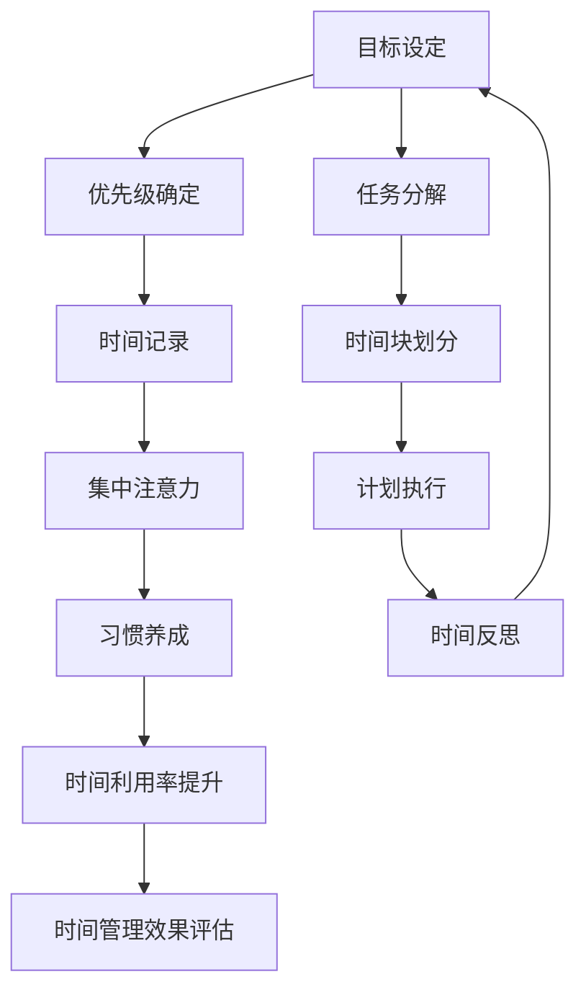

                 

# 时间管理：高效利用时间

## 1. 背景介绍

在当今快节奏的社会中，时间管理成为了一项至关重要的技能。无论是在个人生活中还是职场发展中，合理的时间管理都可以显著提升效率，实现更多的目标。然而，时间管理的概念并非一成不变，随着科技的发展和社会的进步，时间管理的方式和工具也在不断演进。本文将从时间的本质、时间管理的基本原则以及现代时间管理的工具和实践三个方面进行探讨。

## 2. 核心概念与联系

### 2.1 核心概念概述

时间管理的核心概念包括以下几个方面：

- **时间**：时间是指从过去到未来的连续过程，是人生、工作和生活中最基本的元素之一。
- **时间管理**：是指通过科学的方法和工具，对时间进行有效规划和分配，以实现更高效率和更好效果的过程。
- **目标设定**：确定明确、具体且可实现的目标，是时间管理的基础。
- **优先级**：根据任务的重要性和紧急程度，确定优先级，以便合理分配时间。
- **集中注意力**：在执行任务时，集中注意力，避免分心，提高工作效率。
- **时间记录**：记录时间的使用情况，帮助分析和改进时间管理策略。
- **习惯养成**：通过习惯的建立，减少时间浪费，提高时间利用率。

这些概念之间存在着密切的联系。时间管理的目标设定与优先级确定，可以帮助我们更好地规划时间；集中注意力和时间记录则帮助我们监控和改进时间使用效率；而习惯养成则是时间管理中不可或缺的长期策略。

### 2.2 核心概念原理和架构的 Mermaid 流程图



这个流程图展示了时间管理的核心流程，从目标设定到时间利用率提升，形成了一个闭环，确保时间管理效果的持续改进。

## 3. 核心算法原理 & 具体操作步骤

### 3.1 算法原理概述

时间管理算法的基本原理是通过对时间的合理规划和分配，使得每单位时间的使用效率最大化。这通常涉及以下几个步骤：

1. **目标设定**：明确具体、可衡量、可实现、相关性强和时限性明确的目标。
2. **优先级确定**：根据任务的紧急性和重要性，确定优先级，确保高优先级任务得到优先处理。
3. **时间块划分**：将一天或一周的时间划分为若干个时间块，每个时间块分配给特定的任务。
4. **集中注意力**：在执行任务时，尽量减少分心，集中精力完成当前任务。
5. **时间记录**：记录时间的实际使用情况，评估时间管理效果。
6. **反思与改进**：定期反思时间使用情况，调整策略以提高时间利用率。

### 3.2 算法步骤详解

#### 3.2.1 目标设定

目标设定是时间管理的首要步骤。明确的目标不仅有助于确定优先级，还能提供方向和动力。

**具体操作步骤**：

1. **SMART原则**：确保目标具体、可衡量、可实现、相关性强和时限性明确（SMART）。
2. **目标分解**：将大目标分解为多个小目标，逐步实现。
3. **写下来**：将目标和计划写下来，增强记忆和责任感。

#### 3.2.2 优先级确定

确定任务的优先级是时间管理的核心。优先级决定了任务的处理顺序和时间分配。

**具体操作步骤**：

1. **四象限法则**：将任务分为紧急且重要、紧急但不重要、不紧急但重要、不紧急且不重要四个象限。
2. **ABC法则**：将任务分为A、B、C三类，A类任务为高优先级任务，C类任务为低优先级任务。
3. **价值评估**：根据任务的长期价值和紧急程度进行综合评估，确定优先级。

#### 3.2.3 时间块划分

时间块划分是将时间划分为多个时间块，每个时间块专门用于特定任务。

**具体操作步骤**：

1. **时间评估**：评估每天或每周可用于工作和学习的时间。
2. **时间块划分**：将时间划分为若干个时间块，每个时间块持续30分钟到2小时不等。
3. **任务分配**：根据优先级将任务分配到不同的时间块中。

#### 3.2.4 集中注意力

集中注意力是提高时间利用率的关键。避免分心，专注于当前任务，可以显著提升效率。

**具体操作步骤**：

1. **工作环境优化**：营造安静、整洁、舒适的工作环境。
2. **关闭干扰**：关闭手机通知、社交媒体等干扰源。
3. **番茄工作法**：采用番茄工作法，即25分钟集中工作，5分钟短暂休息，每4个番茄时间后进行长休息。

#### 3.2.5 时间记录

时间记录是评估时间管理效果的重要手段。通过记录时间的实际使用情况，可以发现时间浪费的环节，进而进行调整和优化。

**具体操作步骤**：

1. **时间记录工具**：使用时间记录工具，如Toggl、RescueTime等。
2. **日记录**：每天记录时间的使用情况，包括工作、学习、休息、娱乐等。
3. **周回顾**：每周进行时间使用情况的回顾和总结。

#### 3.2.6 反思与改进

定期反思时间使用情况，及时调整策略，是持续改进时间管理的关键。

**具体操作步骤**：

1. **时间日志**：记录每日时间使用情况，包括任务完成情况、时间浪费原因等。
2. **反思总结**：每周进行时间使用情况的反思和总结，找出时间管理中的问题。
3. **调整策略**：根据反思结果，调整时间管理策略，优化时间利用率。

### 3.3 算法优缺点

时间管理算法的优点包括：

- **提高效率**：通过合理规划和分配时间，显著提升工作效率。
- **增强目标感**：明确的目标设定有助于增强动力和责任感。
- **减少时间浪费**：通过集中注意力和时间记录，减少时间浪费。

其缺点包括：

- **执行难度**：需要较高的自律性和坚持度，执行难度较大。
- **可能过于僵化**：固定的规划和严格的执行可能会让生活过于单调，缺乏灵活性。
- **过度关注时间**：过度关注时间可能忽略任务的实际效果，反而适得其反。

### 3.4 算法应用领域

时间管理算法不仅适用于个人生活，在职场、教育、学习等多个领域都有广泛应用。

- **职场**：帮助员工合理规划工作任务，提高工作效率和产出。
- **教育**：帮助学生合理安排学习时间和任务，提高学习效果。
- **学习**：帮助学习者制定合理的学习计划，提升学习效率。
- **家庭**：帮助家庭成员合理分配家务、育儿、休闲等时间，提升家庭生活质量。

## 4. 数学模型和公式 & 详细讲解 & 举例说明

### 4.1 数学模型构建

时间管理算法的数学模型可以通过以下公式进行表达：

$$
Time_{total} = \sum_{i=1}^{n} Time_{task_i} + \sum_{j=1}^{m} Time_{interruption_j}
$$

其中，$Time_{total}$为总时间，$Time_{task_i}$为完成第$i$个任务所需时间，$Time_{interruption_j}$为第$j$个干扰源导致的额外时间损失。

### 4.2 公式推导过程

**目标设定**：

$$
Target_{i} = Specific \cap Measurable \cap Achievable \cap Relevant \cap Time-bound
$$

**优先级确定**：

$$
Priority_{i} = \begin{cases}
1 & \text{if } (Task_i \in Quadrant_1 \text{ or } Task_i \in Category_A) \\
0 & \text{otherwise}
\end{cases}
$$

**时间块划分**：

$$
Time_{block_j} = \begin{cases}
Time_{i} & \text{if } Task_i \in Time_{block_j} \\
0 & \text{otherwise}
\end{cases}
$$

**集中注意力**：

$$
Focus_{t} = \begin{cases}
1 & \text{if } t \in Work_session \\
0 & \text{otherwise}
\end{cases}
$$

**时间记录**：

$$
Time_{record} = \sum_{k=1}^{K} Time_{task_k} + \sum_{l=1}^{L} Time_{interruption_l}
$$

**反思与改进**：

$$
Reflect_{i} = \begin{cases}
1 & \text{if } Time_{record_i} \geq Time_{planned_i} \\
0 & \text{otherwise}
\end{cases}
$$

### 4.3 案例分析与讲解

假设一位软件开发工程师，每天工作8小时，目标是将一个项目提前一周完成。项目包含以下几个任务：

- **任务1**：需求分析，需要2小时
- **任务2**：编码实现，需要10小时
- **任务3**：测试调试，需要4小时
- **任务4**：文档编写，需要3小时
- **任务5**：代码评审，需要1小时

假设每天有1小时的不可预见干扰，如会议、电话等。

根据四象限法则，任务1和任务3属于紧急且重要，任务2和任务5属于紧急但不重要，任务4属于不紧急但重要。采用ABC法则，任务1和任务3为A类任务，任务2为B类任务，任务4和任务5为C类任务。

根据时间块划分，可以安排如下时间表：

| 时间块 | 任务       | 时间记录 | 反思总结 |
| ------ | ---------- | -------- | ------- |
| 8:00-9:00 | 任务1      | 1小时     |         |
| 9:00-10:00 | 任务3      | 1小时     |         |
| 10:00-11:00 | 任务2      | 1小时     |         |
| 11:00-12:00 | 任务4      | 1小时     |         |
| 13:00-14:00 | 任务1      | 1小时     |         |
| 14:00-15:00 | 任务3      | 1小时     |         |
| 15:00-16:00 | 任务5      | 1小时     |         |
| 16:00-17:00 | 文档编写   | 1小时     |         |
| 17:00-18:00 | 测试调试   | 1小时     |         |
| 18:00-18:30 | 不可预见干扰 | 0.5小时   |         |

通过集中注意力和番茄工作法，这位工程师可以更好地完成任务。每天使用RescueTime记录时间使用情况，每周进行反思总结，调整时间管理策略，以达到提前一周完成项目的目标。

## 5. 项目实践：代码实例和详细解释说明

### 5.1 开发环境搭建

要进行时间管理算法的实践，需要以下开发环境：

1. **Python**：Python是时间管理算法的主要编程语言，支持丰富的第三方库。
2. **Jupyter Notebook**：Jupyter Notebook提供了一个交互式的编程环境，便于代码调试和展示。
3. **Pandas**：Pandas库提供了强大的数据处理功能，适用于时间记录和反思总结。
4. **Matplotlib**：Matplotlib库提供了丰富的绘图功能，适用于绘制时间使用情况的图表。
5. **RescueTime**：RescueTime是一款时间记录工具，可以自动记录时间使用情况，生成详细报告。

### 5.2 源代码详细实现

以下是一个简单的Python代码示例，用于记录时间使用情况并进行反思总结：

```python
import pandas as pd
import matplotlib.pyplot as plt

# 假设每日时间记录如下
daily_records = {
    'Task': ['需求分析', '编码实现', '测试调试', '文档编写', '代码评审'],
    'Time': [2, 10, 4, 3, 1]
}

# 将每日记录转换为DataFrame
df = pd.DataFrame(daily_records)

# 添加不可预见干扰
df['Interruption'] = [1] * 5

# 计算每日总时间
df['Total_time'] = df['Time'] + df['Interruption']

# 绘制时间使用情况的柱状图
plt.bar(df['Task'], df['Total_time'])
plt.xlabel('任务')
plt.ylabel('时间')
plt.title('每日时间使用情况')
plt.show()

# 进行每周反思总结
weekly_records = {
    'Task': ['需求分析', '编码实现', '测试调试', '文档编写', '代码评审'],
    'Planned_time': [2, 10, 4, 3, 1],
    'Actual_time': [2, 10, 4, 3, 1]
}

# 将每周记录转换为DataFrame
weekly_df = pd.DataFrame(weekly_records)

# 计算每周实际时间与计划时间的偏差
weekly_df['Deviation'] = weekly_df['Actual_time'] - weekly_df['Planned_time']

# 筛选出偏差较大的任务
over_time_tasks = weekly_df[weekly_df['Deviation'].abs() > 0.5]

# 输出反思总结结果
print(over_time_tasks)
```

### 5.3 代码解读与分析

上述代码实现了对每日时间使用情况和每周反思总结的记录和分析。通过使用Pandas库，可以方便地进行数据处理和分析，而Matplotlib库则提供了图表展示的功能。此外，RescueTime工具可以自动记录时间使用情况，生成详细报告，进一步提高了时间管理的效率。

## 6. 实际应用场景

### 6.1 时间管理在个人生活中的应用

时间管理在个人生活中具有广泛的应用。例如，一位家庭主妇可以通过时间管理算法，合理分配家务、育儿、休闲等时间，提升家庭生活质量。

**案例分析**：

- **家务时间管理**：将家务任务分解为若干小任务，如清洁、烹饪、洗衣等，根据优先级和时间块划分，合理安排时间。
- **育儿时间管理**：将育儿任务分解为陪伴、教育、娱乐等，根据孩子的年龄和需求，合理安排时间。
- **休闲时间管理**：根据休闲活动的类型和兴趣，合理安排时间，确保充足的休息和娱乐。

### 6.2 时间管理在职场中的应用

时间管理在职场中同样具有重要的应用。例如，一位项目经理可以通过时间管理算法，合理规划项目进度，提高工作效率和产出。

**案例分析**：

- **项目进度管理**：将项目任务分解为若干小任务，根据优先级和时间块划分，合理安排时间。
- **团队协作管理**：通过时间记录和反思总结，发现团队协作中的问题，及时进行调整和改进。
- **个人发展管理**：根据个人职业发展目标，合理安排时间，平衡工作与学习，提升自身能力。

### 6.3 时间管理在学习中的应用

时间管理在学习中同样具有重要的应用。例如，一位学生可以通过时间管理算法，合理安排学习时间和任务，提高学习效果。

**案例分析**：

- **学习时间管理**：将学习任务分解为若干小任务，如预习、复习、做作业等，根据优先级和时间块划分，合理安排时间。
- **考试时间管理**：根据考试时间和内容，合理安排复习计划，确保全面掌握知识点。
- **课外活动管理**：根据课外活动的类型和兴趣，合理安排时间，确保充足的休息和娱乐。

### 6.4 未来应用展望

未来，时间管理算法将不断演进，结合更多前沿技术和工具，进一步提升时间利用率。例如：

- **人工智能辅助**：利用人工智能技术，自动识别时间浪费的环节，提供优化建议。
- **物联网集成**：结合物联网技术，自动记录和分析时间使用情况，提供更精准的时间管理方案。
- **多设备协同**：通过多设备协同工作，优化时间管理策略，提高时间利用率。

## 7. 工具和资源推荐

### 7.1 学习资源推荐

1. **《高效能人士的七个习惯》**：史蒂芬·柯维著，介绍了时间管理的基本原则和技巧。
2. **《番茄工作法图解》**：弗朗西斯科·西里洛著，介绍了番茄工作法的原理和实践方法。
3. **《深度工作》**：卡尔·纽波特著，介绍了如何通过深度工作提高生产力和创造力。
4. **《时间的艺术》**：琳达·埃文斯著，介绍了时间管理的心理学原理和方法。
5. **《时间管理》课程**：Coursera等在线平台提供的课程，涵盖了时间管理的基本概念和工具。

### 7.2 开发工具推荐

1. **RescueTime**：自动记录时间使用情况，生成详细报告，帮助进行反思总结。
2. **Toggl**：时间记录工具，支持手动记录和自动记录，生成时间报告。
3. **Notion**：任务管理工具，支持任务分解、时间记录和反思总结。
4. **Jira**：项目管理工具，支持任务分配、时间跟踪和团队协作。

### 7.3 相关论文推荐

1. **《时间管理：理论与实践》**：时间管理领域的经典著作，介绍了时间管理的基本理论和实践方法。
2. **《时间使用情况的自动分析和预测》**：介绍了自动时间记录和分析技术的研究进展。
3. **《时间管理算法在项目管理中的应用》**：介绍了时间管理算法在项目管理中的应用，提供了具体案例和策略。

## 8. 总结：未来发展趋势与挑战

### 8.1 总结

时间管理是提高生产力和生活品质的重要技能。通过科学的时间管理算法，我们可以合理规划和分配时间，提高工作效率和生活质量。未来，时间管理算法将结合更多前沿技术和工具，进一步提升时间利用率。

### 8.2 未来发展趋势

时间管理算法的未来发展趋势包括：

1. **智能化**：结合人工智能技术，自动分析时间使用情况，提供优化建议。
2. **可视化**：通过图表和可视化工具，直观展示时间使用情况和反思总结结果。
3. **多设备协同**：通过多设备协同工作，优化时间管理策略。
4. **个性化**：根据个人习惯和偏好，提供个性化的时间管理方案。

### 8.3 面临的挑战

时间管理算法面临的挑战包括：

1. **自律性要求高**：时间管理需要高度的自律性和坚持度，执行难度较大。
2. **灵活性不足**：固定的规划和严格的执行可能会让生活过于单调，缺乏灵活性。
3. **数据隐私**：时间记录和分析可能涉及个人隐私，需要合理保护。

### 8.4 研究展望

未来，时间管理研究需要在以下几个方面进行探索：

1. **结合心理学的研究**：研究时间管理的心理学原理，探索如何通过心理调节提升时间管理效果。
2. **结合物联网的研究**：研究物联网技术在时间管理中的应用，探索如何通过自动记录和分析提高时间利用率。
3. **结合机器学习的研究**：研究机器学习技术在时间管理中的应用，探索如何通过自动化和个性化提升时间管理效果。

## 9. 附录：常见问题与解答

**Q1：时间管理是否适用于所有人群？**

A: 时间管理适用于所有人群，无论是在个人生活、职场还是学习中，都能通过时间管理提高效率和质量。

**Q2：时间管理需要多久才能见效？**

A: 时间管理的见效时间因人而异。通常情况下，坚持两周左右，可以感受到一定的效果，坚持三个月以上，才能真正形成习惯，显著提升时间利用率。

**Q3：时间管理是否需要非常严格？**

A: 时间管理需要一定的自律性和坚持度，但并不需要过于严格。合理的灵活性可以帮助我们更好地应对突发情况，保持生活的平衡和多样性。

**Q4：时间管理是否会限制自由时间？**

A: 时间管理并不是限制自由时间，而是通过合理安排时间，最大化自由时间的利用率。自由时间是时间管理的重要组成部分，可以帮助我们进行放松和娱乐。

**Q5：时间管理是否适合长期使用？**

A: 时间管理适合长期使用，能够帮助我们在不同的生活阶段和环境中，持续提升效率和生活质量。坚持时间管理，可以形成良好的习惯，逐步提升自我管理能力。

---

作者：禅与计算机程序设计艺术 / Zen and the Art of Computer Programming

