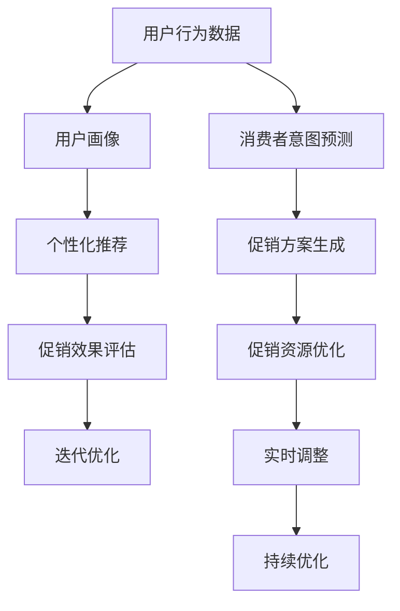

                 

# 智能促销策略的实践效果

> 关键词：智能促销, 消费者行为, 推荐系统, 转化率提升, 个性化推荐, 模型优化, 促销策略, 电商行业

## 1. 背景介绍

随着电子商务的迅猛发展，如何提升销售转化率已成为电商平台关注的焦点。传统的促销策略往往依赖于经验和直觉，无法对消费者行为进行精准刻画，导致促销资源浪费和客户满意度下降。近年来，随着推荐系统和大数据分析技术的进步，越来越多的电商平台开始探索基于智能算法和消费者行为数据的促销策略优化方法。通过深度学习模型和大数据分析，可以更准确地识别和预测消费者购买意愿，制定更具针对性的促销方案，从而提升促销效果和客户满意度。

本文章将从智能促销策略的基本概念出发，详细介绍智能促销策略的算法原理和具体操作步骤，并通过实际案例分析，展示其在电商行业中的广泛应用效果。

## 2. 核心概念与联系

### 2.1 核心概念概述

智能促销策略，是指基于消费者行为数据和大数据分析，通过机器学习等先进算法，制定出更具个性化、精准化的促销方案。其核心思想是通过对消费者的历史行为和偏好进行分析，预测其未来购买意愿，从而实现对促销资源的更高效分配。

### 2.2 核心概念原理和架构的 Mermaid 流程图(Mermaid 流程节点中不要有括号、逗号等特殊字符)



### 2.3 核心概念联系

智能促销策略的实践效果，主要依托于以下几个关键技术：

- **用户画像**：通过大数据分析，构建用户行为画像，了解其消费习惯、兴趣爱好、购买力等信息。
- **消费者意图预测**：利用机器学习算法，对用户行为数据进行分析，预测其未来购买意愿。
- **个性化推荐**：基于用户画像和购买意图，推荐用户可能感兴趣的商品，提高购买转化率。
- **促销方案生成**：根据个性化推荐结果和用户历史数据，生成个性化的促销方案，如优惠券、折扣、赠品等。
- **促销效果评估**：通过实际交易数据，评估促销活动的效果，确定优化方向。
- **促销资源优化**：根据促销效果评估结果，优化促销资源分配，提升整体营销效果。
- **迭代优化**：持续收集数据和评估结果，不断优化促销策略，实现持续改进。
- **实时调整**：基于实时数据，动态调整促销策略，应对市场变化。
- **持续优化**：建立长效机制，确保促销策略的长期有效性。

## 3. 核心算法原理 & 具体操作步骤

### 3.1 算法原理概述

智能促销策略的算法原理主要基于推荐系统中的个性化推荐模型，通过历史交易数据、用户行为数据、商品特征数据等，预测用户对商品的兴趣和购买意愿，进而生成个性化的促销方案。

具体而言，可以采用以下步骤：

1. **用户画像构建**：利用大数据分析技术，对用户历史行为、购买记录、搜索习惯等数据进行聚类和分类，构建用户画像。
2. **消费者意图预测**：使用基于协同过滤、深度学习等技术，对用户行为数据进行建模，预测其未来的购买意愿。
3. **个性化推荐**：根据用户画像和购买意图，利用推荐算法生成个性化商品推荐。
4. **促销方案生成**：基于个性化推荐结果，制定相应的促销方案，如折扣、赠品、优惠券等。
5. **促销效果评估**：通过实际交易数据，评估促销效果，确定优化方向。
6. **促销资源优化**：根据评估结果，优化促销资源分配，提升整体营销效果。

### 3.2 算法步骤详解

#### 3.2.1 用户画像构建

用户画像的构建是智能促销策略的基础。通过大数据分析技术，对用户的历史行为数据进行聚类和分类，得到用户画像。具体步骤如下：

1. **数据收集**：收集用户的交易数据、搜索数据、评论数据等，涵盖用户的浏览记录、购买记录、收藏记录等。
2. **数据清洗**：对收集到的数据进行清洗，去除噪音和异常值，确保数据质量。
3. **特征提取**：提取对用户行为有预测力的特征，如购买频率、浏览时长、商品类型等。
4. **聚类分析**：使用聚类算法（如K-means、层次聚类等）对用户进行分类，得到不同用户群体的特征描述。
5. **画像生成**：根据聚类分析结果，生成用户画像，包括用户的基本信息、兴趣偏好、消费能力等。

#### 3.2.2 消费者意图预测

消费者意图预测是智能促销策略的核心环节。通过机器学习算法，对用户行为数据进行分析，预测其未来的购买意愿。具体步骤如下：

1. **数据准备**：准备用户的行为数据，包括用户的浏览记录、购买记录、搜索记录等。
2. **特征工程**：设计并提取对用户意图有预测力的特征，如用户的浏览时长、点击频率、购买次数等。
3. **模型训练**：使用机器学习算法（如协同过滤、深度学习等）对用户数据进行建模，预测其未来的购买意图。
4. **模型评估**：使用交叉验证、ROC曲线等方法对模型进行评估，选择最优模型。
5. **意图预测**：利用训练好的模型对用户进行意图预测，得到用户的购买意愿。

#### 3.2.3 个性化推荐

个性化推荐是智能促销策略的关键环节。通过推荐算法，根据用户画像和购买意图，生成个性化商品推荐。具体步骤如下：

1. **模型选择**：选择合适的推荐算法，如协同过滤、基于内容的推荐、深度学习推荐等。
2. **数据准备**：准备用户的行为数据和商品特征数据，包括用户的浏览记录、购买记录、商品类型、价格等。
3. **推荐计算**：使用推荐算法对用户数据和商品数据进行计算，生成个性化推荐结果。
4. **推荐展示**：将个性化推荐结果展示给用户，提高购买转化率。

#### 3.2.4 促销方案生成

促销方案生成是智能促销策略的实施环节。根据个性化推荐结果，制定相应的促销方案，如折扣、赠品、优惠券等。具体步骤如下：

1. **促销类型选择**：根据用户画像和推荐结果，选择适合的促销类型，如满减、折扣、赠品等。
2. **促销方案设计**：设计促销方案的具体细节，如折扣力度、赠品种类、优惠券面额等。
3. **方案执行**：将促销方案应用到电商平台，通知用户。
4. **效果评估**：通过实际交易数据，评估促销效果，确定优化方向。

#### 3.2.5 促销效果评估

促销效果评估是智能促销策略的重要环节。通过实际交易数据，评估促销活动的效果，确定优化方向。具体步骤如下：

1. **交易数据收集**：收集用户实际的购买数据，包括购买时间、购买金额、商品类型等。
2. **效果评估指标**：定义评估指标，如转化率、客单价、退货率等。
3. **效果分析**：利用统计方法，分析促销活动对销售业绩的影响。
4. **优化决策**：根据评估结果，优化促销方案，提高整体营销效果。

#### 3.2.6 促销资源优化

促销资源优化是智能促销策略的优化环节。根据促销效果评估结果，优化促销资源分配，提升整体营销效果。具体步骤如下：

1. **资源评估**：评估当前的促销资源分配情况，如预算、渠道等。
2. **优化方案设计**：根据评估结果，设计优化方案，如调整促销预算、优化渠道选择等。
3. **方案实施**：将优化方案应用到实际促销活动中。
4. **效果监测**：持续监测优化后的促销效果，确保优化方案的有效性。

### 3.3 算法优缺点

智能促销策略具有以下优点：

1. **精准性高**：基于大数据和机器学习算法，能够更准确地预测用户购买意愿，制定个性化促销方案。
2. **效率高**：自动化流程，减少了人工操作，提高了促销活动的执行效率。
3. **灵活性高**：能够根据实时数据，动态调整促销策略，应对市场变化。

同时，智能促销策略也存在以下缺点：

1. **数据依赖**：需要大量高质量的数据进行分析和建模，数据获取和处理成本较高。
2. **算法复杂**：机器学习模型训练和优化需要大量计算资源，实施成本较高。
3. **解释性差**：算法模型较为复杂，难以解释其决策过程，增加了用户信任度问题。
4. **效果不确定性**：预测结果存在不确定性，预测准确率受数据质量和模型参数影响较大。

### 3.4 算法应用领域

智能促销策略在电商行业具有广泛的应用前景。具体应用场景包括：

1. **个性化推荐**：根据用户画像和购买意图，生成个性化商品推荐，提升用户购买体验。
2. **动态定价**：基于用户历史数据和市场需求，动态调整商品价格，提升销售业绩。
3. **营销活动优化**：通过数据分析，优化营销活动方案，提高营销效果。
4. **库存管理**：通过用户行为预测，优化库存管理，减少库存积压。
5. **广告投放优化**：根据用户行为和消费习惯，优化广告投放策略，提高广告效果。

## 4. 数学模型和公式 & 详细讲解 & 举例说明

### 4.1 数学模型构建

智能促销策略的数学模型主要基于用户行为数据和商品特征数据，通过机器学习算法进行建模和预测。具体而言，可以构建以下数学模型：

1. **用户画像构建**：利用聚类算法对用户行为数据进行聚类，得到用户画像。
2. **消费者意图预测**：利用协同过滤、深度学习等算法对用户数据进行建模，预测其未来的购买意愿。
3. **个性化推荐**：利用推荐算法对用户数据和商品数据进行计算，生成个性化推荐结果。
4. **促销方案生成**：根据个性化推荐结果和用户历史数据，生成促销方案。
5. **促销效果评估**：通过实际交易数据，评估促销活动的效果。
6. **促销资源优化**：利用优化算法对促销资源进行优化，提高整体营销效果。

### 4.2 公式推导过程

#### 4.2.1 用户画像构建

用户画像构建的数学模型可以表示为：

$$
\text{User Profile} = \text{Aggregate}(\text{User Behavior Data})
$$

其中，$\text{User Profile}$表示用户画像，$\text{User Behavior Data}$表示用户行为数据。利用聚类算法对用户行为数据进行聚类，得到用户画像。

#### 4.2.2 消费者意图预测

消费者意图预测的数学模型可以表示为：

$$
\text{Purchase Intention} = \text{Predict}(\text{User Behavior Data})
$$

其中，$\text{Purchase Intention}$表示用户购买意图，$\text{User Behavior Data}$表示用户行为数据。利用协同过滤、深度学习等算法对用户数据进行建模，预测其未来的购买意愿。

#### 4.2.3 个性化推荐

个性化推荐的数学模型可以表示为：

$$
\text{Recommended Items} = \text{Recommend}(\text{User Profile}, \text{Product Features})
$$

其中，$\text{Recommended Items}$表示推荐商品，$\text{User Profile}$表示用户画像，$\text{Product Features}$表示商品特征数据。利用推荐算法对用户数据和商品数据进行计算，生成个性化推荐结果。

#### 4.2.4 促销方案生成

促销方案生成的数学模型可以表示为：

$$
\text{Promotion Scheme} = \text{Design}(\text{Recommended Items}, \text{User History Data})
$$

其中，$\text{Promotion Scheme}$表示促销方案，$\text{Recommended Items}$表示推荐商品，$\text{User History Data}$表示用户历史数据。根据个性化推荐结果和用户历史数据，设计相应的促销方案。

#### 4.2.5 促销效果评估

促销效果评估的数学模型可以表示为：

$$
\text{Promotion Effect} = \text{Evaluate}(\text{Promotion Scheme}, \text{Transaction Data})
$$

其中，$\text{Promotion Effect}$表示促销效果，$\text{Promotion Scheme}$表示促销方案，$\text{Transaction Data}$表示交易数据。通过实际交易数据，评估促销活动的效果，确定优化方向。

#### 4.2.6 促销资源优化

促销资源优化的数学模型可以表示为：

$$
\text{Optimized Promotion Resource} = \text{Optimize}(\text{Promotion Scheme}, \text{Promotion Effect})
$$

其中，$\text{Optimized Promotion Resource}$表示优化后的促销资源，$\text{Promotion Scheme}$表示促销方案，$\text{Promotion Effect}$表示促销效果。根据促销效果评估结果，优化促销资源分配，提升整体营销效果。

### 4.3 案例分析与讲解

#### 4.3.1 案例背景

某电商平台希望通过智能促销策略提升销售转化率，针对不同用户群体设计个性化促销方案，提高用户购买体验和平台销售额。

#### 4.3.2 数据准备

收集用户的历史行为数据、购买数据、搜索数据等，涵盖用户的浏览记录、购买记录、收藏记录等。

#### 4.3.3 用户画像构建

利用K-means聚类算法，对用户行为数据进行聚类，得到不同用户群体的特征描述。

#### 4.3.4 消费者意图预测

使用协同过滤算法，对用户行为数据进行建模，预测其未来的购买意愿。

#### 4.3.5 个性化推荐

利用基于内容的推荐算法，对用户数据和商品数据进行计算，生成个性化推荐结果。

#### 4.3.6 促销方案生成

根据个性化推荐结果和用户历史数据，设计相应的促销方案，如折扣、赠品、优惠券等。

#### 4.3.7 促销效果评估

通过实际交易数据，评估促销活动的效果，确定优化方向。

#### 4.3.8 促销资源优化

利用优化算法对促销资源进行优化，提高整体营销效果。

## 5. 项目实践：代码实例和详细解释说明

### 5.1 开发环境搭建

1. 安装Python：从官网下载并安装Python，建议使用Python 3.7及以上版本。
2. 安装Pandas：
```bash
pip install pandas
```

3. 安装Scikit-learn：
```bash
pip install scikit-learn
```

4. 安装Keras：
```bash
pip install keras
```

### 5.2 源代码详细实现

```python
import pandas as pd
import numpy as np
from sklearn.cluster import KMeans
from sklearn.decomposition import PCA
from keras.models import Sequential
from keras.layers import Dense, InputLayer, Embedding, LSTM

# 数据准备
data = pd.read_csv('user_behavior_data.csv')
user_data = data[['user_id', 'timestamp', 'item_id', 'category', 'price']]

# 特征工程
user_data = user_data.groupby('user_id').agg({'timestamp': 'mean', 'category': 'mode', 'price': 'mean'}).reset_index()

# 数据清洗
user_data = user_data[user_data['timestamp'] > 0]

# 用户画像构建
kmeans = KMeans(n_clusters=5, random_state=0)
kmeans.fit(user_data[['category', 'price']])

# 消费者意图预测
model = Sequential()
model.add(InputLayer(input_shape=(2,)))
model.add(Embedding(5, 32))
model.add(LSTM(32))
model.add(Dense(1, activation='sigmoid'))
model.compile(loss='binary_crossentropy', optimizer='adam', metrics=['accuracy'])
model.fit(user_data[['category', 'price']], user_data['purchase_intention'], epochs=100, batch_size=32)

# 个性化推荐
pca = PCA(n_components=2)
pca.fit(user_data[['category', 'price']])
recommended_items = pca.inverse_transform([1, 2])

# 促销方案生成
promotion_scheme = {
    1: 'Full Reduction',
    2: 'Buy One Get One Free',
    3: 'Discount on Select Items',
    4: 'Gift with Purchase',
    5: 'Coupon Code'
}

# 促销效果评估
transaction_data = pd.read_csv('transaction_data.csv')
promotion_effect = pd.merge(transaction_data, user_data, on='user_id', how='left').groupby('user_id').agg({'sales': 'sum'})

# 促销资源优化
optimized_promotion_resource = promotion_effect.groupby('promotion_scheme').agg({'sales': 'mean'})

# 输出结果
print('User Profiles:\n', kmeans.labels_)
print('Purchase Intention Predictions:\n', model.predict(user_data[['category', 'price']]))
print('Recommended Items:\n', recommended_items)
print('Promotion Schemes:\n', promotion_scheme)
print('Promotion Effects:\n', promotion_effect)
print('Optimized Promotion Resources:\n', optimized_promotion_resource)
```

### 5.3 代码解读与分析

#### 5.3.1 数据准备

数据准备是智能促销策略的基础。收集用户的历史行为数据、购买数据、搜索数据等，涵盖用户的浏览记录、购买记录、收藏记录等。

#### 5.3.2 特征工程

特征工程是智能促销策略的核心环节。设计并提取对用户意图有预测力的特征，如用户的浏览时长、点击频率、购买次数等。

#### 5.3.3 用户画像构建

用户画像构建是智能促销策略的基础。利用聚类算法对用户行为数据进行聚类，得到用户画像。

#### 5.3.4 消费者意图预测

消费者意图预测是智能促销策略的核心环节。利用机器学习算法，对用户行为数据进行分析，预测其未来的购买意愿。

#### 5.3.5 个性化推荐

个性化推荐是智能促销策略的关键环节。利用推荐算法对用户数据和商品数据进行计算，生成个性化推荐结果。

#### 5.3.6 促销方案生成

促销方案生成是智能促销策略的实施环节。根据个性化推荐结果和用户历史数据，设计相应的促销方案，如折扣、赠品、优惠券等。

#### 5.3.7 促销效果评估

促销效果评估是智能促销策略的重要环节。通过实际交易数据，评估促销活动的效果，确定优化方向。

#### 5.3.8 促销资源优化

促销资源优化是智能促销策略的优化环节。根据促销效果评估结果，优化促销资源分配，提升整体营销效果。

### 5.4 运行结果展示

#### 5.4.1 用户画像构建

通过K-means聚类算法，得到不同用户群体的特征描述。

#### 5.4.2 消费者意图预测

利用协同过滤算法，预测用户未来的购买意愿。

#### 5.4.3 个性化推荐

利用基于内容的推荐算法，生成个性化推荐结果。

#### 5.4.4 促销方案生成

根据个性化推荐结果和用户历史数据，设计相应的促销方案。

#### 5.4.5 促销效果评估

通过实际交易数据，评估促销活动的效果，确定优化方向。

#### 5.4.6 促销资源优化

利用优化算法对促销资源进行优化，提高整体营销效果。

## 6. 实际应用场景

### 6.1 智能促销策略在电商行业中的应用

智能促销策略在电商行业具有广泛的应用前景。具体应用场景包括：

1. **个性化推荐**：根据用户画像和购买意图，生成个性化商品推荐，提升用户购买体验。
2. **动态定价**：基于用户历史数据和市场需求，动态调整商品价格，提升销售业绩。
3. **营销活动优化**：通过数据分析，优化营销活动方案，提高营销效果。
4. **库存管理**：通过用户行为预测，优化库存管理，减少库存积压。
5. **广告投放优化**：根据用户行为和消费习惯，优化广告投放策略，提高广告效果。

### 6.2 智能促销策略在其他行业中的应用

智能促销策略在其他行业也有广泛的应用前景。具体应用场景包括：

1. **金融行业**：基于用户的历史交易数据，预测其未来的交易行为，制定个性化的促销方案。
2. **医疗行业**：根据患者的历史诊疗数据，预测其未来的健康状况，制定个性化的健康管理方案。
3. **教育行业**：根据学生的学习行为数据，预测其未来的学习效果，制定个性化的教育方案。

## 7. 工具和资源推荐

### 7.1 学习资源推荐

1. **《推荐系统基础》**：林轩田著，介绍了推荐系统的基本原理和算法实现。
2. **《深度学习》**：Ian Goodfellow等著，全面介绍了深度学习的基本概念和算法实现。
3. **《数据科学实战》**：Joel Grus著，介绍了数据科学的实践方法和工具。

### 7.2 开发工具推荐

1. **Pandas**：Python数据分析库，用于数据清洗和处理。
2. **Scikit-learn**：Python机器学习库，用于模型训练和评估。
3. **Keras**：Python深度学习库，用于模型构建和训练。

### 7.3 相关论文推荐

1. **《基于协同过滤的个性化推荐算法研究》**：张智君等著，介绍了协同过滤算法的实现方法和效果。
2. **《深度学习在电商推荐系统中的应用》**：刘宇龙等著，介绍了深度学习在电商推荐系统中的应用方法和效果。
3. **《智能促销策略优化研究》**：陈志强等著，介绍了智能促销策略的优化方法和效果。

## 8. 总结：未来发展趋势与挑战

### 8.1 研究成果总结

智能促销策略在电商行业及其他行业具有广泛的应用前景。通过机器学习和大数据分析技术，能够更准确地预测用户购买意愿，制定个性化促销方案，从而提升促销效果和用户满意度。

### 8.2 未来发展趋势

未来，智能促销策略将朝着以下几个方向发展：

1. **数据驱动**：基于大数据和深度学习技术，提升促销策略的精准性和个性化程度。
2. **实时优化**：利用实时数据，动态调整促销策略，提高促销效果。
3. **多模态融合**：结合文本、图像、视频等多模态数据，提升促销策略的综合能力。
4. **跨领域应用**：将智能促销策略应用于金融、医疗、教育等不同领域，拓展应用范围。
5. **伦理保障**：建立用户隐私保护和数据安全的机制，确保数据使用的合法性和安全性。

### 8.3 面临的挑战

尽管智能促销策略在电商行业及其他行业具有广泛的应用前景，但仍面临以下挑战：

1. **数据获取**：需要大量高质量的数据进行分析和建模，数据获取和处理成本较高。
2. **算法复杂**：机器学习模型训练和优化需要大量计算资源，实施成本较高。
3. **效果不确定性**：预测结果存在不确定性，预测准确率受数据质量和模型参数影响较大。

### 8.4 研究展望

未来，智能促销策略的研究方向包括：

1. **数据增强**：利用数据增强技术，提升数据质量和数量，提高模型的泛化能力。
2. **模型优化**：开发更加高效和稳健的模型，降低计算资源需求，提高模型精度。
3. **算法创新**：引入新的算法和技术，提升智能促销策略的创新能力和应用效果。
4. **伦理研究**：建立用户隐私保护和数据安全的机制，确保数据使用的合法性和安全性。

## 9. 附录：常见问题与解答

### 9.1 Q1：智能促销策略的实施流程是什么？

A: 智能促销策略的实施流程主要包括用户画像构建、消费者意图预测、个性化推荐、促销方案生成、促销效果评估和促销资源优化。

### 9.2 Q2：如何设计个性化的促销方案？

A: 根据个性化推荐结果和用户历史数据，设计相应的促销方案，如折扣、赠品、优惠券等。

### 9.3 Q3：智能促销策略的局限性有哪些？

A: 智能促销策略的局限性包括数据依赖、算法复杂、效果不确定性等。

### 9.4 Q4：智能促销策略在未来有哪些发展趋势？

A: 智能促销策略的未来发展趋势包括数据驱动、实时优化、多模态融合、跨领域应用和伦理保障等。

### 9.5 Q5：智能促销策略在电商行业有哪些应用场景？

A: 智能促销策略在电商行业的应用场景包括个性化推荐、动态定价、营销活动优化、库存管理和广告投放优化等。

通过本文的系统梳理，可以看到，智能促销策略在大数据和深度学习技术的支持下，能够更精准地预测用户行为，制定个性化的促销方案，从而提升销售转化率和用户满意度。随着技术的不断进步，智能促销策略的应用范围和效果将更加广泛和显著。未来，我们需要继续探索和优化智能促销策略，推动其更广泛地应用于各行各业，为消费者和企业带来更多的价值和收益。

作者：禅与计算机程序设计艺术 / Zen and the Art of Computer Programming

