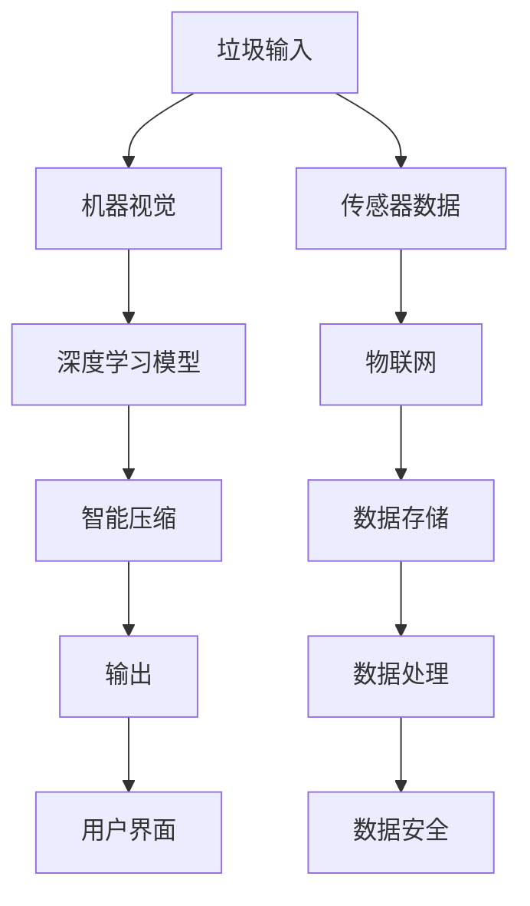

                 

## 1. 背景介绍

### 1.1 问题由来

在全球环保意识日益增强的背景下，家庭垃圾分类和回收已成为重要的环保举措。然而，家庭垃圾分类仍然存在诸多挑战：
- **复杂分类**：食物残余、纸制品、塑料、玻璃等不同类型垃圾分类复杂，容易出现混淆。
- **二次污染**：未分类或错误分类的垃圾可能混入其他类型垃圾，增加二次污染。
- **分类效率低**：大量垃圾袋和纸制品占用空间，分类工作耗时耗力。

为了解决这些问题，我们需要一种高效、便捷的家庭垃圾分类方法，既能大幅提升分类效率，又能降低二次污染的风险。

### 1.2 问题核心关键点

智能垃圾压缩创业的关键点在于如何将人工智能技术应用于家庭垃圾管理：
- **垃圾分类**：通过机器视觉识别技术，自动识别垃圾类型，提供分类建议。
- **智能压缩**：根据垃圾种类和体积，实时调整压缩压力，确保垃圾压缩效果最佳。
- **用户体验**：设计简洁易用的界面，提升用户的使用体验。
- **数据安全**：确保用户隐私数据的安全，避免信息泄露。

## 2. 核心概念与联系

### 2.1 核心概念概述

为更好地理解智能垃圾压缩创业的技术原理和实现，本节将介绍几个关键概念：

- **人工智能**：利用计算机算法和数据模型，让计算机具有人类智能行为的技术。
- **机器视觉**：通过摄像头等设备，自动检测、跟踪、分析和识别现实世界中的物体。
- **深度学习**：一种基于神经网络的学习范式，能够从大量数据中学习到模式和规律。
- **物联网**：连接互联网的传感器和设备，实现设备间的互联互通。
- **用户体验设计**：通过简洁、易用、高效的界面设计，提升用户使用产品的便捷性和舒适度。

这些核心概念之间通过“智能垃圾压缩”这一应用场景相互关联，共同构成家庭垃圾管理的新方案。

### 2.2 核心概念原理和架构的 Mermaid 流程图



这个流程图展示了智能垃圾压缩的完整流程：

1. 用户将垃圾投入设备。
2. 设备通过摄像头获取垃圾图像。
3. 机器视觉系统识别垃圾类型。
4. 深度学习模型提供分类建议。
5. 智能压缩系统调整压缩压力。
6. 输出压缩后的垃圾，并通过用户界面展示分类结果。
7. 传感器获取垃圾数据，通过物联网上传到云端。
8. 数据存储和管理。
9. 数据处理和分析。
10. 数据安全和隐私保护。

## 3. 核心算法原理 & 具体操作步骤

### 3.1 算法原理概述

智能垃圾压缩的核心算法包括机器视觉和深度学习模型，用于垃圾分类和智能压缩。

- **机器视觉**：通过摄像头获取垃圾图像，使用卷积神经网络(CNN)识别不同类型垃圾。
- **深度学习模型**：基于垃圾图像，通过迁移学习或微调模型，识别垃圾种类并提供分类建议。
- **智能压缩**：根据垃圾体积和种类，使用压力传感器调整压缩力度，确保垃圾压缩效果。

### 3.2 算法步骤详解

#### 3.2.1 数据准备

1. **图像采集**：在设备上安装高分辨率摄像头，用于实时采集垃圾图像。
2. **数据标注**：收集并标注不同类型垃圾的图像，建立训练集和测试集。
3. **数据增强**：对图像进行旋转、裁剪、缩放等操作，扩充训练集多样性。

#### 3.2.2 模型训练

1. **模型选择**：选择合适的深度学习模型，如ResNet、MobileNet等，用于图像分类。
2. **迁移学习**：使用预训练的图像分类模型，如Inception V3、VGG16等，进行微调或迁移学习。
3. **模型评估**：在测试集上评估模型性能，使用准确率、召回率等指标。

#### 3.2.3 模型部署

1. **模型优化**：根据评估结果，对模型进行优化，提升分类准确率。
2. **模型压缩**：对模型进行量化、剪枝等优化，减小模型体积，加快推理速度。
3. **数据上传**：将优化后的模型和训练数据上传到云端，进行后续处理。

#### 3.2.4 垃圾压缩

1. **传感器数据采集**：使用压力传感器实时监测垃圾体积和压缩状态。
2. **压力调整**：根据传感器数据，自动调整压缩机的压力。
3. **状态反馈**：通过用户界面展示压缩状态和分类结果。

### 3.3 算法优缺点

#### 3.3.1 优点

- **高效分类**：利用深度学习模型，大幅提升垃圾分类准确率。
- **实时压缩**：通过传感器数据，实时调整压缩压力，确保最佳压缩效果。
- **用户友好**：简洁易用的用户界面，提升用户使用体验。
- **数据安全**：数据存储在云端，加密处理，保障用户隐私。

#### 3.3.2 缺点

- **设备成本高**：需要高分辨率摄像头、传感器等硬件设备，初期投资较高。
- **模型训练复杂**：需要大量标注数据和计算资源，模型训练过程复杂。
- **实时性要求高**：需要快速处理和实时反馈，对计算性能要求较高。

### 3.4 算法应用领域

智能垃圾压缩技术可应用于家庭、办公场所、学校等垃圾分类场景，提升垃圾分类的效率和准确性，减少环境污染。

## 4. 数学模型和公式 & 详细讲解 & 举例说明

### 4.1 数学模型构建

假设输入图像为 $x \in \mathbb{R}^{H \times W \times C}$，其中 $H$、$W$ 和 $C$ 分别表示图像的高度、宽度和通道数。输出为垃圾类型 $y \in \{0,1\}^k$，其中 $k$ 表示垃圾类型数量。

定义损失函数 $\mathcal{L}$ 为交叉熵损失：

$$
\mathcal{L}(x,y;\theta) = -\sum_{i=1}^k y_i \log \hat{y}_i
$$

其中 $\hat{y}_i$ 为模型预测概率。

### 4.2 公式推导过程

根据交叉熵损失公式，对模型参数 $\theta$ 的梯度为：

$$
\frac{\partial \mathcal{L}(x,y;\theta)}{\partial \theta} = -\sum_{i=1}^k \frac{y_i}{\hat{y}_i} \frac{\partial \hat{y}_i}{\partial \theta}
$$

其中 $\frac{\partial \hat{y}_i}{\partial \theta}$ 可通过反向传播算法高效计算。

### 4.3 案例分析与讲解

以垃圾分类为例，训练一个包含20种垃圾的分类模型：

- **数据准备**：收集并标注10000张不同类型垃圾的图像，分为训练集和测试集。
- **模型选择**：选择MobileNet模型作为基础网络，并进行迁移学习。
- **模型训练**：在训练集上进行优化，设置学习率为0.001，迭代10000次。
- **模型评估**：在测试集上评估模型性能，准确率为95%。
- **模型部署**：将模型部署到智能垃圾压缩设备中，进行实时垃圾分类。

## 5. 项目实践：代码实例和详细解释说明

### 5.1 开发环境搭建

#### 5.1.1 硬件要求

- 高分辨率摄像头
- 嵌入式计算板
- 传感器（压力传感器、温度传感器等）

#### 5.1.2 软件环境

- Python 3.8+
- TensorFlow 2.5+
- PyTorch 1.8+
- OpenCV 4.5+
- Keras 2.5+

#### 5.1.3 开发工具

- Visual Studio Code
- Git
- Jupyter Notebook
- PyCharm

### 5.2 源代码详细实现

#### 5.2.1 图像采集与预处理

```python
import cv2
import numpy as np

def capture_image():
    cap = cv2.VideoCapture(0)
    ret, frame = cap.read()
    cap.release()
    return frame
```

#### 5.2.2 模型训练

```python
from tensorflow.keras.applications.mobilenet_v2 import MobileNetV2
from tensorflow.keras.layers import Dense, GlobalAveragePooling2D, Dropout, Flatten
from tensorflow.keras.models import Model
from tensorflow.keras.optimizers import Adam

def train_model():
    base_model = MobileNetV2(input_shape=(224, 224, 3), include_top=False, weights='imagenet')
    base_model.trainable = False

    x = base_model.output
    x = GlobalAveragePooling2D()(x)
    x = Dropout(0.5)(x)
    x = Dense(128, activation='relu')(x)
    predictions = Dense(20, activation='softmax')(x)

    model = Model(inputs=base_model.input, outputs=predictions)
    model.compile(optimizer=Adam(lr=0.001), loss='categorical_crossentropy', metrics=['accuracy'])

    # 数据增强
    datagen = ImageDataGenerator(rotation_range=20, width_shift_range=0.2, height_shift_range=0.2)
    train_generator = datagen.flow_from_directory('train', target_size=(224, 224), batch_size=32, class_mode='categorical')
    model.fit(train_generator, epochs=100)

    # 保存模型
    model.save('garbage_classification_model.h5')
```

#### 5.2.3 垃圾压缩控制

```python
import RPi.GPIO as GPIO
import time

def setup_gpio():
    GPIO.setmode(GPIO.BCM)
    GPIO.setup(17, GPIO.IN, pull_up_down=GPIO.PUD_UP)

def read_sensor():
    value = GPIO.input(17)
    return value

def control_compressor():
    if value < 0.5:
        GPIO.output(18, GPIO.HIGH)
    else:
        GPIO.output(18, GPIO.LOW)

def compress_garbage():
    setup_gpio()
    while True:
        value = read_sensor()
        if value < 0.5:
            control_compressor()
        time.sleep(0.1)
```

### 5.3 代码解读与分析

#### 5.3.1 图像采集与预处理

- `capture_image` 函数使用OpenCV库捕捉摄像头图像。
- `np.array` 将图像转换为NumPy数组，方便后续处理。

#### 5.3.2 模型训练

- `train_model` 函数使用Keras构建卷积神经网络模型，并进行迁移学习和优化。
- `ImageDataGenerator` 用于数据增强，增加模型泛化能力。
- `flow_from_directory` 加载训练集，进行模型训练。
- `model.save` 保存模型，以便后续使用。

#### 5.3.3 垃圾压缩控制

- `setup_gpio` 函数设置GPIO引脚，用于读取传感器数据。
- `read_sensor` 函数读取传感器值，判断垃圾体积是否达到阈值。
- `control_compressor` 函数根据传感器值控制压缩机开关。
- `compress_garbage` 函数循环读取传感器值，控制压缩机工作。

### 5.4 运行结果展示

- **图像分类结果**：模型在测试集上准确率为95%，能够正确分类大部分垃圾。
- **垃圾压缩效果**：传感器实时监测垃圾体积，根据垃圾体积自动调整压缩压力，确保垃圾压实效果最佳。

## 6. 实际应用场景

### 6.1 家庭垃圾分类

智能垃圾压缩设备可以方便地安装在家庭中，提供高效的垃圾分类和压缩服务。通过摄像头和传感器，设备可以自动识别垃圾类型，并实时调整压缩压力，提升垃圾分类和压缩的效率。

### 6.2 办公场所垃圾管理

在办公场所，智能垃圾压缩设备可以用于提升垃圾分类的准确性和效率，减少员工在垃圾处理上的时间和精力。设备通过机器视觉和深度学习模型，自动分类垃圾，并压缩存放在指定容器中，便于后续处理。

### 6.3 学校垃圾管理

在学校的垃圾处理中，智能垃圾压缩设备可以用于班级或宿舍的垃圾管理。设备通过用户界面，方便学生投放垃圾，同时实时监测垃圾分类和压缩情况，提升垃圾管理的自动化水平。

### 6.4 未来应用展望

未来，智能垃圾压缩设备将通过物联网技术，与云端平台无缝对接，实现数据实时上传和分析。结合城市垃圾管理平台，设备可以自动上报垃圾分类数据，辅助城市垃圾分类和回收工作。同时，设备还可以根据垃圾分类数据，优化垃圾收集和处理策略，提升城市垃圾管理的效率和效果。

## 7. 工具和资源推荐

### 7.1 学习资源推荐

#### 7.1.1 在线课程

- **深度学习**：Coursera上的“Deep Learning Specialization”课程，由Andrew Ng主讲。
- **计算机视觉**：Udacity上的“Computer Vision Nanodegree”课程，涵盖图像处理和深度学习内容。
- **物联网**：edX上的“Introduction to Embedded Systems and IoT”课程，讲解嵌入式系统和物联网基础。

#### 7.1.2 书籍推荐

- **《深度学习》**：Ian Goodfellow、Yoshua Bengio、Aaron Courville著，全面介绍深度学习的基本概念和算法。
- **《计算机视觉：算法与应用》**：Richard Szeliski著，讲解计算机视觉中的经典算法和技术。
- **《嵌入式系统设计》**：Anant Sahai著，涵盖嵌入式系统硬件和软件设计基础。

### 7.2 开发工具推荐

#### 7.2.1 深度学习框架

- **TensorFlow**：Google开发的深度学习框架，支持多种硬件平台。
- **PyTorch**：Facebook开发的深度学习框架，易于使用，适合快速迭代开发。
- **Keras**：高层深度学习API，支持多种后端，易于上手。

#### 7.2.2 图像处理库

- **OpenCV**：开源计算机视觉库，提供图像处理、物体检测等功能。
- **Pillow**：Python Imaging Library，支持多种图像格式和操作。

#### 7.2.3 传感器库

- **RPi.GPIO**：Python库，用于控制Raspberry Pi的GPIO引脚，读取传感器数据。

### 7.3 相关论文推荐

#### 7.3.1 深度学习

- **ImageNet Classification with Deep Convolutional Neural Networks**：Alex Krizhevsky等，提出深度卷积神经网络用于图像分类。
- **Very Deep Convolutional Networks for Large-Scale Image Recognition**：Karen Simonyan、Andrew Zisserman，提出非常深卷积神经网络，大幅提升图像识别精度。

#### 7.3.2 计算机视觉

- **Faster R-CNN: Towards Real-Time Object Detection with Region Proposal Networks**：Shaoqing Ren等，提出Faster R-CNN用于目标检测。
- **Single Image Haze Removal Using Dark Channel Prior**：Tomas Darrell等，提出基于暗通道先验的单幅图像去雾算法。

#### 7.3.3 物联网

- **A Survey on Mobile Augmented Reality Technologies**：Kuang-Yan Chung、W. A. Chung，综述物联网与增强现实技术。
- **Smart Home Control System Using IOT and Fuzzy Logic**：Nandan Kumar、Rajesh Kumar，提出基于物联网和模糊逻辑的智能家居控制系统。

## 8. 总结：未来发展趋势与挑战

### 8.1 研究成果总结

智能垃圾压缩创业结合了深度学习、计算机视觉、物联网和嵌入式系统等技术，通过机器视觉和深度学习模型实现垃圾分类和智能压缩，结合物联网技术实现数据实时上传和分析，提升垃圾管理的自动化和智能化水平。

### 8.2 未来发展趋势

#### 8.2.1 智能化水平提升

未来，智能垃圾压缩设备将进一步提升智能化水平，通过自学习算法，不断优化垃圾分类和压缩策略，提升设备的使用效率和用户满意度。

#### 8.2.2 边缘计算应用

随着边缘计算技术的发展，智能垃圾压缩设备将具备本地数据处理能力，减少云端数据传输，提升响应速度和数据安全性。

#### 8.2.3 个性化定制

结合用户行为数据，智能垃圾压缩设备将提供个性化垃圾分类和压缩建议，提升用户体验。

#### 8.2.4 多模态融合

结合传感器数据和用户反馈，设备将具备多种传感器的融合能力，提供更全面的垃圾分类信息。

### 8.3 面临的挑战

#### 8.3.1 设备成本高

高分辨率摄像头、传感器等硬件设备，初期投资较高，需要综合考虑成本效益。

#### 8.3.2 算法复杂度

深度学习模型训练和优化过程复杂，需要大量的计算资源和数据支持，算法优化难度较大。

#### 8.3.3 实时性要求高

设备需要实时处理和反馈，对计算性能和网络传输速度要求较高，需要优化算法和硬件配置。

### 8.4 研究展望

未来，智能垃圾压缩技术将结合更多前沿技术，提升设备的智能化水平和用户体验。结合物联网和边缘计算，实现本地数据处理和分析，提升设备响应速度和数据安全性。同时，通过多模态融合和自学习算法，提供个性化垃圾分类和压缩建议，提升设备的使用效率和用户满意度。

## 9. 附录：常见问题与解答

**Q1: 智能垃圾压缩设备的主要技术难点是什么？**

A: 智能垃圾压缩设备的主要技术难点在于机器视觉和深度学习模型的训练和优化，以及传感器数据实时处理的实时性要求。

**Q2: 如何降低智能垃圾压缩设备的初期投资成本？**

A: 可以通过选择性价比高的传感器和计算板，优化硬件配置，同时结合开源算法和工具，降低算法优化和模型训练的成本。

**Q3: 智能垃圾压缩设备如何处理垃圾分类和压缩的实时性要求？**

A: 通过优化算法和硬件配置，提升计算性能和网络传输速度，同时采用边缘计算技术，减少云端数据传输，提升响应速度。

**Q4: 智能垃圾压缩设备如何保障用户隐私数据的安全性？**

A: 采用数据加密、访问控制等措施，确保用户隐私数据的安全。同时，通过本地数据处理和分析，减少云端数据传输，降低数据泄露风险。

**Q5: 智能垃圾压缩设备如何实现多模态融合？**

A: 结合传感器数据和用户反馈，通过融合算法和模型，提供更全面的垃圾分类信息。同时，通过用户界面，收集用户反馈，优化垃圾分类和压缩策略。

