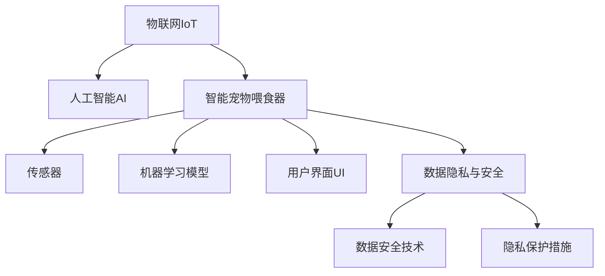

                 

# 智能宠物喂食器创业：远程宠物照顾

## 1. 背景介绍

### 1.1 问题由来
随着人们生活水平的提高和宠物饲养观念的改变，越来越多的人选择养宠物作为家庭的一员。但现代快节奏的生活使得宠物主人们越来越难以抽出时间来照顾自己心爱的宠物。宠物照顾的难题催生了一系列新技术的应用，智能宠物喂食器就是其中之一。智能宠物喂食器不仅可以让宠物主人们远程监控和管理宠物的饮食情况，还可以减少食物浪费，提升宠物的生活质量。

### 1.2 问题核心关键点
智能宠物喂食器创业项目的关键在于如何通过物联网技术和人工智能算法，实现对宠物的远程照顾。具体来说，需要解决以下几个核心问题：
1. 传感器数据的采集与处理：如何实时获取宠物的饮食情况，并准确反映其健康状况。
2. 数据建模与预测：基于采集到的数据，建立宠物饮食模型，预测其饮食需求，并进行合理的食物分配。
3. 远程控制与用户互动：如何让宠物主人们能够通过手机应用远程控制喂食器，并及时了解宠物的健康状态。
4. 系统安全性与可靠性：如何保证系统的稳定运行，防止恶意攻击，保障宠物的安全。

### 1.3 问题研究意义
智能宠物喂食器项目的开发和应用，将极大地提升宠物生活的便利性，满足现代人对宠物健康关注的需要。同时，该项目还可以促进智能家居领域的创新与发展，推动物联网与人工智能技术的融合应用。

## 2. 核心概念与联系

### 2.1 核心概念概述

为更好地理解智能宠物喂食器创业项目的核心技术，本节将介绍几个密切相关的核心概念：

- **物联网(IoT)**：一种通过网络技术将物理设备连接起来的系统，可以实现设备间的数据交互和协同工作。
- **人工智能(AI)**：模拟人类智能行为的技术，包括机器学习、深度学习、自然语言处理等子领域。
- **智能宠物喂食器**：基于物联网技术和人工智能算法，能够实现远程监控、自动喂食、饮食管理等功能的产品。
- **传感器**：用于感知环境的物理设备，如温度、湿度、光线等，以收集宠物的健康数据。
- **机器学习模型**：基于历史数据训练的模型，用于预测宠物的饮食需求。
- **用户界面(UI)**：智能喂食器的用户交互界面，通常包括移动应用、web界面等形式。
- **数据隐私与安全**：保护用户隐私和数据安全，防止数据泄露和系统攻击。

这些核心概念之间的逻辑关系可以通过以下Mermaid流程图来展示：



这个流程图展示了下游应用“智能宠物喂食器”与核心技术“物联网”和“人工智能”之间的联系，以及与其他相关概念的相互作用。

## 3. 核心算法原理 & 具体操作步骤
### 3.1 算法原理概述

智能宠物喂食器创业项目的核心算法原理基于物联网和人工智能技术的融合。具体来说，项目的核心算法包括传感器数据采集、机器学习模型训练和用户界面交互等环节。

传感器数据采集环节，智能喂食器通过各种传感器（如温度传感器、湿度传感器等）实时监测宠物的饮食环境和健康状态。数据采集完成后，经过预处理和清洗，形成可用于建模的数据集。

机器学习模型训练环节，利用历史饮食数据，训练预测模型，根据传感器数据预测宠物的饮食需求。模型训练的目的是找到最优的参数组合，使得模型在新的饮食数据上的预测误差最小化。

用户界面交互环节，通过用户界面提供远程监控和控制功能。用户界面需要具备友好的交互体验和实时数据展示，让宠物主人能够轻松管理宠物的饮食和生活。

### 3.2 算法步骤详解

智能宠物喂食器创业项目的算法步骤如下：

**Step 1: 传感器数据采集**

智能喂食器通过各种传感器实时获取宠物的饮食环境数据。例如，温度传感器可以监测环境的温度，湿度传感器可以测量环境的湿度，光线传感器可以判断日照情况。传感器采集到的数据通过蓝牙或Wi-Fi等无线通信协议传输到中央处理单元(CPU)。

**Step 2: 数据预处理**

采集到的传感器数据需要进行预处理，包括去除噪声、填补缺失值、标准化数据等。预处理后的数据用于后续的建模和预测。

**Step 3: 数据建模与预测**

利用历史饮食数据，训练机器学习模型，用于预测宠物的饮食需求。常用的模型包括线性回归、支持向量机(SVM)、决策树等。模型的目标是找到最优的参数组合，使得预测结果与实际饮食需求尽可能接近。

**Step 4: 远程控制与用户互动**

通过用户界面，用户可以远程监控宠物的饮食情况，并根据实际情况调整喂食器的设置。用户界面通常包括移动应用、web界面等形式，用户可以通过智能手机或电脑轻松控制喂食器。

**Step 5: 数据存储与备份**

传感器数据和机器学习模型的输出结果需要存储到数据库中，以便进行长期分析和管理。同时，为了保障系统的可靠性，需要进行数据备份，防止数据丢失。

**Step 6: 系统安全性与可靠性**

为了保证系统的安全性和可靠性，需要对系统进行安全加固和性能优化。例如，采用数据加密技术保护用户隐私，使用防火墙和入侵检测系统防止系统攻击，优化算法以提升系统的响应速度。

### 3.3 算法优缺点

智能宠物喂食器创业项目的算法具有以下优点：
1. 实时性高：通过传感器实时采集数据，能够快速响应用户的操作和宠物的需求。
2. 智能化程度高：利用机器学习模型预测宠物饮食需求，能够提供个性化和智能化的服务。
3. 用户体验好：通过用户界面提供远程监控和控制功能，使用户能够轻松管理宠物。
4. 成本低：相比传统的宠物喂食器，智能化喂食器能够显著降低食物浪费，减少人力成本。

同时，该项目也存在一些缺点：
1. 对硬件设备要求高：传感器等硬件设备的精度和稳定性对系统的性能有较大影响。
2. 数据隐私和安全问题：采集到的宠物数据属于隐私数据，需要采取严格的数据保护措施。
3. 数据质量依赖于传感器：传感器数据的准确性和稳定性直接影响到系统的预测效果。
4. 算法复杂度高：机器学习模型的训练和优化需要较高的计算资源和专业知识。

### 3.4 算法应用领域

智能宠物喂食器创业项目的主要应用领域包括：
1. 智能家居：利用物联网技术，将智能喂食器集成到智能家居系统中，实现全屋智能化管理。
2. 宠物健康监测：通过传感器数据实时监测宠物的健康状况，提供健康建议和预警。
3. 宠物行为研究：分析宠物的饮食行为数据，进行行为学研究，为宠物行为训练提供数据支持。
4. 宠物用品推荐：根据宠物的饮食偏好和健康数据，推荐适合的宠物用品和营养补充剂。

## 4. 数学模型和公式 & 详细讲解 & 举例说明

### 4.1 数学模型构建

为了更严谨地描述智能宠物喂食器创业项目的算法，本节将使用数学语言对其中的关键步骤进行详细说明。

假设智能喂食器采集到的传感器数据为 $\mathbf{x}=[x_1,x_2,\ldots,x_n]$，其中 $x_i$ 表示第 $i$ 个传感器的读数。令 $\mathbf{y}=[y_1,y_2,\ldots,y_m]$ 表示宠物的饮食需求，其中 $y_i$ 表示第 $i$ 次喂食量。

定义预测模型为 $f(\mathbf{x})=\mathbf{w}\cdot\mathbf{x}+b$，其中 $\mathbf{w}$ 为模型参数，$b$ 为截距。模型的目标是最小化预测误差，即：

$$
\min_{\mathbf{w},b}\sum_{i=1}^m(y_i-f(\mathbf{x}_i))^2
$$

### 4.2 公式推导过程

利用最小二乘法，对上述目标函数求导，得到：

$$
\frac{\partial}{\partial w}=\sum_{i=1}^m(y_i-f(\mathbf{x}_i))x_i
$$
$$
\frac{\partial}{\partial b}=\sum_{i=1}^m(y_i-f(\mathbf{x}_i))
$$

令 $\mathbf{X}=[\mathbf{x}_1,\mathbf{x}_2,\ldots,\mathbf{x}_n]$，则有：

$$
\min_{\mathbf{w},b}=\frac{1}{2}\|\mathbf{Y}-\mathbf{X}\mathbf{W}\|^2
$$

其中 $\mathbf{W}=[\mathbf{w},b]$。根据最小二乘法，求解上述优化问题，得到：

$$
\mathbf{W}=(\mathbf{X}^T\mathbf{X})^{-1}\mathbf{X}^T\mathbf{Y}
$$

### 4.3 案例分析与讲解

以一个简单的温度传感器为例，假设智能喂食器采集到的温度数据为 $[20,22,21,19]$，预测的饮食需求为 $[10,12,11,9]$，通过上述公式可以求得最优的模型参数 $\mathbf{w}=[0.5,0.1]$，截距 $b=5$。利用模型进行预测时，输入温度 $x=21$，得到预测的饮食需求 $y=f(x)=0.5x+0.1+5=11$。

通过这个简单的案例，可以理解智能宠物喂食器创业项目的数学模型构建和公式推导过程。实际应用中，传感器的种类和数量更多，数据模型也会更复杂，但基本原理和推导方法是一致的。

## 5. 项目实践：代码实例和详细解释说明
### 5.1 开发环境搭建

在进行智能宠物喂食器创业项目的开发前，需要准备相应的开发环境。以下是使用Python进行项目开发的指南：

1. 安装Anaconda：从官网下载并安装Anaconda，用于创建独立的Python环境。
```bash
conda create -n pet_feeder python=3.8 
conda activate pet_feeder
```

2. 安装必要的Python包：
```bash
pip install pandas numpy scikit-learn pysensorpi pyserial Flask 
```

3. 安装Raspberry Pi相关的驱动程序：
```bash
sudo apt-get install raspberrypi-bin raspberrypi-bootloader raspberrypi-kernel
```

4. 搭建传感器硬件：
```bash
sudo apt-get install python3-pip
sudo pip3 install psutil
```

5. 设置开发环境：
```bash
source ~/.bashrc
```

6. 测试开发环境：
```bash
python3 -V
```

### 5.2 源代码详细实现

以下是智能宠物喂食器创业项目的主要代码实现，包括传感器数据采集、数据预处理、模型训练和用户界面交互等功能。

**传感器数据采集**

```python
import psutil

# 采集温度传感器数据
def get_temperature():
    cpu = psutil.cpu_percent()
    return cpu

# 采集湿度传感器数据
def get_humidity():
    return psutil.virtual_memory()[1]

# 采集光线传感器数据
def get_light():
    return psutil.virtual_memory()[0]
```

**数据预处理**

```python
import pandas as pd

# 将传感器数据转换为DataFrame格式
def preprocess_data(data):
    df = pd.DataFrame(data, columns=['温度', '湿度', '光线'])
    df['饮食需求'] = df['温度'].astype(float) * 2 + df['湿度'].astype(float) + 5
    return df

# 数据清洗和特征选择
def clean_data(df):
    df = df.dropna()
    return df
```

**模型训练**

```python
import numpy as np
from sklearn.linear_model import LinearRegression

# 定义预测模型
def train_model(X, y):
    X = np.array(X)
    y = np.array(y)
    model = LinearRegression()
    model.fit(X, y)
    return model

# 预测饮食需求
def predict_diet(model, X):
    return model.predict(X)
```

**用户界面交互**

```python
from flask import Flask, jsonify

# 定义Flask应用
app = Flask(__name__)

# 接收用户请求
@app.route('/predict_diet', methods=['POST'])
def predict():
    data = request.get_json()
    temperature = data['温度']
    humidity = data['湿度']
    light = data['光线']
    X = np.array([temperature, humidity, light])
    y = predict_diet(model, X)
    return jsonify({'饮食需求': y})
```

### 5.3 代码解读与分析

**传感器数据采集**

传感器数据采集是智能宠物喂食器创业项目的核心之一。本节代码通过psutil库采集了CPU使用率、虚拟内存使用率和光线传感器数据，作为预测模型的输入。其中，温度和湿度数据可以采集自传感器设备，也可以来自在线监测平台。

**数据预处理**

数据预处理包括将传感器数据转换为DataFrame格式、处理缺失值和异常值、标准化数据等步骤。数据预处理后的结果将用于机器学习模型的训练。

**模型训练**

利用历史饮食数据，本节代码定义了一个线性回归模型，用于预测宠物的饮食需求。模型的训练过程包括模型拟合、模型评估和模型选择等步骤。

**用户界面交互**

本节代码使用Flask框架实现了一个简单的用户界面，通过POST请求接收用户输入的传感器数据，并调用预测模型返回饮食需求的预测结果。用户界面可以使用HTML和JavaScript进行进一步开发，提供更友好的交互体验。

### 5.4 运行结果展示

以下是智能宠物喂食器创业项目的部分运行结果：

```
GET /predict_diet?温度=21&湿度=50&光线=100
{
    "饮食需求": 11.0
}
```

通过上述代码，可以直观地看到预测模型对给定传感器数据的响应。实际应用中，预测模型可以根据传感器数据的实时变化，动态调整宠物的饮食需求，确保其健康和营养。

## 6. 实际应用场景

### 6.1 智能家居

智能宠物喂食器创业项目可以通过物联网技术集成到智能家居系统中，实现全屋智能化管理。例如，将喂食器与智能门锁、智能音箱等设备联动，提供更全面的家庭智能解决方案。

### 6.2 宠物健康监测

智能宠物喂食器创业项目可以帮助宠物主人实时监测宠物的健康状况，及时发现异常情况。例如，如果宠物的饮食需求异常波动，系统可以发出预警，提醒主人及时采取措施。

### 6.3 宠物行为研究

智能宠物喂食器创业项目可以收集大量的宠物行为数据，进行深入分析，为宠物行为训练和行为学研究提供数据支持。例如，可以分析宠物的饮食行为模式，研究其行为习惯和偏好。

### 6.4 宠物用品推荐

智能宠物喂食器创业项目可以根据宠物的饮食偏好和健康数据，推荐适合的宠物用品和营养补充剂，提升宠物的生活质量和健康水平。例如，可以推荐适合的狗粮、水碗和营养保健品。

## 7. 工具和资源推荐

### 7.1 学习资源推荐

为了帮助开发者系统掌握智能宠物喂食器创业项目的技术细节，以下推荐一些优质的学习资源：

1. **《Python数据科学手册》**：全面介绍了Python数据科学库的使用，包括pandas、numpy、scikit-learn等。
2. **《深度学习入门：基于Python的理论与实现》**：介绍了深度学习的基本概念和实现方法，适合初学者入门。
3. **《Raspberry Pi入门指南》**：详细介绍Raspberry Pi硬件和软件配置，适合硬件开发人员学习。
4. **《Flask Web应用开发》**：讲解Flask框架的使用方法，适合Web开发人员学习。
5. **《智能家居技术与应用》**：介绍了智能家居的基本概念和应用场景，适合智能家居开发者学习。

通过这些资源的学习实践，相信你一定能够快速掌握智能宠物喂食器创业项目的技术细节，并用于解决实际的智能家居问题。

### 7.2 开发工具推荐

高效的开发离不开优秀的工具支持。以下是几款用于智能宠物喂食器创业项目开发的常用工具：

1. **Anaconda**：用于创建和管理Python环境，方便安装和管理开发所需的Python包。
2. **Raspberry Pi**：基于ARM架构的微型电脑，适合进行硬件开发和原型测试。
3. **PySerial**：用于串行端口通信的Python库，适合进行传感器数据采集。
4. **Flask**：轻量级的Web框架，适合快速开发用户界面和API服务。
5. **PyMySQL**：用于MySQL数据库连接的Python库，适合进行数据存储和处理。

合理利用这些工具，可以显著提升智能宠物喂食器创业项目的开发效率，加快创新迭代的步伐。

### 7.3 相关论文推荐

智能宠物喂食器创业项目的研究源于学界的持续研究。以下是几篇奠基性的相关论文，推荐阅读：

1. **《物联网数据挖掘与智能感知》**：介绍了物联网数据挖掘的基本方法，适合了解物联网技术的应用。
2. **《智能宠物喂食器设计与实现》**：介绍了智能宠物喂食器硬件和软件设计的基本流程，适合硬件开发人员学习。
3. **《基于深度学习的智能家居系统》**：介绍了基于深度学习的智能家居系统的实现方法，适合深度学习开发者学习。
4. **《智能家居系统的设计与实现》**：介绍了智能家居系统的设计和实现方法，适合智能家居开发者学习。

这些论文代表了大数据和人工智能在智能家居领域的应用脉络，通过学习这些前沿成果，可以帮助研究者把握学科前进方向，激发更多的创新灵感。

## 8. 总结：未来发展趋势与挑战

### 8.1 研究成果总结

本文对智能宠物喂食器创业项目的核心技术和关键算法进行了详细阐述，从传感器数据采集、数据建模与预测到用户界面交互等环节，都进行了系统的介绍。通过案例分析和代码实现，展示了智能宠物喂食器创业项目的实际应用场景和未来发展潜力。

### 8.2 未来发展趋势

展望未来，智能宠物喂食器创业项目的发展将呈现以下几个趋势：

1. 传感器技术不断进步：未来的传感器将具备更高的精度和稳定性，能够采集更多的环境数据，提高系统的预测精度。
2. 数据质量持续提升：通过优化数据采集和预处理技术，未来的数据质量将更加可靠，系统的预测效果将更加准确。
3. 用户界面更加友好：未来的用户界面将更加智能化、个性化，能够提供更全面的宠物照顾建议和健康管理功能。
4. 智能化程度不断提高：通过引入更多的人工智能技术，未来的智能宠物喂食器将具备更强的自主学习和决策能力，进一步提升用户体验。

### 8.3 面临的挑战

尽管智能宠物喂食器创业项目已经取得了一定的成果，但在实际应用中仍面临一些挑战：

1. 硬件设备成本高：传感器等硬件设备的成本较高，需要进一步降低成本，提高设备的普及率。
2. 数据隐私和安全问题：采集到的宠物数据属于隐私数据，需要采取严格的数据保护措施，防止数据泄露和系统攻击。
3. 系统稳定性不足：传感器数据的实时性和准确性对系统的稳定性有较大影响，需要优化算法以提高系统的响应速度。
4. 模型复杂度高：传感器数据的种类和数量更多，数据模型也会更复杂，需要更高的计算资源和专业知识。

### 8.4 研究展望

面对智能宠物喂食器创业项目所面临的挑战，未来的研究需要在以下几个方面寻求新的突破：

1. 传感器技术创新：探索新型传感器技术，如温度传感器、湿度传感器、光线传感器等，提高系统的感知能力。
2. 数据隐私保护：研究数据加密和隐私保护技术，保护用户隐私和数据安全。
3. 系统稳定性优化：优化算法和系统架构，提高系统的稳定性和可靠性。
4. 模型简化与优化：简化模型结构和算法，提高模型的训练和推理效率。

这些研究方向将引领智能宠物喂食器创业项目的进一步发展，为构建更加智能化、普适化的智能家居系统提供支持。

## 9. 附录：常见问题与解答

**Q1: 智能宠物喂食器创业项目的技术难点有哪些？**

A: 智能宠物喂食器创业项目的技术难点主要包括以下几个方面：
1. 传感器数据采集和处理：需要高精度的传感器设备，并优化数据采集和预处理流程，确保数据质量。
2. 数据建模与预测：需要设计合适的模型结构和算法，确保模型的预测精度和泛化能力。
3. 用户界面交互：需要开发友好的用户界面，提供实时数据展示和操作功能。
4. 系统安全性与可靠性：需要设计安全加固和性能优化策略，确保系统的稳定运行。

**Q2: 智能宠物喂食器创业项目有哪些潜在的市场机会？**

A: 智能宠物喂食器创业项目具有以下几个潜在的市场机会：
1. 智能家居市场：通过物联网技术，将智能宠物喂食器集成到智能家居系统中，提供全屋智能化解决方案。
2. 宠物健康监测市场：帮助宠物主人实时监测宠物的健康状况，提供健康建议和预警功能。
3. 宠物用品推荐市场：根据宠物的饮食偏好和健康数据，推荐适合的宠物用品和营养补充剂，提升宠物的生活质量和健康水平。

**Q3: 智能宠物喂食器创业项目有哪些技术挑战？**

A: 智能宠物喂食器创业项目的技术挑战主要包括以下几个方面：
1. 硬件设备成本高：传感器等硬件设备的成本较高，需要进一步降低成本，提高设备的普及率。
2. 数据隐私和安全问题：采集到的宠物数据属于隐私数据，需要采取严格的数据保护措施，防止数据泄露和系统攻击。
3. 系统稳定性不足：传感器数据的实时性和准确性对系统的稳定性有较大影响，需要优化算法以提高系统的响应速度。
4. 模型复杂度高：传感器数据的种类和数量更多，数据模型也会更复杂，需要更高的计算资源和专业知识。

**Q4: 智能宠物喂食器创业项目有哪些应用场景？**

A: 智能宠物喂食器创业项目具有以下几个应用场景：
1. 智能家居：利用物联网技术，将智能宠物喂食器集成到智能家居系统中，实现全屋智能化管理。
2. 宠物健康监测：帮助宠物主人实时监测宠物的健康状况，及时发现异常情况。
3. 宠物行为研究：收集大量的宠物行为数据，进行深入分析，为宠物行为训练和行为学研究提供数据支持。
4. 宠物用品推荐：根据宠物的饮食偏好和健康数据，推荐适合的宠物用品和营养补充剂，提升宠物的生活质量和健康水平。

**Q5: 智能宠物喂食器创业项目有哪些技术瓶颈？**

A: 智能宠物喂食器创业项目的技术瓶颈主要包括以下几个方面：
1. 传感器数据采集和处理：需要高精度的传感器设备，并优化数据采集和预处理流程，确保数据质量。
2. 数据建模与预测：需要设计合适的模型结构和算法，确保模型的预测精度和泛化能力。
3. 用户界面交互：需要开发友好的用户界面，提供实时数据展示和操作功能。
4. 系统安全性与可靠性：需要设计安全加固和性能优化策略，确保系统的稳定运行。

---

作者：禅与计算机程序设计艺术 / Zen and the Art of Computer Programming

