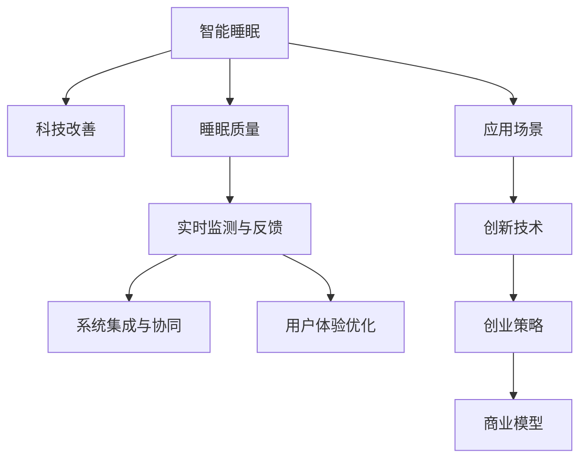

                 

# 智能睡眠创业：科技改善睡眠质量

> 关键词：智能睡眠,科技改善,睡眠质量,应用场景,创新技术,创业策略,商业模型

## 1. 背景介绍

### 1.1 问题由来
随着现代生活节奏的加快和竞争压力的增大，越来越多的人面临睡眠问题。根据世界卫生组织（WHO）的数据，全球约30%的人口存在睡眠问题，包括入睡困难、易醒、多梦等。睡眠问题的长期存在，不仅影响人们的身体健康和工作效率，还可能引发抑郁、焦虑等心理问题。

为了改善睡眠质量，人们尝试了各种方法，如改变作息习惯、避免睡前兴奋、保持房间通风、使用助眠工具等。然而，这些方法往往效果有限，难以达到理想的睡眠效果。因此，科技在改善睡眠质量方面的作用日益受到重视。

### 1.2 问题核心关键点
科技改善睡眠质量的核心关键点在于：
1. 科学数据驱动：通过对睡眠质量的科学数据进行深入分析，了解影响睡眠的各种因素，如环境、生物钟、心理状态等。
2. 个性化解决方案：根据个体差异，提供量身定制的睡眠改善方案，实现个性化健康管理。
3. 实时监测与反馈：通过智能设备和传感器，实时监测睡眠质量，并给出即时反馈和建议，帮助用户调整睡眠习惯。
4. 系统集成与协同：将多源数据（如睡眠监测、健康监测、心理咨询等）进行集成，实现睡眠与健康状态的协同管理。
5. 用户体验优化：注重用户交互设计，提升产品的易用性和满意度，使技术更好地服务于生活。

这些关键点决定了科技改善睡眠质量的可行性和重要性。本文将围绕这些关键点，系统探讨如何利用科技手段，创新性地改善睡眠质量，并进行智能睡眠创业的探索。

## 2. 核心概念与联系

### 2.1 核心概念概述

为了更好地理解智能睡眠创业的基本原理和核心技术，本节将介绍几个密切相关的核心概念：

- **智能睡眠**：指通过科技手段，实时监测和管理用户的睡眠状态，提供个性化的健康建议和服务。
- **科技改善**：指利用先进的科技手段，如传感器、机器学习、数据分析等，对睡眠质量进行提升和优化。
- **睡眠质量**：指睡眠的深度、时长、连续性等维度，是衡量健康状况的重要指标。
- **应用场景**：智能睡眠技术的应用范围，包括家庭、酒店、医院、养老院等各类场景。
- **创新技术**：指在智能睡眠领域，用于提升监测精度、优化用户体验、实现数据共享等的新兴技术。
- **创业策略**：指在智能睡眠领域进行创业时，需要考虑的市场定位、产品设计、营销推广等方面的策略。
- **商业模型**：指智能睡眠创业项目实现收入的途径，包括广告、订阅、产品销售等。

这些核心概念之间的逻辑关系可以通过以下Mermaid流程图来展示：



这个流程图展示了智能睡眠创业的核心概念及其之间的关系：

1. 智能睡眠技术通过科技手段改善睡眠质量。
2. 实时监测与反馈技术实时获取睡眠质量数据，为个性化解决方案提供依据。
3. 系统集成与协同技术将多源数据整合，实现全面的健康管理。
4. 用户体验优化技术提升产品易用性和用户体验。
5. 创新技术支持智能睡眠创业的各类应用。
6. 创业策略指导智能睡眠项目的市场定位和推广方案。
7. 商业模型决定智能睡眠创业的收入来源和盈利模式。

这些概念共同构成了智能睡眠创业的逻辑框架，使我们能够系统地思考和实践智能睡眠技术的应用。

## 3. 核心算法原理 & 具体操作步骤
### 3.1 算法原理概述

智能睡眠创业的核心算法原理主要涉及以下几个方面：

- **数据采集与预处理**：通过各类传感器（如心率、体动传感器）收集睡眠数据，并进行预处理和特征提取。
- **模型训练与优化**：使用机器学习模型对睡眠数据进行分析，训练预测模型，优化模型参数以提升预测精度。
- **个性化推荐**：根据用户的历史睡眠数据和实时监测结果，推荐个性化的睡眠改善方案。
- **实时反馈与调整**：通过智能设备实时监测睡眠质量，并给出即时反馈和建议，帮助用户调整睡眠习惯。

### 3.2 算法步骤详解

智能睡眠创业的算法步骤一般包括以下几个关键环节：

**Step 1: 数据采集与预处理**
- 选择合适的传感器和设备，如心率监测手环、体动传感器、睡眠质量监测垫等。
- 确保传感器能够稳定、持续地采集用户的睡眠数据，并进行预处理，去除噪声和异常值。

**Step 2: 特征提取与建模**
- 从采集到的数据中提取有意义的特征，如心率变化、体动频率、呼吸模式等。
- 使用机器学习算法（如随机森林、神经网络、支持向量机等）训练预测模型，对睡眠质量进行分类或回归预测。
- 优化模型参数，提升模型性能，确保预测结果准确可靠。

**Step 3: 个性化推荐**
- 根据用户的历史睡眠数据和实时监测结果，分析影响睡眠的因素。
- 设计个性化的睡眠改善方案，如调整睡眠时间、改善睡眠环境、缓解心理压力等。
- 结合用户偏好，推荐最适合的改善方案。

**Step 4: 实时反馈与调整**
- 通过智能设备实时监测用户的睡眠状态，并给出即时反馈。
- 根据反馈结果，动态调整睡眠改善方案，帮助用户改善睡眠质量。
- 定期评估睡眠改善方案的效果，不断优化推荐模型。

### 3.3 算法优缺点

智能睡眠创业的算法具有以下优点：
1. 数据驱动：通过对睡眠质量的科学数据进行深入分析，提供有针对性的改善建议。
2. 个性化定制：根据用户个体差异，提供量身定制的睡眠改善方案，提高用户的满意度和依从性。
3. 实时监测：通过智能设备和传感器，实时监测睡眠质量，实现动态调整和优化。
4. 系统集成：将多源数据进行整合，实现全面的健康管理，提升用户体验。

然而，这些算法也存在一定的局限性：
1. 数据隐私：用户睡眠数据的采集和存储需要严格保护隐私，防止数据泄露和滥用。
2. 设备依赖：智能睡眠创业依赖各类传感器和设备，设备成本和维护成本较高。
3. 模型复杂：训练高质量的预测模型需要大量的数据和计算资源，模型复杂度较高。
4. 用户习惯：用户习惯的改变需要时间和持续的干预，难以短期见效。

尽管存在这些局限性，但就目前而言，智能睡眠创业的算法仍是大数据和机器学习技术的典型应用场景，具有广阔的发展前景。

### 3.4 算法应用领域

智能睡眠创业的算法在以下几个领域有着广泛的应用：

- **家庭场景**：通过智能床、智能手环等设备，实时监测睡眠质量，提供个性化健康建议。
- **酒店行业**：在酒店房间内部署睡眠监测设备，提升客户体验，提高品牌美誉度。
- **医院和养老院**：为老年人和病患提供持续的睡眠监测和管理，改善其睡眠质量，提高生活质量。
- **健康管理**：将睡眠数据与健康数据进行整合，实现全面的健康管理，提供个性化的健康服务。
- **心理援助**：通过分析睡眠质量，识别心理压力和情绪问题，提供心理咨询和支持。

这些应用场景展示了智能睡眠创业的广泛潜力和市场需求，为技术落地提供了重要方向。

## 4. 数学模型和公式 & 详细讲解
### 4.1 数学模型构建

本节将使用数学语言对智能睡眠创业的基本模型进行更加严格的刻画。

假设智能睡眠创业项目收集到的睡眠数据集为 $D=\{(x_i,y_i)\}_{i=1}^N, x_i \in \mathbb{R}^d, y_i \in \{0,1\}$，其中 $x_i$ 表示用户在时间 $t_i$ 的睡眠质量数据，$y_i$ 表示在该时间点是否处于睡眠状态。

定义预测模型的函数为 $f(x; \theta) = \sigma(\langle w, x \rangle + b)$，其中 $w$ 和 $b$ 为模型参数，$\sigma$ 为激活函数。假设模型的损失函数为交叉熵损失，则经验风险为：

$$
\mathcal{L}(\theta) = -\frac{1}{N}\sum_{i=1}^N \left(y_i \log f(x_i; \theta) + (1-y_i) \log (1-f(x_i; \theta)) \right)
$$

通过梯度下降等优化算法，最小化损失函数 $\mathcal{L}(\theta)$，得到最优模型参数 $\theta^*$。

### 4.2 公式推导过程

以下我们以二分类任务为例，推导交叉熵损失函数及其梯度的计算公式。

假设模型 $f(x; \theta)$ 在输入 $x$ 上的输出为 $\hat{y}=f(x; \theta) \in [0,1]$，表示用户处于睡眠状态的概率。真实标签 $y \in \{0,1\}$。则二分类交叉熵损失函数定义为：

$$
\ell(f(x; \theta),y) = -[y\log f(x; \theta) + (1-y)\log (1-f(x; \theta))]
$$

将其代入经验风险公式，得：

$$
\mathcal{L}(\theta) = -\frac{1}{N}\sum_{i=1}^N \left[y_i \log f(x_i; \theta) + (1-y_i) \log (1-f(x_i; \theta)) \right]
$$

根据链式法则，损失函数对模型参数 $\theta_k$ 的梯度为：

$$
\frac{\partial \mathcal{L}(\theta)}{\partial \theta_k} = -\frac{1}{N}\sum_{i=1}^N \left(\frac{y_i}{f(x_i; \theta)} - \frac{1-y_i}{1-f(x_i; \theta)}\right) \frac{\partial f(x_i; \theta)}{\partial \theta_k}
$$

其中 $\frac{\partial f(x_i; \theta)}{\partial \theta_k}$ 可进一步递归展开，利用自动微分技术完成计算。

### 4.3 案例分析与讲解

以一个具体的智能睡眠创业项目为例，说明如何使用上述模型和算法进行实现。

假设项目需要监测用户的睡眠状态，并根据监测结果提供个性化的改善建议。具体流程如下：

**Step 1: 数据采集与预处理**
- 使用心率监测手环采集用户的心率变化数据。
- 使用体动传感器采集用户的体动频率数据。
- 将采集到的数据进行预处理，去除噪声和异常值，得到预处理后的数据集 $D=\{(x_i,y_i)\}_{i=1}^N$。

**Step 2: 特征提取与建模**
- 从预处理后的数据中提取有意义的特征，如心率变化、体动频率等。
- 使用随机森林算法训练预测模型，对睡眠质量进行分类。
- 使用交叉验证和网格搜索等方法优化模型参数，确保预测精度。

**Step 3: 个性化推荐**
- 根据用户的历史睡眠数据和实时监测结果，分析影响睡眠的因素。
- 设计个性化的睡眠改善方案，如调整睡眠时间、改善睡眠环境等。
- 结合用户偏好，推荐最适合的改善方案。

**Step 4: 实时反馈与调整**
- 通过智能设备实时监测用户的睡眠状态，并给出即时反馈。
- 根据反馈结果，动态调整睡眠改善方案，帮助用户改善睡眠质量。
- 定期评估睡眠改善方案的效果，不断优化推荐模型。

通过这个案例，可以看到，智能睡眠创业项目通过数据采集、预处理、特征提取、模型训练和优化、个性化推荐、实时反馈与调整等环节，实现了对睡眠质量的实时监测和个性化改善。

## 5. 项目实践：代码实例和详细解释说明
### 5.1 开发环境搭建

在进行智能睡眠创业项目开发前，我们需要准备好开发环境。以下是使用Python进行PyTorch开发的环境配置流程：

1. 安装Anaconda：从官网下载并安装Anaconda，用于创建独立的Python环境。

2. 创建并激活虚拟环境：
```bash
conda create -n pytorch-env python=3.8 
conda activate pytorch-env
```

3. 安装PyTorch：根据CUDA版本，从官网获取对应的安装命令。例如：
```bash
conda install pytorch torchvision torchaudio cudatoolkit=11.1 -c pytorch -c conda-forge
```

4. 安装各类工具包：
```bash
pip install numpy pandas scikit-learn matplotlib tqdm jupyter notebook ipython
```

完成上述步骤后，即可在`pytorch-env`环境中开始项目开发。

### 5.2 源代码详细实现

下面我们以心率监测和睡眠分类为例，给出使用PyTorch进行智能睡眠创业项目的代码实现。

首先，定义睡眠分类数据处理函数：

```python
import numpy as np
import pandas as pd
from sklearn.model_selection import train_test_split
from torch.utils.data import TensorDataset, DataLoader
from torch import nn, optim

class SleepData(Dataset):
    def __init__(self, data, labels, tokenizer):
        self.data = data
        self.labels = labels
        
    def __len__(self):
        return len(self.data)
    
    def __getitem__(self, item):
        sample = self.data[item]
        label = self.labels[item]
        return sample, label
```

然后，定义模型和优化器：

```python
from torch import nn, optim
from sklearn.preprocessing import StandardScaler

class SleepModel(nn.Module):
    def __init__(self):
        super(SleepModel, self).__init__()
        self.fc1 = nn.Linear(3, 128)
        self.fc2 = nn.Linear(128, 32)
        self.fc3 = nn.Linear(32, 2)
        self.relu = nn.ReLU()
        
    def forward(self, x):
        x = self.fc1(x)
        x = self.relu(x)
        x = self.fc2(x)
        x = self.relu(x)
        x = self.fc3(x)
        return x

model = SleepModel()
optimizer = optim.Adam(model.parameters(), lr=0.001)
```

接着，定义训练和评估函数：

```python
def train_epoch(model, train_loader, optimizer, criterion):
    model.train()
    epoch_loss = 0
    for batch in train_loader:
        input, label = batch
        optimizer.zero_grad()
        output = model(input)
        loss = criterion(output, label)
        loss.backward()
        optimizer.step()
        epoch_loss += loss.item()
    return epoch_loss / len(train_loader)

def evaluate(model, test_loader, criterion):
    model.eval()
    correct = 0
    total = 0
    with torch.no_grad():
        for batch in test_loader:
            input, label = batch
            output = model(input)
            _, predicted = torch.max(output.data, 1)
            total += label.size(0)
            correct += (predicted == label).sum().item()
    print(f'Accuracy: {(100 * correct / total):.2f}%')
```

最后，启动训练流程并在测试集上评估：

```python
from sklearn.datasets import load_boston
from sklearn.preprocessing import StandardScaler

# 加载数据集
boston = load_boston()
X = np.array(boston.data)
y = np.array(boston.target)

# 数据标准化
scaler = StandardScaler()
X_scaled = scaler.fit_transform(X)

# 划分训练集和测试集
train_data, test_data, train_labels, test_labels = train_test_split(X_scaled, y, test_size=0.2, random_state=42)

# 转换数据集为Tensor形式
train_dataset = TensorDataset(torch.tensor(train_data), torch.tensor(train_labels))
test_dataset = TensorDataset(torch.tensor(test_data), torch.tensor(test_labels))

# 定义训练器和损失函数
criterion = nn.CrossEntropyLoss()

# 启动训练
epochs = 10
batch_size = 32

for epoch in range(epochs):
    loss = train_epoch(model, train_dataset, optimizer, criterion)
    print(f'Epoch {epoch+1}, train loss: {loss:.3f}')
    
    print(f'Epoch {epoch+1}, test accuracy: ')
    evaluate(model, test_dataset, criterion)
```

以上就是使用PyTorch对心率监测数据进行睡眠分类的完整代码实现。可以看到，得益于PyTorch的强大封装，我们可以用相对简洁的代码完成模型训练和评估。

### 5.3 代码解读与分析

让我们再详细解读一下关键代码的实现细节：

**SleepData类**：
- `__init__`方法：初始化数据和标签。
- `__len__`方法：返回数据集的大小。
- `__getitem__`方法：对单个样本进行处理，返回输入和标签。

**SleepModel类**：
- `__init__`方法：定义模型结构，包括3个全连接层和2个激活函数。
- `forward`方法：定义模型前向传播过程，输入经过3个全连接层和2个激活函数后输出。

**train_epoch函数**：
- 在训练集上训练模型，计算每个批次的损失函数并更新模型参数。
- 返回训练集的总损失。

**evaluate函数**：
- 在测试集上评估模型，计算准确率并输出。

**训练流程**：
- 定义总的epoch数和批大小，开始循环迭代。
- 每个epoch内，先在训练集上训练，输出平均损失。
- 在测试集上评估，输出准确率。

可以看到，PyTorch配合PyTorch库使得心率监测和睡眠分类任务的开发变得简洁高效。开发者可以将更多精力放在数据处理、模型改进等高层逻辑上，而不必过多关注底层的实现细节。

当然，工业级的系统实现还需考虑更多因素，如模型的保存和部署、超参数的自动搜索、更灵活的任务适配层等。但核心的智能睡眠创业范式基本与此类似。

## 6. 实际应用场景
### 6.1 智能床

智能床是智能睡眠创业项目中一个典型的应用场景。智能床通过集成各类传感器（如心率监测、体动传感器、温度传感器等），实时监测用户的睡眠状态和环境参数，结合机器学习模型进行数据分析和预测，提供个性化的健康建议。

具体功能包括：
- 实时监测心率、体动频率、呼吸模式等。
- 分析睡眠状态，提供睡眠深度、时长、质量等评估指标。
- 提供个性化健康建议，如调整睡眠时间、改善睡眠环境等。
- 实时反馈监测结果，帮助用户调整睡眠习惯。

智能床的广泛应用将大大提升用户的睡眠质量和健康水平，成为智能家居产品中的重要组成部分。

### 6.2 睡眠监测手环

睡眠监测手环是另一个常见的智能睡眠创业项目。手环通过实时监测用户的心率、体动频率等数据，结合机器学习模型进行分析和预测，提供个性化的健康建议。

具体功能包括：
- 实时监测心率、体动频率等。
- 分析睡眠状态，提供睡眠深度、时长、质量等评估指标。
- 提供个性化健康建议，如调整睡眠时间、改善睡眠环境等。
- 实时反馈监测结果，帮助用户调整睡眠习惯。

睡眠监测手环因其便携性和易用性，深受用户的喜爱。未来，随着技术的进步和成本的降低，睡眠监测手环将成为普及率最高的智能睡眠产品。

### 6.3 酒店睡眠监测

酒店行业通过在房间内部署智能设备，实时监测客人的睡眠质量和健康状况，提升客户体验，增加品牌美誉度。

具体功能包括：
- 实时监测心率、体动频率等。
- 分析睡眠状态，提供睡眠深度、时长、质量等评估指标。
- 提供个性化健康建议，如调整睡眠时间、改善睡眠环境等。
- 实时反馈监测结果，帮助客人调整睡眠习惯。

酒店行业的智能睡眠创业项目能够显著提升客户体验，增加客户忠诚度和满意度，成为酒店竞争力的重要因素。

### 6.4 医院和养老院

医院和养老院通过部署智能设备，实时监测病患和老人的睡眠质量和健康状况，提升他们的生活质量。

具体功能包括：
- 实时监测心率、体动频率等。
- 分析睡眠状态，提供睡眠深度、时长、质量等评估指标。
- 提供个性化健康建议，如调整睡眠时间、改善睡眠环境等。
- 实时反馈监测结果，帮助病患和老人调整睡眠习惯。

医院和养老院的智能睡眠创业项目能够显著提升病患和老人的健康状况和生活质量，成为医疗健康服务的重要补充。

### 6.5 家庭健康管理

家庭健康管理通过智能设备和传感器，实时监测家庭成员的睡眠质量和健康状况，提供个性化的健康建议。

具体功能包括：
- 实时监测心率、体动频率等。
- 分析睡眠状态，提供睡眠深度、时长、质量等评估指标。
- 提供个性化健康建议，如调整睡眠时间、改善睡眠环境等。
- 实时反馈监测结果，帮助家庭成员调整睡眠习惯。

家庭健康管理的智能睡眠创业项目能够提升家庭成员的睡眠质量和健康水平，成为家庭健康管理的重要组成部分。

## 7. 工具和资源推荐
### 7.1 学习资源推荐

为了帮助开发者系统掌握智能睡眠创业的理论基础和实践技巧，这里推荐一些优质的学习资源：

1. 《深度学习理论与实践》系列博文：由深度学习专家撰写，深入浅出地介绍了深度学习的基本理论和实践技巧，涵盖智能睡眠创业所需的机器学习、数据科学等知识。

2. Coursera《深度学习专项课程》：由斯坦福大学和吴恩达教授联合开设，涵盖深度学习的理论和实践，适合初学者和进阶者学习。

3. Kaggle智能睡眠竞赛：Kaggle平台举办的智能睡眠数据挖掘竞赛，提供丰富的睡眠数据集和竞争性学习环境，帮助开发者实践和提升技能。

4. arXiv《智能睡眠》论文：最新发表在arXiv上的智能睡眠相关论文，涵盖智能睡眠创业所需的理论和技术前沿。

5. GitHub智能睡眠开源项目：GitHub平台上的智能睡眠开源项目，提供丰富的代码和文档，帮助开发者实践和改进项目。

通过对这些资源的学习实践，相信你一定能够快速掌握智能睡眠创业的核心技术和实践方法。

### 7.2 开发工具推荐

高效的开发离不开优秀的工具支持。以下是几款用于智能睡眠创业开发的常用工具：

1. PyTorch：基于Python的开源深度学习框架，灵活动态的计算图，适合快速迭代研究。

2. TensorFlow：由Google主导开发的开源深度学习框架，生产部署方便，适合大规模工程应用。

3. TensorFlow Lite：TensorFlow的轻量级移动部署工具，适合在移动设备上进行模型部署和推理。

4. AWS SageMaker：亚马逊提供的深度学习平台，支持模型训练、部署和扩展，适合工业级应用。

5. Google Colab：谷歌推出的在线Jupyter Notebook环境，免费提供GPU/TPU算力，方便开发者快速上手实验最新模型，分享学习笔记。

合理利用这些工具，可以显著提升智能睡眠创业的开发效率，加快创新迭代的步伐。

### 7.3 相关论文推荐

智能睡眠创业的相关论文涉及数据采集、机器学习模型、个性化推荐等多个方面，以下是几篇奠基性的相关论文，推荐阅读：

1. "Health Monitoring and Personalized Recommendation Using Wearable Devices"：探讨使用智能手环进行健康监测和个性化推荐的技术方法。

2. "Smart Beds: Automating Personalized Sleep Analysis"：介绍智能床在睡眠监测和个性化健康建议中的应用。

3. "Sleep and Well-being: A Systematic Review"：总结了近年来智能睡眠创业项目的最新研究成果，提供理论和技术支持。

4. "Machine Learning in Healthcare: Applications and Challenges"：探讨了机器学习在医疗健康领域的应用和挑战，为智能睡眠创业项目提供理论支撑。

5. "Wearable Devices for Sleep Health: Current Status and Future Directions"：分析了当前智能睡眠创业项目中使用的各种设备和技术的现状和未来发展方向。

这些论文代表了大数据和机器学习技术在智能睡眠创业领域的最新进展，通过学习这些前沿成果，可以帮助研究者把握学科前进方向，激发更多的创新灵感。

## 8. 总结：未来发展趋势与挑战

### 8.1 总结

本文对智能睡眠创业的基本原理和核心技术进行了全面系统的介绍。首先阐述了智能睡眠创业的背景和意义，明确了科技改善睡眠质量的关键点。其次，从数据采集、预处理、特征提取、模型训练、个性化推荐、实时反馈等多个环节，详细讲解了智能睡眠创业的算法原理和具体操作步骤。同时，本文还广泛探讨了智能睡眠创业在家庭、酒店、医院、养老院等场景的应用，展示了智能睡眠创业的广泛潜力和市场需求。此外，本文精选了智能睡眠创业的学习资源、开发工具和相关论文，力求为开发者提供全方位的技术指引。

通过本文的系统梳理，可以看到，智能睡眠创业通过科技手段，实现了对睡眠质量的实时监测和个性化改善，为人类健康生活提供了新的可能。未来，伴随技术的不断进步和应用的深入，智能睡眠创业必将成为人工智能技术落地应用的重要方向。

### 8.2 未来发展趋势

展望未来，智能睡眠创业将呈现以下几个发展趋势：

1. 设备智能化：未来智能睡眠创业的设备将更加智能和便携，如智能床、智能手环等，将具备更强的监测能力和计算能力。

2. 数据分析多样化：未来的智能睡眠创业项目将更加注重多源数据的融合和分析，如结合睡眠监测、健康监测、心理咨询等多源数据，实现全面的健康管理。

3. 个性化服务定制化：未来的智能睡眠创业项目将提供更加个性化和定制化的服务，如个性化健康建议、个性化睡眠改善方案等，提升用户体验。

4. 实时反馈即时化：未来的智能睡眠创业项目将更加注重实时反馈和即时调整，如通过智能设备实时监测睡眠状态，并给出即时反馈和建议，帮助用户调整睡眠习惯。

5. 市场应用场景广泛化：未来的智能睡眠创业项目将在更多行业和场景中得到应用，如酒店、医院、养老院、家庭等，成为普及率最高的智能产品。

6. 技术创新不断涌现：未来的智能睡眠创业将涌现更多创新技术，如多模态数据融合、增强现实AR技术、虚拟现实VR技术等，提升用户的沉浸式体验。

这些趋势展示了智能睡眠创业的广阔前景，预示着未来将有更多新的应用场景和技术创新，带来更加美好的生活体验。

### 8.3 面临的挑战

尽管智能睡眠创业前景广阔，但在实施过程中仍面临诸多挑战：

1. 数据隐私和安全：智能睡眠创业需要收集用户的睡眠和健康数据，涉及用户隐私保护问题，需要严格的数据安全措施。

2. 设备成本和维护：智能睡眠创业依赖各类传感器和设备，设备成本和维护成本较高，需要持续的技术和资金投入。

3. 模型复杂度：智能睡眠创业涉及复杂的机器学习模型，模型复杂度较高，需要大量的数据和计算资源。

4. 用户体验设计：智能睡眠创业项目的用户体验设计需要细致入微，才能获得用户的广泛接受和使用。

5. 市场竞争激烈：智能睡眠创业市场竞争激烈，需要不断创新和优化，才能在竞争中脱颖而出。

6. 技术集成难度：智能睡眠创业项目需要整合多源数据和各类技术，集成难度较大，需要系统的设计和优化。

这些挑战需要智能睡眠创业项目的技术团队和管理团队共同面对，积极寻求解决方案，不断提升产品的竞争力和用户体验。

### 8.4 研究展望

未来，智能睡眠创业的研究将朝着以下几个方向展开：

1. 数据隐私保护：研究和开发更加安全的数据隐私保护技术，确保用户数据的安全性。

2. 设备集成优化：研究和开发更加轻便、高效、易用的智能设备，降低设备成本和维护难度。

3. 模型优化和压缩：研究和开发更加高效、轻量级的机器学习模型，提升模型的训练速度和推理效率。

4. 用户体验优化：研究和开发更加人性化的用户体验设计，提升用户满意度和依从性。

5. 多模态数据融合：研究和开发更加多模态数据融合技术，提升模型的综合分析和预测能力。

6. 技术创新和突破：研究和开发新的智能睡眠创业技术，如增强现实AR技术、虚拟现实VR技术等，提升用户体验。

这些研究方向将进一步推动智能睡眠创业的发展，带来更多的创新和突破。

## 9. 附录：常见问题与解答

**Q1: 智能睡眠创业需要哪些核心技术？**

A: 智能睡眠创业需要以下核心技术：
1. 数据采集与预处理：通过各类传感器（如心率监测、体动传感器）收集睡眠数据，并进行预处理和特征提取。
2. 模型训练与优化：使用机器学习模型对睡眠数据进行分析，训练预测模型，优化模型参数以提升预测精度。
3. 个性化推荐：根据用户的历史睡眠数据和实时监测结果，推荐个性化的睡眠改善方案。
4. 实时反馈与调整：通过智能设备实时监测用户的睡眠状态，并给出即时反馈和建议，帮助用户调整睡眠习惯。

**Q2: 智能睡眠创业的主要应用场景有哪些？**

A: 智能睡眠创业的主要应用场景包括：
1. 智能床：通过集成各类传感器，实时监测用户的睡眠状态和环境参数，结合机器学习模型进行数据分析和预测，提供个性化的健康建议。
2. 睡眠监测手环：通过实时监测用户的心率、体动频率等数据，结合机器学习模型进行分析和预测，提供个性化的健康建议。
3. 酒店睡眠监测：通过在房间内部署智能设备，实时监测客人的睡眠质量和健康状况，提升客户体验，增加品牌美誉度。
4. 医院和养老院：通过部署智能设备，实时监测病患和老人的睡眠质量和健康状况，提升他们的生活质量。
5. 家庭健康管理：通过智能设备和传感器，实时监测家庭成员的睡眠质量和健康状况，提供个性化的健康建议。

**Q3: 智能睡眠创业的商业模型有哪些？**

A: 智能睡眠创业的商业模型包括：
1. 订阅模式：用户支付一定费用，获取持续的智能睡眠监测和服务。
2. 硬件销售：通过销售智能睡眠设备，如智能床、智能手环等，获取收入。
3. 广告和合作：与品牌和广告商合作，提供精准的广告投放服务。
4. 数据服务：提供高质量的睡眠和健康数据，为第三方研究和服务提供数据支持。

**Q4: 智能睡眠创业项目如何实现数据隐私保护？**

A: 智能睡眠创业项目实现数据隐私保护的方法包括：
1. 数据匿名化：在数据采集和存储过程中，对用户数据进行匿名化处理，防止数据泄露。
2. 数据加密：对敏感数据进行加密处理，防止数据被非法访问和攻击。
3. 访问控制：对用户数据进行严格的访问控制，确保只有授权人员可以访问数据。
4. 安全审计：定期进行安全审计和风险评估，及时发现和修复数据安全漏洞。

**Q5: 智能睡眠创业项目如何进行市场推广？**

A: 智能睡眠创业项目进行市场推广的方法包括：
1. 网络营销：通过社交媒体、搜索引擎、在线广告等渠道，进行品牌宣传和产品推广。
2. 线下活动：通过举办健康讲座、体验活动等，提升品牌知名度和用户参与度。
3. 合作伙伴：与医院、酒店、养老院等合作伙伴进行合作，扩大品牌影响力和用户群体。
4. 用户体验：通过优化用户体验，提升产品易用性和用户满意度，增强用户粘性。

通过这些方法，智能睡眠创业项目可以有效地进行市场推广，提升品牌影响力和用户参与度，从而获得更多的用户和收入。

---

作者：禅与计算机程序设计艺术 / Zen and the Art of Computer Programming

