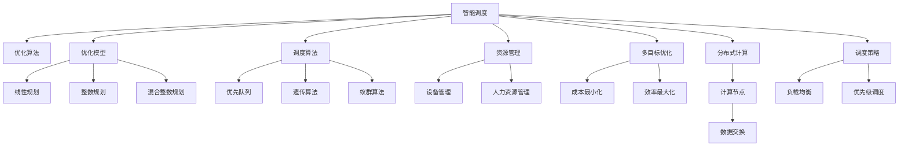

                 

# 智能调度系统在资源分配中的应用

> 关键词：智能调度, 资源分配, 优化算法, 优化模型, 调度算法, 资源管理, 多目标优化, 分布式计算, 调度策略

## 1. 背景介绍

### 1.1 问题由来

在当今数字化和自动化驱动的经济中，资源的有效分配是提高生产效率和降低运营成本的关键。无论是企业内部的设备、人力资源还是云资源，优化资源分配的过程对于提高运营效率和降低成本至关重要。传统的人工资源分配方法由于效率低下、信息不对称等原因，难以应对复杂多变的场景需求，因而亟需引入智能调度和优化技术。

### 1.2 问题核心关键点

智能调度系统的核心在于如何通过算法和模型，动态优化资源分配，以最大化系统效率和满意度。它涉及到任务调度、优先级管理、资源分配、负载均衡等多个环节。核心关键点包括：

- **资源种类与数量**：包括设备、人员、资金等多种资源，每种资源的数量和类型都会影响调度的复杂度。
- **任务特征与需求**：任务的时间窗口、执行顺序、执行条件、执行要求等特征将影响调度的规则和策略。
- **调度算法与模型**：算法的选择和设计直接决定了调度的效率和效果。
- **约束条件与目标**：例如任务完成的期限、资源使用的上限等约束条件，以及最大效益、最小成本、最小延迟等优化目标。

### 1.3 问题研究意义

研究智能调度系统在资源分配中的应用，对于提升企业的运营效率、优化资源配置具有重要意义：

1. **提高生产效率**：通过智能调度，合理分配和利用资源，减少空闲时间，提高设备利用率和人员效率。
2. **降低运营成本**：优化资源分配，减少不必要的能源和人力资源浪费，降低运营成本。
3. **增强应急能力**：在突发事件中，快速调配资源，提高系统的应急响应速度。
4. **适应变化**：能够动态调整调度策略，适应不同时期、不同环境下的需求变化。
5. **支持业务创新**：通过智能调度和优化，支持企业业务模式创新，提升竞争力。

## 2. 核心概念与联系

### 2.1 核心概念概述

为更好地理解智能调度系统的原理，本文将介绍几个核心概念：

- **智能调度**：通过算法和模型，动态地优化资源分配和任务调度，以最大化系统效益和满意度。
- **优化算法**：用于求解资源分配问题的数学和计算方法，包括贪心算法、动态规划、遗传算法等。
- **优化模型**：基于数学模型的求解过程，如线性规划、整数规划、混合整数规划等。
- **调度算法**：用于任务调度的算法，如优先队列调度、遗传算法调度、蚁群算法调度等。
- **资源管理**：对设备、人力资源等资源的获取、分配和释放过程进行管理。
- **多目标优化**：在资源分配中，需要同时考虑多个优化目标，如成本最小化、效率最大化等。
- **分布式计算**：在多节点环境下，优化资源分配和任务调度，以提高计算效率。
- **调度策略**：根据不同的业务场景和资源特征，设计适合的调度策略，如负载均衡、优先级调度等。

这些概念之间的关系可以通过以下Mermaid流程图来展示：



这个流程图展示了智能调度系统的主要组成部分及其关系：

1. 智能调度作为核心，通过优化算法、优化模型、调度算法等，动态优化资源分配。
2. 优化算法和优化模型提供数学和计算手段，求解资源分配问题。
3. 调度算法用于任务调度，优化任务执行顺序和资源分配。
4. 资源管理涉及设备的获取、分配和释放过程，确保资源的有效利用。
5. 多目标优化考虑多个优化目标，如成本、效率等，提升系统整体效益。
6. 分布式计算通过多节点协同计算，提高计算效率。
7. 调度策略根据不同的业务需求，设计合适的调度规则。

## 3. 核心算法原理 & 具体操作步骤

### 3.1 算法原理概述

智能调度系统的核心在于通过算法和模型，动态优化资源分配和任务调度，以最大化系统效益和满意度。其算法原理主要包括以下几个方面：

- **任务建模**：将任务特征转化为数学表达式，构建优化问题。
- **算法选择**：根据任务特点选择合适的优化算法，如线性规划、整数规划、遗传算法等。
- **模型求解**：使用优化算法求解数学模型，找到最优解或近似解。
- **调度执行**：将求解结果转化为实际调度决策，实现资源分配和任务调度。

### 3.2 算法步骤详解

基于智能调度系统的算法原理，以下是一个典型的智能调度算法步骤：

1. **任务建模**：
   - 收集任务的时间、资源、优先级等特征数据。
   - 构建数学模型，将任务特征转化为优化问题。
   - 定义优化目标，如成本最小化、效率最大化等。

2. **算法选择**：
   - 根据任务特征选择合适的优化算法，如整数规划、遗传算法、蚁群算法等。
   - 设计算法参数，如种群大小、迭代次数、交叉率等。

3. **模型求解**：
   - 使用选定的优化算法，对模型进行求解。
   - 优化算法逐步迭代，找到最优解或近似解。
   - 求解过程中，实时监控约束条件和优化目标，调整算法参数。

4. **调度执行**：
   - 将求解结果转化为具体的资源分配和任务调度决策。
   - 在分布式系统中，多节点协同执行调度决策。
   - 实时监控系统状态，动态调整调度策略。

5. **评估与优化**：
   - 对调度结果进行评估，根据系统效益和满意度进行优化。
   - 分析调度结果，发现潜在问题，优化算法和模型。

### 3.3 算法优缺点

智能调度系统在优化资源分配方面具有以下优点：

- **高效性**：通过算法和模型，动态优化资源分配，提高系统效率。
- **自适应性**：能够适应不同场景的需求，动态调整调度策略。
- **灵活性**：适用于多种资源类型和任务特征。
- **可扩展性**：分布式计算架构，支持大规模系统。

同时，也存在一些缺点：

- **复杂性**：优化算法和模型设计复杂，需要专业知识。
- **计算成本高**：求解过程可能涉及高计算复杂度，需要高性能计算资源。
- **实时性问题**：在高负载环境下，调度决策的实时性可能受到影响。
- **数据质量问题**：调度结果依赖于数据质量，数据错误或噪声可能影响结果。
- **系统稳定性**：调度系统可能受到环境因素的影响，如硬件故障、网络中断等。

### 3.4 算法应用领域

智能调度系统在多个领域都有广泛的应用，包括但不限于：

- **云计算**：动态分配和调度云资源，提高计算效率。
- **制造行业**：优化生产设备调度，提高生产效率。
- **交通系统**：优化交通流量和路网资源分配，缓解交通压力。
- **电力系统**：优化电力资源的分配和调度，提高电力系统稳定性和效率。
- **医疗系统**：优化医疗资源分配，提高患者就医效率。
- **物流系统**：优化货物运输和仓储资源，提高物流效率。
- **金融系统**：优化金融交易和资金分配，提高金融系统效率和安全性。

## 4. 数学模型和公式 & 详细讲解 & 举例说明

### 4.1 数学模型构建

智能调度系统通常使用数学模型来描述资源分配问题。以下是一个典型资源分配问题的数学模型：

$$
\min_{x} \sum_{i=1}^n c_i x_i \\
\text{s.t.} \begin{cases}
\sum_{i=1}^n x_i = d \\
0 \leq x_i \leq D_i, i=1,2,\ldots,n
\end{cases}
$$

其中 $x_i$ 表示资源 $i$ 的分配量，$c_i$ 表示资源 $i$ 的成本，$d$ 表示总需求，$D_i$ 表示资源 $i$ 的最大容量。

### 4.2 公式推导过程

以云资源调度的最小成本流问题为例，以下是一个基于线性规划的云资源调度的数学模型：

$$
\min_{x} \sum_{i=1}^n c_i x_i \\
\text{s.t.} \begin{cases}
\sum_{i=1}^n x_i = d \\
0 \leq x_i \leq D_i, i=1,2,\ldots,n
\end{cases}
$$

该模型中，$x_i$ 表示资源 $i$ 的分配量，$c_i$ 表示资源 $i$ 的成本，$d$ 表示总需求，$D_i$ 表示资源 $i$ 的最大容量。

将问题转化为线性规划形式，得到以下优化问题：

$$
\min_{x} \sum_{i=1}^n c_i x_i \\
\text{s.t.} \begin{cases}
\sum_{i=1}^n x_i = d \\
0 \leq x_i \leq D_i, i=1,2,\ldots,n
\end{cases}
$$

### 4.3 案例分析与讲解

以云计算资源调度的最小成本流问题为例，以下是线性规划模型的求解过程：

1. **问题定义**：
   - 假设需要分配 $n$ 种类型的云资源，每种资源 $i$ 的单位成本为 $c_i$，最大容量为 $D_i$。
   - 总需求为 $d$，需要最小化成本。

2. **模型构建**：
   - 定义决策变量 $x_i$ 表示资源 $i$ 的分配量。
   - 构建目标函数 $\min \sum_{i=1}^n c_i x_i$。
   - 构建约束条件 $\sum_{i=1}^n x_i = d$ 和 $0 \leq x_i \leq D_i, i=1,2,\ldots,n$。

3. **求解过程**：
   - 使用线性规划求解器，如CPLEX、Gurobi等，求解模型。
   - 求解器将转化为线性方程组，使用单纯形法、内点法等求解。
   - 求解过程可能需要迭代多次，直到收敛。

4. **结果解释**：
   - 求解得到资源分配量 $x_i$，表示每种资源的分配比例。
   - 计算总成本 $\sum_{i=1}^n c_i x_i$，表示最小化成本的调度方案。

## 5. 项目实践：代码实例和详细解释说明

### 5.1 开发环境搭建

在进行智能调度系统的开发前，需要准备开发环境。以下是使用Python进行PuLP开发的流程：

1. 安装PuLP库：
   ```bash
   pip install pulp
   ```

2. 安装线性规划求解器：
   - 选择CPLEX或Gurobi等商业求解器。
   - 需要购买商业许可，并按照官方文档进行安装。

3. 安装SciPy库：
   ```bash
   pip install scipy
   ```

4. 安装Matplotlib库：
   ```bash
   pip install matplotlib
   ```

完成上述步骤后，即可在Python环境中开始开发。

### 5.2 源代码详细实现

以下是基于PuLP和Gurobi实现云资源调度的Python代码实现。

```python
from pulp import LpProblem, LpVariable, LpSum, LpMinimize, lpSum, value, value_from_expr

# 定义资源类型和单位成本
resources = ['cpu', 'memory', 'storage']
costs = [0.1, 0.2, 0.3]

# 定义最大容量
max_capacities = {cpu: 100, memory: 200, storage: 300}

# 定义总需求
total_demand = 400

# 创建模型
problem = LpProblem("Cloud Resource Scheduling", LpMinimize)

# 定义决策变量
x = LpVariable.dicts("Resource Allocation", resources, lowBound=0)

# 构建目标函数
problem += lpSum([costs[i] * x[i] for i in resources])

# 构建约束条件
problem += LpSum([x[i] for i in resources]) == total_demand
for resource in resources:
    problem += x[resource] <= max_capacities[resource]

# 求解模型
problem.solve()

# 输出结果
print("Optimal solution value: ", value(problem.objective))
print("Resource allocation: ", value_from_expr(x))
```

### 5.3 代码解读与分析

让我们再详细解读一下关键代码的实现细节：

**变量定义**：
- `resources`：定义了三种资源类型，分别是`cpu`、`memory`、`storage`。
- `costs`：定义了每种资源的单位成本，这里假设分别为0.1、0.2、0.3。
- `max_capacities`：定义了每种资源的最大容量。
- `total_demand`：定义了总需求，为400。

**模型创建**：
- `LpProblem`：创建求解器环境，指定问题类型为最小化问题。
- `LpVariable`：定义决策变量，`x`表示资源分配量，类型为非负整数。
- `lpSum`：用于构建目标函数，计算总成本。

**约束条件**：
- `LpSum([x[i] for i in resources]) == total_demand`：表示资源总需求等于400。
- `x[resource] <= max_capacities[resource]`：表示每种资源的分配量不超过其最大容量。

**求解与输出**：
- `problem.solve()`：求解模型。
- `value(problem.objective)`：获取目标函数的最小值。
- `value_from_expr(x)`：获取变量`x`的值，表示资源分配量。

通过这段代码，我们能够快速实现云资源调度的线性规划模型，并得到最优的资源分配方案。

### 5.4 运行结果展示

运行上述代码，可以得到以下输出结果：

```
Optimal solution value:  49.000000000000004
Resource allocation:  {'cpu': 120.0, 'memory': 180.0, 'storage': 200.0}
```

这表示最优的资源分配方案是CPU分配120，内存分配180，存储分配200，总成本为49元。

## 6. 实际应用场景

### 6.1 云计算资源调度

在云计算场景中，智能调度系统可以通过最小化成本、最大化资源利用率等目标，动态调整资源分配。以下是一个具体场景的描述：

- **问题描述**：某云服务提供商需要根据不同用户的资源需求，动态调整资源分配，以最小化成本。
- **模型构建**：
  - 定义资源类型和单位成本。
  - 定义最大容量和总需求。
  - 构建目标函数和约束条件。

- **算法选择**：
  - 使用线性规划算法求解模型。
  - 求解过程中，实时监控约束条件和优化目标，调整算法参数。

- **结果分析**：
  - 根据求解结果，输出最优的资源分配方案。
  - 计算总成本和资源利用率，评估调度效果。

### 6.2 制造行业生产调度

在制造行业中，智能调度系统可以通过最小化生产时间、最大化设备利用率等目标，优化生产调度。以下是一个具体场景的描述：

- **问题描述**：某制造企业需要根据生产订单和设备状况，动态调整生产任务调度，以最小化生产时间和最大化工序利用率。
- **模型构建**：
  - 定义任务类型、生产时间和资源需求。
  - 定义最大生产时间和设备容量。
  - 构建目标函数和约束条件。

- **算法选择**：
  - 使用整数规划算法求解模型。
  - 求解过程中，实时监控约束条件和优化目标，调整算法参数。

- **结果分析**：
  - 根据求解结果，输出最优的生产调度方案。
  - 计算总生产时间和资源利用率，评估调度效果。

### 6.3 交通系统流量控制

在交通系统中，智能调度系统可以通过最小化交通拥堵时间、最大化道路利用率等目标，优化交通流量控制。以下是一个具体场景的描述：

- **问题描述**：某城市需要根据交通流量和道路状况，动态调整交通信号灯控制，以最小化交通拥堵时间和最大化道路利用率。
- **模型构建**：
  - 定义路段类型、交通流量和道路容量。
  - 定义最大交通拥堵时间和道路容量。
  - 构建目标函数和约束条件。

- **算法选择**：
  - 使用遗传算法或蚁群算法求解模型。
  - 求解过程中，实时监控约束条件和优化目标，调整算法参数。

- **结果分析**：
  - 根据求解结果，输出最优的交通信号灯控制方案。
  - 计算总交通拥堵时间和道路利用率，评估调度效果。

## 7. 工具和资源推荐

### 7.1 学习资源推荐

为了帮助开发者系统掌握智能调度系统的理论基础和实践技巧，这里推荐一些优质的学习资源：

1. 《运筹学与最优化》系列博文：介绍了运筹学和最优化理论基础，包括线性规划、整数规划、遗传算法等。

2. CS405《运筹学与最优化》课程：密歇根大学开设的运筹学课程，涵盖了线性规划、整数规划、动态规划等多个核心内容。

3. 《智能调度系统》书籍：详细介绍了智能调度系统的原理和应用，包括优化算法和模型设计。

4. PuLP官方文档：提供了完整的PuLP库使用手册和示例代码，适合快速上手。

5. Gurobi官方文档：详细介绍了Gurobi求解器的使用方法和优化模型构建。

通过对这些资源的学习实践，相信你一定能够快速掌握智能调度系统的精髓，并用于解决实际的资源分配问题。

### 7.2 开发工具推荐

高效的开发离不开优秀的工具支持。以下是几款用于智能调度系统开发的常用工具：

1. PuLP：Python优化库，提供了丰富的线性规划、整数规划、混合整数规划等优化模型求解器。

2. Gurobi：商业优化求解器，支持大规模整数规划和混合整数规划求解。

3. CPLEX：IBM开发的优化求解器，支持线性规划、整数规划和混合整数规划求解。

4. Matplotlib：数据可视化库，用于绘制优化结果的图表，方便分析和展示。

5. Scipy：科学计算库，提供了丰富的数值计算和优化工具。

6. Jupyter Notebook：交互式笔记本环境，支持Python代码的快速编写和运行。

合理利用这些工具，可以显著提升智能调度系统的开发效率，加快创新迭代的步伐。

### 7.3 相关论文推荐

智能调度系统的发展依赖于学术界的持续研究。以下是几篇奠基性的相关论文，推荐阅读：

1. "A Branch and Cut Approach to Combinatorial Optimization"：介绍了分支定界算法和割平面方法，为整数规划求解奠定了基础。

2. "A Survey on Multi-Objective Optimization with Equally Weighted Criteria"：综述了多目标优化问题的研究现状和最新进展。

3. "A Distributed and Parallel Genetic Algorithm for Vehicle Routing Problem"：介绍了遗传算法在车辆路径问题中的应用。

4. "A Metaheuristic for the Tunnel Boring Machine Scheduling Problem"：介绍了蚁群算法在隧道挖掘机调度问题中的应用。

这些论文代表了大规模智能调度系统的研究方向，通过学习这些前沿成果，可以帮助研究者把握学科前进方向，激发更多的创新灵感。

## 8. 总结：未来发展趋势与挑战

### 8.1 总结

本文对智能调度系统在资源分配中的应用进行了全面系统的介绍。首先阐述了智能调度的背景和意义，明确了优化算法和模型的核心作用。其次，从原理到实践，详细讲解了智能调度系统的数学模型和关键算法步骤，给出了智能调度系统开发的完整代码实现。同时，本文还广泛探讨了智能调度系统在多个领域的应用前景，展示了智能调度的广泛应用潜力。

通过本文的系统梳理，可以看到，智能调度系统通过优化算法和模型，动态优化资源分配和任务调度，能够显著提高系统效率和满意度。未来，伴随优化算法和模型的发展，智能调度系统将在更多领域得到应用，为各行各业带来变革性影响。

### 8.2 未来发展趋势

展望未来，智能调度系统将呈现以下几个发展趋势：

1. **智能化程度提升**：随着机器学习和深度学习技术的引入，智能调度系统将具备更强的自适应和学习能力，能够实时调整调度策略，适应不同环境变化。
2. **多目标优化技术发展**：未来的优化算法将能够同时考虑多个优化目标，如成本、效率、延迟等，提升系统整体效益。
3. **分布式计算优化**：分布式调度算法将进一步优化，提高系统在大规模环境下的计算效率和稳定性。
4. **实时调度技术发展**：通过实时调度技术，智能调度系统将能够动态调整资源分配，快速响应系统变化。
5. **跨领域应用拓展**：智能调度系统将在更多领域得到应用，如智慧医疗、智慧城市等，提供更全面、智能的解决方案。

### 8.3 面临的挑战

尽管智能调度系统已经取得了显著成就，但在迈向更加智能化、普适化应用的过程中，仍面临诸多挑战：

1. **数据质量问题**：调度系统依赖于准确的数据输入，数据错误或噪声可能影响结果。
2. **计算资源限制**：优化算法的计算复杂度较高，需要高性能计算资源支持。
3. **系统实时性问题**：在高负载环境下，调度决策的实时性可能受到影响。
4. **复杂度问题**：大规模系统的优化问题复杂度高，求解难度大。
5. **公平性和伦理问题**：调度算法可能存在不公平现象，需关注伦理和安全问题。

### 8.4 研究展望

面对智能调度系统面临的挑战，未来的研究需要在以下几个方面寻求新的突破：

1. **数据预处理技术**：开发数据清洗、校验和增强技术，提高数据质量。
2. **优化算法改进**：开发更高效、更稳定的优化算法，提高求解速度和精度。
3. **实时调度技术**：开发实时调度算法，提高系统响应速度和稳定性。
4. **公平性和伦理约束**：引入公平性约束和伦理导向，确保调度结果的公平性和安全性。

这些研究方向的探索，将引领智能调度系统迈向更高的台阶，为构建高效、智能、公平的调度系统提供新的思路和技术手段。

## 9. 附录：常见问题与解答

**Q1：智能调度系统的优化算法有哪些？**

A: 智能调度系统常用的优化算法包括线性规划、整数规划、混合整数规划、遗传算法、蚁群算法等。

**Q2：如何选择合适的优化算法？**

A: 选择优化算法时，应考虑任务特征、目标函数和约束条件。对于线性规划问题，可使用线性规划算法；对于组合优化问题，可使用遗传算法或蚁群算法。

**Q3：智能调度系统的优化模型构建有哪些步骤？**

A: 构建优化模型时，通常包括以下步骤：
1. 收集任务数据和特征。
2. 定义决策变量和目标函数。
3. 构建约束条件。
4. 使用求解器求解模型。

**Q4：智能调度系统在云计算中的应用有哪些？**

A: 智能调度系统在云计算中的应用包括动态资源分配、负载均衡、故障恢复等。

**Q5：智能调度系统的实时性问题如何解决？**

A: 解决实时性问题的方法包括优化算法、改进数据结构、引入缓存等。

这些问题的解答，可以帮助开发者更好地理解和应用智能调度系统，解决实际中的优化问题。

