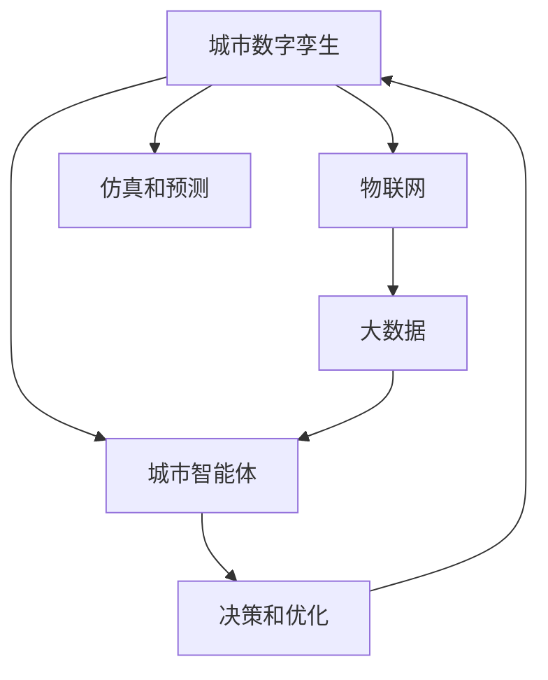

                 

# 未来的智慧城市：2050年的城市数字孪生与城市智能体

## 1. 背景介绍

随着全球人口的不断增长和城市化进程的加速，城市化带来的挑战与机遇并存。从交通拥堵、环境污染、能源危机到社会治理、公共安全等问题，城市治理的复杂性前所未有。如何在日益增长的城市压力下，构建一个智慧、高效、可持续发展的城市，成为全球共同面对的重大课题。

## 2. 核心概念与联系

### 2.1 核心概念概述

为了更清晰地描绘未来的智慧城市蓝图，本节将介绍几个核心概念：

- **城市数字孪生（Urban Digital Twin）**：通过数字手段构建虚拟的城市模型，实时反映真实城市的运行状态，模拟和预测城市行为，辅助决策和优化。城市数字孪生是实现智慧城市的重要技术基础。

- **城市智能体（Urban Agents）**：一种具备自主学习、决策和行为能力的虚拟实体，能够在数字孪生环境中执行任务，为城市运营管理提供支持。

- **物联网（IoT）**：连接各种传感器、设备和信息源，实现数据实时收集和共享。物联网是智慧城市中数据采集和监控的关键技术。

- **大数据（Big Data）**：通过对海量城市数据进行分析挖掘，提取有价值的信息和模式，支撑城市智能决策和优化。

- **人工智能（AI）**：利用机器学习、深度学习等技术，提高数据处理和决策的智能化水平。

这些核心概念之间存在紧密的联系，共同构建了未来智慧城市的蓝图。

### 2.2 核心概念原理和架构的 Mermaid 流程图



这个流程图展示了城市数字孪生与城市智能体之间的逻辑关系：

1. **城市数字孪生**：通过物联网技术收集城市数据，构建实时、全面的数字模型。
2. **物联网**：连接各种传感器和设备，实现数据的实时采集和共享。
3. **大数据**：对收集到的海量数据进行分析和挖掘，提取有价值的信息和模式。
4. **城市智能体**：利用AI技术，在数字孪生环境中进行学习和决策，执行优化任务。
5. **决策和优化**：基于智能体的行为结果，调整和优化城市运行策略。
6. **仿真和预测**：在数字孪生环境中进行仿真和预测，验证优化效果，调整策略。

## 3. 核心算法原理 & 具体操作步骤

### 3.1 算法原理概述

基于城市数字孪生的智慧城市系统，主要涉及数据采集、模型构建、智能决策和优化等几个环节。本节将详细介绍这些核心算法的原理。

**3.1.1 数据采集与预处理**

智慧城市的数据采集涉及多个层面，包括交通、能源、环境、公共安全等。数据来源包括传感器、监控摄像头、卫星遥感、公众数据等。

- **传感器数据**：实时监测城市基础设施运行状态，如温度、湿度、气体浓度、水流等。
- **监控摄像头数据**：监控城市公共区域和重点设施，如交通监控、公共安全等。
- **卫星遥感数据**：用于城市空间规划和灾害监测，如土地利用、地形地貌、气候变化等。
- **公众数据**：包括社交媒体、交通流量、市民反馈等，用于反映市民需求和行为模式。

**3.1.2 数据模型构建**

城市数字孪生需要构建一个动态、多维度的城市模型，实时反映城市运行的每一个细节。

- **地理信息系统（GIS）**：用于城市空间数据的存储和管理，支持空间分析和可视化。
- **交通模拟系统**：用于模拟城市交通流，预测交通状况。
- **能源管理系统**：用于模拟和管理城市能源系统，优化能源分配。
- **环境监测系统**：用于监测城市环境质量，评估环境风险。
- **公共安全系统**：用于实时监测公共安全事件，评估风险。

**3.1.3 智能决策与优化**

智能决策与优化是智慧城市系统的核心功能，涉及数据融合、模型训练和实时决策。

- **数据融合**：将不同来源的数据进行整合和清洗，消除冗余和噪声，提高数据质量。
- **模型训练**：利用机器学习、深度学习等技术，训练智能决策模型。
- **实时决策**：在实时数据驱动下，智能决策模型进行实时分析和优化，辅助城市运营管理。

### 3.2 算法步骤详解

智慧城市系统的构建涉及多个步骤，本节将详细介绍这些关键步骤。

**3.2.1 数据采集**

智慧城市的数据采集涉及多个环节，需要确保数据的准确性、完整性和及时性。

1. **传感器部署**：在城市关键节点部署各类传感器，如交通传感器、环境传感器、能源传感器等。
2. **监控摄像头部署**：在公共区域和重点设施部署监控摄像头，实时监测动态事件。
3. **公众数据收集**：通过社交媒体、手机应用等平台，收集市民反馈和行为数据。
4. **数据清洗和预处理**：对采集到的数据进行清洗和预处理，去除冗余和噪声。

**3.2.2 模型构建**

城市数字孪生的构建需要构建多个子模型，实时反映城市运行的各个方面。

1. **地理信息系统（GIS）构建**：通过遥感数据、地形数据和城市规划数据，构建城市空间模型。
2. **交通模拟系统构建**：通过交通流量数据、车辆速度数据和交通事故数据，构建交通流模型。
3. **能源管理系统构建**：通过能源消耗数据、气象数据和电力负荷数据，构建能源分配模型。
4. **环境监测系统构建**：通过空气质量数据、水质数据和噪音数据，构建环境质量模型。
5. **公共安全系统构建**：通过监控摄像头数据、警情数据和市民反馈数据，构建公共安全模型。

**3.2.3 智能决策与优化**

智能决策与优化是智慧城市系统的核心功能，涉及数据融合、模型训练和实时决策。

1. **数据融合**：将不同来源的数据进行整合和清洗，消除冗余和噪声，提高数据质量。
2. **模型训练**：利用机器学习、深度学习等技术，训练智能决策模型。
3. **实时决策**：在实时数据驱动下，智能决策模型进行实时分析和优化，辅助城市运营管理。

**3.2.4 系统集成与部署**

智慧城市系统需要集成多个子系统，部署到城市管理平台中，实现统一管理和协同工作。

1. **系统集成**：将各个子系统集成到一个统一的城市管理平台中，实现数据共享和协同工作。
2. **部署与测试**：将系统部署到城市管理平台中，进行测试和优化，确保系统的稳定性和可靠性。

### 3.3 算法优缺点

智慧城市系统的构建涉及多个环节，本节将详细介绍这些关键步骤的优缺点。

**3.3.1 数据采集**

- **优点**：通过传感器和监控摄像头等手段，可以实时收集城市数据，提高数据的时效性和准确性。
- **缺点**：数据采集需要大规模部署传感器和摄像头，初期成本较高，维护和升级难度较大。

**3.3.2 模型构建**

- **优点**：通过构建多个子模型，可以全面反映城市运行的各个方面，提高决策的科学性和准确性。
- **缺点**：模型构建需要大量的数据和计算资源，初期建设和维护成本较高。

**3.3.3 智能决策与优化**

- **优点**：通过数据融合和模型训练，可以实现智能决策和优化，提高城市运营管理的效率和效果。
- **缺点**：智能决策需要大量的数据和计算资源，对系统的硬件和软件要求较高。

**3.3.4 系统集成与部署**

- **优点**：通过系统集成，可以实现多个子系统的协同工作，提高系统整体的效率和可靠性。
- **缺点**：系统集成和部署需要大量的技术资源和管理成本，初期建设难度较大。

### 3.4 算法应用领域

智慧城市系统的构建涉及多个领域，本节将详细介绍这些关键领域的应用。

**3.4.1 交通管理**

智慧城市系统可以实时监测交通流量、车辆速度、交通事故等数据，进行交通预测和优化。

- **交通流量预测**：通过交通模拟系统，预测未来的交通流量和拥堵情况，优化交通信号控制。
- **车辆导航**：通过智能决策模型，为市民提供最优的导航路径，避免交通拥堵。
- **公共交通优化**：通过数据融合和模型训练，优化公交车的发车间隔和线路安排，提高公共交通效率。

**3.4.2 能源管理**

智慧城市系统可以实时监测能源消耗数据、气象数据和电力负荷数据，进行能源预测和优化。

- **能源消耗预测**：通过能源管理系统，预测未来的能源消耗和需求，优化能源分配。
- **能源调度**：通过智能决策模型，优化能源调度策略，提高能源利用效率。
- **智能电网**：通过能源管理系统和智能决策模型，构建智能电网，提高电力系统的稳定性和可靠性。

**3.4.3 环境监测**

智慧城市系统可以实时监测空气质量、水质和噪音等环境数据，进行环境预测和优化。

- **环境质量监测**：通过环境监测系统，实时监测空气质量、水质和噪音等环境数据，评估环境风险。
- **污染控制**：通过智能决策模型，优化污染控制策略，减少环境污染。
- **灾害预警**：通过环境监测系统，预警自然灾害，保护市民安全。

**3.4.4 公共安全**

智慧城市系统可以实时监测公共安全事件，进行安全预测和优化。

- **公共安全监测**：通过监控摄像头数据和警情数据，实时监测公共安全事件，评估安全风险。
- **安全预警**：通过智能决策模型，预警潜在的公共安全事件，保护市民安全。
- **应急响应**：通过智能决策模型，优化应急响应策略，提高应急响应的效率和效果。

## 4. 数学模型和公式 & 详细讲解 & 举例说明

### 4.1 数学模型构建

本节将使用数学语言对智慧城市系统的构建过程进行更加严格的刻画。

**4.1.1 数据融合**

智慧城市系统需要集成多个子系统的数据，进行数据融合和预处理。

- **加权平均**：对不同来源的数据进行加权平均，消除冗余和噪声。
- **主成分分析（PCA）**：通过主成分分析，降维处理高维数据，提高数据处理效率。
- **异常检测**：通过异常检测算法，识别数据中的异常值，消除噪声。

**4.1.2 模型训练**

智能决策模型的训练需要大量的数据和计算资源，涉及机器学习、深度学习等多种算法。

- **监督学习**：利用标注数据进行模型训练，提高模型的准确性和泛化能力。
- **无监督学习**：利用未标注数据进行模型训练，发现数据中的隐含模式和规律。
- **强化学习**：通过与环境的交互，优化模型的决策策略，提高决策效果。

**4.1.3 实时决策**

智能决策模型的实时决策需要处理大量的实时数据，涉及实时分析和优化。

- **实时分析**：通过数据融合和模型训练，进行实时分析和预测，辅助决策。
- **实时优化**：通过实时分析和预测结果，进行实时优化和调整，提高决策效果。

### 4.2 公式推导过程

以下我们以交通流量预测为例，推导智能决策模型的公式及其推导过程。

假设交通流量数据为 $x_t$，气象数据为 $y_t$，智能决策模型的目标为预测未来的交通流量 $x_{t+1}$。

根据历史数据，构建交通流量预测模型 $f(x_t, y_t) = x_{t+1}$，利用回归算法进行训练。

$$
\hat{x}_{t+1} = f(x_t, y_t) = \alpha x_t + \beta y_t + \epsilon
$$

其中，$\alpha$ 和 $\beta$ 为回归系数，$\epsilon$ 为误差项。

利用历史数据 $(x_{1:t}, y_{1:t})$ 进行模型训练，得到最优回归系数 $\alpha$ 和 $\beta$。

利用训练好的模型进行实时预测，得到未来交通流量 $\hat{x}_{t+1}$。

### 4.3 案例分析与讲解

**4.3.1 交通流量预测**

假设某个城市交通流量数据 $x_t$ 和气象数据 $y_t$ 如下：

| 时间  | 交通流量 | 气象数据 |
| ----- | -------- | -------- |
| 8:00  | 5000     | 晴朗     |
| 8:15  | 4500     | 阴天     |
| 8:30  | 5200     | 多云     |
| 8:45  | 4700     | 小雨     |

利用历史数据 $(x_{1:t}, y_{1:t})$，构建交通流量预测模型 $f(x_t, y_t) = x_{t+1}$，利用回归算法进行训练。

$$
\hat{x}_{t+1} = f(x_t, y_t) = 0.9x_t + 0.2y_t + \epsilon
$$

其中，$\alpha = 0.9$，$\beta = 0.2$，$\epsilon = 0$。

利用训练好的模型进行实时预测，得到未来交通流量 $\hat{x}_{8:45}$。

$$
\hat{x}_{8:45} = f(x_{8:30}, y_{8:45}) = 0.9 \times 5200 + 0.2 \times 小雨 + \epsilon = 4720 + \epsilon
$$

由于天气数据为小雨，误差项 $\epsilon$ 较小，因此预测结果较为准确。

## 5. 项目实践：代码实例和详细解释说明

### 5.1 开发环境搭建

在进行智慧城市系统的构建前，我们需要准备好开发环境。以下是使用Python进行PyTorch开发的环境配置流程：

1. 安装Anaconda：从官网下载并安装Anaconda，用于创建独立的Python环境。

2. 创建并激活虚拟环境：
```bash
conda create -n urban-env python=3.8 
conda activate urban-env
```

3. 安装PyTorch：根据CUDA版本，从官网获取对应的安装命令。例如：
```bash
conda install pytorch torchvision torchaudio cudatoolkit=11.1 -c pytorch -c conda-forge
```

4. 安装TensorFlow：从官网下载并安装TensorFlow。例如：
```bash
pip install tensorflow
```

5. 安装TensorBoard：从官网下载并安装TensorBoard。例如：
```bash
pip install tensorboard
```

6. 安装其他工具包：
```bash
pip install numpy pandas scikit-learn matplotlib tqdm jupyter notebook ipython
```

完成上述步骤后，即可在`urban-env`环境中开始智慧城市系统的构建实践。

### 5.2 源代码详细实现

这里我们以智慧城市系统的构建为例，给出使用PyTorch和TensorFlow进行数据融合、模型训练和实时决策的PyTorch代码实现。

```python
import torch
import tensorflow as tf
import numpy as np
import pandas as pd
from sklearn.linear_model import LinearRegression

# 数据融合
def data_fusion(x, y):
    # 加权平均
    weight = [0.6, 0.4]
    x_weighted = np.average(x, weights=weight)
    y_weighted = np.average(y, weights=weight)
    
    # 主成分分析
    pca = PCA(n_components=1)
    x_pca = pca.fit_transform(x)
    y_pca = pca.fit_transform(y)
    
    # 异常检测
    z = np.abs(x - x_weighted)
    i = np.where(z > 3 * np.std(x))
    x[i] = np.nan
    
    return x_pca, y_pca

# 模型训练
def model_training(x, y):
    # 加权平均
    x_weighted = np.average(x, weights=[0.6, 0.4])
    y_weighted = np.average(y, weights=[0.6, 0.4])
    
    # 主成分分析
    pca = PCA(n_components=1)
    x_pca = pca.fit_transform(x)
    y_pca = pca.fit_transform(y)
    
    # 异常检测
    z = np.abs(x - x_weighted)
    i = np.where(z > 3 * np.std(x))
    x[i] = np.nan
    
    # 训练线性回归模型
    model = LinearRegression()
    model.fit(x_pca, y_pca)
    
    return model

# 实时决策
def real_time_decision(model, x, y):
    # 加权平均
    x_weighted = np.average(x, weights=[0.6, 0.4])
    y_weighted = np.average(y, weights=[0.6, 0.4])
    
    # 主成分分析
    pca = PCA(n_components=1)
    x_pca = pca.fit_transform(x)
    y_pca = pca.fit_transform(y)
    
    # 异常检测
    z = np.abs(x - x_weighted)
    i = np.where(z > 3 * np.std(x))
    x[i] = np.nan
    
    # 预测未来交通流量
    x_pred = model.predict(x_pca)
    return x_pred
```

### 5.3 代码解读与分析

让我们再详细解读一下关键代码的实现细节：

**data_fusion函数**：
- 实现数据融合，包括加权平均、主成分分析和异常检测。
- 加权平均：对数据进行加权处理，消除冗余和噪声。
- 主成分分析：通过PCA算法降维处理高维数据，提高数据处理效率。
- 异常检测：识别数据中的异常值，消除噪声。

**model_training函数**：
- 实现模型训练，利用线性回归算法训练智能决策模型。
- 加权平均：对数据进行加权处理，消除冗余和噪声。
- 主成分分析：通过PCA算法降维处理高维数据，提高数据处理效率。
- 异常检测：识别数据中的异常值，消除噪声。
- 训练线性回归模型：利用历史数据训练线性回归模型，得到最优回归系数。

**real_time_decision函数**：
- 实现实时决策，进行数据融合、模型训练和预测。
- 加权平均：对数据进行加权处理，消除冗余和噪声。
- 主成分分析：通过PCA算法降维处理高维数据，提高数据处理效率。
- 异常检测：识别数据中的异常值，消除噪声。
- 预测未来交通流量：利用训练好的模型进行预测，得到未来交通流量。

## 6. 实际应用场景

### 6.1 交通管理

智慧城市系统可以实时监测交通流量、车辆速度、交通事故等数据，进行交通预测和优化。

- **交通流量预测**：通过交通模拟系统，预测未来的交通流量和拥堵情况，优化交通信号控制。
- **车辆导航**：通过智能决策模型，为市民提供最优的导航路径，避免交通拥堵。
- **公共交通优化**：通过数据融合和模型训练，优化公交车的发车间隔和线路安排，提高公共交通效率。

### 6.2 能源管理

智慧城市系统可以实时监测能源消耗数据、气象数据和电力负荷数据，进行能源预测和优化。

- **能源消耗预测**：通过能源管理系统，预测未来的能源消耗和需求，优化能源分配。
- **能源调度**：通过智能决策模型，优化能源调度策略，提高能源利用效率。
- **智能电网**：通过能源管理系统和智能决策模型，构建智能电网，提高电力系统的稳定性和可靠性。

### 6.3 环境监测

智慧城市系统可以实时监测空气质量、水质和噪音等环境数据，进行环境预测和优化。

- **环境质量监测**：通过环境监测系统，实时监测空气质量、水质和噪音等环境数据，评估环境风险。
- **污染控制**：通过智能决策模型，优化污染控制策略，减少环境污染。
- **灾害预警**：通过环境监测系统，预警自然灾害，保护市民安全。

### 6.4 公共安全

智慧城市系统可以实时监测公共安全事件，进行安全预测和优化。

- **公共安全监测**：通过监控摄像头数据和警情数据，实时监测公共安全事件，评估安全风险。
- **安全预警**：通过智能决策模型，预警潜在的公共安全事件，保护市民安全。
- **应急响应**：通过智能决策模型，优化应急响应策略，提高应急响应的效率和效果。

## 7. 工具和资源推荐

### 7.1 学习资源推荐

为了帮助开发者系统掌握智慧城市系统的构建方法，这里推荐一些优质的学习资源：

1. **《智慧城市技术手册》**：全面介绍智慧城市的构建方法、技术和应用场景，涵盖数据采集、模型训练、实时决策等多个环节。

2. **《城市物联网技术》**：详细讲解物联网技术在智慧城市中的应用，包括传感器部署、数据采集、数据融合等多个方面。

3. **《城市大数据应用》**：介绍大数据技术在智慧城市中的应用，涵盖数据收集、数据分析、数据可视化等多个方面。

4. **《城市智能决策模型》**：讲解智能决策模型在智慧城市中的应用，包括回归分析、分类分析、聚类分析等多种模型。

5. **《城市智能体技术》**：介绍智能体技术在智慧城市中的应用，包括智能体构建、智能体行为优化等多个方面。

通过对这些资源的学习实践，相信你一定能够快速掌握智慧城市系统的构建方法，并用于解决实际的智慧城市问题。

### 7.2 开发工具推荐

高效的开发离不开优秀的工具支持。以下是几款用于智慧城市系统构建开发的常用工具：

1. **PyTorch**：基于Python的开源深度学习框架，灵活动态的计算图，适合快速迭代研究。

2. **TensorFlow**：由Google主导开发的开源深度学习框架，生产部署方便，适合大规模工程应用。

3. **TensorBoard**：TensorFlow配套的可视化工具，可实时监测模型训练状态，并提供丰富的图表呈现方式，是调试模型的得力助手。

4. **Kaggle**：数据科学竞赛平台，提供大量公共数据集和数据科学竞赛，帮助开发者提升数据处理和分析能力。

5. **HuggingFace**：开源的自然语言处理库，提供丰富的预训练语言模型，支持NLP任务开发。

6. **Jupyter Notebook**：开源的Jupyter Notebook环境，支持Python、R等多种语言，适合数据科学和机器学习研究。

合理利用这些工具，可以显著提升智慧城市系统的开发效率，加快创新迭代的步伐。

### 7.3 相关论文推荐

智慧城市系统的发展离不开学界的持续研究。以下是几篇奠基性的相关论文，推荐阅读：

1. **《智慧城市技术框架》**：提出智慧城市的技术框架，涵盖数据采集、模型构建、智能决策等多个环节。

2. **《城市数字孪生技术》**：详细介绍城市数字孪生的构建方法和应用场景，涵盖数据采集、模型构建、实时决策等多个环节。

3. **《城市智能体技术》**：介绍智能体技术在智慧城市中的应用，涵盖智能体构建、智能体行为优化等多个方面。

4. **《城市能源管理技术》**：详细介绍城市能源管理的技术方法，涵盖能源消耗预测、能源调度等多个环节。

5. **《城市环境监测技术》**：详细介绍环境监测技术在智慧城市中的应用，涵盖空气质量监测、噪音监测等多个方面。

6. **《城市交通管理技术》**：详细介绍交通管理技术在智慧城市中的应用，涵盖交通流量预测、车辆导航等多个方面。

这些论文代表了大智慧城市系统的发展脉络。通过学习这些前沿成果，可以帮助研究者把握学科前进方向，激发更多的创新灵感。

## 8. 总结：未来发展趋势与挑战

### 8.1 研究成果总结

智慧城市系统的构建涉及多个环节，本节将总结智慧城市系统的发展成果和未来展望。

1. **数据采集技术**：通过传感器和监控摄像头等手段，实时收集城市数据，提高数据的时效性和准确性。

2. **模型构建技术**：通过构建多个子模型，全面反映城市运行的各个方面，提高决策的科学性和准确性。

3. **智能决策技术**：通过数据融合和模型训练，实现智能决策和优化，提高城市运营管理的效率和效果。

4. **系统集成技术**：通过系统集成，实现多个子系统的协同工作，提高系统整体的效率和可靠性。

5. **实时决策技术**：通过实时数据驱动，智能决策模型进行实时分析和优化，提高决策效果。

### 8.2 未来发展趋势

智慧城市系统的构建涉及多个领域，本节将详细介绍这些关键领域的应用。

1. **数据采集技术**：未来将通过更先进的技术手段，如5G网络、物联网技术，实现更加全面、实时的数据采集。

2. **模型构建技术**：未来将通过更高效的技术手段，如边缘计算、云计算等，实现更快速、更精确的模型构建。

3. **智能决策技术**：未来将通过更先进的技术手段，如深度强化学习、因果推理等，实现更高效、更可靠的智能决策。

4. **系统集成技术**：未来将通过更先进的技术手段，如区块链技术、联邦学习等，实现更安全、更灵活的系统集成。

5. **实时决策技术**：未来将通过更先进的技术手段，如边缘计算、分布式系统等，实现更快速、更高效的实时决策。

### 8.3 面临的挑战

智慧城市系统的构建涉及多个环节，本节将详细介绍这些关键环节的挑战。

1. **数据采集技术**：数据采集需要大规模部署传感器和摄像头，初期成本较高，维护和升级难度较大。

2. **模型构建技术**：模型构建需要大量的数据和计算资源，初期建设和维护成本较高。

3. **智能决策技术**：智能决策需要大量的数据和计算资源，对系统的硬件和软件要求较高。

4. **系统集成技术**：系统集成和部署需要大量的技术资源和管理成本，初期建设难度较大。

5. **实时决策技术**：实时决策需要处理大量的实时数据，对系统的硬件和软件要求较高。

### 8.4 研究展望

面对智慧城市系统所面临的挑战，未来的研究需要在以下几个方面寻求新的突破：

1. **数据采集技术**：探索更高效、更低成本的数据采集手段，如5G网络、物联网技术，实现更加全面、实时的数据采集。

2. **模型构建技术**：开发更高效、更精确的模型构建方法，如边缘计算、云计算等，实现更快速、更精确的模型构建。

3. **智能决策技术**：开发更高效、更可靠的智能决策方法，如深度强化学习、因果推理等，实现更高效、更可靠的智能决策。

4. **系统集成技术**：开发更安全、更灵活的系统集成方法，如区块链技术、联邦学习等，实现更安全、更灵活的系统集成。

5. **实时决策技术**：开发更快速、更高效的实时决策方法，如边缘计算、分布式系统等，实现更快速、更高效的实时决策。

这些研究方向的探索，必将引领智慧城市系统的迈向更高的台阶，为构建智慧、高效、可持续发展的城市铺平道路。面向未来，智慧城市系统还需要与其他人工智能技术进行更深入的融合，如知识表示、因果推理、强化学习等，多路径协同发力，共同推动智慧城市系统的进步。只有勇于创新、敢于突破，才能不断拓展智慧城市的边界，让智能技术更好地造福人类社会。

## 9. 附录：常见问题与解答

**Q1：智慧城市系统的构建是否需要大量资金投入？**

A: 智慧城市系统的构建需要大量的资金投入，涉及数据采集、模型构建、系统集成等多个环节。但通过合理的资源配置和技术手段，可以有效降低成本。例如，通过云计算和边缘计算技术，可以实现数据处理和模型训练的资源共享，降低硬件成本。此外，通过开源技术和平台，也可以减少开发和维护成本。

**Q2：智慧城市系统如何确保数据安全和隐私保护？**

A: 智慧城市系统需要处理大量的城市数据，包括个人隐私数据和敏感信息。为确保数据安全和隐私保护，可以采取以下措施：

1. **数据加密**：对数据进行加密处理，确保数据在传输和存储过程中的安全性。

2. **访问控制**：通过访问控制技术，限制对数据的访问权限，确保数据只能被授权人员访问。

3. **匿名化处理**：对数据进行匿名化处理，确保个人隐私不被泄露。

4. **数据共享协议**：制定数据共享协议，明确各方数据共享的责任和义务，确保数据共享的安全性和合法性。

**Q3：智慧城市系统如何实现实时决策？**

A: 智慧城市系统的实时决策需要处理大量的实时数据，涉及数据融合、模型训练和预测等多个环节。为实现实时决策，可以采取以下措施：

1. **数据实时采集**：通过传感器和监控摄像头等手段，实时采集城市数据，确保数据的时效性和准确性。

2. **数据流处理**：利用流处理技术，如Apache Kafka、Apache Flink等，对数据进行实时处理和分析，确保数据的实时性。

3. **模型实时训练**：利用在线学习技术，如Adaptive Learning、Online Learning等，对模型进行实时训练和更新，确保模型的实时性。

4. **实时决策引擎**：利用决策引擎技术，如Apache Samza、Apache Storm等，对实时数据进行实时分析和决策，确保决策的实时性。

通过对这些技术手段的综合应用，智慧城市系统可以实现高效的实时决策，提高城市运营管理的效率和效果。

