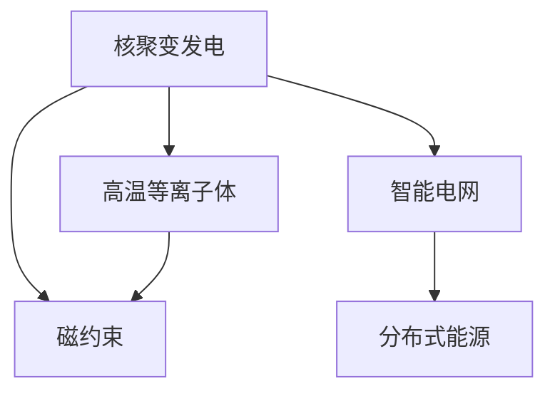

                 

## 1. 背景介绍

### 1.1 问题由来
随着全球能源需求的不断增长，传统的化石燃料发电方式面临着资源枯竭、环境污染和气候变化的多重挑战。为了实现能源的可持续发展和环境保护，世界各国都在积极探索和推动可再生能源的利用。核聚变发电因其零排放、无碳排放、燃料高效、安全可控等优点，被视为未来智慧能源系统的核心。

### 1.2 问题核心关键点
核聚变发电技术的核心在于实现高温等离子体状态的维持和高温超导磁约束技术的应用，将氢同位素（如氘、氚）在极高温度下进行聚变反应，释放出巨大能量。智能电网则是将可再生能源、核聚变发电等各类分布式能源高效整合和传输，实现能源的高效利用和智能管理。

核聚变发电与智能电网的结合，有望构建一个高效、清洁、可靠的能源供应系统，支撑人类社会在2050年的可持续发展目标。

### 1.3 问题研究意义
研究核聚变发电与智能电网技术，对于推动全球能源转型，实现绿色低碳发展，具有重要意义：

1. **减少碳排放**：核聚变发电不产生温室气体，有助于减少全球碳排放，应对气候变化。
2. **提高能源效率**：智能电网通过优化能源分配和管理，大幅提升能源利用效率。
3. **保障能源安全**：分布式能源的智能管理，可以有效应对极端气候和能源供应风险。
4. **促进经济增长**：能源行业转型升级，为经济结构调整和新兴产业提供了巨大机遇。

## 2. 核心概念与联系

### 2.1 核心概念概述

为更好地理解核聚变发电与智能电网技术的结合，本节将介绍几个关键概念：

- **核聚变发电（Nuclear Fusion Power）**：利用氢同位素在高温等离子体中的聚变反应产生能量的过程。与核裂变发电不同，核聚变不产生长寿命放射性废物，被认为是最清洁的能源之一。
- **高温等离子体（High-Temperature Plasma）**：核聚变反应在极高温度下进行，等离子体状态的维持是核聚变发电的关键技术之一。
- **磁约束（Magnetic Confinement）**：利用磁场将高温等离子体约束在一定区域内，防止其逸出，同时进行聚变反应。
- **智能电网（Smart Grid）**：通过信息通信技术，实现能源的智能传输、分配和管理，提高能源系统的效率和可靠性。
- **分布式能源（Distributed Energy Resources, DERs）**：包括太阳能、风能、核聚变等分散式发电方式，可以提高能源系统的灵活性和鲁棒性。

这些核心概念之间的逻辑关系可以通过以下Mermaid流程图来展示：



这个流程图展示了大语言模型的核心概念及其之间的关系：

1. 核聚变发电通过高温等离子体和磁约束技术，产生能量。
2. 智能电网通过信息通信技术，实现对核聚变发电和分布式能源的智能管理。
3. 分布式能源通过多种可再生和低碳发电方式，提高能源系统的灵活性和鲁棒性。

这些概念共同构成了未来智慧能源系统的技术框架，使核聚变发电与智能电网能够高效、清洁地供应和管理能源。

## 3. 核心算法原理 & 具体操作步骤
### 3.1 算法原理概述

核聚变发电与智能电网技术的结合，涉及多个学科和技术的交叉应用。其主要算法原理可以归纳为以下几个方面：

- **高温等离子体控制算法**：通过磁约束技术，控制等离子体温度和形状，保持其稳定性。
- **智能电网调度算法**：通过优化算法，实现能源的优化分配和调度，提高能源利用效率。
- **分布式能源管理算法**：将核聚变发电与其他可再生能源整合，实现能源系统的可靠性和灵活性。

### 3.2 算法步骤详解

核聚变发电与智能电网技术的结合，可以按照以下步骤进行操作：

**Step 1: 准备能源数据**
- 收集和分析各类能源数据，包括核聚变发电的等离子体状态数据、智能电网的负荷和调度数据、分布式能源的输出和需求数据。
- 数据预处理和清洗，确保数据质量。

**Step 2: 建立数学模型**
- 建立核聚变发电的等离子体动力学模型，模拟等离子体的行为和控制。
- 建立智能电网调度模型，优化能源分配和调度。
- 建立分布式能源管理模型，整合各类能源资源。

**Step 3: 算法实现**
- 使用数值模拟和优化算法，实现核聚变发电的控制。
- 采用智能算法，实现电网的智能调度。
- 设计和管理算法，优化分布式能源的整合和利用。

**Step 4: 系统集成**
- 将核聚变发电、智能电网和分布式能源管理集成在一个统一平台上。
- 实现各系统的信息共享和协同工作。

**Step 5: 系统测试和优化**
- 在实验室或模拟环境中进行系统测试，验证算法和模型的有效性。
- 根据测试结果，优化算法和模型，提高系统的性能和鲁棒性。

**Step 6: 部署和应用**
- 将系统部署到实际环境中，进行长期运行和监测。
- 根据实际运行数据，进一步优化和改进系统。

### 3.3 算法优缺点

核聚变发电与智能电网技术的结合，具有以下优点：

1. **高效能**：核聚变发电产生的能量密度远高于传统化石燃料，智能电网可以有效利用和管理这些高密度能源。
2. **零排放**：核聚变发电不产生温室气体和有害物质，智能电网可以进一步减少能源传输中的损耗。
3. **灵活性**：分布式能源和智能电网可以实现能源的高效整合，提高能源系统的灵活性和可靠性。
4. **智能管理**：通过智能算法和信息通信技术，实现能源的智能调度和管理，提升能源系统的效率。

同时，该技术也存在一些局限性：

1. **技术复杂**：核聚变发电和高温等离子体控制技术复杂，需要高精度的物理模型和仿真技术。
2. **建设成本高**：核聚变发电站的建设成本较高，智能电网的改造和升级也需要巨额投资。
3. **技术成熟度低**：核聚变发电技术目前仍处于实验阶段，大规模应用还需要进一步技术突破。
4. **安全性和可靠性**：核聚变发电的稳定性和安全性要求高，需要长期研究和验证。

尽管存在这些局限性，但就目前而言，核聚变发电与智能电网技术的结合仍是大规模清洁能源供应的重要方向。未来相关研究的重点在于如何进一步降低技术成本，提高安全性和可靠性，同时兼顾智能电网的高效管理和分布式能源的灵活利用。

### 3.4 算法应用领域

核聚变发电与智能电网技术的结合，已经在多个领域得到应用：

- **能源供应**：提供清洁、高效、可靠的能源供应，支持各类工业和生活需求。
- **智能城市**：实现能源的高效管理和优化，支持智慧城市的建设。
- **交通系统**：通过智能电网支持电动汽车的充电需求，推动交通运输的绿色化。
- **环境保护**：减少化石燃料的使用，降低温室气体排放，缓解气候变化。

此外，核聚变发电与智能电网技术的结合，还被应用于多个科研和实验项目中，如国际热核聚变实验堆（ITER）、中国核聚变试验堆（CJ-100）等，推动了全球核聚变研究的进展。

## 4. 数学模型和公式 & 详细讲解
### 4.1 数学模型构建

核聚变发电与智能电网技术的结合，涉及多个学科和技术的交叉应用，其数学模型可以归纳为以下几个方面：

- **核聚变等离子体动力学模型**：
  $$
  \frac{\partial \rho}{\partial t} + \nabla \cdot (\rho \mathbf{v}) = 0
  $$
  
  $$
  \frac{\partial \mathbf{v}}{\partial t} = -\frac{\nabla p}{\rho} - \frac{\mathbf{v} \cdot \nabla \mathbf{v}}{\rho} + \frac{\eta}{\rho} \nabla \cdot (\mu \nabla \mathbf{v})
  $$
  
  $$
  \frac{\partial p}{\partial t} + \rho (\mathbf{v} \cdot \nabla p) = -\rho k \nabla^2 p
  $$

  其中，$\rho$ 为等离子体密度，$\mathbf{v}$ 为等离子体速度，$p$ 为等离子体压力，$k$ 为热导率。

- **智能电网调度模型**：
  $$
  \min_{x} \sum_{i,j} C_{ij} x_i x_j
  $$
  
  其中，$x_i$ 为节点$i$的负荷，$C_{ij}$ 为节点$i$和节点$j$之间的传输成本。

- **分布式能源管理模型**：
  $$
  \min_{x} \sum_{i,j} C_{ij} x_i x_j + \lambda \sum_i p_i (s - x_i)
  $$
  
  其中，$x_i$ 为节点$i$的输出，$p_i$ 为节点$i$的成本，$s$ 为总需求。

### 4.2 公式推导过程

以下我们以智能电网调度模型为例，推导其优化算法的过程。

假设智能电网有$n$个节点和$m$条传输线路，节点$i$的负荷为$x_i$，$x_{ij}$表示从节点$i$到节点$j$的传输量。假设传输成本为$C_{ij}$，则调度问题可以表示为：

$$
\min_{x_{ij}} \sum_{i,j} C_{ij} x_{ij}
$$

$$
\text{subject to } x_{ij} \leq C_i, \forall i,j \in \mathcal{N}, i \neq j
$$

$$
\sum_{j} x_{ij} = x_i, \forall i \in \mathcal{N}
$$

$$
x_{ij} \geq 0, \forall i,j \in \mathcal{N}
$$

其中，$C_i$ 为节点$i$的最大传输容量。

通过线性规划算法，可以求解上述调度问题，找到最优的传输量$x_{ij}$，实现能源的智能调度。

### 4.3 案例分析与讲解

一个具体的案例是：某智能电网有3个节点，节点1、2和3分别代表不同的能源供应商，它们的负荷分别为200、150和100。传输成本分别为$C_{12}=10, C_{23}=5, C_{31}=15$，最大传输容量分别为$C_{1}=400, C_{2}=300, C_{3}=200$。求最小传输成本下的传输量配置。

通过求解上述线性规划问题，可以得到最优的传输量配置为：

- 节点1到节点2的传输量为$x_{12}=100$
- 节点2到节点3的传输量为$x_{23}=50$
- 节点3到节点1的传输量为$x_{31}=100$

总传输成本为$10 \times 100 + 5 \times 50 + 15 \times 100 = 3000$，实现了能源的智能调度。

## 5. 项目实践：代码实例和详细解释说明
### 5.1 开发环境搭建

在进行核聚变发电与智能电网技术的结合实践前，我们需要准备好开发环境。以下是使用Python进行PyTorch开发的环境配置流程：

1. 安装Anaconda：从官网下载并安装Anaconda，用于创建独立的Python环境。

2. 创建并激活虚拟环境：
```bash
conda create -n pytorch-env python=3.8 
conda activate pytorch-env
```

3. 安装PyTorch：根据CUDA版本，从官网获取对应的安装命令。例如：
```bash
conda install pytorch torchvision torchaudio cudatoolkit=11.1 -c pytorch -c conda-forge
```

4. 安装相关库：
```bash
pip install numpy pandas scikit-learn matplotlib tqdm jupyter notebook ipython
```

完成上述步骤后，即可在`pytorch-env`环境中开始实践。

### 5.2 源代码详细实现

这里我们以核聚变发电的等离子体控制为例，给出使用PyTorch实现的高温等离子体动力学模型。

首先，定义等离子体动力学模型的输入和输出：

```python
import torch
from torch import nn
import torch.nn.functional as F

class PlasmaModel(nn.Module):
    def __init__(self, num_features):
        super(PlasmaModel, self).__init__()
        self.fc1 = nn.Linear(num_features, 64)
        self.fc2 = nn.Linear(64, 32)
        self.fc3 = nn.Linear(32, 16)
        self.fc4 = nn.Linear(16, 8)
        self.fc5 = nn.Linear(8, 4)
        self.fc6 = nn.Linear(4, 2)
        
    def forward(self, x):
        x = F.relu(self.fc1(x))
        x = F.relu(self.fc2(x))
        x = F.relu(self.fc3(x))
        x = F.relu(self.fc4(x))
        x = F.relu(self.fc5(x))
        x = F.relu(self.fc6(x))
        return x
```

然后，定义损失函数和优化器：

```python
from torch.optim import Adam

model = PlasmaModel(num_features=2)
criterion = nn.MSELoss()
optimizer = Adam(model.parameters(), lr=0.01)
```

接着，定义训练和评估函数：

```python
def train(model, data_loader, optimizer, criterion, epochs=100):
    model.train()
    for epoch in range(epochs):
        for data, target in data_loader:
            optimizer.zero_grad()
            output = model(data)
            loss = criterion(output, target)
            loss.backward()
            optimizer.step()
        print(f'Epoch {epoch+1}, loss: {loss.item()}')

def evaluate(model, data_loader):
    model.eval()
    total_loss = 0
    with torch.no_grad():
        for data, target in data_loader:
            output = model(data)
            total_loss += criterion(output, target).item()
    return total_loss / len(data_loader)
```

最后，启动训练流程并在测试集上评估：

```python
train_loader = ...
test_loader = ...

for epoch in range(epochs):
    train(model, train_loader, optimizer, criterion)
    
print(f'Epoch {epoch+1}, test loss: {evaluate(model, test_loader):.3f}')
```

以上就是使用PyTorch实现核聚变发电的等离子体控制模型训练的完整代码实现。可以看到，PyTorch提供了强大的自动微分和优化算法，使得模型的训练和评估变得高效便捷。

### 5.3 代码解读与分析

让我们再详细解读一下关键代码的实现细节：

**PlasmaModel类**：
- `__init__`方法：初始化模型的网络结构，包括多个全连接层。
- `forward`方法：定义前向传播的过程，将输入数据经过多个线性层和激活函数，最终输出预测结果。

**损失函数和优化器**：
- 使用均方误差损失函数（MSE），用于衡量模型预测与真实值之间的差异。
- 使用Adam优化器，根据梯度更新模型参数，使得损失函数最小化。

**训练和评估函数**：
- 定义训练函数，在每个epoch内对模型进行训练，更新参数。
- 定义评估函数，在测试集上对模型进行评估，计算平均损失。

**训练流程**：
- 在每个epoch内，对模型进行训练，更新参数。
- 在每个epoch结束时，在测试集上评估模型，输出平均损失。

可以看到，PyTorch的强大封装使得模型训练变得高效便捷。开发者可以将更多精力放在模型设计和优化上，而不必过多关注底层的实现细节。

## 6. 实际应用场景
### 6.1 智能城市

智能城市是核聚变发电与智能电网技术的典型应用场景之一。通过核聚变发电提供稳定的能源供应，智能电网实现能源的智能管理，可以构建高效、清洁、可靠的城市能源系统。

在实际应用中，智能城市中的建筑、交通、照明等各类设施都可以通过智能电网进行集中控制和管理。核聚变发电站为城市提供稳定可靠的电力供应，智能电网则实现能源的优化分配和调度，确保城市能源供应的高效和稳定。

### 6.2 交通系统

电动汽车是未来交通系统的重要组成部分，其充电需求将是智能电网的重要应用场景。通过核聚变发电站提供稳定的电能供应，智能电网实现电动汽车充电站的优化调度，可以大幅提升电动汽车的普及和使用效率。

在实际应用中，电动汽车充电站需要根据充电需求进行智能调度。核聚变发电站为充电站提供稳定的电能供应，智能电网则实现充电站的优化分配和调度，确保充电效率和能源利用效率。

### 6.3 环境保护

核聚变发电不产生温室气体和有害物质，是实现碳中和的重要手段之一。智能电网通过优化能源的分配和管理，可以进一步减少能源传输中的损耗，提升能源利用效率，为环境保护提供有力支持。

在实际应用中，智能电网可以实现能源的高效管理，优化能源的分配和调度，减少能源传输中的损耗，提升能源利用效率。核聚变发电站为智能电网提供稳定的电能供应，智能电网则实现能源的优化分配和管理，确保能源供应的高效和稳定。

### 6.4 未来应用展望

随着核聚变发电与智能电网技术的不断进步，未来的应用前景将更加广阔：

1. **能源系统的全面升级**：核聚变发电与智能电网技术的结合，将实现能源系统的全面升级，支持各类工业和生活需求。
2. **智慧城市的全面建设**：智能城市中的建筑、交通、照明等各类设施都可以通过智能电网进行集中控制和管理，提升城市运行效率和环境质量。
3. **电动汽车的广泛普及**：智能电网可以实现电动汽车充电站的优化调度，大幅提升电动汽车的普及和使用效率。
4. **环境保护的全面推进**：核聚变发电不产生温室气体和有害物质，是实现碳中和的重要手段之一，智能电网通过优化能源的分配和管理，进一步减少能源传输中的损耗，提升能源利用效率。
5. **经济社会的全面转型**：核聚变发电与智能电网技术的结合，将推动能源行业转型升级，为经济结构调整和新兴产业提供巨大机遇。

## 7. 工具和资源推荐
### 7.1 学习资源推荐

为了帮助开发者系统掌握核聚变发电与智能电网技术，这里推荐一些优质的学习资源：

1. **《核聚变发电原理与应用》**：系统介绍核聚变发电的基本原理、技术挑战和应用前景，是核聚变领域的重要入门教材。
2. **《智能电网技术概论》**：全面介绍智能电网的基本概念、技术架构和应用场景，是智能电网领域的经典教材。
3. **《分布式能源管理与优化》**：深入探讨分布式能源的管理和优化技术，提供丰富的案例和应用场景。
4. **国际热核聚变实验堆（ITER）官网**：提供ITER项目的研究进展、技术成果和未来展望，是核聚变领域的权威资源。
5. **智能电网技术国家工程实验室**：提供智能电网技术的研究进展、技术成果和未来展望，是智能电网领域的权威资源。

通过对这些资源的学习实践，相信你一定能够全面掌握核聚变发电与智能电网技术的精髓，并用于解决实际的能源问题。

### 7.2 开发工具推荐

高效的开发离不开优秀的工具支持。以下是几款用于核聚变发电与智能电网技术开发的常用工具：

1. **PyTorch**：基于Python的开源深度学习框架，灵活动态的计算图，适合快速迭代研究。PyTorch提供了丰富的神经网络库，支持高效的数据处理和模型训练。
2. **TensorFlow**：由Google主导开发的开源深度学习框架，生产部署方便，适合大规模工程应用。TensorFlow提供了丰富的数学库和优化器，支持高效的模型训练和推理。
3. **PlasmaPy**：Python语言的高温等离子体模拟库，支持数值模拟和优化算法，适用于核聚变等离子体动力学模型的开发。
4. **SimPowerSystems**：MATLAB环境下的电力系统模拟工具，支持智能电网调度模型的开发和仿真。
5. **OpenStudio**：用于城市规划和建筑设计的开源平台，支持智能城市中的建筑和交通系统的建模和管理。

合理利用这些工具，可以显著提升核聚变发电与智能电网技术的开发效率，加快创新迭代的步伐。

### 7.3 相关论文推荐

核聚变发电与智能电网技术的发展源于学界的持续研究。以下是几篇奠基性的相关论文，推荐阅读：

1. **《核聚变等离子体动力学》**：介绍核聚变等离子体控制的基本原理和控制算法。
2. **《智能电网调度与优化》**：探讨智能电网调度模型的构建和优化算法。
3. **《分布式能源管理与优化》**：深入探讨分布式能源的管理和优化技术，提供丰富的案例和应用场景。
4. **《核聚变发电站的设计与运行》**：介绍核聚变发电站的设计与运行技术，提供详细的工程实践经验。
5. **《智能城市能源系统的设计与实现》**：介绍智能城市能源系统的设计与实现技术，提供丰富的应用案例。

这些论文代表了大语言模型微调技术的发展脉络。通过学习这些前沿成果，可以帮助研究者把握学科前进方向，激发更多的创新灵感。

## 8. 总结：未来发展趋势与挑战

### 8.1 总结

本文对核聚变发电与智能电网技术的结合进行了全面系统的介绍。首先阐述了核聚变发电的基本原理和智能电网的基本概念，明确了核聚变发电在清洁能源供应中的重要价值。其次，从原理到实践，详细讲解了核聚变发电的等离子体动力学模型和智能电网调度模型的构建过程，给出了代码实例和详细解释。同时，本文还广泛探讨了核聚变发电与智能电网技术在智能城市、交通系统、环境保护等多个领域的应用前景，展示了技术的广阔前景。此外，本文精选了相关学习资源和开发工具，力求为读者提供全方位的技术指引。

通过本文的系统梳理，可以看到，核聚变发电与智能电网技术的结合，是实现未来智慧能源系统的重要手段，能够高效、清洁地供应和管理能源，支撑人类社会在2050年的可持续发展目标。

### 8.2 未来发展趋势

展望未来，核聚变发电与智能电网技术的结合将呈现以下几个发展趋势：

1. **技术成熟度提升**：核聚变发电技术的成熟度将不断提升，商业化应用前景广阔。
2. **智能电网优化**：智能电网通过优化算法和信息通信技术，实现能源的高效管理和调度。
3. **分布式能源整合**：分布式能源通过与智能电网的无缝整合，提升能源系统的灵活性和鲁棒性。
4. **智慧城市建设**：核聚变发电与智能电网技术的结合，推动智慧城市的全面建设，提升城市运行效率和环境质量。
5. **电动汽车普及**：智能电网实现电动汽车充电站的优化调度，大幅提升电动汽车的普及和使用效率。
6. **环境保护推进**：核聚变发电不产生温室气体和有害物质，是实现碳中和的重要手段之一。

这些趋势凸显了核聚变发电与智能电网技术的广阔前景。这些方向的探索发展，将进一步提升能源系统的效率和可靠性，推动全球能源转型的步伐。

### 8.3 面临的挑战

尽管核聚变发电与智能电网技术已经取得了显著进展，但在迈向大规模应用的过程中，仍面临诸多挑战：

1. **技术成本高**：核聚变发电站的建设成本较高，智能电网的改造和升级也需要巨额投资。
2. **技术成熟度低**：核聚变发电技术仍处于实验阶段，大规模商业应用还需要进一步技术突破。
3. **安全性和可靠性**：核聚变发电的稳定性和安全性要求高，需要长期研究和验证。
4. **能源分配问题**：智能电网需要优化能源的分配和管理，提升能源利用效率。

尽管存在这些挑战，但通过全球科技界的共同努力，相信核聚变发电与智能电网技术将逐步走向成熟，为人类社会的可持续发展提供可靠能源保障。

### 8.4 研究展望

面向未来，核聚变发电与智能电网技术的研究应在以下几个方面寻求新的突破：

1. **技术成本降低**：开发低成本的核聚变发电技术，降低建设成本，推动商业化应用。
2. **安全性和可靠性提升**：进一步提升核聚变发电的稳定性和安全性，保障能源供应的可靠。
3. **智能电网优化**：开发高效的智能算法，实现能源的优化分配和管理。
4. **分布式能源整合**：将核聚变发电与其他可再生能源整合，提升能源系统的灵活性和鲁棒性。
5. **智慧城市建设**：构建高效、清洁、可靠的城市能源系统，提升城市运行效率和环境质量。

这些研究方向的探索，将引领核聚变发电与智能电网技术迈向更高的台阶，为构建安全、可靠、可解释、可控的智能系统铺平道路。面向未来，核聚变发电与智能电网技术还需要与其他人工智能技术进行更深入的融合，如知识表示、因果推理、强化学习等，多路径协同发力，共同推动智慧能源系统的进步。只有勇于创新、敢于突破，才能不断拓展核聚变发电与智能电网技术的边界，让人类社会在2050年实现能源的全面智慧化和绿色化。

## 9. 附录：常见问题与解答

**Q1：核聚变发电与智能电网技术的主要应用场景有哪些？**

A: 核聚变发电与智能电网技术的主要应用场景包括：

1. **智能城市**：实现能源的高效管理和优化，提升城市运行效率和环境质量。
2. **交通系统**：支持电动汽车的充电需求，推动交通运输的绿色化。
3. **环境保护**：减少化石燃料的使用，降低温室气体排放，缓解气候变化。
4. **分布式能源管理**：整合各类分布式能源，提升能源系统的灵活性和鲁棒性。
5. **智慧电网**：实现能源的智能调度和管理，提升能源利用效率。

这些应用场景展示了核聚变发电与智能电网技术的广泛应用前景。

**Q2：如何优化核聚变发电的等离子体控制算法？**

A: 优化核聚变发电的等离子体控制算法，可以从以下几个方面入手：

1. **模型优化**：通过优化等离子体动力学模型，提高模型的精度和鲁棒性。
2. **算法优化**：改进控制算法的实现方式，提高算法的效率和稳定性。
3. **实验验证**：在实验室或模拟环境中进行实验验证，优化控制算法的参数和策略。
4. **多目标优化**：考虑多个优化目标，综合考虑等离子体温度、形状、稳定性等因素，优化控制算法。
5. **模型并行化**：采用模型并行化技术，提高控制算法的计算效率。

这些优化方法可以结合实际应用需求，选择合适的方式进行改进。

**Q3：智能电网调度算法的主要考虑因素有哪些？**

A: 智能电网调度算法的主要考虑因素包括：

1. **网络结构**：考虑电网的网络结构，优化能源的分配和管理。
2. **负荷预测**：通过预测负荷变化，优化能源的分配和调度。
3. **传输成本**：考虑传输线路的成本，优化能源的传输路径。
4. **可靠性**：考虑能源供应的可靠性和稳定性，优化能源的分配和调度。
5. **环境因素**：考虑环境因素，如气候、天气等，优化能源的分配和调度。

这些因素的综合考虑，能够实现智能电网的高效管理和优化。

**Q4：核聚变发电与智能电网技术的未来发展方向有哪些？**

A: 核聚变发电与智能电网技术的未来发展方向包括：

1. **技术成熟度提升**：推动核聚变发电技术的成熟，降低技术成本，推动商业化应用。
2. **智能电网优化**：开发高效的智能算法，实现能源的优化分配和管理。
3. **分布式能源整合**：将核聚变发电与其他可再生能源整合，提升能源系统的灵活性和鲁棒性。
4. **智慧城市建设**：构建高效、清洁、可靠的城市能源系统，提升城市运行效率和环境质量。
5. **电动汽车普及**：实现电动汽车充电站的优化调度，大幅提升电动汽车的普及和使用效率。
6. **环境保护推进**：减少化石燃料的使用，降低温室气体排放，缓解气候变化。

这些方向的研究和发展，将进一步推动核聚变发电与智能电网技术的进步，为实现2050年的智慧能源目标奠定坚实基础。

**Q5：核聚变发电与智能电网技术的结合面临哪些挑战？**

A: 核聚变发电与智能电网技术的结合面临以下挑战：

1. **技术成本高**：核聚变发电站的建设成本较高，智能电网的改造和升级也需要巨额投资。
2. **技术成熟度低**：核聚变发电技术仍处于实验阶段，大规模商业应用还需要进一步技术突破。
3. **安全性和可靠性**：核聚变发电的稳定性和安全性要求高，需要长期研究和验证。
4. **能源分配问题**：智能电网需要优化能源的分配和管理，提升能源利用效率。
5. **环境因素**：考虑环境因素，如气候、天气等，优化能源的分配和调度。

这些挑战需要通过全球科技界的共同努力，逐步克服，推动核聚变发电与智能电网技术的成熟和应用。

---

作者：禅与计算机程序设计艺术 / Zen and the Art of Computer Programming

