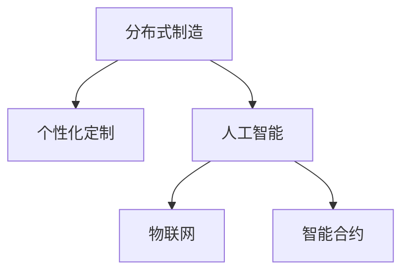

                 

# 未来的智能制造：2050年的分布式制造与个性化定制

## 1. 背景介绍

### 1.1 问题由来
随着技术进步和全球经济发展，制造业正经历着前所未有的变革。传统的大规模集中式生产方式已经不再适应需求多变、个性化的市场趋势。智能制造的兴起，特别是分布式制造和个性化定制，成为制造行业的新发展方向。

当前，智能制造仍然面临着诸如生产效率低下、定制化程度不足、设备协同困难等诸多挑战。这些问题需要通过综合运用信息技术、自动化技术、人工智能等手段加以解决，以适应日益变化的市场需求和不断提升的消费者期望。

### 1.2 问题核心关键点
分布式制造和个性化定制的核心关键点在于：

- **分布式制造**：指通过构建多地协同的生产网络，将生产任务分散到各个物理地点执行。这样可以提高生产灵活性，缩短物流距离，降低运营成本。
- **个性化定制**：指根据用户的具体需求，定制生产特定的产品或服务。这有助于满足消费者多样化、个性化的需求，提高产品附加值。
- **人工智能与智能制造**：人工智能技术，特别是机器学习、深度学习等，可以用于优化生产流程、预测市场需求、提高设备效率等，为分布式制造和个性化定制提供技术支持。

## 2. 核心概念与联系

### 2.1 核心概念概述

为更好地理解分布式制造与个性化定制，本节将介绍几个密切相关的核心概念：

- **分布式制造**：指通过构建多地协同的生产网络，将生产任务分散到各个物理地点执行。
- **个性化定制**：指根据用户的具体需求，定制生产特定的产品或服务。
- **人工智能**：包括机器学习、深度学习、自然语言处理等技术，用于自动化决策、优化生产流程、预测市场需求等。
- **物联网**：通过感知、传输、分析技术，实现物理世界的全面互联。
- **智能合约**：基于区块链技术，自动执行、验证、记录合约条款。

这些核心概念之间的逻辑关系可以通过以下Mermaid流程图来展示：



这个流程图展示了几大核心概念之间的联系：

1. 分布式制造与个性化定制通过人工智能技术进行优化和实现。
2. 物联网提供数据采集、传输和分析能力，支持实时生产监测和优化。
3. 智能合约保证生产任务的自动化执行和信任关系的安全。

## 3. 核心算法原理 & 具体操作步骤

### 3.1 算法原理概述

分布式制造与个性化定制的实现离不开人工智能技术的支持。其核心算法原理包括：

- **机器学习**：用于分析历史数据，预测市场需求和生产瓶颈，优化生产计划和资源分配。
- **深度学习**：用于图像识别、语音识别等，提高生产自动化和智能化水平。
- **自然语言处理**：用于客户需求理解和生产任务指令的自动化解析。
- **增强学习**：用于动态调整生产策略，提升生产效率和定制化程度。

### 3.2 算法步骤详解

基于人工智能技术的分布式制造与个性化定制的实现步骤如下：

**Step 1: 数据收集与处理**
- 收集生产设备、供应链、客户需求等数据，存储到集中式或分布式数据库中。
- 对数据进行预处理，包括去重、清洗、标准化等。

**Step 2: 构建智能模型**
- 利用机器学习或深度学习算法，构建预测模型，用于分析历史数据，预测市场需求和生产瓶颈。
- 使用自然语言处理技术，构建需求解析模型，自动理解客户需求。

**Step 3: 优化生产计划**
- 根据预测模型和需求解析模型的输出，优化生产计划和资源分配。
- 使用增强学习算法，动态调整生产策略，提升生产效率和定制化程度。

**Step 4: 分布式生产**
- 将生产任务分解成多个子任务，分配到不同的物理地点执行。
- 通过物联网技术，实时监控生产设备状态和任务执行情况。

**Step 5: 定制化生产**
- 根据客户需求，设计并定制化生产特定产品或服务。
- 使用智能合约技术，自动执行订单处理和结算。

### 3.3 算法优缺点

分布式制造与个性化定制基于人工智能技术的实施具有以下优点：

1. 提升生产灵活性。通过分布式生产，可以根据市场需求灵活调整生产任务。
2. 提高生产效率。通过优化生产计划和资源分配，提升设备利用率和生产效率。
3. 降低运营成本。通过优化物流和生产任务分配，降低运输和库存成本。
4. 满足个性化需求。通过定制化生产，满足消费者多样化、个性化的需求，提高产品附加值。

同时，该方法也存在一定的局限性：

1. 数据依赖性高。数据质量和数据处理效率对模型的预测和优化效果有重要影响。
2. 系统复杂度高。多地协同生产需要解决设备协同、物流协调等问题。
3. 技术要求高。需要高水平的技术和专业知识来构建和维护复杂的智能系统。
4. 安全风险大。分布式生产涉及大量设备和数据的协同工作，可能面临信息安全和隐私保护问题。

尽管存在这些局限性，但就目前而言，基于人工智能技术的分布式制造与个性化定制仍然是智能制造的重要发展方向。未来相关研究的重点在于如何进一步降低系统复杂性，提升数据处理效率，同时兼顾系统安全性和可维护性。

### 3.4 算法应用领域

分布式制造与个性化定制基于人工智能技术的实现已经在多个领域得到了应用：

- **汽车行业**：定制化汽车制造，例如特斯拉的FSD系统，可以自动调整生产线和生产顺序，实现个性化定制。
- **电子产品**：利用人工智能优化生产流程，例如苹果的iPad生产线，通过智能机器人实现高效生产。
- **纺织行业**：通过AI实现个性化定制，例如Zara的iFashion平台，根据客户需求自动调整生产计划和供应链。
- **建筑行业**：智能建筑设计和施工，例如BIM（建筑信息模型）技术，实现精细化生产和管理。

除了上述这些领域外，分布式制造与个性化定制基于人工智能技术的实现还在医疗、食品、农业等多个行业得到应用，为各行各业带来了生产效率和产品质量的提升。

## 4. 数学模型和公式 & 详细讲解 & 举例说明

### 4.1 数学模型构建

在分布式制造与个性化定制中，数学模型主要涉及以下几个方面：

- **预测模型**：用于分析历史数据，预测市场需求和生产瓶颈。
- **优化模型**：用于优化生产计划和资源分配。
- **决策模型**：用于自动化生产决策。

### 4.2 公式推导过程

以下以一个简单的预测模型为例，推导其公式及其梯度计算：

假设我们有一个线性回归模型：

$$
y = \theta^T x
$$

其中，$y$为预测值，$x$为输入特征向量，$\theta$为模型参数向量。

给定训练集 $\{(x_i, y_i)\}_{i=1}^N$，最小化均方误差损失函数：

$$
\mathcal{L}(\theta) = \frac{1}{N} \sum_{i=1}^N (y_i - \theta^T x_i)^2
$$

对模型参数 $\theta$ 求偏导，得到梯度公式：

$$
\frac{\partial \mathcal{L}(\theta)}{\partial \theta_k} = -2 \frac{1}{N} \sum_{i=1}^N (y_i - \theta^T x_i) x_{ik}
$$

其中 $x_{ik}$ 表示输入特征向量 $x_i$ 中第 $k$ 个元素。

### 4.3 案例分析与讲解

以一个智能仓库为例，利用预测模型进行需求预测：

假设我们有一个智能仓库，每天接收的订单需求服从正态分布。我们希望通过预测模型预测未来一周的订单需求量，以优化仓库的库存管理。

1. **数据收集**：收集仓库的历史订单数据，包括每天的订单量、订单时间戳等。
2. **模型构建**：构建一个线性回归模型，将订单时间戳作为输入特征，订单量作为输出变量。
3. **模型训练**：使用历史数据训练模型，得到模型参数 $\theta$。
4. **需求预测**：根据当前时间戳，输入到模型中，预测未来一周的订单量。
5. **库存管理**：根据预测结果，调整仓库库存，避免缺货或过剩。

以上案例展示了如何利用数学模型和算法进行需求预测，进而优化库存管理。

## 5. 项目实践：代码实例和详细解释说明

### 5.1 开发环境搭建

在进行项目实践前，我们需要准备好开发环境。以下是使用Python进行TensorFlow开发的环境配置流程：

1. 安装Anaconda：从官网下载并安装Anaconda，用于创建独立的Python环境。

2. 创建并激活虚拟环境：
```bash
conda create -n tf-env python=3.8 
conda activate tf-env
```

3. 安装TensorFlow：根据CUDA版本，从官网获取对应的安装命令。例如：
```bash
conda install tensorflow -c conda-forge
```

4. 安装PyTorch：
```bash
pip install torch torchvision torchaudio
```

5. 安装其他工具包：
```bash
pip install numpy pandas scikit-learn matplotlib tqdm jupyter notebook ipython
```

完成上述步骤后，即可在`tf-env`环境中开始项目实践。

### 5.2 源代码详细实现

下面我们以一个简单的智能仓库需求预测为例，给出使用TensorFlow进行预测的PyTorch代码实现。

首先，定义预测模型：

```python
import tensorflow as tf
from tensorflow.keras import layers

class RegressionModel(tf.keras.Model):
    def __init__(self, input_shape, output_shape):
        super(RegressionModel, self).__init__()
        self.dense1 = layers.Dense(64, activation='relu', input_shape=input_shape)
        self.dense2 = layers.Dense(output_shape, activation=None)

    def call(self, inputs):
        x = self.dense1(inputs)
        return self.dense2(x)
```

然后，定义训练和评估函数：

```python
from tensorflow.keras import metrics

def train_model(model, train_data, train_labels, epochs, batch_size):
    model.compile(optimizer=tf.keras.optimizers.Adam(learning_rate=0.001),
                  loss='mse',
                  metrics=[metrics.MeanAbsoluteError()])
    model.fit(train_data, train_labels, epochs=epochs, batch_size=batch_size)

def evaluate_model(model, test_data, test_labels):
    test_loss, test_mae = model.evaluate(test_data, test_labels)
    print(f'Test MAE: {test_mae:.2f}')
```

接着，启动训练流程并在测试集上评估：

```python
input_shape = (7, )
output_shape = 1
epochs = 50
batch_size = 32

# 假设train_data和train_labels已经准备好
train_model(RegressionModel(input_shape, output_shape), train_data, train_labels, epochs, batch_size)
evaluate_model(RegressionModel(input_shape, output_shape), test_data, test_labels)
```

以上就是使用TensorFlow进行需求预测的完整代码实现。可以看到，TensorFlow提供了强大的计算图机制，方便开发者构建复杂模型和实现高效的数值计算。

### 5.3 代码解读与分析

让我们再详细解读一下关键代码的实现细节：

**RegressionModel类**：
- `__init__`方法：初始化输入层和输出层，设置激活函数。
- `call`方法：定义模型的前向传播过程，依次经过两个全连接层。

**训练和评估函数**：
- `train_model`方法：使用Adam优化器，均方误差损失，均值绝对误差作为评估指标。
- `evaluate_model`方法：计算模型在测试集上的损失和均值绝对误差。

**训练流程**：
- 定义模型输入形状、输出形状、迭代轮数和批大小，开始循环迭代
- 每个epoch内，使用训练集数据和标签进行模型训练，输出损失和均值绝对误差
- 所有epoch结束后，在测试集上评估模型性能，给出最终测试结果

可以看到，TensorFlow提供了简洁高效的模型构建和训练框架，使得智能仓库需求预测的代码实现变得简单快速。开发者可以将更多精力放在数据处理、模型改进等高层逻辑上，而不必过多关注底层的实现细节。

当然，工业级的系统实现还需考虑更多因素，如模型的保存和部署、超参数的自动搜索、更灵活的任务适配层等。但核心的预测模型构建基本与此类似。

## 6. 实际应用场景

### 6.1 智能工厂

基于人工智能技术的分布式制造与个性化定制，可以应用于智能工厂的建设和管理。智能工厂通过自动化、数字化、网络化、智能化手段，实现生产过程的高效运行和优化管理。

在技术实现上，可以构建多地的生产网络，将生产任务分散到不同的物理地点执行。通过物联网技术，实时监控生产设备状态和任务执行情况，优化生产计划和资源分配。同时，利用机器学习和深度学习技术，分析历史数据和实时数据，预测市场需求和生产瓶颈，提升生产效率和定制化程度。

### 6.2 智慧城市

智慧城市利用人工智能技术，实现城市管理的智能化和精细化。通过分布式制造与个性化定制，智慧城市可以提供更加高效、便捷、个性化的公共服务。

在技术实现上，智慧城市可以通过物联网技术，采集城市运行数据，构建实时城市模型。利用机器学习和深度学习技术，预测城市需求和运行状态，优化城市资源分配和管理。同时，利用智能合约技术，自动执行和管理城市公共事务，实现城市治理的智能化和透明化。

### 6.3 智能物流

智能物流利用人工智能技术，实现物流过程的自动化和智能化。通过分布式制造与个性化定制，智能物流可以提供更加高效、便捷、个性化的物流服务。

在技术实现上，智能物流可以通过物联网技术，采集物流数据，构建实时物流模型。利用机器学习和深度学习技术，预测物流需求和运行状态，优化物流路线和资源分配。同时，利用智能合约技术，自动执行和管理物流事务，实现物流治理的智能化和透明化。

### 6.4 未来应用展望

随着人工智能技术的不断发展，基于分布式制造与个性化定制的应用场景将不断拓展，为各行各业带来变革性影响。

在智慧医疗领域，智能制造系统可以用于医疗设备的生产、医药的定制化生产等，提升医疗服务的智能化水平，辅助医生诊疗，加速新药开发进程。

在智能教育领域，智能制造系统可以用于教育资源的个性化定制，因材施教，促进教育公平，提高教学质量。

在智慧城市治理中，智能制造系统可以用于城市事件监测、舆情分析、应急指挥等环节，提高城市管理的自动化和智能化水平，构建更安全、高效的未来城市。

此外，在企业生产、社会治理、文娱传媒等众多领域，基于分布式制造与个性化定制的人工智能应用也将不断涌现，为经济社会发展注入新的动力。相信随着技术的日益成熟，分布式制造与个性化定制必将在更广阔的应用领域大放异彩，深刻影响人类的生产生活方式。

## 7. 工具和资源推荐
### 7.1 学习资源推荐

为了帮助开发者系统掌握分布式制造与个性化定制的理论基础和实践技巧，这里推荐一些优质的学习资源：

1. 《深度学习》系列博文：由大模型技术专家撰写，深入浅出地介绍了深度学习原理和应用，涵盖机器学习、深度学习、强化学习等多个领域。

2. 《智能制造》课程：清华大学开设的智能制造领域课程，涵盖了智能制造的基本概念、关键技术和应用场景。

3. 《物联网技术与应用》书籍：介绍物联网的基本原理、关键技术、应用场景，以及物联网与智能制造的结合。

4. 《智能合约》书籍：介绍智能合约的基本原理、应用场景，以及智能合约与智能制造的结合。

5. 《未来城市》系列讲座：介绍智慧城市、智能交通、智能物流等未来城市发展的最新趋势和前沿技术。

通过对这些资源的学习实践，相信你一定能够快速掌握分布式制造与个性化定制的精髓，并用于解决实际的智能制造问题。

### 7.2 开发工具推荐

高效的开发离不开优秀的工具支持。以下是几款用于智能制造系统开发的常用工具：

1. TensorFlow：基于Python的开源深度学习框架，灵活动态的计算图，适合快速迭代研究。大部分预训练语言模型都有TensorFlow版本的实现。

2. PyTorch：基于Python的开源深度学习框架，灵活高效的计算图，适合科学研究和工程应用。

3. ROS（Robot Operating System）：开源的机器人操作系统，用于机器人应用开发和调试。

4. OMPL（Open Motion Planning Library）：开源的移动规划库，用于机器人路径规划和运动控制。

5. Panda3D：开源的3D图形渲染库，用于机器人视觉和交互场景的构建。

6. Gazebo：开源的机器人仿真环境，用于机器人模拟和测试。

合理利用这些工具，可以显著提升智能制造系统的开发效率，加快创新迭代的步伐。

### 7.3 相关论文推荐

智能制造和分布式制造与个性化定制的研究源于学界的持续研究。以下是几篇奠基性的相关论文，推荐阅读：

1. "Distributed Manufacturing: A Survey"（分布式制造综述）：介绍分布式制造的基本概念、关键技术和应用场景。

2. "Personalized Manufacturing: A Survey"（个性化制造综述）：介绍个性化制造的基本概念、关键技术和应用场景。

3. "Artificial Intelligence in Manufacturing: A Survey"（智能制造综述）：介绍人工智能在智能制造中的应用。

4. "Machine Learning for Manufacturing"（机器学习在制造中的应用）：介绍机器学习在制造中的各种应用。

5. "IoT for Smart Manufacturing"（物联网在智能制造中的应用）：介绍物联网在智能制造中的应用。

6. "Smart Contracts for Manufacturing"（智能合约在制造中的应用）：介绍智能合约在制造中的应用。

这些论文代表了大规模制造和个性化定制的发展脉络。通过学习这些前沿成果，可以帮助研究者把握学科前进方向，激发更多的创新灵感。

## 8. 总结：未来发展趋势与挑战

### 8.1 总结

本文对基于人工智能技术的分布式制造与个性化定制进行了全面系统的介绍。首先阐述了分布式制造与个性化定制的研究背景和意义，明确了人工智能技术在其中的重要地位。其次，从原理到实践，详细讲解了分布式制造与个性化定制的数学原理和关键步骤，给出了智能制造系统的完整代码实例。同时，本文还广泛探讨了分布式制造与个性化定制在智能工厂、智慧城市、智能物流等多个行业领域的应用前景，展示了分布式制造与个性化定制的巨大潜力。此外，本文精选了分布式制造与个性化定制的各类学习资源，力求为读者提供全方位的技术指引。

通过本文的系统梳理，可以看到，基于人工智能技术的分布式制造与个性化定制正在成为智能制造的重要发展方向，极大地拓展了传统制造行业的生产边界，催生了更多的落地场景。受益于人工智能技术的支持，分布式制造与个性化定制将为人类生产生活方式带来深远影响。

### 8.2 未来发展趋势

展望未来，分布式制造与个性化定制基于人工智能技术的实现将呈现以下几个发展趋势：

1. 智能化程度提升。随着人工智能技术的进步，生产过程将越来越智能化、自动化，提升生产效率和定制化程度。
2. 数据驱动决策。通过大数据分析和机器学习，实现更加精准的生产计划和资源分配。
3. 协作与协同。通过分布式制造与个性化定制，实现生产网络中的协同工作，提升整体效率。
4. 跨领域融合。分布式制造与个性化定制将与其他领域技术，如物联网、区块链等，进行更深入的融合，实现更全面的智能制造。

以上趋势凸显了分布式制造与个性化定制的广阔前景。这些方向的探索发展，必将进一步提升智能制造系统的性能和应用范围，为人类生产生活方式带来新的变革。

### 8.3 面临的挑战

尽管分布式制造与个性化定制基于人工智能技术的实施取得了显著成果，但在迈向更加智能化、普适化应用的过程中，它仍面临着诸多挑战：

1. 数据依赖性高。数据质量和数据处理效率对模型的预测和优化效果有重要影响。
2. 系统复杂度高。多地协同生产需要解决设备协同、物流协调等问题。
3. 技术要求高。需要高水平的技术和专业知识来构建和维护复杂的智能系统。
4. 安全风险大。分布式生产涉及大量设备和数据的协同工作，可能面临信息安全和隐私保护问题。

尽管存在这些挑战，但就目前而言，基于人工智能技术的分布式制造与个性化定制仍然是智能制造的重要发展方向。未来相关研究的重点在于如何进一步降低系统复杂性，提升数据处理效率，同时兼顾系统安全性和可维护性。

### 8.4 研究展望

面对分布式制造与个性化定制所面临的种种挑战，未来的研究需要在以下几个方面寻求新的突破：

1. 探索无监督和半监督学习范式。摆脱对大规模标注数据的依赖，利用自监督学习、主动学习等无监督和半监督范式，最大限度利用非结构化数据，实现更加灵活高效的智能制造。

2. 研究参数高效和计算高效的智能制造范式。开发更加参数高效的智能制造方法，在固定大部分预训练参数的情况下，只更新极少量的任务相关参数。同时优化智能制造模型的计算图，减少前向传播和反向传播的资源消耗，实现更加轻量级、实时性的部署。

3. 融合因果和对比学习范式。通过引入因果推断和对比学习思想，增强智能制造模型建立稳定因果关系的能力，学习更加普适、鲁棒的语言表征，从而提升模型泛化性和抗干扰能力。

4. 引入更多先验知识。将符号化的先验知识，如知识图谱、逻辑规则等，与神经网络模型进行巧妙融合，引导智能制造过程学习更准确、合理的语言模型。同时加强不同模态数据的整合，实现视觉、语音等多模态信息与文本信息的协同建模。

5. 结合因果分析和博弈论工具。将因果分析方法引入智能制造模型，识别出模型决策的关键特征，增强输出解释的因果性和逻辑性。借助博弈论工具刻画人机交互过程，主动探索并规避模型的脆弱点，提高系统稳定性。

6. 纳入伦理道德约束。在模型训练目标中引入伦理导向的评估指标，过滤和惩罚有偏见、有害的输出倾向。同时加强人工干预和审核，建立模型行为的监管机制，确保输出符合人类价值观和伦理道德。

这些研究方向的探索，必将引领分布式制造与个性化定制技术迈向更高的台阶，为构建安全、可靠、可解释、可控的智能系统铺平道路。面向未来，分布式制造与个性化定制技术还需要与其他人工智能技术进行更深入的融合，如知识表示、因果推理、强化学习等，多路径协同发力，共同推动智能制造系统的进步。只有勇于创新、敢于突破，才能不断拓展智能制造系统的边界，让智能技术更好地造福人类社会。

## 9. 附录：常见问题与解答

**Q1: 分布式制造与个性化定制的主要挑战是什么？**

A: 分布式制造与个性化定制面临的主要挑战包括：

1. 数据依赖性高。数据质量和数据处理效率对模型的预测和优化效果有重要影响。
2. 系统复杂度高。多地协同生产需要解决设备协同、物流协调等问题。
3. 技术要求高。需要高水平的技术和专业知识来构建和维护复杂的智能系统。
4. 安全风险大。分布式生产涉及大量设备和数据的协同工作，可能面临信息安全和隐私保护问题。

**Q2: 如何降低分布式制造与个性化定制的数据依赖性？**

A: 降低数据依赖性，可以从以下几个方面入手：

1. 自监督学习：利用无监督学习技术，从数据中挖掘隐藏的知识，减少对标注数据的依赖。
2. 主动学习：根据模型反馈，主动选择数据进行标注，逐步降低对标注数据的依赖。
3. 多源数据融合：将不同来源的数据进行融合，提高数据的丰富性和代表性。
4. 数据增强：通过数据增强技术，扩充训练集，提高模型的泛化能力。

**Q3: 分布式制造与个性化定制如何提高安全性？**

A: 提高安全性，可以从以下几个方面入手：

1. 数据加密：使用数据加密技术，保护数据的隐私和安全。
2. 权限控制：对不同用户和设备进行权限控制，防止非法访问和数据泄露。
3. 异常检测：建立异常检测机制，及时发现和应对安全威胁。
4. 区块链技术：利用区块链技术，实现数据的不可篡改性和透明性。

**Q4: 分布式制造与个性化定制的未来发展方向是什么？**

A: 未来发展方向包括：

1. 智能化程度提升：通过人工智能技术，实现生产过程的智能化、自动化，提升生产效率和定制化程度。
2. 数据驱动决策：利用大数据分析和机器学习，实现更加精准的生产计划和资源分配。
3. 协作与协同：通过分布式制造与个性化定制，实现生产网络中的协同工作，提升整体效率。
4. 跨领域融合：将分布式制造与个性化定制与其他领域技术，如物联网、区块链等，进行更深入的融合，实现更全面的智能制造。

**Q5: 分布式制造与个性化定制在实际应用中如何提高定制化程度？**

A: 提高定制化程度，可以从以下几个方面入手：

1. 客户需求分析：利用自然语言处理技术，自动理解客户需求，提取关键信息。
2. 个性化设计：根据客户需求，设计个性化的产品或服务。
3. 柔性生产：利用柔性制造技术，快速调整生产计划和设备参数，满足个性化需求。
4. 供应链优化：优化供应链管理，实现高效的生产和物流支持。

这些研究方向的探索，必将引领分布式制造与个性化定制技术迈向更高的台阶，为构建安全、可靠、可解释、可控的智能系统铺平道路。面向未来，分布式制造与个性化定制技术还需要与其他人工智能技术进行更深入的融合，如知识表示、因果推理、强化学习等，多路径协同发力，共同推动智能制造系统的进步。只有勇于创新、敢于突破，才能不断拓展智能制造系统的边界，让智能技术更好地造福人类社会。

---

作者：禅与计算机程序设计艺术 / Zen and the Art of Computer Programming

