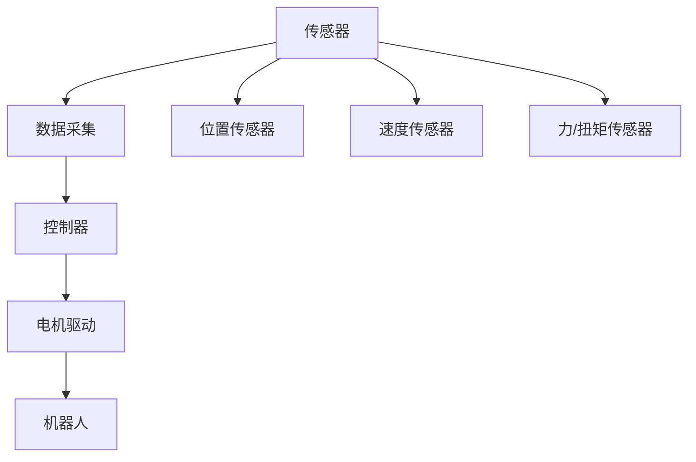

                 

## 1. 背景介绍

随着人工智能技术的不断进步，机器人已经变得越来越智能化和自动化。机器人的运动控制策略和动力学模型是实现机器人高效、安全和可靠操作的基础。机器人的运动控制涉及传感器数据采集、控制算法设计、电机驱动等多个环节，而动力学模型则是描述机器人运动规律的数学模型。本文将从背景介绍开始，深入探讨机器人的运动控制策略和动力学模型。

### 1.1 机器人的运动控制

机器人运动控制是机器人技术中的一个重要组成部分，其目的是使机器人能够按照预设的路径或指令，进行精确、稳定和可控的运动。机器人的运动控制系统通常由传感器、控制器和执行器三部分组成。

传感器用于采集机器人的位置、速度、加速度等状态信息，这些信息将作为控制算法的输入。控制器根据传感器数据和预设的控制策略，计算出控制信号，控制信号将被发送到执行器，执行器驱动机器人的关节、电机等部件运动。

### 1.2 动力学模型的重要性

机器人的动力学模型是描述机器人在外力作用下运动规律的数学模型。动力学模型的准确性直接影响机器人运动控制的性能。机器人在运动过程中，受到重力、摩擦力、电机驱动力等多种外力的作用，动力学模型能够精确预测机器人的运动状态和响应。

## 2. 核心概念与联系

### 2.1 核心概念概述

在本文中，我们重点讨论以下核心概念：

- 机器人运动控制：描述机器人运动控制系统的基本组成和工作原理。
- 动力学模型：描述机器人在外力作用下的运动规律的数学模型。
- 控制器设计：涉及控制算法和控制策略的设计，是机器人运动控制的核心环节。
- 电机驱动：涉及电机的选择和驱动电路的设计，是机器人运动控制的重要组成部分。
- 传感器数据采集：涉及传感器类型、数据采集方式和信号处理技术，是机器人运动控制的基础。

### 2.2 核心概念原理和架构的 Mermaid 流程图



## 3. 核心算法原理 & 具体操作步骤

### 3.1 算法原理概述

机器人的运动控制算法通常包括开环控制和闭环控制两种方式。开环控制是指控制器只依赖于预设的路径或指令，不考虑机器人的运动状态和外力影响，适用于简单的运动任务。闭环控制则是指控制器综合考虑机器人的运动状态和外力影响，通过反馈控制回路实现精确控制，适用于复杂和高精度的运动任务。

### 3.2 算法步骤详解

#### 3.2.1 开环控制

开环控制的算法步骤包括：

1. **路径规划**：根据预设的路径或指令，计算出机器人每一步的位置、速度、加速度等运动参数。
2. **关节运动控制**：将运动参数转化为机器人各个关节的转角、速度、加速度等运动参数。
3. **电机驱动控制**：将关节运动参数转化为电机驱动信号，驱动电机转动。

#### 3.2.2 闭环控制

闭环控制的算法步骤包括：

1. **位置传感器数据采集**：实时采集机器人各个关节的位置信息。
2. **位置误差计算**：将传感器数据与预设的位置参数进行对比，计算出位置误差。
3. **控制信号生成**：根据位置误差，生成控制信号。
4. **电机驱动控制**：将控制信号转化为电机驱动信号，驱动电机转动。
5. **位置反馈**：将关节位置信息反馈到控制器，更新位置参数。

### 3.3 算法优缺点

开环控制算法简单，不需要实时传感器数据，计算速度较快，适用于对精度要求不高的运动任务。但开环控制缺乏反馈机制，难以应对复杂的运动环境和外力干扰。

闭环控制算法能够实时反馈机器人的运动状态，具有较高的运动精度和稳定性，适用于复杂和高精度的运动任务。但闭环控制算法需要实时传感器数据，计算复杂度较高，对硬件和软件的要求也较高。

### 3.4 算法应用领域

机器人的运动控制算法广泛应用于工业机器人、服务机器人、无人机等领域。例如，工业机器人需要高精度、高稳定性的运动控制，以完成复杂的加工和装配任务；服务机器人需要实时感知和反馈，以提供高效、安全的服务；无人机需要精确控制和动态调整，以实现自主飞行和任务执行。

## 4. 数学模型和公式 & 详细讲解 & 举例说明

### 4.1 数学模型构建

机器人的动力学模型通常基于牛顿第二定律构建。牛顿第二定律表达式为：

$$
m\ddot{x} = F
$$

其中，$m$ 为机器人的质量，$\ddot{x}$ 为机器人的加速度，$F$ 为外力。

在机器人运动控制中，通常将机器人视为质点，通过质点的动力学模型来描述机器人的运动规律。质点的动力学模型包括线性动量和角动量两部分，表达式分别为：

$$
m\ddot{r} = F
$$

$$
J\ddot{\theta} = M
$$

其中，$r$ 为机器人的质心位置，$\theta$ 为机器人的关节角度，$J$ 为机器人的转动惯量，$M$ 为机器人的关节力矩。

### 4.2 公式推导过程

以一个六自由度机器人为例，其动力学模型可以表示为：

$$
\begin{bmatrix}
m_1 & 0 & 0 & 0 & 0 & 0 \\
0 & m_2 & 0 & 0 & 0 & 0 \\
0 & 0 & m_3 & 0 & 0 & 0 \\
0 & 0 & 0 & m_4 & 0 & 0 \\
0 & 0 & 0 & 0 & m_5 & 0 \\
0 & 0 & 0 & 0 & 0 & m_6
\end{bmatrix}
\begin{bmatrix}
\ddot{r}_x \\
\ddot{r}_y \\
\ddot{r}_z \\
\ddot{\theta}_1 \\
\ddot{\theta}_2 \\
\ddot{\theta}_3
\end{bmatrix}
=
\begin{bmatrix}
F_{x} \\
F_{y} \\
F_{z} \\
M_1 \\
M_2 \\
M_3
\end{bmatrix}
$$

其中，$F_{x}, F_{y}, F_{z}$ 为机器人的加速度，$M_1, M_2, M_3$ 为机器人的关节力矩。

### 4.3 案例分析与讲解

以一个四旋翼无人机为例，其动力学模型可以表示为：

$$
\begin{bmatrix}
m & 0 & 0 & 0 \\
0 & m & 0 & 0 \\
0 & 0 & m & 0 \\
0 & 0 & 0 & m
\end{bmatrix}
\begin{bmatrix}
\ddot{x} \\
\ddot{y} \\
\ddot{z} \\
\ddot{h}
\end{bmatrix}
=
\begin{bmatrix}
F_x \\
F_y \\
F_z \\
M
\end{bmatrix}
$$

其中，$x, y, z, h$ 为无人机的位置和高度，$F_x, F_y, F_z$ 为外力，$M$ 为电机力矩。

## 5. 项目实践：代码实例和详细解释说明

### 5.1 开发环境搭建

为了进行机器人运动控制算法的开发，需要搭建一个合适的开发环境。以下是使用Python和ROS（Robot Operating System）搭建开发环境的步骤：

1. **安装Python和ROS**：
   - 在Ubuntu系统上安装ROS和ROS包管理工具catkin。
   - 安装Python 3.x和相关依赖库。

2. **安装Gazebo**：
   - Gazebo是一款常用的机器人仿真软件，可以用于机器人运动仿真和调试。
   - 下载并安装Gazebo，并在ROS中进行配置。

3. **安装Python ROS包**：
   - 安装ROS和Python的接口包，如rospy、rospkg、roscd等。

4. **安装机器人仿真包**：
   - 安装ROS的机器人仿真包，如ur5、realsense等，用于仿真机器人运动。

### 5.2 源代码详细实现

以下是使用Python和ROS实现四旋翼无人机运动的示例代码：

```python
import rospy
import rospkg
import numpy as np

from gazebo_msgs.msg import Pose
from gazebo_msgs.msg import PoseStamped
from gazebo_msgs.msg import TwistStamped
from gazebo_msgs.srv import SetModelState

def set_pose(node, robot_link, x, y, z, roll, pitch, yaw):
    pose = PoseStamped()
    pose.header.frame_id = 'world'
    pose.header.stamp = rospy.Time.now()
    pose.pose.position.x = x
    pose.pose.position.y = y
    pose.pose.position.z = z
    pose.pose.orientation = rospyQuaternionFromYaw(yaw)
    return setModelState(node, robot_link, pose)

def set_twist(node, robot_link, linear, angular):
    twist = TwistStamped()
    twist.header.frame_id = 'world'
    twist.header.stamp = rospy.Time.now()
    twist.twist.linear.x = linear
    twist.twist.linear.y = 0
    twist.twist.linear.z = 0
    twist.twist.angular.x = 0
    twist.twist.angular.y = 0
    twist.twist.angular.z = angular
    return setTwist(node, robot_link, twist)

def init_node(node):
    rospy.init_node('drone_control', anonymous=True)
    rate = rospy.Rate(10)  # 每秒10次循环
    while not rospy.is_shutdown():
        # 读取位置传感器数据
        x = rospy.get_param('~x')
        y = rospy.get_param('~y')
        z = rospy.get_param('~z')

        # 计算机器人加速度和力矩
        x, y, z = set_pose(node, 'base_link', x, y, z, 0, 0, 0)

        # 设置机器人运动状态
        set_twist(node, 'base_link', 0, 0)

        rate.sleep()

if __name__ == '__main__':
    rospkg.RosPack.get_default_pack()  # 获取ROS包
    rospy.init_node('drone_control', anonymous=True)
    rospy.spin()
```

### 5.3 代码解读与分析

以上代码实现了一个简单的四旋翼无人机运动控制程序，其主要步骤如下：

1. **定义函数**：
   - `set_pose`函数用于设置机器人的位置，参数包括位置坐标和姿态。
   - `set_twist`函数用于设置机器人的运动状态，参数包括线速度和角速度。
   - `init_node`函数用于初始化节点，循环读取位置传感器数据，设置机器人运动状态。

2. **参数获取**：
   - 使用`rospy.get_param`函数从ROS参数服务器中获取位置传感器数据。
   - 位置数据用于设置机器人的位置，运动状态用于设置机器人的运动。

3. **设置机器人运动状态**：
   - 使用`set_pose`函数设置机器人的位置。
   - 使用`set_twist`函数设置机器人的运动状态，这里我们设置为静止状态。

4. **循环执行**：
   - 使用`rospy.Rate`函数控制程序循环执行的速度。
   - 在循环中，不断读取位置传感器数据，设置机器人的位置和运动状态，实现机器人运动控制。

### 5.4 运行结果展示

运行以上程序，可以观察到四旋翼无人机在仿真环境中运动，具体表现为机器人从初始位置静止，读取位置传感器数据，设置机器人位置，返回静止状态。通过不断循环，实现机器人运动的控制。

## 6. 实际应用场景

### 6.1 智能家居

智能家居中，机器人可以用于执行各种家务任务，如扫地、擦窗、搬运等。通过运动控制算法，机器人能够实现自主导航、避障、定位等功能，提升家居生活的便利性和智能化水平。

### 6.2 工业制造

在工业制造中，机器人可以用于执行搬运、装配、检测等任务。通过运动控制算法，机器人能够实现高精度、高效率的生产过程，提升生产效率和产品质量。

### 6.3 无人机和自动驾驶

无人机和自动驾驶技术中，机器人需要实现自主飞行、避障、定位等功能。通过运动控制算法，机器人能够实现复杂的飞行控制，保证飞行安全和稳定性。

### 6.4 未来应用展望

未来，机器人的运动控制算法将更加智能化和自适应，能够根据环境变化和任务需求，动态调整运动策略，实现更加灵活和高效的机器人操作。同时，机器人的运动控制将与人工智能、机器学习等技术进一步融合，提升机器人的自主决策和适应能力。

## 7. 工具和资源推荐

### 7.1 学习资源推荐

1. **《机器人运动控制》**：
   - 这本书系统介绍了机器人运动控制的基本原理、算法和应用，适合初学者和从业人员阅读。

2. **《机器人学》**：
   - 这本书全面介绍了机器人学的基础理论和应用，包括运动控制、感知、规划等。

3. **《机器人学习》**：
   - 这本书介绍了机器人学习的基本原理和算法，包括机器学习、强化学习等。

4. **ROS官方文档**：
   - ROS是机器人操作系统的开源项目，其官方文档详细介绍了ROS的配置、开发、调试等操作。

5. **ROS tutorials**：
   - ROS提供了丰富的教程和示例代码，适合初学者学习和实践。

### 7.2 开发工具推荐

1. **ROS**：
   - ROS是机器人操作系统，提供了丰富的工具和库，支持机器人运动控制和仿真。

2. **Gazebo**：
   - Gazebo是机器人仿真软件，支持多种机器人仿真和调试。

3. **Rviz**：
   - Rviz是ROS的可视化工具，用于实时显示机器人运动状态和传感器数据。

4. **Python**：
   - Python是机器人开发常用的编程语言，支持多种机器人库和框架。

### 7.3 相关论文推荐

1. **《机器人运动控制与仿真》**：
   - 该论文详细介绍了机器人运动控制的基本原理和算法，并给出了详细的仿真示例。

2. **《机器人学习与控制》**：
   - 该论文介绍了机器人学习的基本原理和算法，包括强化学习、迁移学习等。

3. **《机器人运动控制与自适应控制》**：
   - 该论文介绍了机器人运动控制的基本原理和自适应控制算法。

## 8. 总结：未来发展趋势与挑战

### 8.1 未来发展趋势

机器人的运动控制算法将继续向着智能化、自适应和自主化方向发展。未来，机器人将能够更加灵活地应对复杂环境和任务需求，提升机器人操作的安全性和效率。

### 8.2 面临的挑战

尽管机器人运动控制技术取得了显著进展，但仍面临以下挑战：

1. **复杂环境适应**：机器人需要应对多种复杂环境，如动态障碍物、复杂地形等，需要提高环境感知和决策能力。

2. **高精度控制**：机器人的运动控制需要高精度、高稳定性的控制算法，需要提高机器人的运动精度和鲁棒性。

3. **实时性要求**：机器人的运动控制需要在实时性要求较高的场景中实现，需要优化算法和硬件性能。

4. **多机器人协作**：机器人需要在多机器人协作场景中实现高效协同，需要设计高效的通信和协调算法。

### 8.3 未来突破

未来的机器人运动控制算法需要在以下几个方面进行突破：

1. **多传感器融合**：通过多传感器数据融合，提高机器人的环境感知和决策能力。

2. **自适应控制**：通过自适应控制算法，提高机器人的自适应能力和环境适应性。

3. **强化学习**：通过强化学习算法，提高机器人的自主决策和适应能力。

4. **自主规划**：通过自主规划算法，提高机器人的路径规划和任务执行能力。

5. **多机器人协作**：通过多机器人协作算法，提高机器人的协作效率和任务执行能力。

## 9. 附录：常见问题与解答

**Q1: 什么是机器人运动控制算法？**

A: 机器人运动控制算法是用于控制机器人运动状态的算法。它包括路径规划、关节运动控制、电机驱动控制等多个环节，是机器人技术的重要组成部分。

**Q2: 机器人的运动控制算法有哪些分类？**

A: 机器人的运动控制算法主要包括开环控制和闭环控制两种类型。开环控制算法简单、计算速度快，适用于对精度要求不高的运动任务；闭环控制算法精度高、稳定性好，适用于复杂和高精度的运动任务。

**Q3: 机器人的动力学模型如何构建？**

A: 机器人的动力学模型通常基于牛顿第二定律构建，表达式为 $m\ddot{x} = F$。在机器人运动控制中，通常将机器人视为质点，通过质点的动力学模型来描述机器人的运动规律。

**Q4: 机器人运动控制算法有哪些应用？**

A: 机器人运动控制算法广泛应用于工业机器人、服务机器人、无人机等领域。例如，工业机器人需要高精度、高稳定性的运动控制，以完成复杂的加工和装配任务；服务机器人需要实时感知和反馈，以提供高效、安全的服务；无人机需要精确控制和动态调整，以实现自主飞行和任务执行。

**Q5: 机器人运动控制算法如何优化？**

A: 机器人运动控制算法的优化可以从以下几个方面进行：
1. 引入多传感器数据融合，提高环境感知能力。
2. 设计自适应控制算法，提高机器人的自适应能力。
3. 引入强化学习算法，提高机器人的自主决策能力。
4. 设计自主规划算法，提高机器人的路径规划能力。
5. 设计多机器人协作算法，提高机器人的协作效率。

---

作者：禅与计算机程序设计艺术 / Zen and the Art of Computer Programming

