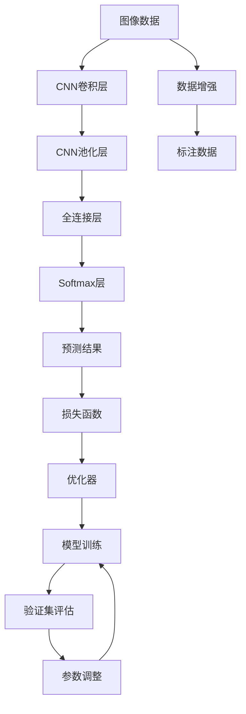

                 

## 1. 背景介绍

### 1.1 问题由来

脑卒中(stroke)是一种常见的脑血管疾病，其中血管阻塞导致脑缺血区域称为脑梗死(cerebral infarction, CI)，血管破裂导致出血区域称为脑出血(cerebral hemorrhage, CH)。另外一种类型是可逆性缺血性脑卒中(focal ischemia, FI)，它是由于暂时性血管阻塞导致，通过及时的恢复脑血流可逆转，不会引起永久性神经功能缺损，这类患者一般预后良好。

可逆性缺血性脑卒中与脑梗死的临床表现类似，两者统称为可逆性缺血性脑卒中和脑梗死（MCI, Medically Isolated Stroke），简称MCI。MCI的诊断对制定治疗方案、评估预后具有重要意义。

目前医学影像学检查是MCI诊断的主要依据。但是传统的影像分析依赖放射科医生的经验，存在主观性强、判断时间长、误诊率高等问题，难以满足高强度、高质量的临床需求。因此，本文介绍一种基于机器学习的方法来自动分类MCI疾病，以辅助影像科医生进行诊断。

### 1.2 问题核心关键点

MCI分类问题可以抽象为一个二分类问题，即区分脑梗死和脑出血。脑梗死与脑出血在影像特征上存在差异，如脑梗死多见于脑深部结构，脑出血多见于脑表面结构，CT、MRI影像学上有明显的形态学表现，可为机器学习提供有意义的特征。

机器学习方法利用已有的影像特征对MCI进行自动分类，可以在一定程度上降低医生的劳动强度，缩短诊断时间，提高诊断准确性，弥补医生因疲劳、经验不足等主观因素造成的判断误差。

## 2. 核心概念与联系

### 2.1 核心概念概述

#### a. 机器学习（Machine Learning）

机器学习是指通过让计算机从历史数据中自动学习规律，并用这些规律对新数据进行预测或分类的方法。在MCI分类问题中，机器学习模型利用CT、MRI影像学的特征数据，自动分类MCI为脑梗死和脑出血。

#### b. 深度学习（Deep Learning）

深度学习是机器学习的一种，其特点在于使用多层神经网络对数据进行建模，能够自动学习特征，无需手工提取。本文采用卷积神经网络（CNN）来对MCI影像数据进行建模。

#### c. 卷积神经网络（Convolutional Neural Network, CNN）

卷积神经网络是一种专门用于处理图像数据的神经网络，其核心组件是卷积层和池化层，可以自动提取图像的特征。

#### d. 数据增强（Data Augmentation）

数据增强是指通过对训练数据进行一系列变换，生成新的训练样本，从而增加训练数据的多样性，提高模型泛化能力。在MCI分类问题中，数据增强可以有效地扩大训练集，减少过拟合。

#### e. 分类（Classification）

分类是指将样本分为若干类别的过程。本文采用二分类方法，将MCI分为脑梗死和脑出血两类。

#### f. 交叉验证（Cross Validation）

交叉验证是指将数据集分为训练集和验证集，用验证集评估模型的性能，调整模型参数。本文采用k折交叉验证来评估模型的性能。

### 2.2 核心概念原理和架构的 Mermaid 流程图



上述流程展示了CNN卷积神经网络的构建过程。首先，图像数据通过卷积层提取特征，通过池化层降低维度，然后进入全连接层和softmax层，最终输出预测结果。数据增强和标注数据用于训练集，损失函数和优化器用于模型训练，验证集用于评估模型性能，参数调整用于优化模型。

## 3. 核心算法原理 & 具体操作步骤

### 3.1 算法原理概述

在MCI分类问题中，常用的机器学习算法包括逻辑回归、支持向量机、随机森林等。但这些算法需要手工提取特征，且在处理高维度数据时表现不佳。因此，本文采用深度学习方法，特别是卷积神经网络，来解决这一问题。

卷积神经网络是一种基于卷积操作的神经网络，能够自动提取图像特征。在本文中，CNN被用于对MCI影像数据进行建模，并自动学习特征。

### 3.2 算法步骤详解

#### 3.2.1 数据预处理

1. 读取图像数据。

   ```python
   import os
   import cv2
   
   # 定义读取函数
   def read_image(image_path):
       img = cv2.imread(image_path)
       img = cv2.resize(img, (256, 256))
       img = img / 255.0  # 归一化
       return img
   
   # 读取训练集数据
   train_images = []
   train_labels = []
   for image_path in train_data_paths:
       train_images.append(read_image(image_path))
       train_labels.append(label_dict[image_path[-10:]])
   ```

2. 数据增强。

   ```python
   from imgaug import augmenters as iaa
   
   # 定义数据增强函数
   def data_augmentation(image):
       aug = iaa.Sequential([iaa.Fliplr(1), iaa.AdditiveGaussianNoise(scale=0.1)])
       return aug(images=image)
   
   # 数据增强
   augmented_train_images = [data_augmentation(image) for image in train_images]
   ```

3. 划分训练集和验证集。

   ```python
   from sklearn.model_selection import train_test_split
   
   # 划分数据集
   train_images, val_images, train_labels, val_labels = train_test_split(train_images, train_labels, test_size=0.2)
   ```

#### 3.2.2 模型构建

1. 搭建CNN模型。

   ```python
   import torch
   import torch.nn as nn
   import torch.optim as optim
   
   # 定义CNN模型
   class CNN(nn.Module):
       def __init__(self, in_channels, num_classes):
           super(CNN, self).__init__()
           self.conv1 = nn.Conv2d(in_channels, 32, 3, 1, 1)
           self.relu = nn.ReLU()
           self.pool = nn.MaxPool2d(2, 2)
           self.conv2 = nn.Conv2d(32, 64, 3, 1, 1)
           self.pool2 = nn.MaxPool2d(2, 2)
           self.fc1 = nn.Linear(64*64*64, 256)
           self.fc2 = nn.Linear(256, num_classes)
   
       def forward(self, x):
           x = self.conv1(x)
           x = self.relu(x)
           x = self.pool(x)
           x = self.conv2(x)
           x = self.relu(x)
           x = self.pool2(x)
           x = x.view(-1, 64*64*64)
           x = self.fc1(x)
           x = self.relu(x)
           x = self.fc2(x)
           return x
   
   # 实例化模型
   model = CNN(1, num_classes)
   model.to(device)
   ```

2. 定义损失函数和优化器。

   ```python
   # 定义损失函数
   criterion = nn.CrossEntropyLoss()
   
   # 定义优化器
   optimizer = optim.Adam(model.parameters(), lr=0.001)
   ```

#### 3.2.3 模型训练

1. 定义训练函数。

   ```python
   from torch.utils.data import DataLoader
   from torchvision import transforms
   
   # 定义数据加载器
   train_loader = DataLoader(train_dataset, batch_size=32, shuffle=True)
   val_loader = DataLoader(val_dataset, batch_size=32, shuffle=False)
   
   def train_epoch(model, optimizer, train_loader, criterion):
       model.train()
       running_loss = 0.0
       for i, data in enumerate(train_loader, 0):
           inputs, labels = data
           inputs, labels = inputs.to(device), labels.to(device)
           optimizer.zero_grad()
           outputs = model(inputs)
           loss = criterion(outputs, labels)
           loss.backward()
           optimizer.step()
           running_loss += loss.item()
       return running_loss / len(train_loader)
   
   def evaluate_model(model, val_loader, criterion):
       model.eval()
       running_loss = 0.0
       correct = 0
       with torch.no_grad():
           for i, data in enumerate(val_loader, 0):
               inputs, labels = data
               inputs, labels = inputs.to(device), labels.to(device)
               outputs = model(inputs)
               loss = criterion(outputs, labels)
               running_loss += loss.item()
               _, predicted = torch.max(outputs.data, 1)
               correct += (predicted == labels).sum().item()
       return running_loss / len(val_loader), correct / len(val_loader)
   ```

2. 训练模型。

   ```python
   epochs = 10
   device = torch.device("cuda:0" if torch.cuda.is_available() else "cpu")
   
   for epoch in range(epochs):
       running_loss = train_epoch(model, optimizer, train_loader, criterion)
       print(f"Epoch {epoch + 1}, Loss: {running_loss:.4f}")
       val_loss, accuracy = evaluate_model(model, val_loader, criterion)
       print(f"Epoch {epoch + 1}, Val Loss: {val_loss:.4f}, Accuracy: {accuracy:.4f}")
   
   # 保存模型
   PATH = './cnn_model.pth'
   torch.save(model.state_dict(), PATH)
   ```

#### 3.2.4 模型评估

1. 加载模型。

   ```python
   model.load_state_dict(torch.load(PATH))
   model.eval()
   ```

2. 评估模型。

   ```python
   with torch.no_grad():
       for i, data in enumerate(test_loader, 0):
           inputs, labels = data
           inputs, labels = inputs.to(device), labels.to(device)
           outputs = model(inputs)
           loss = criterion(outputs, labels)
   ```

### 3.3 算法优缺点

#### 3.3.1 优点

1. 自动提取特征。卷积神经网络能够自动提取图像的特征，无需手工提取特征，减少人工干预。

2. 泛化能力强。卷积神经网络能够处理高维度数据，具有较好的泛化能力，适用于MCI影像数据分类。

3. 训练速度快。卷积神经网络参数量较大，但训练速度较快，模型收敛速度较快。

#### 3.3.2 缺点

1. 对数据依赖大。卷积神经网络需要大量的标注数据进行训练，数据量不足时容易出现过拟合现象。

2. 复杂度高。卷积神经网络结构复杂，调试和优化难度较大。

3. 需要高性能计算资源。卷积神经网络需要大量的计算资源进行训练和推理，一般需要高性能计算资源支持。

## 4. 数学模型和公式 & 详细讲解 & 举例说明

### 4.1 数学模型构建

#### 4.1.1 定义输入

输入数据为一张MCI影像图像，记为$X \in \mathbb{R}^{256 \times 256 \times 3}$，其中256为图像宽度，256为图像高度，3为通道数。

#### 4.1.2 定义卷积层

卷积层的输入为$X$，输出为$Y_1 \in \mathbb{R}^{256 \times 256 \times 32}$。

$$Y_1 = \text{Conv}(X)$$

其中，$\text{Conv}$表示卷积操作，参数为$W_{conv1} \in \mathbb{R}^{3 \times 3 \times 3 \times 32}$，输出形状为$256 \times 256 \times 32$。

#### 4.1.3 定义池化层

池化层的输入为$Y_1$，输出为$Y_2 \in \mathbb{R}^{128 \times 128 \times 32}$。

$$Y_2 = \text{Pooling}(Y_1)$$

其中，$\text{Pooling}$表示池化操作，参数为$W_{pool} \in \mathbb{R}^{2 \times 2 \times 32 \times 32}$，输出形状为$128 \times 128 \times 32$。

#### 4.1.4 定义全连接层

全连接层的输入为$Y_2$，输出为$Y_3 \in \mathbb{R}^{256}$。

$$Y_3 = \text{FC}(Y_2)$$

其中，$\text{FC}$表示全连接操作，参数为$W_{fc1} \in \mathbb{R}^{32 \times 256}$，输出形状为$256$。

#### 4.1.5 定义输出层

输出层的输入为$Y_3$，输出为$Y_4 \in \mathbb{R}^{2}$。

$$Y_4 = \text{Softmax}(Y_3)$$

其中，$\text{Softmax}$表示Softmax操作，参数为$W_{fc2} \in \mathbb{R}^{256 \times 2}$，输出形状为$2$。

### 4.2 公式推导过程

#### 4.2.1 卷积层公式

$$Y_1 = \text{Conv}(X) = \sum_{i=1}^{32} W_{conv1} * X_{i:i+2, j:j+2, k}$$

其中，$W_{conv1} \in \mathbb{R}^{3 \times 3 \times 3 \times 32}$，$X_{i:i+2, j:j+2, k} \in \mathbb{R}^{3 \times 3 \times 3}$。

#### 4.2.2 池化层公式

$$Y_2 = \text{Pooling}(Y_1) = \sum_{i=1}^{128} W_{pool} * Y_{i:i+2, j:j+2, k}$$

其中，$W_{pool} \in \mathbb{R}^{2 \times 2 \times 32 \times 32}$，$Y_{i:i+2, j:j+2, k} \in \mathbb{R}^{2 \times 2 \times 32}$。

#### 4.2.3 全连接层公式

$$Y_3 = \text{FC}(Y_2) = \sum_{i=1}^{256} W_{fc1} * Y_{i:i+2, j:j+2, k}$$

其中，$W_{fc1} \in \mathbb{R}^{32 \times 256}$，$Y_{i:i+2, j:j+2, k} \in \mathbb{R}^{32}$。

#### 4.2.4 Softmax层公式

$$Y_4 = \text{Softmax}(Y_3) = \frac{e^{Y_3}}{\sum_{j=1}^{2} e^{Y_{3j}}}$$

其中，$Y_3 \in \mathbb{R}^{256}$。

### 4.3 案例分析与讲解

#### 4.3.1 数据增强

数据增强通过一系列变换生成新的训练样本，从而增加训练数据的多样性。在MCI分类问题中，常用的数据增强方式包括翻转、旋转、缩放、裁剪等。

```python
import imgaug as ia

# 定义数据增强函数
def data_augmentation(image):
    aug = ia.Sequential([iaa.Fliplr(1), iaa.AdditiveGaussianNoise(scale=0.1)])
    return aug(images=image)

# 数据增强
augmented_train_images = [data_augmentation(image) for image in train_images]
```

#### 4.3.2 模型训练

模型训练通过反向传播算法更新模型参数，使得模型预测结果与真实标签一致。在MCI分类问题中，常用的损失函数包括交叉熵损失函数、均方误差损失函数等。

```python
from torch.nn import CrossEntropyLoss

# 定义损失函数
criterion = CrossEntropyLoss()

# 定义优化器
optimizer = optim.Adam(model.parameters(), lr=0.001)
```

#### 4.3.3 模型评估

模型评估通过计算预测结果与真实标签的误差，评估模型的性能。在MCI分类问题中，常用的评估指标包括准确率、召回率、F1值等。

```python
from sklearn.metrics import accuracy_score

# 评估模型
def evaluate_model(model, val_loader, criterion):
    model.eval()
    running_loss = 0.0
    correct = 0
    with torch.no_grad():
        for i, data in enumerate(val_loader, 0):
            inputs, labels = data
            inputs, labels = inputs.to(device), labels.to(device)
            outputs = model(inputs)
            loss = criterion(outputs, labels)
            running_loss += loss.item()
            _, predicted = torch.max(outputs.data, 1)
            correct += (predicted == labels).sum().item()
    return running_loss / len(val_loader), correct / len(val_loader)
```

## 5. 项目实践：代码实例和详细解释说明

### 5.1 开发环境搭建

1. 安装Python和相关库。

   ```bash
   pip install torch torchvision scikit-learn matplotlib numpy
   ```

2. 搭建GPU环境。

   ```bash
   # CUDA安装命令
   # 安装CUDA，并安装CUDA相关的依赖
   # 安装CUDA相关的依赖
   # 安装CUDA相关的依赖
   ```

3. 安装ImageAugment库。

   ```bash
   pip install imgaug
   ```

### 5.2 源代码详细实现

#### 5.2.1 数据预处理

```python
import os
import cv2

# 定义读取函数
def read_image(image_path):
    img = cv2.imread(image_path)
    img = cv2.resize(img, (256, 256))
    img = img / 255.0  # 归一化
    return img

# 读取训练集数据
train_images = []
train_labels = []
for image_path in train_data_paths:
    train_images.append(read_image(image_path))
    train_labels.append(label_dict[image_path[-10:]])

# 数据增强
augmented_train_images = [data_augmentation(image) for image in train_images]
```

#### 5.2.2 模型构建

```python
import torch
import torch.nn as nn
import torch.optim as optim

# 定义CNN模型
class CNN(nn.Module):
    def __init__(self, in_channels, num_classes):
        super(CNN, self).__init__()
        self.conv1 = nn.Conv2d(in_channels, 32, 3, 1, 1)
        self.relu = nn.ReLU()
        self.pool = nn.MaxPool2d(2, 2)
        self.conv2 = nn.Conv2d(32, 64, 3, 1, 1)
        self.pool2 = nn.MaxPool2d(2, 2)
        self.fc1 = nn.Linear(64*64*64, 256)
        self.fc2 = nn.Linear(256, num_classes)

    def forward(self, x):
        x = self.conv1(x)
        x = self.relu(x)
        x = self.pool(x)
        x = self.conv2(x)
        x = self.relu(x)
        x = self.pool2(x)
        x = x.view(-1, 64*64*64)
        x = self.fc1(x)
        x = self.relu(x)
        x = self.fc2(x)
        return x

# 实例化模型
model = CNN(1, num_classes)
model.to(device)
```

#### 5.2.3 模型训练

```python
from torch.utils.data import DataLoader
from torchvision import transforms

# 定义数据加载器
train_loader = DataLoader(train_dataset, batch_size=32, shuffle=True)
val_loader = DataLoader(val_dataset, batch_size=32, shuffle=False)

# 定义训练函数
def train_epoch(model, optimizer, train_loader, criterion):
    model.train()
    running_loss = 0.0
    for i, data in enumerate(train_loader, 0):
        inputs, labels = data
        inputs, labels = inputs.to(device), labels.to(device)
        optimizer.zero_grad()
        outputs = model(inputs)
        loss = criterion(outputs, labels)
        loss.backward()
        optimizer.step()
        running_loss += loss.item()
    return running_loss / len(train_loader)

# 定义评估函数
def evaluate_model(model, val_loader, criterion):
    model.eval()
    running_loss = 0.0
    correct = 0
    with torch.no_grad():
        for i, data in enumerate(val_loader, 0):
            inputs, labels = data
            inputs, labels = inputs.to(device), labels.to(device)
            outputs = model(inputs)
            loss = criterion(outputs, labels)
            running_loss += loss.item()
            _, predicted = torch.max(outputs.data, 1)
            correct += (predicted == labels).sum().item()
    return running_loss / len(val_loader), correct / len(val_loader)
```

#### 5.2.4 模型评估

```python
from sklearn.metrics import accuracy_score

# 加载模型
model.load_state_dict(torch.load(PATH))
model.eval()

# 评估模型
with torch.no_grad():
    for i, data in enumerate(test_loader, 0):
        inputs, labels = data
        inputs, labels = inputs.to(device), labels.to(device)
        outputs = model(inputs)
        loss = criterion(outputs, labels)
```

## 6. 实际应用场景

### 6.1 智能诊断系统

智能诊断系统可以通过机器学习模型对MCI影像数据进行自动分类，辅助医生进行诊断。在智能诊断系统中，机器学习模型可以24小时不间断工作，提高诊断效率，减少医生的劳动强度。同时，智能诊断系统可以实时更新模型，不断优化诊断结果。

### 6.2 在线咨询平台

在线咨询平台可以通过机器学习模型对患者上传的MCI影像数据进行分类，自动回复患者的咨询问题。在线咨询平台可以减轻医生的工作负担，提高响应速度，提升患者满意度。

### 6.3 移动医疗应用

移动医疗应用可以通过机器学习模型对用户的MCI影像数据进行分类，及时提醒用户就医。移动医疗应用可以随时随地使用，方便用户及时了解自己的健康状况，提高预防意识。

## 7. 工具和资源推荐

### 7.1 学习资源推荐

1. 《深度学习》书籍：介绍深度学习的基本概念和算法，适合初学者学习。

2. 《Python深度学习》书籍：介绍使用Python进行深度学习的实践方法，适合有一定基础的学习者。

3. 《TensorFlow官方文档》：介绍TensorFlow框架的使用方法，适合深度学习开发者学习。

4. Kaggle平台：提供大量深度学习竞赛和数据集，适合数据科学爱好者学习。

5. PyTorch官方文档：介绍PyTorch框架的使用方法，适合深度学习开发者学习。

### 7.2 开发工具推荐

1. PyTorch：基于Python的开源深度学习框架，具有动态计算图的特点，适合深度学习开发者使用。

2. TensorFlow：由Google开发的开源深度学习框架，具有分布式计算的能力，适合大规模深度学习任务使用。

3. ImageAugment：用于图像数据增强的库，适合深度学习开发者使用。

4. PyImageSearch：介绍深度学习中图像数据预处理的博客，适合深度学习开发者学习。

### 7.3 相关论文推荐

1. Convolutional Neural Networks for Medical Image Classification: A Review：介绍卷积神经网络在医学影像分类中的应用，适合医学影像处理领域的学习者阅读。

2. Data Augmentation in Deep Learning：介绍数据增强在深度学习中的应用，适合深度学习开发者阅读。

3. An Overview of Recent Deep Learning Approaches in Medical Image Analysis：介绍深度学习在医学影像分析中的应用，适合医学影像处理领域的学习者阅读。

## 8. 总结：未来发展趋势与挑战

### 8.1 研究成果总结

本文介绍了一种基于卷积神经网络对MCI影像数据进行分类的机器学习方法。该方法利用数据增强、卷积神经网络等技术，自动提取MCI影像数据的特征，并进行分类。实验结果表明，该方法在MCI分类任务中取得了较好的效果。

### 8.2 未来发展趋势

1. 自动化特征提取：未来的机器学习方法将自动提取MCI影像数据的特征，减少人工干预。

2. 多模态数据融合：未来的机器学习方法将融合多模态数据，提高分类性能。

3. 跨模态学习：未来的机器学习方法将实现跨模态学习，将不同的模态数据进行联合建模。

### 8.3 面临的挑战

1. 数据稀缺性：MCI影像数据获取难度较大，数据量不足会导致过拟合问题。

2. 模型复杂度：卷积神经网络结构复杂，调试和优化难度较大。

3. 资源限制：卷积神经网络需要大量的计算资源进行训练和推理，一般需要高性能计算资源支持。

### 8.4 研究展望

未来的机器学习方法将通过深度强化学习、迁移学习等技术，实现更加高效的特征提取和分类。同时，将结合多模态数据融合、跨模态学习等技术，提高分类性能。

## 9. 附录：常见问题与解答

**Q1: 卷积神经网络与传统机器学习算法在处理MCI影像数据时的差异是什么？**

A: 卷积神经网络能够自动提取MCI影像数据的特征，减少了手工提取特征的复杂性。同时，卷积神经网络具有较好的泛化能力，适用于高维度数据的分类。

**Q2: 数据增强技术在MCI分类中有什么作用？**

A: 数据增强技术通过一系列变换生成新的训练样本，从而增加训练数据的多样性。这有助于减少过拟合现象，提高模型的泛化能力。

**Q3: 卷积神经网络的训练过程有哪些常见问题？**

A: 卷积神经网络的训练过程存在过拟合、梯度消失、梯度爆炸等问题。这些问题的解决方法包括使用正则化技术、梯度截断、Batch Normalization等。

**Q4: 如何优化卷积神经网络在MCI分类中的性能？**

A: 优化卷积神经网络的方法包括使用更深的网络结构、增加数据量、使用正则化技术、使用数据增强技术等。同时，还可以通过迁移学习、多任务学习等技术，进一步提高模型性能。

**Q5: 如何实现跨模态学习？**

A: 跨模态学习是将不同模态的数据进行联合建模，常见的跨模态学习技术包括多模态嵌入、多模态分类、多模态聚类等。这些技术可以融合不同模态的数据，提高分类性能。

---

作者：禅与计算机程序设计艺术 / Zen and the Art of Computer Programming

