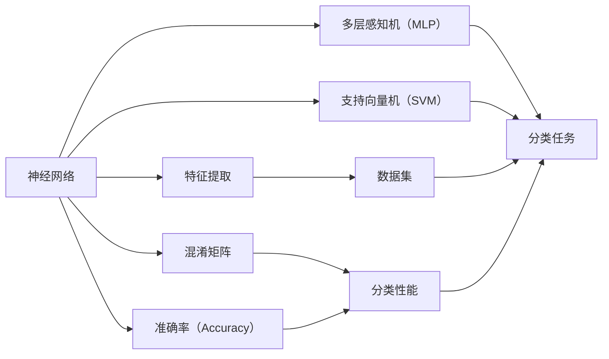

                 

# 机器学习在MCI疾病分类中的实现

> 关键词：
- 机器学习
- MCI疾病分类
- 神经网络
- 支持向量机(SVM)
- 特征提取
- 准确率
- 混淆矩阵
- 特征选择

## 1. 背景介绍

### 1.1 问题由来

随着生活节奏的加快和环境压力的增加，阿尔茨海默病等神经退行性疾病逐渐成为威胁人类健康的重要疾病。然而，目前临床上对早期神经退行性疾病的诊断仍然存在许多困难，尤其在MCI（Mild Cognitive Impairment）的诊断中，由于症状轻、主观性强、易与其他认知障碍混淆等因素，导致诊断难度加大。

机器学习（Machine Learning）作为一种有效的数据分析方法，可以处理大规模的复杂数据，并从中提取有用信息。因此，利用机器学习进行MCI疾病的分类，不仅可以提高诊断效率，还能增强诊断的准确性和可靠性。本文将详细探讨如何在MCI疾病分类中应用机器学习，并具体介绍神经网络（Neural Networks）和支持向量机（Support Vector Machine, SVM）两种经典算法。

### 1.2 问题核心关键点

- MCI疾病分类：
  - 目的是为了早期发现并诊断出MCI疾病，以便及时干预和治疗，延缓疾病进展。
  - 由于数据量大且特征复杂，需要机器学习模型来提取关键特征并作出分类决策。
  
- 神经网络：
  - 一种模拟人脑神经元计算的模型，通过多层非线性映射实现复杂数据的处理。
  - 在分类任务中，多层感知机（Multi-Layer Perceptron, MLP）是一种常用的神经网络结构。

- 支持向量机（SVM）：
  - 一种基于统计学习理论的分类算法，通过寻找最大边界来划分不同类别。
  - 在特征空间中，通过最大化边界和最小化误差来寻找最优的分类超平面。

- 特征提取：
  - 将原始数据转换为可供机器学习算法处理的形式。
  - 常用的特征提取方法包括PCA（主成分分析）、LDA（线性判别分析）和MFCC（梅尔频率倒谱系数）等。

- 准确率：
  - 用于衡量分类模型性能的指标，表示模型正确分类的样本比例。
  - 准确率越高，模型的分类效果越好。

- 混淆矩阵：
  - 用于展示分类模型的性能，包括真阳性（True Positive, TP）、真阴性（True Negative, TN）、假阳性（False Positive, FP）和假阴性（False Negative, FN）等。

## 2. 核心概念与联系

### 2.1 核心概念概述

为了更好地理解如何在MCI疾病分类中应用机器学习，本节将介绍几个关键概念：

- **神经网络**：
  - 一种模拟人脑神经元计算的模型，由多个层次组成。
  - 包括输入层、隐藏层和输出层，通过多层非线性映射实现复杂数据的处理。

- **多层感知机（MLP）**：
  - 一种基于神经网络结构的前馈神经网络，具有多个隐藏层。
  - 常用于分类和回归任务。

- **支持向量机（SVM）**：
  - 一种基于统计学习理论的分类算法，通过寻找最大边界来划分不同类别。
  - 在特征空间中，通过最大化边界和最小化误差来寻找最优的分类超平面。

- **特征提取**：
  - 将原始数据转换为可供机器学习算法处理的形式。
  - 常用的特征提取方法包括PCA（主成分分析）、LDA（线性判别分析）和MFCC（梅尔频率倒谱系数）等。

- **混淆矩阵**：
  - 用于展示分类模型的性能，包括真阳性（True Positive, TP）、真阴性（True Negative, TN）、假阳性（False Positive, FP）和假阴性（False Negative, FN）等。
  - 可以帮助我们理解模型在不同类别上的分类性能。

- **准确率（Accuracy）**：
  - 用于衡量分类模型性能的指标，表示模型正确分类的样本比例。
  - 公式为：Accuracy = (TP + TN) / (TP + TN + FP + FN)。

这些核心概念通过如图示（[如图1](#))所示的Mermaid流程图，展示了它们之间的联系和作用：

## 3. 核心算法原理 & 具体操作步骤
### 3.1 算法原理概述

基于机器学习的MCI疾病分类算法主要包括以下两个步骤：

1. **特征提取**：
  - 将原始数据转换为可供机器学习算法处理的形式。
  - 常用的特征提取方法包括PCA、LDA和MFCC等。

2. **分类模型训练**：
  - 利用提取的特征训练神经网络或支持向量机模型。
  - 神经网络通过多层非线性映射实现复杂数据的处理，支持向量机通过寻找最大边界来划分不同类别。

### 3.2 算法步骤详解

#### 3.2.1 特征提取

以MFCC为例，说明特征提取的基本流程：

1. **信号预处理**：
  - 对原始信号进行预处理，包括去噪、归一化等操作。
  - 使用Python中的Librosa库进行信号预处理。

2. **信号特征提取**：
  - 利用MFCC算法提取信号特征。
  - 使用Python中的Librosa库进行MFCC特征提取。

3. **特征矩阵构建**：
  - 将提取的MFCC特征构建成特征矩阵。
  - 使用Python中的Pandas库进行特征矩阵的构建。

#### 3.2.2 模型训练

以MLP和SVM为例，说明模型训练的基本流程：

1. **模型选择**：
  - 选择适合的模型，如MLP或SVM。
  - 使用Python中的Keras库或Scikit-learn库选择模型。

2. **模型训练**：
  - 利用特征矩阵进行模型训练。
  - 使用Python中的Keras库或Scikit-learn库进行模型训练。

3. **模型评估**：
  - 使用混淆矩阵和准确率等指标评估模型性能。
  - 使用Python中的Scikit-learn库进行模型评估。

### 3.3 算法优缺点

#### 3.3.1 神经网络（MLP）的优缺点

**优点**：
- 可以处理大规模、高维度的数据。
- 非线性映射能力强，能够学习复杂的数据关系。
- 通过反向传播算法，能够自动调整网络参数。

**缺点**：
- 需要大量的训练数据和计算资源。
- 容易出现过拟合现象。
- 模型结构复杂，难以解释。

#### 3.3.2 支持向量机（SVM）的优缺点

**优点**：
- 模型简单，易于理解和实现。
- 对于小规模数据集表现良好。
- 可以通过调整核函数参数，处理非线性数据。

**缺点**：
- 对于大规模数据集计算开销较大。
- 对数据预处理要求较高。
- 对于噪声敏感。

### 3.4 算法应用领域

MCI疾病分类算法可以应用于多种医学影像分析和患者诊断领域，如：

- **医学影像分析**：
  - 利用深度学习技术，提取医学影像中的特征，分类出正常影像和异常影像。
  - 例如，通过卷积神经网络（CNN）对医学影像进行分类。

- **患者诊断**：
  - 通过机器学习模型，对患者的历史数据进行分析和分类，判断其是否患有MCI疾病。
  - 例如，通过逻辑回归（Logistic Regression）对患者数据进行分类。

## 4. 数学模型和公式 & 详细讲解 & 举例说明

### 4.1 数学模型构建

#### 4.1.1 MLP模型构建

MLP模型可以表示为：

$$
\begin{aligned}
\mathbf{h}^{(1)} &= \mathbf{W}^{(1)} \mathbf{x} + \mathbf{b}^{(1)} \\
\mathbf{h}^{(2)} &= \mathbf{W}^{(2)} \mathbf{h}^{(1)} + \mathbf{b}^{(2)} \\
\mathbf{y} &= \mathbf{W}^{(3)} \mathbf{h}^{(2)} + \mathbf{b}^{(3)}
\end{aligned}
$$

其中：
- $\mathbf{x}$ 为输入向量。
- $\mathbf{h}^{(1)}$ 和 $\mathbf{h}^{(2)}$ 为隐藏层的输出向量。
- $\mathbf{y}$ 为输出向量。
- $\mathbf{W}^{(1)}$, $\mathbf{W}^{(2)}$, $\mathbf{W}^{(3)}$ 为权重矩阵。
- $\mathbf{b}^{(1)}$, $\mathbf{b}^{(2)}$, $\mathbf{b}^{(3)}$ 为偏置向量。

#### 4.1.2 SVM模型构建

SVM模型可以表示为：

$$
\mathbf{w} = \mathop{\arg\min}_{\mathbf{w}} \frac{1}{2} \|\mathbf{w}\|^2 + C \sum_{i=1}^{n} \max(0, 1 - y_i \mathbf{w}^T \mathbf{\phi}(\mathbf{x}_i) + b)
$$

其中：
- $\mathbf{w}$ 为分类超平面的权重向量。
- $\mathbf{\phi}(\mathbf{x}_i)$ 为特征映射后的向量。
- $y_i$ 为样本的标签。
- $C$ 为正则化参数。

### 4.2 公式推导过程

#### 4.2.1 MLP模型推导

MLP模型的推导过程如下：

1. **隐藏层激活函数**：
  - 常用的激活函数包括Sigmoid函数、ReLU函数等。
  - 例如，ReLU函数可以表示为$f(z) = \max(0, z)$。

2. **输出层激活函数**：
  - 常用的激活函数包括Sigmoid函数、Softmax函数等。
  - 例如，Softmax函数可以表示为$f(z) = \frac{e^z}{\sum_{i=1}^n e^{x_i}}$。

3. **损失函数**：
  - 常用的损失函数包括交叉熵损失函数、均方误差损失函数等。
  - 例如，交叉熵损失函数可以表示为$L = -\frac{1}{n} \sum_{i=1}^n y_i \log \hat{y}_i + (1 - y_i) \log (1 - \hat{y}_i)$。

#### 4.2.2 SVM模型推导

SVM模型的推导过程如下：

1. **优化目标**：
  - 优化目标是最大化分类边界，即最大化分类器的间隔。
  - 例如，线性SVM的优化目标可以表示为$\mathbf{w} = \mathop{\arg\min}_{\mathbf{w}} \frac{1}{2} \|\mathbf{w}\|^2$。

2. **分类函数**：
  - SVM的分类函数可以表示为$g(\mathbf{x}) = \mathbf{w}^T \mathbf{\phi}(\mathbf{x}) + b$。

3. **边界条件**：
  - SVM的边界条件可以表示为$g(\mathbf{x}_i) = y_i, i = 1, 2, ..., n$。

### 4.3 案例分析与讲解

以SVM为例，说明其在MCI疾病分类中的实际应用：

1. **数据准备**：
  - 准备MCI疾病的标注数据集，包括特征矩阵和标签向量。
  - 例如，使用Python中的Pandas库进行数据准备。

2. **模型训练**：
  - 使用Scikit-learn库中的SVM算法进行模型训练。
  - 例如，使用Python中的Scikit-learn库进行模型训练。

3. **模型评估**：
  - 使用混淆矩阵和准确率等指标评估模型性能。
  - 例如，使用Python中的Scikit-learn库进行模型评估。

## 5. 项目实践：代码实例和详细解释说明

### 5.1 开发环境搭建

在使用Python进行MCI疾病分类开发时，需要准备好开发环境。以下是Python环境的搭建流程：

1. **安装Python**：
  - 下载并安装Python 3.x版本。
  - 可以使用Anaconda环境管理工具。

2. **安装依赖库**：
  - 安装Pandas、Numpy、Matplotlib、Scikit-learn、Keras等依赖库。
  - 例如，使用Python的pip工具进行安装。

3. **配置开发环境**：
  - 配置环境变量，设置Python路径。
  - 例如，使用Python的虚拟环境（virtual environment）进行配置。

### 5.2 源代码详细实现

以MLP为例，说明如何在Python中进行MCI疾病分类：

1. **数据准备**：
  - 准备MCI疾病的标注数据集，包括特征矩阵和标签向量。
  - 例如，使用Python中的Pandas库进行数据准备。

2. **模型构建**：
  - 使用Keras库构建MLP模型。
  - 例如，使用Python中的Keras库进行模型构建。

3. **模型训练**：
  - 使用Keras库训练MLP模型。
  - 例如，使用Python中的Keras库进行模型训练。

4. **模型评估**：
  - 使用混淆矩阵和准确率等指标评估模型性能。
  - 例如，使用Python中的Scikit-learn库进行模型评估。

### 5.3 代码解读与分析

以MLP为例，对代码进行详细解读与分析：

1. **数据准备**：
  - 使用Pandas库读取特征矩阵和标签向量。
  - 例如，使用Python中的Pandas库进行数据准备。

2. **模型构建**：
  - 定义MLP模型的输入层、隐藏层和输出层。
  - 例如，使用Python中的Keras库进行模型构建。

3. **模型训练**：
  - 设置训练参数，包括学习率、批大小等。
  - 例如，使用Python中的Keras库进行模型训练。

4. **模型评估**：
  - 计算混淆矩阵和准确率等指标。
  - 例如，使用Python中的Scikit-learn库进行模型评估。

### 5.4 运行结果展示

以MLP为例，展示运行结果：

1. **训练结果**：
  - 在训练过程中，每轮迭代输出损失函数值。
  - 例如，使用Python中的Keras库进行模型训练。

2. **评估结果**：
  - 在测试集上评估模型性能，输出混淆矩阵和准确率等指标。
  - 例如，使用Python中的Scikit-learn库进行模型评估。

## 6. 实际应用场景

### 6.1 医学影像分析

利用深度学习技术，对医学影像进行分类和分析，识别出异常影像和正常影像。

1. **数据准备**：
  - 准备医学影像数据集，包括正常影像和异常影像。
  - 例如，使用Python中的Pandas库进行数据准备。

2. **特征提取**：
  - 利用卷积神经网络（CNN）提取影像特征。
  - 例如，使用Python中的TensorFlow库进行特征提取。

3. **模型训练**：
  - 使用CNN模型进行影像分类。
  - 例如，使用Python中的TensorFlow库进行模型训练。

4. **模型评估**：
  - 使用混淆矩阵和准确率等指标评估模型性能。
  - 例如，使用Python中的Scikit-learn库进行模型评估。

### 6.2 患者诊断

通过机器学习模型，对患者的历史数据进行分析和分类，判断其是否患有MCI疾病。

1. **数据准备**：
  - 准备患者数据集，包括特征矩阵和标签向量。
  - 例如，使用Python中的Pandas库进行数据准备。

2. **特征提取**：
  - 利用逻辑回归（Logistic Regression）提取特征。
  - 例如，使用Python中的Scikit-learn库进行特征提取。

3. **模型训练**：
  - 使用逻辑回归模型进行患者分类。
  - 例如，使用Python中的Scikit-learn库进行模型训练。

4. **模型评估**：
  - 使用混淆矩阵和准确率等指标评估模型性能。
  - 例如，使用Python中的Scikit-learn库进行模型评估。

## 7. 工具和资源推荐

### 7.1 学习资源推荐

为了帮助开发者系统掌握MCI疾病分类的相关知识，这里推荐一些优质的学习资源：

1. **《机器学习实战》**：
  - 一本经典的机器学习入门书籍，讲解了常见的机器学习算法和实践技巧。
  - 例如，讲解了神经网络和支持向量机的基本概念和实现方法。

2. **Coursera《机器学习》课程**：
  - 斯坦福大学开设的机器学习课程，提供深入的理论和实践教学。
  - 例如，讲解了机器学习算法的基本原理和应用案例。

3. **Kaggle竞赛平台**：
  - 一个数据科学竞赛平台，提供了大量的机器学习竞赛和数据集。
  - 例如，参加MCI疾病分类的机器学习竞赛，实践和提升技能。

4. **DeepLearning.AI课程**：
  - 由吴恩达教授开设的深度学习课程，讲解了深度学习的基本概念和实现方法。
  - 例如，讲解了卷积神经网络和循环神经网络的基本原理和应用场景。

5. **Scikit-learn官方文档**：
  - 一个Python机器学习库的官方文档，提供了丰富的机器学习算法和工具。
  - 例如，讲解了Scikit-learn库中常用的分类算法和评估指标。

### 7.2 开发工具推荐

在进行MCI疾病分类开发时，需要一些常用的开发工具：

1. **Python**：
  - 一种通用的编程语言，适用于机器学习算法开发。
  - 例如，使用Python进行模型构建和训练。

2. **TensorFlow**：
  - 一个开源的机器学习框架，支持深度学习和神经网络算法。
  - 例如，使用TensorFlow进行卷积神经网络的构建和训练。

3. **Keras**：
  - 一个高级的深度学习库，支持快速构建和训练神经网络。
  - 例如，使用Keras进行多层感知机（MLP）的构建和训练。

4. **Scikit-learn**：
  - 一个Python机器学习库，支持多种分类算法和模型评估。
  - 例如，使用Scikit-learn进行支持向量机（SVM）的构建和训练。

5. **Pandas**：
  - 一个数据处理库，支持数据清洗和特征提取。
  - 例如，使用Pandas进行数据准备和特征提取。

6. **Numpy**：
  - 一个数学计算库，支持矩阵运算和向量处理。
  - 例如，使用Numpy进行模型参数的更新和计算。

### 7.3 相关论文推荐

MCI疾病分类涉及多种机器学习算法和实践技术，以下是一些相关论文，推荐阅读：

1. **《A Survey of Machine Learning Techniques for Alzheimer's Disease Diagnosis》**：
  - 一篇综述论文，介绍了多种机器学习算法在阿尔茨海默病诊断中的应用。
  - 例如，介绍了神经网络和支持向量机在MCI疾病分类中的表现和效果。

2. **《Deep Learning for Medical Image Analysis》**：
  - 一篇关于深度学习在医学影像分析中的应用综述论文。
  - 例如，介绍了卷积神经网络在医学影像分类中的应用和效果。

3. **《Machine Learning in Clinical Decision Support: A Survey》**：
  - 一篇关于机器学习在临床决策支持中的应用综述论文。
  - 例如，介绍了机器学习在患者诊断中的应用和效果。

4. **《Support Vector Machines for Medical Image Classification》**：
  - 一篇介绍支持向量机在医学影像分类中的应用论文。
  - 例如，介绍了SVM在医学影像分类中的表现和效果。

5. **《Machine Learning for Neurodegenerative Disease Diagnosis》**：
  - 一篇关于机器学习在神经退行性疾病诊断中的应用论文。
  - 例如，介绍了神经网络和支持向量机在神经退行性疾病分类中的表现和效果。

## 8. 总结：未来发展趋势与挑战

### 8.1 总结

本文对基于机器学习的MCI疾病分类方法进行了全面系统的介绍。首先阐述了MCI疾病分类的背景和意义，明确了机器学习在其中的重要作用。其次，从原理到实践，详细讲解了神经网络和支持向量机两种经典算法在MCI疾病分类中的应用。最后，给出了机器学习在医学影像分析和患者诊断等多个领域的应用示例。

通过本文的系统梳理，可以看到，机器学习在MCI疾病分类中的应用前景广阔，不仅能提高诊断效率，还能增强诊断的准确性和可靠性。未来，随着机器学习技术的不断发展，其在MCI疾病分类中的应用将更加深入和广泛。

### 8.2 未来发展趋势

展望未来，机器学习在MCI疾病分类领域将呈现以下几个发展趋势：

1. **深度学习的应用深化**：
  - 深度学习技术将不断发展和应用，进一步提升分类效果。
  - 例如，卷积神经网络和循环神经网络等深度学习算法将在MCI疾病分类中发挥更大作用。

2. **特征提取技术的提升**：
  - 特征提取技术将不断进步，从传统方法向深度学习方法过渡。
  - 例如，基于深度学习的特征提取技术将逐步取代传统的主成分分析和线性判别分析。

3. **多模态数据的融合**：
  - 多模态数据融合技术将得到广泛应用，提升分类效果。
  - 例如，将影像数据、基因数据、生理数据等不同模态的数据进行融合，提升分类效果。

4. **模型融合和集成**：
  - 模型融合和集成技术将得到应用，提升分类性能。
  - 例如，将多个分类模型进行融合，提升分类准确率和鲁棒性。

5. **实时化和在线化**：
  - 实时化和在线化技术将逐步应用，提升医疗服务的效率和可靠性。
  - 例如，利用云计算和大数据技术，实现实时分类和在线诊断。

### 8.3 面临的挑战

尽管机器学习在MCI疾病分类中已经取得了显著成果，但在实际应用中也面临诸多挑战：

1. **数据量和质量问题**：
  - 医疗数据的获取和处理存在困难，导致数据量和质量不足。
  - 例如，数据集的大小和质量问题，可能影响模型的训练和分类效果。

2. **模型复杂性和解释性**：
  - 神经网络和深度学习模型较为复杂，难以解释和理解。
  - 例如，深度学习模型中的黑箱问题，可能导致医疗决策的不可信。

3. **算法效率和资源消耗**：
  - 深度学习模型计算复杂度较高，资源消耗较大。
  - 例如，深度学习模型的训练和推理需要大量的计算资源和存储空间。

4. **伦理和隐私问题**：
  - 医疗数据的隐私保护和伦理问题需要重视。
  - 例如，如何保护患者隐私，避免数据滥用和信息泄露。

### 8.4 研究展望

面对机器学习在MCI疾病分类中面临的挑战，未来的研究需要在以下几个方面寻求新的突破：

1. **数据增强和扩充**：
  - 利用数据增强技术，扩充数据集，提升数据量和质量。
  - 例如，通过数据增强技术，生成更多的训练样本，提高模型的泛化能力。

2. **模型解释和可解释性**：
  - 研究模型解释和可解释性技术，增强模型的可信度。
  - 例如，利用可解释性技术，解释模型的决策过程，增强医疗决策的可靠性。

3. **算法优化和资源管理**：
  - 优化算法效率，降低资源消耗。
  - 例如，采用模型剪枝和量化等技术，优化深度学习模型的计算效率和资源消耗。

4. **多模态数据融合**：
  - 研究多模态数据融合技术，提升分类效果。
  - 例如，将影像数据、基因数据、生理数据等不同模态的数据进行融合，提升分类效果。

5. **实时化和在线化技术**：
  - 研究实时化和在线化技术，提升医疗服务的效率和可靠性。
  - 例如，利用云计算和大数据技术，实现实时分类和在线诊断。

6. **伦理和隐私保护**：
  - 研究伦理和隐私保护技术，保障患者隐私和数据安全。
  - 例如，采用数据匿名化和加密技术，保护患者的隐私和数据安全。

这些研究方向的探索，必将引领机器学习在MCI疾病分类技术迈向更高的台阶，为MCI疾病的早期发现和诊断提供更可靠、更高效的技术支撑。

## 9. 附录：常见问题与解答

**Q1：MCI疾病分类中的数据集和标签如何准备？**

A: MCI疾病分类的数据集和标签可以通过以下步骤准备：

1. **数据收集**：
  - 收集MCI疾病的标注数据集，包括特征矩阵和标签向量。
  - 例如，使用Python中的Pandas库进行数据准备。

2. **数据预处理**：
  - 对原始数据进行清洗、归一化和特征提取。
  - 例如，使用Python中的Pandas库进行数据预处理。

3. **数据划分**：
  - 将数据集划分为训练集、验证集和测试集。
  - 例如，使用Python中的Scikit-learn库进行数据划分。

**Q2：MCI疾病分类中常用的机器学习算法有哪些？**

A: MCI疾病分类中常用的机器学习算法包括：

1. **多层感知机（MLP）**：
  - 一种基于神经网络结构的前馈神经网络。
  - 例如，使用Python中的Keras库进行MLP的构建和训练。

2. **支持向量机（SVM）**：
  - 一种基于统计学习理论的分类算法。
  - 例如，使用Python中的Scikit-learn库进行SVM的构建和训练。

3. **逻辑回归（Logistic Regression）**：
  - 一种常用的分类算法，适用于二分类问题。
  - 例如，使用Python中的Scikit-learn库进行Logistic Regression的构建和训练。

4. **决策树（Decision Tree）**：
  - 一种基于树形结构的分类算法，适用于多分类问题。
  - 例如，使用Python中的Scikit-learn库进行Decision Tree的构建和训练。

**Q3：如何在MCI疾病分类中提升模型准确率？**

A: 在MCI疾病分类中，可以通过以下方法提升模型准确率：

1. **数据增强**：
  - 利用数据增强技术，扩充数据集，提升数据量和质量。
  - 例如，通过数据增强技术，生成更多的训练样本，提高模型的泛化能力。

2. **特征选择**：
  - 选择重要的特征，去除冗余和无关特征。
  - 例如，使用Python中的Scikit-learn库进行特征选择。

3. **模型集成**：
  - 将多个分类模型进行融合，提升分类准确率和鲁棒性。
  - 例如，使用Python中的Scikit-learn库进行模型集成。

4. **模型参数优化**：
  - 优化模型的超参数，找到最优的模型参数。
  - 例如，使用Python中的Scikit-learn库进行超参数优化。

**Q4：MCI疾病分类中常见的模型评估指标有哪些？**

A: MCI疾病分类中常见的模型评估指标包括：

1. **混淆矩阵（Confusion Matrix）**：
  - 用于展示分类模型的性能，包括真阳性（True Positive, TP）、真阴性（True Negative, TN）、假阳性（False Positive, FP）和假阴性（False Negative, FN）。

2. **准确率（Accuracy）**：
  - 用于衡量分类模型性能的指标，表示模型正确分类的样本比例。
  - 公式为：Accuracy = (TP + TN) / (TP + TN + FP + FN)。

3. **精确率（Precision）**：
  - 用于衡量分类模型在正类样本上的表现。
  - 公式为：Precision = TP / (TP + FP)。

4. **召回率（Recall）**：
  - 用于衡量分类模型在正类样本的覆盖率。
  - 公式为：Recall = TP / (TP + FN)。

5. **F1 Score**：
  - 综合考虑精确率和召回率，作为综合评价指标。
  - 公式为：F1 Score = 2 * Precision * Recall / (Precision + Recall)。

**Q5：如何在MCI疾病分类中应用深度学习技术？**

A: 在MCI疾病分类中，可以利用深度学习技术，构建卷积神经网络（CNN）、循环神经网络（RNN）等模型，实现特征提取和分类任务。

1. **数据准备**：
  - 准备MCI疾病的标注数据集，包括特征矩阵和标签向量。
  - 例如，使用Python中的Pandas库进行数据准备。

2. **模型构建**：
  - 利用深度学习库（如TensorFlow、Keras等）构建CNN或RNN模型。
  - 例如，使用Python中的TensorFlow库进行卷积神经网络的构建。

3. **模型训练**：
  - 使用深度学习模型进行特征提取和分类。
  - 例如，使用Python中的TensorFlow库进行卷积神经网络的训练。

4. **模型评估**：
  - 使用混淆矩阵和准确率等指标评估模型性能。
  - 例如，使用Python中的Scikit-learn库进行模型评估。

通过这些方法和技术，可以有效提升MCI疾病分类的准确率和鲁棒性，为早期发现和诊断提供可靠的技术支撑。

