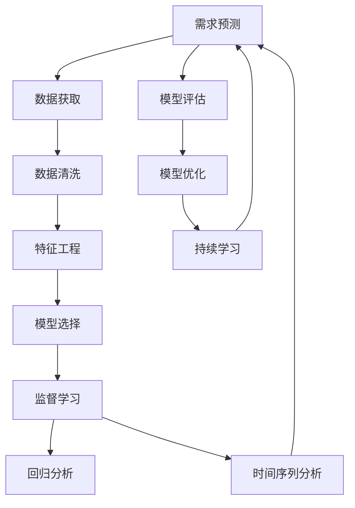

                 

## 1. 背景介绍

在数字化转型加速的今天，需求预测已成为企业运营管理中不可或缺的重要环节。准确的预测不仅能够帮助企业优化库存、提升销售、降低成本，还能在金融、医疗、交通等领域发挥重要作用。然而，随着市场环境的多变和数据量的激增，传统的预测方法面临诸多挑战。机器学习技术，尤其是基于深度学习的预测模型，通过自动学习数据中的模式和规律，为需求预测提供了新的解决方案。

### 1.1 问题由来
在互联网时代，企业面临的市场竞争更加激烈，消费者的需求日益多样化和个性化。传统的需求预测方法，如时间序列分析和统计模型，往往无法充分挖掘和利用海量数据中的隐含信息，导致预测结果与实际需求存在较大偏差。例如，电子商务平台需要预测每日的销售量，零售商需要了解消费者的购买行为，金融行业需要评估贷款风险等。机器学习技术通过构建复杂的模型和算法，能够从多维度数据中提取深层次的特征，显著提高预测的准确性和及时性。

### 1.2 问题核心关键点
需求预测的核心关键点在于如何从数据中提取有意义的特征，构建有效的预测模型，并对模型进行评估和优化。其中，关键问题包括：

1. **数据获取和处理**：收集并清洗高质量的原始数据，是构建准确预测模型的前提。
2. **特征工程**：从原始数据中提取、选择和构建有价值的特征，影响模型的表现。
3. **模型选择和训练**：选择合适的模型架构和算法，并在训练数据上优化模型参数。
4. **模型评估和部署**：使用测试数据评估模型性能，并在实际环境中应用。
5. **持续学习和优化**：通过迭代改进，提升模型在不断变化的市场环境中的适应性。

### 1.3 问题研究意义
机器学习在需求预测中的应用，对提升企业的市场响应能力、优化资源配置、增强竞争力具有重要意义。具体体现在：

1. **提高决策效率**：机器学习模型能够快速分析大量数据，预测市场趋势和用户需求，辅助企业做出更科学的决策。
2. **降低运营成本**：通过优化库存管理、销售策略，机器学习帮助企业减少库存积压和浪费，降低运营成本。
3. **增强市场适应性**：机器学习模型能够适应市场的快速变化，及时调整预测结果，提升企业的市场响应速度。
4. **推动创新应用**：机器学习技术可以应用于多种新兴领域，如智能推荐、风险评估等，为企业带来新的增长点。

## 2. 核心概念与联系

### 2.1 核心概念概述

为更好地理解机器学习在需求预测中的作用，本节将介绍几个密切相关的核心概念：

- **需求预测**：指基于历史数据和市场环境，预测未来特定时间点的需求量或需求趋势。
- **机器学习**：通过数据训练模型，自动学习数据中的规律和模式，并进行预测或决策的技术。
- **深度学习**：一种特殊类型的机器学习，通过多层次的神经网络结构，自动提取高层次的特征表示。
- **特征工程**：指从原始数据中提取、选择和构建有意义的特征，影响模型的性能。
- **监督学习**：使用带有标签的训练数据，训练模型进行预测或分类。
- **回归分析**：一种用于预测数值型变量的监督学习方法，广泛应用于需求预测。
- **时间序列分析**：一种统计方法，通过分析时间序列数据，预测未来时间点的数值。

这些核心概念之间的逻辑关系可以通过以下Mermaid流程图来展示：



这个流程图展示了大语言模型的核心概念及其之间的关系：

1. 需求预测始于数据获取，数据清洗确保数据质量。
2. 特征工程从原始数据中提取有意义的特征，影响模型性能。
3. 模型选择决定采用监督学习中的回归分析或时间序列分析等方法。
4. 监督学习训练模型，预测未来需求。
5. 回归分析和时间序列分析分别用于预测连续型和离散型需求。
6. 模型评估和优化提升预测精度，持续学习适应市场变化。

这些概念共同构成了需求预测的机器学习框架，使其能够在各种场景下发挥作用。通过理解这些核心概念，我们可以更好地把握需求预测的机器学习技术和方法。

## 3. 核心算法原理 & 具体操作步骤
### 3.1 算法原理概述

基于机器学习的需求预测，通常采用监督学习的方法，使用带有标签的历史数据来训练预测模型。其核心思想是：通过学习历史数据中的规律和趋势，构建一个能够准确预测未来需求的模型。

形式化地，假设需求预测任务的数据集为 $D=\{(x_i,y_i)\}_{i=1}^N$，其中 $x_i$ 为特征向量，$y_i$ 为需求量或需求趋势。预测模型的目标是找到最优参数 $\theta$，使得预测结果 $\hat{y}$ 与实际需求 $y$ 之间的误差最小化。常见的损失函数包括均方误差（MSE）和平均绝对误差（MAE）。

具体而言，对于回归分析，预测模型的公式为：

$$
\hat{y} = f_{\theta}(x)
$$

其中 $f_{\theta}$ 为预测模型，$\theta$ 为模型参数。

对于时间序列分析，通常使用自回归模型（AR）或自回归移动平均模型（ARMA），其预测公式为：

$$
\hat{y}_t = \alpha_0 + \sum_{i=1}^p \alpha_i y_{t-i} + \sum_{i=1}^q \beta_i \epsilon_{t-i} + \epsilon_t
$$

其中 $\alpha_0$、$\alpha_i$ 和 $\beta_i$ 为模型参数，$\epsilon_t$ 为误差项。

### 3.2 算法步骤详解

基于机器学习的需求预测一般包括以下几个关键步骤：

**Step 1: 数据准备**
- 收集历史需求数据，包括时间序列、销售量、市场环境等。
- 对数据进行清洗，处理缺失值、异常值等。

**Step 2: 特征工程**
- 从原始数据中提取有意义的特征，如季节性、节假日、促销活动等。
- 选择和构建特征，如滞后项、移动平均值等。
- 对特征进行标准化和归一化处理，以提升模型性能。

**Step 3: 模型选择**
- 根据预测任务的特点和数据类型，选择合适的预测模型。如线性回归、决策树、支持向量机等。
- 对于时间序列分析，选择AR、ARMA、LSTM等模型。

**Step 4: 模型训练**
- 使用训练数据对模型进行训练，调整模型参数。
- 选择合适的优化算法，如梯度下降、Adam等，进行模型优化。
- 使用交叉验证等技术，防止过拟合和提高泛化能力。

**Step 5: 模型评估**
- 使用测试数据评估模型性能，计算MSE、MAE等指标。
- 绘制预测值与实际值之间的散点图，直观展示预测结果。
- 计算模型的准确率、召回率等指标，进行模型选择。

**Step 6: 模型部署**
- 将训练好的模型应用到实际需求预测中。
- 设置模型的参数，如预测窗口大小、训练频率等。
- 对实时数据进行预测，更新预测结果。

### 3.3 算法优缺点

基于机器学习的需求预测方法具有以下优点：
1. 能够自动学习数据中的模式和规律，预测结果准确性高。
2. 适用于多种预测任务，包括连续型和离散型需求预测。
3. 可以处理高维数据和大规模数据，具有较强的泛化能力。
4. 具有较好的解释性，通过特征工程可以解释模型预测的逻辑。

同时，该方法也存在一些局限性：
1. 需要大量带有标签的数据，标注成本较高。
2. 对数据质量敏感，数据清洗和特征提取需要专业知识。
3. 模型复杂度高，训练和预测时间较长。
4. 对于突发事件和市场变化，预测结果可能不够及时。
5. 模型需要定期更新，保持预测精度。

尽管存在这些局限性，但机器学习在需求预测中的应用已经取得了显著成果，成为预测技术的重要方向。未来相关研究将集中在如何进一步降低标注成本、提升模型效率、增强预测及时性和鲁棒性等方面。

### 3.4 算法应用领域

基于机器学习的需求预测方法，在多个领域得到了广泛应用，例如：

- **电子商务**：如预测每日销售量、库存水平等，优化库存管理和销售策略。
- **零售行业**：分析消费者购买行为，预测热门商品和促销活动效果。
- **金融行业**：评估贷款风险、预测股票价格等，辅助投资决策。
- **医疗行业**：预测药品需求量、医疗设备使用情况等，优化资源配置。
- **交通行业**：预测乘客流量、需求变化等，优化交通规划和调度。

除了上述这些经典应用领域外，需求预测技术还在物流、能源、制造等行业得到创新应用，提升了各行业的效率和决策质量。

## 4. 数学模型和公式 & 详细讲解  
### 4.1 数学模型构建

本节将使用数学语言对基于机器学习的需求预测过程进行更加严格的刻画。

假设需求预测任务的数据集为 $D=\{(x_i,y_i)\}_{i=1}^N$，其中 $x_i$ 为特征向量，$y_i$ 为需求量或需求趋势。预测模型的目标是最小化预测误差，即：

$$
\theta^* = \mathop{\arg\min}_{\theta} \frac{1}{N} \sum_{i=1}^N (\hat{y}_i - y_i)^2
$$

其中 $\hat{y}_i$ 为模型预测的需求量或需求趋势，$y_i$ 为实际需求量或需求趋势。

对于回归分析，预测模型的公式为：

$$
\hat{y} = \theta^T x
$$

其中 $\theta$ 为模型参数，$x$ 为特征向量。

对于时间序列分析，常用的模型包括AR和ARMA，其预测公式分别为：

$$
\hat{y}_t = \sum_{i=1}^p \alpha_i y_{t-i} + \epsilon_t
$$

$$
\hat{y}_t = \alpha_0 + \sum_{i=1}^p \alpha_i y_{t-i} + \sum_{i=1}^q \beta_i \epsilon_{t-i} + \epsilon_t
$$

其中 $\alpha_i$、$\beta_i$ 和 $\epsilon_t$ 为模型参数，$y_t$ 为实际需求量或需求趋势。

### 4.2 公式推导过程

以下我们以线性回归模型为例，推导回归分析的预测公式及其梯度下降算法的具体实现。

假设需求预测任务的数据集为 $D=\{(x_i,y_i)\}_{i=1}^N$，其中 $x_i$ 为特征向量，$y_i$ 为需求量或需求趋势。线性回归模型的目标是最小化预测误差，即：

$$
\theta^* = \mathop{\arg\min}_{\theta} \frac{1}{N} \sum_{i=1}^N (\hat{y}_i - y_i)^2
$$

其中 $\hat{y}_i = \theta^T x_i$，$\theta$ 为模型参数。

根据梯度下降算法的定义，模型参数的更新公式为：

$$
\theta_{k+1} = \theta_k - \eta \nabla_{\theta} \mathcal{L}(\theta_k)
$$

其中 $\eta$ 为学习率，$\mathcal{L}(\theta_k)$ 为损失函数。

对于线性回归模型，损失函数为均方误差（MSE）：

$$
\mathcal{L}(\theta) = \frac{1}{N} \sum_{i=1}^N (\hat{y}_i - y_i)^2
$$

梯度下降算法更新公式为：

$$
\theta_{k+1} = \theta_k - \eta \frac{1}{N} \sum_{i=1}^N (y_i - \theta^T x_i) x_i
$$

在得到损失函数的梯度后，即可带入梯度下降算法，完成模型的迭代优化。重复上述过程直至收敛，最终得到适应需求预测任务的最优模型参数 $\theta^*$。

### 4.3 案例分析与讲解

**案例1: 电子商务平台的需求预测**

电子商务平台需要预测每日的销售量，以优化库存管理和提高用户体验。具体步骤如下：

1. **数据获取**：收集平台过去一年的销售记录，包括日期、商品名称、价格、促销活动等。
2. **特征工程**：提取季节性特征（如节假日、促销活动）、滞后项（如前一天的销售量）等。
3. **模型选择**：选择线性回归模型进行预测。
4. **模型训练**：使用训练数据对模型进行训练，调整模型参数。
5. **模型评估**：使用测试数据评估模型性能，计算MSE、MAE等指标。
6. **模型部署**：将训练好的模型应用到实际需求预测中，实时更新预测结果。

**案例2: 医疗行业的药品需求预测**

医院需要预测各种药品的需求量，以便合理配置库存和资源。具体步骤如下：

1. **数据获取**：收集医院的药品销售记录，包括药品名称、价格、销售量、季节性特征等。
2. **特征工程**：提取季节性特征（如节假日、季节变化）、滞后项（如前一天的销售量）等。
3. **模型选择**：选择时间序列分析模型进行预测。
4. **模型训练**：使用训练数据对模型进行训练，调整模型参数。
5. **模型评估**：使用测试数据评估模型性能，计算MSE、MAE等指标。
6. **模型部署**：将训练好的模型应用到实际需求预测中，实时更新预测结果。

通过以上案例，可以看到机器学习在需求预测中的广泛应用。这些案例展示了从数据准备、特征工程、模型训练到模型评估和部署的完整流程，为需求预测提供了实用的方法论。

## 5. 项目实践：代码实例和详细解释说明
### 5.1 开发环境搭建

在进行需求预测实践前，我们需要准备好开发环境。以下是使用Python进行Scikit-learn开发的环境配置流程：

1. 安装Anaconda：从官网下载并安装Anaconda，用于创建独立的Python环境。

2. 创建并激活虚拟环境：
```bash
conda create -n prediction-env python=3.8 
conda activate prediction-env
```

3. 安装Scikit-learn：
```bash
pip install scikit-learn
```

4. 安装NumPy、Pandas等工具包：
```bash
pip install numpy pandas matplotlib seaborn jupyter notebook ipython
```

完成上述步骤后，即可在`prediction-env`环境中开始需求预测实践。

### 5.2 源代码详细实现

下面我们以线性回归模型为例，给出使用Scikit-learn进行需求预测的Python代码实现。

首先，定义数据处理函数：

```python
import numpy as np
from sklearn.model_selection import train_test_split
from sklearn.linear_model import LinearRegression
from sklearn.metrics import mean_squared_error, mean_absolute_error

def load_data(filename):
    data = np.loadtxt(filename, delimiter=',')
    X = data[:, :-1]
    y = data[:, -1]
    return X, y

def train_model(X_train, y_train):
    model = LinearRegression()
    model.fit(X_train, y_train)
    return model

def evaluate_model(model, X_test, y_test):
    y_pred = model.predict(X_test)
    mse = mean_squared_error(y_test, y_pred)
    mae = mean_absolute_error(y_test, y_pred)
    return mse, mae

def plot_results(y_test, y_pred):
    import matplotlib.pyplot as plt
    plt.scatter(y_test, y_pred)
    plt.xlabel('Actual Demand')
    plt.ylabel('Predicted Demand')
    plt.title('Demand Prediction Results')
    plt.show()
```

然后，加载数据并进行训练：

```python
X, y = load_data('demand_data.csv')
X_train, X_test, y_train, y_test = train_test_split(X, y, test_size=0.2, random_state=42)

model = train_model(X_train, y_train)
```

接着，评估模型：

```python
mse, mae = evaluate_model(model, X_test, y_test)
print(f'MSE: {mse:.2f}, MAE: {mae:.2f}')
```

最后，展示预测结果：

```python
y_pred = model.predict(X_test)
plot_results(y_test, y_pred)
```

以上就是使用Scikit-learn进行需求预测的完整代码实现。可以看到，通过Scikit-learn的强大封装，我们可以用相对简洁的代码完成线性回归模型的训练和评估。

### 5.3 代码解读与分析

让我们再详细解读一下关键代码的实现细节：

**load_data函数**：
- 定义了数据加载函数，从CSV文件中读取数据，并返回特征和目标变量。

**train_model函数**：
- 使用线性回归模型进行训练，并返回训练好的模型对象。

**evaluate_model函数**：
- 使用测试数据评估模型性能，返回均方误差和平均绝对误差。

**plot_results函数**：
- 使用Matplotlib绘制预测结果的散点图，直观展示预测精度。

**训练流程**：
- 首先使用load_data函数加载数据，然后使用train_test_split将数据划分为训练集和测试集。
- 使用train_model函数训练线性回归模型，并返回训练好的模型。
- 使用evaluate_model函数评估模型性能，并输出MSE和MAE。
- 使用plot_results函数展示预测结果。

可以看到，Scikit-learn使得需求预测的代码实现变得简洁高效。开发者可以将更多精力放在数据处理、模型改进等高层逻辑上，而不必过多关注底层的实现细节。

当然，工业级的系统实现还需考虑更多因素，如模型的保存和部署、超参数的自动搜索、更灵活的任务适配层等。但核心的需求预测范式基本与此类似。

## 6. 实际应用场景
### 6.1 智能电商

智能电商系统通过机器学习预测用户需求，提供个性化推荐和库存管理。具体场景包括：

- **个性化推荐**：分析用户浏览、购买历史，预测其下一步需求，提供个性化的商品推荐。
- **库存管理**：预测商品在未来时间段的需求量，优化库存水平，避免过剩或不足。
- **促销策略**：预测促销活动的效果，优化活动时机和内容，提升销售转化率。

通过机器学习，电商系统能够实时监测市场动态，快速调整策略，提升用户满意度和运营效率。

### 6.2 金融风险管理

金融行业需要预测贷款风险、市场趋势等，帮助决策者制定合理的投资和风险控制策略。具体场景包括：

- **贷款风险评估**：分析借款人的信用记录、收入水平等特征，预测其违约风险。
- **市场趋势预测**：预测股票、债券等资产的价格走势，辅助投资决策。
- **信用评分**：预测借款人的信用评分，辅助贷款审批和风险控制。

通过机器学习，金融系统能够提高风险评估的准确性，降低投资风险，提升市场预测的可靠性。

### 6.3 制造业供应链管理

制造业需要预测原材料需求、生产量、库存水平等，优化供应链管理和生产计划。具体场景包括：

- **原材料需求预测**：预测生产所需的原材料需求量，避免库存积压和短缺。
- **生产量预测**：预测产品的生产量，优化生产计划和资源配置。
- **库存水平预测**：预测库存水平，避免过多或过少库存，降低成本。

通过机器学习，制造业能够提高供应链的响应速度和效率，降低生产成本，提升整体竞争力。

### 6.4 未来应用展望

随着机器学习技术的发展，需求预测将拓展到更多领域，推动智能化、自动化的应用：

1. **智能交通**：预测道路流量、交通拥堵等，优化交通规划和调度。
2. **智能能源**：预测电力需求、风力发电量等，优化能源分配和调度。
3. **智能制造**：预测设备故障、生产效率等，优化生产计划和维护。
4. **智能物流**：预测运输需求、货物配送等，优化物流路线和仓储管理。

机器学习在需求预测中的应用前景广阔，未来必将在更多领域大放异彩，推动社会经济的智能化转型。

## 7. 工具和资源推荐
### 7.1 学习资源推荐

为了帮助开发者系统掌握机器学习在需求预测中的理论和实践，这里推荐一些优质的学习资源：

1. 《Python机器学习》：这本书由机器学习领域的权威专家编写，系统介绍了机器学习的基础知识和常见算法，适合初学者学习。

2. 《统计学习方法》：这本书由著名机器学习专家李航编写，全面介绍了统计学习的基本理论和算法，是机器学习领域的经典教材。

3. Coursera的《机器学习》课程：由斯坦福大学的Andrew Ng教授主讲的在线课程，涵盖了机器学习的基础知识和算法，适合自学。

4. Kaggle平台：数据科学和机器学习的竞赛平台，提供了大量数据集和代码样例，适合实践和竞赛。

5. Scikit-learn官方文档：Scikit-learn的官方文档，提供了丰富的算法和模型实现，适合参考和学习。

通过对这些资源的学习实践，相信你一定能够快速掌握机器学习在需求预测中的原理和技巧，并用于解决实际问题。

### 7.2 开发工具推荐

高效的开发离不开优秀的工具支持。以下是几款用于需求预测开发的常用工具：

1. Python：基于解释型编程语言的通用语言，支持多种第三方库和框架，适合需求预测的快速开发。

2. Scikit-learn：基于Python的机器学习库，提供了丰富的算法和模型实现，适合需求预测的快速原型开发。

3. TensorFlow和PyTorch：基于深度学习的开源框架，提供了强大的计算图和分布式训练功能，适合复杂的需求预测任务。

4. Jupyter Notebook：基于Web的交互式开发环境，支持代码块和输出可视化，适合需求预测的分析和实验。

5. Visual Studio Code：基于Windows的轻量级IDE，支持多种编程语言和扩展插件，适合需求预测的快速开发。

合理利用这些工具，可以显著提升需求预测任务的开发效率，加快创新迭代的步伐。

### 7.3 相关论文推荐

机器学习在需求预测中的应用源于学界的持续研究。以下是几篇奠基性的相关论文，推荐阅读：

1. 《机器学习导论》：由Tom Mitchell编写，全面介绍了机器学习的基本概念和算法，是机器学习领域的经典教材。

2. 《深度学习》：由Ian Goodfellow、Yoshua Bengio和Aaron Courville编写，深入浅出地介绍了深度学习的基本理论和算法，是深度学习的权威书籍。

3. 《时间序列分析》：由Rudolf Künsch编写，全面介绍了时间序列分析的基本理论和算法，是时间序列分析领域的经典教材。

4. 《神经网络与深度学习》：由Michael Nielsen编写，深入浅出地介绍了神经网络的基本理论和算法，是深度学习的入门书籍。

这些论文代表了大语言模型微调技术的发展脉络。通过学习这些前沿成果，可以帮助研究者把握学科前进方向，激发更多的创新灵感。

## 8. 总结：未来发展趋势与挑战

### 8.1 总结

本文对机器学习在需求预测中的应用进行了全面系统的介绍。首先阐述了需求预测的背景和意义，明确了机器学习在需求预测中的核心关键点，包括数据获取、特征工程、模型选择和训练等。其次，从原理到实践，详细讲解了需求预测的数学模型和算法，给出了具体的代码实现和结果分析。同时，本文还探讨了需求预测在多个行业中的应用场景，展示了其广泛的应用前景。

通过本文的系统梳理，可以看到，机器学习在需求预测中的应用已经取得了显著成果，成为预测技术的重要方向。未来相关研究需要在降低标注成本、提升模型效率、增强预测及时性和鲁棒性等方面进一步努力。

### 8.2 未来发展趋势

展望未来，机器学习在需求预测中的应用将呈现以下几个发展趋势：

1. **模型复杂度提升**：随着深度学习的发展，模型复杂度将进一步提升，能够处理更多维度、更高复杂度的需求预测任务。

2. **多模态融合**：未来需求预测将更多地利用多模态数据，如文本、图像、视频等，提升预测的全面性和准确性。

3. **自适应学习**：基于强化学习和在线学习的方法，需求预测模型能够实时更新，适应市场变化。

4. **知识图谱融合**：通过引入知识图谱，需求预测模型能够结合领域知识，提高预测的可靠性和合理性。

5. **隐私保护**：在数据隐私保护和模型鲁棒性方面，需求预测技术将不断创新，确保数据安全和模型稳定性。

6. **边缘计算**：随着物联网的发展，需求预测将更多地在边缘计算设备上进行，提高实时性和响应速度。

这些趋势表明，机器学习在需求预测中的应用前景广阔，未来必将在更多领域大放异彩，推动社会经济的智能化转型。

### 8.3 面临的挑战

尽管机器学习在需求预测中取得了显著成果，但仍面临诸多挑战：

1. **数据质量问题**：高质量的需求数据难以获取，数据清洗和特征提取需要大量时间和资源。
2. **模型复杂度增加**：随着模型复杂度的提升，训练和预测时间将增加，对计算资源和存储要求更高。
3. **预测准确性**：需求预测模型的泛化能力有限，面对突发事件和市场变化，预测结果可能不够准确。
4. **隐私保护**：在处理敏感数据时，如何保护用户隐私和数据安全，是需求预测技术的重大挑战。
5. **模型解释性**：需求预测模型通常是"黑盒"系统，难以解释其内部决策逻辑，影响模型的可信度和应用。

这些挑战需要在算法、数据、工程等多个方面进行深入研究和优化，才能推动机器学习在需求预测中的进一步发展。

### 8.4 研究展望

面对机器学习在需求预测中面临的挑战，未来的研究需要在以下几个方面寻求新的突破：

1. **高效特征提取**：开发更加高效和自动化的特征工程方法，减少人工干预，提升特征提取效率。

2. **实时预测技术**：探索基于强化学习和在线学习的实时预测方法，提高预测的及时性和响应速度。

3. **多模态数据融合**：研究多模态数据融合技术，提升需求预测的全面性和准确性。

4. **隐私保护技术**：开发隐私保护和数据安全技术，确保需求预测过程中数据的安全性。

5. **模型解释性**：结合可解释性模型和知识图谱，提升需求预测模型的可解释性和可信度。

6. **边缘计算优化**：优化边缘计算设备和算法，提高需求预测在实时环境中的性能和稳定性。

这些研究方向将引领需求预测技术向更高的台阶发展，为需求预测技术在更多领域的应用提供新的动力。面向未来，需求预测技术需要与其他人工智能技术进行更深入的融合，如知识表示、因果推理、强化学习等，协同发力，共同推动自然语言理解和智能交互系统的进步。只有勇于创新、敢于突破，才能不断拓展需求预测的边界，让智能技术更好地造福人类社会。

## 9. 附录：常见问题与解答

**Q1：机器学习在需求预测中能否处理非结构化数据？**

A: 机器学习在需求预测中通常需要结构化数据，如时间序列、销售记录等。对于非结构化数据（如文本、图像等），需要进行预处理和特征提取，才能用于需求预测。

**Q2：机器学习模型是否需要手动调整超参数？**

A: 机器学习模型通常需要手动调整超参数，如学习率、正则化系数等。通过网格搜索、随机搜索等方法，可以找到最优的超参数组合。

**Q3：机器学习模型是否需要定期更新？**

A: 机器学习模型通常需要定期更新，以适应市场变化和新数据。定期重新训练模型，可以提升模型的泛化能力和预测精度。

**Q4：机器学习模型是否需要考虑数据分布的变化？**

A: 机器学习模型需要考虑数据分布的变化，以避免过拟合和泛化能力下降。可以通过增量学习、在线学习等方法，实时更新模型。

**Q5：机器学习模型是否需要考虑市场季节性变化？**

A: 机器学习模型需要考虑市场季节性变化，在模型中引入季节性特征和滞后项，提高预测的准确性。

这些问题的解答展示了机器学习在需求预测中的实际应用和挑战，希望帮助读者更好地理解这一领域的核心技术和方法。

---

作者：禅与计算机程序设计艺术 / Zen and the Art of Computer Programming

