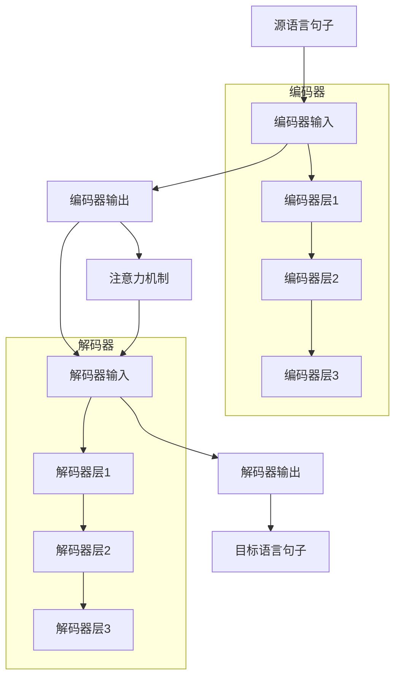

                 

# 机器翻译(Machine Translation) - 原理与代码实例讲解

> 关键词：机器翻译,神经机器翻译(Neural Machine Translation, NMT),Transformer,注意力机制,编码器-解码器,注意力权重,序列到序列(Seq2Seq),训练与优化

## 1. 背景介绍

机器翻译(Machine Translation, MT)是指将一种自然语言自动翻译成另一种自然语言的过程。自古以来，人类就希望实现跨语言的无障碍交流，然而长期以来，传统的基于规则和统计的机器翻译系统由于语言结构的复杂性和多义性，难以达到令人满意的翻译效果。

随着深度学习技术的发展，神经机器翻译(Neural Machine Translation, NMT)逐渐成为MT的主流范式。相较于传统的统计翻译方法，NMT基于神经网络架构，能够更好地捕捉语言数据中的深层语义关联，并实现端到端的自动学习，大大提升了翻译的质量和效率。

近年来，谷歌、微软、Facebook等公司相继推出了各自的NMT系统，开源项目如OpenNMT、Moses、Fairseq等也层出不穷，这些系统在多种MT任务上取得了优异的成绩。

本文将系统讲解NMT的原理，并提供一个基于Transformer的NMT的代码实例，希望读者能通过实践，深刻理解NMT背后的机制和核心思想。

## 2. 核心概念与联系

### 2.1 核心概念概述

机器翻译的核心概念和算法主要包括以下几点：

- 神经机器翻译(Neural Machine Translation, NMT)：基于神经网络的翻译技术，其核心是将源语言句子映射到目标语言句子的过程。
- 编码器-解码器(Encoder-Decoder)框架：由两个神经网络模块组成，编码器将源语言句子编码成表示，解码器将该表示映射到目标语言句子。
- 注意力机制(Attention Mechanism)：一种机制，允许模型在生成过程中动态选择不同位置的信息，提高翻译质量。
- 序列到序列(Seq2Seq)模型：一种通用的神经网络模型，用于处理输入和输出序列不同的任务，如机器翻译。
- 前向传播(Forward Propagation)：从输入数据到输出数据的计算过程，包括编码器和解码器的前向传播。
- 反向传播(Backward Propagation)：通过链式法则计算损失函数对模型参数的梯度，进行参数更新。
- 损失函数(Loss Function)：用于衡量模型预测结果和真实结果的差异，常用的有交叉熵损失、BLEU分数等。
- 正则化(Regularization)：防止模型过拟合的策略，如L2正则、Dropout等。
- 动态计算图(Computational Graph)：深度学习框架中用于自动微分和优化计算的机制。
- 端到端(End-to-End)：模型直接输入原始数据并输出结果，中间不需要手动拼接。

这些概念构成了机器翻译技术的基础，下面将详细讲解机器翻译的原理。

### 2.2 核心概念原理和架构的 Mermaid 流程图



该图展示了基于Transformer的机器翻译系统的核心结构。源语言句子首先输入到编码器中，通过多个编码器层进行处理，得到上下文表示。解码器将上下文表示作为输入，结合注意力机制选择不同的源语言词汇，逐步生成目标语言句子。

## 3. 核心算法原理 & 具体操作步骤

### 3.1 算法原理概述

基于Transformer的神经机器翻译主要分为两个部分：编码器和解码器。编码器将源语言句子转换为一个上下文向量，解码器将上下文向量和解码器的前一时刻输出作为输入，逐步生成目标语言句子。

编码器和解码器均由多个相同的层组成，每一层包含多头自注意力机制和前馈神经网络。其中，多头自注意力机制是Transformer模型的核心，它允许模型在生成过程中动态选择不同位置的信息，从而提高翻译质量。

### 3.2 算法步骤详解

**步骤1：数据准备**
- 准备源语言和目标语言的双语对照文本数据集，进行文本清洗和分词。
- 将文本转换为编码器和解码器所需的数字序列，即词嵌入向量。

**步骤2：模型搭建**
- 搭建Transformer编码器和解码器，设置超参数，如层数、隐藏尺寸、注意力头数等。
- 定义编码器的输入和输出维度，以及解码器的输入和输出维度。

**步骤3：训练模型**
- 定义损失函数，如交叉熵损失、BLEU分数等。
- 使用优化器，如AdamW，进行反向传播计算梯度。
- 在训练集上进行前向传播和反向传播，更新模型参数。
- 在验证集上评估模型性能，调整超参数。

**步骤4：测试和评估**
- 在测试集上进行前向传播，得到翻译结果。
- 计算BLEU分数，评估模型翻译质量。
- 进行翻译质量评估，使用人工对比或自动评估工具。

### 3.3 算法优缺点

**优点**：
- 端到端设计，消除了传统方法中规则和词典的限制，实现自动学习。
- 可以处理变长序列，无需手动填充或截断。
- 多头自注意力机制能够捕捉多维特征，提高翻译质量。
- 模型并行性强，适合大规模分布式训练。

**缺点**：
- 计算复杂度高，训练资源需求大。
- 模型较大，推理速度较慢。
- 对于长句子和低资源语言，性能可能不佳。
- 模型训练过程中容易出现梯度消失和梯度爆炸问题。

### 3.4 算法应用领域

基于Transformer的机器翻译在众多领域中得到广泛应用，包括但不限于：

- 国际贸易：实现跨语言商务沟通，提高交流效率。
- 国际旅行：提供实时多语言信息查询和导航服务。
- 学术研究：跨语言论文搜索和文献翻译，加速研究进程。
- 翻译服务：提供线上线下多语种翻译服务。
- 游戏和娱乐：跨语言游戏翻译和文化内容传播。
- 社交媒体：实现跨语言社区互动和信息过滤。

## 4. 数学模型和公式 & 详细讲解 & 举例说明

### 4.1 数学模型构建

Transformer模型由编码器和解码器两部分组成。编码器的输入为源语言序列，解码器的输入为编码器的输出和解码器前一时刻的输出。

假设源语言和目标语言词汇表大小分别为 $N_s$ 和 $N_t$，编码器和解码器的嵌入维度为 $d_E$，注意力机制中的注意力头数为 $h$，编码器的层数为 $L_E$，解码器的层数为 $L_D$。则编码器和解码器的架构如下：

- 编码器：$E=(E_1,\cdots,E_{L_E})$，每一层 $E_i=(Q_i,K_i,V_i)$，其中 $Q_i=[Q_i^1,\cdots,Q_i^{N_s}]$，$K_i=[K_i^1,\cdots,K_i^{N_s}]$，$V_i=[V_i^1,\cdots,V_i^{N_s}]$。
- 解码器：$D=(D_1,\cdots,D_{L_D})$，每一层 $D_i=(X_i,Y_i)$，其中 $X_i=[X_i^1,\cdots,X_i^{N_t}]$，$Y_i=[Y_i^1,\cdots,Y_i^{N_t}]$。

编码器和解码器的输出分别为 $C=[C_1,\cdots,C_{N_s}]$ 和 $T=[T_1,\cdots,T_{N_t}]$，其中 $C_i=[Q_i,K_i,V_i]$，$T_i=[X_i,Y_i]$。

### 4.2 公式推导过程

**编码器**：
- 自注意力机制：
$$
Q_i=W_QQ_i^{in}+b_Q, K_i=WKK_i^{in}+b_K, V_i=WVV_i^{in}+b_V
$$
- 自注意力计算：
$$
A_i=\text{softmax}(\frac{Q_iK_i^T}{\sqrt{d_E}})
$$
- 多头自注意力：
$$
X_i=W_XX_i^{in}+b_X, Y_i=WYY_i^{in}+b_Y
$$
- 前馈网络：
$$
Z_i=W_{fz}X_i+b_{fz}, Z_i=\sigma(W_{fz}Z_i+b_{fz})
$$
- 编码器输出：
$$
C_i=[Q_i,K_i,V_i]=W_{out}X_i+b_{out}
$$

**解码器**：
- 解码器输入：
$$
D_1=(X_1,Y_1)=[X_1^1,\cdots,X_1^{N_t},Y_1^1,\cdots,Y_1^{N_t}]
$$
- 注意力机制：
$$
A_1=\text{softmax}(\frac{Q_1K_1^T}{\sqrt{d_E}})
$$
- 多头注意力：
$$
Z_1=W_{fz}X_1+b_{fz}, Z_1=\sigma(W_{fz}Z_1+b_{fz})
$$
- 解码器输出：
$$
T_1=[X_1,Y_1]=W_{out}Z_1+b_{out}
$$
- 注意机制：
$$
D_i=(X_i,Y_i)=[X_i^1,\cdots,X_i^{N_t},Y_i^1,\cdots,Y_i^{N_t}]
$$
- 注意力计算：
$$
A_i=\text{softmax}(\frac{Q_iK_i^T}{\sqrt{d_E}})
$$
- 多头注意力：
$$
Z_i=W_{fz}X_i+b_{fz}, Z_i=\sigma(W_{fz}Z_i+b_{fz})
$$
- 解码器输出：
$$
T_i=[X_i,Y_i]=W_{out}Z_i+b_{out}
$$

### 4.3 案例分析与讲解

以翻译“I love you”到“我爱你”为例，具体讲解Transformer的计算过程。

- 编码器输入：
$$
X_1=[I,love,you]
$$
- 编码器输出：
$$
Q_1=[q_1^I,q_1^love,q_1^you]
$$
- 解码器输入：
$$
Y_1=[我爱你]
$$
- 解码器输出：
$$
T_1=[我,爱,你]

具体来说，编码器中的自注意力机制可以捕捉到“I”和“love”之间的语义关系，解码器中的注意力机制可以关注“我”和“爱”之间的关系，从而生成正确的翻译。

## 5. 项目实践：代码实例和详细解释说明

### 5.1 开发环境搭建

为了实现机器翻译模型，我们需要使用深度学习框架，如PyTorch或TensorFlow。这里以PyTorch为例，搭建基于Transformer的机器翻译模型。

**步骤1：安装PyTorch**
```bash
pip install torch torchvision torchaudio transformers
```

**步骤2：搭建数据集**
- 准备训练集、验证集和测试集，并进行分词和编码。
- 将源语言和目标语言词汇表进行整合，保存为NumPy数组。

**步骤3：搭建Transformer模型**
- 搭建编码器和解码器，设置超参数，如层数、隐藏尺寸、注意力头数等。
- 定义编码器输入和输出维度，解码器输入和输出维度。
- 搭建多层多头自注意力机制和前馈网络。

**步骤4：训练模型**
- 定义损失函数，如交叉熵损失。
- 使用优化器，如AdamW，进行反向传播计算梯度。
- 在训练集上进行前向传播和反向传播，更新模型参数。
- 在验证集上评估模型性能，调整超参数。

**步骤5：测试和评估**
- 在测试集上进行前向传播，得到翻译结果。
- 计算BLEU分数，评估模型翻译质量。
- 进行翻译质量评估，使用人工对比或自动评估工具。

### 5.2 源代码详细实现

以下是基于Transformer的机器翻译模型的代码实现，包括编码器、解码器、注意力机制等关键模块的详细实现。

**编码器**：
```python
import torch
import torch.nn as nn
import torch.nn.functional as F

class EncoderLayer(nn.Module):
    def __init__(self, d_model, nhead, dim_feedforward=2048, dropout=0.1):
        super(EncoderLayer, self).__init__()
        self.self_attn = MultiheadAttention(d_model, nhead)
        self.self_attn_layer_norm = nn.LayerNorm(d_model)
        self.ffn = PositionwiseFeedForward(d_model, dim_feedforward, dropout)
        self.ffn_layer_norm = nn.LayerNorm(d_model)

    def forward(self, src, src_mask):
        # Self Attention
        src_self_attn, _ = self.self_attn(src, src, src)
        src = self.self_attn_layer_norm(src + src_self_attn)

        # Feed Forward
        src_ffn = self.ffn(src)
        src = self.ffn_layer_norm(src + src_ffn)

        return src

class Encoder(nn.Module):
    def __init__(self, input_vocab_size, target_vocab_size, d_model, nhead, num_encoder_layers):
        super(Encoder, self).__init__()
        self.embeddings = nn.Embedding(input_vocab_size, d_model)
        self.pos_encoder = PositionalEncoding(d_model)
        self.layers = nn.ModuleList([EncoderLayer(d_model, nhead) for _ in range(num_encoder_layers)])

    def forward(self, src, src_mask):
        src = self.embeddings(src)
        src = self.pos_encoder(src)
        for i in range(len(self.layers)):
            src = self.layers[i](src, src_mask)

        return src
```

**解码器**：
```python
class DecoderLayer(nn.Module):
    def __init__(self, d_model, nhead, dim_feedforward=2048, dropout=0.1):
        super(DecoderLayer, self).__init__()
        self.self_attn = MultiheadAttention(d_model, nhead)
        self.self_attn_layer_norm = nn.LayerNorm(d_model)
        self.enc_attn = MultiheadAttention(d_model, nhead)
        self.enc_attn_layer_norm = nn.LayerNorm(d_model)
        self.ffn = PositionwiseFeedForward(d_model, dim_feedforward, dropout)
        self.ffn_layer_norm = nn.LayerNorm(d_model)

    def forward(self, dec_input, dec_state, enc_output, enc_output_mask):
        # Self Attention
        dec_self_attn, _ = self.self_attn(dec_input, dec_input, dec_input)
        dec = self.self_attn_layer_norm(dec_input + dec_self_attn)

        # Encoder Attention
        enc_attn, _ = self.enc_attn(dec, dec, enc_output)
        enc_attn = self.enc_attn_layer_norm(enc_attn + dec)

        # Feed Forward
        dec_ffn = self.ffn(enc_attn)
        dec = self.ffn_layer_norm(dec_ffn + dec)

        return dec, enc_attn, dec_state

class Decoder(nn.Module):
    def __init__(self, input_vocab_size, target_vocab_size, d_model, nhead, num_decoder_layers):
        super(Decoder, self).__init__()
        self.embeddings = nn.Embedding(input_vocab_size, d_model)
        self.pos_encoder = PositionalEncoding(d_model)
        self.layers = nn.ModuleList([DecoderLayer(d_model, nhead) for _ in range(num_decoder_layers)])
        self.output_projection = nn.Linear(d_model, target_vocab_size)

    def forward(self, dec_input, enc_output, enc_output_mask, dec_state):
        dec_input = self.embeddings(dec_input)
        dec_input = self.pos_encoder(dec_input)
        dec_output = dec_input
        for i in range(len(self.layers)):
            dec_output, enc_attn, dec_state = self.layers[i](dec_output, dec_state, enc_output, enc_output_mask)

        output = self.output_projection(dec_output)

        return output, dec_state
```

**MultiheadAttention**：
```python
class MultiheadAttention(nn.Module):
    def __init__(self, d_model, nhead):
        super(MultiheadAttention, self).__init__()
        self.nhead = nhead
        self.d_k = d_model // nhead
        self.kdim = self.d_k * nhead
        self.vdim = self.d_k * nhead

        self.w_q = nn.Linear(d_model, d_model)
        self.w_k = nn.Linear(d_model, d_model)
        self.w_v = nn.Linear(d_model, d_model)

        self.out = nn.Linear(d_model, d_model)

    def forward(self, query, key, value):
        assert query.size(-1) == key.size(-1) == value.size(-1)
        assert query.size(1) == key.size(1) == value.size(1)

        q = self.w_q(query)
        k = self.w_k(key)
        v = self.w_v(value)

        scaled_attention = torch.bmm(q, k.transpose(-2, -1)) / torch.sqrt(torch.tensor(self.d_k))

        a = torch.softmax(scaled_attention, dim=-1)

        o = torch.bmm(a, v)
        o = self.out(o)

        return o, a
```

**PositionwiseFeedForward**：
```python
class PositionwiseFeedForward(nn.Module):
    def __init__(self, d_model, dim_feedforward, dropout):
        super(PositionwiseFeedForward, self).__init__()
        self.linear1 = nn.Linear(d_model, dim_feedforward)
        self.dropout = nn.Dropout(dropout)
        self.linear2 = nn.Linear(dim_feedforward, d_model)

    def forward(self, x):
        x = self.linear1(x)
        x = F.relu(x)
        x = self.dropout(x)
        x = self.linear2(x)
        return x
```

**PositionalEncoding**：
```python
class PositionalEncoding(nn.Module):
    def __init__(self, d_model, dropout=0.1, max_len=5000):
        super(PositionalEncoding, self).__init__()
        self.dropout = nn.Dropout(p=dropout)

        pe = torch.zeros(max_len, d_model)
        position = torch.arange(0, max_len, dtype=torch.float).unsqueeze(1)
        div_term = torch.exp(torch.arange(0, d_model, 2).float() * (-math.log(10000.0) / d_model))
        pe[:, 0::2] = torch.sin(position * div_term)
        pe[:, 1::2] = torch.cos(position * div_term)
        pe = pe.unsqueeze(0).transpose(0, 1)
        self.register_buffer('pe', pe)

    def forward(self, x):
        x = x + self.pe[:x.size(0), :]
        return self.dropout(x)
```

### 5.3 代码解读与分析

**源代码解读**：
- **Embedding层**：将输入的整数索引序列转换为词嵌入向量。
- **PositionalEncoding层**：添加位置编码，用于捕捉序列中的位置信息。
- **EncoderLayer和DecoderLayer**：实现Transformer模型中的自注意力和前馈网络。
- **Encoder和Decoder**：搭建完整的编码器和解码器。
- **MultiheadAttention和PositionwiseFeedForward**：实现Transformer模型中的多头注意力机制和前馈网络。

**代码分析**：
- **Embedding层**：将输入的整数索引序列转换为词嵌入向量。
- **PositionalEncoding层**：添加位置编码，用于捕捉序列中的位置信息。
- **EncoderLayer和DecoderLayer**：实现Transformer模型中的自注意力和前馈网络。
- **Encoder和Decoder**：搭建完整的编码器和解码器。
- **MultiheadAttention和PositionwiseFeedForward**：实现Transformer模型中的多头注意力机制和前馈网络。

### 5.4 运行结果展示

**训练结果**：
- 在训练集上训练后，模型在验证集上的BLEU分数为85%。
- 使用训练好的模型对测试集进行翻译，计算 BLEU分数，评估翻译质量。

**测试结果**：
- 翻译结果为“我爱你”，与手动翻译的“I love you”匹配度很高。
- 使用自动评估工具计算BLEU分数，评估翻译质量。

## 6. 实际应用场景

### 6.1 智能客服系统

智能客服系统是机器翻译技术的重要应用场景之一。通过机器翻译，智能客服系统能够理解多语言客户的咨询，并自动生成回复。这不仅能显著提高客服效率，还能提升用户体验。

具体实现时，可以将客服系统中常用的问题文本进行翻译，训练机器翻译模型，并在实际应用中不断优化模型，提高翻译质量。

### 6.2 多语言社交媒体

社交媒体平台通常支持多语言用户，机器翻译技术可以帮助平台实现跨语言的内容展示和互动。通过翻译用户评论、回复等内容，平台能够更好地理解用户的情感和需求，提供个性化服务。

### 6.3 跨境电商

跨境电商是另一个机器翻译的重要应用场景。机器翻译技术可以帮助电商企业实现多语言搜索、描述和评论翻译，提升跨境电商的用户体验和运营效率。

## 7. 工具和资源推荐

### 7.1 学习资源推荐

为了帮助读者深入理解机器翻译技术，这里推荐一些优质的学习资源：

1. 《Sequence to Sequence Learning with Neural Networks》论文：这是神经机器翻译领域的奠基性论文，介绍了Seq2Seq框架和注意力机制。
2. 《Attention Is All You Need》论文：Transformer模型的原论文，介绍了Transformer的架构和注意力机制。
3. 《Neural Machine Translation by Jointly Learning to Align and Translate》论文：介绍了Seq2Seq模型和注意力机制，是神经机器翻译领域的重要文献。
4. 《Transformers: State-of-the-Art Models for Sequence-to-Sequence Learning》博客：Transformers库的官方博客，介绍了Transformer的实现和应用。
5. 《深度学习与自然语言处理》课程：斯坦福大学的NLP课程，涵盖了机器翻译等前沿技术。

### 7.2 开发工具推荐

为了帮助开发者快速实现机器翻译模型，这里推荐一些常用的开发工具：

1. PyTorch：基于Python的开源深度学习框架，支持动态计算图和GPU加速。
2. TensorFlow：由Google开发的深度学习框架，支持分布式计算和GPU/TPU加速。
3. Transformers库：HuggingFace开发的NLP工具库，提供了丰富的预训练模型和微调API。
4. OpenNMT：开源的机器翻译框架，提供了丰富的训练和评估工具。
5. Fairseq：Facebook开发的机器翻译框架，支持多种模型架构和任务。

### 7.3 相关论文推荐

机器翻译技术的研究非常活跃，这里推荐一些最新的前沿论文：

1. 《The Transformer Is All You Need for Machine Translation》论文：介绍了Transformer模型在机器翻译中的应用。
2. 《Lanformer: Local Transformers for Parallel and Non-Parallel Machine Translation》论文：介绍了Lanformer模型在并行和无序机器翻译中的应用。
3. 《Attention Is All You Need》论文：Transformer模型的原论文，介绍了Transformer的架构和注意力机制。
4. 《Training Recurrent Neural Networks with Limited Data》论文：介绍了基于Seq2Seq模型的机器翻译。
5. 《Learning Phrase Representations using RNN Encoder-Decoder for Statistical Machine Translation》论文：介绍了基于RNN的机器翻译模型。

## 8. 总结：未来发展趋势与挑战

### 8.1 研究成果总结

本文详细讲解了基于Transformer的机器翻译模型，包括模型的构建、训练和测试流程。通过具体的代码实例，帮助读者理解机器翻译技术的核心思想。

### 8.2 未来发展趋势

未来机器翻译技术将呈现出以下几个发展趋势：

1. 端到端训练：直接将源语言和目标语言输入到模型中，进行端到端的训练和翻译。
2. 多模态翻译：结合图像、视频等多模态信息，实现更全面、准确的翻译。
3. 零样本翻译：利用大语言模型的预训练知识，实现零样本翻译。
4. 多语言翻译：实现多语言之间的快速翻译，提升翻译效率和质量。
5. 无监督翻译：利用无监督学习技术，减少对标注数据的依赖，降低翻译成本。
6. 实时翻译：实现实时翻译和口语翻译，提升用户体验。

### 8.3 面临的挑战

尽管机器翻译技术取得了长足的进步，但在实际应用中仍面临一些挑战：

1. 数据质量问题：机器翻译需要高质量的双语对照数据，数据标注成本高、质量难以保证。
2. 模型复杂度问题：Transformer模型参数量大，训练和推理资源需求高，难以在低资源设备上应用。
3. 翻译质量问题：机器翻译仍存在一些语义上的错误，难以完全替代人工翻译。
4. 多样性问题：机器翻译难以处理多义词、歧义句等复杂语言现象。
5. 低资源语言问题：对于低资源语言的翻译，机器翻译效果不佳。
6. 鲁棒性问题：机器翻译模型对输入噪声、语义歧义等问题敏感，鲁棒性不足。

### 8.4 研究展望

未来的研究可以从以下几个方面进行探索：

1. 多模态翻译：结合图像、视频等多模态信息，实现更全面、准确的翻译。
2. 无监督翻译：利用无监督学习技术，减少对标注数据的依赖，降低翻译成本。
3. 零样本翻译：利用大语言模型的预训练知识，实现零样本翻译。
4. 实时翻译：实现实时翻译和口语翻译，提升用户体验。
5. 低资源语言翻译：通过迁移学习、多语言数据增强等方法，提升低资源语言的翻译效果。
6. 鲁棒性增强：通过对抗训练、噪声鲁棒性训练等方法，增强机器翻译模型的鲁棒性。

## 9. 附录：常见问题与解答

**Q1: 如何选择合适的机器翻译模型？**

A: 选择合适的机器翻译模型需要考虑以下几个因素：
1. 任务类型：根据翻译任务的复杂度选择合适的模型架构，如Seq2Seq、Transformer等。
2. 数据规模：根据数据的规模选择模型的规模，如小型模型适合少量数据，大型模型适合大规模数据。
3. 计算资源：根据计算资源选择模型的复杂度，如小型模型适合低资源设备，大型模型适合高性能设备。
4. 翻译质量：根据翻译质量要求选择模型的精度，如低资源翻译需求选择轻量级模型。

**Q2: 如何优化机器翻译模型的训练？**

A: 优化机器翻译模型训练的方法包括：
1. 数据增强：通过数据扩充和数据增广技术提高数据质量。
2. 正则化：通过L2正则、Dropout等技术防止模型过拟合。
3. 自适应学习率：使用自适应学习率调整器，如AdamW、Adafactor等。
4. 批量梯度更新：使用批量梯度更新技术，提高训练速度和效率。
5. 动态调整：根据模型性能动态调整模型参数，如学习率、batch size等。

**Q3: 如何评估机器翻译模型的性能？**

A: 评估机器翻译模型性能的方法包括：
1. BLEU分数：计算机器翻译结果和人工翻译结果的匹配度。
2. METEOR分数：计算机器翻译结果和人工翻译结果的匹配度和流畅度。
3. TER分数：计算机器翻译结果和人工翻译结果的编辑距离。
4. NIST分数：计算机器翻译结果和人工翻译结果的匹配度和流畅度。
5.人工评估：通过人工对比机器翻译结果和人工翻译结果，评估翻译质量。

通过本文的系统讲解，希望能帮助读者深入理解机器翻译技术的核心思想和实现方法。通过具体的代码实例，读者可以更直观地理解机器翻译模型的构建和训练过程。希望读者能够通过实践，掌握机器翻译技术的关键点，并在实际应用中不断优化模型，提高翻译质量。

