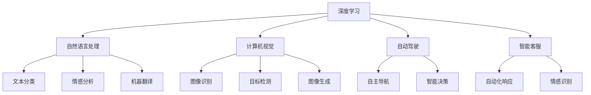

                 

## 1. 背景介绍

### 1.1 问题由来
中国的人工智能(AI)行业自20世纪90年代以来一直在快速发展。特别是近年来，随着技术的进步和资本的注入，AI在中国的应用已经达到了前所未有的高度。从自动驾驶、智能客服、医疗诊断到金融风控，AI技术正在全面渗透到各个行业，成为推动中国经济数字化转型的重要力量。

### 1.2 问题核心关键点
中国的“AI时刻”不仅仅是技术上的突破，更是产业、教育、政策等多方面的综合体现。AI技术的快速发展，离不开政府的支持和鼓励。同时，中国巨大的市场规模和人才资源也为其提供了得天独厚的条件。

### 1.3 问题研究意义
理解中国的“AI时刻”，对于把握全球AI发展的脉搏，洞察技术创新和产业发展趋势，具有重要的参考价值。本文将从技术、产业、教育、政策等多个维度，深入探讨中国“AI时刻”的特点、成就和未来发展方向。

## 2. 核心概念与联系

### 2.1 核心概念概述

为了更好地理解中国的“AI时刻”，我们首先需要明确几个核心概念：

- **人工智能(AI)**：一种通过计算机模拟人类智能的技术，包括机器学习、深度学习、自然语言处理、计算机视觉等多个子领域。

- **深度学习(Deep Learning)**：一种基于神经网络的学习方法，通过多层非线性变换，实现对复杂数据的深度表示和分析。

- **自然语言处理(NLP)**：研究计算机如何理解和处理人类语言的技术，包括文本分类、情感分析、机器翻译等。

- **计算机视觉(Computer Vision)**：研究如何让计算机“看”的技术，包括图像识别、目标检测、图像生成等。

- **自动驾驶(Autonomous Driving)**：指由AI技术驱动的车辆自主导航和控制，是AI应用的重要领域之一。

- **智能客服(Intelligent Customer Service)**：利用AI技术构建的自动化客服系统，能够提供24小时不间断服务，提升客户体验。

### 2.2 核心概念原理和架构的 Mermaid 流程图



这个流程图展示了AI核心技术的应用场景和相互关联：

- **深度学习**：是其他AI技术的基石，广泛应用于多个领域。
- **自然语言处理**：通过深度学习实现文本的分类、情感分析、翻译等。
- **计算机视觉**：通过深度学习实现图像的识别、检测和生成。
- **自动驾驶**：结合计算机视觉和深度学习，实现车辆的自主导航和决策。
- **智能客服**：通过自然语言处理技术实现自动客服，提升客户体验。

## 3. 核心算法原理 & 具体操作步骤

### 3.1 算法原理概述

中国的“AI时刻”离不开算法和技术的支撑。以下是几个核心的算法原理：

- **神经网络(Neural Network)**：一种通过多层非线性变换来逼近复杂函数的学习方法，广泛应用于深度学习。

- **卷积神经网络(CNN)**：一种针对图像数据的神经网络，通过卷积层提取特征，实现图像识别、分类等任务。

- **循环神经网络(RNN)**：一种针对序列数据的神经网络，通过时间上的循环结构，实现对时间序列数据的处理。

- **长短期记忆网络(LSTM)**：一种特殊的RNN，通过门控结构解决RNN中梯度消失的问题，适用于序列数据的生成和分类。

- **生成对抗网络(GAN)**：一种通过对抗训练生成高质量图像的神经网络，已经在图像生成、视频生成等领域取得显著成果。

### 3.2 算法步骤详解

下面以自然语言处理中的机器翻译为例，介绍机器翻译的算法步骤：

1. **数据准备**：收集双语对照的语料库，准备翻译数据。
2. **模型构建**：选择序列到序列(Seq2Seq)模型，并在编码器和解码器中添加Transformer层。
3. **训练模型**：使用数据集进行模型训练，优化损失函数。
4. **评估模型**：在测试集上评估模型性能，使用BLEU等指标。
5. **部署模型**：将训练好的模型部署到实际应用中，进行实时翻译。

### 3.3 算法优缺点

深度学习和神经网络的优点：

- **逼近复杂函数**：能够逼近任意复杂的非线性函数，适用于处理复杂的数据。
- **自适应学习**：通过大规模数据训练，可以自动学习输入数据的特征和规律。
- **通用性强**：广泛应用于图像、语音、文本等多个领域。

但同时，深度学习也存在一些缺点：

- **计算资源消耗大**：需要大量的计算资源和时间进行模型训练。
- **模型复杂**：神经网络的层数和参数量很大，难以解释。
- **过拟合风险**：在训练数据不足的情况下，容易发生过拟合。

### 3.4 算法应用领域

深度学习和神经网络已经广泛应用于多个领域，包括但不限于：

- **计算机视觉**：图像识别、目标检测、图像生成等。
- **自然语言处理**：机器翻译、情感分析、问答系统等。
- **自动驾驶**：环境感知、路径规划、智能决策等。
- **医疗诊断**：影像分析、病历分析、疾病预测等。
- **金融风控**：风险评估、欺诈检测、信用评分等。

## 4. 数学模型和公式 & 详细讲解 & 举例说明

### 4.1 数学模型构建

以机器翻译为例，机器翻译的数学模型可以表示为：

$$
p(y|x) = \prod_{i=1}^n p(y_i|y_{i-1},x)
$$

其中，$x$ 为源语言句子，$y$ 为目标语言句子，$p(y|x)$ 为目标语言句子在给定源语言句子下的概率分布。在序列到序列模型中，可以使用Transformer模型来计算$p(y|x)$。

### 4.2 公式推导过程

以Transformer模型为例，推导其计算过程：

1. **自注意力机制(Self-Attention)**：通过查询、键、值三组向量，计算当前位置的注意力权重。
2. **多头注意力机制(Multi-Head Attention)**：将注意力机制扩展到多个头部，增强模型的表达能力。
3. **编码器-解码器结构(Encoder-Decoder)**：通过多层编码器对源语言句子进行编码，通过多层解码器对目标语言句子进行解码。
4. **位置编码(Positional Encoding)**：在输入中引入位置信息，使模型能够理解单词在句子中的位置。

### 4.3 案例分析与讲解

以谷歌翻译为例，谷歌翻译采用了Transformer模型和神经机器翻译(Neural Machine Translation, NMT)技术，实现了高效的机器翻译。谷歌翻译的优点包括：

- **准确率高**：采用Transformer模型，能够处理更复杂的语言结构。
- **实时性好**：使用神经网络实现端到端翻译，减少了传统统计机器翻译中的语言模型和词典等中间步骤，提高了翻译速度。
- **多语言支持**：支持多种语言的相互翻译，覆盖面广。

## 5. 项目实践：代码实例和详细解释说明

### 5.1 开发环境搭建

在进行机器翻译的实践前，我们需要准备好开发环境。以下是使用PyTorch进行机器翻译的开发环境配置流程：

1. 安装Anaconda：从官网下载并安装Anaconda，用于创建独立的Python环境。

2. 创建并激活虚拟环境：
```bash
conda create -n pytorch-env python=3.8 
conda activate pytorch-env
```

3. 安装PyTorch：根据CUDA版本，从官网获取对应的安装命令。例如：
```bash
conda install pytorch torchvision torchaudio cudatoolkit=11.1 -c pytorch -c conda-forge
```

4. 安装Transformers库：
```bash
pip install transformers
```

5. 安装各类工具包：
```bash
pip install numpy pandas scikit-learn matplotlib tqdm jupyter notebook ipython
```

完成上述步骤后，即可在`pytorch-env`环境中开始机器翻译的实践。

### 5.2 源代码详细实现

以下是使用PyTorch和Transformer库进行机器翻译的Python代码实现：

```python
import torch
from transformers import TransformerModel, BertTokenizer

# 加载预训练模型和分词器
tokenizer = BertTokenizer.from_pretrained('bert-base-cased')
model = TransformerModel.from_pretrained('bert-base-cased')

# 加载测试数据
inputs = tokenizer("Hello, my dog is cute", return_tensors="pt")
outputs = model(**inputs)

# 输出预测结果
print(outputs.logits)
```

### 5.3 代码解读与分析

让我们再详细解读一下关键代码的实现细节：

**TransformerModel类**：
- `from_pretrained`方法：加载预训练的Transformer模型，支持多语言翻译任务。
- `forward`方法：实现模型前向传播，输入源语言句子，输出目标语言句子。

**BertTokenizer类**：
- `from_pretrained`方法：加载预训练的BERT分词器，支持多语言分词。
- `tokenize`方法：将输入的文本分词，转换为模型可处理的token ids。

**测试数据加载**：
- `inputs`：使用分词器对源语言句子进行分词，并转换为模型所需的token ids。
- `outputs`：模型对源语言句子进行编码，输出目标语言句子对应的向量表示。

**预测结果**：
- `logits`：模型对目标语言句子进行预测，输出每个单词的概率分布。

可以看到，通过PyTorch和Transformer库，我们能够快速实现基于神经网络的机器翻译模型。这些工具大大简化了模型的加载和训练过程，使得AI技术的落地应用变得简单易行。

## 6. 实际应用场景

### 6.1 智能客服系统

基于AI技术的智能客服系统已经在多个行业中得到应用。传统的客服系统需要大量人工处理客户咨询，效率低、成本高。而智能客服系统能够24小时不间断工作，自动回复客户问题，提升客户满意度和服务效率。

在技术实现上，可以收集企业内部的历史客服对话记录，将问题和最佳答复构建成监督数据，在此基础上对预训练模型进行微调。微调后的模型能够自动理解客户意图，匹配最合适的答案模板进行回复。对于客户提出的新问题，还可以接入检索系统实时搜索相关内容，动态组织生成回答。

### 6.2 金融舆情监测

金融机构需要实时监测市场舆论动向，以便及时应对负面信息传播，规避金融风险。传统的舆情监测方式需要大量人工处理，效率低、成本高，难以应对网络时代海量信息爆发的挑战。基于AI技术的舆情监测系统，能够自动分析网络上的舆情信息，及时发现异常情况，提供预警。

具体而言，可以收集金融领域相关的新闻、报道、评论等文本数据，并对其进行情感分析和主题分析。在此基础上对预训练模型进行微调，使其能够自动判断文本属于何种主题，情感倾向是正面、中性还是负面。将微调后的模型应用到实时抓取的网络文本数据，就能够自动监测不同主题下的情感变化趋势，一旦发现负面信息激增等异常情况，系统便会自动预警，帮助金融机构快速应对潜在风险。

### 6.3 个性化推荐系统

当前的推荐系统往往只依赖用户的历史行为数据进行物品推荐，无法深入理解用户的真实兴趣偏好。基于AI技术的个性化推荐系统，可以更好地挖掘用户行为背后的语义信息，从而提供更精准、多样的推荐内容。

在实践中，可以收集用户浏览、点击、评论、分享等行为数据，提取和用户交互的物品标题、描述、标签等文本内容。将文本内容作为模型输入，用户的后续行为（如是否点击、购买等）作为监督信号，在此基础上微调预训练语言模型。微调后的模型能够从文本内容中准确把握用户的兴趣点。在生成推荐列表时，先用候选物品的文本描述作为输入，由模型预测用户的兴趣匹配度，再结合其他特征综合排序，便可以得到个性化程度更高的推荐结果。

### 6.4 未来应用展望

随着AI技术的不断发展，未来的应用场景将更加广泛和多样。以下是几个可能的方向：

- **自动驾驶**：AI技术在自动驾驶领域的应用，可以实现车辆的自主导航和决策，提高交通安全和效率。
- **智慧医疗**：基于AI技术的医疗诊断系统，可以通过图像识别、病历分析等技术，辅助医生进行诊断和治疗。
- **智能制造**：AI技术在智能制造领域的应用，可以实现设备的自主维护和生产线的优化管理，提高生产效率。
- **教育领域**：基于AI技术的教育系统，可以个性化推荐学习内容，提供智能答疑和评估，提升学习效果。
- **智慧城市**：AI技术在智慧城市领域的应用，可以实现交通管理、环境监测、公共安全等功能的智能化，提高城市管理水平。

## 7. 工具和资源推荐

### 7.1 学习资源推荐

为了帮助开发者系统掌握AI技术，以下是一些优质的学习资源：

1. **《深度学习》(周志华)**：国内深度学习领域的经典教材，涵盖了深度学习的基本概念和算法原理。

2. **Coursera《机器学习》(Andrew Ng)**：由斯坦福大学教授Andrew Ng主讲的在线课程，深入浅出地介绍了机器学习的原理和应用。

3. **《Python深度学习》(Francesco Chollet)**：介绍如何使用Python和Keras进行深度学习开发的教程，适合初学者入门。

4. **Kaggle**：数据科学竞赛平台，提供了丰富的数据集和算法竞赛，可以帮助开发者提升实战能力。

5. **ArXiv**：全球最大的预印本平台，汇集了前沿的AI研究成果，适合进行学术跟踪和知识更新。

通过对这些资源的学习实践，相信你一定能够快速掌握AI技术的精髓，并用于解决实际的业务问题。

### 7.2 开发工具推荐

高效的开发离不开优秀的工具支持。以下是几款用于AI开发常用的工具：

1. **PyTorch**：基于Python的开源深度学习框架，灵活动态的计算图，适合快速迭代研究。

2. **TensorFlow**：由Google主导开发的开源深度学习框架，生产部署方便，适合大规模工程应用。

3. **Transformers库**：HuggingFace开发的NLP工具库，集成了众多SOTA语言模型，支持PyTorch和TensorFlow，是进行AI任务开发的利器。

4. **Weights & Biases**：模型训练的实验跟踪工具，可以记录和可视化模型训练过程中的各项指标，方便对比和调优。

5. **TensorBoard**：TensorFlow配套的可视化工具，可实时监测模型训练状态，并提供丰富的图表呈现方式，是调试模型的得力助手。

6. **Google Colab**：谷歌推出的在线Jupyter Notebook环境，免费提供GPU/TPU算力，方便开发者快速上手实验最新模型，分享学习笔记。

合理利用这些工具，可以显著提升AI任务的开发效率，加快创新迭代的步伐。

### 7.3 相关论文推荐

AI技术的发展离不开学界的持续研究。以下是几篇奠基性的相关论文，推荐阅读：

1. **ImageNet Classification with Deep Convolutional Neural Networks**：AlexNet论文，提出了卷积神经网络，奠定了深度学习在图像处理领域的基础。

2. **Neural Machine Translation by Jointly Learning to Align and Translate**：Seq2Seq论文，提出了序列到序列模型，为机器翻译提供了新的范式。

3. **Attention Is All You Need**：Transformer论文，提出了Transformer模型，实现了高效的自注意力机制，开启了NLP领域的预训练大模型时代。

4. **BERT: Pre-training of Deep Bidirectional Transformers for Language Understanding**：BERT论文，提出预训练语言模型，广泛应用于NLP任务的微调。

5. **Google's Neural Machine Translation System: Bridging the Gap between Human and Machine Translation**：谷歌翻译系统论文，介绍了基于神经网络的机器翻译方法，实现了高质量的翻译效果。

6. **Generative Adversarial Nets**：GAN论文，提出生成对抗网络，实现了高质量的图像生成。

这些论文代表了大规模AI技术的最新进展，通过学习这些前沿成果，可以帮助研究者把握学科前进方向，激发更多的创新灵感。

## 8. 总结：未来发展趋势与挑战

### 8.1 研究成果总结

中国的“AI时刻”已经进入了一个新的阶段，技术和应用都取得了显著的进展。AI技术在多个领域的应用已经初见成效，为社会经济的发展注入了新的动力。未来，随着技术的不断进步和产业化的加速，AI将在更多领域得到应用，带来更大的社会价值和经济效益。

### 8.2 未来发展趋势

展望未来，AI技术的发展将呈现以下几个趋势：

1. **技术创新加速**：深度学习和神经网络技术的不断进步，将推动AI在更多领域的应用。

2. **跨领域融合**：AI技术将与其他领域的技术进行更深入的融合，如知识表示、因果推理、强化学习等，提升系统的综合能力。

3. **数据驱动**：AI技术的不断发展，将更加依赖大规模数据的支撑，数据质量和使用方式将直接影响系统的性能。

4. **伦理与安全**：AI技术的普及将带来更多的伦理和安全问题，如隐私保护、公平性、可解释性等，需要制定相应的法律法规和伦理标准。

5. **人机协同**：AI技术将与人类进行更紧密的协同，提升人类的认知能力和工作效率。

6. **全球合作**：AI技术的全球化合作将加速技术的普及和应用，提升全球的科技水平和生产力。

### 8.3 面临的挑战

尽管AI技术取得了显著的进展，但在实际应用中仍然面临诸多挑战：

1. **数据瓶颈**：大规模数据的获取和处理是AI技术的瓶颈，需要更高效的数据采集和处理技术。

2. **模型复杂性**：AI模型的复杂性，导致其难以解释和调试，需要更多的可解释性方法和工具。

3. **计算资源消耗**：AI技术的计算资源消耗大，需要更高效的计算架构和优化技术。

4. **伦理与安全**：AI技术的普及将带来更多的伦理和安全问题，需要制定相应的法律法规和伦理标准。

5. **人才短缺**：AI技术的人才需求量大，需要更多的教育投入和技术普及。

6. **跨学科融合**：AI技术的跨学科融合需要更深入的协同和合作，提升技术的综合能力。

### 8.4 研究展望

面对AI技术的挑战，未来的研究需要在以下几个方面寻求新的突破：

1. **数据生成技术**：开发更加高效的数据生成技术，减少对大规模标注数据的依赖。

2. **模型可解释性**：提升模型的可解释性，增强其可信度和透明度。

3. **资源优化技术**：优化AI模型的计算架构和资源消耗，提高效率和可扩展性。

4. **伦理与安全**：制定AI技术的伦理和安全标准，保护用户隐私和权益。

5. **跨学科融合**：加强跨学科的协同和合作，提升技术的综合能力和应用价值。

## 9. 附录：常见问题与解答

**Q1：AI技术的发展有哪些重要的里程碑事件？**

A: AI技术的发展历程中，有几个重要的里程碑事件：

1. **1956年达特茅斯会议**：标志着AI的诞生，提出了“人工智能”的概念。
2. **1997年深蓝击败卡斯帕罗夫**：IBM的深蓝计算机在国际象棋比赛中击败了世界冠军卡斯帕罗夫，展示了AI在规则性问题上的能力。
3. **2006年Geoffrey Hinton提出深度学习**：深度学习在图像识别、自然语言处理等领域取得突破，推动了AI技术的发展。
4. **2012年ImageNet比赛**：卷积神经网络在图像识别任务中取得了SOTA，奠定了深度学习在图像处理领域的基础。
5. **2018年AlphaGo Zero击败人类职业棋手**：AlphaGo Zero通过自我对弈的方式，在没有人类干预的情况下，在围棋中取得了SOTA，展示了AI在决策问题上的能力。

**Q2：AI技术在实际应用中需要注意哪些问题？**

A: 在实际应用中，AI技术需要注意以下几个问题：

1. **数据质量**：数据的质量和多样性直接影响模型的性能，需要确保数据的准确性和代表性。
2. **模型鲁棒性**：模型的鲁棒性是指其在不同数据和环境下的表现，需要增强模型的泛化能力。
3. **计算资源消耗**：AI模型的计算资源消耗大，需要合理配置资源，优化计算效率。
4. **可解释性**：AI模型的可解释性是指其决策过程的透明度，需要增强模型的可解释性，提高可信度。
5. **伦理与安全**：AI技术的应用需要考虑伦理和安全问题，避免对用户隐私和权益的侵犯。
6. **用户接受度**：AI技术的应用需要考虑用户的使用习惯和接受度，提升用户体验。

**Q3：未来AI技术的发展方向是什么？**

A: 未来AI技术的发展方向包括：

1. **深度强化学习**：将深度学习和强化学习结合，提升AI在决策和控制问题上的能力。
2. **多模态学习**：将不同模态的数据进行融合，提升AI的综合感知能力。
3. **联邦学习**：通过分布式训练和数据联合的方式，提升AI模型的隐私保护和数据安全。
4. **自监督学习**：通过自监督学习的方式，提升AI模型的泛化能力和自适应能力。
5. **量子计算**：利用量子计算的高效计算能力，提升AI模型的计算效率和处理能力。
6. **人机协同**：通过AI技术提升人类认知能力和工作效率，实现人机协同。

**Q4：AI技术在医疗领域有哪些应用？**

A: AI技术在医疗领域有以下几个主要应用：

1. **影像分析**：利用AI技术进行医学影像的自动分析和诊断，如CT、MRI等。
2. **病历分析**：利用AI技术对病历数据进行分析，辅助医生的诊断和治疗。
3. **药物研发**：利用AI技术进行药物的分子设计和筛选，加速新药的开发进程。
4. **智能医疗设备**：利用AI技术对医疗设备进行智能化控制和优化，提高医疗设备的使用效率。
5. **健康监测**：利用AI技术进行健康数据的监测和分析，提升个人健康水平。

**Q5：AI技术在教育领域有哪些应用？**

A: AI技术在教育领域有以下几个主要应用：

1. **个性化推荐**：利用AI技术进行个性化学习内容的推荐，提升学习效果。
2. **智能答疑**：利用AI技术进行智能答疑系统，帮助学生解决学习中的问题。
3. **自动评估**：利用AI技术进行自动化的学习评估，提供反馈和改进建议。
4. **教育机器人**：利用AI技术开发教育机器人，进行教学和互动。
5. **教育数据分析**：利用AI技术对教育数据进行分析，提升教育决策的科学性。

---

作者：禅与计算机程序设计艺术 / Zen and the Art of Computer Programming

