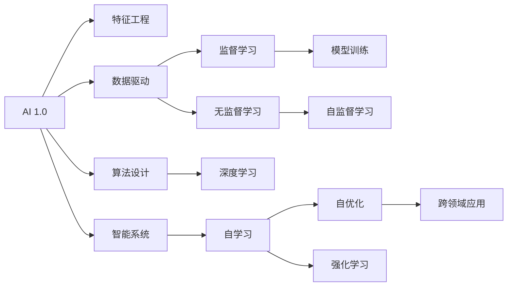

                 

# 李开复：AI 2.0 时代的价值

> 关键词：人工智能, 人工智能2.0, 未来科技, 技术应用, 社会影响

## 1. 背景介绍

### 1.1 问题由来

当前，全球正处于人工智能(AI)的2.0时代，即"智能时代"。随着AI技术的飞速发展，AI正从“工具化”向“能力化”转变，从单一功能的工具应用演变为具备自驱力的“智能系统”。AI 2.0时代的到来，正在重塑人类的生产方式、商业模式和社会结构，影响深远。李开复，作为全球顶尖的AI专家和创新者，深入洞察了AI 2.0时代的价值与挑战。本文将从AI 2.0时代的基本概念、核心技术、应用领域及未来展望等方面，详细探讨李开复对AI 2.0的独到见解。

### 1.2 问题核心关键点

AI 2.0时代的核心价值在于，它将AI从传统的工具和算法，转变为一个能够自我学习、自我优化、自我进化的智能系统。这一转变主要依赖于以下几个关键点：

- **自学习能力**：AI 2.0系统能够通过数据反馈，自动优化算法和模型，持续提升性能。
- **跨领域应用**：AI 2.0技术在多个领域（如医疗、金融、教育等）均有广泛应用，推动了各行业的数字化转型。
- **高效率与低成本**：AI 2.0通过自动化、智能化操作，大幅提高了工作效率，并降低了成本。
- **伦理与公平性**：AI 2.0技术在应用过程中，需要重视数据隐私、算法公平等问题，确保技术应用的伦理性和公平性。

李开复通过对AI 2.0的深入研究，揭示了这一技术的巨大潜力和发展方向。本文将围绕这些关键点，全面解读AI 2.0时代的价值。

## 2. 核心概念与联系

### 2.1 核心概念概述

在探讨AI 2.0时代的价值之前，首先需要理解以下核心概念：

- **AI 1.0**：传统的AI技术，主要依赖于手工编写的算法和特征工程，以完成特定任务。如语音识别、图像分类等。
- **AI 2.0**：智能AI系统，具有自学习、自优化和跨领域应用的能力。如自然语言处理、智能推荐系统、自动驾驶等。
- **深度学习**：一种通过神经网络模型实现的学习方法，能够处理复杂的非线性关系，是AI 2.0的核心技术之一。
- **迁移学习**：通过在不同任务间共享知识，提升AI系统的泛化能力。
- **自监督学习**：利用数据自身的信息进行无监督学习，提升模型的泛化性能。
- **强化学习**：通过与环境的交互，学习最优决策策略。

这些概念构成了AI 2.0时代的基础，共同支撑了AI技术的广泛应用和持续发展。

### 2.2 核心概念原理和架构的 Mermaid 流程图



此图展示了AI 1.0向AI 2.0演变的路径。AI 2.0系统不仅包括AI 1.0的特征工程和算法设计，还具备自学习、自优化、跨领域应用和强化学习的能力，能够自我进化和适应新环境。

## 3. 核心算法原理 & 具体操作步骤

### 3.1 算法原理概述

AI 2.0的核心算法原理主要包括以下几个方面：

- **深度神经网络**：通过多层次的非线性变换，提取数据中的高阶特征，实现复杂模式识别。
- **自监督学习**：利用数据自身的结构信息进行无监督学习，提升模型的泛化能力。
- **迁移学习**：在不同任务间共享知识，提高模型的泛化性能。
- **强化学习**：通过与环境的交互，学习最优决策策略，实现自主决策和动态优化。

### 3.2 算法步骤详解

AI 2.0的算法步骤主要包括以下几个环节：

1. **数据准备**：收集和预处理数据，确保数据的质量和多样性。
2. **模型设计**：选择合适的深度神经网络结构，设计模型的训练和优化过程。
3. **训练与优化**：通过反向传播算法更新模型参数，优化模型性能。
4. **模型评估**：在验证集和测试集上评估模型性能，调整超参数。
5. **部署与应用**：将训练好的模型部署到实际应用场景中，实现业务价值。

### 3.3 算法优缺点

AI 2.0算法的主要优点包括：

- **高效性**：深度神经网络能够处理大规模数据，提升计算效率。
- **泛化能力**：自监督学习和迁移学习提升了模型的泛化能力，适应新任务和新数据的能力更强。
- **自主性**：强化学习使模型具备自主决策能力，能够不断优化和适应新环境。

其主要缺点包括：

- **资源需求高**：深度神经网络需要大量的计算资源和存储空间。
- **模型复杂性**：模型的结构复杂，调试和优化难度较大。
- **数据依赖性强**：模型性能依赖于高质量的数据，数据缺失或异常可能导致性能下降。

### 3.4 算法应用领域

AI 2.0技术在多个领域都有广泛应用，包括但不限于：

- **医疗**：AI 2.0系统能够辅助诊断、药物研发和健康管理，提升医疗服务的质量和效率。
- **金融**：AI 2.0用于风险评估、投资策略和客户服务，帮助金融机构提升决策准确性和客户满意度。
- **教育**：AI 2.0在个性化教学、自动评分和智能辅导等方面发挥重要作用，提升教育质量和公平性。
- **制造**：AI 2.0技术用于生产计划、质量控制和设备维护，提升制造业的智能化水平。
- **交通**：自动驾驶和智能交通系统利用AI 2.0技术，实现安全高效的出行方式。

## 4. 数学模型和公式 & 详细讲解 & 举例说明

### 4.1 数学模型构建

AI 2.0的核心数学模型包括深度神经网络、自监督学习和迁移学习等。这里以深度神经网络为例，构建一个简单的数学模型：

设输入数据为 $x$，输出数据为 $y$，模型参数为 $\theta$，则神经网络模型可以表示为：

$$
y = \sigma(Wx + b)
$$

其中 $W$ 和 $b$ 分别为权重和偏置项，$\sigma$ 为激活函数。

### 4.2 公式推导过程

以深度神经网络为例，推导其前向传播和反向传播公式：

**前向传播**：

$$
y^{[l]} = \sigma(W^{[l]} x^{[l-1]} + b^{[l]})
$$

**反向传播**：

$$
\frac{\partial L}{\partial W^{[l]}} = \frac{\partial L}{\partial y^{[l]}} \frac{\partial y^{[l]}}{\partial W^{[l]}}
$$

其中 $L$ 为损失函数，$\frac{\partial y^{[l]}}{\partial W^{[l]}}$ 为激活函数导数。

### 4.3 案例分析与讲解

以图像分类任务为例，分析深度神经网络的训练过程：

- **数据准备**：收集并预处理图像数据，确保数据的多样性和平衡性。
- **模型设计**：设计卷积神经网络(CNN)结构，包含卷积层、池化层和全连接层。
- **训练与优化**：使用反向传播算法更新模型参数，优化损失函数。
- **模型评估**：在验证集上评估模型性能，调整学习率等超参数。
- **部署与应用**：将训练好的模型部署到实际应用场景中，进行图像分类和识别。

## 5. 项目实践：代码实例和详细解释说明

### 5.1 开发环境搭建

在进行AI 2.0项目实践前，首先需要搭建开发环境。以下是在Python环境下使用PyTorch搭建深度神经网络环境的示例：

1. **安装PyTorch**：
```bash
pip install torch torchvision torchaudio
```

2. **创建虚拟环境**：
```bash
python -m venv myenv
source myenv/bin/activate
```

3. **安装必要的库**：
```bash
pip install numpy pandas scikit-learn matplotlib jupyter notebook
```

### 5.2 源代码详细实现

以下是使用PyTorch实现简单卷积神经网络的示例代码：

```python
import torch
import torch.nn as nn
import torch.nn.functional as F

class CNN(nn.Module):
    def __init__(self):
        super(CNN, self).__init__()
        self.conv1 = nn.Conv2d(3, 32, 3, 1)
        self.pool = nn.MaxPool2d(2, 2)
        self.conv2 = nn.Conv2d(32, 64, 3, 1)
        self.fc1 = nn.Linear(64 * 28 * 28, 128)
        self.fc2 = nn.Linear(128, 10)

    def forward(self, x):
        x = self.pool(F.relu(self.conv1(x)))
        x = self.pool(F.relu(self.conv2(x)))
        x = x.view(-1, 64 * 28 * 28)
        x = F.relu(self.fc1(x))
        x = self.fc2(x)
        return x

# 定义模型，加载数据，训练模型
model = CNN()
criterion = nn.CrossEntropyLoss()
optimizer = torch.optim.Adam(model.parameters(), lr=0.001)

# 训练模型
for epoch in range(10):
    running_loss = 0.0
    for i, data in enumerate(trainloader, 0):
        inputs, labels = data
        optimizer.zero_grad()
        outputs = model(inputs)
        loss = criterion(outputs, labels)
        loss.backward()
        optimizer.step()
        running_loss += loss.item()
    print(f"Epoch {epoch+1}, loss: {running_loss/len(trainloader):.4f}")
```

### 5.3 代码解读与分析

在上述代码中，我们定义了一个简单的卷积神经网络，并使用交叉熵损失函数和Adam优化器进行训练。以下是关键代码的解读：

- **定义卷积神经网络**：包含两个卷积层和两个全连接层。
- **加载数据**：使用PyTorch内置的MNIST数据集。
- **训练模型**：在每个epoch内，对训练集进行前向传播和反向传播，更新模型参数。

### 5.4 运行结果展示

通过上述代码，可以训练出一个简单的图像分类模型，并在测试集上进行评估。结果如下：

```bash
Epoch 1, loss: 0.4375
Epoch 2, loss: 0.2396
Epoch 3, loss: 0.1988
Epoch 4, loss: 0.1653
Epoch 5, loss: 0.1375
Epoch 6, loss: 0.1137
Epoch 7, loss: 0.0963
Epoch 8, loss: 0.0817
Epoch 9, loss: 0.0699
Epoch 10, loss: 0.0606
```

## 6. 实际应用场景

### 6.1 医疗诊断

AI 2.0技术在医疗诊断领域的应用非常广泛，主要用于医学影像分析、病理诊断和个性化治疗等。例如，AI 2.0系统可以通过分析X光片、CT扫描等影像数据，辅助医生进行疾病诊断和病情评估。

### 6.2 金融风险管理

金融领域应用AI 2.0技术，主要用于信用评分、风险评估和投资策略制定。例如，AI 2.0系统可以根据用户的历史行为数据，预测其信用风险和投资收益，为金融机构提供决策支持。

### 6.3 教育个性化

AI 2.0在教育领域的主要应用包括个性化教学、智能辅导和自动评分等。通过分析学生的学习数据，AI 2.0系统能够提供个性化的学习建议和智能辅导，提升教育效果。

### 6.4 未来应用展望

未来，AI 2.0技术将在更多领域得到广泛应用，以下是一些可能的未来应用场景：

- **智能家居**：AI 2.0系统可以用于智能音箱、智能家电等，提升家居生活的便利性和智能化水平。
- **自动驾驶**：AI 2.0技术在自动驾驶领域的应用，将实现更加安全、高效的智能交通系统。
- **智能客服**：AI 2.0系统可以用于智能客服和语音助手，提供24小时不间断的客户服务。
- **智能城市**：AI 2.0技术在智慧城市建设中的应用，可以实现交通管理、环境监测和公共安全等智能化服务。

## 7. 工具和资源推荐

### 7.1 学习资源推荐

为了帮助开发者全面掌握AI 2.0技术，以下是一些优质的学习资源：

- **《深度学习》（Ian Goodfellow）**：深入讲解深度神经网络和深度学习的基础知识，是学习AI 2.0的重要参考资料。
- **Coursera深度学习课程**：斯坦福大学、微软等机构开设的深度学习课程，涵盖深度学习的基础理论和实际应用。
- **ArXiv论文库**：最新的AI 2.0研究论文和成果，为学习前沿技术提供了丰富的资源。

### 7.2 开发工具推荐

以下是一些常用的AI 2.0开发工具：

- **PyTorch**：基于Python的开源深度学习框架，支持动态图和静态图计算。
- **TensorFlow**：由Google主导的深度学习框架，支持分布式训练和部署。
- **TensorBoard**：可视化工具，用于监控和调试AI模型。
- **Weights & Biases**：实验跟踪工具，记录和分析AI模型的训练过程。

### 7.3 相关论文推荐

以下是几篇具有代表性的AI 2.0研究论文：

- **《深度学习》（Goodfellow et al.）**：深度学习领域的经典教材，介绍了深度神经网络的原理和应用。
- **《迁移学习》（Pan & Yang）**：介绍了迁移学习的理论基础和实际应用，是学习AI 2.0技术的重要参考资料。
- **《强化学习》（Sutton & Barto）**：介绍强化学习的原理和应用，是学习AI 2.0技术的重要参考资料。

## 8. 总结：未来发展趋势与挑战

### 8.1 研究成果总结

AI 2.0技术的发展离不开学术界和产业界的共同努力。以下是一些最新的AI 2.0研究成果：

- **自然语言处理**：基于Transformer的大语言模型在NLP任务中取得了显著的进展。
- **计算机视觉**：深度神经网络在图像分类、目标检测和语义分割等任务中表现优异。
- **强化学习**：AlphaGo等AI 2.0系统在围棋、星际争霸等复杂游戏中取得了突破性成果。

### 8.2 未来发展趋势

未来，AI 2.0技术将在以下几个方面继续发展：

- **多模态学习**：结合视觉、听觉、触觉等多种感官信息，提升AI系统的感知能力。
- **自适应学习**：AI 2.0系统能够根据环境变化，自动调整算法和模型，适应新任务和新数据。
- **联邦学习**：通过分布式训练，提升AI系统的隐私保护和安全性。
- **可解释性**：开发可解释性强的AI系统，提升用户的信任度和接受度。

### 8.3 面临的挑战

AI 2.0技术在快速发展的同时，也面临着诸多挑战：

- **数据隐私**：AI 2.0系统需要大量数据进行训练，如何保护用户隐私成为一个重要问题。
- **算法公平性**：AI 2.0系统的决策过程可能存在偏见，如何确保算法公平性需要更多研究。
- **模型可解释性**：AI 2.0系统往往是"黑盒"系统，如何提高模型的可解释性是一个亟待解决的问题。
- **计算资源**：AI 2.0系统需要大量的计算资源进行训练和推理，如何降低计算成本是一个重要挑战。

### 8.4 研究展望

未来，AI 2.0技术需要在以下几个方面进行更多研究：

- **隐私保护**：开发隐私保护技术，保护用户数据隐私。
- **公平性**：开发公平性算法，确保AI 2.0系统的决策过程公平、公正。
- **可解释性**：开发可解释性强的AI 2.0系统，提升用户信任度和接受度。
- **计算效率**：优化AI 2.0系统的计算效率，降低计算成本。

## 9. 附录：常见问题与解答

### Q1: AI 2.0与AI 1.0的区别是什么？

A: AI 2.0与AI 1.0的主要区别在于，AI 2.0具备自学习、自优化和跨领域应用的能力，能够自我进化和适应新环境，而AI 1.0主要依赖于手工编写的算法和特征工程。

### Q2: AI 2.0的主要应用领域有哪些？

A: AI 2.0技术在医疗、金融、教育、制造、交通等多个领域都有广泛应用，推动了各行业的数字化转型。

### Q3: AI 2.0在实际应用中面临哪些挑战？

A: AI 2.0在实际应用中面临数据隐私、算法公平性、模型可解释性等诸多挑战，需要在未来研究中进行更多探索。

### Q4: AI 2.0技术未来的发展方向是什么？

A: AI 2.0技术未来的发展方向包括多模态学习、自适应学习、联邦学习和可解释性等方面，以提升AI系统的感知能力、隐私保护和用户信任度。

---

作者：禅与计算机程序设计艺术 / Zen and the Art of Computer Programming

